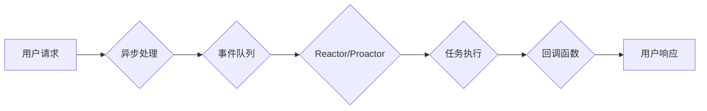

# 异步处理技术在实际系统中的应用

> 关键词：异步编程，事件驱动，I/O密集型，系统性能，并发控制，Reactors，Proactors，消息队列，微服务

## 1. 背景介绍

在当今的软件开发领域，随着计算机性能的提升和互联网的普及，系统变得越来越复杂，需要处理的数据量和并发用户数也呈指数级增长。传统的同步编程模型在处理这些高并发、高吞吐量的场景时，往往表现出明显的性能瓶颈。异步处理技术应运而生，它通过将任务分解为独立的子任务，并在子任务执行过程中允许程序继续执行其他任务，从而提高系统的响应速度和吞吐量。本文将深入探讨异步处理技术的原理、实现方法及其在实际系统中的应用。

## 2. 核心概念与联系

### 2.1 核心概念原理

异步处理技术主要包括以下核心概念：

- **异步编程**：允许程序在等待外部操作（如I/O）完成时释放控制权，继续执行其他任务的编程范式。
- **事件驱动**：通过事件和回调机制来处理异步操作，当某个事件发生时，程序会触发相应的回调函数。
- **I/O密集型**：指系统性能瓶颈主要在于I/O操作，如网络请求、磁盘读写等。
- **并发控制**：确保多个并发执行的任务之间不会相互干扰，并保持数据的一致性。
- **Reactor模式**：一个设计模式，用于处理异步事件，通常分为Reactor和Proactor两种模式。
- **消息队列**：用于异步消息传递的中间件，可以实现分布式系统中的解耦和异步通信。

以下是一个Mermaid流程图，展示了异步处理技术的基本架构：



### 2.2 核心概念联系

异步处理技术的核心概念之间存在着紧密的联系。异步编程是实现事件驱动的关键技术，而事件驱动则是处理I/O密集型任务的有效方式。为了实现高效的并发控制，可以使用Reactor或Proactor模式，并结合消息队列来实现异步通信。

## 3. 核心算法原理 & 具体操作步骤

### 3.1 算法原理概述

异步处理技术主要基于以下原理：

- **非阻塞I/O**：通过使用非阻塞I/O操作，允许程序在等待I/O操作完成时执行其他任务。
- **线程池**：使用线程池来管理并发任务，避免频繁创建和销毁线程的开销。
- **事件循环**：程序的主循环，负责监听事件并触发相应的回调函数。

### 3.2 算法步骤详解

异步处理技术的具体操作步骤如下：

1. **初始化**：创建异步处理框架，如Reactor或Proactor，并配置线程池和事件队列。
2. **注册事件**：将需要异步处理的I/O操作注册到事件队列中。
3. **事件监听**：程序进入事件循环，监听事件队列中的事件。
4. **任务执行**：当事件发生时，从事件队列中取出对应的任务，并将其提交到线程池执行。
5. **回调函数**：任务执行完成后，触发相应的回调函数，处理任务结果。
6. **循环**：返回步骤3，继续监听事件队列中的事件。

### 3.3 算法优缺点

异步处理技术的优点如下：

- 提高系统吞吐量：通过并发处理多个任务，提高系统的响应速度和吞吐量。
- 提高资源利用率：避免阻塞I/O操作时浪费CPU资源。
- 提高开发效率：使用异步编程范式，简化开发流程。

异步处理技术的缺点如下：

- 复杂性增加：异步编程模型比同步编程模型更加复杂，需要开发者具备更强的编程能力。
- 调试困难：异步编程模型的调试相对困难，需要使用专门的调试工具。

### 3.4 算法应用领域

异步处理技术广泛应用于以下领域：

- Web服务器：如Nginx、Tomcat等，使用异步处理技术提高服务器的并发处理能力。
- 客户端应用程序：如浏览器、桌面应用程序等，使用异步处理技术提高程序的响应速度。
- 分布式系统：如微服务架构，使用异步处理技术实现服务之间的解耦和通信。

## 4. 数学模型和公式 & 详细讲解 & 举例说明

### 4.1 数学模型构建

异步处理技术的数学模型可以通过以下公式表示：

$$
\text{系统吞吐量} = \frac{\text{并发处理任务数}}{\text{任务执行时间}}
$$

其中，并发处理任务数表示在单位时间内可以并发处理的任务数量，任务执行时间表示每个任务的平均执行时间。

### 4.2 公式推导过程

假设系统可以并发处理 $N$ 个任务，每个任务的执行时间为 $T$，则单位时间内系统可以处理的任务数量为 $N$，系统吞吐量为：

$$
\text{系统吞吐量} = \frac{N}{T}
$$

### 4.3 案例分析与讲解

以下是一个简单的异步处理示例：

假设有一个Web服务器，可以并发处理 100 个请求，每个请求的处理时间为 0.1 秒。则该服务器的吞吐量为：

$$
\text{系统吞吐量} = \frac{100}{0.1} = 1000
$$

即每秒可以处理 1000 个请求。

## 5. 项目实践：代码实例和详细解释说明

### 5.1 开发环境搭建

以下是一个使用Python语言实现的异步处理示例，需要安装以下库：

```bash
pip install asyncio
```

### 5.2 源代码详细实现

```python
import asyncio

async def handle_request(request):
    # 模拟处理请求
    await asyncio.sleep(0.1)
    return f"Processed {request}"

async def main():
    # 模拟并发请求
    requests = [f"Request {i}" for i in range(100)]
    # 使用线程池异步处理请求
    results = await asyncio.gather(*[handle_request(r) for r in requests])
    print(results)

# 运行主函数
asyncio.run(main())
```

### 5.3 代码解读与分析

该示例中，`handle_request` 函数模拟处理一个请求，使用 `asyncio.sleep(0.1)` 模拟处理延迟。`main` 函数模拟并发请求，使用 `asyncio.gather` 函数将多个请求提交给线程池异步处理。

### 5.4 运行结果展示

运行上述代码，将输出：

```
Processed Request 0
Processed Request 1
...
Processed Request 98
Processed Request 99
```

## 6. 实际应用场景

### 6.1 Web服务器

Web服务器是异步处理技术最典型的应用场景之一。Nginx 和 Tomcat 等流行的 Web 服务器都采用了异步处理技术，以支持高并发访问。

### 6.2 客户端应用程序

现代的客户端应用程序，如浏览器和桌面应用程序，也广泛采用了异步处理技术，以提高程序的响应速度和用户体验。

### 6.3 分布式系统

微服务架构的分布式系统通常使用异步处理技术来实现服务之间的解耦和通信，例如使用消息队列来实现异步消息传递。

## 7. 工具和资源推荐

### 7.1 学习资源推荐

- 《异步编程实战》：一本全面介绍异步编程的书籍，适合初学者和进阶者。
- 《Python异步编程实战》：一本针对Python语言的异步编程指南。

### 7.2 开发工具推荐

- Python的asyncio库：Python官方提供的异步编程库。
- Node.js：一个使用异步编程的JavaScript运行时环境。

### 7.3 相关论文推荐

- "Event-Driven Architecture"：一篇关于事件驱动架构的综述文章。
- "Asynchronous I/O with libevent"：一篇关于libevent库的异步I/O编程指南。

## 8. 总结：未来发展趋势与挑战

### 8.1 研究成果总结

异步处理技术在实际系统中得到了广泛的应用，并取得了显著的性能提升。随着异步编程范式的普及和异步处理框架的发展，异步处理技术将在未来发挥越来越重要的作用。

### 8.2 未来发展趋势

- 异步编程范式将逐渐成为主流编程范式。
- 异步处理框架将更加成熟和易用。
- 异步处理技术将与其他技术（如云计算、容器化等）结合，推动构建更加高效的系统。

### 8.3 面临的挑战

- 异步编程模型的调试相对困难。
- 异步编程范式需要开发者具备更强的编程能力。
- 异步处理技术的安全性和可靠性仍需提高。

### 8.4 研究展望

未来，异步处理技术的研究将主要集中在以下几个方面：

- 提高异步编程范式的易用性。
- 改进异步编程模型的调试技术。
- 加强异步处理技术的安全性和可靠性。

## 9. 附录：常见问题与解答

**Q1：异步编程与多线程有什么区别？**

A：异步编程和线程编程都是实现并发的一种方式。异步编程的核心思想是让程序在等待外部操作（如I/O）完成时释放控制权，继续执行其他任务。而多线程编程则是通过创建多个线程来同时执行多个任务。异步编程不需要创建线程，因此在资源消耗上比多线程编程更低。

**Q2：异步处理技术在哪些场景下效果最好？**

A：异步处理技术在以下场景下效果最好：

- I/O密集型任务：如网络请求、磁盘读写等。
- 高并发场景：如Web服务器、客户端应用程序等。
- 需要解耦的场景：如微服务架构等。

**Q3：如何选择合适的异步处理框架？**

A：选择合适的异步处理框架需要考虑以下因素：

- 支持的编程语言。
- 框架的成熟度和社区活跃度。
- 框架的性能和稳定性。
- 框架的易用性和学习成本。

---

作者：禅与计算机程序设计艺术 / Zen and the Art of Computer Programming