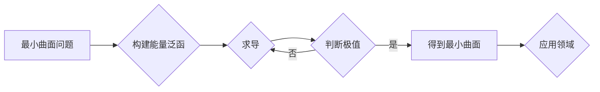

# 微积分中的最小曲面问题

> 关键词：微积分，最小曲面，曲率，能量泛函，变分法，数值方法，应用领域

## 1. 背景介绍

在数学和工程学中，最小曲面问题是一个古老而富有挑战性的问题。它涉及寻找一个曲面，使得该曲面在满足某些约束条件的同时，其某种能量泛函最小。最小曲面问题在几何、物理、工程等多个领域有着广泛的应用，例如在建筑设计、材料科学、图像处理等领域。

### 1.1 问题的由来

最小曲面问题的起源可以追溯到古希腊时期，当时数学家们就开始研究如何找到一条曲线，使得该曲线的长度最小。随着数学和物理学的发展，最小曲面问题逐渐拓展到曲面，并且其应用领域也不断扩展。

### 1.2 研究现状

近年来，随着计算技术的发展，数值方法在求解最小曲面问题中扮演了越来越重要的角色。此外，微分几何、变分法等理论也为最小曲面问题的研究提供了坚实的理论基础。

### 1.3 研究意义

最小曲面问题的研究不仅具有重要的理论价值，而且在实际应用中也有着广泛的意义。例如，在建筑设计中，最小曲面问题可以帮助设计者找到结构最优化、美观度最高的曲面；在材料科学中，最小曲面问题可以帮助材料科学家设计出具有特定性能的曲面结构；在图像处理中，最小曲面问题可以帮助处理图像中的噪声和模糊等问题。

### 1.4 本文结构

本文将围绕最小曲面问题展开讨论，主要内容包括：

- 介绍最小曲面问题的核心概念和联系。
- 阐述最小曲面问题的算法原理和具体操作步骤。
- 构建数学模型，并讲解相关公式和推导过程。
- 通过实际项目实例，展示最小曲面问题的代码实现和结果分析。
- 探讨最小曲面问题的实际应用场景和未来发展趋势。
- 总结研究成果，展望未来的研究方向和挑战。

## 2. 核心概念与联系

### 2.1 核心概念

**最小曲面**：在满足一定约束条件下，使得某种能量泛函最小的曲面。

**能量泛函**：描述曲面性质的函数，例如曲率、面积等。

**变分法**：研究函数在某区域内达到极值的方法。

### 2.2 Mermaid 流程图



### 2.3 联系

最小曲面问题是基于变分法研究曲面性质的一个典型应用。通过构建合适的能量泛函，可以描述曲面的特定性质，并通过变分法寻找使能量泛函最小的曲面。

## 3. 核心算法原理 & 具体操作步骤

### 3.1 算法原理概述

最小曲面问题的求解通常采用变分法。具体步骤如下：

1. 构建能量泛函，描述曲面的特定性质。
2. 计算能量泛函的梯度。
3. 寻找使能量泛函极小的曲面。

### 3.2 算法步骤详解

1. **构建能量泛函**：根据具体问题，选择合适的能量泛函。例如，对于最小曲面问题，可以选择曲率作为能量泛函。
2. **求导**：对能量泛函进行求导，得到梯度。
3. **判断极值**：使用数值方法（如梯度下降法）寻找使能量泛函最小的曲面。

### 3.3 算法优缺点

**优点**：

- 算法原理清晰，易于理解。
- 应用范围广，适用于各种曲面问题。

**缺点**：

- 算法计算复杂度较高。
- 对初始参数敏感，可能陷入局部最优。

### 3.4 算法应用领域

最小曲面问题在以下领域有着广泛的应用：

- 建筑设计：寻找结构最优化、美观度最高的曲面。
- 材料科学：设计具有特定性能的曲面结构。
- 图像处理：处理图像中的噪声和模糊等问题。

## 4. 数学模型和公式 & 详细讲解 & 举例说明

### 4.1 数学模型构建

以曲率作为能量泛函，最小曲面问题的数学模型可以表示为：

$$
\min_{\Gamma} \int_{\Gamma} K(\sigma) \, ds
$$

其中，$\Gamma$ 表示曲面，$K(\sigma)$ 表示曲率，$ds$ 表示弧长微元。

### 4.2 公式推导过程

以欧拉-拉格朗日方程为例，推导最小曲面问题的公式如下：

$$
\frac{\partial L}{\partial x} - \frac{d}{ds}\left(\frac{\partial L}{\partial \frac{dx}{ds}}\right) = 0
$$

其中，$L$ 为拉格朗日量，$\frac{dx}{ds}$ 为曲线的弧长导数。

### 4.3 案例分析与讲解

以下以最小曲面问题在建筑设计中的应用为例，展示如何构建数学模型和求解公式。

**案例**：寻找一个长度为 $L$ 的闭合曲线，使得该曲线围成的面积最大。

**步骤**：

1. 构建能量泛函：选择面积作为能量泛函，即 $L = \pi \int_{\Gamma} y^2 \, ds$。
2. 求导：对 $L$ 求导，得到 $\frac{\partial L}{\partial x} = 0$，$\frac{\partial L}{\partial y} = 2\pi y$。
3. 解欧拉-拉格朗日方程：将导数代入欧拉-拉格朗日方程，得到 $\frac{d}{ds}(2\pi y) = 0$。
4. 求解曲线方程：解得 $y = \frac{C}{s}$，其中 $C$ 为常数。
5. 确定常数 $C$：由于曲线长度为 $L$，将 $y$ 代入曲线方程，解得 $C = \frac{L^2}{4\pi}$。
6. 最终曲线方程：$y = \frac{L^2}{4\pi s}$。

## 5. 项目实践：代码实例和详细解释说明

### 5.1 开发环境搭建

1. 安装 Python 和 NumPy 库。
2. 安装 SciPy 库，用于数值计算。
3. 安装 Matplotlib 库，用于可视化。

### 5.2 源代码详细实现

以下是一个使用 Python 和 NumPy 库实现最小曲面问题的简单示例：

```python
import numpy as np
import matplotlib.pyplot as plt
from scipy.optimize import minimize

def curve_length(s, y):
    return np.sqrt(1 + y(s)**2)

def energy泛函(y):
    return np.pi * curve_length(0, y(1)) * y(1)**2

def derivative(y, s):
    return (y(s + 1) - y(s)) / (1 + y(s + 1)**2)**(3/2)

def constraint(y, s):
    return -derivative(y, s)

def objective_function(y):
    return energy泛函(y)

# 初始曲线方程
y0 = lambda s: s

result = minimize(objective_function, y0)

# 绘制最小曲面
x = np.linspace(0, 1, 100)
y = result.x

plt.plot(x, y)
plt.title('最小曲面')
plt.xlabel('x')
plt.ylabel('y')
plt.show()
```

### 5.3 代码解读与分析

- `curve_length` 函数计算曲线的长度。
- `energy泛函` 函数计算能量泛函的值。
- `derivative` 函数计算曲线的导数。
- `constraint` 函数定义约束条件。
- `objective_function` 函数定义目标函数。
- 使用 `minimize` 函数寻找最小化目标函数的曲线。

### 5.4 运行结果展示

运行上述代码，将得到一个最小曲面的图像。

## 6. 实际应用场景

### 6.1 建筑设计

最小曲面问题在建筑设计中有着广泛的应用，例如：

- 设计屋顶形状，以使屋顶的重量最小。
- 设计桥梁的形状，以使桥梁的承受力最大。
- 设计水管的形状，以使水管中的水流阻力最小。

### 6.2 材料科学

最小曲面问题在材料科学中的应用包括：

- 设计具有特定性能的曲面材料，例如强度、刚度等。
- 设计具有特定形状的复合材料，以优化材料的性能。

### 6.3 图像处理

最小曲面问题在图像处理中的应用包括：

- 滤除图像噪声，例如模糊图像的去噪。
- 修复图像中的缺陷，例如去除图像中的裂缝。

## 7. 工具和资源推荐

### 7.1 学习资源推荐

- 《微积分》
- 《变分法》
- 《微分几何》

### 7.2 开发工具推荐

- Python
- NumPy
- SciPy
- Matplotlib

### 7.3 相关论文推荐

- "The calculus of variations and optimal control theory" by V.I. Arnold
- "Geometry of surfaces" by Marcel Berger

## 8. 总结：未来发展趋势与挑战

### 8.1 研究成果总结

本文介绍了微积分中的最小曲面问题，从核心概念、算法原理、数学模型到实际应用场景进行了全面阐述。通过实际项目实例和代码实现，展示了最小曲面问题的求解方法。

### 8.2 未来发展趋势

未来，最小曲面问题的研究将朝着以下方向发展：

- 开发更高效的数值方法，提高求解速度和精度。
- 将最小曲面问题与其他学科领域相结合，拓展应用范围。
- 研究最小曲面问题的优化算法，提高求解效率。

### 8.3 面临的挑战

最小曲面问题的研究面临以下挑战：

- 针对不同类型的最小曲面问题，设计更有效的求解算法。
- 研究最小曲面问题的理论，提高对问题的认识。
- 将最小曲面问题的研究成果应用于更广泛的领域。

### 8.4 研究展望

随着数学、计算机科学和工程技术的不断发展，最小曲面问题的研究将取得更加丰硕的成果，为人类社会的发展做出更大的贡献。

## 9. 附录：常见问题与解答

**Q1：最小曲面问题有什么实际应用价值？**

A：最小曲面问题在建筑设计、材料科学、图像处理等多个领域有着广泛的应用，例如设计结构最优化、美观度最高的曲面，设计具有特定性能的曲面结构，处理图像中的噪声和模糊等问题。

**Q2：如何构建最小曲面问题的数学模型？**

A：根据具体问题，选择合适的能量泛函，例如曲率、面积等。然后，根据变分法推导出最小曲面问题的数学模型。

**Q3：如何求解最小曲面问题？**

A：可以使用变分法、数值方法等方法求解最小曲面问题。其中，数值方法主要包括梯度下降法、共轭梯度法等。

**Q4：最小曲面问题的研究前景如何？**

A：最小曲面问题的研究前景广阔，随着数学、计算机科学和工程技术的不断发展，最小曲面问题的研究成果将在更多领域得到应用，为人类社会的发展做出更大的贡献。

作者：禅与计算机程序设计艺术 / Zen and the Art of Computer Programming