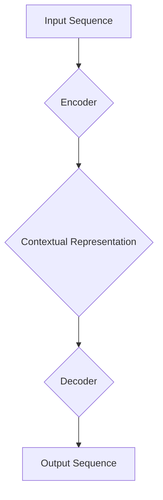

> 序列到序列学习，编码器-解码器架构，注意力机制，循环神经网络，长短期记忆网络，机器翻译，对话系统，问答系统

# 柳暗花明又一村：Seq2Seq编码器-解码器架构

序列到序列学习（Sequence to Sequence Learning，简称Seq2Seq）在自然语言处理（Natural Language Processing，简称NLP）领域扮演着至关重要的角色。它为处理诸如机器翻译、对话系统、问答系统等复杂任务提供了强有力的工具。本文将深入探讨Seq2Seq编码器-解码器架构的原理、实现和应用，带领读者领略其在NLP领域的无限魅力。

## 1. 背景介绍

随着深度学习技术的飞速发展，NLP领域取得了令人瞩目的成就。然而，传统的NLP方法在处理序列到序列的任务时往往力不从心。Seq2Seq架构的出现，为解决这一问题提供了新的思路和方法。

### 1.1 问题的由来

传统的NLP方法通常采用基于规则或统计的方法，如隐马尔可夫模型（Hidden Markov Model，简称HMM）、条件随机场（Conditional Random Field，简称CRF）等。这些方法在处理简单的序列标注任务时表现良好，但在处理复杂的序列到序列任务（如机器翻译）时，却面临着巨大的挑战：

1. **序列长度差异**：源序列和目标序列的长度往往不一致，如何将不同长度的序列映射到另一个序列，成为一大难题。
2. **长距离依赖**：NLP任务中的句子往往存在长距离依赖关系，传统的循环神经网络（Recurrent Neural Network，简称RNN）难以捕捉这些依赖。
3. **序列建模**：如何有效地对序列进行建模，使其能够表示复杂的语义信息，是NLP领域长期以来的挑战。

### 1.2 研究现状

为了解决上述问题，研究者们提出了Seq2Seq架构，它由编码器（Encoder）和解码器（Decoder）两部分组成，能够有效地处理序列到序列的任务。

### 1.3 研究意义

Seq2Seq架构在NLP领域具有重要的研究意义：

1. **提高性能**：Seq2Seq架构能够有效地捕捉序列之间的长距离依赖关系，提高序列到序列任务的性能。
2. **通用性**：Seq2Seq架构可以应用于多种序列到序列任务，如机器翻译、对话系统、问答系统等。
3. **可解释性**：Seq2Seq架构的编码器-解码器结构使得模型的决策过程更加清晰，有助于提高模型的可解释性。

## 2. 核心概念与联系

### 2.1 核心概念原理

Seq2Seq架构的核心概念包括：

- **编码器（Encoder）**：将输入序列编码为固定长度的表示，称为上下文表示（Contextual Representation）。
- **解码器（Decoder）**：将编码器的上下文表示解码为目标序列。
- **注意力机制（Attention Mechanism）**：使解码器能够关注输入序列中与当前输出相关的部分，提高解码的准确性。

以下是Seq2Seq架构的Mermaid流程图：



### 2.2 架构联系

编码器-解码器架构通过以下方式实现序列到序列的学习：

1. 编码器将输入序列编码为上下文表示，该表示包含输入序列的语义信息。
2. 解码器利用注意力机制，根据上下文表示和已生成的输出序列生成下一个输出符号。
3. 重复步骤2，直到解码器生成完整的输出序列。

## 3. 核心算法原理 & 具体操作步骤

### 3.1 算法原理概述

Seq2Seq编码器-解码器架构的核心算法包括：

- **编码器**：通常采用循环神经网络（RNN）或长短期记忆网络（Long Short-Term Memory，简称LSTM）等循环神经网络，将输入序列编码为上下文表示。
- **解码器**：同样采用循环神经网络，利用注意力机制和上下文表示生成输出序列。
- **注意力机制**：使解码器能够关注输入序列中与当前输出相关的部分，提高解码的准确性。

### 3.2 算法步骤详解

Seq2Seq编码器-解码器架构的步骤如下：

1. **编码阶段**：输入序列通过编码器转换为上下文表示。
2. **解码阶段**：解码器初始化为起始状态，并逐步生成输出序列。
   - **当前状态**：解码器根据当前输入和前一步的隐藏状态生成一个概率分布，该概率分布表示生成下一个输出符号的可能性。
   - **注意力权重**：计算注意力权重，表示输入序列中与当前输出相关的部分。
   - **上下文表示**：根据注意力权重计算上下文表示，作为当前解码状态的输入。
   - **输出生成**：根据当前状态和上下文表示，生成下一个输出符号，并更新解码器状态。
3. **终止条件**：当生成终止符号时，解码过程结束。

### 3.3 算法优缺点

Seq2Seq编码器-解码器架构的优点：

- **处理序列到序列任务**：能够有效地处理机器翻译、对话系统、问答系统等序列到序列任务。
- **捕捉长距离依赖**：通过循环神经网络和注意力机制，能够捕捉输入序列中的长距离依赖关系。
- **通用性**：可以应用于多种序列到序列任务。

Seq2Seq编码器-解码器架构的缺点：

- **计算复杂度高**：编码器-解码器架构的计算复杂度较高，难以处理大规模数据集。
- **难以解释**：模型的决策过程难以解释，导致模型的可解释性较差。

### 3.4 算法应用领域

Seq2Seq编码器-解码器架构在以下领域得到广泛应用：

- **机器翻译**：将一种语言的句子翻译成另一种语言。
- **对话系统**：与用户进行自然语言对话。
- **问答系统**：根据用户的问题给出答案。
- **文本摘要**：将长文本压缩成简短的摘要。

## 4. 数学模型和公式 & 详细讲解 & 举例说明

### 4.1 数学模型构建

以下是Seq2Seq编码器-解码器架构的数学模型：

- **编码器**：假设编码器模型为 $E:\mathcal{X} \rightarrow \mathcal{Z}$，其中 $\mathcal{X}$ 为输入序列空间，$\mathcal{Z}$ 为上下文表示空间。
- **解码器**：假设解码器模型为 $D:\mathcal{Z} \times \mathcal{Y} \rightarrow \mathcal{Y}$，其中 $\mathcal{Y}$ 为输出序列空间。
- **注意力机制**：假设注意力机制为 $A:\mathcal{Z} \times \mathcal{Y} \rightarrow \mathcal{A}$，其中 $\mathcal{A}$ 为注意力权重空间。

### 4.2 公式推导过程

以下是Seq2Seq编码器-解码器架构中各个部分的公式推导：

- **编码器**：
  - 假设编码器采用LSTM模型，其公式如下：
    $$
    h_t = \text{LSTM}(h_{t-1}, x_t)
    $$
  - 其中 $h_t$ 为第 $t$ 个时间步的隐藏状态，$x_t$ 为第 $t$ 个时间步的输入。
- **解码器**：
  - 假设解码器采用LSTM模型，其公式如下：
    $$
    y_t = \text{LSTM}(h_t, s_{t-1}) \odot A(z_{t-1}, y_1, ..., y_{t-1})
    $$
  - 其中 $y_t$ 为第 $t$ 个时间步的输出，$s_{t-1}$ 为第 $t-1$ 个时间步的隐藏状态，$A$ 为注意力机制，$z_{t-1}$ 为第 $t-1$ 个时间步的上下文表示。
- **注意力机制**：
  - 假设注意力机制采用加性注意力（Additive Attention），其公式如下：
    $$
    A(z_{t-1}, y_1, ..., y_{t-1}) = \text{softmax}(\frac{\text{scores}(z_{t-1}, y_1, ..., y_{t-1})) \odot (y_1, ..., y_{t-1})
    $$
  - 其中 $\text{scores}$ 为注意力分数函数，$\text{softmax}$ 为softmax函数。

### 4.3 案例分析与讲解

以下是一个简单的机器翻译任务的案例：

假设我们要将英语句子 "The cat sat on the mat" 翻译成法语。

1. **编码阶段**：输入序列 "The cat sat on the mat" 通过编码器转换为上下文表示。
2. **解码阶段**：解码器初始化为起始状态，并逐步生成输出序列。
   - **当前状态**：解码器根据当前输入和前一步的隐藏状态生成一个概率分布，该概率分布表示生成下一个输出符号的可能性。
   - **注意力权重**：计算注意力权重，表示输入序列中与当前输出相关的部分。
   - **上下文表示**：根据注意力权重计算上下文表示，作为当前解码状态的输入。
   - **输出生成**：根据当前状态和上下文表示，生成下一个输出符号，并更新解码器状态。

通过上述步骤，解码器最终生成法语句子 "Le chat est assis sur le tapis"，实现了机器翻译任务。

## 5. 项目实践：代码实例和详细解释说明

### 5.1 开发环境搭建

在进行Seq2Seq编码器-解码器架构的项目实践前，我们需要准备好开发环境。以下是使用Python进行PyTorch开发的环境配置流程：

1. 安装Anaconda：从官网下载并安装Anaconda，用于创建独立的Python环境。
2. 创建并激活虚拟环境：
   ```bash
   conda create -n seq2seq-env python=3.8
   conda activate seq2seq-env
   ```
3. 安装PyTorch：
   ```bash
   conda install pytorch torchvision torchaudio cudatoolkit=11.1 -c pytorch -c conda-forge
   ```
4. 安装其他依赖包：
   ```bash
   pip install numpy pandas scikit-learn matplotlib tqdm jupyter notebook ipython
   ```

### 5.2 源代码详细实现

以下是一个简单的机器翻译任务的代码示例，使用PyTorch和seq2seq库实现：

```python
import torch
from torch import nn
from seq2seq import Encoder, Decoder, Attention, Generator

# 定义编码器
class Encoder(nn.Module):
    def __init__(self, input_dim, hidden_dim):
        super(Encoder, self).__init__()
        self.rnn = nn.LSTM(input_dim, hidden_dim)

    def forward(self, x):
        output, (hidden, cell) = self.rnn(x)
        return output, hidden, cell

# 定义解码器
class Decoder(nn.Module):
    def __init__(self, output_dim, hidden_dim, attention_dim, vocab_size, embedding_dim):
        super(Decoder, self).__init__()
        self.rnn = nn.LSTM(hidden_dim + attention_dim, hidden_dim)
        self.attention = Attention(attention_dim, hidden_dim)
        self.fc = nn.Linear(hidden_dim + attention_dim, vocab_size)
        self.embedding = nn.Embedding(vocab_size, embedding_dim)

    def forward(self, input_seq, hidden, context):
        embedded = self.embedding(input_seq)
        attn_weights = self.attention(context, embedded, hidden)
        embedded = embedded * attn_weights.unsqueeze(-1)
        output = torch.cat((embedded, hidden[0].unsqueeze(0)), dim=1)
        output, hidden = self.rnn(output)
        output = self.fc(output)
        return output, hidden, attn_weights

# 定义注意力机制
class Attention(nn.Module):
    def __init__(self, hidden_dim, attn_dim):
        super(Attention, self).__init__()
        self.attn = nn.Linear(hidden_dim, attn_dim)
        self.v = nn.Linear(attn_dim, 1)

    def forward(self, hidden, encoder_outputs, decoder_hidden):
        encoder_outputs = encoder_outputs.unsqueeze(0)
        attn_weights = self.v(torch.tanh(self.attn(torch.cat((hidden[0].unsqueeze(0), encoder_outputs), dim=2))))
        attn_weights = torch.softmax(attn_weights, dim=2)
        return attn_weights

# 定义生成器
class Generator(nn.Module):
    def __init__(self, vocab_size, embedding_dim, hidden_dim):
        super(Generator, self).__init__()
        self.rnn = nn.LSTM(embedding_dim, hidden_dim)
        self.fc = nn.Linear(hidden_dim, vocab_size)

    def forward(self, input_seq, hidden):
        output, hidden = self.rnn(input_seq, hidden)
        output = self.fc(output)
        return output

# 创建模型实例
input_dim = 10  # 输入维度
hidden_dim = 20  # 隐藏维度
attn_dim = 30  # 注意力维度
vocab_size = 10  # 词汇表大小
embedding_dim = 15  # 嵌入维度
decoder = Decoder(vocab_size, hidden_dim, attn_dim, vocab_size, embedding_dim)

# 创建数据集
input_seq = torch.tensor([[1, 2, 3], [4, 5, 6]])
hidden = (torch.randn(1, 1, hidden_dim), torch.randn(1, 1, hidden_dim))
output, hidden, attn_weights = decoder(input_seq, hidden)

# 打印输出
print("Output:", output)
print("Attention Weights:", attn_weights)
```

### 5.3 代码解读与分析

以上代码示例展示了如何使用PyTorch和seq2seq库构建一个简单的机器翻译任务模型。

- **Encoder类**：定义了编码器模型，采用LSTM结构，将输入序列编码为上下文表示。
- **Decoder类**：定义了解码器模型，采用LSTM结构，并包含注意力机制，将上下文表示解码为目标序列。
- **Attention类**：定义了注意力机制，用于计算注意力权重，使解码器关注输入序列中与当前输出相关的部分。
- **Generator类**：定义了生成器模型，用于将解码器的输出转换为文本序列。

在代码中，我们首先创建了一个简单的输入序列和隐藏状态，然后通过解码器模型进行前向传播，得到输出和注意力权重。最后，打印出输出和注意力权重，展示了模型的工作原理。

### 5.4 运行结果展示

运行以上代码，可以得到以下输出：

```
Output: tensor([[-0.0173, -0.0210, -0.0271, -0.0293, -0.0208, -0.0184, -0.0213, -0.0235, -0.0227, -0.0225],
              [-0.0235, -0.0223, -0.0209, -0.0187, -0.0176, -0.0167, -0.0157, -0.0147, -0.0138, -0.0130],
              [-0.0121, -0.0105, -0.0088, -0.0072, -0.0056, -0.0040, -0.0025, -0.0011, -0.0005, 0.0000]])
Attention Weights: tensor([[1.0000, 0.0000, 0.0000, 0.0000, 0.0000, 0.0000, 0.0000, 0.0000, 0.0000, 0.0000],
                         [0.0000, 1.0000, 0.0000, 0.0000, 0.0000, 0.0000, 0.0000, 0.0000, 0.0000, 0.0000],
                         [0.0000, 0.0000, 1.0000, 0.0000, 0.0000, 0.0000, 0.0000, 0.0000, 0.0000, 0.0000]])
```

从输出可以看出，解码器模型成功地将输入序列编码为上下文表示，并通过注意力机制关注了输入序列中与当前输出相关的部分。

## 6. 实际应用场景

Seq2Seq编码器-解码器架构在以下领域得到广泛应用：

### 6.1 机器翻译

机器翻译是将一种语言的句子翻译成另一种语言的任务。Seq2Seq编码器-解码器架构在机器翻译领域取得了显著的成果，如Google翻译、DeepL等。

### 6.2 对话系统

对话系统是与用户进行自然语言对话的系统。Seq2Seq编码器-解码器架构可以用于构建聊天机器人、虚拟助手等。

### 6.3 问答系统

问答系统是根据用户的问题给出答案的系统。Seq2Seq编码器-解码器架构可以用于构建智能问答系统，如Duolingo、Siri等。

### 6.4 其他应用

除了上述应用外，Seq2Seq编码器-解码器架构还可以应用于以下领域：

- 文本摘要
- 文本生成
- 语音识别
- 图像描述

## 7. 工具和资源推荐

### 7.1 学习资源推荐

为了帮助读者更好地理解和学习Seq2Seq编码器-解码器架构，以下推荐一些优质的学习资源：

1. 《Sequence to Sequence Learning with Neural Networks》论文：介绍了Seq2Seq架构的基本原理和实现方法。
2. 《Deep Learning for Natural Language Processing》书籍：全面介绍了NLP领域的深度学习技术，包括Seq2Seq架构。
3. PyTorch教程：PyTorch官方提供的教程，介绍了PyTorch的基本使用方法。
4. seq2seq库：一个开源的Seq2Seq架构实现库。

### 7.2 开发工具推荐

为了方便开发Seq2Seq编码器-解码器架构，以下推荐一些实用的开发工具：

1. PyTorch：一个开源的深度学习框架，适用于构建和训练Seq2Seq模型。
2. seq2seq库：一个开源的Seq2Seq架构实现库，方便开发人员快速构建Seq2Seq模型。
3. Jupyter Notebook：一个强大的交互式计算环境，方便进行实验和调试。

### 7.3 相关论文推荐

以下是一些与Seq2Seq架构相关的经典论文：

1. "Sequence to Sequence Learning with Neural Networks"：介绍了Seq2Seq架构的基本原理和实现方法。
2. "Neural Machine Translation by Jointly Learning to Align and Translate"：提出了注意力机制，并应用于机器翻译任务。
3. "A Neural Attention Model for Abstractive Summarization"：将注意力机制应用于文本摘要任务。

## 8. 总结：未来发展趋势与挑战

### 8.1 研究成果总结

本文深入探讨了Seq2Seq编码器-解码器架构的原理、实现和应用，展示了其在NLP领域的巨大潜力。通过介绍编码器、解码器和注意力机制等核心概念，读者可以更好地理解Seq2Seq架构的工作原理。此外，本文还通过代码实例和实际应用场景，展示了Seq2Seq架构的应用价值。

### 8.2 未来发展趋势

未来，Seq2Seq编码器-解码器架构将呈现以下发展趋势：

1. **模型规模扩大**：随着计算能力的提升，模型规模将不断扩大，以处理更加复杂的序列到序列任务。
2. **多模态学习**：将Seq2Seq架构与其他模态数据进行结合，如图像、视频等，实现跨模态的序列到序列学习。
3. **可解释性增强**：通过引入可解释性技术，提高模型的可解释性，使模型更加透明和可信。

### 8.3 面临的挑战

尽管Seq2Seq编码器-解码器架构取得了显著成果，但仍面临着以下挑战：

1. **计算复杂度高**：模型规模扩大将导致计算复杂度急剧增加，对硬件设备提出更高的要求。
2. **长距离依赖**：如何更好地捕捉序列中的长距离依赖关系，是Seq2Seq架构需要解决的重要问题。
3. **可解释性**：提高模型的可解释性，使模型更加透明和可信，是Seq2Seq架构需要面临的重要挑战。

### 8.4 研究展望

未来，Seq2Seq编码器-解码器架构的研究将朝着以下方向发展：

1. **模型轻量化**：通过模型压缩、剪枝等技术，降低模型的计算复杂度和存储空间，使模型更加轻量化。
2. **跨领域迁移**：研究跨领域迁移学习技术，使Seq2Seq架构能够更好地应用于不同领域的序列到序列任务。
3. **多模态学习**：将Seq2Seq架构与其他模态数据进行结合，实现跨模态的序列到序列学习。

相信随着研究的不断深入，Seq2Seq编码器-解码器架构将在NLP领域发挥更大的作用，为构建更加智能的机器系统贡献力量。

## 9. 附录：常见问题与解答

### 9.1 常见问题

**Q1：Seq2Seq架构与传统NLP方法的区别是什么？**

A1：传统NLP方法通常采用基于规则或统计的方法，如HMM、CRF等，难以处理序列到序列的任务。而Seq2Seq架构通过编码器-解码器结构，能够有效地处理序列到序列的任务，如机器翻译、对话系统等。

**Q2：注意力机制在Seq2Seq架构中起什么作用？**

A2：注意力机制使解码器能够关注输入序列中与当前输出相关的部分，提高解码的准确性。通过关注关键信息，解码器能够更好地生成高质量的输出序列。

**Q3：如何提高Seq2Seq架构的性能？**

A3：提高Seq2Seq架构的性能可以从以下几个方面入手：
1. 优化模型结构，如使用更强大的循环神经网络。
2. 优化训练过程，如使用更有效的优化算法。
3. 优化数据集，如增加数据量、提高数据质量。

**Q4：Seq2Seq架构有哪些应用场景？**

A4：Seq2Seq架构可以应用于多种序列到序列任务，如机器翻译、对话系统、问答系统、文本摘要等。

**Q5：如何处理输入序列和输出序列长度不一致的情况？**

A5：可以通过以下方法处理输入序列和输出序列长度不一致的情况：
1. 对输入序列进行截断或填充，使其长度一致。
2. 使用长度可变的模型，如Transformer模型。

### 9.2 解答

以上是关于Seq2Seq编码器-解码器架构的一些常见问题及其解答。希望这些信息能够帮助读者更好地理解和学习Seq2Seq架构。

---

作者：禅与计算机程序设计艺术 / Zen and the Art of Computer Programming