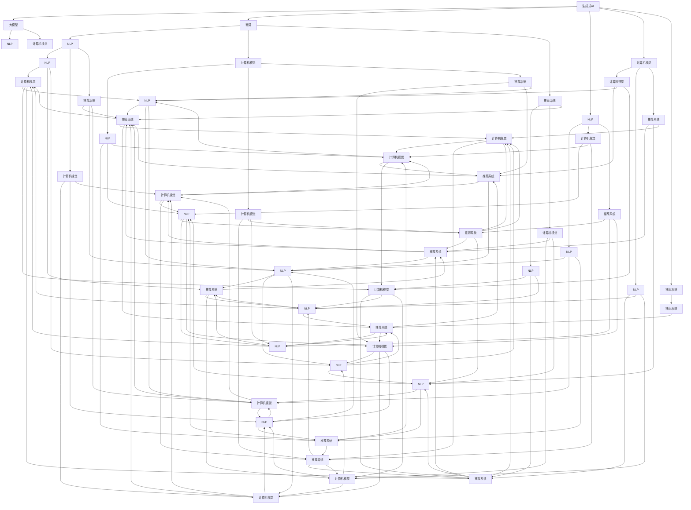
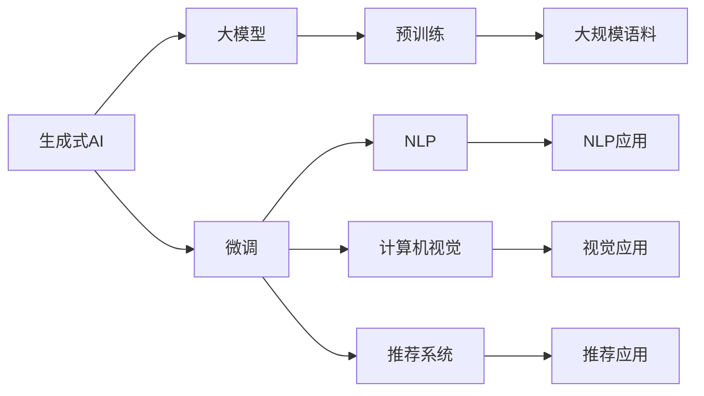
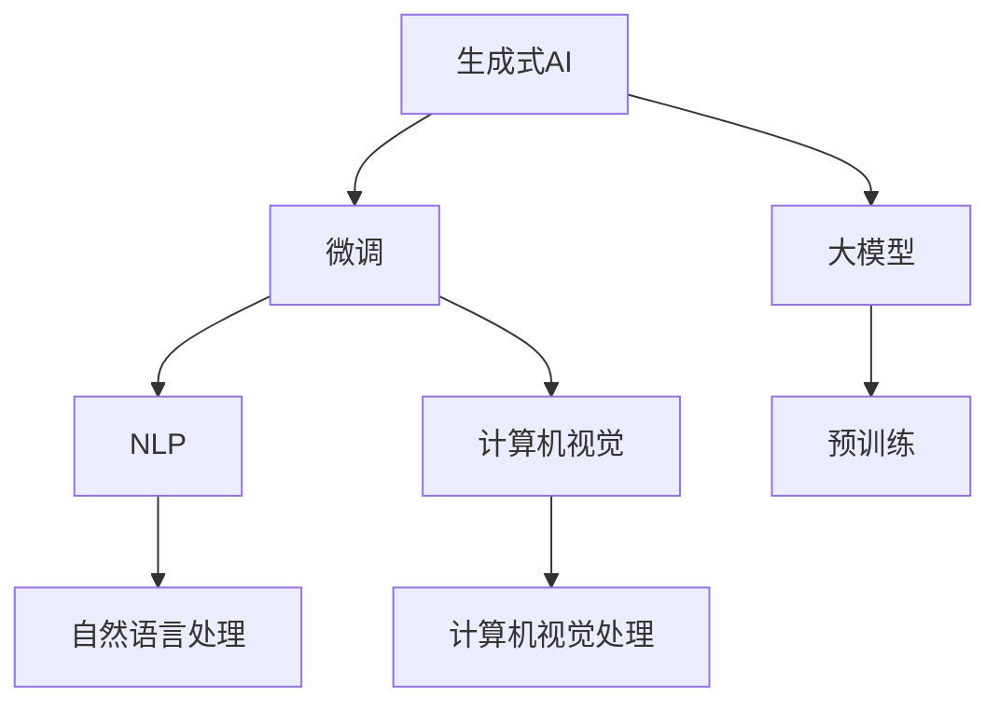
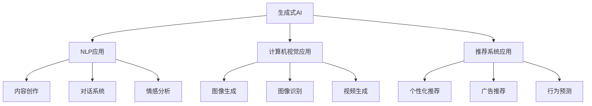
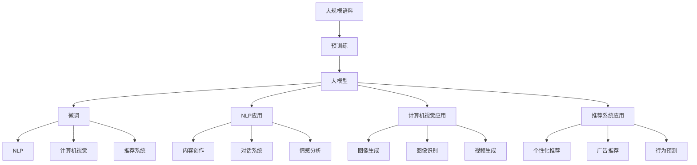

                 

# 生成式AIGC是金矿还是泡沫：第六部分：AIGC将是未来10年的长坡厚雪

> 关键词：生成式AI、大模型、计算语言学、大模型微调、自然语言处理(NLP)、计算机视觉(Computer Vision)、推荐系统、应用场景、人工智能与业务融合、未来展望

## 1. 背景介绍

### 1.1 问题由来

随着生成式AI(GenAI)技术的发展，尤其是生成式大模型（如OpenAI的GPT系列、Google的DeepMind、Microsoft的DALL-E等）的突破，AI生成内容的能力已经达到了前所未有的水平。生成式AI在自然语言处理(NLP)、计算机视觉(Computer Vision)、音乐创作、艺术生成、文本摘要、图像生成等领域取得了令人瞩目的成就，为各行各业带来了变革性的影响。然而，与传统的训练式AI相比，生成式AI虽然在某些特定场景下展示了强大的潜力，但技术上的成熟度、应用上的可行性、以及社会经济的影响，都还在不断探索和讨论中。

### 1.2 问题核心关键点

生成式AI的核心在于如何通过计算语言学（Computational Linguistics）和计算机科学（Computer Science）的结合，使用大规模数据训练生成模型，从而实现自动生成具有人类水平的文本、图像、音频等内容。具体来说，生成式AI包括如下几个关键点：

1. **大模型的崛起**：大规模预训练语言模型和计算机视觉模型的出现，使得AI生成内容的质量和多样性大大提升。
2. **微调技术的成熟**：通过在特定任务上进行微调，AI模型可以适应不同的应用场景，进一步提升生成内容的准确性和实用性。
3. **技术融合的趋势**：生成式AI与NLP、CV、推荐系统等技术的融合，推动了AI在更多领域的创新应用。
4. **道德和伦理的考量**：随着生成式AI应用的增多，其道德和伦理问题也逐渐被提上议程，如AI生成内容的版权、隐私保护、偏见消除等。

### 1.3 问题研究意义

生成式AI的快速发展，对于推动AI技术的广泛应用和产业化进程，具有重要的研究意义：

1. **技术前沿的探索**：生成式AI代表了AI技术的前沿趋势，其突破性的进展将推动AI理论和方法的进步。
2. **产业升级的推动**：生成式AI在内容创作、娱乐、医疗、教育等多个领域的广泛应用，将加速传统行业的数字化转型。
3. **经济价值的创造**：生成式AI在内容生成、广告、智能客服等方面的应用，将带来新的经济增长点。
4. **社会伦理的讨论**：生成式AI带来的内容真实性、偏见消除、隐私保护等问题，需要社会各界共同探讨解决方案。
5. **科学研究的契机**：生成式AI技术的突破，为科学计算、模拟仿真、自动化研究等领域提供了新的工具和思路。

## 2. 核心概念与联系

### 2.1 核心概念概述

为了更好地理解生成式AI的发展及其应用，本节将介绍几个密切相关的核心概念：

1. **生成式AI（Generative AI）**：使用机器学习算法训练生成模型，能够自动生成文本、图像、音频等内容的技术。
2. **大模型（Large Model）**：指具有上亿甚至数十亿参数的深度学习模型，如GPT、BERT、DALL-E等。
3. **计算语言学（Computational Linguistics）**：将语言学与计算机科学结合，研究自然语言处理和计算语言学的理论和技术。
4. **微调（Fine-tuning）**：在预训练模型的基础上，使用特定任务的数据集进行有监督学习，调整模型参数，以适应具体应用场景。
5. **自然语言处理（NLP）**：研究如何让计算机理解、处理和生成人类语言的技术。
6. **计算机视觉（Computer Vision）**：研究如何让计算机理解和分析视觉信息的技术。
7. **推荐系统（Recommender System）**：研究如何根据用户的行为和偏好，自动推荐相关内容的技术。
8. **应用场景（Application Scenarios）**：生成式AI在内容创作、娱乐、医疗、教育等多个领域的实际应用。
9. **人工智能与业务融合（AI and Business Integration）**：将AI技术应用于实际业务场景，提升业务效率和创新能力。
10. **未来展望（Future Prospects）**：生成式AI未来在技术、应用和社会影响上的预期。

这些核心概念之间的逻辑关系可以通过以下Mermaid流程图来展示：



这个流程图展示了大模型、微调和多领域应用的逻辑关系：大模型作为生成式AI的基础，通过微调应用于NLP、CV和推荐系统等多个领域，从而实现多样化的应用场景。

### 2.2 概念间的关系

这些核心概念之间存在着紧密的联系，形成了生成式AI的整体生态系统。下面我们通过几个Mermaid流程图来展示这些概念之间的关系。

#### 2.2.1 大模型的学习范式



这个流程图展示了生成式AI的预训练和大模型微调过程，以及与NLP、计算机视觉和推荐系统等多个应用领域的联系。

#### 2.2.2 微调与大模型的关系



这个流程图展示了微调与大模型的关系，以及微调在大模型预训练后进行的多领域应用。

#### 2.2.3 应用场景的多样性



这个流程图展示了生成式AI在内容创作、对话系统、情感分析、图像生成、图像识别、视频生成、个性化推荐、广告推荐和行为预测等多样化的应用场景。

### 2.3 核心概念的整体架构

最后，我们用一个综合的流程图来展示这些核心概念在大模型微调过程中的整体架构：



这个综合流程图展示了从预训练到大模型微调，再到多个领域应用的完整过程。通过这些流程图，我们可以更清晰地理解生成式AI的发展脉络和应用场景。

## 3. 核心算法原理 & 具体操作步骤

### 3.1 算法原理概述

生成式AI的核心在于如何通过计算语言学和计算机科学的结合，使用大规模数据训练生成模型，从而实现自动生成具有人类水平的文本、图像、音频等内容。具体来说，生成式AI包括如下几个关键点：

1. **大模型的预训练**：使用大规模语料进行预训练，学习语言的通用表征。
2. **微调技术的应用**：在预训练模型的基础上，使用特定任务的数据集进行微调，调整模型参数，以适应具体应用场景。
3. **生成策略的优化**：设计生成策略，指导模型生成符合期望的内容。
4. **内容的优化和评估**：通过评估指标，如BLEU、ROUGE、Inception Score等，对生成内容进行评估和优化。

### 3.2 算法步骤详解

生成式AI的微调过程一般包括以下几个关键步骤：

**Step 1: 准备预训练模型和数据集**
- 选择合适的预训练语言模型，如GPT、BERT等。
- 准备特定任务的数据集，分为训练集、验证集和测试集。

**Step 2: 添加任务适配层**
- 根据任务类型，在预训练模型的顶层设计合适的输出层和损失函数。
- 对于分类任务，通常在顶层添加线性分类器和交叉熵损失函数。
- 对于生成任务，通常使用语言模型的解码器输出概率分布，并以负对数似然为损失函数。

**Step 3: 设置微调超参数**
- 选择合适的优化算法及其参数，如Adam、SGD等，设置学习率、批大小、迭代轮数等。
- 设置正则化技术及强度，包括权重衰减、Dropout、Early Stopping等。
- 确定冻结预训练参数的策略，如仅微调顶层，或全部参数都参与微调。

**Step 4: 执行梯度训练**
- 将训练集数据分批次输入模型，前向传播计算损失函数。
- 反向传播计算参数梯度，根据设定的优化算法和学习率更新模型参数。
- 周期性在验证集上评估模型性能，根据性能指标决定是否触发Early Stopping。
- 重复上述步骤直到满足预设的迭代轮数或Early Stopping条件。

**Step 5: 测试和部署**
- 在测试集上评估微调后模型，对比微调前后的性能。
- 使用微调后的模型对新样本进行推理预测，集成到实际的应用系统中。

以上是生成式AI微调的一般流程。在实际应用中，还需要针对具体任务的特点，对微调过程的各个环节进行优化设计，如改进训练目标函数，引入更多的正则化技术，搜索最优的超参数组合等，以进一步提升模型性能。

### 3.3 算法优缺点

生成式AI的微调方法具有以下优点：

1. **高效适应性**：预训练模型具有广泛的通用知识，通过微调可以快速适应特定任务，提升模型性能。
2. **泛化能力强**：微调后的模型可以应用于多个相似任务，具有较强的泛化能力。
3. **技术简单**：微调技术相对于从头训练模型更为简单，技术实现难度较小。
4. **灵活性高**：微调可以针对不同的任务需求进行定制化设计，灵活度高。

同时，该方法也存在一定的局限性：

1. **依赖标注数据**：微调的效果很大程度上取决于标注数据的质量和数量，获取高质量标注数据的成本较高。
2. **过拟合风险**：在标注样本不足的情况下，微调模型容易出现过拟合，泛化能力受限。
3. **性能瓶颈**：大规模语言模型的推理速度较慢，在实际应用中可能面临性能瓶颈。
4. **伦理问题**：生成式AI模型可能生成虚假内容，影响社会伦理和道德。

尽管存在这些局限性，但就目前而言，生成式AI微调方法仍然是大模型应用的主流范式。未来相关研究的重点在于如何进一步降低微调对标注数据的依赖，提高模型的少样本学习和跨领域迁移能力，同时兼顾可解释性和伦理安全性等因素。

### 3.4 算法应用领域

生成式AI的微调方法已经在NLP、计算机视觉、推荐系统等多个领域得到了广泛应用，例如：

- **自然语言处理（NLP）**：文本生成、文本摘要、情感分析、机器翻译等。
- **计算机视觉（CV）**：图像生成、图像识别、视频生成等。
- **推荐系统（Recommender System）**：个性化推荐、广告推荐、行为预测等。

除了上述这些经典任务外，生成式AI微调也被创新性地应用到更多场景中，如可控文本生成、常识推理、代码生成、数据增强等，为AI技术带来了全新的突破。随着预训练模型和微调方法的不断进步，相信生成式AI将在更广阔的应用领域大放异彩。

## 4. 数学模型和公式 & 详细讲解  
### 4.1 数学模型构建

本节将使用数学语言对生成式AI的微调过程进行更加严格的刻画。

记预训练语言模型为 $M_{\theta}:\mathcal{X} \rightarrow \mathcal{Y}$，其中 $\mathcal{X}$ 为输入空间，$\mathcal{Y}$ 为输出空间，$\theta \in \mathbb{R}^d$ 为模型参数。假设微调任务的训练集为 $D=\{(x_i,y_i)\}_{i=1}^N, x_i \in \mathcal{X}, y_i \in \mathcal{Y}$。

定义模型 $M_{\theta}$ 在数据样本 $(x,y)$ 上的损失函数为 $\ell(M_{\theta}(x),y)$，则在数据集 $D$ 上的经验风险为：

$$
\mathcal{L}(\theta) = \frac{1}{N} \sum_{i=1}^N \ell(M_{\theta}(x_i),y_i)
$$

微调的优化目标是最小化经验风险，即找到最优参数：

$$
\theta^* = \mathop{\arg\min}_{\theta} \mathcal{L}(\theta)
$$

在实践中，我们通常使用基于梯度的优化算法（如SGD、Adam等）来近似求解上述最优化问题。设 $\eta$ 为学习率，$\lambda$ 为正则化系数，则参数的更新公式为：

$$
\theta \leftarrow \theta - \eta \nabla_{\theta}\mathcal{L}(\theta) - \eta\lambda\theta
$$

其中 $\nabla_{\theta}\mathcal{L}(\theta)$ 为损失函数对参数 $\theta$ 的梯度，可通过反向传播算法高效计算。

### 4.2 公式推导过程

以下我们以二分类任务为例，推导交叉熵损失函数及其梯度的计算公式。

假设模型 $M_{\theta}$ 在输入 $x$ 上的输出为 $\hat{y}=M_{\theta}(x) \in [0,1]$，表示样本属于正类的概率。真实标签 $y \in \{0,1\}$。则二分类交叉熵损失函数定义为：

$$
\ell(M_{\theta}(x),y) = -[y\log \hat{y} + (1-y)\log (1-\hat{y})]
$$

将其代入经验风险公式，得：

$$
\mathcal{L}(\theta) = -\frac{1}{N}\sum_{i=1}^N [y_i\log M_{\theta}(x_i)+(1-y_i)\log(1-M_{\theta}(x_i))]
$$

根据链式法则，损失函数对参数 $\theta_k$ 的梯度为：

$$
\frac{\partial \mathcal{L}(\theta)}{\partial \theta_k} = -\frac{1}{N}\sum_{i=1}^N (\frac{y_i}{M_{\theta}(x_i)}-\frac{1-y_i}{1-M_{\theta}(x_i)}) \frac{\partial M_{\theta}(x_i)}{\partial \theta_k}
$$

其中 $\frac{\partial M_{\theta}(x_i)}{\partial \theta_k}$ 可进一步递归展开，利用自动微分技术完成计算。

在得到损失函数的梯度后，即可带入参数更新公式，完成模型的迭代优化。重复上述过程直至收敛，最终得到适应下游任务的最优模型参数 $\theta^*$。

## 5. 项目实践：代码实例和详细解释说明

### 5.1 开发环境搭建

在进行生成式AI微调实践前，我们需要准备好开发环境。以下是使用Python进行PyTorch开发的环境配置流程：

1. 安装Anaconda：从官网下载并安装Anaconda，用于创建独立的Python环境。

2. 创建并激活虚拟环境：
```bash
conda create -n pytorch-env python=3.8 
conda activate pytorch-env
```

3. 安装PyTorch：根据CUDA版本，从官网获取对应的安装命令。例如：
```bash
conda install pytorch torchvision torchaudio cudatoolkit=11.1 -c pytorch -c conda-forge
```

4. 安装Transformers库：
```bash
pip install transformers
```

5. 安装各类工具包：
```bash
pip install numpy pandas scikit-learn matplotlib tqdm jupyter notebook ipython
```

完成上述步骤后，即可在`pytorch-env`环境中开始生成式AI微调实践。

### 5.2 源代码详细实现

下面我们以图像生成任务为例，给出使用Transformers库对DALL-E模型进行微调的PyTorch代码实现。

首先，定义图像生成任务的数据处理函数：

```python
from transformers import DALL_EForConditionalImageGeneration
from torch.utils.data import Dataset
import torch

class ImageDataset(Dataset):
    def __init__(self, images, captions, tokenizer):
        self.images = images
        self.captions = captions
        self.tokenizer = tokenizer
        
    def __len__(self):
        return len(self.images)
    
    def __getitem__(self, item):
        image = self.images[item]
        caption = self.captions[item]
        
        # 将图像转化为字符串形式，供模型理解
        image_str = image.to_string().split(",")
        # 对图片描述进行编码
        encoding = self.tokenizer(caption, return_tensors='pt', padding='max_length', truncation=True)
        input_ids = encoding['input_ids'][0]
        attention_mask = encoding['attention_mask'][0]
        
        return {'input_ids': input_ids, 
                'attention_mask': attention_mask,
                'image_str': image_str}
```

然后，定义模型和优化器：

```python
from transformers import AdamW

model = DALL_EForConditionalImageGeneration.from_pretrained('DALL-E-2')
optimizer = AdamW(model.parameters(), lr=2e-5)
```

接着，定义训练和评估函数：

```python
from torch.utils.data import DataLoader
from tqdm import tqdm
from PIL import Image
import numpy as np

device = torch.device('cuda') if torch.cuda.is_available() else torch.device('cpu')
model.to(device)

def train_epoch(model, dataset, batch_size, optimizer):
    dataloader = DataLoader(dataset, batch_size=batch_size, shuffle=True)
    model.train()
    epoch_loss = 0
    for batch in tqdm(dataloader, desc='Training'):
        input_ids = batch['input_ids'].to(device)
        attention_mask = batch['attention_mask'].to(device)
        image_str = batch['image_str']
        image_tensor = np.fromstring(",".join(image_str), dtype=np.uint8).reshape(32, 32, 3)
        image_tensor = torch.from_numpy(image_tensor).float() / 255.0
        image_tensor = image_tensor.to(device)
        
        model.zero_grad()
        outputs = model(input_ids=input_ids, attention_mask=attention_mask, images=image_tensor)
        loss = outputs.loss
        epoch_loss += loss.item()
        loss.backward()
        optimizer.step()
    return epoch_loss / len(dataloader)

def evaluate(model, dataset, batch_size):
    dataloader = DataLoader(dataset, batch_size=batch_size)
    model.eval()
    pred_images, preds = [], []
    with torch.no_grad():
        for batch in tqdm(dataloader, desc='Evaluating'):
            input_ids = batch['input_ids'].to(device)
            attention_mask = batch['attention_mask'].to(device)
            image_tensor = batch['images'].to(device)
            outputs = model(input_ids=input_ids, attention_mask=attention_mask, images=image_tensor)
            image = outputs.images[0]
            image = image.permute(1, 2, 0).numpy() * 255
            preds.append(outputs.top_k(1)[0])
            pred_images.append(image

