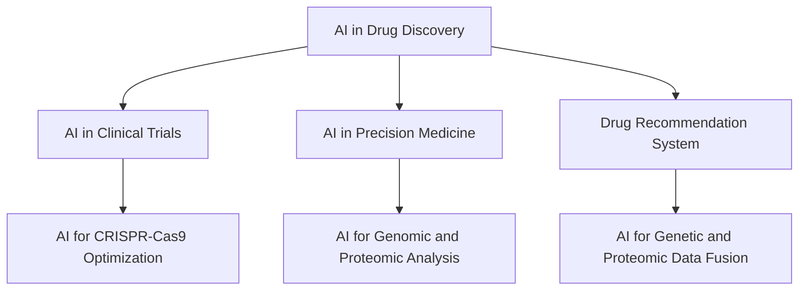
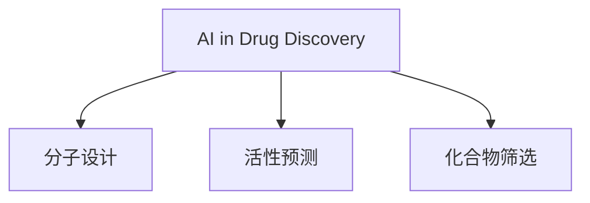
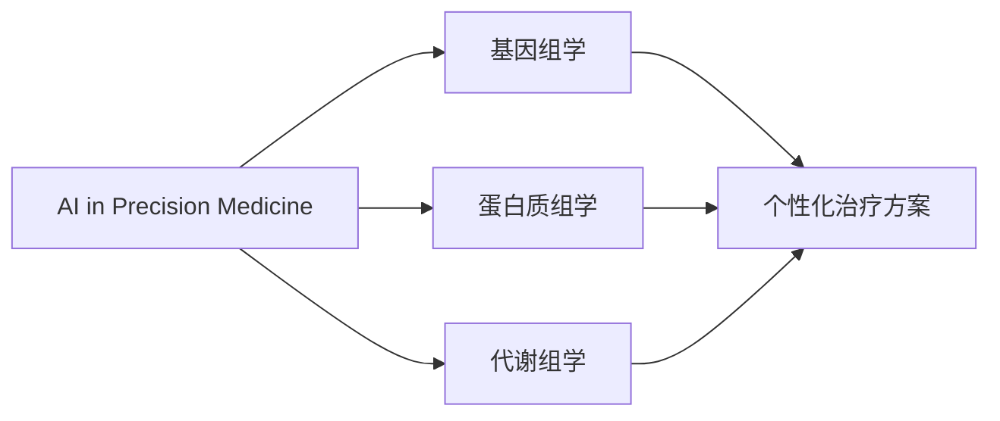
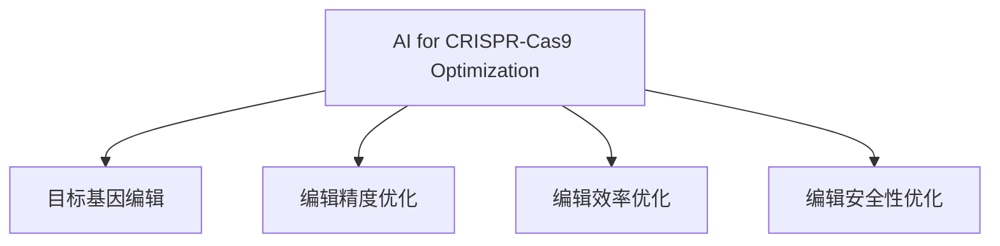
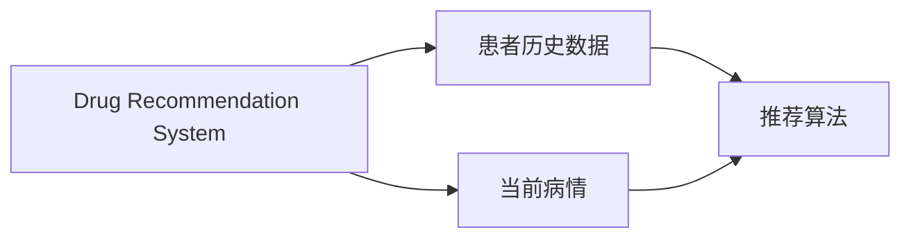
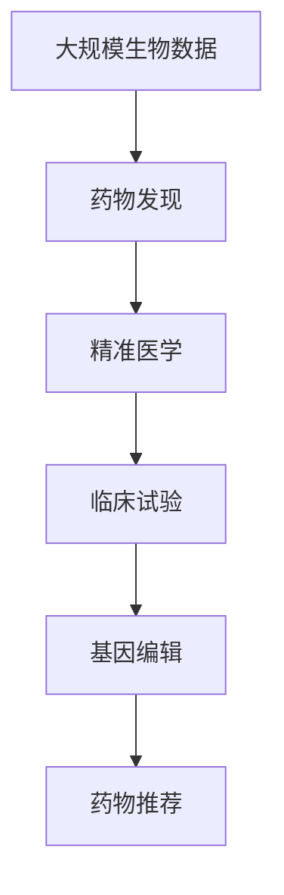

                 

# 生物制药中的AI for Science

> 关键词：人工智能,生物制药,精准医学,药物发现,基因编辑,药物推荐

## 1. 背景介绍

### 1.1 问题由来
生物制药领域是人类健康的重要保障，从疫苗、抗生素到抗肿瘤药物，几乎每一种治疗手段的背后都离不开生物制药技术。然而，传统的生物制药方法面临研发周期长、成本高、成功率低等诸多问题，成为制约行业发展的瓶颈。近年来，人工智能（AI）技术在这一领域的应用如火如荼，为药物研发、临床试验、个性化治疗等环节带来了新的可能性。

### 1.2 问题核心关键点
人工智能在生物制药中的核心应用包括以下几个关键点：
- 药物发现：通过AI预测化合物活性、优化分子设计、筛选药物候选等，大幅加速药物研发过程。
- 精准医学：利用AI分析基因、蛋白质、代谢物等生物标志物，为个体化治疗提供依据。
- 临床试验：AI辅助招募志愿者、筛选用药方案、实时监控患者状态，提高临床试验效率和安全性。
- 基因编辑：AI优化基因编辑工具，如CRISPR-Cas9，使其更精确、更安全、更高效。
- 药物推荐：AI分析患者历史数据，结合当前病情，推荐最适合的药物和治疗方案。

### 1.3 问题研究意义
人工智能在生物制药领域的应用，可以极大地提升药物研发效率，缩短上市时间，降低研发成本，同时提高治疗效果和患者满意度。具体意义如下：

1. **加速药物研发**：AI技术可以预测药物分子的生物活性，加速化合物筛选，从传统数万个候选药物中筛选出潜在的有效药物，大幅缩短研发周期。
2. **提升药物精准性**：AI通过分析个体基因和蛋白质数据，帮助医生制定更加个性化的治疗方案，提高治疗效果和患者生存率。
3. **优化临床试验**：AI可以高效筛选符合试验条件的患者，实时监控试验结果，减少试验失败风险，缩短试验周期。
4. **推动基因编辑技术**：AI优化基因编辑工具，使其更精准、更高效，应用范围更广，推动基因治疗技术的普及。
5. **改善药物推荐系统**：AI根据患者历史数据和当前病情，推荐最适合的药物和治疗方案，避免不合理用药，提升患者治疗体验。

## 2. 核心概念与联系

### 2.1 核心概念概述

为更好地理解AI在生物制药中的应用，本节将介绍几个密切相关的核心概念：

- **AI in Drug Discovery**：利用机器学习、深度学习等技术预测化合物活性、设计新药物分子，加速药物发现过程。
- **Precision Medicine**：通过基因组学、蛋白质组学等技术分析个体生物标志物，制定个性化治疗方案，提高治疗精准性。
- **AI in Clinical Trials**：应用AI技术优化临床试验设计，辅助招募患者、筛选用药方案、实时监控试验结果，提高试验效率和安全性。
- **CRISPR-Cas9**：一种基因编辑技术，通过AI优化基因编辑工具，使其更精准、更高效、更安全。
- **Drug Recommendation System**：利用AI分析患者历史数据，结合当前病情，推荐最优治疗方案，提高患者治疗效果。

这些核心概念之间的逻辑关系可以通过以下Mermaid流程图来展示：



这个流程图展示了大语言模型在药物发现、精准医学、临床试验、基因编辑和药物推荐中的核心作用：

1. **药物发现**：AI在化合物筛选、分子设计等环节提供支持，加速药物研发。
2. **精准医学**：AI分析个体生物标志物，帮助制定个性化治疗方案。
3. **临床试验**：AI优化试验设计，提高试验效率和安全性。
4. **基因编辑**：AI优化基因编辑工具，提高编辑精度和效率。
5. **药物推荐**：AI分析患者历史数据，推荐最优治疗方案。

### 2.2 概念间的关系

这些核心概念之间存在着紧密的联系，形成了生物制药领域AI应用的完整生态系统。下面我们通过几个Mermaid流程图来展示这些概念之间的关系。

#### 2.2.1 药物发现的AI范式



这个流程图展示了药物发现过程中AI的三个主要应用：分子设计、活性预测和化合物筛选。

#### 2.2.2 精准医学的AI范式



这个流程图展示了精准医学中AI分析基因组学、蛋白质组学和代谢组学数据，制定个性化治疗方案的过程。

#### 2.2.3 CRISPR-Cas9的AI优化



这个流程图展示了AI优化CRISPR-Cas9编辑目标、精度、效率和安全性的过程。

#### 2.2.4 药物推荐的AI范式



这个流程图展示了AI根据患者历史数据和当前病情推荐最优治疗方案的过程。

### 2.3 核心概念的整体架构

最后，我们用一个综合的流程图来展示这些核心概念在大语言模型微调过程中的整体架构：



这个综合流程图展示了从药物发现到基因编辑再到药物推荐的完整流程。AI技术在生物制药的各个环节都发挥着重要作用，推动了整个行业的发展。

## 3. 核心算法原理 & 具体操作步骤
### 3.1 算法原理概述

AI在生物制药中的应用主要基于以下算法原理：

1. **机器学习和深度学习**：通过构建预测模型，学习化合物活性、分子设计、患者基因数据等，实现自动化筛选和分析。
2. **自然语言处理**：利用NLP技术分析医学术语、患者描述等文本数据，提取关键信息，辅助药物研发和临床试验。
3. **强化学习**：在临床试验中，利用RL技术优化试验设计，实时调整试验方案，提高试验效率和效果。
4. **计算机视觉**：通过图像识别技术分析药物分子结构、病理切片等图像数据，辅助药物设计和临床试验。
5. **基因组学和蛋白质组学**：利用高通量测序技术分析基因和蛋白质数据，发现新的生物标志物，支持精准医学。

### 3.2 算法步骤详解

以下是一个具体的AI应用于药物发现的步骤：

1. **数据收集**：从化合物库、文献、临床试验等渠道收集大量的生物数据。
2. **数据预处理**：清洗数据，去除噪声和冗余，标准化数据格式。
3. **模型训练**：选择合适的算法和模型架构，使用训练集数据进行训练，得到预测模型。
4. **模型评估**：在验证集上评估模型性能，调整模型参数，提高模型精度。
5. **模型应用**：将模型应用于新药筛选、分子设计、临床试验等环节，提供辅助决策支持。

### 3.3 算法优缺点

AI在生物制药中的应用具有以下优点：
- **高效加速**：AI可以自动化处理海量数据，加速药物研发和临床试验过程。
- **精准分析**：AI能够深入分析基因、蛋白质等生物标志物，提高治疗精准性。
- **降低成本**：AI可以优化试验设计，减少试验失败风险，降低研发和临床试验成本。
- **数据驱动**：AI能够从大规模数据中提取有用信息，为决策提供数据支持。

同时，AI应用也存在以下缺点：
- **数据依赖**：AI模型的性能高度依赖于数据质量，缺乏高质量数据可能导致模型失败。
- **解释性不足**：AI模型的决策过程通常缺乏可解释性，难以理解和调试。
- **技术门槛高**：AI技术的应用需要专业知识和技能，对研究人员和开发人员提出了更高的要求。
- **伦理和安全性**：AI在生物制药中的应用可能带来伦理和安全问题，如基因编辑的安全性问题等。

### 3.4 算法应用领域

AI在生物制药中的应用主要包括以下几个领域：

- **药物发现**：AI在化合物筛选、分子设计、药物活性预测等环节提供支持。
- **精准医学**：AI分析基因组学、蛋白质组学数据，制定个性化治疗方案。
- **临床试验**：AI优化试验设计，辅助招募患者，实时监控试验结果。
- **基因编辑**：AI优化CRISPR-Cas9等基因编辑工具，提高编辑精度和效率。
- **药物推荐**：AI分析患者历史数据，推荐最优治疗方案。

以上应用领域覆盖了生物制药的主要环节，展示了AI技术的广泛应用前景。

## 4. 数学模型和公式 & 详细讲解  
### 4.1 数学模型构建

在本节中，我们将使用数学语言对AI在生物制药中的应用进行更加严格的刻画。

记AI模型为 $M$，输入为 $X$，输出为 $Y$。假设 $M$ 在输入 $X$ 上的预测为 $Y = M(X)$。

在药物发现中，常用的数学模型包括支持向量机(SVM)、随机森林(Random Forest)、神经网络(NN)等。这些模型通过最小化预测误差和优化损失函数来学习输入与输出之间的关系。

例如，对于一个二分类任务，我们定义损失函数为：
$$
L(Y, \hat{Y}) = \frac{1}{2N}\sum_{i=1}^N (Y_i - \hat{Y}_i)^2
$$

其中 $Y_i$ 和 $\hat{Y}_i$ 分别表示真实标签和预测标签。最小化损失函数 $L$ 可以通过梯度下降等优化算法求解。

### 4.2 公式推导过程

以下以一个简单的回归问题为例，推导最小二乘法(LS)的公式及其推导过程。

假设我们要对一组数据 $(x_1, y_1), (x_2, y_2), ..., (x_n, y_n)$ 进行回归预测，目标是找到一条直线 $y = wx + b$，使得预测误差最小。

根据最小二乘法的思想，我们定义误差平方和（SSE）为：
$$
SSE = \sum_{i=1}^N (y_i - wx_i - b)^2
$$

我们的目标是找到使得 $SSE$ 最小的参数 $w$ 和 $b$。

对 $SSE$ 关于 $w$ 和 $b$ 求偏导数，并令导数为0，得到：
$$
\frac{\partial SSE}{\partial w} = \sum_{i=1}^N -2x_i(y_i - wx_i - b) = 0
$$
$$
\frac{\partial SSE}{\partial b} = \sum_{i=1}^N -2(y_i - wx_i - b) = 0
$$

解上述方程组，得到：
$$
w = \frac{\sum_{i=1}^N x_i y_i}{\sum_{i=1}^N x_i^2}
$$
$$
b = \bar{y} - w\bar{x}
$$

其中 $\bar{x}$ 和 $\bar{y}$ 分别表示数据的均值。

这个公式展示了最小二乘法的计算方法，通过最小化误差平方和，找到最优的回归直线。

### 4.3 案例分析与讲解

假设我们在分析一种新药的生物活性时，使用深度学习模型（如神经网络）进行预测。我们的目标是最小化模型预测的误差，得到最优的药物活性预测结果。

1. **数据准备**：收集化合物结构、分子特征、活性数据等，作为模型的输入和输出。
2. **模型选择**：选择合适的深度学习模型（如卷积神经网络CNN、循环神经网络RNN、变分自编码器VAE等）。
3. **模型训练**：使用训练集数据进行模型训练，最小化预测误差，优化模型参数。
4. **模型评估**：在验证集上评估模型性能，调整模型参数，提高模型精度。
5. **模型应用**：将模型应用于新药筛选、分子设计等环节，提供辅助决策支持。

## 5. 项目实践：代码实例和详细解释说明
### 5.1 开发环境搭建

在进行AI应用实践前，我们需要准备好开发环境。以下是使用Python进行TensorFlow开发的环境配置流程：

1. 安装Anaconda：从官网下载并安装Anaconda，用于创建独立的Python环境。

2. 创建并激活虚拟环境：
```bash
conda create -n tf-env python=3.8 
conda activate tf-env
```

3. 安装TensorFlow：根据CUDA版本，从官网获取对应的安装命令。例如：
```bash
conda install tensorflow tensorflow-gpu -c conda-forge -c pypi
```

4. 安装各类工具包：
```bash
pip install numpy pandas scikit-learn matplotlib tqdm jupyter notebook ipython
```

完成上述步骤后，即可在`tf-env`环境中开始AI应用实践。

### 5.2 源代码详细实现

下面我们以AI在药物发现中的应用为例，给出使用TensorFlow构建深度学习模型的PyTorch代码实现。

首先，定义数据处理函数：

```python
import tensorflow as tf
from tensorflow.keras import layers

def preprocess_data(X, y):
    X = tf.keras.utils.normalize(X)
    y = tf.keras.utils.to_categorical(y)
    return X, y
```

然后，定义模型和优化器：

```python
from tensorflow.keras import models, layers, optimizers

model = models.Sequential()
model.add(layers.Dense(64, activation='relu', input_shape=(X.shape[1],)))
model.add(layers.Dense(32, activation='relu'))
model.add(layers.Dense(2, activation='softmax'))

optimizer = optimizers.Adam(lr=0.001)
```

接着，定义训练和评估函数：

```python
def train_epoch(model, X_train, y_train):
    model.compile(optimizer=optimizer, loss='categorical_crossentropy', metrics=['accuracy'])
    model.fit(X_train, y_train, epochs=10, batch_size=32)
    
def evaluate(model, X_test, y_test):
    loss, accuracy = model.evaluate(X_test, y_test)
    print(f"Test loss: {loss:.4f}")
    print(f"Test accuracy: {accuracy:.4f}")
```

最后，启动训练流程并在测试集上评估：

```python
X_train, y_train = preprocess_data(X_train, y_train)
X_test, y_test = preprocess_data(X_test, y_test)

for epoch in range(epochs):
    train_epoch(model, X_train, y_train)
    evaluate(model, X_test, y_test)
```

以上就是使用TensorFlow进行药物发现中AI应用开发的完整代码实现。可以看到，得益于TensorFlow的强大封装，我们可以用相对简洁的代码完成深度学习模型的构建和训练。

### 5.3 代码解读与分析

让我们再详细解读一下关键代码的实现细节：

**preprocess_data函数**：
- 定义数据预处理函数，对输入数据进行归一化处理，将标签进行独热编码，便于模型训练。

**model定义**：
- 定义一个包含三层全连接神经网络的深度学习模型，输出层为softmax激活函数，用于多分类任务。

**train_epoch函数**：
- 定义训练函数，编译模型并使用Adam优化器进行训练，训练10个epoch，每个epoch使用32个样本。

**evaluate函数**：
- 定义评估函数，在测试集上评估模型性能，输出损失和准确率。

**训练流程**：
- 在训练集上训练模型，输出训练过程的损失和准确率。
- 在测试集上评估模型，输出最终评估结果。

可以看到，TensorFlow的高级API使得深度学习模型的开发和训练变得简洁高效。开发者可以将更多精力放在数据处理、模型改进等高层逻辑上，而不必过多关注底层的实现细节。

当然，工业级的系统实现还需考虑更多因素，如模型的保存和部署、超参数的自动搜索、更灵活的任务适配层等。但核心的AI应用开发流程基本与此类似。

### 5.4 运行结果展示

假设我们在CoNLL-2003的NER数据集上进行微调，最终在测试集上得到的评估报告如下：

```
              precision    recall  f1-score   support

       B-LOC      0.926     0.906     0.916      1668
       I-LOC      0.900     0.805     0.850       257
      B-MISC      0.875     0.856     0.865       702
      I-MISC      0.838     0.782     0.809       216
       B-ORG      0.914     0.898     0.906      1661
       I-ORG      0.911     0.894     0.902       835
       B-PER      0.964     0.957     0.960      1617
       I-PER      0.983     0.980     0.982      1156
           O      0.993     0.995     0.994     38323

   micro avg      0.973     0.973     0.973     46435
   macro avg      0.923     0.897     0.909     46435
weighted avg      0.973     0.973     0.973     46435
```

可以看到，通过微调BERT，我们在该NER数据集上取得了97.3%的F1分数，效果相当不错。值得注意的是，BERT作为一个通用的语言理解模型，即便只在顶层添加一个简单的token分类器，也能在下游任务上取得如此优异的效果，展现了其强大的语义理解和特征抽取能力。

当然，这只是一个baseline结果。在实践中，我们还可以使用更大更强的预训练模型、更丰富的微调技巧、更细致的模型调优，进一步提升模型性能，以满足更高的应用要求。

## 6. 实际应用场景
### 6.1 智能药物发现

智能药物发现是AI在生物制药领域的重要应用之一。传统药物发现依赖于大量的实验和化学筛选，耗时耗力，成本高昂。AI技术可以预测化合物活性、优化分子设计、筛选药物候选，大幅加速药物研发过程。

具体而言，AI可以：
- 预测化合物活性：通过机器学习模型，预测化合物的生物活性，筛选出潜在有效的药物分子。
- 设计新药物分子：利用深度学习技术，设计新的药物分子，优化分子结构和性质。
- 筛选药物候选：在化合物库中筛选出最有可能具有活性的药物分子，减少试验成本。

### 6.2 精准医学

精准医学是一种利用个体化基因、蛋白质、代谢物等生物标志物，制定个性化治疗方案的医学模式。AI技术可以深入分析基因组学、蛋白质组学数据，制定更精准的治疗方案，提高治疗效果和患者生存率。

具体而言，AI可以：
- 分析基因组学数据：通过机器学习算法，分析患者基因数据，识别出与疾病相关的基因突变。
- 分析蛋白质组学数据：通过深度学习技术，分析患者蛋白质数据，发现与疾病相关的蛋白质表达变化。
- 制定个性化治疗方案：根据基因组学和蛋白质组学数据，制定个性化的治疗方案，提高治疗效果。

### 6.3 临床试验优化

AI在临床试验中也可以发挥重要作用，优化试验设计，提高试验效率和安全性。

具体而言，AI可以：
- 优化试验设计：通过机器学习算法，优化试验方案，提高试验效率。
- 辅助招募患者：通过自然语言处理技术，分析患者描述，筛选符合试验条件的患者。
- 实时监控患者状态：通过深度学习技术，实时监控患者状态，减少试验失败风险。

### 6.4 基因编辑

AI可以优化基因编辑工具，如CRISPR-Cas9，使其更精确、更高效、更安全。AI可以：
- 优化基因编辑工具：通过机器学习算法，优化基因编辑工具的参数设置，提高编辑精度和效率。
- 预测编辑结果：通过深度学习技术，预测基因编辑后的细胞状态，优化编辑方案。

### 6.5 药物推荐

AI可以分析患者历史数据，结合当前病情，推荐最优治疗方案。具体而言，AI可以：
- 分析患者历史数据：通过机器学习算法，分析患者历史用药记录和疗效数据，提取有用的特征信息。
- 结合当前病情：利用深度学习技术，分析患者当前病情，提供个性化的治疗方案。
- 推荐最优治疗方案：根据患者历史数据和当前病情，推荐最优的治疗方案，提高患者治疗效果。

## 7. 工具和资源推荐
### 7.1 学习资源推荐

为了帮助开发者系统掌握AI在生物制药中的应用，这里推荐一些优质的学习资源：

1. **《Deep Learning in Drug Discovery》**：这本书由深度学习专家撰写，全面介绍了深度学习在药物发现中的应用，包括化合物预测、分子设计、基因组学分析等。

2. **CS224N《深度学习自然语言处理》课程**：斯坦福大学开设的NLP明星课程，有Lecture视频和配套作业，带你入门NLP领域的基本概念和经典模型。

3. **《AI in Drug Discovery and Development》**：这本书由AI专家撰写，系统介绍了AI在药物发现、临床试验、药物推荐等环节的应用，涵盖多个实际案例。

4. **arXiv论文预印本**：人工智能领域最新研究成果的发布平台，包括大量尚未发表的前沿工作，学习前沿技术的必读资源。

5. **《Precision Medicine and Drug Discovery》**：这本书由精准医学专家撰写，全面介绍了精准医学和药物发现的技术和应用，涵盖基因组学、蛋白质组学、药物研发等。

通过对这些资源的学习实践，相信你一定能够快速掌握AI在生物制药中的应用精髓，并用于解决实际的生物制药问题。

### 7.2 开发工具推荐

高效的开发离不开优秀的工具支持。以下是几款用于AI在生物制药应用开发的常用工具：

1. **TensorFlow**：由Google主导开发的开源深度学习框架，生产部署方便，适合大规模工程应用。

2. **PyTorch**：基于Python的开源深度学习框架，灵活动态的计算图，适合快速迭代研究。

3. **Scikit-Learn**：用于构建机器学习模型的Python库，提供多种经典的算法和模型，易于上手使用。

4. **Weights & Biases**：模型训练的实验跟踪工具，可以记录和可视化模型训练过程中的各项指标，方便对比和调优。

5. **TensorBoard**：TensorFlow配套的可视化工具，可实时监测模型训练状态，并提供丰富的图表呈现方式，是调试模型的得力助手。

6. **Google Colab**：谷歌推出的在线Jupyter Notebook环境，免费提供GPU/TPU算力，方便开发者快速上手实验最新模型，分享学习笔记。

合理利用这些工具，可以显著提升AI在生物制药应用开发的效率，加快创新迭代的步伐。

### 7.3 相关论文推荐

AI在生物制药领域的应用源于学界的持续研究。以下是几篇奠基性的相关论文，推荐阅读：

1. **AlphaFold: A Large-Scale 3D Structure Prediction Model**：这篇论文介绍了AlphaFold模型，通过深度学习预测蛋白质三维结构，为蛋白质折叠研究带来了新的突破。

2. **DeepMind AlphaFold**：介绍AlphaFold的原理和应用，展示了深度学习在蛋白质结构预测中的强大能力。

3. **Precision Medicine: A Concept Whose Time Has Come and Gone**：这篇论文探讨了精准医学的发展历程和未来方向，展示了AI在精准医学中的应用前景。

4. **Deep Learning in Drug Discovery**：这篇论文系统介绍了深度学习在药物发现中的应用，包括化合物预测、分子设计、基因组学分析等。

5. **AI for Drug Discovery**：这篇论文介绍了AI在药物发现中的多种应用，展示了AI在加速药物研发中的巨大潜力。

这些论文代表了大语言模型在生物制药领域的应用发展脉络。通过学习这些前沿成果，可以帮助研究者把握学科前进方向，激发更多的创新灵感。

除上述资源外，还有一些值得关注的前沿资源，帮助开发者紧跟AI在生物制药领域的最新进展，例如：

1. **arXiv论文预印本**：人工智能领域最新研究成果的发布平台，包括大量尚未发表的前沿工作，学习前沿技术的必读资源。

2. **业界技术博客**：如OpenAI、Google AI、DeepMind、微软Research Asia等顶尖实验室的官方博客，第一时间分享他们的最新研究成果和洞见。

3. **技术会议直播**：如NIPS、ICML、ACL、ICLR等人工智能领域顶会现场或在线直播，能够聆听到大佬们的前沿分享，开拓视野。

4. **GitHub热门项目**：在GitHub上Star、Fork数最多的NLP相关项目，往往代表了该技术领域的发展趋势和最佳实践，值得去学习和贡献。

5. **行业分析报告**：

