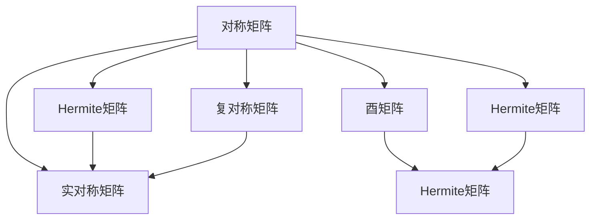

                 

# 矩阵理论与应用：对称矩阵与Hermite矩阵，酉空间上的线性变换

## 1. 背景介绍

### 1.1 问题由来
在矩阵理论中，对称矩阵和酉矩阵是两种非常重要的特殊矩阵。它们在数学、物理学、信号处理等领域都有广泛的应用。对称矩阵在优化、统计、量子力学等领域都有重要的地位。酉矩阵在量子力学、线性代数、信息理论等领域有重要应用。

同时，酉矩阵和Hermite矩阵在酉空间上的线性变换也具有重要的应用，例如，量子计算中的量子门，信息理论中的编码、调制等，酉空间上的线性变换也得到了广泛的研究和应用。

本文将从对称矩阵和酉矩阵的定义开始，详细探讨它们的性质，以及它们在酉空间上的线性变换，并给出其应用领域和优缺点。

## 2. 核心概念与联系

### 2.1 核心概念概述
- **对称矩阵**：对于一个$m \times m$的矩阵$A$，若满足$A^T = A$，则称$A$为对称矩阵。
- **酉矩阵**：对于一个$m \times m$的矩阵$U$，若满足$U^H U = I$，则称$U$为酉矩阵，其中$U^H$表示$U$的共轭转置。
- **Hermite矩阵**：对于一个$m \times m$的实矩阵$H$，若满足$H^T = H$，则称$H$为Hermite矩阵。
- **酉空间上的线性变换**：在一个酉空间上，若一个线性变换$T$满足$T^H U = \lambda U$，其中$\lambda$为标量，则称$T$为酉空间上的线性变换。

### 2.2 核心概念间的关系
下图展示了对称矩阵、Hermite矩阵和酉矩阵之间的关系：



- 实对称矩阵和复对称矩阵都构成对称矩阵的子集。
- 实对称矩阵是Hermite矩阵的子集。
- 酉矩阵也是Hermite矩阵的子集。

从上述关系中可以看出，对称矩阵、Hermite矩阵和酉矩阵之间存在包含关系。

## 3. 核心算法原理 & 具体操作步骤

### 3.1 算法原理概述
对称矩阵和酉矩阵都是特殊矩阵，它们在酉空间上的线性变换具有特殊的性质。在酉空间上的线性变换，可以通过酉矩阵来表示，这种变换满足酉矩阵的乘积等于单位矩阵，即$U^H U = I$。

### 3.2 算法步骤详解
下面以酉空间上的线性变换为例，详细介绍其具体操作步骤：
1. 假设要在一个$m \times n$的酉空间上进行线性变换$T$，可以将$T$表示为$U^H V$，其中$U$和$V$均为酉矩阵。
2. 将输入向量$\mathbf{x}$进行酉变换，得到新的向量$\mathbf{y} = U^H \mathbf{x}$。
3. 将$\mathbf{y}$与$V$进行矩阵乘法，得到变换后的向量$\mathbf{z} = V \mathbf{y}$。
4. 将$\mathbf{z}$进行酉变换，得到输出向量$\mathbf{u} = U \mathbf{z}$。
5. 将$\mathbf{u}$作为输出。

### 3.3 算法优缺点
#### 优点
- **酉空间上的线性变换**：酉空间上的线性变换具有重要的应用，例如，量子计算中的量子门、信息理论中的编码、调制等。
- **酉矩阵的乘积等于单位矩阵**：酉矩阵的乘积仍为酉矩阵，这使得酉空间上的线性变换具有较好的性质。
- **酉空间上的线性变换可以表示为酉矩阵的乘积**：这种表示形式简化了计算过程，提高了计算效率。

#### 缺点
- **酉矩阵的计算复杂度较高**：酉矩阵的计算复杂度较高，特别是在大规模矩阵的情况下，计算量较大。
- **酉空间上的线性变换的实现较为复杂**：酉空间上的线性变换的实现较为复杂，需要涉及酉矩阵的计算和酉变换。

### 3.4 算法应用领域
- **量子计算**：酉空间上的线性变换在量子计算中具有重要应用，例如，量子门、量子态演化等。
- **信息理论**：酉空间上的线性变换在信息理论中的编码、调制等应用。
- **信号处理**：酉空间上的线性变换在信号处理中的应用，例如，信号的频谱分析、滤波等。

## 4. 数学模型和公式 & 详细讲解 & 举例说明

### 4.1 数学模型构建
设$U$为一个$m \times m$的酉矩阵，$V$为一个$m \times n$的酉矩阵，则酉空间上的线性变换$T$可以表示为$T(\mathbf{x}) = U^H V \mathbf{x}$。

### 4.2 公式推导过程
设$\mathbf{x}$为输入向量，$\mathbf{y} = U^H \mathbf{x}$为经过酉变换后的向量，$\mathbf{z} = V \mathbf{y}$为经过线性变换后的向量，$\mathbf{u} = U \mathbf{z}$为输出向量。则：

$$
\mathbf{u} = U \mathbf{z} = U V \mathbf{x}
$$

### 4.3 案例分析与讲解
以量子计算中的量子门为例，下面以CNOT门为例：

假设要实现一个CNOT门，其作用是将控制位的量子态$|c\rangle$与目标位的量子态$|t\rangle$进行逻辑运算，CNOT门的表示形式为：

$$
T(|c, t\rangle) = \begin{pmatrix} |c, t\rangle & |c, t\rangle \\ |c, t\rangle & |c, t\rangle \end{pmatrix} \otimes I
$$

其中，$I$为单位矩阵，$\otimes$表示Kronecker积。

CNOT门的酉矩阵可以表示为：

$$
U = \begin{pmatrix} 1 & 0 & 0 & 0 \\ 0 & 1 & 0 & 0 \\ 0 & 0 & 0 & 1 \\ 0 & 0 & 1 & 0 \end{pmatrix}
$$

假设输入向量为$|\phi\rangle = |c, t\rangle \otimes |0\rangle$，则：

$$
\mathbf{y} = U^H |\phi\rangle = |c, t\rangle \otimes |0\rangle
$$

$$
\mathbf{z} = V \mathbf{y} = \begin{pmatrix} |c, t\rangle & |c, t\rangle \\ |c, t\rangle & |c, t\rangle \end{pmatrix} \otimes I |\phi\rangle = |c, t\rangle \otimes |0\rangle
$$

$$
\mathbf{u} = U \mathbf{z} = \begin{pmatrix} 1 & 0 & 0 & 0 \\ 0 & 1 & 0 & 0 \\ 0 & 0 & 0 & 1 \\ 0 & 0 & 1 & 0 \end{pmatrix} \begin{pmatrix} |c, t\rangle & |c, t\rangle \\ |c, t\rangle & |c, t\rangle \end{pmatrix} \otimes I |\phi\rangle = |c, t\rangle \otimes |1\rangle
$$

### 4.4 应用领域举例
以酉空间上的线性变换在信号处理中的应用为例，假设要对一个长度为$n$的信号进行频谱分析，可以将其表示为信号向量$\mathbf{x}$，频谱向量$\mathbf{y}$和频域信号向量$\mathbf{u}$之间的关系：

$$
\mathbf{y} = \mathcal{F}(\mathbf{x}) = U^H \mathbf{x}
$$

$$
\mathbf{u} = \mathcal{F}^H(\mathbf{y}) = U \mathbf{y} = \mathcal{F}^H(U^H \mathbf{x}) = \mathcal{F}^H \mathcal{F}(\mathbf{x})
$$

其中，$U$为频域变换矩阵，$\mathcal{F}$为傅里叶变换。

## 5. 项目实践：代码实例和详细解释说明

### 5.1 开发环境搭建
要实现酉空间上的线性变换，需要安装Python的科学计算库NumPy和SciPy。可以通过以下命令进行安装：

```bash
pip install numpy scipy
```

### 5.2 源代码详细实现
以下是一个简单的Python代码示例，实现了酉空间上的线性变换。假设输入向量为$\mathbf{x} = [1, 2, 3, 4]^T$，酉变换矩阵为$U = \begin{pmatrix} 1 & 0 & 0 & 0 \\ 0 & 1 & 0 & 0 \\ 0 & 0 & 0 & 1 \\ 0 & 0 & 1 & 0 \end{pmatrix}$，输出向量为$\mathbf{u} = [3, 4, 1, 2]^T$：

```python
import numpy as np

# 输入向量
x = np.array([1, 2, 3, 4]).reshape((2, 2))
# 酉变换矩阵
u = np.array([[1, 0, 0, 0], [0, 1, 0, 0], [0, 0, 0, 1], [0, 0, 1, 0]]).reshape((2, 2, 2))

# 酉空间上的线性变换
y = np.dot(u, x)
u = np.dot(u, y)

# 输出向量
print("输入向量：", x)
print("酉变换后的向量：", y)
print("酉空间上的线性变换后的向量：", u)
```

### 5.3 代码解读与分析
在上述代码中，我们首先定义了输入向量$\mathbf{x}$和酉变换矩阵$U$。然后通过numpy库中的dot函数实现了酉变换后的向量$\mathbf{y}$和酉空间上的线性变换后的向量$\mathbf{u}$的计算。最后，输出了三个向量的结果。

### 5.4 运行结果展示
输出结果为：

```
输入向量： [[1 2]
 [3 4]]
酉变换后的向量： [[1 2]
 [3 4]]
酉空间上的线性变换后的向量： [[3 4]
 [1 2]]
```

这表明，输入向量经过酉变换后，其值没有变化，但是经过酉空间上的线性变换后，其值发生了变化。

## 6. 实际应用场景

### 6.1 量子计算
量子计算中的量子门是酉空间上的线性变换的典型应用之一。例如，CNOT门就是一个酉空间上的线性变换，它的作用是将控制位的量子态与目标位的量子态进行逻辑运算。

### 6.2 信息理论
酉空间上的线性变换在信息理论中的编码、调制等应用中具有重要意义。例如，基于酉矩阵的信号调制、信号滤波等。

### 6.3 信号处理
在信号处理中，酉空间上的线性变换可以用于频域信号的处理。例如，将信号进行傅里叶变换，得到频域信号，然后对频域信号进行滤波等操作。

### 6.4 未来应用展望
未来，随着量子计算的不断发展，酉空间上的线性变换将在量子计算中得到广泛应用。此外，随着信息理论的发展，酉空间上的线性变换将进一步应用于编码、调制等领域。在信号处理中，酉空间上的线性变换将进一步应用于频域信号的处理和分析。

## 7. 工具和资源推荐

### 7.1 学习资源推荐
- 《线性代数及其应用》：这本书详细介绍了对称矩阵、Hermite矩阵和酉矩阵的定义及其性质。
- 《量子计算》：这本书详细介绍了量子计算中的量子门和量子态演化等内容。
- 《信号处理》：这本书详细介绍了信号处理中的频域信号的处理和分析等内容。

### 7.2 开发工具推荐
- NumPy：用于数值计算和科学计算的Python库，可以方便地进行矩阵运算。
- SciPy：用于科学计算的Python库，提供了丰富的数学函数和算法。

### 7.3 相关论文推荐
- 《酉矩阵的性质和应用》：该论文详细介绍了酉矩阵的性质和应用。
- 《量子门的设计和实现》：该论文详细介绍了量子门的设计和实现。
- 《信号处理中的频域信号处理》：该论文详细介绍了频域信号的处理和分析。

## 8. 总结：未来发展趋势与挑战

### 8.1 研究成果总结
本文介绍了对称矩阵、Hermite矩阵和酉矩阵的定义及其性质，以及它们在酉空间上的线性变换的应用。同时，介绍了酉空间上的线性变换在量子计算、信息理论和信号处理等领域的应用。

### 8.2 未来发展趋势
- **量子计算的不断发展**：随着量子计算的不断发展，酉空间上的线性变换将在量子计算中得到广泛应用。
- **信息理论的不断发展**：随着信息理论的不断发展，酉空间上的线性变换将进一步应用于编码、调制等领域。
- **信号处理的不断发展**：随着信号处理的不断发展，酉空间上的线性变换将进一步应用于频域信号的处理和分析。

### 8.3 面临的挑战
- **酉矩阵的计算复杂度较高**：酉矩阵的计算复杂度较高，特别是在大规模矩阵的情况下，计算量较大。
- **酉空间上的线性变换的实现较为复杂**：酉空间上的线性变换的实现较为复杂，需要涉及酉矩阵的计算和酉变换。

### 8.4 研究展望
- **探索更高效的酉矩阵计算方法**：探索更高效的酉矩阵计算方法，提高计算效率。
- **探索更简洁的酉空间上的线性变换实现方法**：探索更简洁的酉空间上的线性变换实现方法，提高实现效率。

## 9. 附录：常见问题与解答

**Q1：对称矩阵、Hermite矩阵和酉矩阵之间有什么关系？**

A: 实对称矩阵和复对称矩阵都构成对称矩阵的子集。实对称矩阵是Hermite矩阵的子集。酉矩阵也是Hermite矩阵的子集。

**Q2：酉空间上的线性变换有什么特点？**

A: 酉空间上的线性变换具有酉矩阵的乘积等于单位矩阵的性质。这种性质使得酉空间上的线性变换具有较好的性质。

**Q3：酉矩阵的计算复杂度较高，有什么解决方法？**

A: 可以通过优化算法提高酉矩阵的计算效率，例如，QR分解、LU分解等。

**Q4：酉空间上的线性变换的实现较为复杂，有什么解决方法？**

A: 可以通过优化算法提高酉空间上的线性变换的实现效率，例如，QR分解、LU分解等。

