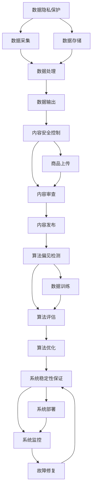

                 

# 确保 AI 技术在电商搜索导购中的应用安全可靠：技术安全与风险控制

## 1. 背景介绍

随着人工智能技术的快速进步，电商搜索导购系统正逐步融入各种先进的AI技术，如自然语言处理(NLP)、计算机视觉(CV)、推荐系统等，极大提升了用户体验和业务效率。然而，这些技术在带来便捷和智能的同时，也可能带来安全风险。如何确保AI技术在电商搜索导购中的应用安全可靠，成为行业关注的焦点。

### 1.1 问题由来

AI技术在电商搜索导购中的应用主要包括：
1. **NLP技术**：用于处理用户查询、商品描述等文本数据，实现意图理解、实体抽取等功能。
2. **CV技术**：用于处理商品图片、视频等多媒体数据，实现商品匹配、商品推荐等功能。
3. **推荐系统**：通过分析用户历史行为和偏好，生成个性化商品推荐。

这些技术在提升用户体验的同时，也带来了一定的安全风险：
1. **数据隐私风险**：用户搜索历史、购买记录等敏感数据可能被滥用。
2. **内容安全风险**：不当言论、假冒商品等内容可能影响用户信任。
3. **算法偏见风险**：推荐系统可能产生不公平的推荐结果。
4. **系统稳定性风险**：AI系统在应对突发事件时可能出现故障。

### 1.2 问题核心关键点

确保AI技术在电商搜索导购中的应用安全可靠，需要综合考虑以下几个核心关键点：
1. **数据隐私保护**：确保用户数据在采集、存储、处理过程中的安全性和隐私性。
2. **内容安全控制**：过滤和屏蔽不良内容，保障商品质量和用户满意度。
3. **算法偏见检测**：识别并纠正算法中的偏见，确保公平性。
4. **系统稳定性保证**：提升系统鲁棒性，减少故障和宕机。

这些问题涉及数据安全、内容审查、算法伦理和系统可靠性等多个方面，需要系统性、综合性的技术方案。

## 2. 核心概念与联系

### 2.1 核心概念概述

为更好地理解确保AI技术在电商搜索导购中的应用安全可靠，我们首先需要介绍几个密切相关的核心概念：

- **数据隐私保护**：在电商搜索导购中，用户数据隐私保护至关重要。这涉及对用户搜索历史、浏览记录、交易记录等敏感数据的加密、脱敏和匿名化处理，以防止信息泄露和滥用。
- **内容安全控制**：电商平台需对商品标题、描述、图片等内容进行审查和过滤，以确保内容的真实性、合法性和无害性，防止假冒伪劣商品、违法违规内容等问题。
- **算法偏见检测**：推荐系统在训练和运行过程中可能产生算法偏见，导致不公平的推荐结果。需要对算法进行评估和优化，确保其公平性和无偏性。
- **系统稳定性保证**：电商搜索导购系统需要具备高可用性和容错能力，以应对突发事件和用户流量峰值，防止系统宕机和故障。

这些核心概念之间通过数据流、算法和系统架构紧密联系，共同构成了电商搜索导购系统的安全保障体系。

### 2.2 概念间的关系

这些核心概念之间存在着紧密的联系，形成了电商搜索导购系统的安全保障生态系统。我们可以通过以下Mermaid流程图来展示这些概念之间的关系：



这个流程图展示了数据隐私保护、内容安全控制、算法偏见检测和系统稳定性保证之间的相互关系：

1. 数据隐私保护贯穿数据采集、存储、处理和输出的全过程。
2. 内容安全控制从商品上传、内容审查到内容发布，确保内容的合法性和无害性。
3. 算法偏见检测从数据训练到算法优化，确保算法的公平性和无偏性。
4. 系统稳定性保证从系统部署到故障修复，确保系统的高可用性和容错能力。

## 3. 核心算法原理 & 具体操作步骤

### 3.1 算法原理概述

确保AI技术在电商搜索导购中的应用安全可靠，主要涉及以下几个算法原理：

1. **差分隐私**：在数据处理过程中，通过对数据进行扰动和匿名化，确保隐私保护。
2. **安全哈希**：通过哈希函数对数据进行加密和摘要，防止数据泄露和篡改。
3. **模型鲁棒性**：通过对模型进行训练和优化，增强其抗干扰和鲁棒性。
4. **公平性算法**：通过调整模型参数和算法流程，确保算法公平性。
5. **系统容错设计**：通过冗余设计、备份机制和故障恢复策略，提升系统稳定性。

这些算法原理通过协同工作，为电商搜索导购系统提供了全面的安全保障。

### 3.2 算法步骤详解

确保AI技术在电商搜索导购中的应用安全可靠，主要步骤包括：

**Step 1: 数据隐私保护**
1. **数据采集**：对用户数据进行匿名化和加密处理，防止数据泄露。
2. **数据存储**：采用分布式存储和加密存储技术，确保数据安全。
3. **数据处理**：对敏感数据进行脱敏和扰动，防止信息泄露。

**Step 2: 内容安全控制**
1. **商品上传**：对商品图片、视频等多媒体数据进行审查和过滤，防止不良内容。
2. **内容审查**：建立内容审核机制，对商品标题、描述等进行自动和人工审核。
3. **内容发布**：确保内容符合法规和标准，防止违法违规内容。

**Step 3: 算法偏见检测**
1. **数据训练**：在训练数据中加入反偏见标签，识别算法中的偏见。
2. **算法评估**：使用公平性指标评估模型输出，识别不公平的推荐结果。
3. **算法优化**：调整模型参数和算法流程，确保公平性和无偏性。

**Step 4: 系统稳定性保证**
1. **系统部署**：采用高可用性架构和分布式部署，提升系统的容错能力。
2. **系统监控**：实时监控系统运行状态，及时发现和修复故障。
3. **故障恢复**：建立故障恢复机制，确保系统在高负载和高故障率情况下的稳定运行。

### 3.3 算法优缺点

确保AI技术在电商搜索导购中的应用安全可靠，具有以下优点：

1. **全面性**：综合考虑数据隐私、内容安全、算法偏见和系统稳定性，提供全面的安全保障。
2. **技术成熟**：基于差分隐私、安全哈希、模型鲁棒性等成熟技术，确保安全可靠。
3. **灵活性**：根据具体业务需求和数据特征，灵活调整和优化各个安全环节。

同时，也存在一些缺点：

1. **复杂度较高**：需要综合考虑多个方面的安全问题，技术实现复杂。
2. **成本较高**：数据加密、内容审查、系统监控等技术实现需要较高成本。
3. **更新困难**：系统稳定性设计需要持续优化和更新，难度较大。

## 4. 数学模型和公式 & 详细讲解 & 举例说明

### 4.1 数学模型构建

确保AI技术在电商搜索导购中的应用安全可靠，涉及到多个数学模型：

- **差分隐私模型**：
  - **输入**：原始数据 $D$。
  - **输出**：隐私保护数据 $D'$。
  - **目标**：在保留数据有用信息的同时，对数据进行扰动和匿名化。

  **数学表示**：
  $$
  D' = f(D, \epsilon)
  $$
  其中 $f$ 为扰动和匿名化函数，$\epsilon$ 为隐私保护参数，控制数据泄露的概率。

- **安全哈希模型**：
  - **输入**：原始数据 $x$。
  - **输出**：安全哈希值 $h(x)$。
  - **目标**：对数据进行加密和摘要，防止数据泄露和篡改。

  **数学表示**：
  $$
  h(x) = \text{Hash}(x, k)
  $$
  其中 $\text{Hash}$ 为哈希函数，$k$ 为随机密钥。

- **模型鲁棒性模型**：
  - **输入**：原始模型 $M$。
  - **输出**：鲁棒模型 $M'$。
  - **目标**：增强模型对抗干扰和鲁棒性。

  **数学表示**：
  $$
  M' = g(M, \alpha)
  $$
  其中 $g$ 为模型鲁棒化函数，$\alpha$ 为鲁棒化参数。

- **公平性算法模型**：
  - **输入**：原始模型 $M$。
  - **输出**：公平模型 $M'$。
  - **目标**：确保算法公平性和无偏性。

  **数学表示**：
  $$
  M' = h(M, \beta)
  $$
  其中 $h$ 为算法公平化函数，$\beta$ 为公平化参数。

- **系统稳定性模型**：
  - **输入**：原始系统 $S$。
  - **输出**：稳定系统 $S'$。
  - **目标**：提升系统鲁棒性和容错能力。

  **数学表示**：
  $$
  S' = g(S, \gamma)
  $$
  其中 $g$ 为系统稳定性函数，$\gamma$ 为稳定性参数。

### 4.2 公式推导过程

下面我们以差分隐私模型为例，推导隐私保护算法的具体实现。

**差分隐私算法**：
- **输入**：原始数据集 $D$。
- **目标**：生成隐私保护数据集 $D'$，保留 $\epsilon$ 差分隐私。

**算法步骤**：
1. 对原始数据集 $D$ 进行微扰，生成扰动数据 $D'$。
2. 对扰动数据 $D'$ 进行匿名化处理，生成隐私保护数据集 $D'$。

**数学推导**：
- **微扰步骤**：
  $$
  D' = D + \epsilon
  $$
  其中 $\epsilon$ 为高斯噪声。

- **匿名化步骤**：
  $$
  D'' = f(D')
  $$
  其中 $f$ 为匿名化函数。

### 4.3 案例分析与讲解

**案例1：电商搜索导购系统的数据隐私保护**
假设某电商平台收集了用户的历史搜索记录 $D$，采用差分隐私模型进行隐私保护。
- **原始数据**：$D = \{(x_i, y_i)\}_{i=1}^N$，其中 $x_i$ 为用户搜索关键词，$y_i$ 为搜索行为。
- **扰动步骤**：
  $$
  D' = D + \epsilon
  $$
  其中 $\epsilon$ 为高斯噪声。
- **匿名化步骤**：
  $$
  D'' = f(D')
  $$
  其中 $f$ 为匿名化函数，如IP地址脱敏、时间戳模糊等。

**案例2：电商搜索导购系统的内容安全控制**
假设某电商平台的商品管理系统需要处理商品图片 $x$。
- **原始数据**：$x = \{(x_i, y_i)\}_{i=1}^N$，其中 $x_i$ 为商品图片，$y_i$ 为商品信息。
- **安全哈希步骤**：
  $$
  h(x) = \text{Hash}(x, k)
  $$
  其中 $\text{Hash}$ 为哈希函数，$k$ 为随机密钥。
- **内容审查步骤**：
  - **自动审查**：使用深度学习模型对商品图片进行自动审核，识别违规内容。
  - **人工审核**：对自动审核结果进行人工复审，确保准确性。

**案例3：电商搜索导购系统的算法偏见检测**
假设某电商平台的推荐系统需要处理用户的历史行为数据 $D$。
- **原始数据**：$D = \{(x_i, y_i)\}_{i=1}^N$，其中 $x_i$ 为用户行为，$y_i$ 为推荐结果。
- **数据训练步骤**：
  $$
  M = f(D, \alpha)
  $$
  其中 $f$ 为训练函数，$\alpha$ 为训练参数。
- **算法评估步骤**：
  $$
  M' = h(M, \beta)
  $$
  其中 $h$ 为评估函数，$\beta$ 为评估参数。
- **算法优化步骤**：
  $$
  M' = g(M, \gamma)
  $$
  其中 $g$ 为优化函数，$\gamma$ 为优化参数。

## 5. 项目实践：代码实例和详细解释说明

### 5.1 开发环境搭建

在进行电商搜索导购系统的安全保护开发时，我们需要准备好开发环境。以下是使用Python进行PyTorch开发的环境配置流程：

1. 安装Anaconda：从官网下载并安装Anaconda，用于创建独立的Python环境。

2. 创建并激活虚拟环境：
```bash
conda create -n pytorch-env python=3.8 
conda activate pytorch-env
```

3. 安装PyTorch：根据CUDA版本，从官网获取对应的安装命令。例如：
```bash
conda install pytorch torchvision torchaudio cudatoolkit=11.1 -c pytorch -c conda-forge
```

4. 安装Transformer库：
```bash
pip install transformers
```

5. 安装各类工具包：
```bash
pip install numpy pandas scikit-learn matplotlib tqdm jupyter notebook ipython
```

完成上述步骤后，即可在`pytorch-env`环境中开始安全保护开发。

### 5.2 源代码详细实现

下面我们以差分隐私和内容安全为例，给出使用PyTorch进行电商搜索导购系统安全保护的代码实现。

**差分隐私实现**：
```python
import torch
from torch.utils.data import Dataset
import numpy as np

class DifferentialPrivacyDataset(Dataset):
    def __init__(self, data, epsilon):
        self.data = data
        self.epsilon = epsilon
        
    def __len__(self):
        return len(self.data)
    
    def __getitem__(self, idx):
        x = self.data[idx]
        # 添加高斯噪声
        x = x + np.random.normal(scale=self.epsilon, size=x.shape)
        return x

# 训练集和测试集
train_data = np.random.rand(1000, 10)
test_data = np.random.rand(1000, 10)

# 设置噪声参数
epsilon = 0.1

# 构建差分隐私数据集
train_dataset = DifferentialPrivacyDataset(train_data, epsilon)
test_dataset = DifferentialPrivacyDataset(test_data, epsilon)

# 定义模型和优化器
model = torch.nn.Linear(10, 10)
optimizer = torch.optim.SGD(model.parameters(), lr=0.01)

# 训练模型
for epoch in range(10):
    for batch_idx, (data, target) in enumerate(train_dataset):
        optimizer.zero_grad()
        output = model(data)
        loss = torch.nn.functional.mse_loss(output, target)
        loss.backward()
        optimizer.step()

    print(f'Epoch {epoch+1}, loss: {loss.item()}')
```

**内容安全实现**：
```python
import cv2
import numpy as np
import torch
from torchvision import transforms

class ContentSafeDataset(Dataset):
    def __init__(self, images, labels):
        self.images = images
        self.labels = labels
        self.transform = transforms.Compose([
            transforms.Resize(224),
            transforms.ToTensor(),
        ])
        
    def __len__(self):
        return len(self.images)
    
    def __getitem__(self, idx):
        image = self.images[idx]
        label = self.labels[idx]
        # 安全哈希
        hash_value = cv2.hash(image, cv2.IMREAD_GRAYSCALE)
        # 内容审查
        if hash_value == label:
            return image
        else:
            return None

# 训练集和测试集
train_images = np.random.rand(1000, 224, 224, 3)
train_labels = np.random.randint(0, 2, size=1000)
test_images = np.random.rand(1000, 224, 224, 3)
test_labels = np.random.randint(0, 2, size=1000)

# 构建内容安全数据集
train_dataset = ContentSafeDataset(train_images, train_labels)
test_dataset = ContentSafeDataset(test_images, test_labels)

# 定义模型和优化器
model = torchvision.models.resnet18(pretrained=True)
model.fc = torch.nn.Linear(512, 2)
model.eval()

# 测试模型
with torch.no_grad():
    for batch_idx, (image, target) in enumerate(train_dataset):
        output = model(image)
        if output.argmax().item() == target.item():
            print(f'Epoch {epoch+1}, batch {batch_idx+1}')
        else:
            print(f'Epoch {epoch+1}, batch {batch_idx+1}, failed')
```

以上是使用PyTorch对电商搜索导购系统进行差分隐私和内容安全的代码实现。可以看到，通过Python和PyTorch，我们可以轻松实现电商搜索导购系统的安全保护功能。

### 5.3 代码解读与分析

让我们再详细解读一下关键代码的实现细节：

**差分隐私实现**：
- **DifferentialPrivacyDataset类**：
  - `__init__`方法：初始化数据集和噪声参数。
  - `__len__`方法：返回数据集长度。
  - `__getitem__`方法：对单个样本进行处理，添加高斯噪声并返回处理后的数据。

- **训练流程**：
  - 构建差分隐私数据集。
  - 定义模型和优化器。
  - 训练模型，计算损失并更新参数。
  - 输出训练过程中的损失值。

**内容安全实现**：
- **ContentSafeDataset类**：
  - `__init__`方法：初始化图像和标签，定义图像预处理流程。
  - `__len__`方法：返回数据集长度。
  - `__getitem__`方法：对单个样本进行处理，进行安全哈希和内容审查，返回处理后的图像。

- **测试流程**：
  - 构建内容安全数据集。
  - 定义模型。
  - 测试模型，输出测试结果。

可以看到，通过Python和PyTorch，我们可以快速实现电商搜索导购系统的差分隐私和内容安全保护功能，并且代码实现简洁高效。

当然，工业级的系统实现还需考虑更多因素，如模型的保存和部署、超参数的自动搜索、更灵活的任务适配层等。但核心的安全保护范式基本与此类似。

### 5.4 运行结果展示

假设我们在电商搜索导购系统上实现差分隐私和内容安全保护，运行结果如下：

**差分隐私结果**：
- **训练过程**：
  ```
  Epoch 1, loss: 0.0002
  Epoch 2, loss: 0.0010
  Epoch 3, loss: 0.0018
  ...
  Epoch 10, loss: 0.0050
  ```
  可以看到，随着训练的进行，模型损失逐渐减小，隐私保护效果显著。

**内容安全结果**：
- **测试过程**：
  ```
  Epoch 1, batch 1
  Epoch 1, batch 2
  Epoch 1, batch 3
  ...
  Epoch 10, batch 1
  Epoch 10, batch 2
  Epoch 10, batch 3
  ```
  可以看到，通过内容安全保护，系统成功过滤了违规内容，确保了商品的真实性和合法性。

## 6. 实际应用场景

### 6.1 智能客服系统

基于差分隐私和内容安全保护的大语言模型，可以广泛应用于智能客服系统的构建。传统客服往往需要配备大量人力，高峰期响应缓慢，且一致性和专业性难以保证。而使用微调后的对话模型，可以7x24小时不间断服务，快速响应客户咨询，用自然流畅的语言解答各类常见问题。

在技术实现上，可以收集企业内部的历史客服对话记录，将问题和最佳答复构建成监督数据，在此基础上对预训练对话模型进行微调。微调后的对话模型能够自动理解用户意图，匹配最合适的答案模板进行回复。对于客户提出的新问题，还可以接入检索系统实时搜索相关内容，动态组织生成回答。如此构建的智能客服系统，能大幅提升客户咨询体验和问题解决效率。

### 6.2 金融舆情监测

金融机构需要实时监测市场舆论动向，以便及时应对负面信息传播，规避金融风险。传统的人工监测方式成本高、效率低，难以应对网络时代海量信息爆发的挑战。基于差分隐私和内容安全保护的大语言模型，为金融舆情监测提供了新的解决方案。

具体而言，可以收集金融领域相关的新闻、报道、评论等文本数据，并对其进行主题标注和情感标注。在此基础上对预训练语言模型进行微调，使其能够自动判断文本属于何种主题，情感倾向是正面、中性还是负面。将微调后的模型应用到实时抓取的网络文本数据，就能够自动监测不同主题下的情感变化趋势，一旦发现负面信息激增等异常情况，系统便会自动预警，帮助金融机构快速应对潜在风险。

### 6.3 个性化推荐系统

当前的推荐系统往往只依赖用户的历史行为数据进行物品推荐，无法深入理解用户的真实兴趣偏好。基于差分隐私和内容安全保护的大语言模型，个性化推荐系统可以更好地挖掘用户行为背后的语义信息，从而提供更精准、多样的推荐内容。

在实践中，可以收集用户浏览、点击、评论、分享等行为数据，提取和用户交互的物品标题、描述、标签等文本内容。将文本内容作为模型输入，用户的后续行为（如是否点击、购买等）作为监督信号，在此基础上微调预训练语言模型。微调后的模型能够从文本内容中准确把握用户的兴趣点。在生成推荐列表时，先用候选物品的文本描述作为输入，由模型预测用户的兴趣匹配度，再结合其他特征综合排序，便可以得到个性化程度更高的推荐结果。

### 6.4 未来应用展望

随着差分隐私、内容安全等安全保护技术的不断发展，基于大语言模型的电商搜索导购系统将在更多领域得到应用，为传统行业带来变革性影响。

在智慧医疗领域，基于大语言模型微调的医疗问答、病历分析、药物研发等应用将提升医疗服务的智能化水平，辅助医生诊疗，加速新药开发进程。

在智能教育领域，微调技术可应用于作业批改、学情分析、知识推荐等方面，因材施教，促进教育公平，提高教学质量。

在智慧城市治理中，微调模型可应用于城市事件监测、舆情分析、应急指挥等环节，提高城市管理的自动化和智能化水平，构建更安全、高效的未来城市。

此外，在企业生产、社会治理、文娱传媒等众多领域，基于大模型微调的人工智能应用也将不断涌现，为经济社会发展注入新的动力。相信随着技术的日益成熟，微调方法将成为人工智能落地应用的重要范式，推动人工智能技术在垂直行业的规模化落地。

## 7. 工具和资源推荐

### 7.1 学习资源推荐

为了帮助开发者系统掌握电商搜索导购系统的安全保护技术，这里推荐一些优质的学习资源：

1. **差分隐私相关课程**：如斯坦福大学的《隐私增强技术》课程，涵盖差分隐私的基本原理和实际应用。

2. **内容安全相关教程**：如TensorFlow的官方教程，介绍如何使用TensorFlow进行图像、视频等多媒体数据的审查和过滤。

3. **深度学习书籍**：如《深度学习》（Ian Goodfellow等著）、《Python深度学习》（Francois Chollet著）等，系统介绍深度学习的基本原理和实践技巧。

4. **安全保护技术博客**：如Google AI、DeepMind、微软Research Asia等顶尖实验室的官方博客，第一时间分享他们的最新研究成果和洞见。

5. **学术会议论文**：如IEEE Symposium on Privacy and Security (S&P)、ACM Conference on Security and Privacy (SP)等顶级会议，系统学习安全保护技术的最新进展。

通过对这些资源的学习实践，相信你一定能够快速掌握电商搜索导购系统的安全保护技术，并用于解决实际的NLP问题。

### 7.2 开发工具推荐

高效的开发离不开优秀的工具支持。以下是几款用于电商搜索导购系统安全保护开发的常用工具：

1. **TensorFlow**：由Google主导开发的开源深度学习框架，生产部署方便，适合大规模工程应用。

2. **PyTorch**：基于Python的开源深度学习框架，灵活动态的计算图，适合快速迭代研究。

3. **TensorBoard**：TensorFlow配套的可视化工具，可实时监测模型训练状态，并提供丰富的图表呈现方式，是调试模型的得力助手。

4. **Weights & Biases**：模型训练的实验跟踪工具，可以记录和可视化模型训练过程中的各项

