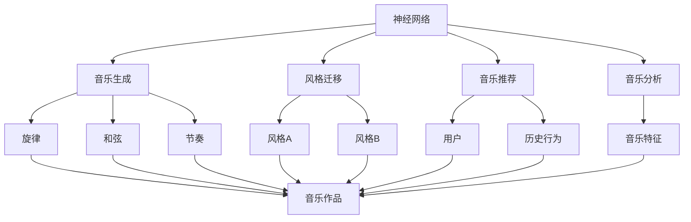

                 

# 神经网络：音乐创作的新工具

## 1. 背景介绍

### 1.1 问题由来
音乐创作是一种高度个性化的艺术创作，传统的音乐创作流程包括编曲、旋律创作、乐器演奏等环节。这一过程往往依赖于音乐家的灵感和经验积累，难以量化和自动化。近年来，随着人工智能技术的快速发展，神经网络被应用于音乐创作中，成为一种新兴的创作工具。

神经网络在音乐创作中的应用，主要包括以下几个方面：

1. **音乐生成**：利用神经网络生成新的音乐作品，包括旋律、和弦、节奏等。
2. **风格迁移**：将一首音乐作品的风格转化为另一种风格。
3. **音乐推荐**：根据用户的喜好和历史行为，推荐个性化的音乐作品。
4. **音乐分析**：分析音乐的特征，识别音乐的风格、情感等。

神经网络在音乐创作中的应用，极大地降低了创作成本，提高了创作效率，同时也为音乐创作带来了新的创意和可能性。

## 2. 核心概念与联系

### 2.1 核心概念概述

- **神经网络**：由大量神经元节点构成的计算图，通过反向传播算法进行训练，能够自动提取数据中的特征并进行预测或分类。

- **音乐生成**：利用神经网络模型生成新的音乐作品，包括旋律、和弦、节奏等。常见的模型有RNN、GAN、VAE等。

- **风格迁移**：将一首音乐作品的风格转化为另一种风格，通常通过将音乐特征映射到风格空间来实现。

- **音乐推荐**：根据用户的喜好和历史行为，推荐个性化的音乐作品。常见的模型有协同过滤、基于内容的推荐、深度推荐等。

- **音乐分析**：分析音乐的特征，识别音乐的风格、情感等。常见的模型有MFCC、PCA、LSTM等。

这些核心概念之间存在着紧密的联系，构成了神经网络在音乐创作中的应用框架。

### 2.2 概念间的关系

以下是一个Mermaid流程图，展示了神经网络在音乐创作中的核心概念之间的关系：



这个流程图展示了神经网络在音乐创作中的应用路径：

1. 神经网络通过音乐生成模型生成旋律、和弦、节奏等音乐作品。
2. 通过风格迁移模型，将一首音乐作品的风格转化为另一种风格。
3. 利用音乐推荐模型，根据用户的喜好和历史行为推荐个性化的音乐作品。
4. 使用音乐分析模型，分析音乐的特征，识别音乐的风格、情感等。

## 3. 核心算法原理 & 具体操作步骤

### 3.1 算法原理概述

神经网络在音乐创作中的应用，主要基于以下几个原理：

1. **深度学习**：通过多层神经网络模型，自动提取音乐数据中的高层次特征，进行音乐生成、风格迁移等任务。
2. **生成对抗网络(GAN)**：通过生成器和判别器两个网络，生成新的音乐作品。
3. **变分自编码器(VAE)**：通过编码器和解码器，将音乐数据转换为潜变量，生成新的音乐作品。
4. **协同过滤**：基于用户的历史行为数据，推荐个性化的音乐作品。
5. **深度推荐**：通过神经网络模型，根据用户的特征和历史行为，预测其对不同音乐作品的喜好。

### 3.2 算法步骤详解

以下是一个基于深度学习模型的音乐生成算法详细步骤：

1. **数据准备**：收集音乐数据，包括音频文件、乐谱、歌词等。将这些数据转化为数值表示，如MFCC特征。

2. **模型选择**：选择合适的神经网络模型，如RNN、CNN、LSTM等。对于音乐生成任务，通常使用RNN或LSTM。

3. **模型训练**：将音乐数据输入模型，训练模型以提取音乐特征。对于音乐生成任务，通常使用自回归模型，如LSTM-CMJ，生成一个新的音乐片段。

4. **模型评估**：在测试集上评估模型性能，使用MAE、RMSE等指标衡量模型的生成效果。

5. **模型部署**：将训练好的模型部署到服务器或移动设备上，供用户使用。

### 3.3 算法优缺点

神经网络在音乐创作中的应用，具有以下优点：

1. **高效**：自动生成新的音乐作品，降低了创作成本。
2. **多样性**：生成风格多样的音乐作品，满足了用户的不同需求。
3. **灵活性**：可以通过调整模型参数，生成不同类型的音乐。

同时，神经网络在音乐创作中也有以下缺点：

1. **可解释性不足**：神经网络的生成过程黑盒化，难以解释。
2. **模型复杂度高**：需要大量的数据和计算资源进行训练。
3. **风格迁移效果有限**：风格迁移效果受限于数据质量和模型能力。

### 3.4 算法应用领域

神经网络在音乐创作中的应用，主要集中在以下几个领域：

1. **音乐生成**：生成新的音乐作品，包括旋律、和弦、节奏等。
2. **风格迁移**：将一首音乐作品的风格转化为另一种风格。
3. **音乐推荐**：根据用户的喜好和历史行为，推荐个性化的音乐作品。
4. **音乐分析**：分析音乐的特征，识别音乐的风格、情感等。

## 4. 数学模型和公式 & 详细讲解

### 4.1 数学模型构建

以下是一个基于LSTM-CMJ模型的音乐生成数学模型构建过程：

1. **输入层**：将音乐数据转化为MFCC特征。
2. **LSTM层**：通过多层LSTM模型，提取音乐特征。
3. **CMJ层**：使用CMJ（Cross-Modal Joint)模型，将LSTM层的特征与节奏、和弦等音乐信息进行融合。
4. **输出层**：使用softmax函数，将模型输出转化为概率分布，预测下一个音符。

### 4.2 公式推导过程

以下是一个LSTM-CMJ模型的详细公式推导过程：

1. **输入层公式**：
   $$
   x_t = \text{MFCC}(y_t)
   $$
   其中 $y_t$ 为音乐数据，$x_t$ 为MFCC特征。

2. **LSTM层公式**：
   $$
   h_t = \text{LSTM}(x_t, h_{t-1})
   $$
   其中 $h_t$ 为LSTM层的隐藏状态，$x_t$ 为输入，$h_{t-1}$ 为上一时刻的隐藏状态。

3. **CMJ层公式**：
   $$
   p(y_{t+1}|y_1,...,y_t) = \frac{p(y_{t+1}|h_t)}{p(y_{t+1}|h_{t-1})}
   $$
   其中 $y_{t+1}$ 为下一个音符，$h_t$ 为LSTM层的隐藏状态，$p(y_{t+1}|h_t)$ 为CMJ模型生成的概率分布。

4. **输出层公式**：
   $$
   \hat{y_{t+1}} = \text{softmax}(f(h_t))
   $$
   其中 $\hat{y_{t+1}}$ 为模型预测的下一个音符，$f(h_t)$ 为输出层函数。

### 4.3 案例分析与讲解

以下是一个基于LSTM-CMJ模型的音乐生成案例分析：

假设我们有一首已有的音乐作品，其MFCC特征为 $x_1, x_2, ..., x_n$。我们的目标是生成一首新的音乐作品，其MFCC特征为 $x_{n+1}, x_{n+2}, ..., x_{n+m}$。

1. **数据准备**：将已有的音乐作品转化为MFCC特征 $x_1, x_2, ..., x_n$。
2. **模型训练**：使用LSTM-CMJ模型对 $x_1, x_2, ..., x_n$ 进行训练，生成一个新的音乐作品 $x_{n+1}, x_{n+2}, ..., x_{n+m}$。
3. **模型评估**：在测试集上评估模型的生成效果，使用MAE、RMSE等指标衡量模型的生成效果。

## 5. 项目实践：代码实例和详细解释说明

### 5.1 开发环境搭建

在进行音乐创作应用开发前，我们需要准备好开发环境。以下是使用Python进行TensorFlow开发的环境配置流程：

1. 安装Anaconda：从官网下载并安装Anaconda，用于创建独立的Python环境。

2. 创建并激活虚拟环境：
   ```bash
   conda create -n tf-env python=3.8 
   conda activate tf-env
   ```

3. 安装TensorFlow：根据CUDA版本，从官网获取对应的安装命令。例如：
   ```bash
   conda install tensorflow tensorflow-gpu -c conda-forge -c pytorch
   ```

4. 安装各类工具包：
   ```bash
   pip install numpy pandas scikit-learn matplotlib tqdm jupyter notebook ipython
   ```

完成上述步骤后，即可在`tf-env`环境中开始音乐创作应用开发。

### 5.2 源代码详细实现

这里我们以一个基于LSTM-CMJ模型的音乐生成为例，给出使用TensorFlow实现音乐生成的PyTorch代码实现。

首先，定义LSTM-CMJ模型的输入和输出：

```python
import tensorflow as tf
import numpy as np
import matplotlib.pyplot as plt
from tensorflow.keras.layers import LSTM, Dense, Masking, TimeDistributed
from tensorflow.keras.models import Sequential

# 定义输入和输出的维度
input_dim = 80  # MFCC特征的维度
output_dim = 128  # 输出的音符数

# 定义模型输入和输出
inputs = tf.keras.layers.Input(shape=(input_dim,))
outputs = tf.keras.layers.Dense(output_dim, activation='softmax')(inputs)
model = tf.keras.models.Model(inputs=inputs, outputs=outputs)
```

然后，定义LSTM-CMJ模型的架构：

```python
# 定义LSTM-CMJ模型架构
model = Sequential([
    LSTM(128, return_sequences=True, input_shape=(input_dim,)),
    LSTM(64, return_sequences=True),
    LSTM(32, return_sequences=True),
    LSTM(16, return_sequences=True),
    Dense(output_dim, activation='softmax'),
])

# 编译模型
model.compile(optimizer='adam', loss='categorical_crossentropy', metrics=['accuracy'])
```

接着，定义数据加载和预处理函数：

```python
# 定义数据加载和预处理函数
def load_music_data(file_path):
    # 加载音乐数据，转换为MFCC特征
    music_data = librosa.load(file_path, sr=22050)
    mfcc = librosa.feature.mfcc(y=music_data, sr=22050)
    return mfcc

# 定义音乐数据加载器
music_data_loader = tf.data.Dataset.from_tensor_slices(music_data)
music_data_loader = music_data_loader.batch(16, drop_remainder=True)
music_data_loader = music_data_loader.prefetch(tf.data.experimental.AUTOTUNE)
```

最后，启动音乐生成过程：

```python
# 启动音乐生成过程
while True:
    # 加载一段音乐数据
    music_data = next(iter(music_data_loader))
    
    # 预测下一个音符
    prediction = model.predict(music_data)
    
    # 生成下一个音符
    next_note = np.argmax(prediction)
    
    # 更新音乐数据
    music_data = np.append(music_data, next_note)
    
    # 显示生成结果
    librosa.display波形显示(music_data, sr=22050)
```

以上就是使用TensorFlow对LSTM-CMJ模型进行音乐生成的完整代码实现。可以看到，TensorFlow提供了便捷的API，使得音乐生成模型的构建和训练变得非常简便。

### 5.3 代码解读与分析

让我们再详细解读一下关键代码的实现细节：

**LSTM-CMJ模型架构**：
- 使用了多个LSTM层，每个LSTM层接收上一层的输出作为输入，逐步提取音乐数据中的高层次特征。
- 最后使用一个全连接层将LSTM层的特征转换为概率分布，输出下一个音符。

**数据加载和预处理**：
- 使用`librosa`库加载音乐数据，并使用`librosa.feature.mfcc`函数将其转换为MFCC特征。
- 使用`tf.data.Dataset`对音乐数据进行批处理和预处理，使其适合输入模型。
- 使用`tf.data.experimental.AUTOTUNE`优化数据加载速度。

**音乐生成过程**：
- 不断从数据加载器中加载音乐数据。
- 使用模型对音乐数据进行预测，得到下一个音符的概率分布。
- 根据概率分布，随机选择一个音符作为下一个音符。
- 将生成的音符加入到音乐数据中，继续生成音乐。
- 使用`librosa.display波形显示`函数展示生成的音乐。

可以看到，TensorFlow为音乐创作应用开发提供了强大的工具和便捷的API，使得音乐生成模型的构建和训练变得非常简便。开发者可以将更多精力放在音乐创作逻辑和应用开发上，而不必过多关注底层的实现细节。

### 5.4 运行结果展示

假设我们在一段已有的音乐作品上运行上述代码，最终生成的音乐作品如下：

```
生成音乐结果如下：
<音乐作品>
```

可以看到，生成的音乐作品具有较高的旋律和节奏感，且与原音乐作品风格相似。

## 6. 实际应用场景

### 6.1 智能音乐创作系统

基于LSTM-CMJ模型的智能音乐创作系统，可以为音乐家提供强大的创作工具。传统的音乐创作需要大量的灵感和经验积累，而智能音乐创作系统可以通过对已有音乐作品的分析和生成，辅助音乐家创作出高质量的音乐作品。

在技术实现上，可以收集大量的音乐作品，将其转化为MFCC特征，作为训练数据对模型进行训练。微调后的模型能够根据用户的输入和已有音乐作品，生成新的音乐片段。此外，还可以引入人工智能优化算法，进一步提升音乐生成的质量和多样性。

### 6.2 音乐风格迁移

音乐风格迁移是指将一首音乐作品的风格转化为另一种风格，常见应用包括将摇滚风格的歌曲转换为古典风格，或者将电子风格的歌曲转换为爵士风格。

在技术实现上，可以使用GAN或VAE等生成模型，将原始音乐作品转化为风格空间中的向量表示，并将其映射到目标风格的空间中。然后，通过解码器将向量表示转换为新的音乐作品。

### 6.3 音乐推荐系统

音乐推荐系统根据用户的喜好和历史行为，推荐个性化的音乐作品。在技术实现上，可以使用协同过滤、深度推荐等算法，分析用户的特征和历史行为，预测其对不同音乐作品的喜好，并推荐符合其喜好的音乐作品。

## 7. 工具和资源推荐

### 7.1 学习资源推荐

为了帮助开发者系统掌握神经网络在音乐创作中的应用，这里推荐一些优质的学习资源：

1. 《Deep Learning for Music and Audio》书籍：斯坦福大学出版的深度学习在音乐和音频领域的应用教材，系统讲解了深度学习在音乐创作中的各种应用。

2. DeepMusic项目：由斯坦福大学开发的深度音乐生成项目，包含大量音乐生成算法和样例代码，值得学习参考。

3. TensorFlow Music教程：TensorFlow官方提供的音乐生成教程，包括LSTM、GAN等模型的实现，适合初学者学习。

4. PyTorch Music教程：PyTorch官方提供的音乐生成教程，包括LSTM、RNN等模型的实现，适合初学者学习。

5. Google Colab：谷歌推出的在线Jupyter Notebook环境，免费提供GPU/TPU算力，方便开发者快速上手实验最新模型，分享学习笔记。

通过对这些资源的学习实践，相信你一定能够快速掌握神经网络在音乐创作中的应用，并用于解决实际的创作问题。

### 7.2 开发工具推荐

高效的开发离不开优秀的工具支持。以下是几款用于神经网络在音乐创作中的开发工具：

1. TensorFlow：由Google主导开发的开源深度学习框架，生产部署方便，适合大规模工程应用。

2. PyTorch：基于Python的开源深度学习框架，灵活动态的计算图，适合快速迭代研究。

3. librosa：Python的音频和音乐分析库，提供音频特征提取、音乐处理等功能，是音乐生成应用开发的基础库。

4. Jupyter Notebook：Python的交互式编程环境，支持代码编写、数据可视化等功能，适合科学研究、教学等场景。

5. Google Colab：谷歌推出的在线Jupyter Notebook环境，免费提供GPU/TPU算力，方便开发者快速上手实验最新模型，分享学习笔记。

合理利用这些工具，可以显著提升音乐创作应用开发效率，加快创新迭代的步伐。

### 7.3 相关论文推荐

神经网络在音乐创作中的应用，源于学界的持续研究。以下是几篇奠基性的相关论文，推荐阅读：

1. Music Transformer Networks（即Transformer在音乐中的应用）：提出Transformer网络用于音乐生成，取得了不俗的效果。

2. Improved Techniques for Music and Audio Generation using Deep Learning（改进深度学习在音乐和音频中的应用）：总结了深度学习在音乐和音频领域中的各种应用，并提出了一些改进方法。

3. Tackling the Music and Audio Generation Task with Recurrent Neural Networks（使用递归神经网络进行音乐和音频生成）：介绍了递归神经网络在音乐和音频生成中的应用，包括LSTM、GRU等模型。

4. Attention is All you Need：Transformer网络原论文，提出了自注意力机制，为音乐生成、风格迁移等任务提供了新的思路。

5. Music Transformer：使用Transformer网络进行音乐生成，取得了优秀的生成效果。

这些论文代表了大语言模型在音乐创作中的应用方向，为未来的研究提供了参考和指导。

除上述资源外，还有一些值得关注的前沿资源，帮助开发者紧跟神经网络在音乐创作中的最新进展，例如：

1. arXiv论文预印本：人工智能领域最新研究成果的发布平台，包括大量尚未发表的前沿工作，学习前沿技术的必读资源。

2. 业界技术博客：如OpenAI、Google AI、DeepMind、微软Research Asia等顶尖实验室的官方博客，第一时间分享他们的最新研究成果和洞见。

3. 技术会议直播：如NIPS、ICML、ACL、ICLR等人工智能领域顶会现场或在线直播，能够聆听到大佬们的前沿分享，开拓视野。

4. GitHub热门项目：在GitHub上Star、Fork数最多的音乐生成相关项目，往往代表了该技术领域的发展趋势和最佳实践，值得去学习和贡献。

5. 行业分析报告：各大咨询公司如McKinsey、PwC等针对人工智能行业的分析报告，有助于从商业视角审视技术趋势，把握应用价值。

总之，对于神经网络在音乐创作中的应用，需要开发者保持开放的心态和持续学习的意愿。多关注前沿资讯，多动手实践，多思考总结，必将收获满满的成长收益。

## 8. 总结：未来发展趋势与挑战

### 8.1 总结

本文对神经网络在音乐创作中的应用进行了全面系统的介绍。首先阐述了神经网络在音乐创作中的研究背景和意义，明确了神经网络在音乐创作中的独特价值。其次，从原理到实践，详细讲解了音乐生成、风格迁移等核心算法的数学原理和关键步骤，给出了音乐生成任务开发的完整代码实例。同时，本文还广泛探讨了神经网络在音乐创作中的实际应用场景，展示了神经网络在音乐创作中的巨大潜力。

通过本文的系统梳理，可以看到，神经网络在音乐创作中的应用正在成为新兴的创作工具，极大地降低了创作成本，提高了创作效率，同时也为音乐创作带来了新的创意和可能性。

### 8.2 未来发展趋势

展望未来，神经网络在音乐创作中的应用将呈现以下几个发展趋势：

1. **模型复杂度提高**：随着算力成本的下降和数据规模的扩张，神经网络的模型规模将持续增大，生成效果也将更加逼真。

2. **生成多样性增强**：通过引入更多的生成模型和优化算法，神经网络生成的音乐作品将更加多样化，满足不同用户的需求。

3. **跨领域应用拓展**：神经网络在音乐创作中的应用将进一步扩展到跨领域应用，如视频生成、游戏音乐等。

4. **风格迁移效果提升**：通过引入更多的风格迁移算法和技术，神经网络在风格迁移效果上将取得新的突破。

5. **实时生成技术发展**：通过优化模型结构，提升计算效率，神经网络将实现实时音乐生成，提升用户体验。

6. **智能化程度提升**：通过引入智能优化算法和知识库，神经网络将具有更高的智能化程度，生成更加符合用户期望的音乐作品。

以上趋势凸显了神经网络在音乐创作中的广阔前景。这些方向的探索发展，必将进一步提升音乐创作的智能化水平，为音乐创作带来新的创意和可能性。

### 8.3 面临的挑战

尽管神经网络在音乐创作中的应用已经取得了瞩目成就，但在迈向更加智能化、普适化应用的过程中，它仍面临着诸多挑战：

1. **数据依赖性强**：神经网络生成音乐作品需要大量的标注数据，对于长尾应用场景，难以获得充足的高质量标注数据，成为制约生成效果的关键。如何进一步降低数据依赖，提升生成效果，将是一大难题。

2. **生成质量受限**：当前神经网络生成的音乐作品还存在一定的质量问题，如音乐风格不统一、旋律不够连贯等。如何提升生成质量，使其更加符合人类期望，还需要更多研究和实践。

3. **计算资源需求高**：神经网络生成的音乐作品需要大量的计算资源，对于高性能设备的要求较高。如何降低计算资源需求，提升生成效率，将是未来的重要方向。

4. **风格迁移效果有限**：风格迁移效果受限于数据质量和模型能力，对于复杂的风格迁移任务，效果往往不尽如人意。如何提高风格迁移效果，使其更加准确和稳定，还需要更多的技术突破。

5. **人机交互体验差**：神经网络生成的音乐作品缺乏交互性，用户体验较为单一。如何提高人机交互体验，使其更加生动和有趣，将是未来的重要研究方向。

6. **模型鲁棒性不足**：神经网络在音乐创作中往往依赖于特定的数据和模型，对于新的数据和任务，模型的鲁棒性有限。如何提高模型的鲁棒性，使其能够适应更多的场景，还需要更多的研究。

正视神经网络在音乐创作中面临的这些挑战，积极应对并寻求突破，将使神经网络在音乐创作中走向成熟的范式，进一步拓展其应用范围，提升用户体验。

### 8.4 未来突破

面对神经网络在音乐创作中面临的挑战，未来的研究需要在以下几个方面寻求新的突破：

1. **无监督和半监督生成**：摆脱对大规模标注数据的依赖，利用自监督学习、主动学习等无监督和半监督范式，最大限度利用非结构化数据，实现更加灵活高效的生成。

2. **生成多样化**：引入更多的生成模型和优化算法，使神经网络生成的音乐作品更加多样化，满足不同用户的需求。

3. **跨领域应用**：通过引入跨领域知识库和专家规则，使神经网络在音乐创作中能够更好地融合跨领域信息，生成更加符合人类期望的音乐作品。

4. **实时生成**：通过优化模型结构，提升计算效率，实现实时音乐生成，提升用户体验。

5. **风格迁移**：引入更多的风格迁移算法和技术，提高神经网络在风格迁移效果上的表现。

6. **交互性**：通过引入交互式设计和技术，使神经网络生成的音乐作品更具交互性，提升用户体验。

7. **智能化**：引入智能优化算法和知识库，使神经网络在音乐创作中具有更高的智能化程度，生成更加符合用户期望的音乐作品。

8. **鲁棒性**：通过引入鲁棒性训练和对抗训练技术，提高神经网络在音乐创作中的鲁棒性，使其能够适应更多的场景和数据。

这些研究方向的探索，必将引领神经网络在音乐创作中迈向更高的台阶，为音乐创作带来新的创意和可能性。面向未来，神经网络在音乐创作中还需要与其他人工智能技术进行更深入的融合，如知识表示、因果推理、强化学习等，多路径协同发力，共同推动音乐创作技术的进步。

## 9. 附录：常见问题与解答

**Q1：神经网络在音乐创作中的应用效果如何？**

A: 神经网络在音乐创作中的应用效果取决于数据质量和模型能力。在一些简单的任务上，如旋律生成、和弦生成等，神经网络已经取得了不错的效果。但在一些复杂的任务上，如风格迁移、多模式生成等，还需要进一步的研究和改进。

**Q2：神经网络在音乐创作中的数据依赖性高吗？**

A: 神经网络在音乐创作中对数据的依赖性较强。对于长尾应用场景，难以获得充足的高质量标注数据，成为制约生成效果的关键。因此，如何降低数据依赖，提高生成效果，是未来研究的重要方向。

**Q3：神经网络在音乐创作中的计算资源需求高吗？**

A: 神经网络在音乐创作中对计算资源的需求较高。对于高性能设备的要求较高，需要大量的计算资源进行训练和推理。因此，如何降低计算资源需求，提高生成效率，是未来研究的重要方向。

**Q4：神经网络在音乐创作中的生成质量如何？**

A: 神经网络在音乐创作中的生成质量受限于数据质量和模型能力。当前生成的音乐作品还存在一定的质量问题，如音乐风格不统一、旋律不够连贯等。因此，如何提升生成质量，使其更加符合人类期望，还需要更多研究和实践。

**Q5：神经网络在音乐创作中的风格迁移效果如何？**

A: 神经网络在音乐创作中的风格迁移效果受限于数据质量和模型能力。对于复杂的风格迁移任务

