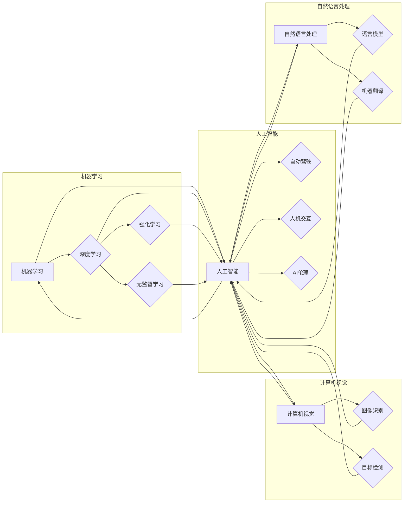

# Andrej Karpathy谈AI的未来展望

> 关键词：Andrej Karpathy, AI未来，机器学习，深度学习，自动驾驶，自然语言处理，人机交互，AI伦理

## 1. 背景介绍

在人工智能领域，Andrej Karpathy是一位备受尊敬的专家，他的工作对深度学习，特别是自然语言处理（NLP）领域产生了深远的影响。在本文中，我们将探讨Andrej Karpathy对未来人工智能的展望，分析他在多个领域的见解，并探讨AI技术如何影响我们的未来。

### 1.1 Andrej Karpathy的贡献

Andrej Karpathy是特斯拉AI首席科学家，同时也是一位知名的博客作者和演讲者。他在深度学习和NLP领域的贡献包括：

- 在Google工作期间，作为Google Brain团队的成员，他对TensorFlow的贡献尤为突出。
- 他开发了著名的神经网络模型代码库，使得深度学习模型的可访问性和可复现性大大提高。
- 他的博客文章《The Unsupervised Approach to Language Modeling》对语言模型的发展产生了重要影响。

### 1.2 研究意义

Andrej Karpathy对未来AI的展望不仅对AI研究人员有重要意义，也对所有关注技术未来的人士具有启示作用。通过分析他的观点，我们可以更好地理解AI的发展趋势，以及它对我们生活的潜在影响。

## 2. 核心概念与联系

### 2.1 核心概念原理和架构的 Mermaid 流程图



### 2.2 核心概念解释

- **机器学习（Machine Learning）**：使计算机通过数据学习并做出决策或预测。
- **深度学习（Deep Learning）**：机器学习的一个子集，使用多层神经网络进行学习。
- **强化学习（Reinforcement Learning）**：机器学习的一个子集，通过奖励信号让机器学习如何采取最佳行动。
- **无监督学习（Unsupervised Learning）**：机器学习的一个子集，通过无标签数据学习模式。
- **计算机视觉（Computer Vision）**：使计算机能够从图像或视频中理解视觉内容。
- **自然语言处理（Natural Language Processing）**：使计算机能够理解、解释和生成人类语言。
- **语言模型（Language Model）**：用于预测下一个单词、句子或文本序列的概率分布。
- **机器翻译（Machine Translation）**：将一种语言的文本自动翻译成另一种语言。
- **自动驾驶（Autonomous Vehicles）**：无需人类驾驶员即可操作的自驾车。
- **人机交互（Human-Computer Interaction）**：研究人与计算机之间的交互方式。
- **AI伦理（AI Ethics）**：探讨人工智能的道德、法律和社会影响。

## 3. 核心算法原理 & 具体操作步骤

### 3.1 算法原理概述

Andrej Karpathy在多个领域的研究中，都强调了以下核心原理：

- **数据驱动**：AI系统的能力很大程度上取决于可用数据的质量和数量。
- **模型可解释性**：尽管深度学习模型在许多任务上表现出色，但其决策过程往往难以解释。提高模型的可解释性对于建立信任至关重要。
- **持续学习**：AI系统需要能够从新数据中学习，以适应不断变化的环境。

### 3.2 算法步骤详解

1. **数据收集**：收集高质量、多样化的数据。
2. **数据预处理**：清洗、标注和转换数据以适应模型。
3. **模型选择**：选择合适的模型架构，如神经网络、决策树或集成学习。
4. **模型训练**：使用训练数据训练模型。
5. **模型评估**：使用验证数据评估模型性能。
6. **模型部署**：将模型部署到实际应用中。
7. **持续优化**：根据用户反馈和性能数据不断优化模型。

### 3.3 算法优缺点

**优点**：

- **高精度**：深度学习模型在许多任务上取得了前所未有的精度。
- **泛化能力**：深度学习模型可以学习到复杂的模式，适用于多种任务。
- **自动化**：数据驱动的AI系统可以自动执行任务，减少人工干预。

**缺点**：

- **数据依赖**：AI系统的性能很大程度上取决于可用数据的质量和数量。
- **模型可解释性**：深度学习模型的决策过程难以解释。
- **计算资源**：训练深度学习模型需要大量的计算资源。

### 3.4 算法应用领域

Andrej Karpathy的研究涉及多个领域，包括：

- **自然语言处理**：语言模型、机器翻译、文本生成。
- **计算机视觉**：图像识别、目标检测、视频理解。
- **自动驾驶**：环境感知、路径规划、决策制定。
- **人机交互**：语音识别、对话系统。

## 4. 数学模型和公式 & 详细讲解 & 举例说明

### 4.1 数学模型构建

在深度学习中，常用的数学模型包括：

- **神经网络**：由多个神经元组成，每个神经元通过权重和偏置连接到其他神经元。
- **损失函数**：用于衡量模型预测值与真实值之间的差异。
- **优化算法**：用于调整模型参数以最小化损失函数。

### 4.2 公式推导过程

以下是一个简单的神经网络模型公式：

$$
\hat{y} = \sigma(W \cdot x + b)
$$

其中，$W$ 是权重矩阵，$x$ 是输入向量，$b$ 是偏置向量，$\sigma$ 是激活函数（如Sigmoid或ReLU）。

### 4.3 案例分析与讲解

以图像分类任务为例，我们可以使用卷积神经网络（CNN）进行模型构建。CNN通过卷积层、池化层和全连接层提取图像特征，并最终进行分类。

## 5. 项目实践：代码实例和详细解释说明

### 5.1 开发环境搭建

为了实现上述数学模型，我们需要搭建以下开发环境：

- **编程语言**：Python
- **深度学习框架**：TensorFlow或PyTorch
- **计算平台**：GPU加速计算

### 5.2 源代码详细实现

以下是一个使用TensorFlow实现图像分类任务的简单示例：

```python
import tensorflow as tf
from tensorflow.keras.models import Sequential
from tensorflow.keras.layers import Conv2D, MaxPooling2D, Flatten, Dense

# 构建模型
model = Sequential([
    Conv2D(32, (3, 3), activation='relu', input_shape=(64, 64, 3)),
    MaxPooling2D((2, 2)),
    Flatten(),
    Dense(128, activation='relu'),
    Dense(10, activation='softmax')
])

# 编译模型
model.compile(optimizer='adam',
              loss='sparse_categorical_crossentropy',
              metrics=['accuracy'])

# 训练模型
model.fit(train_images, train_labels, epochs=10)

# 评估模型
test_loss, test_acc = model.evaluate(test_images, test_labels, verbose=2)
print('
Test accuracy:', test_acc)
```

### 5.3 代码解读与分析

- `Conv2D` 层用于卷积操作，提取图像特征。
- `MaxPooling2D` 层用于降维，减少计算量。
- `Flatten` 层将特征图展平为向量。
- `Dense` 层用于全连接，进行分类。
- `compile` 方法设置优化器、损失函数和评估指标。
- `fit` 方法进行模型训练。
- `evaluate` 方法评估模型性能。

## 6. 实际应用场景

Andrej Karpathy的研究成果在以下场景中得到应用：

- **自然语言处理**：语言模型、机器翻译、文本生成。
- **计算机视觉**：图像识别、目标检测、视频理解。
- **自动驾驶**：环境感知、路径规划、决策制定。
- **人机交互**：语音识别、对话系统。

## 7. 工具和资源推荐

### 7.1 学习资源推荐

- **书籍**：
  - "Deep Learning" by Ian Goodfellow, Yoshua Bengio, and Aaron Courville
  - "Deep Learning with Python" by François Chollet
  - "The Hundred-Page Machine Learning Book" by Andriy Burkov
- **在线课程**：
  - Coursera: "Machine Learning" by Andrew Ng
  - edX: "Deep Learning" by MIT
  - fast.ai: "Practical Deep Learning for Coders"

### 7.2 开发工具推荐

- **编程语言**：Python
- **深度学习框架**：TensorFlow, PyTorch
- **计算平台**：GPU加速计算（如NVIDIA Tesla）

### 7.3 相关论文推荐

- "ImageNet Classification with Deep Convolutional Neural Networks" by Krizhevsky, Sutskever, and Hinton
- "Sequence to Sequence Learning with Neural Networks" by Sutskever, Vinyals, and Le
- "Attention Is All You Need" by Vaswani et al.

## 8. 总结：未来发展趋势与挑战

### 8.1 研究成果总结

Andrej Karpathy的研究成果为深度学习和AI领域做出了重要贡献，推动了AI技术的发展和应用。

### 8.2 未来发展趋势

- **更强大的模型**：更复杂的模型将能够处理更复杂的任务。
- **更高效的计算**：新的硬件和算法将使AI系统更加高效。
- **更广泛的应用**：AI技术将在更多领域得到应用。

### 8.3 面临的挑战

- **数据隐私**：AI系统需要处理大量敏感数据，保护数据隐私至关重要。
- **模型可解释性**：提高模型的可解释性，增强人们对AI的信任。
- **AI伦理**：确保AI技术的发展符合伦理道德标准。

### 8.4 研究展望

- **跨学科研究**：AI技术需要与其他学科（如心理学、哲学）进行交叉研究。
- **人机协作**：AI系统需要与人类协作，共同完成复杂任务。
- **可持续发展**：AI技术需要促进可持续发展，解决全球性问题。

## 9. 附录：常见问题与解答

### 9.1 AI是否会取代人类？

A: AI可以执行许多重复性和高精度的工作，但人类的创造力、情感和道德判断是AI难以替代的。

### 9.2 AI会带来失业吗？

A: AI可能会导致某些工作被自动化，但也会创造新的就业机会。

### 9.3 如何确保AI的安全性和可解释性？

A: 需要制定相应的法律、政策和标准，并提高AI系统的透明度和可解释性。

### 9.4 AI技术会对社会产生哪些影响？

A: AI技术将对教育、医疗、交通、娱乐等领域产生深远影响。

---

作者：禅与计算机程序设计艺术 / Zen and the Art of Computer Programming