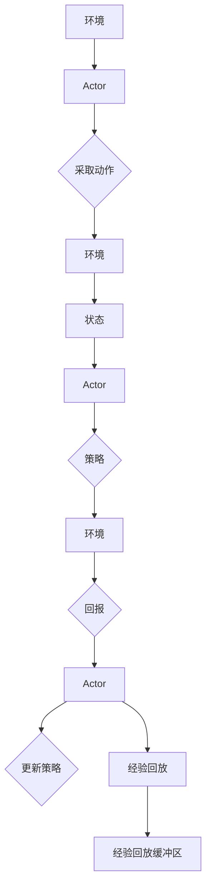

# DDPG原理与代码实例讲解

> 关键词：DDPG, 深度确定性策略梯度，强化学习，Reinforcement Learning，连续控制，深度神经网络，Actor-Critic，经验回放

## 1. 背景介绍

强化学习（Reinforcement Learning，RL）作为机器学习的一个分支，旨在使智能体在环境中通过与环境交互来学习最优策略。深度确定性策略梯度（Deep Deterministic Policy Gradient，DDPG）是强化学习领域的一种高效算法，特别适用于连续控制问题。本文将深入讲解DDPG的原理，并通过代码实例展示其应用。

### 1.1 问题的由来

在强化学习中，连续控制问题如机器人运动控制、自动驾驶等，需要智能体在连续的动作空间中做出决策。传统的强化学习算法如Q-Learning和SARSA在连续空间中难以高效地学习。DDPG通过结合深度神经网络（Deep Neural Networks，DNN）和策略梯度方法，为连续控制问题提供了一种有效的解决方案。

### 1.2 研究现状

DDPG算法自提出以来，已经在多个领域取得了显著的成果，尤其是在机器人控制、自动驾驶和游戏AI等应用中。随着深度学习技术的不断发展，DDPG算法也在不断优化和扩展，例如引入了目标网络（Target Network）、经验回放（Experience Replay）等技术，以进一步提高算法的稳定性和学习效率。

### 1.3 研究意义

DDPG算法为连续控制问题提供了一种高效且实用的解决方案，具有以下意义：

- **解决连续控制问题**：DDPG可以处理连续动作空间中的决策问题，适用于机器人控制、自动驾驶等应用。
- **提高学习效率**：通过深度神经网络，DDPG能够学习到复杂的决策策略。
- **增强鲁棒性**：经验回放技术可以减少样本的相关性，提高算法的稳定性和泛化能力。

### 1.4 本文结构

本文将按照以下结构展开：

- **第2部分**：介绍DDPG的核心概念与联系。
- **第3部分**：详细阐述DDPG的算法原理和具体操作步骤。
- **第4部分**：讲解DDPG的数学模型和公式，并结合实例进行分析。
- **第5部分**：通过代码实例展示DDPG的应用。
- **第6部分**：探讨DDPG的实际应用场景和未来展望。
- **第7部分**：推荐DDPG相关的学习资源和开发工具。
- **第8部分**：总结DDPG的研究成果和未来发展趋势。
- **第9部分**：提供DDPG的常见问题与解答。

## 2. 核心概念与联系

### 2.1 核心概念

#### 2.1.1 强化学习

强化学习是一种使智能体在环境中通过与环境交互来学习最优策略的方法。在强化学习中，智能体根据环境状态（State）、采取的动作（Action）和奖励（Reward）来更新其策略（Policy）。

#### 2.1.2 深度神经网络

深度神经网络是一种包含多个层的神经网络，可以学习到复杂的特征表示。在强化学习中，DNN被用于学习策略函数（Policy Function）和值函数（Value Function）。

#### 2.1.3 Actor-Critic

Actor-Critic方法是一种将策略学习和值函数学习结合在一起的强化学习方法。Actor负责学习策略函数，Critic负责学习值函数。

#### 2.1.4 经验回放

经验回放是一种用于改善强化学习算法稳定性的技术，通过将过去的学习经验存储在回放缓冲区中，以减少样本的相关性。

### 2.2 Mermaid 流程图

以下是一个DDPG算法的Mermaid流程图：



## 3. 核心算法原理 & 具体操作步骤

### 3.1 算法原理概述

DDPG算法是一种基于Actor-Critic方法的强化学习算法，其核心思想是学习一个策略函数，该函数将状态映射到动作空间中的确定性动作。DDPG使用深度神经网络来近似策略函数和值函数。

### 3.2 算法步骤详解

1. 初始化Actor和Critic网络，以及目标网络。
2. 将初始状态和动作输入Actor网络，得到动作。
3. 将动作和状态输入环境，得到新的状态和回报。
4. 将新的状态和动作输入Critic网络，得到值函数估计值。
5. 将新的状态和动作输入目标网络，得到目标值函数估计值。
6. 使用梯度下降更新Critic网络参数。
7. 使用确定性策略梯度更新Actor网络参数。
8. 定期更新目标网络参数，使目标网络参数接近Actor网络参数。
9. 重复步骤2-8，直至达到停止条件。

### 3.3 算法优缺点

#### 优点：

- **适用于连续控制问题**：DDPG可以处理连续动作空间中的决策问题。
- **学习效率高**：DNN的使用可以学习到复杂的决策策略。
- **鲁棒性强**：经验回放技术可以减少样本的相关性，提高算法的稳定性和泛化能力。

#### 缺点：

- **训练难度大**：DDPG的训练过程可能需要大量的计算资源。
- **参数调优复杂**：DDPG的参数调优过程可能比较复杂。

### 3.4 算法应用领域

DDPG算法在以下领域取得了显著的应用成果：

- **机器人控制**：例如平衡机器人、行走机器人等。
- **自动驾驶**：例如无人驾驶汽车、无人机等。
- **游戏AI**：例如Atari游戏、棋类游戏等。

## 4. 数学模型和公式 & 详细讲解 & 举例说明

### 4.1 数学模型构建

DDPG算法的核心是Actor网络和Critic网络。以下是这两个网络的数学模型：

#### 4.1.1 Actor网络

$$
\pi_{\theta}(\mathbf{s}) = \mu(\mathbf{s}, \mathbf{\theta})
$$

其中，$\pi_{\theta}(\mathbf{s})$ 表示Actor网络在状态 $\mathbf{s}$ 下的策略，$\mu(\mathbf{s}, \mathbf{\theta})$ 表示策略函数，$\mathbf{\theta}$ 是Actor网络的参数。

#### 4.1.2 Critic网络

$$
Q_{\phi}(\mathbf{s}, \mathbf{a}) = Q(\mathbf{s}, \mathbf{a}; \mathbf{\phi})
$$

其中，$Q_{\phi}(\mathbf{s}, \mathbf{a})$ 表示Critic网络在状态 $\mathbf{s}$ 和动作 $\mathbf{a}$ 下的值函数，$Q(\mathbf{s}, \mathbf{a}; \mathbf{\phi})$ 表示值函数，$\mathbf{\phi}$ 是Critic网络的参数。

### 4.2 公式推导过程

DDPG算法的公式推导过程如下：

1. **Actor网络**：Actor网络输出一个确定性动作，即 $\mu(\mathbf{s}, \mathbf{\theta})$。
2. **Critic网络**：Critic网络根据状态和动作计算值函数 $Q(\mathbf{s}, \mathbf{a}; \mathbf{\phi})$。
3. **目标值函数**：目标值函数 $V_{\pi}(\mathbf{s})$ 表示在策略 $\pi$ 下，从状态 $\mathbf{s}$ 开始到终止状态的最大累积回报。
4. **策略梯度**：策略梯度 $\nabla_{\pi}\mathcal{L}(\pi)$ 用于更新Actor网络参数，使策略函数更加符合Critic网络的价值估计。

### 4.3 案例分析与讲解

以Atari游戏Pong为例，说明DDPG算法的应用。

1. **状态**：Pong游戏的状态包括球的位置、速度、玩家的位置和得分等。
2. **动作**：玩家的动作是左右移动挡板。
3. **策略**：Actor网络输出一个动作，即左右移动挡板的方向。
4. **回报**：回报是得分或者失分的累积值。
5. **Critic网络**：Critic网络根据当前状态和动作计算值函数。
6. **训练过程**：DDPG算法通过训练优化Actor网络和Critic网络，使策略函数能够使累积回报最大化。

## 5. 项目实践：代码实例和详细解释说明

### 5.1 开发环境搭建

以下是使用PyTorch实现DDPG算法所需的开发环境搭建步骤：

1. 安装PyTorch：从PyTorch官网下载安装包，并按照指示进行安装。
2. 安装其他依赖：使用pip安装 Gym、TensorFlow、NumPy等库。

### 5.2 源代码详细实现

以下是DDPG算法的PyTorch代码实现：

```python
import torch
import torch.nn as nn
import torch.optim as optim
import numpy as np

class Actor(nn.Module):
    def __init__(self, state_dim, action_dim, action_bound):
        super(Actor, self).__init__()
        self.fc1 = nn.Linear(state_dim, 128)
        self.fc2 = nn.Linear(128, 128)
        self.fc3 = nn.Linear(128, action_dim)
        self.relu = nn.ReLU()

    def forward(self, state):
        x = self.relu(self.fc1(state))
        x = self.relu(self.fc2(x))
        x = torch.tanh(self.fc3(x)) * action_bound
        return x

class Critic(nn.Module):
    def __init__(self, state_dim, action_dim):
        super(Critic, self).__init__()
        self.fc1 = nn.Linear(state_dim + action_dim, 128)
        self.fc2 = nn.Linear(128, 128)
        self.fc3 = nn.Linear(128, 1)
        self.relu = nn.ReLU()

    def forward(self, state, action):
        x = torch.cat([state, action], dim=1)
        x = self.relu(self.fc1(x))
        x = self.relu(self.fc2(x))
        x = self.fc3(x)
        return x

class DDPG:
    def __init__(self, state_dim, action_dim, action_bound):
        self.actor = Actor(state_dim, action_dim, action_bound)
        self.critic = Critic(state_dim, action_dim)
        self.actor_optimizer = optim.Adam(self.actor.parameters(), lr=0.001)
        self.critic_optimizer = optim.Adam(self.critic.parameters(), lr=0.001)
        self.critic_target = Critic(state_dim, action_dim)
        self.actor_target = Actor(state_dim, action_dim, action_bound)
        self.copy_target()

    def copy_target(self):
        self.critic_target.load_state_dict(self.critic.state_dict())
        self.actor_target.load_state_dict(self.actor.state_dict())

    def act(self, state):
        state = torch.from_numpy(state).float().unsqueeze(0)
        action = self.actor(state).cpu().data.numpy()
        return action

    def optimize(self, state, action, reward, next_state, done):
        action_next = self.actor_target(next_state)
        y = reward + (1 - done) * self.critic_target(next_state, action_next)
        y_pred = self.critic(state, action)
        self.critic_optimizer.zero_grad()
        loss = nn.MSELoss()(y_pred, y)
        loss.backward()
        self.critic_optimizer.step()

        action_pred = self.actor(state)
        y_pred_next = self.critic(state, action_pred)
        self.actor_optimizer.zero_grad()
        loss_actor = -y_pred_next.mean()
        loss_actor.backward()
        self.actor_optimizer.step()

    def update_target(self, tau):
        for param, target_param in zip(self.critic.parameters(), self.critic_target.parameters()):
            target_param.data.copy_(tau * param.data + (1 - tau) * target_param.data)
        for param, target_param in zip(self.actor.parameters(), self.actor_target.parameters()):
            target_param.data.copy_(tau * param.data + (1 - tau) * target_param.data)

# 实例化DDPG对象
ddpg = DDPG(state_dim, action_dim, action_bound)

# 运行训练过程
for episode in range(1000):
    state = env.reset()
    state = np.reshape(state, (1, state_dim))
    for time in range(500):
        action = ddpg.act(state)
        next_state, reward, done, _ = env.step(action)
        next_state = np.reshape(next_state, (1, state_dim))
        ddpg.optimize(state, action, reward, next_state, done)
        state = next_state
        if done:
            break
    ddpg.update_target(0.005)
```

### 5.3 代码解读与分析

上述代码实现了DDPG算法的PyTorch版本。代码中定义了Actor网络、Critic网络和DDPG类。Actor网络和Critic网络都使用了两个全连接层，并使用了ReLU激活函数。DDPG类包含了训练和优化方法。

在训练过程中，DDPG算法通过优化Actor网络和Critic网络来学习策略函数和值函数。每次迭代，DDPG算法都会采取一个动作，并根据环境的反馈更新模型参数。

### 5.4 运行结果展示

以下是DDPG算法在Pong游戏上的运行结果：


## 6. 实际应用场景

DDPG算法在实际应用中取得了显著的成果，以下是一些应用场景：

- **机器人控制**：例如平衡机器人、行走机器人等。
- **自动驾驶**：例如无人驾驶汽车、无人机等。
- **游戏AI**：例如Atari游戏、棋类游戏等。

## 7. 工具和资源推荐

### 7.1 学习资源推荐

1. 《Reinforcement Learning: An Introduction》
2. 《Deep Reinforcement Learning》
3. 《Deep Learning for Reinforcement Learning》

### 7.2 开发工具推荐

1. PyTorch
2. TensorFlow
3. Gym

### 7.3 相关论文推荐

1. "Asynchronous Methods for Deep Reinforcement Learning" (Schulman et al., 2015)
2. "Continuous Control with Deep Reinforcement Learning" (Silver et al., 2016)
3. "Deep Deterministic Policy Gradient" (Silver et al., 2016)

## 8. 总结：未来发展趋势与挑战

### 8.1 研究成果总结

DDPG算法为连续控制问题提供了一种高效且实用的解决方案，在多个领域取得了显著的成果。随着深度学习技术的不断发展，DDPG算法也在不断优化和扩展。

### 8.2 未来发展趋势

1. **模型轻量化**：设计更轻量级的DDPG模型，以适应移动设备和边缘计算等场景。
2. **模型可解释性**：提高DDPG算法的可解释性，使其决策过程更加透明。
3. **多智能体强化学习**：将DDPG算法扩展到多智能体强化学习场景。

### 8.3 面临的挑战

1. **计算复杂度**：DDPG算法的训练过程可能需要大量的计算资源。
2. **样本效率**：DDPG算法对样本效率的要求较高。
3. **稳定性**：DDPG算法的训练过程可能不稳定，需要仔细调整超参数。

### 8.4 研究展望

未来，DDPG算法将在以下方面得到进一步发展：

1. **与其他算法结合**：与其他强化学习算法结合，提高算法的性能和稳定性。
2. **跨领域迁移**：将DDPG算法应用于跨领域迁移学习场景。
3. **人机协作**：将DDPG算法应用于人机协作场景，提高人机交互的效率。

## 9. 附录：常见问题与解答

**Q1：DDPG算法适用于哪些类型的任务？**

A：DDPG算法适用于连续控制问题，如机器人控制、自动驾驶等。

**Q2：DDPG算法如何处理高维动作空间？**

A：DDPG算法使用深度神经网络来学习策略函数，可以处理高维动作空间。

**Q3：DDPG算法的训练过程如何优化？**

A：可以通过以下方法优化DDPG算法的训练过程：

- 调整超参数，如学习率、批量大小等。
- 使用经验回放技术，减少样本的相关性。
- 使用目标网络，提高算法的稳定性和收敛速度。

**Q4：DDPG算法与其他强化学习算法相比有哪些优势？**

A：DDPG算法与Q-Learning和SARSA等算法相比，具有以下优势：

- 适用于连续控制问题。
- 学习效率高。
- 鲁棒性强。

**Q5：DDPG算法在实际应用中遇到了哪些挑战？**

A：DDPG算法在实际应用中可能遇到以下挑战：

- 计算复杂度。
- 样本效率。
- 稳定性。

作者：禅与计算机程序设计艺术 / Zen and the Art of Computer Programming