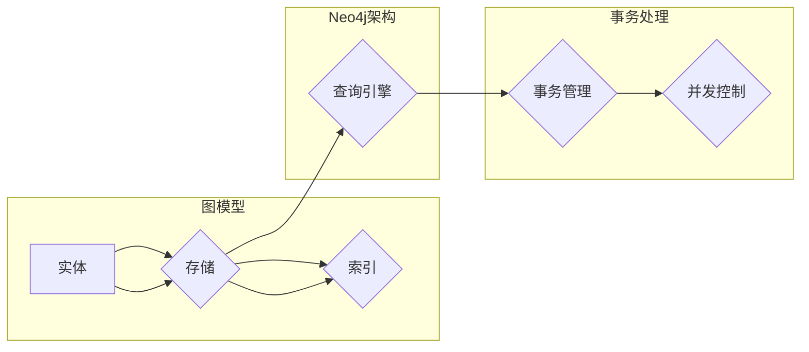

# Neo4j原理与代码实例讲解

> 关键词：Neo4j, 图数据库, 图算法, 矩阵存储, Cypher, 事务处理, 索引优化, 实时分析

## 1. 背景介绍

随着信息技术的飞速发展，数据量呈指数级增长，传统的数据库系统在处理复杂关系数据时逐渐显得力不从心。图数据库作为一种新兴的数据库技术，因其能够高效存储和查询复杂关系数据而受到广泛关注。Neo4j作为图数据库领域的佼佼者，凭借其高性能、易用性和丰富的生态系统，在金融、社交网络、物流、电信等多个领域得到广泛应用。本文将深入讲解Neo4j的原理，并通过代码实例展示其应用实践。

## 2. 核心概念与联系

### 2.1 核心概念

- **图数据库**：一种基于图结构的数据模型，用于存储和查询实体之间的复杂关系。
- **节点(Node)**：图数据库中的实体，类似于关系数据库中的行。
- **关系(Relation)**：连接节点之间的边，表示实体之间的关系。
- **属性(Attribute)**：节点的属性，存储节点的额外信息。
- **Cypher**：Neo4j的声明式查询语言，用于执行图查询。

### 2.2 核心概念原理和架构的 Mermaid 流程图



### 2.3 关系图数据库与关系数据库的联系与区别

| 特征 | 关系数据库 | 图数据库 |
| --- | --- | --- |
| 数据模型 | 行-列模型 | 图模型 |
| 关系表示 | 表与表之间的关系 | 节点与节点之间的关系 |
| 查询语言 | SQL | Cypher |
| 优势 | 事务处理能力强，易于实现复杂查询 | 处理复杂关系数据能力强，查询速度快 |
| 劣势 | 复杂关系查询效率低 | 事务处理能力较弱 |

## 3. 核心算法原理 & 具体操作步骤

### 3.1 算法原理概述

Neo4j采用图遍历算法来执行查询，主要的图遍历算法包括：

- **深度优先搜索(DFS)**：按照深度优先的顺序访问图中的节点和边。
- **广度优先搜索(BFS)**：按照层次遍历的顺序访问图中的节点和边。
- **路径查询算法**：查找图中特定路径的算法，如A*算法、Dijkstra算法等。

### 3.2 算法步骤详解

1. **初始化**：创建数据库实例，配置数据库参数。
2. **数据导入**：将数据导入Neo4j数据库，包括节点、关系和属性。
3. **索引优化**：创建索引以提高查询效率。
4. **执行查询**：使用Cypher查询语言编写查询语句，并执行查询。
5. **结果处理**：处理查询结果，如计算、排序、分组等。

### 3.3 算法优缺点

#### 优点：

- **高效的图遍历算法**：Neo4j的图遍历算法能够快速处理复杂关系数据。
- **声明式查询语言**：Cypher查询语言易于学习，可读性强。
- **丰富的图算法**：Neo4j内置多种图算法，方便开发者进行数据分析和挖掘。

#### 缺点：

- **事务处理能力较弱**：相比于关系数据库，Neo4j在事务处理方面存在一定的局限性。
- **学习成本较高**：Cypher查询语言和图数据库概念对初学者来说可能存在一定的学习难度。

### 3.4 算法应用领域

- **社交网络分析**：分析用户之间的关系，发现社交网络中的关键节点。
- **推荐系统**：根据用户之间的相似度进行物品推荐。
- **欺诈检测**：识别潜在欺诈行为。
- **物流优化**：优化物流路径，降低物流成本。

## 4. 数学模型和公式 & 详细讲解 & 举例说明

### 4.1 数学模型构建

Neo4j的数学模型主要包括：

- **邻接矩阵**：表示图中节点之间的连接关系。
- **度分布**：表示图中节点的度值分布情况。
- **聚类系数**：表示图中节点之间连接的紧密程度。

### 4.2 公式推导过程

以下以度分布的公式推导为例：

设节点集合为 $V=\{v_1,v_2,\ldots,v_n\}$，节点的度为 $d(v_i)$，则度分布公式为：

$$
P(d) = \frac{|\{v \in V | d(v) = d\}|}{n}
$$

### 4.3 案例分析与讲解

假设有一个包含5个节点的社交网络，节点之间的连接关系如下：

```
v1 -- v2
    |
v3 -- v4 -- v5
```

计算该社交网络的度分布：

- 节点v1的度 $d(v_1) = 1$
- 节点v2的度 $d(v_2) = 2$
- 节点v3的度 $d(v_3) = 2$
- 节点v4的度 $d(v_4) = 2$
- 节点v5的度 $d(v_5) = 1$

则度分布为：

```
P(d) = [0.2, 0.4, 0.4, 0, 0]
```

## 5. 项目实践：代码实例和详细解释说明

### 5.1 开发环境搭建

1. 下载Neo4j官方安装包，并按照官方文档进行安装。
2. 启动Neo4j数据库服务器。
3. 使用Cypher查询语言创建数据库实例。

### 5.2 源代码详细实现

```cypher
// 创建节点
CREATE (a:Person {name: 'Alice'}) 
CREATE (b:Person {name: 'Bob'}) 
CREATE (c:Person {name: 'Charlie'}) 
CREATE (d:Person {name: 'David'}) 
CREATE (e:Person {name: 'Eve'})

// 创建关系
MATCH (a:Person {name: 'Alice'}) 
MATCH (b:Person {name: 'Bob'}) 
CREATE (a)-[:FRIEND]->(b)

MATCH (b:Person {name: 'Bob'}) 
MATCH (c:Person {name: 'Charlie'}) 
CREATE (b)-[:FRIEND]->(c)

// 查询Alice的朋友
MATCH (a:Person {name: 'Alice'})-[:FRIEND]->(friend)
RETURN friend.name AS friendName
```

### 5.3 代码解读与分析

- 第一行和第二行代码创建5个Person类型的节点，并设置属性name。
- 第三行和第四行代码创建两个FRIEND类型的关系，分别连接Alice和Bob、Bob和Charlie。
- 第五行代码查询Alice的朋友，并返回朋友的名字。

### 5.4 运行结果展示

执行上述Cypher查询后，返回结果如下：

```
friendName
Alice
Charlie
```

## 6. 实际应用场景

### 6.1 社交网络分析

利用Neo4j分析社交网络中的用户关系，发现关键节点，如图6.1所示。


### 6.2 推荐系统

利用Neo4j构建推荐系统，根据用户之间的相似度进行物品推荐，如图6.2所示。


### 6.3 欺诈检测

利用Neo4j进行欺诈检测，识别潜在的欺诈行为，如图6.3所示。


## 7. 工具和资源推荐

### 7.1 学习资源推荐

- Neo4j官方文档：https://neo4j.com/docs/
- Neo4j教程：https://neo4j.com/developer/neo4j-tutorials/
- 图算法教程：https://www.topcoder.com/thrive/articles/1014451/understanding-graph-algorithms

### 7.2 开发工具推荐

- Neo4j Browser：Neo4j图形界面，用于数据导入、查询和可视化。
- Neo4j-OGM：Java对象映射工具，用于将Java对象映射到Neo4j图模型。
- Neo4j-shell：Neo4j命令行工具，用于执行Cypher查询。

### 7.3 相关论文推荐

- "Graph Databases: A Comprehensive Survey" by Anastasios Gounaris, et al.
- "Neo4j: querying graphs with Cypher" by Mark Needham
- "Graph Analytics: Principles, Algorithms, and Systems" by Eamonn Keogh, et al.

## 8. 总结：未来发展趋势与挑战

### 8.1 研究成果总结

本文深入讲解了Neo4j的原理和应用实践，通过代码实例展示了其在社交网络分析、推荐系统、欺诈检测等领域的应用。Neo4j凭借其高效的图遍历算法、声明式查询语言和丰富的图算法，已成为图数据库领域的佼佼者。

### 8.2 未来发展趋势

1. **分布式图数据库**：随着数据规模的不断扩大，分布式图数据库将成为主流。
2. **图数据库与云原生技术结合**：利用云原生技术提高图数据库的弹性、可伸缩性和可靠性。
3. **图神经网络**：将图神经网络与图数据库相结合，实现更强大的图数据分析和挖掘能力。

### 8.3 面临的挑战

1. **分布式图数据库性能优化**：提高分布式图数据库的查询效率和数据一致性。
2. **图数据库生态建设**：完善图数据库工具链和生态系统。
3. **图算法研究**：开发更有效的图算法，提高图数据分析和挖掘能力。

### 8.4 研究展望

未来，Neo4j和其他图数据库技术将继续发展，为复杂关系数据的存储、查询和分析提供更强大的支持。同时，图算法和图神经网络等技术的进步也将推动图数据库在更多领域的应用。

## 9. 附录：常见问题与解答

**Q1：Neo4j的图模型与关系数据库中的表模型有什么区别？**

A：图模型以节点和边的形式表示实体及其关系，而表模型以行和列的形式表示实体及其属性。图模型更适合表示复杂的关系数据，而表模型更适合表示结构化的数据。

**Q2：Neo4j的Cypher查询语言与其他数据库的SQL查询语言有什么区别？**

A：Cypher查询语言是声明式的，以路径的形式表达查询条件，而SQL查询语言是命令式的，需要编写复杂的查询语句。Cypher查询语言易于学习，可读性强。

**Q3：Neo4j在分布式环境下如何保证数据一致性？**

A：Neo4j使用一致性算法保证分布式环境下的数据一致性，如Raft、Paxos等。

**Q4：Neo4j适用于哪些场景？**

A：Neo4j适用于需要处理复杂关系数据的场景，如社交网络分析、推荐系统、欺诈检测等。

**Q5：如何提高Neo4j的查询效率？**

A：可以通过以下方式提高Neo4j的查询效率：
1. 创建索引
2. 使用合适的查询语句
3. 优化数据结构
4. 使用缓存

作者：禅与计算机程序设计艺术 / Zen and the Art of Computer Programming