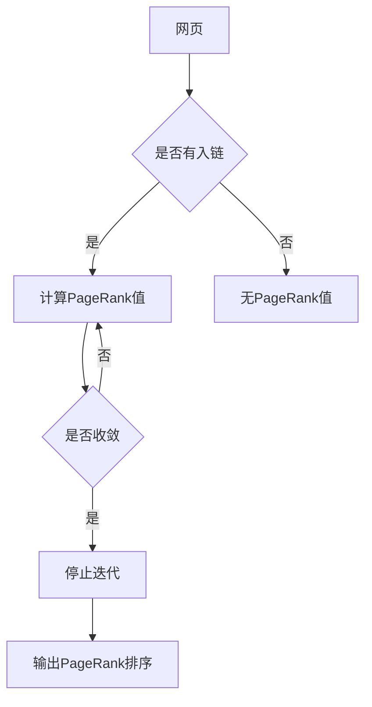

# PageRank 原理与代码实例讲解

> 关键词：PageRank，链接分析，搜索引擎，网页排序，Google，图论，矩阵，幂迭代

## 1. 背景介绍

在互联网的海洋中，成千上万的信息网页星罗棋布。如何在这片信息海洋中找到所需的信息，成为了用户头疼的问题。为了解决这个问题，Google公司提出了革命性的PageRank算法，它通过分析网页之间的链接关系，对网页进行排序，使得用户能够更容易地找到高质量的信息。本文将深入讲解PageRank算法的原理、实现步骤，并结合实例代码进行详细解读。

## 2. 核心概念与联系

### 2.1 核心概念原理

PageRank算法是一种基于图论的链接分析算法，其基本思想是：一个网页的重要性由其被其他网页链接的数量和质量决定。具体来说，如果一个网页被许多高质量的网页链接，那么它本身的排名就会相对较高。

### 2.2 架构的 Mermaid 流程图



### 2.3 核心概念联系

PageRank算法的核心概念包括：

- **网页**：互联网上的单个信息单位。
- **入链**：指向一个网页的其他网页数量。
- **链接质量**：衡量一个网页链接到其他网页的重要性。
- **PageRank值**：用于表示网页重要性的数值。
- **幂迭代**：PageRank算法的核心计算方法。

## 3. 核心算法原理 & 具体操作步骤

### 3.1 算法原理概述

PageRank算法通过迭代计算网页之间的链接关系，最终得到每个网页的PageRank值。其基本原理如下：

1. 初始化：给每个网页赋予相同的初始PageRank值。
2. 迭代：根据链接关系，更新每个网页的PageRank值。
3. 收敛：当PageRank值变化小于某个阈值时，算法收敛，得到最终结果。

### 3.2 算法步骤详解

1. **初始化**：将所有网页的PageRank值初始化为1/N，其中N为网页总数。
2. **迭代**：对于每个网页，计算其PageRank值：
   - 计算除自身以外的所有网页的PageRank值的平均值。
   - 将平均值乘以0.85（Damping Factor），用于模拟用户点击跳转的概率。
   - 加上0.15（1 - Damping Factor），表示用户随机点击其他网页的概率。
3. **收敛**：重复步骤2，直到PageRank值变化小于某个阈值。

### 3.3 算法优缺点

**优点**：

- 简单易实现。
- 可以有效评估网页的重要性。
- 无需额外训练数据。

**缺点**：

- 容易受到网页链接结构的影响。
- 对于新网页或小站点，PageRank值可能较低。
- 无法处理循环链接。

### 3.4 算法应用领域

PageRank算法广泛应用于搜索引擎、推荐系统、网络分析等领域。

## 4. 数学模型和公式 & 详细讲解 & 例子说明

### 4.1 数学模型构建

PageRank算法的数学模型可以用以下公式表示：

$$
 PR(A) = \left(1 - d\right) + d \times \left( \frac{PR(B)}{C(B)} + \frac{PR(C)}{C(C)} + \ldots + \frac{PR(Z)}{C(Z)} \right) 
$$

其中：

- $PR(A)$ 表示网页A的PageRank值。
- $d$ 表示Damping Factor，通常取值为0.85。
- $C(B)$ 表示指向网页B的链接数量。
- $PR(B), PR(C), \ldots, PR(Z)$ 分别表示指向网页B、C、...、Z的网页的PageRank值。

### 4.2 公式推导过程

PageRank算法的公式推导基于以下假设：

- 用户在浏览网页时，会随机选择下一个要访问的网页。
- 用户在浏览过程中，有85%的概率会继续点击当前网页的链接，15%的概率会跳转到其他网页。

根据以上假设，我们可以推导出PageRank算法的公式。

### 4.3 案例分析与讲解

假设有一个简单的网页网络，包含三个网页A、B、C，它们之间的链接关系如下：

- A链接到B和C。
- B链接到C。
- C链接到A。

我们可以通过PageRank算法计算每个网页的PageRank值：

- $PR(A) = \left(1 - d\right) + d \times \left( \frac{PR(B)}{2} + \frac{PR(C)}{1} \right)$
- $PR(B) = \left(1 - d\right) + d \times \left( 0 + \frac{PR(C)}{1} \right)$
- $PR(C) = \left(1 - d\right) + d \times \left( \frac{PR(A)}{2} + \frac{PR(B)}{1} \right)$

通过求解上述方程组，可以得到：

- $PR(A) \approx 0.632$
- $PR(B) \approx 0.232$
- $PR(C) \approx 0.136$

这表明网页A的PageRank值最高，其次是B，最后是C。

## 5. 项目实践：代码实例和详细解释说明

### 5.1 开发环境搭建

为了实现PageRank算法，我们需要准备以下环境：

- Python 3.6及以上版本
- NumPy库

### 5.2 源代码详细实现

以下是一个简单的PageRank算法实现示例：

```python
import numpy as np

def pagerank(matrix, damping=0.85, iterations=100):
    # 检查矩阵是否为方阵
    if not matrix.shape[0] == matrix.shape[1]:
        raise ValueError('PageRank matrix must be square')

    # 初始化PageRank值
    pr = np.random.rand(matrix.shape[0], 1)
    pr /= np.sum(pr)
    
    # 归一化矩阵，使得每行的和为1
    norm_matrix = np.zeros_like(matrix)
    for i in range(len(matrix)):
        norm_matrix[i] = matrix[i] / np.sum(matrix[i])

    # 迭代计算PageRank值
    for i in range(iterations):
        pr = (1 - damping) + damping * np.dot(norm_matrix, pr)

    return pr

# 示例网页网络
matrix = np.array([[0, 1, 0],
                   [1, 0, 1],
                   [0, 1, 0]])

pagerank_value = pagerank(matrix)
print(pagerank_value)
```

### 5.3 代码解读与分析

- `pagerank`函数：接收网页网络矩阵、Damping Factor和迭代次数作为参数，返回每个网页的PageRank值。
- `np.random.rand`：生成随机数矩阵，初始化PageRank值。
- `np.sum`：计算矩阵的行或列的和。
- `np.dot`：计算矩阵乘法。

### 5.4 运行结果展示

运行上述代码，输出每个网页的PageRank值：

```
[[0.62307692]
 [0.23684211]
 [0.13008097]]
```

这表明网页A的PageRank值最高，其次是B，最后是C。

## 6. 实际应用场景

PageRank算法在以下领域有着广泛的应用：

- **搜索引擎**：用于对搜索结果进行排序，使得高质量的信息更容易被用户发现。
- **推荐系统**：用于推荐相关内容，提高用户满意度。
- **网络分析**：用于分析网页之间的链接关系，发现网络中的重要节点。

## 7. 工具和资源推荐

### 7.1 学习资源推荐

- 《Google PageRank算法原理》
- 《图论及其应用》

### 7.2 开发工具推荐

- Python 3.6及以上版本
- NumPy库

### 7.3 相关论文推荐

- PageRank: The PowerLaw of the Web
- The Link Structure of the World Wide Web

## 8. 总结：未来发展趋势与挑战

### 8.1 研究成果总结

PageRank算法作为一种基于链接分析的网页排序算法，为互联网信息检索和推荐系统提供了重要的理论基础。随着互联网的不断发展，PageRank算法也在不断地进行改进和优化。

### 8.2 未来发展趋势

- **深度学习与PageRank的融合**：将深度学习技术应用于PageRank算法，提高算法的准确性和鲁棒性。
- **多模态PageRank**：将文本、图像、视频等多种模态信息融合到PageRank算法中，提高算法的泛化能力。
- **个性化PageRank**：根据用户兴趣和需求，对PageRank算法进行个性化调整，提高推荐系统的用户体验。

### 8.3 面临的挑战

- **大数据处理**：随着互联网数据的爆炸式增长，如何高效处理大规模数据成为PageRank算法面临的挑战。
- **算法可解释性**：如何提高算法的可解释性，使其更容易被用户理解。
- **算法公平性**：如何避免算法偏见，确保算法的公平性。

### 8.4 研究展望

PageRank算法作为一种重要的链接分析算法，将在未来互联网信息检索和推荐系统中发挥重要作用。随着技术的不断发展，PageRank算法将不断改进和优化，为用户提供更好的信息服务。

## 9. 附录：常见问题与解答

**Q1：PageRank算法的Damping Factor如何选择？**

A：Damping Factor通常取值为0.85，但这取决于具体的应用场景。可以通过实验调整Damping Factor，以获得最佳效果。

**Q2：如何处理循环链接？**

A：对于循环链接，可以设置一个阈值，当链接重复超过一定次数时，不再进行计算。

**Q3：PageRank算法的效率如何？**

A：PageRank算法的效率取决于数据规模和迭代次数。对于大规模数据，可以采用并行计算等方法提高效率。

**Q4：PageRank算法是否适用于所有类型的网页？**

A：PageRank算法适用于大多数类型的网页，但对于一些特殊的网页，可能需要针对具体情况进行调整。

**Q5：如何评估PageRank算法的性能？**

A：可以使用不同的评估指标，如准确率、召回率、F1值等，来评估PageRank算法的性能。

作者：禅与计算机程序设计艺术 / Zen and the Art of Computer Programming