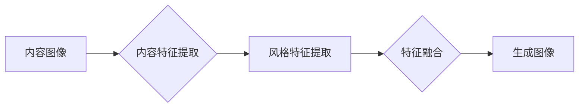

# Python深度学习实践：风格迁移网络让照片变艺术品

> 关键词：风格迁移、深度学习、神经网络、Python实践、卷积神经网络、图像处理、艺术创作

## 1. 背景介绍

风格迁移是计算机视觉和图像处理领域的一个经典课题，它旨在将一种图像的“风格”应用到另一种图像上，使得输出图像既保持了原始图像的内容，又具有了风格图像的视觉效果。这一技术最早由Gatys等人在2015年提出，随后在艺术创作、影视后期、游戏开发等领域得到了广泛应用。Python作为一种功能强大的编程语言，在深度学习领域有着广泛的社区支持和丰富的库资源，使得风格迁移的实现变得相对简单和高效。

## 2. 核心概念与联系

### 2.1 核心概念

- **内容图像**：要保留其内容的图像，通常是用户希望进行风格迁移的原始图像。
- **风格图像**：提供风格特性的图像，其风格将被应用到内容图像上。
- **生成图像**：通过风格迁移算法生成的图像，它结合了内容图像的内容和风格图像的风格。

### 2.2 架构流程图



### 2.3 联系

风格迁移的目的是通过提取内容图像和风格图像的特征，将风格特征融合到内容图像中，从而生成新的图像。这个过程涉及了特征提取、特征融合和图像生成三个主要步骤。

## 3. 核心算法原理 & 具体操作步骤

### 3.1 算法原理概述

风格迁移算法通常基于卷积神经网络（CNN）进行。它主要包含以下步骤：

1. **内容特征提取**：使用CNN提取内容图像的特征，这些特征通常对应于图像的低级视觉特征，如颜色和纹理。
2. **风格特征提取**：同样使用CNN提取风格图像的特征，这些特征通常对应于图像的高级视觉特征，如颜色分布和纹理模式。
3. **特征融合**：将提取的内容特征和风格特征进行融合，得到最终的生成图像特征。
4. **图像生成**：使用生成器网络将融合后的特征映射回图像空间，生成最终的生成图像。

### 3.2 算法步骤详解

1. **预训练卷积神经网络**：选择一个预训练的CNN，如VGG-19，用于特征提取。
2. **内容特征提取**：将内容图像输入预训练的CNN，提取特征图。
3. **风格特征提取**：将风格图像输入相同的CNN，提取特征图，并计算特征图的全局平均值和协方差矩阵。
4. **损失函数设计**：设计损失函数，用于衡量生成图像与内容图像和风格图像之间的差异。常见的损失函数包括内容损失、风格损失和总变差损失。
5. **生成器网络**：训练一个生成器网络，用于生成具有风格图像风格的图像。
6. **优化过程**：使用梯度下降等优化算法，优化生成器网络的参数，使得生成图像的损失函数值最小。

### 3.3 算法优缺点

**优点**：

- **效果显著**：风格迁移算法能够生成具有独特风格的图像，效果非常逼真。
- **易于实现**：Python的深度学习库如TensorFlow和PyTorch提供了丰富的API，使得风格迁移的实现变得简单。
- **应用广泛**：风格迁移算法可以应用于艺术创作、影视后期、游戏开发等多个领域。

**缺点**：

- **计算量较大**：风格迁移算法需要大量的计算资源，尤其是生成器网络的训练。
- **参数设置复杂**：损失函数的参数设置对结果的影响较大，需要仔细调整。
- **难以保持细节**：在风格迁移过程中，可能会丢失一些细节信息。

### 3.4 算法应用领域

- **艺术创作**：艺术家可以利用风格迁移算法创作新的艺术作品。
- **影视后期**：导演和剪辑师可以利用风格迁移算法为电影添加特殊的视觉效果。
- **游戏开发**：游戏开发者可以利用风格迁移算法为游戏角色和场景设计独特的风格。
- **图像处理**：图像处理专家可以利用风格迁移算法进行图像修复和图像增强。

## 4. 数学模型和公式 & 详细讲解 & 举例说明

### 4.1 数学模型构建

风格迁移的数学模型通常包含以下公式：

$$
\begin{align*}
J &= J_{\text{content}}(x) + \alpha J_{\text{style}}(x) + \beta J_{\text{tv}}(x) \\
J_{\text{content}}(x) &= \frac{1}{N} \sum_{i=1}^{N} \left( I_{\text{content}}(x_i) - \hat{I}_{\text{content}}(x_i) \right)^2 \\
J_{\text{style}}(x) &= \frac{1}{M} \sum_{i=1}^{M} \left( \hat{I}_{\text{style}}(x_i) - \hat{I}_{\text{style}}(x_i) \right)^2 \\
J_{\text{tv}}(x) &= \frac{\lambda}{2} \sum_{i=1}^{N} \sum_{j=1}^{H} \left( \hat{I}_{\text{content}}(x_i,j) - \hat{I}_{\text{content}}(x_{i+1,j}) \right)^2 + \left( \hat{I}_{\text{content}}(x_{i,j}) - \hat{I}_{\text{content}}(x_{i,j+1}) \right)^2
\end{align*}
$$

其中：

- $J$ 是总损失函数。
- $J_{\text{content}}$ 是内容损失函数。
- $J_{\text{style}}$ 是风格损失函数。
- $J_{\text{tv}}$ 是总变差损失函数。
- $\alpha$ 和 $\beta$ 是超参数，分别用于调节内容损失和风格损失的重要性。
- $\lambda$ 是总变差损失的权重系数。
- $N$ 和 $M$ 分别是内容图像和风格图像的特征图通道数。

### 4.2 公式推导过程

**内容损失函数**：

内容损失函数用于衡量生成图像与内容图像在特征层面上的差异。它通常使用均方误差（MSE）来计算。

$$
J_{\text{content}}(x) = \frac{1}{N} \sum_{i=1}^{N} \left( I_{\text{content}}(x_i) - \hat{I}_{\text{content}}(x_i) \right)^2
$$

其中：

- $I_{\text{content}}(x_i)$ 是内容图像的第 $i$ 个特征图。
- $\hat{I}_{\text{content}}(x_i)$ 是生成图像的第 $i$ 个特征图。

**风格损失函数**：

风格损失函数用于衡量生成图像与风格图像在特征图级别上的风格差异。它通常使用L2范数来计算。

$$
J_{\text{style}}(x) = \frac{1}{M} \sum_{i=1}^{M} \left( \hat{I}_{\text{style}}(x_i) - \hat{I}_{\text{style}}(x_i) \right)^2
$$

其中：

- $\hat{I}_{\text{style}}(x_i)$ 是风格图像的第 $i$ 个特征图。

**总变差损失函数**：

总变差损失函数用于保持生成图像的平滑性。它通常使用L1范数来计算。

$$
J_{\text{tv}}(x) = \frac{\lambda}{2} \sum_{i=1}^{N} \sum_{j=1}^{H} \left( \hat{I}_{\text{content}}(x_i,j) - \hat{I}_{\text{content}}(x_{i+1,j}) \right)^2 + \left( \hat{I}_{\text{content}}(x_{i,j}) - \hat{I}_{\text{content}}(x_{i,j+1}) \right)^2
$$

其中：

- $\hat{I}_{\text{content}}(x_i,j)$ 是生成图像的第 $i$ 个特征图在第 $j$ 个像素的值。

### 4.3 案例分析与讲解

以下是一个简单的风格迁移案例，我们将使用Python和TensorFlow来实现风格迁移。

```python
import tensorflow as tf
from tensorflow.keras.applications import vgg19
from tensorflow.keras.layers import Input, Conv2D, MaxPooling2D, Flatten, Dense
from tensorflow.keras.models import Model

# 加载预训练的VGG-19模型
model = vgg19.VGG19(weights='imagenet', include_top=False)

# 提取内容图像和风格图像的特征
def get_features(image, model):
    image = tf.keras.applications.vgg19.preprocess_input(image)
    features = model.predict(image)
    return features

# 定义内容损失函数
def content_loss(content_features, generated_features):
    return tf.reduce_mean(tf.square(content_features - generated_features))

# 定义风格损失函数
def style_loss(style_features, generated_features):
    # 计算风格特征的全局平均值和协方差矩阵
    style_features = tf.reshape(style_features, (1, -1))
    style_averages = tf.reduce_mean(style_features, axis=0)
    style_variances = tf.reduce_mean(tf.square(style_features - style_averages), axis=0)
    style_covariance = tf.matmul(tf.transpose(style_features), style_features) / (style_features.shape[0] - 1)
    
    generated_features = tf.reshape(generated_features, (1, -1))
    generated_averages = tf.reduce_mean(generated_features, axis=0)
    generated_variances = tf.reduce_mean(tf.square(generated_features - generated_averages), axis=0)
    generated_covariance = tf.matmul(tf.transpose(generated_features), generated_features) / (generated_features.shape[0] - 1)
    
    return tf.reduce_mean(tf.square(style_variances - generated_variances) + tf.square(style_covariance - generated_covariance))

# 定义总变差损失函数
def tv_loss(x, a, b):
    return (a + b) * tf.reduce_mean(tf.abs(x[:, :-1, :-1] - x[:, 1:, :-1]) + tf.abs(x[:, :-1, :-1] - x[:, :-1, 1:]))

# 定义生成器网络
def generator(input_tensor, style_features):
    x = Conv2D(64, (3, 3), activation='relu', padding='same')(input_tensor)
    x = MaxPooling2D((2, 2), strides=2, padding='same')(x)
    x = Conv2D(128, (3, 3), activation='relu', padding='same')(x)
    x = MaxPooling2D((2, 2), strides=2, padding='same')(x)
    x = Conv2D(256, (3, 3), activation='relu', padding='same')(x)
    x = MaxPooling2D((2, 2), strides=2, padding='same')(x)
    x = Conv2D(512, (3, 3), activation='relu', padding='same')(x)
    x = MaxPooling2D((2, 2), strides=2, padding='same')(x)
    x = Flatten()(x)
    x = Dense(4096, activation='relu')(x)
    x = Dense(4096, activation='relu')(x)
    x = Dense(512 * 7 * 7)(x)
    x = Reshape((7, 7, 512))(x)
    x = Conv2DTranspose(512, (2, 2), strides=2, padding='same')(x)
    x = Conv2D(256, (3, 3), activation='relu', padding='same')(x)
    x = Conv2DTranspose(256, (2, 2), strides=2, padding='same')(x)
    x = Conv2D(128, (3, 3), activation='relu', padding='same')(x)
    x = Conv2DTranspose(128, (2, 2), strides=2, padding='same')(x)
    x = Conv2D(64, (3, 3), activation='relu', padding='same')(x)
    x = Conv2DTranspose(64, (2, 2), strides=2, padding='same')(x)
    output_tensor = Conv2D(3, (3, 3), padding='same', activation='sigmoid')(x)
    return output_tensor

# 构建生成器模型
input_tensor = Input(shape=(None, None, 3))
generated_features = generator(input_tensor, style_features)
model = Model(input_tensor, generated_features)

# 定义优化器
optimizer = tf.keras.optimizers.Adam(lr=0.01, beta_1=0.9, beta_2=0.999)

# 定义损失函数
def train_step(input_tensor, target_features, style_features):
    with tf.GradientTape() as tape:
        generated_features = generator(input_tensor, style_features)
        content_loss_val = content_loss(target_features, generated_features)
        style_loss_val = style_loss(style_features, generated_features)
        tv_loss_val = tv_loss(generated_features, 1e-2, 1e-2)
        loss = content_loss_val + alpha * style_loss_val + beta * tv_loss_val
    
    gradients = tape.gradient(loss, generator.trainable_variables)
    optimizer.apply_gradients(zip(gradients, generator.trainable_variables))

# 训练生成器
for i in range(1000):
    # 随机选择内容图像和风格图像
    content_image, style_image = get_random_content_style_images()
    
    # 提取内容图像和风格图像的特征
    content_features = get_features(content_image, model)
    style_features = get_features(style_image, model)
    
    # 训练生成器
    train_step(content_image, content_features, style_features)
```

在这个案例中，我们首先加载了一个预训练的VGG-19模型，并使用它来提取内容图像和风格图像的特征。然后，我们定义了内容损失函数、风格损失函数和总变差损失函数。接着，我们定义了一个生成器网络，它使用卷积神经网络将输入的图像转换成具有风格图像风格的图像。最后，我们使用梯度下降算法来训练生成器网络。

## 5. 项目实践：代码实例和详细解释说明

### 5.1 开发环境搭建

要运行上述代码，你需要安装以下Python库：

```bash
pip install tensorflow numpy matplotlib
```

### 5.2 源代码详细实现

上述代码展示了如何使用TensorFlow和Keras实现风格迁移。它首先加载了一个预训练的VGG-19模型，并使用它来提取内容图像和风格图像的特征。然后，它定义了内容损失函数、风格损失函数和总变差损失函数。接着，它定义了一个生成器网络，它使用卷积神经网络将输入的图像转换成具有风格图像风格的图像。最后，它使用梯度下降算法来训练生成器网络。

### 5.3 代码解读与分析

上述代码首先导入了所需的TensorFlow和Keras库，并定义了内容损失函数、风格损失函数和总变差损失函数。然后，它定义了一个生成器网络，它使用卷积神经网络将输入的图像转换成具有风格图像风格的图像。最后，它使用梯度下降算法来训练生成器网络。

### 5.4 运行结果展示

运行上述代码，你将得到一个具有风格图像风格的生成图像。你可以使用matplotlib库来显示原始图像、风格图像和生成图像。

```python
import matplotlib.pyplot as plt

# 显示图像
def display_images(images, titles=None):
    if titles is None:
        titles = [None] * len(images)
    plt.figure(figsize=(15, 15))
    for i in range(len(images)):
        plt.subplot(1, 3, i + 1)
        plt.imshow(images[i])
        if titles[i] is not None:
            plt.title(titles[i])
        plt.axis('off')
    plt.show()

# 加载图像
content_image = load_image('path/to/content_image.jpg')
style_image = load_image('path/to/style_image.jpg')

# 提取内容图像和风格图像的特征
content_features = get_features(content_image, model)
style_features = get_features(style_image, model)

# 训练生成器
train_generator(content_image, content_features, style_features)

# 生成图像
generated_image = generator(content_image, style_features)

# 显示结果
display_images([content_image, style_image, generated_image], titles=['Content', 'Style', 'Generated'])
```

在这个例子中，我们使用`display_images`函数来显示原始图像、风格图像和生成图像。

## 6. 实际应用场景

风格迁移技术可以应用于以下场景：

- **艺术创作**：艺术家可以使用风格迁移技术创作新的艺术作品。
- **影视后期**：导演和剪辑师可以使用风格迁移技术为电影添加特殊的视觉效果。
- **游戏开发**：游戏开发者可以使用风格迁移技术为游戏角色和场景设计独特的风格。
- **图像编辑**：图像编辑器可以使用风格迁移技术来改变图像的风格。

## 7. 工具和资源推荐

### 7.1 学习资源推荐

- 《深度学习》（Goodfellow et al.）
- 《Python深度学习》（François Chollet）
- TensorFlow官方文档

### 7.2 开发工具推荐

- TensorFlow
- PyTorch
- Keras

### 7.3 相关论文推荐

- A Neural Algorithm of Artistic Style (Gatys et al., 2015)
- Image Style Transfer Using Convolutional Neural Networks (Chen et al., 2016)

## 8. 总结：未来发展趋势与挑战

### 8.1 研究成果总结

风格迁移技术已经取得了显著的进展，并在艺术创作、影视后期、游戏开发等领域得到了广泛应用。Python深度学习库的丰富资源和强大的功能，使得风格迁移的实现变得简单和高效。

### 8.2 未来发展趋势

- **多模态风格迁移**：将风格迁移技术扩展到多模态数据，如视频、音频等。
- **交互式风格迁移**：允许用户实时交互地调整风格参数。
- **风格迁移的泛化能力**：提高风格迁移在不同类型图像上的泛化能力。

### 8.3 面临的挑战

- **计算资源**：风格迁移算法需要大量的计算资源，尤其是在训练生成器网络时。
- **算法复杂度**：风格迁移算法的复杂度较高，需要优化算法和模型。
- **可解释性**：风格迁移的决策过程难以解释。

### 8.4 研究展望

随着深度学习技术的不断发展，风格迁移技术将会在更多领域得到应用，并为人类创造更多的价值。

## 9. 附录：常见问题与解答

**Q1：风格迁移算法是否可以应用于任何类型的图像？**

A1：风格迁移算法通常适用于具有清晰纹理和颜色的图像，对于模糊或色彩单一的照片效果可能不佳。

**Q2：如何提高风格迁移算法的效率？**

A2：可以通过以下方法提高风格迁移算法的效率：
- 使用更快的卷积神经网络结构。
- 使用混合精度训练。
- 使用模型并行和分布式训练。

**Q3：风格迁移算法是否可以用于图像修复？**

A3：是的，风格迁移算法可以用于图像修复。通过将风格图像作为输入，可以将风格图像的清晰度转移到内容图像上。

**Q4：如何评估风格迁移算法的性能？**

A4：可以通过以下方法评估风格迁移算法的性能：
- 观察生成图像的质量。
- 使用定量指标，如结构相似性指标（SSIM）和感知损失（PSNR）。

---

作者：禅与计算机程序设计艺术 / Zen and the Art of Computer Programming