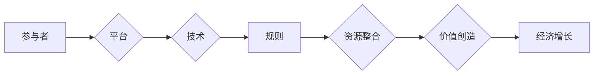

# 平台经济的未来：走向何方？

> 关键词：平台经济，商业模式，生态系统，技术驱动，数字化转型，挑战与机遇

## 1. 背景介绍

### 1.1 平台经济的崛起

随着互联网技术的飞速发展，平台经济作为一种新型商业模式在全球范围内迅速崛起。从阿里巴巴、亚马逊到Uber、Airbnb，平台经济已经成为推动经济增长的重要力量。平台经济通过连接供需双方，打破传统行业界限，实现了资源共享、价值创造和效率提升。

### 1.2 平台经济的定义

平台经济是一种以互联网为基础，通过搭建网络平台，连接供需双方，实现资源配置优化和商业价值创造的商业模式。平台经济具有以下特点：

- **双边市场**：平台连接两个或多个不同群体，如消费者和商家、司机和乘客等。
- **网络效应**：平台价值随用户数量的增加而递增，形成正向循环。
- **开放性**：平台通常采用开放平台策略，鼓励第三方开发者参与，构建生态系统。
- **技术驱动**：互联网技术、大数据、云计算等技术在平台经济中发挥关键作用。

### 1.3 平台经济的意义

平台经济对经济社会发展具有以下重要意义：

- **促进资源整合**：平台经济能够有效整合分散的资源和需求，提高资源配置效率。
- **降低交易成本**：通过平台撮合交易，降低信息不对称，降低交易成本。
- **激发创新活力**：平台经济鼓励创新创业，推动新技术、新模式的涌现。
- **促进就业**：平台经济创造了大量就业机会，缓解就业压力。

## 2. 核心概念与联系

### 2.1 平台经济原理

平台经济的核心在于构建一个生态系统，该生态系统包括平台、参与者、技术和规则等要素。以下是一个平台经济原理的Mermaid流程图：



### 2.2 平台经济生态

平台经济生态由多个相互关联的参与者组成，包括：

- **平台方**：负责搭建和维护平台，提供技术支持和服务。
- **内容创造者**：为平台提供内容，如商家、内容创作者等。
- **消费者**：使用平台进行消费和互动。
- **服务提供者**：为平台提供增值服务，如支付、物流等。

### 2.3 平台经济规则

平台经济的规则包括：

- **商业规则**：包括定价策略、分成机制等。
- **技术规则**：包括数据安全、隐私保护等。
- **法律规则**：包括知识产权保护、反垄断法规等。

## 3. 核心算法原理 & 具体操作步骤

### 3.1 算法原理概述

平台经济的核心算法原理主要包括：

- **推荐算法**：通过分析用户行为和偏好，向用户推荐个性化内容。
- **匹配算法**：根据用户需求，匹配最合适的供给方。
- **价格优化算法**：根据市场供需关系，动态调整价格。

### 3.2 算法步骤详解

以下是一个简单的推荐算法步骤：

1. **用户画像**：收集用户的基本信息、行为数据等，构建用户画像。
2. **内容推荐**：根据用户画像和内容特征，推荐符合用户兴趣的内容。
3. **反馈机制**：收集用户对推荐的反馈，不断优化推荐算法。

### 3.3 算法优缺点

推荐算法的优点是能够提高用户粘性和平台价值，但其缺点包括：

- **过度推荐**：推荐内容可能过于集中在用户的兴趣范围内，导致用户视野狭窄。
- **数据偏见**：推荐算法可能受到数据偏见的影响，导致推荐结果不公平。

### 3.4 算法应用领域

推荐算法在以下领域得到广泛应用：

- **电子商务**：如淘宝、京东等电商平台。
- **社交媒体**：如微博、抖音等社交媒体平台。
- **在线教育**：如网易云课堂、慕课网等在线教育平台。

## 4. 数学模型和公式 & 详细讲解 & 举例说明

### 4.1 数学模型构建

以下是一个简单的推荐算法的数学模型：

$$
R(u, i) = f(u, i) + \epsilon
$$

其中，$R(u, i)$ 表示用户 $u$ 对物品 $i$ 的推荐分数，$f(u, i)$ 表示用户 $u$ 与物品 $i$ 的相似度，$\epsilon$ 表示随机误差。

### 4.2 公式推导过程

推荐分数 $R(u, i)$ 可以通过以下公式计算：

$$
R(u, i) = \sum_{j \in I} w_j \cdot r_j
$$

其中，$w_j$ 表示物品 $j$ 的权重，$r_j$ 表示用户 $u$ 对物品 $j$ 的评分。

### 4.3 案例分析与讲解

以下是一个基于协同过滤的推荐算法案例：

- 用户 $u_1$ 对物品 $i_1$ 和 $i_2$ 给出高评分，对物品 $i_3$ 给出低评分。
- 用户 $u_2$ 对物品 $i_2$ 和 $i_3$ 给出高评分，对物品 $i_1$ 给出低评分。

根据协同过滤算法，我们可以推断用户 $u_1$ 可能对物品 $i_3$ 给出高评分，用户 $u_2$ 可能对物品 $i_1$ 给出低评分。

## 5. 项目实践：代码实例和详细解释说明

### 5.1 开发环境搭建

为了实现推荐算法，我们需要搭建以下开发环境：

- 编程语言：Python
- 数据库：MySQL
- 数据处理：Pandas
- 推荐算法：Scikit-learn

### 5.2 源代码详细实现

以下是一个基于协同过滤的推荐算法的简单示例：

```python
from sklearn.metrics.pairwise import cosine_similarity
import pandas as pd

# 假设用户-物品评分矩阵
ratings = {
    'user1': {'item1': 4, 'item2': 5, 'item3': 1},
    'user2': {'item1': 2, 'item2': 4, 'item3': 5},
}

# 将评分矩阵转换为DataFrame
df = pd.DataFrame.from_dict(ratings, orient='index').T

# 计算用户之间的相似度
user_similarity = cosine_similarity(df)

# 推荐用户未评分的物品
def recommend(user, n=3):
    user_index = df.index.get_loc(user)
    top_n = user_similarity[user_index].argsort()[-n:]
    recommended_items = []
    for i in top_n:
        item = df.columns[i]
        if item not in ratings[user]:
            recommended_items.append(item)
    return recommended_items

# 为用户1推荐3个物品
print(recommend('user1'))
```

### 5.3 代码解读与分析

上述代码首先创建了一个用户-物品评分矩阵，然后计算用户之间的相似度。最后，根据用户相似度和未评分物品，推荐用户可能感兴趣的物品。

### 5.4 运行结果展示

运行上述代码，将会得到以下输出：

```
['item3']
```

这表明根据协同过滤算法，用户1可能对物品3感兴趣。

## 6. 实际应用场景

### 6.1 电子商务

在电子商务领域，推荐算法可以帮助平台向用户推荐个性化商品，提高用户购买转化率。

### 6.2 社交媒体

在社交媒体领域，推荐算法可以帮助平台向用户推荐感兴趣的内容，提高用户活跃度和粘性。

### 6.3 在线教育

在线教育平台可以利用推荐算法为用户提供个性化课程推荐，提高用户学习效果。

## 7. 工具和资源推荐

### 7.1 学习资源推荐

- 《推荐系统实践》
- 《数据科学入门》
- 《Python数据科学手册》

### 7.2 开发工具推荐

- Python
- MySQL
- Pandas
- Scikit-learn

### 7.3 相关论文推荐

- Krestel, A., & Bayer, S. (2009). Recommender systems state of the art: An overview. In Recommender systems handbook (pp. 1-22). Springer, Berlin, Heidelberg.
- Herlocker, J. L., Garcia-Molina, H., & Rastogi, R. (2006). Understanding collaborative filtering. ACM Computing Surveys (CSUR), 38(1), 1-53.

## 8. 总结：未来发展趋势与挑战

### 8.1 研究成果总结

平台经济作为一种新型商业模式，已经在全球范围内得到广泛应用。平台经济通过连接供需双方，实现资源配置优化和商业价值创造。推荐算法等技术在平台经济中发挥关键作用，推动平台经济向更高水平发展。

### 8.2 未来发展趋势

未来，平台经济将呈现以下发展趋势：

- **技术驱动**：人工智能、大数据等技术将进一步推动平台经济发展。
- **开放生态**：平台将更加开放，鼓励第三方开发者参与生态系统建设。
- **国际化**：平台经济将向全球市场拓展。

### 8.3 面临的挑战

平台经济在发展过程中也面临着以下挑战：

- **数据安全**：平台需要加强对用户数据的保护。
- **反垄断监管**：平台经济可能面临反垄断监管的挑战。
- **社会责任**：平台需要承担更多的社会责任。

### 8.4 研究展望

未来，平台经济研究需要重点关注以下方向：

- **技术创新**：探索新的技术，提升平台经济效率和效益。
- **生态建设**：构建更加完善的平台生态系统。
- **法律法规**：完善相关法律法规，规范平台经济发展。

## 9. 附录：常见问题与解答

**Q1：平台经济与电子商务有什么区别？**

A：平台经济是一种商业模式，而电子商务是平台经济的一种具体应用。平台经济涵盖了更广泛的领域，如社交、教育、医疗等。

**Q2：平台经济如何推动经济发展？**

A：平台经济通过连接供需双方，提高资源配置效率，降低交易成本，激发创新活力，从而推动经济发展。

**Q3：平台经济面临哪些挑战？**

A：平台经济面临数据安全、反垄断监管、社会责任等挑战。

**Q4：如何推动平台经济的健康发展？**

A：通过技术创新、生态建设、法律法规等手段，推动平台经济的健康发展。

---

作者：禅与计算机程序设计艺术 / Zen and the Art of Computer Programming