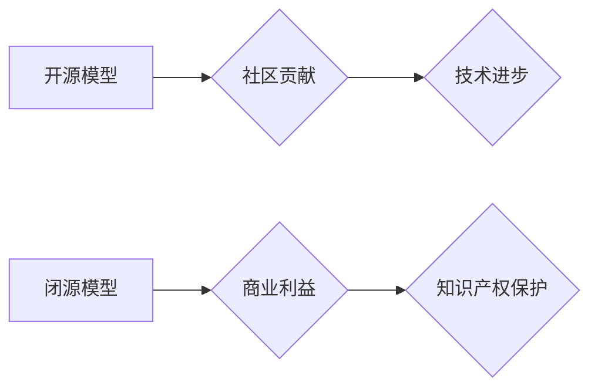

> 关键词：开源模型，闭源模型，人工智能，机器学习，深度学习，模型复用，社区贡献，知识产权

# 开源模型与闭源模型的对比

在人工智能和机器学习的快速发展中，模型作为一种重要的知识产权，其开源和闭源成为了业界关注的焦点。开源模型和闭源模型分别代表了不同的发展方向和商业策略，它们在技术、应用、社区贡献以及知识产权等方面存在显著差异。本文将深入探讨开源模型与闭源模型的对比，分析其优缺点，并展望未来发展趋势。

## 1. 背景介绍

随着深度学习技术的广泛应用，模型成为了人工智能领域的关键资产。模型的质量直接决定了算法的性能和应用效果。因此，如何开发、部署和应用模型成为了一个重要的研究课题。在这个过程中，开源模型和闭源模型成为了两种主要的模型发布方式。

### 1.1 问题的由来

开源模型和闭源模型的出现，源于人工智能领域的两个核心需求：技术进步和商业利益。开源模型强调技术共享和社区贡献，而闭源模型则更注重商业价值和知识产权保护。

### 1.2 研究现状

目前，开源模型在学术界和工业界都取得了显著的进展，如TensorFlow、PyTorch、TensorFlow Lite等。这些开源框架和模型为研究人员和开发者提供了丰富的资源和技术支持。与此同时，闭源模型在商业应用中也发挥了重要作用，如Google的BERT、Facebook的FAIR等。

### 1.3 研究意义

研究开源模型与闭源模型的对比，有助于我们深入理解两种发布方式的优缺点，为人工智能技术的进一步发展和应用提供参考。

## 2. 核心概念与联系

### 2.1 开源模型

开源模型是指将模型的源代码、训练数据、训练过程等信息公开，允许任何人在法律允许的范围内自由使用、修改和分发。开源模型的核心价值在于促进技术共享和社区贡献，推动人工智能技术的发展。

### 2.2 闭源模型

闭源模型是指将模型的源代码、训练数据、训练过程等信息保密，仅授权特定用户使用。闭源模型的核心价值在于保护知识产权和商业利益，为商业应用提供技术保障。

### 2.3 Mermaid 流程图

以下是一个简单的Mermaid流程图，展示了开源模型和闭源模型的基本流程：



从流程图中可以看出，开源模型强调社区贡献和技术进步，而闭源模型则注重商业利益和知识产权保护。

## 3. 核心算法原理 & 具体操作步骤

### 3.1 算法原理概述

开源模型和闭源模型的算法原理基本相同，都基于深度学习技术。然而，在具体操作步骤上存在一定的差异。

### 3.2 算法步骤详解

#### 开源模型步骤

1. 研究人员或团队开发模型，并将其源代码、训练数据、训练过程等信息公开。
2. 社区成员可以自由下载、修改和分发模型。
3. 模型经过不断的迭代和优化，性能得到提升。
4. 模型被广泛应用于各个领域，推动技术进步。

#### 闭源模型步骤

1. 研究人员或团队开发模型，并将其源代码、训练数据、训练过程等信息保密。
2. 模型授权特定用户使用，通常需要支付费用。
3. 模型在授权范围内应用于商业项目，为商业利益提供技术保障。
4. 模型根据商业需求进行迭代和优化，保护知识产权。

### 3.3 算法优缺点

#### 开源模型优缺点

**优点**：

- 促进技术共享和社区贡献
- 推动技术进步
- 降低研发成本
- 提高模型质量

**缺点**：

- 知识产权保护不足
- 商业利益难以保障
- 模型安全性可能受到威胁

#### 闭源模型优缺点

**优点**：

- 保护知识产权和商业利益
- 为商业应用提供技术保障
- 提高模型安全性

**缺点**：

- 技术共享和社区贡献受限
- 研发成本较高
- 模型质量可能受到限制

### 3.4 算法应用领域

开源模型和闭源模型在各个领域都有广泛应用，如：

- 开源模型：计算机视觉、自然语言处理、语音识别等
- 闭源模型：自动驾驶、智能客服、金融风控等

## 4. 数学模型和公式 & 详细讲解 & 举例说明

### 4.1 数学模型构建

开源模型和闭源模型的数学模型基本相同，都基于深度学习技术。以下以卷积神经网络（CNN）为例，简要介绍其数学模型：

$$
\text{CNN}(\mathbf{x}) = \text{ReLU}(\mathbf{W}^T \mathbf{f}(\mathbf{x}) + \mathbf{b})
$$

其中，$\mathbf{x}$ 为输入特征，$\mathbf{W}$ 为权重，$\mathbf{f}$ 为非线性激活函数（如ReLU），$\mathbf{b}$ 为偏置。

### 4.2 公式推导过程

CNN的公式推导过程涉及多个步骤，包括卷积操作、激活函数、池化操作等。这里不再详细展开。

### 4.3 案例分析与讲解

以下以BERT模型为例，介绍开源模型在自然语言处理领域的应用。

BERT（Bidirectional Encoder Representations from Transformers）是由Google AI团队于2018年提出的预训练语言模型。它通过预训练和微调的方式，在多个自然语言处理任务上取得了显著的成果。

BERT的预训练过程包括两个阶段：

1.  Masked Language Model（MLM）：随机遮蔽输入文本中的部分词，模型需要预测这些词的正确词形。
2.  Next Sentence Prediction（NSP）：输入两个句子，模型需要预测这两个句子是否为连续的句子。

通过这两个预训练任务，BERT模型学习到了丰富的语言表示和上下文理解能力。

## 5. 项目实践：代码实例和详细解释说明

### 5.1 开发环境搭建

为了实践开源模型，我们需要搭建以下开发环境：

1. 操作系统：Linux、MacOS或Windows
2. 编程语言：Python
3. 框架：TensorFlow或PyTorch
4. 依赖库：NumPy、Pandas、Scikit-learn等

### 5.2 源代码详细实现

以下是一个简单的使用PyTorch框架实现CNN模型的代码实例：

```python
import torch
import torch.nn as nn

class CNN(nn.Module):
    def __init__(self):
        super(CNN, self).__init__()
        self.conv1 = nn.Conv2d(1, 32, kernel_size=3, stride=1, padding=1)
        self.conv2 = nn.Conv2d(32, 64, kernel_size=3, stride=1, padding=1)
        self.pool = nn.MaxPool2d(kernel_size=2, stride=2, padding=0)
        self.fc1 = nn.Linear(64 * 6 * 6, 128)
        self.fc2 = nn.Linear(128, 10)

    def forward(self, x):
        x = self.pool(F.relu(self.conv1(x)))
        x = self.pool(F.relu(self.conv2(x)))
        x = x.view(-1, 64 * 6 * 6)
        x = F.relu(self.fc1(x))
        x = self.fc2(x)
        return x
```

### 5.3 代码解读与分析

上述代码实现了一个简单的CNN模型，包含两个卷积层、两个全连接层和一个池化层。模型输入为二维图像数据，输出为10个分类结果。

### 5.4 运行结果展示

在训练集上训练模型后，可以在测试集上评估模型的性能。以下是一个简单的评估代码示例：

```python
import torch.optim as optim
from torch.utils.data import DataLoader, TensorDataset

# 假设train_loader和test_loader是训练集和测试集的数据加载器
# labels是测试集的标签
model = CNN().to(device)
criterion = nn.CrossEntropyLoss()
optimizer = optim.Adam(model.parameters())

for epoch in range(10):
    # 训练模型
    for data, target in train_loader:
        optimizer.zero_grad()
        output = model(data)
        loss = criterion(output, target)
        loss.backward()
        optimizer.step()

    # 评估模型
    model.eval()
    correct = 0
    total = 0
    with torch.no_grad():
        for data, target in test_loader:
            output = model(data)
            _, predicted = torch.max(output.data, 1)
            total += target.size(0)
            correct += (predicted == target).sum().item()
    print(f"Epoch {epoch+1}, Test Accuracy: {100 * correct / total}%")

print(f"Final Test Accuracy: {100 * correct / total}%")
```

## 6. 实际应用场景

开源模型和闭源模型在各个领域都有广泛的应用，以下列举几个典型的应用场景：

### 6.1 开源模型应用场景

- 自然语言处理：使用BERT、GPT-2等模型进行文本分类、情感分析、机器翻译等任务。
- 计算机视觉：使用ResNet、VGG等模型进行图像分类、目标检测、图像分割等任务。
- 语音识别：使用TensorFlow、PyTorch等框架训练语音识别模型。

### 6.2 闭源模型应用场景

- 自动驾驶：使用闭源模型进行环境感知、路径规划、决策控制等任务。
- 智能客服：使用闭源模型进行对话生成、知识库检索、意图识别等任务。
- 金融风控：使用闭源模型进行欺诈检测、信用评分、风险控制等任务。

## 7. 工具和资源推荐

### 7.1 学习资源推荐

- 《深度学习》系列书籍：周志华教授的经典教材，全面介绍了深度学习的基本原理和应用。
- 《动手学深度学习》系列教程：由清华大学和麦吉尔大学联合开发的在线教程，包含大量实战案例。
- TensorFlow官网：TensorFlow框架的官方文档，提供了丰富的教程和API文档。

### 7.2 开发工具推荐

- TensorFlow：Google开发的深度学习框架，提供了丰富的预训练模型和API接口。
- PyTorch：由Facebook开发的深度学习框架，以灵活性和易用性著称。
- Keras：基于Theano和TensorFlow的深度学习框架，提供了简洁的API和丰富的预训练模型。

### 7.3 相关论文推荐

- "ImageNet Classification with Deep Convolutional Neural Networks"：VGG模型的论文，是计算机视觉领域的经典之作。
- "BERT: Pre-training of Deep Bidirectional Transformers for Language Understanding"：BERT模型的论文，是自然语言处理领域的里程碑。
- "Attention is All You Need"：Transformer模型的论文，是NLP领域的革命性进展。

## 8. 总结：未来发展趋势与挑战

### 8.1 研究成果总结

开源模型和闭源模型在人工智能领域发挥着重要作用。开源模型推动了技术共享和社区贡献，促进了人工智能技术的发展；闭源模型则保护了知识产权和商业利益，为商业应用提供了技术保障。

### 8.2 未来发展趋势

- 开源模型和闭源模型将逐渐融合，形成更加开放、协作的发展模式。
- 模型小型化和轻量化将成为趋势，以适应移动端、边缘计算等场景。
- 模型可解释性和鲁棒性将得到进一步提升，提高模型的应用价值和安全性。

### 8.3 面临的挑战

- 知识产权保护与技术共享之间的平衡问题。
- 模型安全性和隐私保护问题。
- 模型性能与计算资源消耗之间的平衡问题。

### 8.4 研究展望

未来，开源模型和闭源模型将共同推动人工智能技术的发展，为人类创造更加美好的未来。

## 9. 附录：常见问题与解答

**Q1：开源模型和闭源模型的区别是什么？**

A：开源模型是指将模型的源代码、训练数据、训练过程等信息信息公开，允许任何人在法律允许的范围内自由使用、修改和分发。闭源模型则将模型信息保密，仅授权特定用户使用。

**Q2：开源模型的优势是什么？**

A：开源模型的优势包括促进技术共享、推动技术进步、降低研发成本、提高模型质量等。

**Q3：闭源模型的优势是什么？**

A：闭源模型的优势包括保护知识产权、为商业应用提供技术保障、提高模型安全性等。

**Q4：如何选择开源模型和闭源模型？**

A：选择开源模型和闭源模型需要根据具体应用场景、技术需求、成本预算等因素综合考虑。

**Q5：未来开源模型和闭源模型的发展趋势是什么？**

A：未来开源模型和闭源模型将逐渐融合，形成更加开放、协作的发展模式。模型小型化和轻量化将成为趋势，模型可解释性和鲁棒性将得到进一步提升。

---

作者：禅与计算机程序设计艺术 / Zen and the Art of Computer Programming