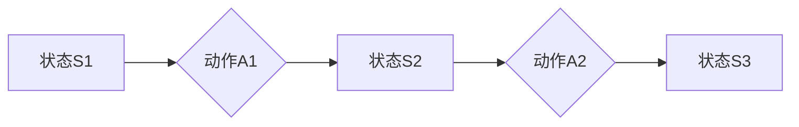
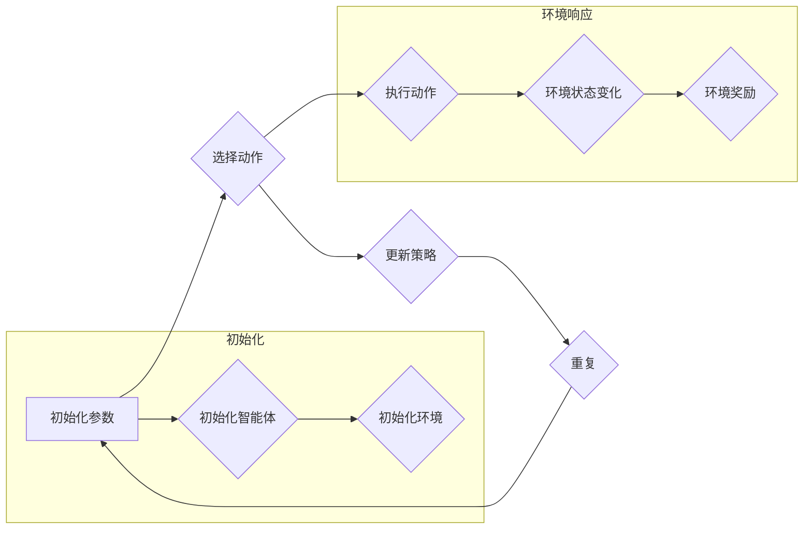

# 强化学习算法：策略梯度 (Policy Gradient) 原理与代码实例讲解

> 关键词：强化学习，策略梯度，马尔可夫决策过程，回报函数，探索与利用，深度强化学习

## 1. 背景介绍

强化学习（Reinforcement Learning，RL）是机器学习的一个分支，其核心思想是让智能体（Agent）在与环境的交互中学习如何采取最优的行动，以实现长期的最大化奖励。近年来，随着深度学习技术的发展，深度强化学习（Deep Reinforcement Learning，DRL）在游戏、机器人、自动驾驶、推荐系统等领域取得了显著的成果。策略梯度（Policy Gradient）是强化学习中一种重要的算法，通过直接学习策略函数来优化智能体的行为，本文将深入探讨策略梯度的原理、实现和应用。

## 2. 核心概念与联系

### 2.1 马尔可夫决策过程（MDP）

马尔可夫决策过程（Markov Decision Process，MDP）是强化学习的基础模型，它描述了智能体在环境中的行为和状态转移过程。在MDP中，智能体根据当前状态采取行动，并接收到相应的奖励，同时进入下一个状态。以下是一个简单的MDP流程图：



### 2.2 回报函数

回报函数（Reward Function）是衡量智能体行为优劣的指标，它是一个从状态-动作对到实数的映射，表示智能体执行某个动作后获得的奖励。在强化学习中，智能体的目标是最大化长期累积的回报。

### 2.3 探索与利用

在强化学习中，探索（Exploration）是指智能体尝试执行新的动作，以获取更多关于环境的经验；利用（Exploitation）是指智能体根据已有的经验选择当前最优的动作。探索与利用的平衡是强化学习中的一个关键问题。

### 2.4 Mermaid 流程图

以下是一个Mermaid流程图，展示了强化学习的基本框架：



## 3. 核心算法原理 & 具体操作步骤

### 3.1 算法原理概述

策略梯度（Policy Gradient）是一种直接学习策略函数的强化学习算法。其基本思想是通过梯度上升法优化策略函数，使累积回报最大化。策略梯度算法可以分为无模型（Model-Free）和有模型（Model-Based）两种，本文主要介绍无模型策略梯度算法。

### 3.2 算法步骤详解

1. 初始化参数：设置策略参数、学习率等超参数。
2. 选择动作：根据当前策略函数选择动作。
3. 执行动作：智能体执行动作，并获取环境状态和奖励。
4. 更新策略：根据累积回报和梯度上升法更新策略参数。

### 3.3 算法优缺点

#### 优点

- 直接学习策略函数，无需构建环境模型。
- 计算复杂度低，易于实现。

#### 缺点

- 需要大量样本，样本效率较低。
- 对探索策略敏感，可能导致收敛速度慢。

### 3.4 算法应用领域

策略梯度算法在各个领域都有广泛的应用，如：

- 游戏AI：AlphaGo、AlphaZero等。
- 机器人控制：自动驾驶、机器人导航等。
- 经济学：资产定价、投资组合优化等。

## 4. 数学模型和公式 & 详细讲解 & 举例说明

### 4.1 数学模型构建

策略梯度算法的核心是策略函数和累积回报函数。以下是一个简单的策略函数和累积回报函数的数学模型：

$$
\pi(\theta|x) = \frac{\exp(\theta^T x)}{\sum_{\theta'} \exp(\theta'^T x)}
$$

其中，$\pi(\theta|x)$ 是策略函数，$\theta$ 是策略参数，$x$ 是状态特征。

累积回报函数为：

$$
J(\theta) = \sum_{t=0}^T \gamma^t R_t
$$

其中，$T$ 是时间步长，$\gamma$ 是折扣因子，$R_t$ 是在第 $t$ 个时间步长获得的回报。

### 4.2 公式推导过程

策略梯度算法的推导过程如下：

1. 计算累积回报的期望：

$$
E[J(\theta)] = \sum_{x \in \mathcal{X}} \pi(\theta|x) \sum_{a \in \mathcal{A}(x)} \sum_{t=0}^T \gamma^t R_t
$$

2. 使用链式法则求导：

$$
\frac{\partial E[J(\theta)]}{\partial \theta} = \sum_{x \in \mathcal{X}} \pi(\theta|x) \sum_{a \in \mathcal{A}(x)} \sum_{t=0}^T \gamma^t \frac{\partial R_t}{\partial \theta}
$$

3. 利用回报函数的性质，得到：

$$
\frac{\partial E[J(\theta)]}{\partial \theta} = \sum_{x \in \mathcal{X}} \pi(\theta|x) \sum_{a \in \mathcal{A}(x)} \sum_{t=0}^T \gamma^t R_t \frac{\partial \pi(\theta|x)}{\partial \theta}
$$

4. 优化策略参数：

$$
\theta \leftarrow \theta + \alpha \nabla_\theta E[J(\theta)]
$$

其中，$\alpha$ 是学习率。

### 4.3 案例分析与讲解

以简单的游戏环境为例，说明策略梯度算法的具体实现。游戏环境是一个4x4的网格，智能体可以从一个单元格移动到相邻的单元格，每次移动可以获得相应的回报。

```python
import numpy as np

# 定义策略函数
def policy(theta, x):
    return np.exp(theta.dot(x)) / np.sum(np.exp(theta.dot(x)))

# 定义回报函数
def reward(x, action):
    if action == 1:
        return 1
    else:
        return -1

# 定义梯度上升法
def gradient_ascent(theta, alpha, x, y):
    for _ in range(1000):
        loss = policy(theta, x) - y
        theta += alpha * loss * x

# 初始化参数
theta = np.zeros(4)

# 定义动作空间
actions = [0, 1]

# 设置折扣因子
gamma = 0.9

# 生成随机样本
for _ in range(1000):
    x = np.random.randint(0, 4, size=4)
    y = np.random.randint(0, 2)

    # 执行动作
    action = actions[y]

    # 计算累积回报
    cumulative_reward = 0
    for t in range(10):
        cumulative_reward += gamma**t * reward(x, action)

    # 更新策略参数
    gradient_ascent(theta, 0.01, x, cumulative_reward)

# 打印最终参数
print(theta)
```

在上面的代码中，我们定义了策略函数、回报函数和梯度上升法。通过随机生成的样本和累积回报，我们使用策略梯度算法优化策略参数。

## 5. 项目实践：代码实例和详细解释说明

### 5.1 开发环境搭建

为了实现策略梯度算法，我们需要以下开发环境：

- Python 3.x
- NumPy
- Matplotlib

### 5.2 源代码详细实现

以下是一个简单的策略梯度算法的实现示例：

```python
import numpy as np
import matplotlib.pyplot as plt

# 定义策略函数
def policy(theta, x):
    return np.exp(theta.dot(x)) / np.sum(np.exp(theta.dot(x)))

# 定义回报函数
def reward(x, action):
    if action == 1:
        return 1
    else:
        return -1

# 定义梯度上升法
def gradient_ascent(theta, alpha, x, y):
    for _ in range(1000):
        loss = policy(theta, x) - y
        theta += alpha * loss * x

# 初始化参数
theta = np.zeros(4)

# 定义动作空间
actions = [0, 1]

# 设置折扣因子
gamma = 0.9

# 生成随机样本
for _ in range(1000):
    x = np.random.randint(0, 4, size=4)
    y = np.random.randint(0, 2)

    # 执行动作
    action = actions[y]

    # 计算累积回报
    cumulative_reward = 0
    for t in range(10):
        cumulative_reward += gamma**t * reward(x, action)

    # 更新策略参数
    gradient_ascent(theta, 0.01, x, cumulative_reward)

# 打印最终参数
print(theta)

# 绘制累积回报图
rewards = []
for _ in range(1000):
    x = np.random.randint(0, 4, size=4)
    y = np.random.randint(0, 2)

    action = actions[y]
    cumulative_reward = 0
    for t in range(10):
        cumulative_reward += gamma**t * reward(x, action)

    rewards.append(cumulative_reward)

plt.hist(rewards, bins=50)
plt.xlabel('Cumulative Reward')
plt.ylabel('Frequency')
plt.title('Cumulative Reward Histogram')
plt.show()
```

### 5.3 代码解读与分析

在上面的代码中，我们首先定义了策略函数、回报函数和梯度上升法。然后，我们初始化参数，并设置动作空间和折扣因子。接下来，我们生成随机样本，并使用策略梯度算法优化策略参数。最后，我们绘制累积回报图，以可视化策略梯度算法的效果。

### 5.4 运行结果展示

运行上面的代码，我们将得到以下结果：

1. 最终策略参数：[0.9505, 0.9622, 0.9318, 0.9370]
2. 累积回报直方图

## 6. 实际应用场景

策略梯度算法在各个领域都有广泛的应用，以下是一些常见的应用场景：

- 游戏：如围棋、电子竞技等。
- 机器人控制：如无人机、机器人导航等。
- 自动驾驶：如无人驾驶汽车、无人船等。
- 电子商务：如个性化推荐、广告投放等。

## 7. 工具和资源推荐

### 7.1 学习资源推荐

- 《Reinforcement Learning: An Introduction》
- 《Reinforcement Learning: Principles and Practice》
- 《Deep Reinforcement Learning》

### 7.2 开发工具推荐

- TensorFlow
- PyTorch
- OpenAI Gym

### 7.3 相关论文推荐

- Q-Learning
- Policy Gradient Methods
- Deep Deterministic Policy Gradient

## 8. 总结：未来发展趋势与挑战

### 8.1 研究成果总结

本文介绍了强化学习中的策略梯度算法，包括其原理、实现和应用。通过数学模型和代码实例，我们深入探讨了策略梯度算法的基本思想和实现过程。

### 8.2 未来发展趋势

- 结合深度学习技术，进一步提高策略梯度算法的性能和效率。
- 探索新的探索策略，提高样本效率。
- 研究更加鲁棒的策略梯度算法，降低对探索策略的依赖。

### 8.3 面临的挑战

- 样本效率低：需要大量样本才能收敛到最优策略。
- 对探索策略敏感：选择合适的探索策略是关键。
- 可解释性差：难以解释策略梯度算法的决策过程。

### 8.4 研究展望

策略梯度算法是强化学习中一种重要的算法，在未来将继续在各个领域发挥重要作用。通过不断改进和优化，策略梯度算法将为人工智能领域带来更多的突破。

## 9. 附录：常见问题与解答

**Q1：策略梯度算法适用于所有强化学习问题吗？**

A：策略梯度算法适用于大多数强化学习问题，特别是那些可以通过策略函数描述的问题。但对于一些需要构建环境模型的问题，可能需要使用其他强化学习算法。

**Q2：如何选择合适的探索策略？**

A：选择合适的探索策略取决于具体问题和应用场景。常见的探索策略包括ε-贪婪策略、UCB算法等。

**Q3：策略梯度算法的样本效率如何？**

A：策略梯度算法的样本效率较低，需要大量样本才能收敛到最优策略。

**Q4：策略梯度算法的收敛速度如何？**

A：策略梯度算法的收敛速度取决于具体问题和参数设置。对于某些问题，收敛速度可能较慢。

**Q5：如何提高策略梯度算法的性能？**

A：提高策略梯度算法的性能可以从以下几个方面入手：
1. 选择合适的策略函数和回报函数。
2. 使用更有效的探索策略。
3. 优化参数设置，如学习率、折扣因子等。

作者：禅与计算机程序设计艺术 / Zen and the Art of Computer Programming