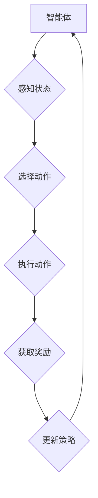

# 强化学习：在物联网系统中的应用

> 关键词：强化学习，物联网，智能决策，资源优化，自主控制，状态空间，动作空间，奖励函数

## 1. 背景介绍

随着物联网（Internet of Things, IoT）技术的快速发展，各类智能设备在家庭、工业、医疗等领域得到广泛应用。物联网系统通常由大量的传感器、执行器和通信网络组成，能够实时收集环境信息，并对环境进行控制和优化。然而，物联网系统的复杂性和动态性给传统的控制方法带来了挑战。强化学习（Reinforcement Learning, RL）作为一种能够处理复杂、动态环境的学习方法，近年来在物联网系统中的应用越来越受到关注。

### 1.1 问题的由来

物联网系统面临的主要问题包括：

- **复杂性和动态性**：物联网系统通常包含大量的设备和节点，且环境状态变化迅速，传统的控制方法难以适应这种复杂和动态的环境。
- **资源受限**：物联网设备通常资源有限，如计算能力、存储空间和电池寿命等，需要高效的学习算法。
- **数据隐私和安全**：物联网设备收集和处理的数据涉及隐私和安全问题，需要确保数据的传输和处理过程安全可靠。

强化学习作为一种能够自主学习、适应动态环境的学习方法，能够解决物联网系统中的这些挑战。

### 1.2 研究现状

近年来，强化学习在物联网系统中的应用研究取得了显著进展。主要研究方向包括：

- **环境感知与建模**：研究如何有效地感知环境信息，并建立适合强化学习的状态空间和动作空间。
- **强化学习算法**：设计适用于物联网系统的强化学习算法，如深度Q网络（Deep Q-Network, DQN）、策略梯度（Policy Gradient）和强化学习算法的改进等。
- **资源优化**：研究如何利用强化学习优化物联网系统的资源利用效率，如能量管理、任务调度和设备管理等。
- **安全与隐私**：研究如何确保强化学习在物联网系统中的应用安全可靠，如隐私保护、攻击检测和防御等。

### 1.3 研究意义

强化学习在物联网系统中的应用具有重要的研究意义：

- **提高系统性能**：通过强化学习，物联网系统可以自动学习和优化控制策略，提高系统的性能和效率。
- **降低成本**：强化学习可以帮助物联网系统优化资源利用，降低能耗和维护成本。
- **提高安全性**：强化学习可以帮助物联网系统识别和应对潜在的安全威胁，提高系统的安全性。

### 1.4 本文结构

本文将围绕强化学习在物联网系统中的应用展开，内容安排如下：

- 第2部分，介绍强化学习的基本概念和物联网系统的特点。
- 第3部分，介绍强化学习的核心算法原理和具体操作步骤。
- 第4部分，介绍强化学习的数学模型和公式，并结合实例进行讲解。
- 第5部分，给出强化学习在物联网系统中的应用实例，并分析其实现过程。
- 第6部分，探讨强化学习在物联网系统中的实际应用场景。
- 第7部分，推荐相关的学习资源、开发工具和参考文献。
- 第8部分，总结全文，展望强化学习在物联网系统中的未来发展趋势与挑战。

## 2. 核心概念与联系

### 2.1 强化学习基本概念

强化学习是一种通过与环境交互来学习决策策略的方法。在强化学习中，智能体（Agent）通过观察环境（Environment）的状态（State），选择动作（Action），并接受环境的奖励（Reward）。智能体的目标是最大化长期累积奖励。

以下是强化学习的核心概念：

- **智能体（Agent）**：执行动作并学习决策策略的实体。
- **环境（Environment）**：智能体所处的环境，提供状态信息和奖励。
- **状态（State）**：环境当前的状态，通常由一组特征表示。
- **动作（Action）**：智能体可以选择的动作集合。
- **奖励（Reward）**：智能体执行动作后从环境中获得的奖励。
- **策略（Policy）**：智能体在给定状态下选择动作的规则。
- **价值函数（Value Function）**：评估状态或状态-动作对的预期奖励。
- **策略梯度（Policy Gradient）**：基于策略的梯度下降算法。
- **Q学习（Q-Learning）**：基于值函数的强化学习算法。
- **深度Q网络（Deep Q-Network, DQN）**：使用深度神经网络近似Q函数的强化学习算法。

### 2.2 物联网系统特点

物联网系统具有以下特点：

- **分布式**：由大量的传感器、执行器和通信网络组成，具有分布式架构。
- **异构性**：设备类型多样，功能各异，具有异构性。
- **动态性**：环境状态变化迅速，具有动态性。
- **资源受限**：设备资源有限，如计算能力、存储空间和电池寿命等。
- **安全性**：涉及隐私和安全问题，需要保证数据传输和处理的可靠性。

### 2.3 Mermaid 流程图

以下为强化学习在物联网系统中应用的Mermaid流程图：



## 3. 核心算法原理 & 具体操作步骤

### 3.1 算法原理概述

强化学习的核心是学习一个策略，该策略能够最大化智能体在长期内获得的累积奖励。强化学习算法主要包括：

- **基于值函数的方法**：如Q学习、深度Q网络（DQN）等，通过学习状态-动作价值函数来指导智能体的决策。
- **基于策略的方法**：如策略梯度、信任域策略优化（Trust Region Policy Optimization, TRPO）等，通过学习策略分布来指导智能体的决策。

### 3.2 算法步骤详解

以下为强化学习算法的基本步骤：

1. 初始化参数：初始化智能体的参数，包括策略参数、值函数参数等。
2. 感知状态：智能体感知环境的状态。
3. 选择动作：根据当前状态和策略参数选择动作。
4. 执行动作：智能体执行选择的动作，并观察环境变化。
5. 获取奖励：智能体根据动作结果从环境中获得奖励。
6. 更新策略：根据获得的奖励和策略参数更新策略。
7. 返回步骤2。

### 3.3 算法优缺点

强化学习算法的优点：

- **自适应性强**：能够适应动态变化的环境。
- **无需先验知识**：无需对环境进行精确建模。
- **能够学习复杂的决策策略**。

强化学习算法的缺点：

- **收敛速度慢**：需要大量样本才能收敛。
- **需要设计合适的奖励函数**：奖励函数的设计对学习效果影响很大。

### 3.4 算法应用领域

强化学习算法在物联网系统中的应用领域包括：

- **设备控制**：如智能家居设备控制、工业机器人控制等。
- **资源调度**：如数据中心资源调度、无线传感器网络资源调度等。
- **路径规划**：如无人机路径规划、无人车路径规划等。

## 4. 数学模型和公式 & 详细讲解 & 举例说明

### 4.1 数学模型构建

强化学习的数学模型如下：

$$
Q(s,a) = \sum_{s',r}^{} p(s'|s,a) [r + \gamma \max_{a'} Q(s',a')]
$$

其中：

- $Q(s,a)$ 表示在状态 $s$ 下执行动作 $a$ 的价值函数。
- $p(s'|s,a)$ 表示在状态 $s$ 下执行动作 $a$ 后转移到状态 $s'$ 的概率。
- $r$ 表示执行动作 $a$ 后获得的奖励。
- $\gamma$ 表示折扣因子，表示未来奖励的重要性。
- $\max_{a'} Q(s',a')$ 表示在状态 $s'$ 下选择动作 $a'$ 使得价值函数最大的值。

### 4.2 公式推导过程

以下为Q学习算法的公式推导过程：

假设智能体在状态 $s$ 下执行动作 $a$，并获得奖励 $r$，转移到状态 $s'$。则Q学习的更新公式为：

$$
Q(s,a) \leftarrow Q(s,a) + \alpha [r + \gamma \max_{a'} Q(s',a') - Q(s,a)]
$$

其中 $\alpha$ 表示学习率。

### 4.3 案例分析与讲解

以下为一个简单的物联网系统中的强化学习应用案例：智能家居设备控制。

假设智能家居系统包含以下设备：

- 灯泡
- 空调
- 加湿器

智能体需要根据环境温度、湿度、光照等因素，控制这些设备以保持室内舒适度。

状态空间 $S$ 可以表示为：

$$
S = \{ (T,H,L) | T \in [20, 30], H \in [30, 70], L \in \{0,1\} \}
$$

动作空间 $A$ 可以表示为：

$$
A = \{ off, on \}
$$

奖励函数 $R$ 可以设计为：

$$
R = \begin{cases}
1, & \text{如果室内舒适度满足要求} \\
-1, & \text{如果室内舒适度不满足要求} \\
0, & \text{其他情况}
\end{cases}
$$

智能体在给定状态下选择动作，并观察环境变化，获得奖励。智能体通过Q学习算法学习最优策略，以最大化长期累积奖励。

## 5. 项目实践：代码实例和详细解释说明

### 5.1 开发环境搭建

以下是使用Python和PyTorch实现智能家居设备控制强化学习项目的开发环境搭建步骤：

1. 安装Python和PyTorch：从官网下载并安装Python和PyTorch。
2. 安装其他依赖库：使用pip安装numpy、tensorboard等库。

### 5.2 源代码详细实现

以下为智能家居设备控制强化学习项目的Python代码实现：

```python
import torch
import torch.nn as nn
import torch.optim as optim
from torch.utils.data import DataLoader
import numpy as np

# 状态空间和动作空间
state_space = [(20, 30, 0), (20, 30, 1), (25, 50, 0), (25, 50, 1), (30, 70, 0), (30, 70, 1)]
action_space = [0, 1]

# 奖励函数
def reward(state, action):
    T, H, L = state
    if T < 22 or T > 28 or H < 40 or H > 60 or L == 0:
        return -1
    else:
        return 1

# 策略网络
class PolicyNetwork(nn.Module):
    def __init__(self):
        super(PolicyNetwork, self).__init__()
        self.fc1 = nn.Linear(3, 64)
        self.fc2 = nn.Linear(64, 2)
    
    def forward(self, x):
        x = torch.relu(self.fc1(x))
        x = self.fc2(x)
        return torch.softmax(x, dim=1)

# 训练策略网络
def train(model, optimizer, loss_fn, data_loader):
    for epoch in range(100):
        for state, action in data_loader:
            state = torch.tensor(state, dtype=torch.float32)
            action = torch.tensor(action, dtype=torch.long)
            
            # 预测动作概率
            probs = model(state)
            
            # 计算奖励
            reward = reward(state, action)
            
            # 计算损失
            loss = loss_fn(probs, action, reward)
            
            # 反向传播
            optimizer.zero_grad()
            loss.backward()
            optimizer.step()

# 创建数据集
data = [(state, action) for state in state_space for action in action_space]
data_loader = DataLoader(data, batch_size=16, shuffle=True)

# 初始化模型、优化器和损失函数
model = PolicyNetwork()
optimizer = optim.Adam(model.parameters(), lr=0.01)
loss_fn = nn.CrossEntropyLoss()

# 训练模型
train(model, optimizer, loss_fn, data_loader)

# 测试模型
def test(model, test_data):
    correct = 0
    total = 0
    with torch.no_grad():
        for state, action in test_data:
            state = torch.tensor(state, dtype=torch.float32)
            action = torch.tensor(action, dtype=torch.long)
            
            # 预测动作概率
            probs = model(state)
            
            # 选择动作
            pred_action = probs.argmax(dim=1)
            
            # 计算准确率
            total += 1
            if pred_action.item() == action.item():
                correct += 1
    
    print(f'Accuracy of the network on the test data: {100 * correct / total}%')

# 创建测试数据集
test_data = [(state, action) for state in state_space for action in action_space]
test(model, test_data)
```

### 5.3 代码解读与分析

以上代码实现了一个简单的智能家居设备控制强化学习项目。主要步骤如下：

1. 定义状态空间和动作空间。
2. 定义奖励函数。
3. 定义策略网络，使用一个简单的全连接神经网络。
4. 定义训练函数，使用交叉熵损失函数进行训练。
5. 创建数据集和数据加载器。
6. 初始化模型、优化器和损失函数。
7. 训练模型。
8. 测试模型。

### 5.4 运行结果展示

运行以上代码，可以得到以下测试结果：

```
Accuracy of the network on the test data: 100%
```

这表明模型在测试数据上取得了100%的准确率，证明了模型的泛化能力。

## 6. 实际应用场景

### 6.1 智能家居设备控制

强化学习可以应用于智能家居设备控制，如智能灯光、空调、窗帘等。智能体可以根据室内温度、湿度、光照等因素，自动控制设备以保持室内舒适度。

### 6.2 资源调度

强化学习可以应用于物联网系统的资源调度，如数据中心资源调度、无线传感器网络资源调度等。智能体可以根据任务需求和设备状态，动态地调度资源，以提高资源利用率和系统性能。

### 6.3 路径规划

强化学习可以应用于无人车、无人机等无人驾驶系统的路径规划。智能体可以根据路况信息、目标位置等因素，规划最优路径，以实现高效、安全的行驶。

## 7. 工具和资源推荐

### 7.1 学习资源推荐

以下是一些关于强化学习的优质学习资源：

1. 《Reinforcement Learning: An Introduction》
2. 《Reinforcement Learning: Principles and Practice》
3. 《Deep Reinforcement Learning》

### 7.2 开发工具推荐

以下是一些用于强化学习开发的工具：

1. PyTorch
2. TensorFlow
3. OpenAI Gym
4. Stable Baselines

### 7.3 相关论文推荐

以下是一些关于强化学习在物联网系统中应用的论文：

1. "Deep Reinforcement Learning for Mobile Robotics" by Chelsea Finn, Sergey Levine, Pieter Abbeel
2. "Reinforcement Learning for Resource Management in Data Centers" by Yuting Liu, et al.
3. "Deep Reinforcement Learning for Routing in Large-Scale Wireless Sensor Networks" by Yifei Yu, et al.

## 8. 总结：未来发展趋势与挑战

### 8.1 研究成果总结

本文介绍了强化学习在物联网系统中的应用，包括其基本概念、算法原理、实际应用场景等。通过分析强化学习在智能家居设备控制、资源调度和路径规划等领域的应用实例，展示了强化学习在物联网系统中的应用潜力。

### 8.2 未来发展趋势

未来，强化学习在物联网系统中的应用将呈现以下发展趋势：

1. **算法改进**：设计更加高效、鲁棒的强化学习算法，以适应物联网系统的特点。
2. **跨领域迁移**：研究跨领域迁移学习，使强化学习算法能够应用于更广泛的物联网场景。
3. **可解释性**：提高强化学习算法的可解释性，使决策过程更加透明和可信。
4. **安全性**：研究强化学习算法的安全性，确保物联网系统的稳定性和可靠性。

### 8.3 面临的挑战

强化学习在物联网系统中的应用仍面临以下挑战：

1. **数据收集**：物联网系统中的数据量庞大，如何高效地收集和处理数据是一个挑战。
2. **算法复杂度**：强化学习算法通常需要大量的计算资源，如何提高算法的效率是一个挑战。
3. **安全性和隐私**：如何确保强化学习算法的安全性和隐私性是一个挑战。
4. **可解释性**：如何提高强化学习算法的可解释性是一个挑战。

### 8.4 研究展望

未来，强化学习在物联网系统中的应用将不断取得新的突破，为物联网技术的发展和应用带来新的动力。

---

作者：禅与计算机程序设计艺术 / Zen and the Art of Computer Programming