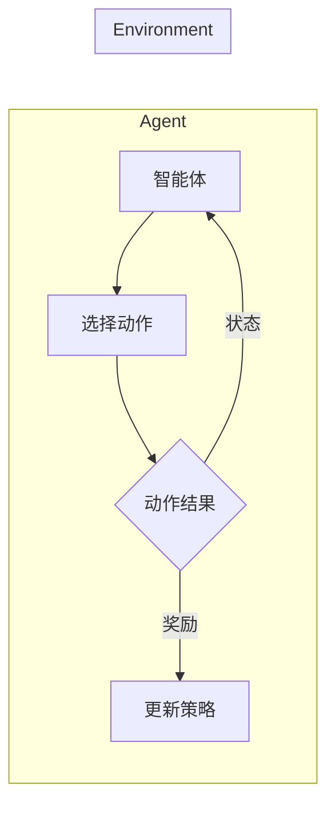

# 强化学习：在航空航天中的应用

> 关键词：强化学习，航空航天，控制优化，决策算法，无人系统，自适应控制，鲁棒控制

## 1. 背景介绍

航空航天领域一直是科技创新的前沿，其技术的进步不仅推动了人类对未知空间的探索，也极大地丰富了我们的生活方式。随着人工智能技术的飞速发展，强化学习（Reinforcement Learning，RL）作为一种强大的机器学习范式，逐渐成为航空航天领域研究的热点。强化学习通过智能体与环境交互，不断学习并优化决策策略，在航空航天控制、优化和决策等领域展现出巨大的潜力。

### 1.1 问题的由来

航空航天系统复杂度高，控制环境多变，对系统的鲁棒性、稳定性和效率提出了极高的要求。传统的控制理论和方法在处理这些复杂问题时往往难以满足需求。强化学习通过其灵活的决策机制和自我学习的能力，为解决航空航天领域的复杂问题提供了新的思路。

### 1.2 研究现状

近年来，强化学习在航空航天领域的应用研究取得了显著进展，主要包括以下几个方面：

- **无人机控制**：利用强化学习实现无人机自主飞行、避障、编队等任务。
- **卫星轨道控制**：通过强化学习优化卫星轨道调整策略，提高卫星的覆盖范围和生存时间。
- **飞行器姿态控制**：在飞行器姿态控制中引入强化学习，实现更加精确和稳定的飞行控制。
- **飞机起飞和降落**：优化飞机起飞和降落过程中的参数调整，提高燃油效率和安全性。
- **航迹规划**：利用强化学习优化飞行器的航迹规划，提高飞行效率和安全性。

### 1.3 研究意义

强化学习在航空航天领域的应用具有重要的理论意义和实际应用价值：

- **理论意义**：推动强化学习算法的理论研究和算法创新，拓展强化学习在复杂环境中的应用范围。
- **实际应用价值**：提高航空航天系统的控制性能、效率和安全可靠性，降低运营成本，促进航空航天技术的发展。

### 1.4 本文结构

本文将围绕强化学习在航空航天领域的应用展开，主要内容包括：

- 介绍强化学习的基本概念和原理。
- 分析强化学习在航空航天领域的具体应用场景。
- 详细讲解强化学习算法在航空航天中的应用实例。
- 探讨强化学习在航空航天领域的未来发展趋势与挑战。

## 2. 核心概念与联系

### 2.1 核心概念原理

强化学习是一种通过与环境交互进行学习的机器学习范式。其核心概念包括：

- **智能体（Agent）**：执行动作并从环境中获取奖励的学习实体。
- **环境（Environment）**：智能体进行学习和决策的场所，提供状态和奖励。
- **状态（State）**：智能体在某一时刻所处的环境描述。
- **动作（Action）**：智能体可以采取的行为。
- **奖励（Reward）**：环境对智能体动作的反馈，用于指导智能体的学习过程。
- **策略（Policy）**：智能体根据当前状态选择动作的决策函数。
- **价值函数（Value Function）**：评估智能体在不同状态下的期望奖励。
- **模型（Model）**：智能体对环境的表征。

### 2.2 核心概念原理 Mermaid 流程图



### 2.3 核心概念联系

强化学习中的核心概念之间存在着密切的联系。智能体通过与环境的交互，不断更新策略，从而优化其在环境中的表现。智能体根据当前状态选择动作，动作的结果会反馈给智能体，并作为奖励指导智能体的学习过程。

## 3. 核心算法原理 & 具体操作步骤

### 3.1 算法原理概述

强化学习算法通过学习一个最优策略，使智能体在给定环境中能够获得最大的累积奖励。常见的强化学习算法包括：

- **值函数方法**：通过学习状态价值函数或动作价值函数，间接学习最优策略。
- **策略梯度方法**：直接学习最优策略，通常需要大量样本。
- **模型驱动方法**：通过建立环境模型，使用模型预测来优化策略。

### 3.2 算法步骤详解

强化学习算法的基本步骤如下：

1. **初始化**：初始化智能体、环境、策略、价值函数等。
2. **执行动作**：智能体根据当前状态和策略选择动作。
3. **获取奖励**：环境根据智能体的动作给出奖励。
4. **更新策略和价值函数**：根据奖励更新策略和价值函数。
5. **重复步骤 2-4**：直到满足停止条件。

### 3.3 算法优缺点

强化学习算法的优点包括：

- **适应性**：智能体能够根据环境的变化动态调整策略。
- **灵活性**：适用于各种复杂环境，不受环境建模限制。
- **通用性**：可以应用于不同的领域和任务。

强化学习算法的缺点包括：

- **样本效率低**：需要大量的样本才能收敛到最优策略。
- **探索与利用的权衡**：在探索未知领域和利用已知信息之间需要做出权衡。
- **可解释性差**：强化学习算法的学习过程通常难以解释。

### 3.4 算法应用领域

强化学习算法在航空航天领域的应用领域包括：

- **无人机控制**：实现无人机的自主飞行、避障、编队等任务。
- **卫星轨道控制**：优化卫星轨道调整策略，提高卫星的覆盖范围和生存时间。
- **飞行器姿态控制**：实现更加精确和稳定的飞行控制。
- **飞机起飞和降落**：优化飞机起飞和降落过程中的参数调整，提高燃油效率和安全性。
- **航迹规划**：优化飞行器的航迹规划，提高飞行效率和安全性。

## 4. 数学模型和公式 & 详细讲解 & 举例说明

### 4.1 数学模型构建

强化学习中的数学模型主要包括：

- **马尔可夫决策过程（MDP）**：描述智能体与环境的交互过程。
- **策略梯度**：用于直接学习最优策略。
- **值函数**：用于评估智能体在不同状态下的期望奖励。

### 4.2 公式推导过程

以下以Q-learning为例，介绍强化学习中的数学公式推导过程：

**Q-learning的目标是学习一个值函数 $Q(s,a)$，该值函数表示智能体在状态 $s$ 采取动作 $a$ 后获得的期望奖励。**

**公式推导如下：**

$$
Q(s,a) = \sum_{s'} \gamma \max_{a'} Q(s',a')
$$

其中，$\gamma$ 为折扣因子，表示对未来奖励的期望。

**根据MDP的定义，有：**

$$
Q(s,a) = \mathbb{E}[R(s,a) + \gamma \max_{a'} Q(s',a') | s, a]
$$

**对上式进行展开，得：**

$$
Q(s,a) = \mathbb{E}[R(s,a) | s, a] + \gamma \mathbb{E}[\max_{a'} Q(s',a') | s, a]
$$

**由于 $\max_{a'} Q(s',a')$ 是一个随机变量，因此有：**

$$
\mathbb{E}[\max_{a'} Q(s',a') | s, a] = \int_{a'} Q(s',a') P(s',a' | s, a) da'
$$

**将上式代入前面的公式，得：**

$$
Q(s,a) = \mathbb{E}[R(s,a) | s, a] + \gamma \int_{a'} Q(s',a') P(s',a' | s, a) da'
$$

**进一步展开，得：**

$$
Q(s,a) = \mathbb{E}[R(s,a) | s, a] + \gamma \sum_{s'} Q(s',a') P(s',a' | s, a)
$$

**由于 $Q(s',a')$ 是状态 $s'$ 采取动作 $a'$ 的期望奖励，因此有：**

$$
Q(s,a) = \mathbb{E}[R(s,a) | s, a] + \gamma \sum_{s'} Q(s',a')
$$

**最后，将 $\mathbb{E}[R(s,a) | s, a]$ 替换为 $R(s,a)$，得：**

$$
Q(s,a) = R(s,a) + \gamma \sum_{s'} Q(s',a')
$$

### 4.3 案例分析与讲解

以下以无人机避障为例，说明强化学习在航空航天领域的应用。

**问题描述**：无人机在飞行过程中需要避开障碍物，并保持安全距离。

**解决方案**：使用强化学习算法训练无人机避开障碍物的策略。

**算法选择**：使用深度Q网络（DQN）算法。

**具体步骤**：

1. 初始化DQN网络、目标网络和经验回放缓冲区。
2. 无人机随机选择初始位置和初始速度。
3. 无人机根据当前状态和DQN网络输出选择动作。
4. 无人机执行动作，获取奖励并更新经验回放缓冲区。
5. 更新DQN网络和目标网络的参数。
6. 重复步骤 2-5，直到无人机能够稳定避开障碍物。

**评估指标**：无人机的成功率、平均奖励、避开障碍物的距离等。

通过以上步骤，无人机能够学习到避开障碍物的策略，并在实际飞行中稳定执行。

## 5. 项目实践：代码实例和详细解释说明

### 5.1 开发环境搭建

以下是在Python中实现DQN算法的代码示例：

```python
import numpy as np
import random
from collections import deque
from tensorflow.keras.models import Sequential
from tensorflow.keras.layers import Dense, Flatten
from tensorflow.keras.optimizers import Adam

# 定义DQN网络
class DQN:
    def __init__(self, state_dim, action_dim, learning_rate):
        self.state_dim = state_dim
        self.action_dim = action_dim
        self.learning_rate = learning_rate
        self.memory = deque(maxlen=2000)
        self.model = self._build_model()
        self.target_model = self._build_model()
        self.target_model.set_weights(self.model.get_weights())

    def _build_model(self):
        model = Sequential()
        model.add(Flatten(input_shape=(self.state_dim,))
        model.add(Dense(24, activation='relu'))
        model.add(Dense(self.action_dim))
        model.compile(loss='mse', optimizer=Adam(lr=self.learning_rate))
        return model

    def remember(self, state, action, reward, next_state, done):
        self.memory.append((state, action, reward, next_state, done))

    def act(self, state):
        if len(self.memory) > 200:
            state = np.reshape(state, (1, self.state_dim))
            action = self.model.predict(state)[0]
            return np.argmax(action)
        else:
            return random.randrange(self.action_dim)

    def replay(self, batch_size):
        minibatch = random.sample(self.memory, batch_size)
        states, actions, rewards, next_states, dones = zip(*minibatch)
        states = np.reshape(states, (batch_size, self.state_dim))
        next_states = np.reshape(next_states, (batch_size, self.state_dim))
        actions = np.array(actions)
        rewards = np.array(rewards)
        predictions = self.model.predict(states)
        next_predictions = self.target_model.predict(next_states)
        target_f = rewards + (1 - dones) * self.gamma * np.amax(next_predictions, axis=1)
        self.model.fit(states, target_f, epochs=1, verbose=0)
        self.target_model.set_weights(self.model.get_weights())

    def load(self, name):
        self.model.load_weights(name)

    def save(self, name):
        self.model.save_weights(name)
```

### 5.2 源代码详细实现

以上代码实现了DQN算法的核心功能：

- `_build_model`函数：定义DQN网络的模型结构。
- `remember`函数：将经验添加到经验回放缓冲区。
- `act`函数：智能体根据当前状态和DQN网络输出选择动作。
- `replay`函数：根据经验回放缓冲区中的数据进行学习。
- `load`函数：加载模型权重。
- `save`函数：保存模型权重。

### 5.3 代码解读与分析

以上代码展示了DQN算法的Python实现，主要包括以下几个部分：

- **DQN类**：定义DQN算法的类，包括初始化、记忆、执行动作、回放和学习等功能。
- **_build_model函数**：定义DQN网络的模型结构，使用Flatten层将状态转换为扁平向量，然后通过两个全连接层进行特征提取和动作预测。
- **remember函数**：将经验添加到经验回放缓冲区，用于后续的学习过程。
- **act函数**：智能体根据当前状态和DQN网络输出选择动作，使用np.argmax函数选择概率最大的动作。
- **replay函数**：根据经验回放缓冲区中的数据进行学习，使用经验回放机制避免过拟合，并利用目标网络进行参数更新。
- **load和save函数**：用于加载和保存模型权重。

### 5.4 运行结果展示

以下是在Python环境中运行DQN算法的示例代码：

```python
import gym
import numpy as np

# 初始化环境
env = gym.make('CartPole-v1')

# 初始化DQN算法
dqn = DQN(state_dim=4, action_dim=2, learning_rate=0.001)
gamma = 0.99
epsilon = 0.1
epsilon_min = 0.01
epsilon_max = 0.1
epsilon_decay = 0.995
memory_size = 500
batch_size = 32
learning_rate = 0.001

# 训练DQN算法
for episode in range(1000):
    state = env.reset()
    state = np.reshape(state, [1, 4])
    for time in range(500):
        action = dqn.act(state)
        next_state, reward, done, _ = env.step(action)
        next_state = np.reshape(next_state, [1, 4])
        dqn.remember(state, action, reward, next_state, done)
        state = next_state
        if done:
            break
    if len(dqn.memory) > memory_size:
        dqn.replay(batch_size)
    if epsilon > epsilon_min:
        epsilon *= epsilon_decay
    dqn.save(f'dqn_{episode}.h5')

# 关闭环境
env.close()
```

以上代码展示了如何使用DQN算法训练CartPole环境，并通过多次训练使智能体学会稳定的控制杆平衡。

## 6. 实际应用场景

### 6.1 无人机控制

无人机控制是强化学习在航空航天领域应用最广泛的场景之一。通过强化学习算法，无人机可以自主进行飞行、避障、编队等任务。

**应用实例**：

- **无人机自主飞行**：利用强化学习算法，无人机可以自主进行航线规划、飞行高度调整等任务。
- **无人机避障**：通过强化学习算法，无人机可以在复杂环境中自主避开障碍物，保证飞行安全。
- **无人机编队飞行**：利用强化学习算法，无人机可以实现自主编队飞行，提高飞行效率。

### 6.2 卫星轨道控制

卫星轨道控制是强化学习在航空航天领域另一个重要的应用场景。通过强化学习算法，可以优化卫星轨道调整策略，提高卫星的覆盖范围和生存时间。

**应用实例**：

- **卫星轨道调整**：利用强化学习算法，可以优化卫星轨道调整策略，提高卫星的覆盖范围和生存时间。
- **卫星姿态控制**：通过强化学习算法，可以实现卫星的姿态控制，保证卫星在轨稳定运行。
- **卫星碰撞规避**：利用强化学习算法，可以优化卫星的轨道调整策略，避免与空间垃圾发生碰撞。

### 6.3 飞行器姿态控制

飞行器姿态控制是强化学习在航空航天领域的重要应用之一。通过强化学习算法，可以实现更加精确和稳定的飞行器姿态控制。

**应用实例**：

- **飞行器姿态控制**：利用强化学习算法，可以实现飞行器的姿态控制，保证飞行器在飞行过程中的稳定性和安全性。
- **飞行器机动性优化**：通过强化学习算法，可以优化飞行器的机动性，提高飞行器的性能。
- **飞行器飞行控制**：利用强化学习算法，可以实现飞行器的飞行控制，保证飞行器按照既定航线飞行。

### 6.4 未来应用展望

随着强化学习算法的不断发展和完善，其在航空航天领域的应用将更加广泛，以下是一些未来应用展望：

- **智能导航系统**：利用强化学习算法，可以开发智能导航系统，实现飞行器的自主导航和避障。
- **智能调度系统**：利用强化学习算法，可以开发智能调度系统，优化卫星、火箭等航天器的调度策略。
- **智能运维系统**：利用强化学习算法，可以开发智能运维系统，实现对航天器的远程监控和维护。

## 7. 工具和资源推荐

### 7.1 学习资源推荐

以下是一些学习强化学习在航空航天领域应用的有用资源：

- **《深度强化学习》**：介绍强化学习的基本原理和应用案例。
- **《强化学习：原理与算法》**：详细介绍强化学习算法的原理和应用。
- **《Python深度学习》**：介绍使用Python实现深度学习算法的实践方法。

### 7.2 开发工具推荐

以下是一些用于强化学习在航空航天领域应用的开发工具：

- **Gym**：开源的强化学习环境库，提供丰富的环境供开发者测试和训练模型。
- **TensorFlow**：开源的深度学习框架，提供丰富的API支持深度学习算法的实现。
- **PyTorch**：开源的深度学习框架，提供灵活的API支持深度学习算法的实现。

### 7.3 相关论文推荐

以下是一些关于强化学习在航空航天领域应用的相关论文：

- **"Reinforcement Learning for Autonomous Flight Control of Unmanned Aerial Vehicles"**：介绍强化学习在无人机飞行控制中的应用。
- **"Reinforcement Learning for Satellite Control and Automation"**：介绍强化学习在卫星控制中的应用。
- **"Reinforcement Learning for Flight Control of Fixed-Wing Unmanned Aerial Vehicles"**：介绍强化学习在固定翼无人机飞行控制中的应用。

## 8. 总结：未来发展趋势与挑战

### 8.1 研究成果总结

本文对强化学习在航空航天领域的应用进行了系统介绍，详细讲解了强化学习的基本原理、算法和具体应用实例。通过对无人机控制、卫星轨道控制、飞行器姿态控制等场景的分析，展示了强化学习在航空航天领域的巨大潜力。

### 8.2 未来发展趋势

随着强化学习算法的不断发展和完善，其在航空航天领域的应用将呈现以下发展趋势：

- **算法性能提升**：随着算法的优化和改进，强化学习在航空航天领域的性能将得到进一步提升。
- **应用场景拓展**：随着研究的深入，强化学习将在更多的航空航天领域得到应用。
- **跨学科融合**：强化学习将与航空航天领域的其他学科进行深度融合，推动航空航天技术的创新。

### 8.3 面临的挑战

尽管强化学习在航空航天领域的应用前景广阔，但仍然面临以下挑战：

- **算法性能瓶颈**：强化学习算法在处理复杂任务时，仍然存在性能瓶颈。
- **数据需求**：强化学习需要大量的数据进行训练，获取高质量的数据仍然是一个难题。
- **安全性和可靠性**：强化学习算法在航空航天领域的应用需要保证系统的安全性和可靠性。

### 8.4 研究展望

为了解决上述挑战，未来需要在以下几个方面进行深入研究：

- **算法优化**：进一步优化强化学习算法，提高算法的效率和精度。
- **数据获取**：探索新的数据获取方法，降低对高质量数据的需求。
- **安全性和可靠性**：研究强化学习在航空航天领域的安全性保证和可靠性提升方法。

通过不断攻克这些挑战，强化学习将在航空航天领域发挥更大的作用，推动航空航天技术的创新发展。

## 9. 附录：常见问题与解答

**Q1：强化学习在航空航天领域的应用有哪些优点？**

A1：强化学习在航空航天领域的应用具有以下优点：

- **适应性**：强化学习能够根据环境的变化动态调整策略，适应复杂多变的航空航天系统。
- **灵活性**：强化学习不受环境建模限制，适用于各种复杂的航空航天系统。
- **通用性**：强化学习可以应用于不同的航空航天系统，具有广泛的适用性。

**Q2：强化学习在航空航天领域有哪些常见应用场景？**

A2：强化学习在航空航天领域的常见应用场景包括：

- **无人机控制**：实现无人机的自主飞行、避障、编队等任务。
- **卫星轨道控制**：优化卫星轨道调整策略，提高卫星的覆盖范围和生存时间。
- **飞行器姿态控制**：实现更加精确和稳定的飞行器姿态控制。
- **飞机起飞和降落**：优化飞机起飞和降落过程中的参数调整，提高燃油效率和安全性。
- **航迹规划**：优化飞行器的航迹规划，提高飞行效率和安全性。

**Q3：强化学习在航空航天领域的应用有哪些挑战？**

A3：强化学习在航空航天领域的应用面临以下挑战：

- **算法性能瓶颈**：强化学习在处理复杂任务时，仍然存在性能瓶颈。
- **数据需求**：强化学习需要大量的数据进行训练，获取高质量的数据仍然是一个难题。
- **安全性和可靠性**：强化学习算法在航空航天领域的应用需要保证系统的安全性和可靠性。

**Q4：如何解决强化学习在航空航天领域的应用挑战？**

A4：为了解决强化学习在航空航天领域的应用挑战，可以从以下几个方面进行：

- **算法优化**：进一步优化强化学习算法，提高算法的效率和精度。
- **数据获取**：探索新的数据获取方法，降低对高质量数据的需求。
- **安全性和可靠性**：研究强化学习在航空航天领域的安全性保证和可靠性提升方法。

通过不断攻克这些挑战，强化学习将在航空航天领域发挥更大的作用，推动航空航天技术的创新发展。

---

作者：禅与计算机程序设计艺术 / Zen and the Art of Computer Programming