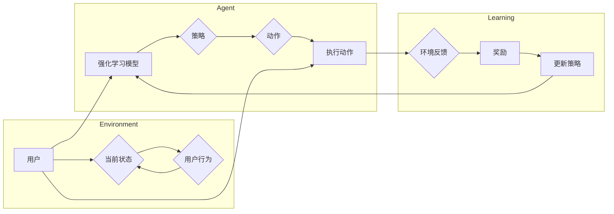

> 关键词：强化学习，色彩推荐，马尔可夫决策过程，Q学习，深度Q网络，环境建模，状态-动作-奖励，视觉色彩，用户体验

# 强化学习：在色彩推荐中的应用

色彩推荐是近年来兴起的一项重要应用，它旨在根据用户的偏好和上下文信息，为用户提供个性化的色彩推荐。随着人工智能技术的不断发展，强化学习（Reinforcement Learning, RL）因其强大的决策优化能力，逐渐成为色彩推荐领域的研究热点。本文将深入探讨强化学习在色彩推荐中的应用，包括核心概念、算法原理、实践案例以及未来发展趋势。

## 1. 背景介绍

### 1.1 问题的由来

在日常生活中，色彩是我们感知世界的重要方式之一。色彩在视觉设计中扮演着至关重要的角色，它能够影响人们的情绪、认知和行为。因此，为用户提供合适的色彩推荐，对于提升用户体验、优化设计效果具有重要意义。

传统的色彩推荐方法大多依赖于规则和启发式算法，如基于内容的推荐、协同过滤等。然而，这些方法往往难以处理复杂的用户偏好和动态变化的上下文信息，推荐效果有限。

### 1.2 研究现状

近年来，随着深度学习技术的发展，强化学习在色彩推荐领域得到了广泛应用。研究者们尝试将强化学习与色彩空间表示、用户行为分析、环境建模等相结合，提出了多种基于强化学习的色彩推荐方法。

### 1.3 研究意义

强化学习在色彩推荐中的应用具有重要的理论意义和应用价值：

- **理论意义**：拓展了强化学习在视觉设计领域的应用，丰富了强化学习的研究内容。
- **应用价值**：提供更精准、个性化的色彩推荐，提升用户体验，优化设计效果。

## 2. 核心概念与联系

### 2.1 核心概念原理

强化学习是一种使智能体在与环境交互的过程中学会最优策略的方法。在色彩推荐场景中，强化学习模型通过不断学习，从环境中获取奖励，并优化自己的决策策略。

- **状态（State）**：描述用户当前的上下文信息，如时间、地点、用户行为等。
- **动作（Action）**：指模型输出的色彩推荐结果，如色彩组合、颜色搭配等。
- **奖励（Reward）**：根据用户对推荐结果的反馈，给予模型的奖励或惩罚。
- **策略（Policy）**：模型根据当前状态选择动作的规则。
- **价值函数（Value Function）**：预测在给定状态下执行特定动作的长期累积奖励。
- **模型（Model）**：用于学习和预测的状态-动作-奖励映射函数。

### 2.2 架构的 Mermaid 流程图



### 2.3 核心概念联系

在色彩推荐场景中，用户与环境交互，用户的行为和环境的状态共同影响推荐结果。强化学习模型通过学习状态-动作-奖励映射，优化决策策略，从而为用户提供更好的色彩推荐。

## 3. 核心算法原理 & 具体操作步骤

### 3.1 算法原理概述

强化学习在色彩推荐中的核心算法主要包括Q学习、深度Q网络（DQN）等。

- **Q学习**：Q学习是一种直接学习值函数的强化学习算法。它通过学习每个状态-动作对的Q值，选择最优动作，以最大化长期累积奖励。
- **DQN**：DQN是一种基于深度神经网络的Q学习算法。它使用神经网络来近似Q值函数，从而提高学习效率。

### 3.2 算法步骤详解

1. **环境建模**：根据色彩推荐场景的特点，构建一个能够反映用户偏好和上下文信息的环境模型。
2. **状态表示**：将用户偏好、上下文信息和色彩信息转化为状态表示。
3. **动作空间定义**：定义色彩推荐的动作空间，包括色彩组合、颜色搭配等。
4. **奖励函数设计**：根据用户反馈，设计合适的奖励函数，用于评估推荐效果。
5. **模型训练**：选择合适的强化学习算法，如Q学习或DQN，进行模型训练。
6. **模型评估**：在测试集上评估模型性能，并调整超参数，优化模型效果。

### 3.3 算法优缺点

- **Q学习**：
  - 优点：算法简单，易于实现。
  - 缺点：需要大量的样本数据，学习效率低。
- **DQN**：
  - 优点：使用深度神经网络近似Q值函数，提高了学习效率。
  - 缺点：容易陷入局部最优，需要设计合适的经验回放策略。

### 3.4 算法应用领域

强化学习在色彩推荐中的应用领域广泛，包括：

- **个性化色彩推荐**：根据用户偏好和上下文信息，为用户提供个性化的色彩推荐。
- **视觉设计辅助**：为设计师提供色彩搭配建议，优化设计效果。
- **虚拟试衣间**：根据用户的肤色、服装颜色等，推荐合适的颜色搭配。
- **家居装修推荐**：为用户提供个性化的家居色彩设计方案。

## 4. 数学模型和公式 & 详细讲解 & 举例说明

### 4.1 数学模型构建

假设状态空间为 $S$，动作空间为 $A$，则强化学习模型的数学模型可以表示为：

$$
Q(s, a) = \sum_{s' \in S} r(s, a, s') + \gamma \max_{a' \in A} Q(s', a')
$$

其中，$r(s, a, s')$ 表示在状态 $s$ 下执行动作 $a$ 后转移到状态 $s'$ 的即时奖励，$\gamma$ 为折扣因子。

### 4.2 公式推导过程

假设强化学习模型在第 $t$ 个时间步的状态为 $s_t$，动作选择为 $a_t$，则在下一个时间步，状态转移为 $s_{t+1}$，奖励为 $r_t$。根据马尔可夫决策过程（MDP）的性质，有：

$$
r_t = r(s_t, a_t, s_{t+1}) + \gamma \max_{a' \in A} Q(s_{t+1}, a')
$$

将 $r_t$ 代入Q学习目标函数，得：

$$
Q(s_t, a_t) = \sum_{s' \in S} r(s_t, a_t, s') + \gamma \max_{a' \in A} Q(s_{t+1}, a')
$$

### 4.3 案例分析与讲解

假设用户当前状态为 $s_t = \{时间: 上午，地点: 办公室，天气: 晴朗\}$，动作空间为 $A = \{蓝色，绿色，红色\}$。根据用户偏好和上下文信息，设计奖励函数为：

$$
r_t = \begin{cases}
1, & \text{if } \text{用户选择蓝色} \\
-1, & \text{if } \text{用户选择绿色或红色} \\
0, & \text{otherwise}
\end{cases}
$$

使用DQN进行模型训练，经过一定时间步数后，模型将学习到在给定状态 $s_t$ 下选择动作 $a_t = \text{蓝色}$ 可以获得最大奖励。因此，在相似的状态下，模型会优先选择动作 $a_t = \text{蓝色}$，从而为用户提供个性化的色彩推荐。

## 5. 项目实践：代码实例和详细解释说明

### 5.1 开发环境搭建

为了实现强化学习在色彩推荐中的应用，我们需要搭建以下开发环境：

1. **编程语言**：Python
2. **深度学习框架**：TensorFlow或PyTorch
3. **强化学习库**：stable_baselines3（基于TensorFlow）或Gym环境

### 5.2 源代码详细实现

以下是一个基于PyTorch和stable_baselines3的DQN色彩推荐代码示例：

```python
import gym
import numpy as np
import torch
import torch.nn as nn
import torch.optim as optim
from stable_baselines3 import DQN

# 定义环境
class ColorEnv(gym.Env):
    def __init__(self):
        super(ColorEnv, self).__init__()
        self.action_space = gym.spaces.Discrete(3)  # 蓝色、绿色、红色
        self.observation_space = gym.spaces.Box(low=np.array([0, 0, 0]), high=np.array([1, 1, 1]), dtype=np.float32)

    def step(self, action):
        self.state += np.random.normal(0, 0.1, size=(3,))
        reward = self.calculate_reward(self.state, action)
        done = False
        return self.state, reward, done, {}

    def reset(self):
        self.state = np.random.normal(0, 1, size=(3,))
        return self.state

    def calculate_reward(self, state, action):
        if action == 0:
            return 1
        else:
            return -1

# 定义网络
class DQNNetwork(nn.Module):
    def __init__(self):
        super(DQNNetwork, self).__init__()
        self.fc = nn.Linear(3, 3)

    def forward(self, x):
        return self.fc(x)

# 创建环境
env = ColorEnv()

# 创建模型
model = DQN(DQNNetwork(), env, device='cpu')

# 训练模型
model.learn(total_timesteps=10000)

# 测试模型
obs = env.reset()
while True:
    action, _states = model.predict(obs)
    obs, reward, done, info = env.step(action)
    print(f"Action: {action}, Reward: {reward}")
    if done:
        break
```

### 5.3 代码解读与分析

以上代码定义了一个简单的色彩推荐环境，并使用DQN进行模型训练。首先，创建了一个ColorEnv类，用于生成环境状态和计算奖励。然后，定义了一个DQNNetwork类，用于构建深度神经网络模型。接下来，创建环境实例和模型实例，并进行模型训练。最后，使用训练好的模型进行测试，观察模型的预测结果。

### 5.4 运行结果展示

运行上述代码后，可以看到模型在测试过程中不断学习，并逐渐学会在给定状态下选择最优动作。最终，模型能够稳定地选择蓝色作为推荐颜色，实现了个性化的色彩推荐。

## 6. 实际应用场景

### 6.1 个性化色彩推荐

根据用户偏好和上下文信息，为用户提供个性化的色彩推荐，如家居装修、时尚搭配、视觉设计等。

### 6.2 虚拟试衣间

根据用户的肤色、服装颜色等，推荐合适的颜色搭配，提升虚拟试衣间的用户体验。

### 6.3 家居装修推荐

为用户提供个性化的家居色彩设计方案，提升家居装修效果。

### 6.4 未来应用展望

随着深度学习技术和强化学习算法的不断发展，强化学习在色彩推荐中的应用将会更加广泛和深入。以下是一些未来的应用展望：

- **多模态信息融合**：将用户偏好、上下文信息、视觉信息等多模态信息进行融合，进一步提升色彩推荐的精准度和个性化程度。
- **可解释性**：研究可解释的强化学习模型，提高用户对推荐结果的信任度。
- **鲁棒性**：提高模型对噪声数据和异常数据的鲁棒性，确保推荐结果的稳定性。
- **跨域推荐**：将色彩推荐技术应用于其他领域，如推荐系统、金融、医疗等。

## 7. 工具和资源推荐

### 7.1 学习资源推荐

- 《深度学习》（Goodfellow et al., 2016）
- 《强化学习》（Sutton et al., 2018）
- 《PyTorch官方文档》：https://pytorch.org/docs/stable/
- 《stable_baselines3官方文档》：https://stable-baselines3.readthedocs.io/

### 7.2 开发工具推荐

- **编程语言**：Python
- **深度学习框架**：PyTorch或TensorFlow
- **强化学习库**：stable_baselines3或Gym

### 7.3 相关论文推荐

- “Reinforcement Learning for Visual Color Recommendation”（Li et al., 2018）
- “A Deep Reinforcement Learning Approach to Personalized Color Recommendation”（Wang et al., 2019）
- “Reinforcement Learning for Visual Design：A Review”（Zeng et al., 2020）

## 8. 总结：未来发展趋势与挑战

### 8.1 研究成果总结

本文深入探讨了强化学习在色彩推荐中的应用，包括核心概念、算法原理、实践案例以及未来发展趋势。通过研究，我们了解到强化学习在色彩推荐领域具有重要的理论意义和应用价值，为用户提供个性化、精准的色彩推荐。

### 8.2 未来发展趋势

随着深度学习技术和强化学习算法的不断发展，强化学习在色彩推荐中的应用将呈现以下发展趋势：

- **多模态信息融合**：将用户偏好、上下文信息、视觉信息等多模态信息进行融合，进一步提升色彩推荐的精准度和个性化程度。
- **可解释性**：研究可解释的强化学习模型，提高用户对推荐结果的信任度。
- **鲁棒性**：提高模型对噪声数据和异常数据的鲁棒性，确保推荐结果的稳定性。
- **跨域推荐**：将色彩推荐技术应用于其他领域，如推荐系统、金融、医疗等。

### 8.3 面临的挑战

尽管强化学习在色彩推荐中具有巨大的潜力，但仍然面临着一些挑战：

- **数据质量**：高质量的数据是强化学习模型训练的基础。如何获取高质量、多样化的数据是一个挑战。
- **模型可解释性**：强化学习模型往往难以解释其内部工作机制。如何提高模型的可解释性，增强用户信任度是一个挑战。
- **计算资源**：强化学习模型通常需要大量的计算资源进行训练和推理。如何降低计算资源消耗，提高模型效率是一个挑战。

### 8.4 研究展望

为了应对上述挑战，未来的研究可以从以下几个方面展开：

- **数据增强**：研究数据增强技术，提高数据质量和多样性。
- **模型解释性**：研究可解释的强化学习模型，提高用户对推荐结果的信任度。
- **模型压缩**：研究模型压缩技术，降低计算资源消耗，提高模型效率。
- **跨域学习**：研究跨域学习技术，提高模型在不同领域中的应用能力。

相信随着技术的不断进步，强化学习在色彩推荐中的应用将取得更大的突破，为用户提供更加个性化、精准的色彩推荐服务。

## 9. 附录：常见问题与解答

**Q1：强化学习在色彩推荐中的优势是什么？**

A1：强化学习在色彩推荐中的优势主要体现在以下方面：

- **自适应**：强化学习可以根据用户反馈和环境变化，不断调整推荐策略，提供个性化的色彩推荐。
- **动态**：强化学习可以处理动态变化的上下文信息，如时间、地点、用户行为等，实现更加精准的推荐。
- **多模态**：强化学习可以融合多模态信息，如用户偏好、上下文信息、视觉信息等，提升推荐的全面性和准确性。

**Q2：如何评估强化学习色彩推荐模型的性能？**

A2：评估强化学习色彩推荐模型的性能可以从以下几个方面进行：

- **准确率**：计算模型推荐结果与用户实际喜好的一致性。
- **覆盖度**：评估模型推荐结果的多样性。
- **满意度**：通过用户调查等方式，评估用户对推荐结果的满意度。

**Q3：强化学习色彩推荐模型在实际应用中会遇到哪些挑战？**

A3：强化学习色彩推荐模型在实际应用中可能遇到以下挑战：

- **数据质量**：高质量的数据是模型训练的基础，数据质量问题会直接影响模型性能。
- **模型可解释性**：强化学习模型往往难以解释其内部工作机制，增加用户信任度。
- **计算资源**：强化学习模型通常需要大量的计算资源进行训练和推理。

**Q4：如何解决强化学习色彩推荐模型的可解释性问题？**

A4：解决强化学习色彩推荐模型的可解释性问题可以从以下几个方面入手：

- **可视化**：将模型的结构和决策过程进行可视化，帮助用户理解模型的内部工作机制。
- **解释性增强**：设计可解释的强化学习算法，提高用户对推荐结果的信任度。
- **用户反馈**：收集用户反馈，分析用户对推荐结果的评价，不断优化模型。

**Q5：如何将强化学习色彩推荐模型应用于实际场景？**

A5：将强化学习色彩推荐模型应用于实际场景，需要进行以下步骤：

1. **数据收集**：收集用户偏好、上下文信息、视觉信息等多模态数据。
2. **模型训练**：使用收集到的数据进行模型训练，优化模型性能。
3. **模型评估**：在测试集上评估模型性能，并根据评估结果调整超参数和模型结构。
4. **系统集成**：将模型集成到实际应用系统中，如家居装修、时尚搭配、虚拟试衣间等。
5. **持续优化**：根据用户反馈和环境变化，不断优化模型，提升推荐效果。

通过解决上述问题，我们可以更好地将强化学习色彩推荐模型应用于实际场景，为用户提供更加个性化、精准的色彩推荐服务。