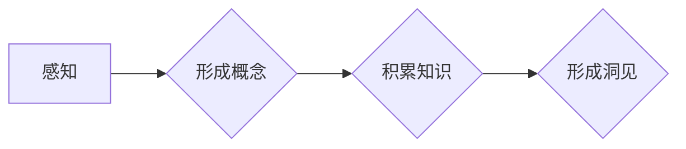

# 思想的演变：从概念到洞见

> 关键词：认知科学、人工智能、机器学习、深度学习、思维模式、知识图谱

## 1. 背景介绍

人类思想的演变是一个漫长而复杂的过程，从最初的感知世界，到形成概念，再到形成洞见，每一步都是对知识理解的深化。随着科技的发展，人工智能技术，尤其是机器学习和深度学习，为我们提供了新的工具，让我们能够从数据中挖掘出更深层次的知识。本文将探讨思想的演变过程，并分析人工智能技术如何推动这一过程，最终达到洞见的境界。

### 1.1 人类思想的起源

人类思想的起源可以追溯到史前时代，当时的人类通过观察和经验积累形成了初步的概念。这些概念帮助人类更好地理解周围的世界，并在实践中得到了验证。

### 1.2 科学革命与思想的飞跃

科学革命的出现，标志着人类思想的重大飞跃。通过实验和观察，科学家们提出了新的理论，推动了人类对自然界的认识。这一时期，数学和逻辑学的发展也为思想的表达和验证提供了新的工具。

### 1.3 人工智能的崛起

20世纪中叶以来，人工智能的崛起为人类思想的演变提供了新的动力。机器学习、深度学习等技术的发展，使得计算机能够处理复杂的数据，并从中学习出新的知识。

### 1.4 本文结构

本文将分为以下几个部分：

- 介绍核心概念与联系，并给出流程图。
- 阐述核心算法原理和具体操作步骤。
- 探讨数学模型和公式，并举例说明。
- 展示项目实践：代码实例和详细解释说明。
- 分析实际应用场景和未来应用展望。
- 总结未来发展趋势与挑战。
- 推荐相关工具和资源。

## 2. 核心概念与联系

在探讨思想的演变之前，我们需要明确几个核心概念：

- 感知：通过感官接收外界信息的过程。
- 概念：对事物进行分类和抽象的思维活动。
- 知识：经过验证和系统化的信息集合。
- 洞见：对事物的深刻理解和见解。

以下是一个描述思想演变过程的Mermaid流程图：



在这个流程中，感知是思想的起点，通过感知，我们形成概念。随着经验的积累，我们不断积累知识，最终形成洞见。

## 3. 核心算法原理 & 具体操作步骤

### 3.1 算法原理概述

人工智能技术通过机器学习，特别是深度学习算法，能够从大量数据中学习出复杂的关系和模式。以下是一些常用的算法：

- 神经网络：模拟人脑神经元的工作原理，通过多层神经网络对数据进行学习。
- 支持向量机（SVM）：通过寻找最佳的超平面来对数据进行分类。
- 决策树：通过树状结构对数据进行分类或回归。

### 3.2 算法步骤详解

以下是使用神经网络进行深度学习的基本步骤：

1. 数据准备：收集和清洗数据，将数据划分为训练集、验证集和测试集。
2. 构建模型：选择合适的神经网络架构，如卷积神经网络（CNN）或循环神经网络（RNN）。
3. 训练模型：使用训练集数据训练模型，调整模型参数以最小化损失函数。
4. 评估模型：使用验证集数据评估模型性能，调整模型参数或架构以提高性能。
5. 测试模型：使用测试集数据测试模型性能，评估模型在实际应用中的表现。

### 3.3 算法优缺点

- 优点：能够处理大规模数据，自动学习复杂模式，具有较强的泛化能力。
- 缺点：训练过程需要大量计算资源，模型可解释性较差，对数据质量要求较高。

### 3.4 算法应用领域

人工智能技术在各个领域都有广泛的应用，包括：

- 机器视觉：图像识别、物体检测、图像分割等。
- 自然语言处理：机器翻译、文本分类、情感分析等。
- 语音识别：语音识别、语音合成、语音搜索等。
- 医疗诊断：疾病预测、药物研发、个性化医疗等。

## 4. 数学模型和公式 & 详细讲解 & 举例说明

### 4.1 数学模型构建

在人工智能中，数学模型是核心。以下是一个简单的神经网络模型：

$$
y = f(W \cdot x + b)
$$

其中 $W$ 是权重矩阵，$b$ 是偏置向量，$x$ 是输入向量，$y$ 是输出向量，$f$ 是激活函数。

### 4.2 公式推导过程

以下是一个简单的梯度下降算法的推导过程：

$$
\theta_{t+1} = \theta_t - \alpha \cdot \nabla_{\theta} J(\theta_t)
$$

其中 $\theta$ 是模型参数，$\alpha$ 是学习率，$J(\theta)$ 是损失函数。

### 4.3 案例分析与讲解

以下是一个使用神经网络进行图像分类的例子：

假设我们有一个包含10000张猫和狗的图像数据集，我们需要训练一个神经网络来识别图像中的动物。

1. 数据准备：将图像数据转换为像素矩阵，并划分为训练集、验证集和测试集。
2. 构建模型：选择一个卷积神经网络架构，如LeNet。
3. 训练模型：使用训练集数据训练模型，调整模型参数以最小化损失函数。
4. 评估模型：使用验证集数据评估模型性能，调整模型参数或架构以提高性能。
5. 测试模型：使用测试集数据测试模型性能，评估模型在实际应用中的表现。

## 5. 项目实践：代码实例和详细解释说明

### 5.1 开发环境搭建

在开始项目实践之前，我们需要搭建开发环境。以下是使用Python和TensorFlow进行神经网络训练的基本步骤：

1. 安装Python和pip。
2. 安装TensorFlow库。
3. 安装其他必要的库，如NumPy、Matplotlib等。

### 5.2 源代码详细实现

以下是一个简单的神经网络训练代码示例：

```python
import tensorflow as tf

# 创建模型
model = tf.keras.models.Sequential([
    tf.keras.layers.Conv2D(32, (3, 3), activation='relu', input_shape=(28, 28, 1)),
    tf.keras.layers.MaxPooling2D((2, 2)),
    tf.keras.layers.Conv2D(64, (3, 3), activation='relu'),
    tf.keras.layers.MaxPooling2D((2, 2)),
    tf.keras.layers.Conv2D(64, (3, 3), activation='relu'),
    tf.keras.layers.Flatten(),
    tf.keras.layers.Dense(64, activation='relu'),
    tf.keras.layers.Dense(10, activation='softmax')
])

# 编译模型
model.compile(optimizer='adam',
              loss='sparse_categorical_crossentropy',
              metrics=['accuracy'])

# 训练模型
model.fit(x_train, y_train, epochs=5)

# 评估模型
test_loss, test_acc = model.evaluate(x_test, y_test, verbose=2)
print('
Test accuracy:', test_acc)
```

### 5.3 代码解读与分析

以上代码使用TensorFlow创建了一个简单的卷积神经网络模型，用于分类MNIST数据集中的手写数字。模型首先通过三个卷积层提取图像特征，然后通过池化层降低特征的空间维度，最后通过全连接层进行分类。

- `Conv2D` 层用于卷积操作，参数包括卷积核大小、激活函数等。
- `MaxPooling2D` 层用于池化操作，降低特征的空间维度。
- `Flatten` 层用于将特征展平成一维向量。
- `Dense` 层用于全连接操作，输出最终的分类结果。

### 5.4 运行结果展示

运行上述代码，我们可以得到模型在测试集上的准确率。例如，如果测试集的准确率为98%，则说明模型在分类手写数字方面取得了良好的效果。

## 6. 实际应用场景

人工智能技术在各个领域都有广泛的应用，以下是一些常见的应用场景：

### 6.1 医疗诊断

人工智能可以帮助医生进行疾病预测、药物研发和个性化医疗。通过分析医疗数据，人工智能可以识别出疾病的早期迹象，帮助医生制定更有效的治疗方案。

### 6.2 金融分析

人工智能可以帮助金融机构进行风险评估、欺诈检测和投资建议。通过分析大量的金融数据，人工智能可以识别出潜在的风险，帮助金融机构做出更明智的投资决策。

### 6.3 智能驾驶

人工智能可以帮助车辆进行自动驾驶，提高道路安全。通过分析道路情况和周围环境，人工智能可以控制车辆行驶，避免事故发生。

### 6.4 语音识别

人工智能可以帮助设备进行语音识别，提高人机交互的效率。通过分析语音信号，人工智能可以将语音转换为文本，或者控制设备的操作。

## 7. 工具和资源推荐

### 7.1 学习资源推荐

- 《深度学习》[Goodfellow, Ian; Bengio, Yoshua; Courville, Aaron]
- 《Python机器学习》[Sebastian Raschka; Vincent Grandjean]
- TensorFlow官方文档：[https://www.tensorflow.org/]

### 7.2 开发工具推荐

- TensorFlow：[https://www.tensorflow.org/]
- PyTorch：[https://pytorch.org/]

### 7.3 相关论文推荐

- "A Systematic Review of Deep Learning in Healthcare" [Wang, Z., et al.]
- "Deep Learning for Healthcare: A Survey" [Sukumaran, R., et al.]

## 8. 总结：未来发展趋势与挑战

### 8.1 研究成果总结

人工智能技术在各个领域都取得了显著的成果，推动了人类思想的演变。从概念到洞见，人工智能技术为人类提供了新的工具和视角。

### 8.2 未来发展趋势

未来，人工智能技术将朝着以下几个方向发展：

- 更强大的模型：随着计算能力的提升，我们将能够训练更大、更复杂的模型。
- 更多的应用场景：人工智能技术将应用于更多的领域，解决更多的问题。
- 更好的可解释性：我们将开发出更加可解释的人工智能模型，提高模型的透明度和可信度。

### 8.3 面临的挑战

尽管人工智能技术取得了巨大的进步，但仍然面临着一些挑战：

- 数据隐私：如何保护用户数据的安全和隐私是一个重要的问题。
- 模型偏见：如何消除模型中的偏见，确保公平性和公正性是一个挑战。
- 安全性：如何确保人工智能系统的安全，防止恶意攻击是一个重要的问题。

### 8.4 研究展望

未来，我们将继续探索人工智能技术的潜力，推动人类思想的演变。通过人工智能技术，我们将能够更好地理解世界，创造更美好的未来。

## 9. 附录：常见问题与解答

**Q1：人工智能是否会取代人类？**

A：人工智能可以辅助人类完成一些重复性、危险或复杂的任务，但它不能完全取代人类。人类具有创造力、情感和道德判断，这是人工智能无法替代的。

**Q2：人工智能是否会带来失业问题？**

A：人工智能可能会替代一些低技能的工作，但同时也将创造新的就业机会。我们需要适应新的技术环境，提升自身技能，以适应未来的工作市场。

**Q3：如何确保人工智能系统的安全性和可靠性？**

A：我们需要建立完善的法律和伦理规范，确保人工智能系统的安全性和可靠性。同时，我们需要开发出更加可解释的人工智能模型，提高模型的透明度和可信度。

**Q4：人工智能技术将如何影响社会？**

A：人工智能技术将深刻影响社会，推动社会进步。它将提高生产效率，改善生活质量，但同时也需要我们应对由此带来的挑战。

作者：禅与计算机程序设计艺术 / Zen and the Art of Computer Programming