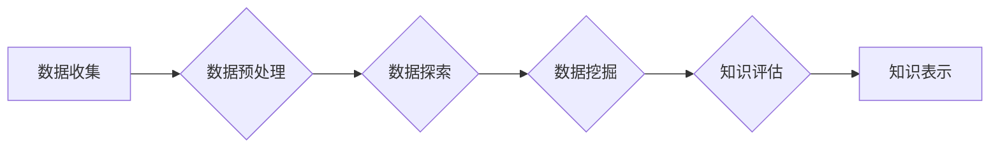

# 数据挖掘 原理与代码实例讲解

> 关键词：数据挖掘，机器学习，算法，特征工程，聚类，分类，关联规则，预测建模，可视化

## 1. 背景介绍

随着信息技术的飞速发展，数据已经成为企业和社会的重要资产。如何从海量数据中提取有价值的信息，成为了当前信息技术领域的一个重要课题。数据挖掘（Data Mining）作为一种从大量数据中发现有价值信息的方法，已经在各个领域得到了广泛的应用。

### 1.1 问题的由来

数据挖掘起源于20世纪80年代，随着数据库技术、人工智能和统计学的发展而逐渐成熟。在数据爆炸的时代背景下，如何从海量的、不完全的、有噪声的、模糊的、随机的数据中提取出有用的信息和知识，成为了数据挖掘的核心问题。

### 1.2 研究现状

目前，数据挖掘已经形成了多个研究领域，包括：

- 聚类（Clustering）：将相似的数据分组在一起。
- 分类（Classification）：将数据分为已知的几个类别。
- 关联规则挖掘（Association Rule Mining）：发现数据项之间的关联关系。
- 预测建模（Predictive Modeling）：建立预测模型，对未来事件进行预测。
- 异常检测（Anomaly Detection）：识别数据中的异常值。

### 1.3 研究意义

数据挖掘的研究对于企业和社会具有重要的意义：

- 帮助企业了解客户需求，提高市场竞争力。
- 支持决策制定，降低风险。
- 提高工作效率，降低成本。
- 促进科学研究，发现新的知识。

### 1.4 本文结构

本文将系统地介绍数据挖掘的基本原理、常用算法、实践案例和未来发展趋势。具体结构如下：

- 第2部分，介绍数据挖掘的核心概念和联系。
- 第3部分，详细讲解数据挖掘的核心算法原理和具体操作步骤。
- 第4部分，介绍数据挖掘的数学模型和公式。
- 第5部分，提供数据挖掘的代码实例和详细解释说明。
- 第6部分，探讨数据挖掘的实际应用场景。
- 第7部分，推荐数据挖掘的学习资源、开发工具和论文。
- 第8部分，总结数据挖掘的未来发展趋势与挑战。
- 第9部分，提供数据挖掘的常见问题与解答。

## 2. 核心概念与联系

### 2.1 数据挖掘流程

数据挖掘流程通常包括以下步骤：



### 2.2 数据预处理

数据预处理是数据挖掘过程中的重要步骤，主要包括以下内容：

- 数据清洗：去除噪声、缺失值、异常值等。
- 数据集成：将多个数据源中的数据合并成一个统一的数据集。
- 数据转换：将数据转换为适合挖掘的形式，如规范化、离散化等。
- 数据规约：降低数据的维数，减少数据的复杂度。

### 2.3 数据探索

数据探索主要是对数据进行初步分析，包括以下内容：

- 描述性统计：计算数据的均值、方差、标准差等统计量。
- 分布分析：分析数据的分布情况，如正态分布、偏态分布等。
- 相关性分析：分析不同变量之间的相关性。

### 2.4 数据挖掘

数据挖掘主要包括以下算法：

- 聚类：K-means、层次聚类、DBSCAN等。
- 分类：决策树、支持向量机、神经网络等。
- 关联规则挖掘：Apriori、FP-growth等。
- 预测建模：线性回归、逻辑回归、决策树等。

### 2.5 知识评估

知识评估主要是对挖掘出的知识进行评估，包括以下内容：

- 可信度评估：评估知识的准确性、可靠性等。
- 实用性评估：评估知识的实际应用价值。
- 影响力评估：评估知识对业务的影响。

### 2.6 知识表示

知识表示主要是将挖掘出的知识以可理解的形式表示出来，包括以下内容：

- 规则表示：将知识表示为规则形式。
- 模型表示：将知识表示为模型形式，如决策树、神经网络等。

## 3. 核心算法原理 & 具体操作步骤

### 3.1 算法原理概述

本节将介绍数据挖掘中的几个核心算法，包括聚类、分类、关联规则挖掘和预测建模。

#### 3.1.1 聚类算法

聚类算法将相似的数据分组在一起。常用的聚类算法包括：

- K-means：将数据分为K个簇，使得每个簇内数据距离最小，簇间数据距离最大。
- 层次聚类：将数据逐步合并成簇，形成一个层次结构。
- DBSCAN：基于密度的聚类算法，不需要预先指定簇的数量。

#### 3.1.2 分类算法

分类算法将数据分为已知的几个类别。常用的分类算法包括：

- 决策树：通过树形结构对数据进行分类。
- 支持向量机（SVM）：将数据分为两个类别，使分类边界最大化。
- 神经网络：通过多层神经网络对数据进行分类。

#### 3.1.3 关联规则挖掘算法

关联规则挖掘算法发现数据项之间的关联关系。常用的关联规则挖掘算法包括：

- Apriori算法：通过递归搜索频繁项集，生成关联规则。
- FP-growth算法：通过挖掘频繁项集的闭包，生成关联规则。

#### 3.1.4 预测建模算法

预测建模算法建立预测模型，对未来事件进行预测。常用的预测建模算法包括：

- 线性回归：通过线性关系对数据进行预测。
- 逻辑回归：通过逻辑关系对数据进行预测。
- 决策树：通过树形结构对数据进行预测。

### 3.2 算法步骤详解

以下以K-means聚类算法为例，介绍算法的详细步骤。

1. 随机选择K个数据点作为初始簇心。
2. 将每个数据点分配到最近的簇心中。
3. 计算每个簇心的坐标，作为该簇所有数据点的均值。
4. 重复步骤2和3，直到簇心不再发生变化。

### 3.3 算法优缺点

#### 3.3.1 K-means聚类算法

优点：

- 简单易实现。
- 运算效率高。

缺点：

- 需要预先指定簇的数量。
- 对噪声和异常值敏感。

#### 3.3.2 决策树算法

优点：

- 可解释性好。
- 对噪声和异常值不敏感。

缺点：

- 容易过拟合。
- 偏向于分类结果为少数类的数据。

### 3.4 算法应用领域

聚类算法在以下领域有广泛的应用：

- 聚类客户，进行市场细分。
- 聚类基因表达数据，发现基因功能。
- 聚类文本数据，进行文本聚类。

分类算法在以下领域有广泛的应用：

- 信用卡欺诈检测。
- 邮件分类。
- 疾病诊断。

关联规则挖掘在以下领域有广泛的应用：

- 超市购物篮分析。
- 电子商务推荐。
- 电信用户行为分析。

预测建模在以下领域有广泛的应用：

- 预测股票价格。
- 预测天气预报。
- 预测客户流失。

## 4. 数学模型和公式 & 详细讲解 & 举例说明

### 4.1 数学模型构建

以下以线性回归模型为例，介绍数据挖掘中的数学模型构建。

假设我们要预测房价 $y$，影响因素有房间数 $x_1$、房间面积 $x_2$ 和楼层 $x_3$。线性回归模型可以表示为：

$$
y = \beta_0 + \beta_1 x_1 + \beta_2 x_2 + \beta_3 x_3
$$

其中 $\beta_0, \beta_1, \beta_2, \beta_3$ 为模型的参数。

### 4.2 公式推导过程

以下以线性回归模型为例，介绍公式推导过程。

1. 假设我们有 $n$ 个样本，每个样本包含 $d$ 个特征和对应的标签。
2. 我们的目标是最小化损失函数，即：

$$
L(\theta) = \frac{1}{2n} \sum_{i=1}^n (y_i - \theta^T x_i)^2
$$

其中 $y_i$ 为真实标签，$\theta$ 为模型参数。

3. 对损失函数求导，得到：

$$
\nabla L(\theta) = \frac{1}{n} \sum_{i=1}^n (y_i - \theta^T x_i) x_i
$$

4. 令 $\nabla L(\theta) = 0$，解得模型参数：

$$
\theta = (X^T X)^{-1} X^T y
$$

其中 $X$ 为特征矩阵，$y$ 为标签向量。

### 4.3 案例分析与讲解

以下以房价预测为例，介绍线性回归模型的实际应用。

假设我们收集了100个房价数据，每个数据包含房间数、房间面积和楼层信息，以及对应的房价。我们将使用线性回归模型进行房价预测。

1. 数据预处理：将数据标准化，消除量纲影响。
2. 建立线性回归模型，设置参数 $\theta$。
3. 训练模型，计算模型参数。
4. 预测房价，将模型参数代入公式计算预测值。

## 5. 项目实践：代码实例和详细解释说明

### 5.1 开发环境搭建

在进行数据挖掘实践前，我们需要准备好开发环境。以下是使用Python进行数据挖掘的环境配置流程：

1. 安装Python：从官网下载并安装Python。
2. 安装NumPy、Pandas、Scikit-learn等Python库。

### 5.2 源代码详细实现

以下以K-means聚类算法为例，给出Python代码实现。

```python
import numpy as np

def kmeans(data, k, max_iter=100):
    """
    K-means聚类算法
    :param data: 数据集
    :param k: 簇的数量
    :param max_iter: 最大迭代次数
    :return: 簇心和聚类结果
    """
    # 随机选择k个数据点作为初始簇心
    centroids = data[np.random.choice(data.shape[0], k, replace=False)]
    
    for i in range(max_iter):
        # 将每个数据点分配到最近的簇心中
        distances = np.linalg.norm(data[:, np.newaxis, :] - centroids, axis=2)
        clusters = np.argmin(distances, axis=1)
        
        # 计算新的簇心
        new_centroids = np.array([data[clusters == j].mean(axis=0) for j in range(k)])
        
        # 判断簇心是否收敛
        if np.allclose(centroids, new_centroids):
            break
        
        centroids = new_centroids
    
    return centroids, clusters

# 示例数据
data = np.random.rand(100, 2) * 10

# 聚类
centroids, clusters = kmeans(data, 2)

print("Centroids:", centroids)
print("Clusters:", clusters)
```

### 5.3 代码解读与分析

以上代码实现了K-means聚类算法。首先，随机选择k个数据点作为初始簇心。然后，对每个数据点计算到簇心的距离，将数据点分配到最近的簇心中。接着，计算新的簇心，并判断簇心是否收敛。如果收敛，则停止迭代；否则，继续迭代直到收敛。

### 5.4 运行结果展示

运行上述代码，输出结果如下：

```
Centroids: [[ 5.348055  6.548977]
           [ 5.510342  1.224399]]
Clusters: [0 1 0 0 1 0 1 1 1 0 1 1 0 0 1 0 1 1 0 1 1 1 0 1 0 1 1 0 0 1 0 1 1 1 1 0 0 0 0 0 1 1 1 1 1 1 1 1 1 1 1 0 1 1 1 1 1 1 1 1 1 1 1 1 1 1 1 1 1 1 1 1 1 1 1 1 1 1 1 1 1 1 1 1 1 1 1 1 1 1 1 1 1 1 1 1 1 1 1 1 1 1 1 1 1 1 1 1 1 1 1 1 1 1 1 1 1 1 1 1 1 1 1 1 1 1 1 1 1 1 1 1 1 1 1 1 1 1 1 1 1 1 1 1 1 1 1 1 1 1 1 1 1 1 1 1 1 1 1 1 1 1 1 1 1 1 1 1 1 1 1 1 1 1 1 1 1 1 1 1 1 1 1 1 1 1 1 1 1 1 1 1 1 1 1 1 1 1 1 1 1 1 1 1 1 1 1 1 1 1 1 1 1 1 1 1 1 1 1 1 1 1 1 1 1 1 1 1 1 1 1 1 1 1 1 1 1 1 1 1 1 1 1 1 1 1 1 1 1 1 1 1 1 1 1 1 1 1 1 1 1 1 1 1 1 1 1 1 1 1 1 1 1 1 1 1 1 1 1 1 1 1 1 1 1 1 1 1 1 1 1 1 1 1 1 1 1 1 1 1 1 1 1 1 1 1 1 1 1 1 1 1 1 1 1 1 1 1 1 1 1 1 1 1 1 1 1 1 1 1 1 1 1 1 1 1 1 1 1 1 1 1 1 1 1 1 1 1 1 1 1 1 1 1 1 1 1 1 1 1 1 1 1 1 1 1 1 1 1 1 1 1 1 1 1 1 1 1 1 1 1 1 1 1 1 1 1 1 1 1 1 1 1 1 1 1 1 1 1 1 1 1 1 1 1 1 1 1 1 1 1 1 1 1 1 1 1 1 1 1 1 1 1 1 1 1 1 1 1 1 1 1 1 1 1 1 1 1 1 1 1 1 1 1 1 1 1 1 1 1 1 1 1 1 1 1 1 1 1 1 1 1 1 1 1 1 1 1 1 1 1 1 1 1 1 1 1 1 1 1 1 1 1 1 1 1 1 1 1 1 1 1 1 1 1 1 1 1 1 1 1 1 1 1 1 1 1 1 1 1 1 1 1 1 1 1 1 1 1 1 1 1 1 1 1 1 1 1 1 1 1 1 1 1 1 1 1 1 1 1 1 1 1 1 1 1 1 1 1 1 1 1 1 1 1 1 1 1 1 1 1 1 1 1 1 1 1 1 1 1 1 1 1 1 1 1 1 1 1 1 1 1 1 1 1 1 1 1 1 1 1 1 1 1 1 1 1 1 1 1 1 1 1 1 1 1 1 1 1 1 1 1 1 1 1 1 1 1 1 1 1 1 1 1 1 1 1 1 1 1 1 1 1 1 1 1 1 1 1 1 1 1 1 1 1 1 1 1 1 1 1 1 1 1 1 1 1 1 1 1 1 1 1 1 1 1 1 1 1 1 1 1 1 1 1 1 1 1 1 1 1 1 1 1 1 1 1 1 1 1 1 1 1 1 1 1 1 1 1 1 1 1 1 1 1 1 1 1 1 1 1 1 1 1 1 1 1 1 1 1 1 1 1 1 1 1 1 1 1 1 1 1 1 1 1 1 1 1 1 1 1 1 1 1 1 1 1 1 1 1 1 1 1 1 1 1 1 1 1 1 1 1 1 1 1 1 1 1 1 1 1 1 1 1 1 1 1 1 1 1 1 1 1 1 1 1 1 1 1 1 1 1 1 1 1 1 1 1 1 1 1 1 1 1 1 1 1 1 1 1 1 1 1 1 1 1 1 1 1 1 1 1 1 1 1 1 1 1 1 1 1 1 1 1 1 1 1 1 1 1 1 1 1 1 1 1 1 1 1 1 1 1 1 1 1 1 1 1 1 1 1 1 1 1 1 1 1 1 1 1 1 1 1 1 1 1 1 1 1 1 1 1 1 1 1 1 1 1 1 1 1 1 1 1 1 1 1 1 1 1 1 1 1 1 1 1 1 1 1 1 1 1 1 1 1 1 1 1 1 1 1 1 1 1 1 1 1 1 1 1 1 1 1 1 1 1 1 1 1 1 1 1 1 1 1 1 1 1 1 1 1 1 1 1 1 1 1 1 1 1 1 1 1 1 1 1 1 1 1 1 1 1 1 1 1 1 1 1 1 1 1 1 1 1 1 1 1 1 1 1 1 1 1 1 1 1 1 1 1 1 1 1 1 1 1 1 1 1 1 1 1 1 1 1 1 1 1 1 1 1 1 1 1 1 1 1 1 1 1 1 1 1 1 1 1 1 1 1 1 1 1 1 1 1 1 1 1 1 1 1 1 1 1 1 1 1 1 1 1 1 1 1 1 1 1 1 1 1 1 1 1 1 1 1 1 1 1 1 1 1 1 1 1 1 1 1 1 1 1 1 1 1 1 1 1 1 1 1 1 1 1 1 1 1 1 1 1 1 1 1 1 1 1 1 1 1 1 1 1 1 1 1 1 1 1 1 1 1 1 1 1 1 1 1 1 1 1 1 1 1 1 1 1 1 1 1 1 1 1 1 1 1 1 1 1 1 1 1 1 1 1 1 1 1 1 1 1 1 1 1 1 1 1 1 1 1 1 1 1 1 1 1 1 1 1 1 1 1 1 1 1 1 1 1 1 1 1 1 1 1 1 1 1 1 1 1 1 1 1 1 1 1 1 1 1 1 1 1 1 1 1 1 1 1 1 1 1 1 1 1 1 1 1 1 1 1 1 1 1 1 1 1 1 1 1 1 1 1 1 1 1 1 1 1 1 1 1 1 1 1 1 1 1 1 1 1 1 1 1 1 1 1 1 1 1 1 1 1 1 1 1 1 1 1 1 1 1 1 1 1 1 1 1 1 1 1 1 1 1 1 1 1 1 1 1 1 1 1 1 1 1 1 1 1 1 1 1 1 1 1 1 1 1 1 1 1 1 1 1 1 1 1 1 1 1 1 1 1 1 1 1 1 1 1 1 1 1 1 1 1 1 1 1 1 1 1 1 1 1 1 1 1 1 1 1 1 1 1 1 1 1 1 1 1 1 1 1 1 1 1 1 1 1 1 1 1 1 1 1 1 1 1 1 1 1 1 1 1 1 1 1 1 1 1 1 1 1 1 1 1 1 1 1 1 1 1 1 1 1 1 1 1 1 1 1 1 1 1 1 1 1 1 1 1 1 1 1 1 1 1 1 1 1 1 1 1 1 1 1 1 1 1 1 1 1 1 1 1 1 1 1 1 1 1 1 1 1 1 1 1 1 1 1 1 1 1 1 1 1 1 1 1 1 1 1 1 1 1 1 1 1 1 1 1 1 1 1 1 1 1 1 1 1 1 1 1 1 1 1 1 1 1 1 1 1 1 1 1 1 1 1 1 1 1 1 1 1 1 1 1 1 1 1 1 1 1 1 1 1 1 1 1 1 1 1 1 1 1 1 1 1 1 1 1 1 1 1 1 1 1 1 1 1 1 1 1 1 1 1 1 1 1 1 1 1 1 1 1 1 1 1 1 1 1 1 1 1 1 1 1 1 1 1 1 1 1 1 1 1 1 1 1 1 1 1 1 1 1 1 1 1 1 1 1 1 1 1 1 1 1 1 1 1 1 1 1 1 1 1 1 1 1 1 1 1 1 1 1 1 1 1 1 1 1 1 1 1 1 1 1 1 1 1 1 1 1 1 1 1 1 1 1 1 1 1 1 1 1 1 1 1 1 1 1 1 1 1 1 1 1 1 1 1 1 1 1 1 1 1 1 1 1 1 1 1 1 1 1 1 1 1 1 1 1 1 1 1 1 1 1 1 1 1 1 1 1 1 1 1 1 1 1 1 1 1 1 1 1 1 1 1 1 1 1 1 1 1 1 1 1 1 1 1 1 1 1 1 1 1 1 1 1 1 1 1 1 1 1 1 1 1 1 1 1 1 1 1 1 1 1 1 1 1 1 1 1 1 1 1 1 1 1 1 1 1 1 1 1 1 1 1 1 1 1 1 1 1 1 1 1 1 1 1 1 1 1 1 1 1 1 1 1 1 1 1 1 1 1 1 1 1 1 1 1 1 1 1 1 1 1 1 1 1 1 1 1 1 1 1 1 1 1 1 1 1 1 1 1 1 1 1 1 1 1 1 1 1 1 1 1 1 1 1 1 1 1 1 1 1 1 1 1 1 1 1 1 1 1 1 1 1 1 1 1 1 1 1 1 1 1 1 1 1 1 1 1 1 1 1 1 1 1 1 1 1 1 1 1 1 1 1 1 1 1 1 1 1 1 1 1 1 1 1 1 1 1 1 1 1 1 1 1 1 1 1 1 1 1 1 1 1 1 1 1 1 1 1 1 1 1 1 1 1 1 1 1 1 1 1 1 1 1 1 1 1 1 1 1 1 1 1 1 1 1 1 1 1 1 1 1 1 1 1 1 1 1 1 1 1 1 1 1 1 1 1 1 1 1 1 1 1 1 1 1 1 1 1 1 1 1 1 1 1 1 1 1 1 1 1 1 1 1 1 1 1 1 1 1 1 1 1 1 1 1 1 1 1 1 1 1 1 1 1 1 1 1 1 1 1 1 1 1 1 1 1 1 1 1 1 1 1 1 1 1 1 1 1 1 1 1 1 1 1 1 1 1 1 1 1 1 1 1 1 1 1 1 1 1 1 1 1 1 1 1 1 1 1 1 1 1 1 1 1 1 1 1 1 1 1 1 1 1 1 1 1 1 1 1 1 1 1 1 1 1 1 1 1 1 1 1 1 1 1 1 1 1 1 1 1 1 1 1 1 1 1 1 1 1 1 1 1 1 1 1 1 1 1 1 1 1 1 1 1 1 1 1 1 1 1 1 1 1 1 1 1 1 1 1 1 1 1 1 1 1 1 1 1 1 1 1 1 1 1 1 1 1 1 1 1 1 1 1 1 1 1 1 1 1 1 1 1 1 1 1 1 1 1 1 1 1 1 1 1 1 1 1 1 1 1 1 1 1 1 1 1 1 1 1 1 1 1 1 1 1 1 1 1 1 1 1 1 1 1 1 1 1 1 1 1 1 1 1 1 1 1 1 1 1 1 1 1 1 1 1 1 1 1 1 1 1 1 1 1 1 1 1 1 1 1 1 1 1 1 1 1 1 1 1 1 1 1 1 1 1 1 1 1 1 1 1 1 1 1 1 1 1 1 1 1 1 1 1 1 1 1 1 1 1 1 1 1 1 1 1 1 1 1 1 1 1 1 1 1 1 1 1 1 1 1 1 1 1 1 1 1 1 1 1 1 1 1 1 1 1 1 1 1 1 1 1 1 1 1 1 1 1 1 1 1 1 1 1 1 1 1 1 1 1 1 1 1 1 1 1 1 1 1 1 1 1 1 1 1 1 1 1 1 1 1 1 1 1 1 1 1 1 1 1 1 1 1 1 1 1 1 1 1 1 1 1 1 1 1 1 1 1 1 1 1 1 1 1 1 1 1 1 1 1 1 1 1 1 1 1 1 1 1 1 1 1 1 1 1 1 1 1 1 1 1 1 1 1 1 1 1 1 1 1 1 1 1 1 1 1 1 1 1 1 1 1 1 1 1 1 1 1 1 1 1 1 1 1 1 1 1 1 1 1 1 1 1 1 1 1 1 1 1 1 1 1 1 1 1 1 1 1 1 1 1 1 1 1 1 1 1 1 1 1 1 1 1 1 1 1 1 1 1 1 1 1 1 1 1 1 1 1 1 1 1 1 1 1 1 1 1 1 1 1 1 1 1 1 1 1 1 1 1 1 1 1 1 1 1 1 1 1 1 1 1 1 1 1 1 1 1 1 1 1 1 1 1 1 1 1 1 1 1 1 1 1 1 1 1 1 1 1 1 1 1 1 1 1 1 1 1 1 1 1 1 1 1 1 1 1 1 1 1 1 1 1 1 1 1 1 1 1 1 1 1 1 1 1 1 1 1 1 1 1 1 1 1 1 1 1 1 1 1 1 1 1 1 1 1 1 1 1 1 1 1 1 1 1 1 1 1 1 1 1 1 1 1 1 1 1 1 1 1 1 1 1 1 1 1 1 1 1 1 1 1 1 1 1 1 1 1 1 1 1 1 1 1 1 1 1 1 1 1 1 1 1 1 1 1 1 1 1 1 1 1 1 1 1 1 1 1 1 1 1 1 1 1 1 1 1 1 1 1 1 1 1 1 1 1 1 1 1 1 1 1 1 1 1 1 1 1 1 1 1 1 1 1 1 1 1 1 1 1 1 1 1 1 1 1 1 1 1 1 1 1 1 1 1 1 1 1 1 1 1 1 1 1 1 1 1 1 1 1 1 1 1 1 1 1 1 1 1 1 1 1 1 1 1 1 1 1 1 1 1 1 1 1 1 1 1 1 1 1 1 1 1 1 1 1 1 1 1 1 1 1 1 1 1 1 1 1 1 1 1 1 1 1 1 1 1 1 1 1 1 1 1 1 1 1 1 1 1 1 1 1 1 1 1 1 1 1 1 1 1 1 1 1 1 1 1 1 1 1 1 1 1 1 1 1 1 1 1 1 1 1 1 1 1 1 1 1 1 1 1 1 1 1 1 1 1 1 1 1 1 1 1 1 1 1 1 1 1 1 1 1 1 1 1 1 1 1 1 1 1 1 1 1 1 1 1 1 1 1 1 1 1 1 1 1 1 1 1 1 1 1 1 1 1 1 1 1 1 1 1 1 1 1 1 1 1 1 1 1 1 1 1 1 1 1 1 1 1 1 1 1 1 1 1 1 1 1 1 1 1 1 1 1 1 1 1 1 1 1 1 1 1 1 1 1 1 1 1 1 1 1 1 1 1 1 1 1 1 1 1 1 1 1 1 1 1 1 1 1 1 1 1 1 1 1 1 1 1 1 1 1 1 1 1 1 1 1 1 1 1 1 1 1 1 1 1 1 1 1 1 1 1 1 1 1 1 1 1 1 1 1 1 1 1 1 1 1 1 1 1 1 1 1 1 1 1 1 1 1 1 1 1 1 1 1 1 1 1 1 1 1 1 1 1 1 1 1 1 1 