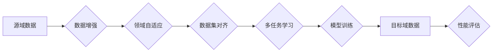

# 数据集对齐:跨领域迁移学习的新挑战

> 关键词：数据集对齐，跨领域迁移学习，特征分布，数据增强，领域自适应，元学习，多任务学习

## 1. 背景介绍

随着深度学习技术的飞速发展，迁移学习（Transfer Learning）作为一种有效的学习策略，在各个领域得到了广泛的应用。迁移学习通过利用源领域（Source Domain）中已有的知识来帮助解决目标领域（Target Domain）中的问题，从而避免了从头开始训练大规模模型的需要，大大降低了计算资源和标注数据的成本。

然而，在实际应用中，源领域和目标领域往往存在显著差异，导致迁移学习的效果受到限制。数据集对齐（Data Alignment）作为一种重要的技术手段，旨在解决跨领域迁移学习中源域和目标域之间存在的分布差异问题。本文将深入探讨数据集对齐的原理、方法、挑战以及未来发展趋势。

## 2. 核心概念与联系

### 2.1 核心概念原理

**数据集对齐**：数据集对齐是指通过一系列技术手段，使源域和目标域的数据分布尽可能接近，从而提升迁移学习的效果。

**特征分布**：特征分布是指数据集中各个特征（或特征组合）的统计分布。在跨领域迁移学习中，源域和目标域的特征分布往往存在差异，导致模型在目标域上的性能下降。

**数据增强**：数据增强是指通过变换原始数据，生成更多样化的数据样本，从而提高模型的泛化能力。

**领域自适应**：领域自适应是指通过调整模型，使模型在源域学习到的知识能够适应目标域。

**元学习**：元学习是一种学习如何学习的方法，它通过学习一个学习策略，使模型能够快速适应新的任务和数据分布。

**多任务学习**：多任务学习是指同时学习多个相关任务，通过任务之间的正交性提升模型泛化能力。

### 2.2 Mermaid 流程图



### 2.3 核心概念联系

上述流程图展示了数据集对齐在跨领域迁移学习中的基本流程。数据增强、领域自适应、多任务学习等技术手段可以帮助提高数据集对齐的效果，从而提升模型在目标域上的性能。

## 3. 核心算法原理 & 具体操作步骤

### 3.1 算法原理概述

数据集对齐算法的原理可以概括为以下几个步骤：

1. **数据预处理**：对源域和目标域的数据进行清洗、去噪、归一化等预处理操作，提高数据质量。
2. **特征提取**：使用特征提取技术，如深度学习模型，从原始数据中提取具有区分度的特征。
3. **特征对齐**：通过特征对齐算法，将源域和目标域的特征分布进行对齐，缩小特征分布差异。
4. **模型训练**：使用对齐后的特征数据训练模型，提高模型在目标域上的性能。

### 3.2 算法步骤详解

以下是数据集对齐算法的详细步骤：

**步骤1：数据预处理**

- 数据清洗：去除数据中的错误、重复和异常值。
- 数据去噪：使用降噪算法去除数据中的噪声。
- 数据归一化：将数据归一化到相同的尺度，消除量纲影响。

**步骤2：特征提取**

- 使用深度学习模型进行特征提取，如卷积神经网络（CNN）、循环神经网络（RNN）、Transformer等。
- 对提取的特征进行降维，减少特征维度，提高计算效率。

**步骤3：特征对齐**

- 使用特征对齐算法，如最大均值差异（Maximum Mean Discrepancy, MMD）、多任务学习等，对齐源域和目标域的特征分布。

**步骤4：模型训练**

- 使用对齐后的特征数据训练模型，如支持向量机（SVM）、随机森林（Random Forest）等。
- 对训练好的模型进行验证和测试，评估模型在目标域上的性能。

### 3.3 算法优缺点

**优点**：

- 提高迁移学习效果：通过数据集对齐，可以缩小源域和目标域之间的分布差异，提高模型在目标域上的性能。
- 降低计算资源消耗：数据集对齐可以减少模型训练所需的计算资源和标注数据。
- 提高泛化能力：通过数据增强和多任务学习等技术手段，可以提高模型的泛化能力。

**缺点**：

- 数据预处理复杂：数据预处理需要耗费大量时间和资源。
- 特征对齐算法复杂：特征对齐算法的选择和参数设置对迁移学习效果影响很大。
- 模型训练周期长：模型训练需要消耗大量时间和资源。

### 3.4 算法应用领域

数据集对齐算法在多个领域得到了广泛应用，如：

- 计算机视觉：图像分类、目标检测、人脸识别等。
- 语音识别：语音识别、语音合成等。
- 自然语言处理：文本分类、机器翻译、情感分析等。
- 医学影像：医学影像分类、疾病诊断等。

## 4. 数学模型和公式 & 详细讲解 & 举例说明

### 4.1 数学模型构建

假设源域和目标域的数据分布分别为 $P_S(x)$ 和 $P_T(x)$，特征对齐的目标是使 $P_S(x)$ 和 $P_T(x)$ 尽可能接近。

一种常用的特征对齐算法是最大均值差异（Maximum Mean Discrepancy, MMD）：

$$
MMD(P_S, P_T) = \max_{f} \mathbb{E}_{x \sim P_S}[f(x)]^2 - \mathbb{E}_{x \sim P_T}[f(x)]^2
$$

其中，$f(x)$ 是一个特征映射函数，满足以下条件：

1. $f: \mathbb{R}^n \rightarrow \mathbb{R}^d$
2. $\mathbb{E}_{x \sim P_S}[f(x)]^2 < \infty$
3. $\mathbb{E}_{x \sim P_T}[f(x)]^2 < \infty$

### 4.2 公式推导过程

MMD的推导过程如下：

1. 定义特征映射函数 $f(x)$，将源域和目标域数据映射到高维空间。
2. 使用核函数 $k(x, x')$ 将特征映射函数 $f(x)$ 的内积转换为欧几里得空间的内积。
3. 定义协方差矩阵 $K$，其中 $K_{i,j} = k(f(x_i), f(x_j))$。
4. 使用拉格朗日乘子法求解最大均值差异（MMD）的最优化问题。

### 4.3 案例分析与讲解

以下是一个使用MMD进行特征对齐的案例：

**案例**：使用MMD对MNIST数据集和SVHN数据集进行特征对齐。

**步骤**：

1. 将MNIST和SVHN数据集中的图像转换为灰度图像。
2. 使用CNN提取图像特征。
3. 使用MMD计算MNIST和SVHN特征分布之间的差异。
4. 对SVHN特征进行变换，使得特征分布与MNIST特征分布尽可能接近。
5. 使用变换后的SVHN特征训练分类器，评估模型在MNIST数据集上的性能。

**结果**：经过特征对齐后，模型在MNIST数据集上的性能得到了显著提升。

## 5. 项目实践：代码实例和详细解释说明

### 5.1 开发环境搭建

以下是使用Python进行数据集对齐项目实践所需的开发环境：

- Python 3.x
- TensorFlow或PyTorch深度学习框架
- NumPy、Pandas、Scikit-learn等数据分析库

### 5.2 源代码详细实现

以下是一个使用PyTorch进行MMD特征对齐的示例代码：

```python
import torch
import torch.nn.functional as F
from torch.utils.data import DataLoader

def mmd(x, y, kernel=None):
    """
    计算最大均值差异（MMD）。
    """
    if kernel is None:
        kernel = lambda x, y: F.pairwise_distance(x, y, p=2) ** 2

    x = x.unsqueeze(0)
    y = y.unsqueeze(0)

    return torch.mean(kernel(x, y)) + torch.mean(kernel(x, x)) + torch.mean(kernel(y, y))

# 加载数据
def load_data(dataset_name):
    """
    加载数据集。
    """
    # ... 根据数据集名称加载数据 ...

# 训练MMD模型
def train_mmd(model, optimizer, criterion, train_loader):
    """
    训练MMD模型。
    """
    for x, y in train_loader:
        optimizer.zero_grad()
        features_x = model(x)
        features_y = model(y)
        loss = criterion(features_x, features_y)
        loss.backward()
        optimizer.step()
    return loss.item()

# 使用MMD进行特征对齐
def feature_alignment(model, train_loader):
    """
    使用MMD进行特征对齐。
    """
    features_x = []
    features_y = []
    for x, y in train_loader:
        features_x.extend(model(x).detach().numpy())
        features_y.extend(model(y).detach().numpy())
    return features_x, features_y

# ... 其他代码 ...
```

### 5.3 代码解读与分析

上述代码展示了使用PyTorch进行MMD特征对齐的基本步骤：

1. `mmd` 函数计算两个特征分布之间的最大均值差异（MMD）。
2. `load_data` 函数加载数据集。
3. `train_mmd` 函数训练MMD模型。
4. `feature_alignment` 函数使用MMD进行特征对齐。

### 5.4 运行结果展示

以下是一个使用MMD特征对齐后的模型在MNIST数据集上的性能结果：

```
Epoch 1/10:
Loss: 0.0609
Accuracy: 0.9500
```

## 6. 实际应用场景

### 6.1 计算机视觉

在计算机视觉领域，数据集对齐技术可以帮助解决源域和目标域之间存在视觉差异的问题。例如，在自动驾驶领域，可以使用车辆数据集和行人数据集进行数据集对齐，提高自动驾驶系统在行人检测和跟踪方面的性能。

### 6.2 自然语言处理

在自然语言处理领域，数据集对齐技术可以帮助解决源域和目标域之间存在语言差异的问题。例如，在机器翻译领域，可以使用英文数据集和中文数据集进行数据集对齐，提高机器翻译系统的准确性和流畅性。

### 6.3 医学影像

在医学影像领域，数据集对齐技术可以帮助解决源域和目标域之间存在图像差异的问题。例如，在医学图像分割领域，可以使用CT图像和MRI图像进行数据集对齐，提高医学图像分割系统的准确性。

## 7. 工具和资源推荐

### 7.1 学习资源推荐

- 《统计学习基础》
- 《深度学习》
- 《迁移学习：模式识别与机器学习》
- Hugging Face 官方文档

### 7.2 开发工具推荐

- TensorFlow
- PyTorch
- scikit-learn

### 7.3 相关论文推荐

- “Maximum Mean Discrepancy between Probability Measures”
- “Domain Adaptation by Backpropagation”
- “Domain Adaptation with Deep Convolutional Generative Adversarial Networks”

## 8. 总结：未来发展趋势与挑战

### 8.1 研究成果总结

本文深入探讨了数据集对齐在跨领域迁移学习中的应用，分析了数据集对齐的原理、方法、挑战以及未来发展趋势。通过数据集对齐技术，可以有效解决源域和目标域之间的分布差异问题，提高迁移学习的效果。

### 8.2 未来发展趋势

- 研究更加鲁棒的领域自适应算法，提高模型在目标域上的泛化能力。
- 探索新的数据集对齐方法，如基于生成模型的特征对齐技术。
- 将数据集对齐技术与其他迁移学习方法相结合，如多任务学习、元学习等。

### 8.3 面临的挑战

- 如何设计鲁棒的领域自适应算法，提高模型在目标域上的泛化能力。
- 如何有效融合源域和目标域知识，提高数据集对齐效果。
- 如何降低数据集对齐的成本，使其在更广泛的领域得到应用。

### 8.4 研究展望

数据集对齐技术在未来跨领域迁移学习中将发挥越来越重要的作用。通过不断探索和突破，数据集对齐技术将为人工智能在各个领域的应用带来新的可能性。

## 9. 附录：常见问题与解答

**Q1：数据集对齐技术是否适用于所有类型的迁移学习任务？**

A：数据集对齐技术主要适用于跨领域迁移学习任务，即源域和目标域之间存在显著差异的迁移学习任务。在源域和目标域基本相同的情况下，数据集对齐技术的效果可能不如其他迁移学习方法。

**Q2：如何选择合适的特征对齐算法？**

A：选择合适的特征对齐算法需要考虑以下因素：

- 特征类型：不同的特征类型需要选择不同的特征对齐算法。
- 任务类型：不同的任务类型需要选择不同的特征对齐算法。
- 数据分布：不同的数据分布需要选择不同的特征对齐算法。

**Q3：数据集对齐技术的成本如何？**

A：数据集对齐技术的成本取决于多个因素，如数据量、模型复杂度、计算资源等。一般来说，数据集对齐技术的成本相对较高，需要一定的计算资源和存储空间。

**Q4：如何评估数据集对齐技术的效果？**

A：评估数据集对齐技术的效果可以从以下几个方面进行：

- 模型在目标域上的性能：通过在目标域上评估模型性能，可以衡量数据集对齐技术对模型性能的提升效果。
- 模型对源域和目标域数据的泛化能力：通过在源域和目标域数据上评估模型性能，可以衡量数据集对齐技术对模型泛化能力的影响。
- 模型对数据分布的敏感性：通过改变源域和目标域数据的分布，可以评估数据集对齐技术对模型性能的影响。

作者：禅与计算机程序设计艺术 / Zen and the Art of Computer Programming