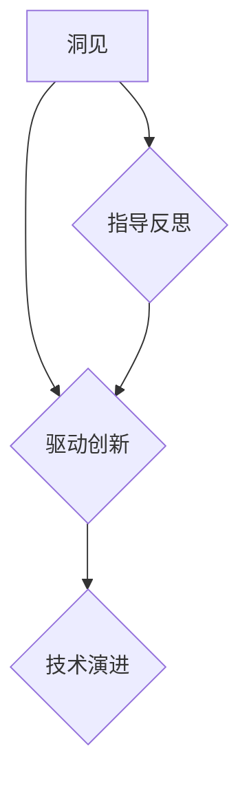

# 洞见的力量：从反思到创新

> 关键词：洞见，反思，创新，技术演进，人工智能，设计思维，敏捷开发，知识管理

## 1. 背景介绍

在快速发展的技术时代，我们面临着前所未有的机遇和挑战。技术的日新月异，不仅改变了我们的生活方式，也深刻地影响了企业、组织和个人的发展。在这个充满变革的时代，如何把握趋势，从反思中汲取智慧，激发创新的火花，成为每个技术工作者必须面对的问题。

### 1.1 技术演进的浪潮

从蒸汽机的发明到互联网的普及，技术一直在不断地演进。如今，人工智能、大数据、云计算等新兴技术正推动着第四次工业革命的到来。在这个浪潮中，技术工作者需要具备敏锐的洞察力，才能把握趋势，引领创新。

### 1.2 反思的重要性

反思是技术工作者不可或缺的品质。通过反思，我们可以总结经验教训，发现问题的根源，从而在未来的工作中避免重复犯错。同时，反思还能激发我们的创造力，引导我们从不同的角度思考问题，找到创新的解决方案。

### 1.3 创新的驱动力

创新是技术发展的动力。只有不断创新，才能推动技术向前发展，满足不断变化的需求。然而，创新并非易事，它需要我们有深刻的洞见，以及敢于突破现状的勇气。

## 2. 核心概念与联系

### 2.1 洞见

洞见是指对事物本质的深刻理解，它能够帮助我们洞察事物的发展趋势，发现潜在的机会和挑战。在技术领域，洞见可以帮助我们把握技术发展方向，引领创新。

### 2.2 反思

反思是对过去经验和教训的回顾和总结。它可以帮助我们发现问题，寻找改进的方向。在技术工作中，反思可以帮助我们优化流程，提升效率，避免重复犯错。

### 2.3 创新

创新是创造新事物、新方法、新思想的过程。它需要我们具备跨领域的知识、敏锐的洞见和敢于尝试的勇气。

### 2.4 Mermaid 流程图

以下是基于洞见、反思和创新的Mermaid流程图：



在这个流程图中，洞见既是创新的驱动力，也是反思的指导。通过洞见，我们可以驱动创新，推动技术演进；同时，反思又可以帮助我们更好地理解洞见，从而形成更深刻的洞见。

## 3. 核心算法原理 & 具体操作步骤

### 3.1 算法原理概述

本节将探讨如何通过设计思维和敏捷开发等方法，从反思中汲取智慧，激发创新。

### 3.2 算法步骤详解

#### 3.2.1 设计思维

设计思维是一种以用户为中心的创新方法。它强调关注用户需求，通过迭代和原型设计，不断优化产品或服务。

#### 3.2.2 敏捷开发

敏捷开发是一种以人为核心、迭代、循序渐进的开发方法。它强调快速迭代、持续交付和团队协作。

### 3.3 算法优缺点

#### 3.3.1 优点

- 提高创新效率
- 降低开发风险
- 提升用户体验
- 促进团队协作

#### 3.3.2 缺点

- 需要持续迭代和优化
- 可能受到团队文化和经验的限制

### 3.4 算法应用领域

设计思维和敏捷开发可以应用于以下领域：

- 产品设计
- 项目管理
- 企业创新
- 教育培训

## 4. 数学模型和公式 & 详细讲解 & 举例说明

### 4.1 数学模型构建

在本节中，我们将使用数学模型来描述设计思维和敏捷开发的过程。

#### 4.1.1 设计思维的数学模型

假设设计思维过程可以表示为以下数学模型：

$$
P = f(I, U, E)
$$

其中，$P$ 代表产品设计，$I$ 代表用户需求，$U$ 代表用户体验，$E$ 代表设计团队。

#### 4.1.2 敏捷开发的数学模型

敏捷开发过程可以表示为以下数学模型：

$$
P = f(T, M, C)
$$

其中，$P$ 代表项目进度，$T$ 代表团队协作，$M$ 代表敏捷方法，$C$ 代表客户反馈。

### 4.2 公式推导过程

#### 4.2.1 设计思维公式推导

设计思维公式 $P = f(I, U, E)$ 的推导过程如下：

- $P$ 代表产品设计，是设计思维的目标。
- $I$ 代表用户需求，是设计思维的基础。
- $U$ 代表用户体验，是设计思维的核心。
- $E$ 代表设计团队，是设计思维的实施者。

设计思维的过程就是通过理解用户需求、优化用户体验，并充分发挥设计团队的能力，最终实现产品设计的目标。

#### 4.2.2 敏捷开发公式推导

敏捷开发公式 $P = f(T, M, C)$ 的推导过程如下：

- $P$ 代表项目进度，是敏捷开发的目标。
- $T$ 代表团队协作，是敏捷开发的基础。
- $M$ 代表敏捷方法，是敏捷开发的核心。
- $C$ 代表客户反馈，是敏捷开发的实施者。

敏捷开发的过程就是通过加强团队协作、应用敏捷方法，并收集客户反馈，最终实现项目进度的目标。

### 4.3 案例分析与讲解

以下我们将以一款移动应用的设计为例，分析设计思维和敏捷开发的应用。

#### 4.3.1 设计思维案例分析

1. **理解用户需求**：通过市场调研和用户访谈，了解用户对移动应用的需求。
2. **优化用户体验**：根据用户需求，设计应用界面和交互流程，提升用户体验。
3. **发挥设计团队能力**：组织设计团队进行原型设计和迭代优化。

#### 4.3.2 敏捷开发案例分析

1. **团队协作**：组建跨职能团队，确保团队成员之间的沟通和协作。
2. **敏捷方法**：采用敏捷开发方法，如Scrum或Kanban，进行项目管理和迭代开发。
3. **客户反馈**：定期收集客户反馈，根据反馈调整开发方向。

通过以上案例，我们可以看到设计思维和敏捷开发在实际应用中的价值。

## 5. 项目实践：代码实例和详细解释说明

### 5.1 开发环境搭建

在本节中，我们将以一个简单的Web应用为例，演示如何运用设计思维和敏捷开发进行项目实践。

#### 5.1.1 设计思维

1. **理解用户需求**：通过问卷调查和用户访谈，了解用户对Web应用的需求。
2. **优化用户体验**：设计用户友好的界面和交互流程。
3. **发挥设计团队能力**：组织设计团队进行原型设计和迭代优化。

#### 5.1.2 敏捷开发

1. **团队协作**：组建跨职能团队，包括前端开发、后端开发、产品经理等。
2. **敏捷方法**：采用Scrum方法，进行项目管理和迭代开发。
3. **客户反馈**：定期收集客户反馈，根据反馈调整开发方向。

### 5.2 源代码详细实现

以下是一个简单的Web应用示例代码：

```html
<!DOCTYPE html>
<html>
<head>
    <title>我的Web应用</title>
</head>
<body>
    <h1>欢迎来到我的Web应用</h1>
    <p>这里是我们提供的各种功能：</p>
    <ul>
        <li>新闻资讯</li>
        <li>天气预报</li>
        <li>在线购物</li>
    </ul>
</body>
</html>
```

### 5.3 代码解读与分析

以上代码是一个简单的HTML页面，展示了Web应用的基本结构和功能。通过这个示例，我们可以看到设计思维和敏捷开发在项目实践中的应用。

### 5.4 运行结果展示

将以上代码保存为`index.html`文件，并在浏览器中打开，即可看到运行结果。

## 6. 实际应用场景

### 6.1 产品设计

设计思维和敏捷开发在产品设计中的应用非常广泛。例如，在设计一款移动应用时，我们可以通过设计思维了解用户需求，通过敏捷开发快速迭代优化产品功能。

### 6.2 项目管理

敏捷开发方法在项目管理中具有重要作用。例如，在项目管理中，我们可以采用Scrum方法进行项目规划和迭代开发，确保项目进度和质量。

### 6.3 企业创新

设计思维和敏捷开发可以帮助企业进行创新。例如，企业可以通过设计思维发现新的市场机会，通过敏捷开发快速推出创新产品。

## 7. 工具和资源推荐

### 7.1 学习资源推荐

- 《设计思维》：介绍设计思维的基本原理和应用方法。
- 《敏捷开发实战》：介绍敏捷开发的方法和实践。
- 《禅与计算机程序设计艺术》：介绍计算机程序设计的哲学和艺术。

### 7.2 开发工具推荐

- Sketch：用于设计原型和界面的工具。
- Jira：用于项目管理工具。
- Git：用于版本控制。

### 7.3 相关论文推荐

- "Design Thinking for Technical Teams"：介绍设计思维在技术团队中的应用。
- "Agile Software Development: Principles, Patterns, and Practices"：介绍敏捷开发的方法和实践。

## 8. 总结：未来发展趋势与挑战

### 8.1 研究成果总结

本文探讨了从反思到创新的过程，介绍了洞见、反思和创新的核心理念，并分析了设计思维和敏捷开发在项目实践中的应用。通过本文的介绍，相信读者能够更好地理解如何从反思中汲取智慧，激发创新的火花。

### 8.2 未来发展趋势

未来，设计思维和敏捷开发将在更多领域得到应用。随着技术的不断发展，我们将更加注重用户体验，更加关注团队的协作，更加注重产品的迭代优化。

### 8.3 面临的挑战

设计思维和敏捷开发在应用过程中也面临着一些挑战，如团队文化、组织结构、项目管理等方面。未来，我们需要不断探索和改进，以应对这些挑战。

### 8.4 研究展望

未来，我们将从以下几个方面进行深入研究：

- 设计思维和敏捷开发在不同领域的应用研究。
- 设计思维和敏捷开发的跨文化研究。
- 设计思维和敏捷开发的实证研究。

通过不断的研究和实践，我们将更好地把握从反思到创新的过程，推动技术发展的进步。

## 9. 附录：常见问题与解答

**Q1：设计思维和敏捷开发有什么区别？**

A1：设计思维是一种以用户为中心的创新方法，强调关注用户需求，通过迭代和原型设计，不断优化产品或服务。敏捷开发是一种以人为核心、迭代、循序渐进的开发方法，强调快速迭代、持续交付和团队协作。

**Q2：如何将设计思维和敏捷开发应用于实际项目？**

A2：将设计思维和敏捷开发应用于实际项目，需要以下步骤：

1. 理解用户需求：通过市场调研和用户访谈，了解用户需求。
2. 设计原型：根据用户需求，设计产品原型。
3. 迭代优化：根据用户反馈，不断迭代优化产品。
4. 快速迭代：采用敏捷开发方法，快速迭代产品。

**Q3：设计思维和敏捷开发对团队有什么要求？**

A3：设计思维和敏捷开发对团队有以下要求：

- 团队成员具备跨领域的知识和技能。
- 团队成员具备良好的沟通和协作能力。
- 团队成员具备持续学习和适应变化的能力。

**Q4：设计思维和敏捷开发在项目中的地位是什么？**

A4：设计思维和敏捷开发是项目管理的两种重要方法，它们可以帮助项目团队更好地理解用户需求，提高产品质量，缩短项目周期。

**Q5：设计思维和敏捷开发有哪些局限性？**

A5：设计思维和敏捷开发在应用过程中也存在一些局限性，如：

- 需要团队成员具备较高的素质和能力。
- 需要改变传统的项目管理模式。
- 需要持续学习和适应变化。

作者：禅与计算机程序设计艺术 / Zen and the Art of Computer Programming