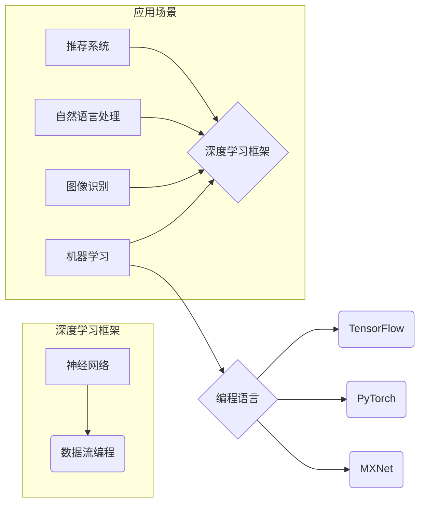

# 深度学习框架原理与代码实战案例讲解

> 关键词：深度学习框架，TensorFlow，PyTorch，Keras，MXNet，神经网络，机器学习，编程实战

## 1. 背景介绍

深度学习作为人工智能领域的核心技术之一，近年来取得了显著的进展。随着计算能力的提升和数据量的爆炸式增长，深度学习在图像识别、自然语言处理、推荐系统等领域取得了突破性成果。为了方便研究者开发和应用深度学习算法，一系列深度学习框架应运而生。本文将深入探讨深度学习框架的原理，并通过代码实战案例讲解如何使用这些框架实现机器学习任务。

## 2. 核心概念与联系

### 2.1 核心概念

- **神经网络**：深度学习的基础，由多个神经元组成，通过前向传播和反向传播进行数据学习和特征提取。
- **深度学习框架**：提供神经网络搭建、训练和推理的软件平台，如TensorFlow、PyTorch等。
- **编程范式**：深度学习框架通常采用数据流编程范式，通过构建计算图来描述神经网络结构。

### 2.2 架构图



## 3. 核心算法原理 & 具体操作步骤

### 3.1 算法原理概述

深度学习框架的核心是神经网络，主要包括以下步骤：

1. **数据预处理**：对输入数据进行清洗、归一化等处理，以便于模型学习。
2. **神经网络搭建**：根据任务需求，搭建合适的神经网络结构，包括输入层、隐藏层和输出层。
3. **模型训练**：使用训练数据对模型进行训练，不断优化模型参数。
4. **模型评估**：使用测试数据评估模型性能，调整模型参数以提升性能。
5. **模型推理**：使用训练好的模型对新的数据进行预测。

### 3.2 算法步骤详解

1. **数据预处理**：
    - 数据清洗：去除无效、异常数据，提高数据质量。
    - 数据归一化：将数据标准化到某个范围内，如[-1, 1]或[0, 1]。
    - 数据增强：通过旋转、缩放、翻转等方式增加数据多样性。

2. **神经网络搭建**：
    - 选择合适的网络结构，如全连接网络、卷积神经网络等。
    - 添加层：根据任务需求添加输入层、隐藏层和输出层。
    - 配置参数：设置学习率、批大小、优化器等参数。

3. **模型训练**：
    - 选择损失函数：如均方误差、交叉熵等。
    - 选择优化器：如梯度下降、Adam等。
    - 训练过程：迭代更新模型参数，最小化损失函数。

4. **模型评估**：
    - 评估指标：如准确率、召回率、F1分数等。
    - 交叉验证：使用交叉验证技术评估模型性能。

5. **模型推理**：
    - 加载训练好的模型。
    - 对新数据进行预处理。
    - 使用模型进行预测。

### 3.3 算法优缺点

**优点**：

- **通用性**：适用于各种机器学习任务，如分类、回归、聚类等。
- **易用性**：提供丰富的API和工具，方便快速搭建和训练模型。
- **性能优异**：在众多数据集上取得了SOTA性能。

**缺点**：

- **计算量大**：训练过程需要大量的计算资源。
- **参数调优复杂**：需要根据任务特点进行参数调整。
- **可解释性差**：模型的决策过程难以解释。

### 3.4 算法应用领域

深度学习框架在以下领域得到广泛应用：

- **图像识别**：如人脸识别、物体检测、图像分割等。
- **自然语言处理**：如机器翻译、文本分类、情感分析等。
- **语音识别**：如语音转文本、语音识别等。
- **推荐系统**：如商品推荐、电影推荐等。
- **自动驾驶**：如车道线检测、障碍物检测等。

## 4. 数学模型和公式 & 详细讲解 & 举例说明

### 4.1 数学模型构建

深度学习框架通常使用以下数学模型：

- **损失函数**：衡量模型预测值与真实值之间的差异，如均方误差、交叉熵等。
- **激活函数**：用于引入非线性关系，如ReLU、Sigmoid等。
- **优化器**：用于更新模型参数，如梯度下降、Adam等。

### 4.2 公式推导过程

以下以均方误差损失函数为例，介绍公式推导过程：

$$
\text{MSE} = \frac{1}{n}\sum_{i=1}^{n}(y_i - \hat{y}_i)^2
$$

其中，$y_i$ 为真实值，$\hat{y}_i$ 为模型预测值，$n$ 为样本数量。

### 4.3 案例分析与讲解

以下使用PyTorch实现一个简单的线性回归模型，并进行训练和预测。

```python
import torch
import torch.nn as nn
import torch.optim as optim

# 定义线性回归模型
class LinearRegression(nn.Module):
    def __init__(self, input_size, output_size):
        super(LinearRegression, self).__init__()
        self.linear = nn.Linear(input_size, output_size)

    def forward(self, x):
        out = self.linear(x)
        return out

# 创建模型实例
model = LinearRegression(1, 1)

# 创建损失函数和优化器
criterion = nn.MSELoss()
optimizer = optim.SGD(model.parameters(), lr=0.01)

# 创建训练数据
x_train = torch.tensor([[1], [2], [3], [4], [5]], dtype=torch.float)
y_train = torch.tensor([[2], [4], [6], [8], [10]], dtype=torch.float)

# 训练模型
for epoch in range(100):
    optimizer.zero_grad()
    outputs = model(x_train)
    loss = criterion(outputs, y_train)
    loss.backward()
    optimizer.step()

    if (epoch + 1) % 10 == 0:
        print(f"Epoch {epoch+1}, Loss: {loss.item()}")

# 预测
x_test = torch.tensor([[6]], dtype=torch.float)
output = model(x_test)
print(f"Test output: {output.item()}")
```

## 5. 项目实践：代码实例和详细解释说明

### 5.1 开发环境搭建

1. 安装Anaconda：从官网下载并安装Anaconda，用于创建独立的Python环境。
2. 创建并激活虚拟环境：
```bash
conda create -n deep_learning_env python=3.8
conda activate deep_learning_env
```
3. 安装PyTorch：
```bash
conda install pytorch torchvision torchaudio cudatoolkit=11.3 -c pytorch
```

### 5.2 源代码详细实现

以下使用PyTorch实现一个简单的卷积神经网络，用于图像分类。

```python
import torch
import torch.nn as nn
import torch.optim as optim

# 定义卷积神经网络
class ConvNet(nn.Module):
    def __init__(self):
        super(ConvNet, self).__init__()
        self.conv1 = nn.Conv2d(1, 6, 3)
        self.conv2 = nn.Conv2d(6, 16, 3)
        self.fc1 = nn.Linear(16 * 6 * 6, 120)
        self.fc2 = nn.Linear(120, 84)
        self.fc3 = nn.Linear(84, 10)

    def forward(self, x):
        x = nn.functional.relu(self.conv1(x))
        x = nn.functional.max_pool2d(x, 2)
        x = nn.functional.relu(self.conv2(x))
        x = nn.functional.max_pool2d(x, 2)
        x = x.view(-1, self.num_flat_features(x))
        x = nn.functional.relu(self.fc1(x))
        x = nn.functional.relu(self.fc2(x))
        x = self.fc3(x)
        return x

    def num_flat_features(self, x):
        size = x.size()[1:]  # 除批量维度外的所有维度
        num_features = 1
        for s in size:
            num_features *= s
        return num_features

# 创建模型实例
model = ConvNet()

# 创建损失函数和优化器
criterion = nn.CrossEntropyLoss()
optimizer = optim.SGD(model.parameters(), lr=0.001, momentum=0.9)

# 加载数据集
train_dataset = torchvision.datasets.MNIST(root='./data', train=True, transform=transforms.ToTensor(), download=True)
train_loader = torch.utils.data.DataLoader(dataset=train_dataset, batch_size=64, shuffle=True)

# 训练模型
for epoch in range(10):
    running_loss = 0.0
    for i, data in enumerate(train_loader, 0):
        inputs, labels = data
        optimizer.zero_grad()
        outputs = model(inputs)
        loss = criterion(outputs, labels)
        loss.backward()
        optimizer.step()
        running_loss += loss.item()
        if i % 100 == 99:
            print(f'[{epoch + 1}, {i + 1}] loss: {running_loss / 100:.3f}')
            running_loss = 0.0

# 保存模型
torch.save(model.state_dict(), 'convnet.pth')

# 加载测试数据集
test_dataset = torchvision.datasets.MNIST(root='./data', train=False, transform=transforms.ToTensor())
test_loader = torch.utils.data.DataLoader(dataset=test_dataset, batch_size=64, shuffle=True)

# 测试模型
correct = 0
total = 0
with torch.no_grad():
    for data in test_loader:
        images, labels = data
        outputs = model(images)
        _, predicted = torch.max(outputs.data, 1)
        total += labels.size(0)
        correct += (predicted == labels).sum().item()

print(f'Accuracy of the network on the 10000 test images: {100 * correct // total} %')
```

### 5.3 代码解读与分析

1. **定义卷积神经网络**：使用PyTorch的nn.Module创建一个卷积神经网络，包括两个卷积层、三个全连接层和ReLU激活函数。
2. **前向传播**：通过卷积层、池化层和全连接层进行前向传播，得到模型的输出。
3. **损失函数和优化器**：使用交叉熵损失函数和SGD优化器进行模型训练。
4. **数据加载**：加载MNIST手写数字数据集进行训练和测试。
5. **模型训练**：迭代更新模型参数，最小化损失函数。
6. **模型测试**：在测试数据集上评估模型性能。

通过以上代码，我们可以使用PyTorch实现一个简单的卷积神经网络，并进行训练和测试。

## 6. 实际应用场景

### 6.1 图像识别

深度学习框架在图像识别领域取得了巨大成功，如ImageNet竞赛。常见的图像识别任务包括：

- **物体检测**：检测图像中的物体及其位置，如YOLO、SSD等。
- **图像分类**：将图像分类到不同的类别，如ResNet、Inception等。
- **图像分割**：将图像分割成不同的区域，如U-Net、Mask R-CNN等。

### 6.2 自然语言处理

深度学习框架在自然语言处理领域也得到了广泛应用，如：

- **文本分类**：将文本分类到不同的类别，如TextCNN、Bert等。
- **机器翻译**：将一种语言的文本翻译成另一种语言，如Seq2Seq、Transformer等。
- **情感分析**：分析文本的情感倾向，如LSTM、GRU等。

### 6.3 语音识别

深度学习框架在语音识别领域也取得了显著成果，如：

- **声学模型**：用于提取语音信号的特征，如DNN、CNN等。
- **语言模型**：用于预测下一个词或句子，如LSTM、GRU等。
- **端到端语音识别**：将声学模型和语言模型结合，实现端到端的语音识别。

## 7. 工具和资源推荐

### 7.1 学习资源推荐

- **书籍**：
    - 《深度学习》（Ian Goodfellow、Yoshua Bengio、Aaron Courville著）
    - 《动手学深度学习》（Acerini、Gullapalli、Dong著）
- **在线课程**：
    - Coursera《深度学习》
    - Udacity《深度学习工程师纳米学位》
    - fast.ai《深度学习课程》
- **开源项目**：
    - TensorFlow
    - PyTorch
    - Keras
    - MXNet

### 7.2 开发工具推荐

- **编程语言**：Python
- **深度学习框架**：TensorFlow、PyTorch、Keras、MXNet
- **集成开发环境**：Jupyter Notebook、PyCharm、VS Code
- **数据可视化**：Matplotlib、Seaborn、Plotly

### 7.3 相关论文推荐

- **深度学习基础**：
    - “A Few Useful Things to Know about Machine Learning”（Geoffrey Hinton等）
    - “ImageNet Classification with Deep Convolutional Neural Networks”（Alex Krizhevsky等）
- **神经网络**：
    - “Sequence to Sequence Learning with Neural Networks”（Ilya Sutskever等）
    - “Attention is All You Need”（Ashish Vaswani等）
- **深度学习框架**：
    - “TensorFlow: Large-Scale Machine Learning on Heterogeneous Systems”（Martín Abadi等）
    - “PyTorch: An Imperative Deep Learning Library”（Adam Paszke等）

## 8. 总结：未来发展趋势与挑战

### 8.1 研究成果总结

本文深入探讨了深度学习框架的原理，并通过代码实战案例讲解了如何使用这些框架实现机器学习任务。文章涵盖了神经网络、深度学习框架、编程范式、数学模型、应用场景等多个方面，为读者提供了全面的技术知识。

### 8.2 未来发展趋势

1. **模型压缩**：减少模型尺寸和计算量，提高模型在移动设备和嵌入式系统上的部署能力。
2. **自动化机器学习**：利用自动化技术简化模型训练和调参过程，提高开发效率。
3. **可解释性**：提高模型的可解释性，使模型决策过程更加透明。
4. **跨模态学习**：将文本、图像、语音等多种模态信息进行融合，提高模型对现实世界的理解能力。

### 8.3 面临的挑战

1. **计算资源**：深度学习模型的训练需要大量的计算资源，如何高效利用计算资源是亟待解决的问题。
2. **数据标注**：高质量标注数据是模型训练的重要前提，如何高效获取标注数据是当前面临的挑战。
3. **模型可解释性**：提高模型的可解释性，使模型决策过程更加透明，是当前研究的重点。
4. **数据安全与隐私**：深度学习模型的训练和应用涉及大量个人数据，如何保护数据安全与隐私是亟待解决的问题。

### 8.4 研究展望

未来，深度学习框架将继续发展，为机器学习领域带来更多突破性成果。同时，深度学习技术也将与其他人工智能技术（如强化学习、知识表示等）进行融合，为构建更加智能、高效、安全的系统提供有力支持。

## 9. 附录：常见问题与解答

**Q1：什么是深度学习框架？**

A：深度学习框架是一种用于构建、训练和推理神经网络的软件平台，如TensorFlow、PyTorch等。

**Q2：如何选择合适的深度学习框架？**

A：选择深度学习框架时，需要考虑以下因素：

- **易用性**：框架的易用性和学习曲线。
- **社区支持**：框架的社区活跃度和文档质量。
- **性能**：框架的运行效率和性能。
- **生态系统**：框架的生态系统和可扩展性。

**Q3：深度学习框架在哪些领域得到广泛应用？**

A：深度学习框架在图像识别、自然语言处理、语音识别、推荐系统、自动驾驶等领域得到广泛应用。

**Q4：如何提高深度学习模型的可解释性？**

A：提高深度学习模型的可解释性，可以采用以下方法：

- **可视化**：将模型结构和特征可视化。
- **注意力机制**：引入注意力机制，突出模型关注的特征。
- **解释性模型**：构建可解释性模型，解释模型决策过程。

**Q5：如何解决深度学习中的过拟合问题？**

A：解决深度学习中的过拟合问题，可以采用以下方法：

- **数据增强**：通过旋转、缩放、翻转等方式扩充数据集。
- **正则化**：使用L2正则化、Dropout等方法。
- **早停法**：在验证集上观察模型性能，当性能不再提升时停止训练。

---

作者：禅与计算机程序设计艺术 / Zen and the Art of Computer Programming