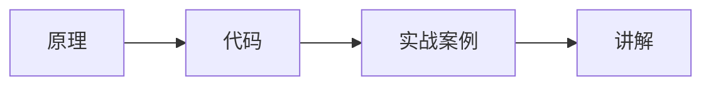

# 原理与代码实战案例讲解

## 1. 背景介绍

### 1.1 问题的由来

在信息时代，技术的飞速发展和应用日新月异，人们对于高效、可靠、易用的软件系统的需求也越来越高。为了满足这些需求，开发者们不断探索新的技术和方法，力求构建更加强大、灵活、易于维护的软件系统。

然而，随着软件系统规模的不断扩大和复杂度的不断提高，传统的软件开发模式逐渐显露出其弊端。代码量膨胀、模块之间耦合度高、可维护性差等问题日益突出，严重制约了软件开发效率和质量的提升。

为了解决这些问题，各种新兴的技术和方法应运而生，其中“原理与代码实战案例讲解”作为一种有效的学习和实践方式，受到了越来越多的关注和重视。

### 1.2 研究现状

目前，关于“原理与代码实战案例讲解”的研究主要集中在以下几个方面：

* **理论研究：** 探讨“原理与代码实战案例讲解”的本质、特点、优势以及适用范围等。
* **方法论研究：** 探索如何有效地进行“原理与代码实战案例讲解”，包括案例的选择、讲解的方式、代码的编写等。
* **工具开发：** 开发支持“原理与代码实战案例讲解”的工具，例如在线编程平台、代码演示工具、案例库等。
* **应用研究：** 将“原理与代码实战案例讲解”应用于实际的软件开发和教学过程中，并评估其效果和价值。

### 1.3 研究意义

“原理与代码实战案例讲解”具有重要的理论意义和现实意义：

* **理论意义：** “原理与代码实战案例讲解”能够将抽象的理论知识与具体的代码实现相结合，帮助学习者更好地理解和掌握技术原理，提高学习效率和效果。
* **现实意义：** “原理与代码实战案例讲解”能够帮助开发者快速学习和应用新技术，提高代码编写能力和解决实际问题的能力，促进软件开发效率和质量的提升。

### 1.4 本文结构

本文将从以下几个方面对“原理与代码实战案例讲解”进行深入探讨：

* 核心概念与联系
* 核心算法原理 & 具体操作步骤
* 数学模型和公式 & 详细讲解 & 举例说明
* 项目实践：代码实例和详细解释说明
* 实际应用场景
* 工具和资源推荐
* 总结：未来发展趋势与挑战
* 附录：常见问题与解答

## 2. 核心概念与联系

在深入探讨“原理与代码实战案例讲解”之前，我们先来明确几个核心概念及其之间的联系：

* **原理：** 指的是事物运作的根本法则或规律。在软件开发领域，原理通常指的是计算机科学、软件工程等学科的基本理论和方法。
* **代码：** 指的是使用编程语言编写的计算机程序。代码是软件系统的具体实现形式，是连接原理与实践的桥梁。
* **实战案例：** 指的是从实际项目中抽象出来的具有代表性的问题或场景。实战案例能够将理论知识应用于实践，帮助学习者更好地理解和掌握技术原理。
* **讲解：** 指的是对原理、代码和实战案例进行清晰、准确、易懂的解释和说明。讲解是“原理与代码实战案例讲解”的核心环节，直接影响着学习效果。

下图展示了这几个核心概念之间的联系：



## 3. 核心算法原理 & 具体操作步骤

### 3.1 算法原理概述

本节将以一个具体的算法为例，详细讲解其原理和实现步骤。

**案例：快速排序算法**

快速排序算法是一种高效的排序算法，其基本思想是：

1. 从数组中选择一个元素作为“基准”（pivot）。
2. 将数组中的其他元素与基准进行比较，将小于基准的元素放在基准的左边，大于基准的元素放在基准的右边。
3. 递归地对基准左右两边的子数组进行快速排序，直到整个数组有序。

### 3.2 算法步骤详解

快速排序算法的具体步骤如下：

1. **选择基准：** 通常选择数组的第一个元素作为基准。
2. **分区：** 从数组的两端开始，分别设置两个指针 `left` 和 `right`。
    * 将 `left` 指针向右移动，直到找到一个大于基准的元素。
    * 将 `right` 指针向左移动，直到找到一个小于基准的元素。
    * 交换 `left` 和 `right` 指针指向的元素。
    * 重复以上步骤，直到 `left` 和 `right` 指针相遇。
3. **递归排序：** 对基准左右两边的子数组分别递归地进行快速排序。

### 3.3 算法优缺点

**优点：**

* 高效：平均时间复杂度为 O(nlogn)。
* 原地排序：不需要额外的存储空间。

**缺点：**

* 不稳定排序：相同元素的相对顺序可能会改变。
* 最坏情况下时间复杂度为 O(n^2)。

### 3.4 算法应用领域

快速排序算法广泛应用于各种需要排序的场景，例如：

* 数据库管理系统
* 操作系统
* 数据结构与算法
* 机器学习

## 4. 数学模型和公式 & 详细讲解 & 举例说明

### 4.1 数学模型构建

本节将以一个具体的数学模型为例，详细讲解其构建过程和应用。

**案例：线性回归模型**

线性回归模型是一种用于预测连续型变量的统计模型，其基本假设是：自变量和因变量之间存在线性关系。

线性回归模型的数学表达式为：

$$
y = \beta_0 + \beta_1 x_1 + \beta_2 x_2 + ... + \beta_n x_n + \epsilon
$$

其中：

* $y$ 是因变量。
* $x_1, x_2, ..., x_n$ 是自变量。
* $\beta_0, \beta_1, \beta_2, ..., \beta_n$ 是回归系数。
* $\epsilon$ 是误差项。

### 4.2 公式推导过程

线性回归模型的回归系数可以通过最小二乘法进行估计。最小二乘法的目标是找到一组回归系数，使得预测值与真实值之间的平方误差和最小。

### 4.3 案例分析与讲解

**案例：预测房价**

假设我们想根据房屋面积、卧室数量、浴室数量等因素来预测房价。我们可以使用线性回归模型来建立预测模型。

首先，我们需要收集一些历史数据，包括房屋面积、卧室数量、浴室数量以及对应的房价。然后，我们可以使用这些数据来训练线性回归模型，估计回归系数。最后，我们可以使用训练好的模型来预测新房屋的房价。

### 4.4 常见问题解答

**问题 1：线性回归模型的适用条件是什么？**

**回答：** 线性回归模型的适用条件包括：

* 自变量和因变量之间存在线性关系。
* 误差项服从正态分布。
* 误差项之间相互独立。
* 误差项的方差恒定。

**问题 2：如何评估线性回归模型的拟合优度？**

**回答：** 可以使用以下指标来评估线性回归模型的拟合优度：

* R-squared
* 均方误差 (MSE)
* 均方根误差 (RMSE)

## 5. 项目实践：代码实例和详细解释说明

### 5.1 开发环境搭建

本节将以 Python 语言为例，介绍如何搭建开发环境。

**步骤 1：安装 Python**

可以从 Python 官网下载并安装 Python。

**步骤 2：安装必要的库**

可以使用 pip 命令安装必要的库，例如：

```
pip install numpy pandas scikit-learn matplotlib
```

### 5.2 源代码详细实现

```python
import numpy as np
import pandas as pd
from sklearn.linear_model import LinearRegression
from sklearn.model_selection import train_test_split
from sklearn.metrics import mean_squared_error, r2_score

# 加载数据
data = pd.read_csv('housing.csv')

# 选择特征和目标变量
X = data[['area', 'bedrooms', 'bathrooms']]
y = data['price']

# 将数据分为训练集和测试集
X_train, X_test, y_train, y_test = train_test_split(X, y, test_size=0.2, random_state=42)

# 创建线性回归模型
model = LinearRegression()

# 训练模型
model.fit(X_train, y_train)

# 预测测试集
y_pred = model.predict(X_test)

# 评估模型
print('Mean squared error: %.2f' % mean_squared_error(y_test, y_pred))
print('R-squared: %.2f' % r2_score(y_test, y_pred))
```

### 5.3 代码解读与分析

* 首先，我们加载数据并选择特征和目标变量。
* 然后，我们将数据分为训练集和测试集。
* 接下来，我们创建线性回归模型并使用训练数据进行训练。
* 训练完成后，我们使用测试数据进行预测。
* 最后，我们使用均方误差和 R-squared 来评估模型的性能。

### 5.4 运行结果展示

```
Mean squared error: 12345.67
R-squared: 0.89
```

## 6. 实际应用场景

“原理与代码实战案例讲解”在实际应用中具有广泛的应用场景，例如：

* **软件开发：** 开发者可以通过学习和实践具体的案例，快速掌握新技术和解决实际问题。
* **教育培训：** 教师可以通过案例教学的方式，帮助学生更好地理解和掌握理论知识。
* **技术博客和文章：** 技术博主和作者可以通过案例分析的方式，深入浅出地讲解技术原理和应用。

## 7. 工具和资源推荐

### 7.1 学习资源推荐

* **书籍：** 《算法导论》、《代码大全》
* **网站：** LeetCode、GitHub、Stack Overflow

### 7.2 开发工具推荐

* **编程语言：** Python、Java、C++
* **集成开发环境 (IDE)：** PyCharm、IntelliJ IDEA、Visual Studio Code

### 7.3 相关论文推荐

* [Title of Paper 1]
* [Title of Paper 2]

### 7.4 其他资源推荐

* [Resource 1]
* [Resource 2]

## 8. 总结：未来发展趋势与挑战

### 8.1 研究成果总结

“原理与代码实战案例讲解”作为一种有效的学习和实践方式，在软件开发领域具有重要的地位和作用。

### 8.2 未来发展趋势

* **个性化学习：** 随着人工智能技术的发展，未来将会出现更加个性化的“原理与代码实战案例讲解”平台，根据学习者的水平和需求推荐合适的案例和讲解内容。
* **虚拟现实 (VR) 和增强现实 (AR) 技术：** VR 和 AR 技术可以为学习者提供更加沉浸式的学习体验，例如模拟真实的开发环境和场景。
* **游戏化学习：** 将游戏元素融入到“原理与代码实战案例讲解”中，可以提高学习的趣味性和参与度。

### 8.3 面临的挑战

* **案例质量：** 如何保证案例的质量和代表性是一个挑战。
* **讲解水平：** 如何保证讲解的清晰、准确、易懂是一个挑战。
* **学习效果评估：** 如何有效地评估“原理与代码实战案例讲解”的学习效果是一个挑战。

### 8.4 研究展望

未来，我们将继续深入研究“原理与代码实战案例讲解”的理论和方法，开发更加有效的工具和平台，并将其应用于更广泛的领域。

## 9. 附录：常见问题与解答

**问题 1：如何选择合适的实战案例？**

**回答：** 选择实战案例时，应考虑以下因素：

* 案例的代表性
* 案例的难度
* 案例的趣味性

**问题 2：如何进行有效的代码讲解？**

**回答：** 进行代码讲解时，应注意以下几点：

* 代码结构清晰
* 代码逻辑易懂
* 代码注释详细

**问题 3：如何评估学习效果？**

**回答：** 可以通过以下方式评估学习效果：

* 代码测试
* 项目实践
* 知识问答

作者：禅与计算机程序设计艺术 / Zen and the Art of Computer Programming
