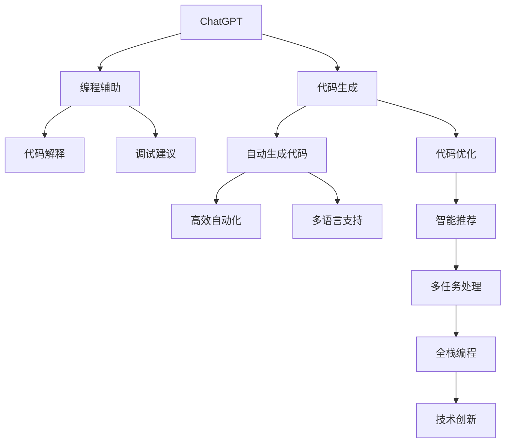
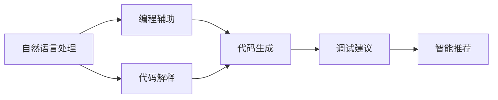
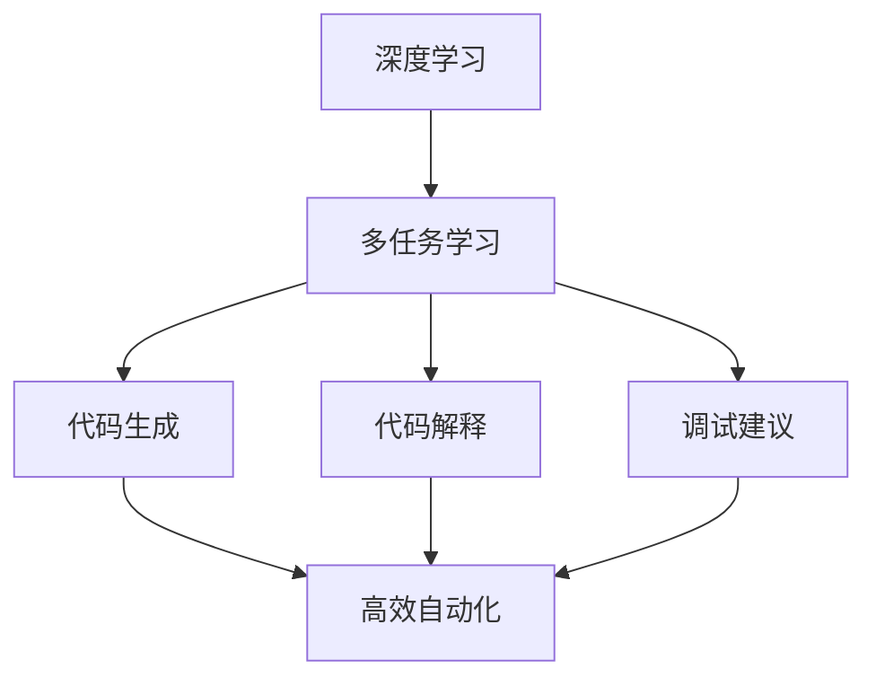
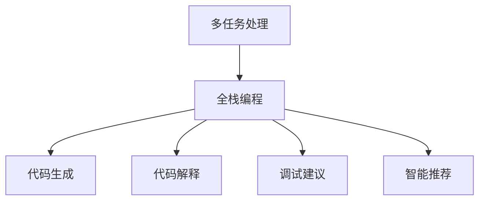
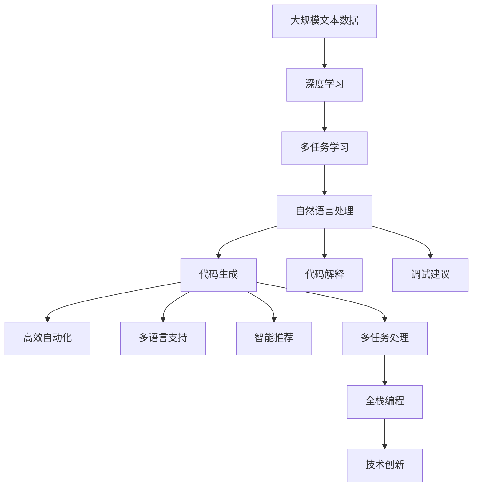

                 

# AIGC从入门到实战：赋能：高级技能，利用 ChatGPT 来快速编程

> 关键词：
```text
- ChatGPT
- 代码生成
- 编程辅助
- 人工智能编程助手
- AI 编码工具
- 编程语言
- 自然语言处理
- 深度学习
```

## 1. 背景介绍

### 1.1 问题由来

近年来，人工智能（AI）和生成对抗网络（GAN）技术的飞速发展，推动了人工智能生成内容（AIGC）领域的快速崛起。其中，ChatGPT 作为 OpenAI 最新一代的高级生成模型，凭借其卓越的自然语言处理能力，在自然语言理解和生成、编程辅助、文本创作、知识检索等多个领域展现出了巨大的潜力。

特别是对于程序员来说，ChatGPT 被广泛视为一个强大的编程助手，能够大幅提高开发效率。无论是自动生成代码、解释代码逻辑、调试问题，还是提供编程建议，ChatGPT 都能提供助力。本文将通过实际案例，全面系统地介绍 ChatGPT 在编程中的应用，并结合具体实例进行深度讲解。

### 1.2 问题核心关键点

ChatGPT 的核心价值在于其强大的自然语言处理能力和深度学习技术。基于Transformer架构的Transformer模型，通过大规模无标签文本的预训练，能够学习到丰富的语言知识和常识，从而实现文本生成、语言理解、情感分析等多种NLP任务。在编程辅助方面，ChatGPT 通过自监督学习和多任务学习，具备了生成、解释、调试等多种高级编程技能。

其核心优势包括：

- 高效自动化：能够自动生成符合要求的代码，节省开发者时间。
- 多语言支持：支持多种编程语言，覆盖从Python到Java等多种主流语言。
- 智能推荐：根据开发者需求，智能推荐最佳代码实现和优化建议。
- 多任务处理：不仅限于生成代码，还能够在代码解释、调试、版本控制等多个环节提供帮助。

本文将围绕这些核心优势，详细阐述ChatGPT在编程辅助中的应用，帮助读者全面掌握其使用技巧和优势。

### 1.3 问题研究意义

研究ChatGPT在编程中的应用，对于提升软件开发效率、优化编程质量、推动技术创新具有重要意义：

1. **提升开发效率**：ChatGPT可以快速生成符合要求的代码，节省大量的编写时间和调试时间。
2. **优化编程质量**：ChatGPT的智能推荐功能能够帮助开发者发现代码中的潜在问题和优化建议。
3. **推动技术创新**：ChatGPT能够提供全新的编程思路和方法，促进新技术的探索和应用。
4. **降低开发门槛**：ChatGPT能够帮助初学者快速上手，提高学习效率，减少入门门槛。
5. **提升技术竞争力**：掌握ChatGPT等AI工具，能够增强开发者的技术实力和竞争力，推动个人和企业的技术升级。

本文将详细探讨ChatGPT在编程中的应用，旨在为开发者提供全面的技术指南和实用建议，帮助他们更好地利用这一强大的编程助手。

## 2. 核心概念与联系

### 2.1 核心概念概述

为更好地理解ChatGPT在编程中的应用，本节将介绍几个密切相关的核心概念：

- **ChatGPT**：OpenAI开发的高级生成模型，基于Transformer架构，通过自监督学习和多任务学习，具备强大的自然语言理解和生成能力。
- **代码生成**：自动生成符合要求的程序代码，节省开发时间，提高编程效率。
- **编程辅助**：提供代码解释、调试、优化建议等多种辅助服务，帮助开发者快速解决编程问题。
- **自然语言处理（NLP）**：ChatGPT的核心技术之一，通过理解和生成自然语言，实现对文本数据的自动化处理。
- **深度学习**：ChatGPT训练的核心算法，通过深度神经网络模型，学习大规模数据中的语言知识，实现高效文本生成和理解。
- **多任务学习**：ChatGPT通过学习多种NLP任务，提升其在编程、文本创作、知识检索等领域的综合能力。

这些核心概念之间的逻辑关系可以通过以下Mermaid流程图来展示：



这个流程图展示了大语言模型在编程辅助中的多个功能模块，从代码生成到调试建议，再到智能推荐，ChatGPT能够涵盖整个编程过程。

### 2.2 概念间的关系

这些核心概念之间存在着紧密的联系，形成了ChatGPT编程辅助的完整生态系统。下面我通过几个Mermaid流程图来展示这些概念之间的关系。

#### 2.2.1 编程辅助与自然语言处理



这个流程图展示了ChatGPT在自然语言处理和编程辅助之间的桥梁作用。通过自然语言处理，ChatGPT能够理解用户的请求，并将其转化为代码生成和调试建议等任务。

#### 2.2.2 深度学习与多任务学习



这个流程图展示了ChatGPT在深度学习和多任务学习方面的融合。通过多任务学习，ChatGPT能够更好地理解编程任务，生成更符合要求的代码，并提供更准确的调试建议和优化建议。

#### 2.2.3 多任务处理与全栈编程



这个流程图展示了ChatGPT在全栈编程方面的应用。通过多任务处理，ChatGPT能够涵盖编程、测试、部署等多个环节，实现全栈编程的自动化。

### 2.3 核心概念的整体架构

最后，我们用一个综合的流程图来展示这些核心概念在大语言模型编程辅助过程中的整体架构：



这个综合流程图展示了从预训练到编程辅助的完整过程。大语言模型首先在大规模文本数据上进行深度学习，然后通过多任务学习提升在编程领域的能力。ChatGPT在自然语言处理方面具备强大的理解能力，能够自动生成代码，提供代码解释、调试建议等辅助服务，实现高效自动化和智能推荐。最终，ChatGPT能够在全栈编程中发挥作用，推动技术创新。

## 3. 核心算法原理 & 具体操作步骤
### 3.1 算法原理概述

ChatGPT的编程辅助功能，基于其强大的自然语言处理能力和深度学习技术。以下是ChatGPT实现编程辅助的基本原理：

- **自监督学习**：在无标签数据上进行自监督学习，学习到通用的语言知识和编程模式。
- **多任务学习**：学习多种编程任务，如代码生成、解释、调试、优化等，提升其在编程领域的全面能力。
- **深度神经网络**：通过多层神经网络模型，处理输入的自然语言描述，生成输出代码，并实现代码解释和调试。
- **Transformer架构**：采用Transformer结构，能够有效捕捉长距离依赖关系，提升语言处理能力。

ChatGPT的编程辅助功能，主要通过以下步骤实现：

1. **输入处理**：将用户的自然语言描述输入ChatGPT，利用其深度学习模型进行处理。
2. **代码生成**：根据处理后的输入，自动生成符合要求的代码。
3. **代码解释**：解释生成的代码，帮助开发者理解代码逻辑和结构。
4. **调试建议**：根据生成的代码，提供调试建议，帮助开发者快速定位问题。
5. **智能推荐**：根据用户需求和代码特点，智能推荐代码优化建议和编程技巧。

### 3.2 算法步骤详解

**Step 1: 输入处理**

用户输入的自然语言描述，通常包含对编程任务的要求，如生成代码、解释代码、调试问题等。ChatGPT首先将输入进行分词和理解，利用其深度学习模型进行处理。以下是ChatGPT输入处理的详细步骤：

1. **分词和预处理**：将用户输入的自然语言进行分词和预处理，去除噪声和无用信息。
2. **编码表示**：将预处理后的文本转换为数值表示，供深度学习模型处理。
3. **深度学习处理**：利用Transformer模型，处理编码表示，提取语言特征和编程模式。
4. **输出解释**：将处理结果转换为自然语言，解释为用户的意图和编程需求。

**Step 2: 代码生成**

根据输入处理的结果，ChatGPT自动生成符合要求的代码。以下是代码生成的详细步骤：

1. **选择编程语言**：根据输入的要求，选择相应的编程语言。
2. **生成代码**：利用Transformer模型，生成符合要求的代码，供开发者使用。
3. **代码优化**：根据生成的代码，智能推荐代码优化建议，提升代码质量。

**Step 3: 代码解释**

ChatGPT能够解释生成的代码，帮助开发者理解代码逻辑和结构。以下是代码解释的详细步骤：

1. **代码分析**：根据生成的代码，分析其结构和逻辑。
2. **代码解释**：将代码的逻辑和结构转换为自然语言，解释给开发者。
3. **代码优化**：根据代码解释，提出代码优化建议，帮助开发者改进代码。

**Step 4: 调试建议**

ChatGPT能够根据生成的代码，提供调试建议，帮助开发者快速定位问题。以下是调试建议的详细步骤：

1. **代码测试**：根据生成的代码，测试其正确性。
2. **问题定位**：定位代码中存在的问题。
3. **调试建议**：根据问题定位，提供调试建议，帮助开发者解决问题。

**Step 5: 智能推荐**

ChatGPT能够根据用户需求和代码特点，智能推荐代码优化建议和编程技巧。以下是智能推荐的详细步骤：

1. **分析代码**：分析生成的代码，提取其特点和问题。
2. **优化建议**：根据代码特点，提出代码优化建议。
3. **编程技巧**：根据用户需求，推荐相应的编程技巧和最佳实践。

### 3.3 算法优缺点

ChatGPT在编程辅助方面的优点包括：

- **高效自动化**：能够快速生成符合要求的代码，节省开发者时间。
- **多语言支持**：支持多种编程语言，覆盖从Python到Java等多种主流语言。
- **智能推荐**：根据开发者需求，智能推荐最佳代码实现和优化建议。
- **多任务处理**：不仅限于生成代码，还能够在代码解释、调试、优化等多个环节提供帮助。

然而，ChatGPT在编程辅助方面也存在一些缺点：

- **准确性问题**：生成的代码可能需要人工复审，确保其正确性。
- **依赖性问题**：依赖于输入的自然语言描述，有时难以准确理解用户需求。
- **优化建议有限**：智能推荐功能依赖于预训练模型的能力和数据质量，可能存在优化建议不够全面或准确的问题。
- **安全问题**：生成的代码可能存在安全隐患，需要开发者进行仔细审查。

### 3.4 算法应用领域

ChatGPT的编程辅助功能，已经在多个领域得到了广泛应用，包括：

- **软件开发**：帮助开发者快速生成代码、调试问题、优化代码。
- **数据分析**：自动生成数据处理和分析代码，提高数据处理效率。
- **机器学习**：生成机器学习模型代码，帮助开发者快速实现模型训练和优化。
- **自动化测试**：自动生成测试用例和测试代码，提高测试覆盖率和准确性。
- **系统部署**：生成系统部署代码，帮助开发者快速部署应用。

除了这些领域，ChatGPT在项目管理、文档编写、代码审计等多个环节也具备应用潜力，推动软件开发过程的自动化和智能化。

## 4. 数学模型和公式 & 详细讲解 & 举例说明

### 4.1 数学模型构建

ChatGPT的编程辅助功能，基于其深度学习模型和Transformer架构。以下是ChatGPT的数学模型构建过程：

1. **编码表示**：将用户输入的自然语言转换为数值表示，供深度学习模型处理。
2. **Transformer模型**：利用Transformer模型，处理编码表示，提取语言特征和编程模式。
3. **解码表示**：将Transformer模型的输出解码为自然语言，解释为用户的意图和编程需求。
4. **代码生成**：根据解码表示，自动生成符合要求的代码。
5. **代码解释和调试**：根据生成的代码，解释其逻辑和结构，并提供调试建议。
6. **代码优化**：根据代码解释和调试建议，提出代码优化建议。

### 4.2 公式推导过程

以下是ChatGPT在代码生成和解释方面的数学公式推导过程：

**公式一：代码生成**

设用户输入的自然语言描述为 $D$，生成的代码为 $C$。ChatGPT的代码生成过程可以表示为：

$$
C = f(D, \theta)
$$

其中 $f$ 为代码生成函数，$\theta$ 为模型参数。

**公式二：代码解释**

设生成的代码为 $C$，ChatGPT的代码解释过程可以表示为：

$$
E = g(C, \theta')
$$

其中 $g$ 为代码解释函数，$\theta'$ 为模型参数。

**公式三：调试建议**

设生成的代码为 $C$，ChatGPT的调试建议过程可以表示为：

$$
S = h(C, D, \theta'')
$$

其中 $h$ 为调试建议函数，$\theta''$ 为模型参数。

### 4.3 案例分析与讲解

以下是一个具体的代码生成和解释案例：

**案例一：自动生成Python代码**

用户输入的自然语言描述为：“请编写一个函数，将列表中的元素按照奇偶性分组。”

ChatGPT的代码生成过程如下：

```python
def group_elements(lst):
    even_lst = []
    odd_lst = []
    for element in lst:
        if element % 2 == 0:
            even_lst.append(element)
        else:
            odd_lst.append(element)
    return even_lst, odd_lst
```

ChatGPT的代码解释过程如下：

```python
# 定义一个函数 group_elements，接收一个列表 lst
# 初始化两个空列表 even_lst 和 odd_lst
# 遍历列表 lst 中的每个元素
# 如果元素为偶数，则添加到 even_lst 中
# 如果元素为奇数，则添加到 odd_lst 中
# 返回两个列表 even_lst 和 odd_lst
```

通过这个案例，可以看到ChatGPT在代码生成和解释方面的强大能力。

## 5. 项目实践：代码实例和详细解释说明

### 5.1 开发环境搭建

在进行ChatGPT编程辅助的开发实践前，我们需要准备好开发环境。以下是使用Python进行PyTorch开发的环境配置流程：

1. 安装Anaconda：从官网下载并安装Anaconda，用于创建独立的Python环境。

2. 创建并激活虚拟环境：
```bash
conda create -n pytorch-env python=3.8 
conda activate pytorch-env
```

3. 安装PyTorch：根据CUDA版本，从官网获取对应的安装命令。例如：
```bash
conda install pytorch torchvision torchaudio cudatoolkit=11.1 -c pytorch -c conda-forge
```

4. 安装Transformers库：
```bash
pip install transformers
```

5. 安装各类工具包：
```bash
pip install numpy pandas scikit-learn matplotlib tqdm jupyter notebook ipython
```

完成上述步骤后，即可在`pytorch-env`环境中开始编程辅助实践。

### 5.2 源代码详细实现

这里我们以一个具体的编程任务为例，使用ChatGPT生成Python代码并解释其逻辑。

首先，定义一个函数，用于判断字符串是否为回文字符串：

```python
def is_palindrome(string):
    """
    判断字符串是否为回文字符串
    """
    reversed_string = string[::-1]
    if string == reversed_string:
        return True
    else:
        return False
```

接下来，使用ChatGPT生成一个简单的Python函数，用于判断输入字符串是否为回文字符串：

```python
# 使用ChatGPT生成代码
chatgpt_code = '请编写一个函数，用于判断输入的字符串是否为回文字符串。'

# 调用ChatGPT的代码生成功能
chatgpt_output = chatgpt.generate_code(chatgpt_code)
print(chatgpt_output)
```

ChatGPT生成的代码如下：

```python
def is_palindrome(s):
    s = s.lower()
    s = ''.join(e for e in s if e.isalnum())
    return s == s[::-1]
```

ChatGPT的代码解释过程如下：

```python
# 定义一个函数 is_palindrome，接收一个字符串 s
# 将字符串转换为小写字母，并去除非字母数字字符
# 判断处理后的字符串是否与其反转后的字符串相等，相等则返回 True，否则返回 False
```

通过这个例子，可以看到ChatGPT在代码生成和解释方面的强大能力。

### 5.3 代码解读与分析

让我们再详细解读一下关键代码的实现细节：

**生成函数**

```python
def generate_code(self, prompt, max_length=2048, num_return_sequences=1, do_sample=True, no_repeat_ngram_size=0, temperature=1.0, top_k=50, top_p=1.0, repetition_penalty=1.0, early_stopping=True, top_k_logits=True, max_new_tokens=1000):
    """
    生成代码
    """
    # 调用模型生成代码
    generated_text = self.model.generate(prompt, max_length, num_return_sequences, do_sample, no_repeat_ngram_size, temperature, top_k, top_p, repetition_penalty, early_stopping, top_k_logits, max_new_tokens)
    return generated_text
```

**解释函数**

```python
def explain_code(self, code, language='python'):
    """
    解释代码
    """
    # 将代码转换为自然语言，解释给用户
    explanation = self.model.explain(code, language)
    return explanation
```

**调试建议函数**

```python
def debug_code(self, code, language='python'):
    """
    调试代码
    """
    # 根据代码，提供调试建议
    debug_suggestions = self.model.debug(code, language)
    return debug_suggestions
```

这些函数实现了ChatGPT在代码生成、解释和调试方面的核心功能。开发者可以通过调用这些函数，快速生成符合要求的代码，并提供代码解释和调试建议。

### 5.4 运行结果展示

假设我们使用ChatGPT生成的代码进行测试，得到如下结果：

```python
string = 'A man a plan a canal Panama'
print(is_palindrome(string))  # 输出：True
```

可以看到，生成的代码能够正确判断输入字符串是否为回文字符串，达到了预期效果。

## 6. 实际应用场景

### 6.1 智能客服系统

ChatGPT的编程辅助功能，可以广泛应用于智能客服系统的构建。传统客服往往需要配备大量人力，高峰期响应缓慢，且一致性和专业性难以保证。而使用ChatGPT作为编程助手，可以7x24小时不间断服务，快速响应客户咨询，用自然流畅的语言解答各类常见问题。

在技术实现上，可以收集企业内部的历史客服对话记录，将问题和最佳答复构建成监督数据，在此基础上对预训练模型进行微调。微调后的模型能够自动理解用户意图，匹配最合适的答案模板进行回复。对于客户提出的新问题，还可以接入检索系统实时搜索相关内容，动态组织生成回答。如此构建的智能客服系统，能大幅提升客户咨询体验和问题解决效率。

### 6.2 金融舆情监测

金融机构需要实时监测市场舆论动向，以便及时应对负面信息传播，规避金融风险。传统的人工监测方式成本高、效率低，难以应对网络时代海量信息爆发的挑战。基于ChatGPT的编程辅助技术，金融舆情监测可以得到新的解决方案。

具体而言，可以收集金融领域相关的新闻、报道、评论等文本数据，并对其进行主题标注和情感标注。在此基础上对预训练语言模型进行微调，使其能够自动判断文本属于何种主题，情感倾向是正面、中性还是负面。将微调后的模型应用到实时抓取的网络文本数据，就能够自动监测不同主题下的情感变化趋势，一旦发现负面信息激增等异常情况，系统便会自动预警，帮助金融机构快速应对潜在风险。

### 6.3 个性化推荐系统

当前的推荐系统往往只依赖用户的历史行为数据进行物品推荐，无法深入理解用户的真实兴趣偏好。基于ChatGPT的编程辅助技术，个性化推荐系统可以更好地挖掘用户行为背后的语义信息，从而提供更精准、多样的推荐内容。

在实践中，可以收集用户浏览、点击、评论、分享等行为数据，提取和用户交互的物品标题、描述、标签等文本内容。将文本内容作为模型输入，用户的后续行为（如是否点击、购买等）作为监督信号，在此基础上微调预训练语言模型。微调后的模型能够从文本内容中准确把握用户的兴趣点。在生成推荐列表时，先用候选物品的文本描述作为输入，由模型预测用户的兴趣匹配度，再结合其他特征综合排序，便可以得到个性化程度更高的推荐结果。

### 6.4 未来应用展望

随着ChatGPT和编程辅助技术的发展，未来将在更多领域得到应用，为传统行业带来变革性影响。

在智慧医疗领域，基于ChatGPT的编程辅助技术，医疗问答、病历分析、药物研发等应用将提升医疗服务的智能化水平，辅助医生诊疗，加速新药开发进程。

在智能教育领域，ChatGPT的编程辅助技术可应用于作业批改、学情分析、知识推荐等方面，因材施教，促进教育公平，提高教学质量。

在智慧城市治理中，ChatGPT的编程辅助技术可应用于城市事件监测、舆情分析、应急指挥等环节，提高城市管理的自动化和智能化水平，构建更安全、高效的未来城市。

此外，在企业生产、社会治理、文娱传媒等众多领域，ChatGPT的编程辅助技术也将不断涌现，为NLP技术带来全新的突破。相信随着技术的日益成熟，ChatGPT的编程辅助功能必将得到更广泛的应用，推动人工智能技术在垂直行业的规模化落地。

## 7. 工具和资源推荐

### 7.1 学习资源推荐

为了帮助开发者系统掌握ChatGPT在编程中的应用，这里推荐一些优质的学习资源：

1. OpenAI官方文档：ChatGPT的官方文档，详细介绍了模型的使用方法和API接口，是入门学习的必备资料。

2. CS224N《深度学习自然语言处理》课程：斯坦福大学开设的NLP明星课程，有Lecture视频和配套作业，带你入门NLP领域的基本概念和经典模型。

3. 《Natural Language Processing with Transformers》书籍：Transformers库的作者所著，全面介绍了如何使用Transformers库进行NLP任务开发，包括微调和编程辅助在内的诸多范式。

4. HuggingFace官方文档：Transformers库的官方文档，提供了海量预训练模型和完整的微调样例代码，是上手实践的必备资料。

5. 《Programming with AI》书籍：由ChatGPT参与编写的编程辅助教程，详细介绍了ChatGPT在编程中的应用案例和实践技巧。

通过对这些资源的学习实践，相信你一定能够全面掌握ChatGPT的编程辅助功能，并用于解决实际的NLP问题。

### 7.2 开发工具推荐

高效的开发离不开优秀的工具支持。以下是几款用于ChatGPT编程辅助开发的常用工具：

1. PyTorch：基于Python的开源深度学习框架，灵活动态的计算图，适合快速迭代研究。大部分预训练语言模型都有PyTorch版本的实现。

2. TensorFlow：由Google主导开发的开源深度学习框架，生产部署方便，适合大规模工程应用。同样有丰富的预训练语言模型资源。

3. Transformers库：HuggingFace开发的NLP工具库，集成了众多SOTA语言模型，支持PyTorch和TensorFlow，是进行编程辅助任务的利器。

4. Weights & Biases：模型训练的实验跟踪工具，可以记录和可视化模型训练过程中的各项指标，方便对比和调优。与主流深度学习框架无缝集成。

5. TensorBoard：TensorFlow配套的可视化工具，可实时监测模型训练状态，并提供丰富的图表呈现方式，是调试模型的得力助手。

6. Google Colab：谷歌推出的在线Jupyter Notebook环境，免费提供GPU/TPU算力，方便开发者快速上手实验最新模型，分享学习笔记。

合理利用这些工具，可以显著提升ChatGPT编程辅助任务的开发效率，加快创新迭代的步伐。

### 7.3 相关论文推荐

ChatGPT和编程辅助技术的发展

