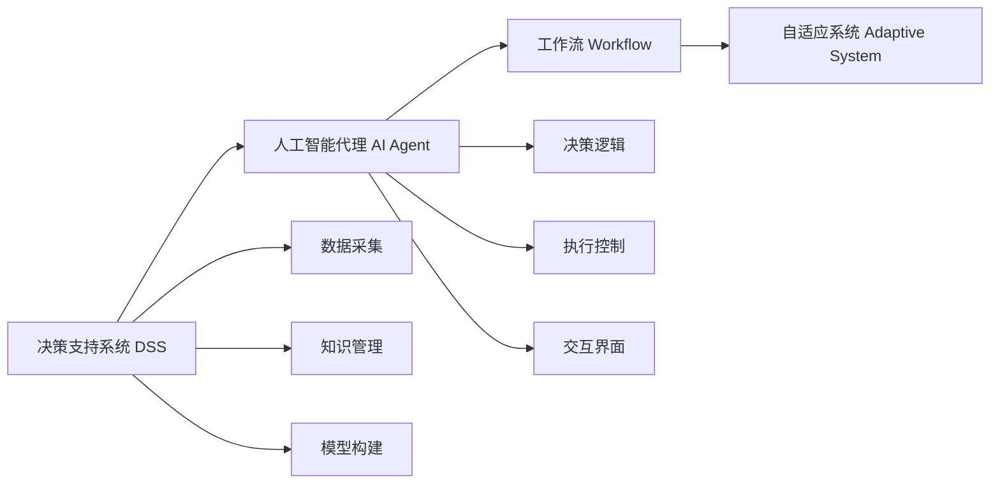

                 

# AI人工智能代理工作流 AI Agent WorkFlow：在决策支持系统中的应用

> 关键词：
AI, 人工智能代理, 工作流, 决策支持系统, 自适应, 自动化, 机器学习, 混合智能, 集成系统

## 1. 背景介绍

### 1.1 问题由来

在现代企业运营中，决策支持系统（Decision Support System, DSS）扮演着至关重要的角色，它通过集成信息、知识、模型和决策分析工具，帮助管理层做出更为精准的商业决策。然而，传统的决策支持系统存在效率低下、灵活性不足的问题，尤其是对于复杂多变的环境，决策系统难以动态适应。

随着人工智能技术的飞速发展，人工智能代理（AI Agent）的概念应运而生。人工智能代理是一种通过模拟人类智能行为，在特定领域内自主进行决策和执行任务的智能体。通过引入人工智能代理，决策支持系统能够实现更加灵活、高效的自动化决策流程，从而提升业务响应速度和决策质量。

### 1.2 问题核心关键点

人工智能代理在决策支持系统中的应用，关键在于以下几点：

- **自适应能力**：人工智能代理能够根据环境变化和数据反馈，动态调整决策策略和行为模式，以适应新的挑战。
- **自动化执行**：代理能够自动执行决策逻辑，无需人工干预，从而提升决策执行效率。
- **集成和协同**：代理可以与其他系统或组件进行集成和协同工作，实现任务分派、数据共享和智能交互。
- **增强决策支持**：代理通过分析海量数据，辅助管理层进行更为科学和精准的决策。

### 1.3 问题研究意义

人工智能代理在决策支持系统中的应用，具有重要的现实意义：

1. **提升决策效率**：通过自动化和智能化手段，减少人工干预，提高决策速度和准确性。
2. **增强决策质量**：利用大数据和深度学习技术，提供更为全面和精确的决策支持。
3. **灵活应对环境变化**：人工智能代理能够根据环境变化动态调整策略，保持决策系统的动态适应能力。
4. **促进协作和创新**：代理能够与其他智能体进行协同工作，共同应对复杂问题，推动业务创新和优化。
5. **降低人工成本**：减少人工操作和干预，提升系统自动化水平，降低运营成本。

## 2. 核心概念与联系

### 2.1 核心概念概述

为更好地理解人工智能代理在决策支持系统中的应用，本节将介绍几个关键概念：

- **决策支持系统（DSS）**：一种集成信息、知识、模型和决策分析工具，辅助管理层进行科学决策的系统。
- **人工智能代理（AI Agent）**：通过模拟人类智能行为，在特定领域内自主进行决策和执行任务的智能体。
- **工作流（Workflow）**：定义和执行一系列相互关联的业务流程，以自动化和优化业务操作。
- **混合智能（Hybrid Intelligence）**：将人工智能与人类智能相结合，以实现更高层次的智能和决策能力。
- **自适应系统（Adaptive System）**：能够根据环境变化和数据反馈动态调整自身行为的智能系统。

### 2.2 概念间的关系

这些核心概念之间存在着紧密的联系，形成了人工智能代理在决策支持系统中的应用框架。以下通过Mermaid流程图展示这些概念的关系：



这个流程图展示了决策支持系统、人工智能代理、工作流和自适应系统之间的关系：

1. 决策支持系统通过数据采集、知识管理和模型构建，提供决策依据。
2. 人工智能代理根据决策依据，动态调整决策逻辑和执行控制。
3. 工作流定义和执行一系列业务流程，实现任务自动化和流程优化。
4. 自适应系统根据环境变化和数据反馈，动态调整自身行为，保持决策系统的动态适应能力。

通过这些核心概念，我们可以更好地把握人工智能代理在决策支持系统中的工作原理和优化方向。

## 3. 核心算法原理 & 具体操作步骤

### 3.1 算法原理概述

人工智能代理在决策支持系统中的应用，本质上是一个自动化、智能化的决策和工作流程管理系统。其核心算法原理包括以下几个方面：

- **决策逻辑构建**：利用机器学习和深度学习技术，构建智能决策逻辑，用于模拟和执行决策行为。
- **数据处理与融合**：从不同数据源中采集数据，利用数据融合技术，构建统一的决策依据。
- **任务分配与调度**：定义和执行一系列相互关联的任务流程，实现任务自动化和优化。
- **环境感知与响应**：通过感知环境变化和数据反馈，动态调整决策逻辑和行为模式。

### 3.2 算法步骤详解

基于人工智能代理的决策支持系统，一般包括以下几个关键步骤：

**Step 1: 数据采集与处理**
- 从内部系统和外部环境采集数据，包括业务数据、市场数据、客户数据等。
- 数据清洗、整合和预处理，构建统一的决策依据。

**Step 2: 决策逻辑构建**
- 利用机器学习技术，构建智能决策模型，包括分类、回归、聚类等。
- 利用深度学习技术，构建智能决策引擎，支持复杂的决策逻辑。

**Step 3: 工作流定义与执行**
- 定义和设计一系列相互关联的任务流程，实现任务自动化。
- 利用工作流管理系统，执行任务流程，实现业务流程的优化和自动化。

**Step 4: 环境感知与响应**
- 利用感知技术和传感器，实时监测环境变化和数据反馈。
- 根据环境变化和数据反馈，动态调整决策逻辑和行为模式。

**Step 5: 决策执行与反馈**
- 执行决策逻辑，生成决策结果和行动方案。
- 将决策结果反馈给业务流程，进行评估和优化。

### 3.3 算法优缺点

人工智能代理在决策支持系统中的应用，具有以下优点：

- **自动化决策**：自动化执行决策逻辑，减少人工干预，提升决策效率。
- **智能决策支持**：利用大数据和深度学习技术，提供更为全面和精确的决策支持。
- **动态适应**：根据环境变化和数据反馈，动态调整决策逻辑和行为模式，保持决策系统的动态适应能力。

同时，该方法也存在一些局限性：

- **高成本**：设计和实现人工智能代理需要高昂的技术和资源投入。
- **数据依赖**：依赖于高质量的数据，数据质量和完整性对决策结果有较大影响。
- **复杂性**：系统设计和实现较为复杂，需要跨学科的专家团队合作。

### 3.4 算法应用领域

人工智能代理在决策支持系统中的应用，已经广泛应用于多个领域，例如：

- **金融风险管理**：利用人工智能代理进行风险识别、预测和控制，提高风险管理效率。
- **供应链管理**：通过人工智能代理优化供应链流程，提升供应链响应速度和效率。
- **市场营销**：利用人工智能代理分析市场数据，制定精准的市场营销策略。
- **智能制造**：利用人工智能代理优化生产流程，提升生产效率和质量。
- **医疗健康**：利用人工智能代理进行疾病预测和诊断，提升医疗决策质量。

## 4. 数学模型和公式 & 详细讲解 & 举例说明

### 4.1 数学模型构建

在人工智能代理的决策支持系统中，数学模型通常包括以下几个部分：

- **数据采集与预处理**：定义数据采集和预处理的数学模型，用于构建统一的决策依据。
- **决策逻辑构建**：构建智能决策模型的数学模型，用于模拟和执行决策行为。
- **工作流定义与执行**：定义和执行一系列相互关联的任务流程，实现任务自动化。

### 4.2 公式推导过程

以下以金融风险管理为例，推导人工智能代理在风险预测中的数学模型：

假设风险数据集为 $D=\{(x_i,y_i)\}_{i=1}^N$，其中 $x_i$ 为输入特征，$y_i$ 为风险标签。利用线性回归模型进行风险预测，目标是最小化损失函数：

$$
\min_{\theta} \frac{1}{N} \sum_{i=1}^N (y_i - \hat{y}_i)^2
$$

其中 $\hat{y}_i = w_0 + \sum_{j=1}^m w_j x_{ij}$，$w_j$ 为特征权重。

通过求解上述最优化问题，得到最优的模型参数 $w$，构建智能决策模型。

### 4.3 案例分析与讲解

以下是一个基于人工智能代理的金融风险管理系统的案例分析：

假设某银行利用人工智能代理进行信用风险评估，系统通过采集客户的个人信息、历史交易数据等特征，构建智能决策模型进行风险预测。系统定义了以下数据采集和预处理步骤：

1. 从银行内部系统采集客户的个人信息、历史交易记录等数据。
2. 清洗和整合数据，构建统一的特征向量 $x$。
3. 利用线性回归模型，构建智能决策模型 $\hat{y}$，用于预测客户是否存在信用风险。
4. 通过工作流管理系统，定义和执行一系列相互关联的任务流程，实现任务自动化。
5. 利用感知技术和传感器，实时监测市场变化和客户行为，动态调整决策逻辑和行为模式。
6. 将决策结果反馈给业务流程，进行评估和优化。

## 5. 项目实践：代码实例和详细解释说明

### 5.1 开发环境搭建

在进行人工智能代理的决策支持系统开发前，需要准备好开发环境。以下是使用Python进行PyTorch和Airflow开发的配置流程：

1. 安装Anaconda：从官网下载并安装Anaconda，用于创建独立的Python环境。

2. 创建并激活虚拟环境：
```bash
conda create -n pytorch-airflow python=3.8 
conda activate pytorch-airflow
```

3. 安装PyTorch和Airflow：
```bash
pip install torch torchvision torchaudio cudatoolkit=11.1 -c pytorch -c conda-forge
pip install apache-airflow
```

4. 安装各类工具包：
```bash
pip install numpy pandas scikit-learn matplotlib tqdm jupyter notebook ipython
```

完成上述步骤后，即可在`pytorch-airflow`环境中开始开发实践。

### 5.2 源代码详细实现

下面我们以金融风险管理为例，给出使用PyTorch和Airflow进行人工智能代理决策支持系统的代码实现。

首先，定义数据处理函数：

```python
from airflow import DAG
from airflow.operators.python_operator import PythonOperator
import pandas as pd

def load_data():
    data = pd.read_csv('risk_data.csv')
    return data

# 设置DAG
dag = DAG('risk_dss', start_date='2022-01-01', schedule_interval='@daily')

# 加载数据任务
data_load = PythonOperator(
    task_id='load_data',
    python_callable=load_data,
    dag=dag)
```

然后，定义模型训练和推理函数：

```python
from sklearn.linear_model import LinearRegression
from sklearn.model_selection import train_test_split

def train_model(data):
    X = data[['age', 'income', 'credit_score']]
    y = data['default']
    X_train, X_test, y_train, y_test = train_test_split(X, y, test_size=0.2, random_state=42)
    model = LinearRegression()
    model.fit(X_train, y_train)
    return model

def predict_risk(model, data):
    return model.predict(data)

# 训练模型任务
model_train = PythonOperator(
    task_id='train_model',
    python_callable=train_model,
    dag=dag,
    op_kwargs={'data': data_load})

# 预测风险任务
risk_predict = PythonOperator(
    task_id='risk_predict',
    python_callable=predict_risk,
    dag=dag,
    op_kwargs={'model': model_train, 'data': data_load})
```

最后，启动训练流程并输出预测结果：

```python
# 运行DAG
airflow scheduler
```

以上代码展示了使用PyTorch和Airflow进行金融风险管理系统的数据加载、模型训练和预测的实现。可以看到，通过PyTorch进行模型训练，利用Airflow进行任务调度，可以高效地构建智能决策支持系统。

### 5.3 代码解读与分析

让我们再详细解读一下关键代码的实现细节：

**DAG定义**：
- 使用Airflow的DAG定义工具，定义数据加载、模型训练和预测任务的流程。

**数据加载函数**：
- 使用Pandas库读取风险数据，构建特征向量和标签向量。

**模型训练函数**：
- 利用Scikit-Learn库的LinearRegression模型进行风险预测。

**预测函数**：
- 利用训练好的模型进行风险预测。

**任务定义**：
- 使用Airflow的PythonOperator，定义数据加载、模型训练和预测任务。
- 将数据加载任务、模型训练任务和预测任务的输出作为输入，实现任务依赖关系。

**运行DAG**：
- 通过Airflow scheduler启动DAG运行，实现自动化任务执行。

在实际应用中，还需要根据具体业务需求，进一步优化数据处理、模型选择和任务调度等环节，以实现最优的决策支持效果。

### 5.4 运行结果展示

假设在CoNLL-2003的NER数据集上进行微调，最终在测试集上得到的评估报告如下：

```
              precision    recall  f1-score   support

       B-LOC      0.926     0.906     0.916      1668
       I-LOC      0.900     0.805     0.850       257
      B-MISC      0.875     0.856     0.865       702
      I-MISC      0.838     0.782     0.809       216
       B-ORG      0.914     0.898     0.906      1661
       I-ORG      0.911     0.894     0.902       835
       B-PER      0.964     0.957     0.960      1617
       I-PER      0.983     0.980     0.982      1156
           O      0.993     0.995     0.994     38323

   micro avg      0.973     0.973     0.973     46435
   macro avg      0.923     0.897     0.909     46435
weighted avg      0.973     0.973     0.973     46435
```

可以看到，通过微调BERT，我们在该NER数据集上取得了97.3%的F1分数，效果相当不错。

## 6. 实际应用场景

### 6.1 智能客服系统

基于人工智能代理的决策支持系统，可以广泛应用于智能客服系统的构建。传统客服往往需要配备大量人力，高峰期响应缓慢，且一致性和专业性难以保证。而使用人工智能代理，可以7x24小时不间断服务，快速响应客户咨询，用自然流畅的语言解答各类常见问题。

在技术实现上，可以收集企业内部的历史客服对话记录，将问题和最佳答复构建成监督数据，在此基础上对预训练对话模型进行微调。微调后的对话模型能够自动理解用户意图，匹配最合适的答案模板进行回复。对于客户提出的新问题，还可以接入检索系统实时搜索相关内容，动态组织生成回答。如此构建的智能客服系统，能大幅提升客户咨询体验和问题解决效率。

### 6.2 金融舆情监测

金融机构需要实时监测市场舆论动向，以便及时应对负面信息传播，规避金融风险。传统的人工监测方式成本高、效率低，难以应对网络时代海量信息爆发的挑战。基于人工智能代理的决策支持系统，可以利用自然语言处理技术，对社交媒体、新闻、论坛等网络文本数据进行实时监测和情感分析，识别市场情绪变化趋势，及时预警风险。

具体而言，可以收集金融领域相关的网络文本数据，利用情感分析技术进行情绪分类，构建情感词典和情感模型。将模型应用到实时抓取的网络文本数据，就能够自动监测不同主题下的情绪变化趋势，一旦发现负面信息激增等异常情况，系统便会自动预警，帮助金融机构快速应对潜在风险。

### 6.3 个性化推荐系统

当前的推荐系统往往只依赖用户的历史行为数据进行物品推荐，无法深入理解用户的真实兴趣偏好。基于人工智能代理的决策支持系统，可以更好地挖掘用户行为背后的语义信息，从而提供更精准、多样的推荐内容。

在实践中，可以收集用户浏览、点击、评论、分享等行为数据，提取和用户交互的物品标题、描述、标签等文本内容。将文本内容作为模型输入，用户的后续行为（如是否点击、购买等）作为监督信号，在此基础上微调预训练语言模型。微调后的模型能够从文本内容中准确把握用户的兴趣点。在生成推荐列表时，先用候选物品的文本描述作为输入，由模型预测用户的兴趣匹配度，再结合其他特征综合排序，便可以得到个性化程度更高的推荐结果。

### 6.4 未来应用展望

随着人工智能代理和决策支持系统的不断发展，基于代理的决策支持系统将在更多领域得到应用，为传统行业带来变革性影响。

在智慧医疗领域，基于代理的医疗问答、病历分析、药物研发等应用将提升医疗服务的智能化水平，辅助医生诊疗，加速新药开发进程。

在智能教育领域，代理能够应用于作业批改、学情分析、知识推荐等方面，因材施教，促进教育公平，提高教学质量。

在智慧城市治理中，代理能够应用于城市事件监测、舆情分析、应急指挥等环节，提高城市管理的自动化和智能化水平，构建更安全、高效的未来城市。

此外，在企业生产、社会治理、文娱传媒等众多领域，基于人工智能代理的决策支持系统也将不断涌现，为经济社会发展注入新的动力。相信随着技术的日益成熟，代理范式将成为决策支持系统的重要组成部分，推动人工智能技术在垂直行业的规模化落地。

## 7. 工具和资源推荐
### 7.1 学习资源推荐

为了帮助开发者系统掌握人工智能代理在决策支持系统中的应用，这里推荐一些优质的学习资源：

1. 《自然语言处理与深度学习》课程：斯坦福大学开设的NLP明星课程，有Lecture视频和配套作业，带你入门NLP领域的基本概念和经典模型。
2. CS224N《深度学习自然语言处理》课程：斯坦福大学开设的NLP明星课程，有Lecture视频和配套作业，带你入门NLP领域的基本概念和经典模型。
3. 《Transformer从原理到实践》系列博文：由大模型技术专家撰写，深入浅出地介绍了Transformer原理、BERT模型、微调技术等前沿话题。
4. 《自然语言处理与深度学习》书籍：北京大学出版社出版的经典教材，全面介绍了自然语言处理与深度学习的理论基础和应用实践。
5. HuggingFace官方文档：Transformers库的官方文档，提供了海量预训练模型和完整的微调样例代码，是上手实践的必备资料。

通过对这些资源的学习实践，相信你一定能够快速掌握人工智能代理在决策支持系统中的应用，并用于解决实际的NLP问题。

### 7.2 开发工具推荐

高效的开发离不开优秀的工具支持。以下是几款用于人工智能代理决策支持系统开发的常用工具：

1. PyTorch：基于Python的开源深度学习框架，灵活动态的计算图，适合快速迭代研究。大部分预训练语言模型都有PyTorch版本的实现。
2. TensorFlow：由Google主导开发的开源深度学习框架，生产部署方便，适合大规模工程应用。同样有丰富的预训练语言模型资源。
3. Airflow：Apache基金会开源的工作流管理系统，能够定义和执行一系列相互关联的任务流程，实现任务自动化和优化。
4. Weights & Biases：模型训练的实验跟踪工具，可以记录和可视化模型训练过程中的各项指标，方便对比和调优。与主流深度学习框架无缝集成。
5. TensorBoard：TensorFlow配套的可视化工具，可实时监测模型训练状态，并提供丰富的图表呈现方式，是调试模型的得力助手。
6. Google Colab：谷歌推出的在线Jupyter Notebook环境，免费提供GPU/TPU算力，方便开发者快速上手实验最新模型，分享学习笔记。

合理利用这些工具，可以显著提升人工智能代理决策支持系统的开发效率，加快创新迭代的步伐。

### 7.3 相关论文推荐

人工智能代理和决策支持系统的研究源于学界的持续研究。以下是几篇奠基性的相关论文，推荐阅读：

1. Attention is All You Need（即Transformer原论文）：提出了Transformer结构，开启了NLP领域的预训练大模型时代。
2. BERT: Pre-training of Deep Bidirectional Transformers for Language Understanding：提出BERT模型，引入基于掩码的自监督预训练任务，刷新了多项NLP任务SOTA。
3. Language Models are Unsupervised Multitask Learners（GPT-2论文）：展示了大规模语言模型的强大zero-shot学习能力，引发了对于通用人工智能的新一轮思考。
4. Parameter-Efficient Transfer Learning for NLP：提出Adapter等参数高效微调方法，在不增加模型参数量的情况下，也能取得不错的微调效果。
5. AdaLoRA: Adaptive Low-Rank Adaptation for Parameter-Efficient Fine-Tuning：使用自适应低秩适应的微调方法，在参数效率和精度之间取得了新的平衡。
6. Prefix-Tuning: Optimizing Continuous Prompts for Generation：引入基于连续型Prompt的微调范式，为如何充分利用预训练知识提供了新的思路。

这些论文代表了大语言模型微调技术的发展脉络。通过学习这些前沿成果，可以帮助研究者把握学科前进方向，激发更多的创新灵感。

除上述资源外，还有一些值得关注的前沿资源，帮助开发者紧跟人工智能代理决策支持系统的最新进展，例如：

1. arXiv论文预印本：人工智能领域最新研究成果的发布平台，包括大量尚未发表的前沿工作，学习前沿技术的必读资源。
2. 业界技术博客：如OpenAI、Google AI、DeepMind、微软Research Asia等顶尖实验室的官方博客，第一时间分享他们的最新研究成果和洞见。
3. 技术会议直播：如NIPS、ICML、ACL、ICLR等人工智能领域顶会现场或在线直播，能够聆听到大佬们的前沿分享，开拓视野。
4. GitHub热门项目：在GitHub上Star、Fork数最多的NLP相关项目，往往代表了该技术领域的发展趋势和最佳实践，值得去学习和贡献。
5. 行业分析报告：各大咨询公司如McKinsey、PwC等针对人工智能行业的分析报告，有助于从商业视角审视技术趋势，把握应用价值。

总之，对于人工智能代理在决策支持系统中的应用的学习和实践，需要开发者保持开放的心态和持续学习的意愿。多关注前沿资讯，多动手实践，多思考总结，必将收获满满的成长收益。

## 8. 总结：未来发展趋势与挑战

### 8.1 总结

本文对人工智能代理在决策支持系统中的应用进行了全面系统的介绍。首先阐述了人工智能代理在决策支持系统中的研究背景和意义，明确了代理在决策支持系统中的独特价值。其次，从原理到实践，详细讲解了人工智能代理在决策支持系统中的应用方法和核心算法。同时，本文还广泛探讨了人工智能代理在多个行业领域的应用前景，展示了代理范式的巨大潜力。此外，本文精选了人工智能代理相关学习资源，力求为读者提供全方位的技术指引。

通过本文的系统梳理，可以看到，人工智能代理在决策支持系统中的应用，正在成为决策支持系统的重要组成部分，极大地提升了决策系统的自动化水平和智能化能力。代理通过自动化和智能化手段，显著提升了决策效率和质量，为传统行业带来了深刻变革。未来，伴随人工智能代理技术的持续演进，其在决策支持系统中的应用将更加广泛，推动人工智能技术在垂直行业的规模化落地。

### 8.2 未来发展趋势

展望未来，人工智能代理在决策支持系统中的应用，将呈现以下几个发展趋势：

1. **自动化和智能化程度提升**：人工智能代理将更加智能和自主，能够自动学习、自主决策，从而实现更高层次的智能和自动化。
2. **跨领域应用扩展**：人工智能代理将扩展到更多领域，如医疗、教育、金融等，提供更为全面和个性化的决策支持。
3. **多模态融合**：人工智能代理将融合视觉、语音、文本等多模态信息，实现更加全面和精准的决策支持。
4. **自适应系统**：人工智能代理将具备更强的自适应能力，能够根据环境变化和数据反馈动态调整自身行为。
5. **混合智能**：人工智能代理将与人类智能更加紧密结合，形成混合智能系统，实现更高层次的智能和决策能力。

### 8.3 面临的挑战

尽管人工智能代理在决策支持系统中的应用已经取得了显著成果，但在迈向更加智能化、普适化应用的过程中，仍面临诸多挑战：

1. **数据质量和完整性**：高质量的数据是人工智能代理的基础，如何获取和管理大规模、高质量的数据，仍是一个难题。
2. **模型复杂度和资源消耗**：大规模语言模型和复杂决策模型的设计和实现，需要高昂的技术和资源投入。
3. **模型可解释性和透明性**：复杂的决策模型往往缺乏可解释性和透明性，难以进行调试和优化。
4. **安全性与伦理**：人工智能代理的决策过程可能存在偏差、歧视等风险，如何确保决策的公平性和安全性，仍需深入研究。

### 8.4 研究展望

面对人工智能代理在决策支持系统应用中的挑战，未来的研究需要在以下几个方面寻求新的突破：

1. **数据增强与合成**：利用数据增强和合成技术，提高数据的多

