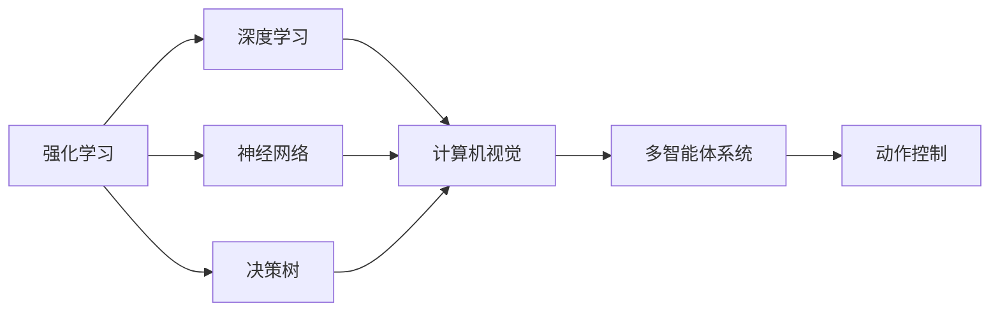
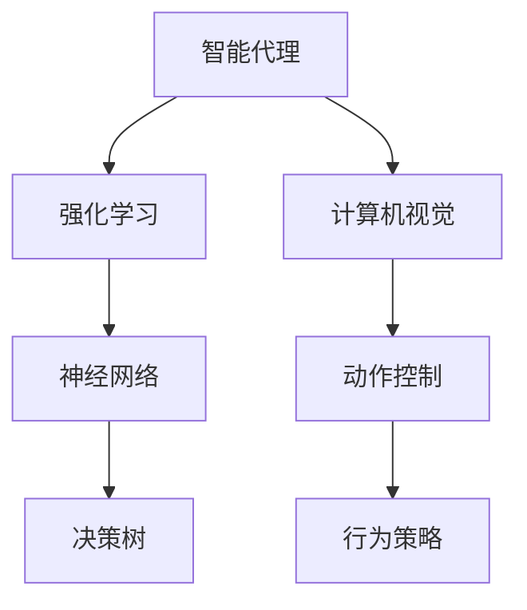
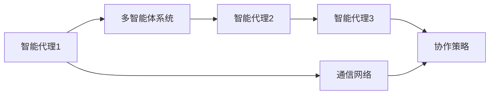
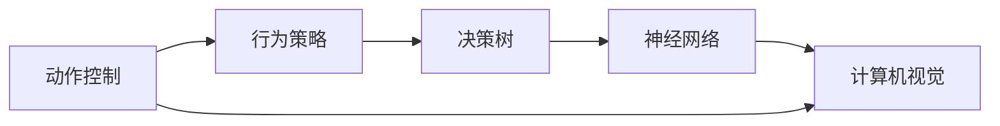
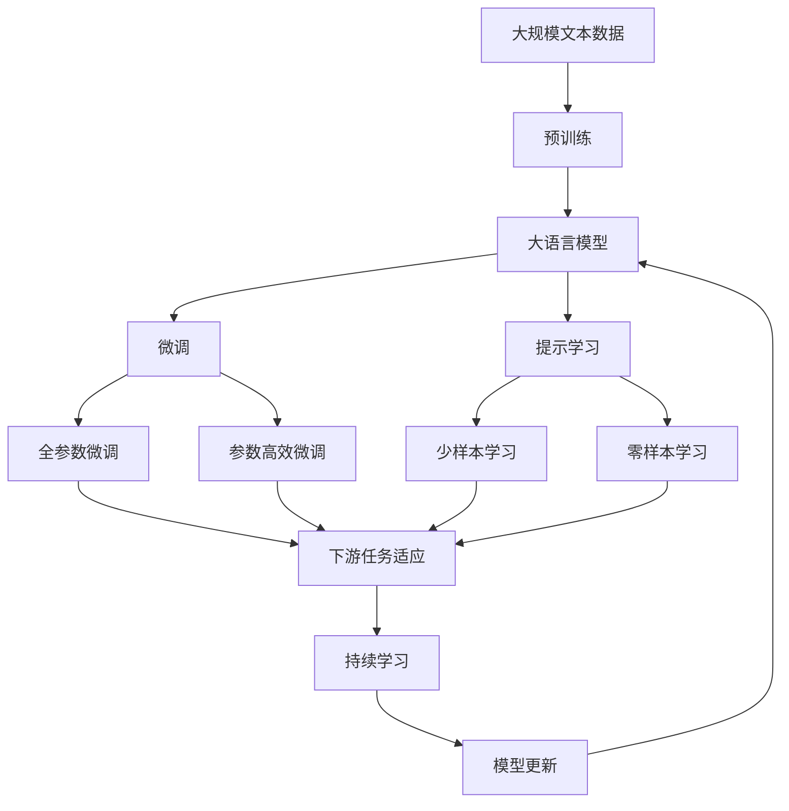

                 

# AI人工智能深度学习算法：智能深度学习代理在视频游戏场景中的应用

> 关键词：
- 智能深度学习代理
- 视频游戏场景
- 强化学习
- 深度学习
- 神经网络
- 决策树
- 多智能体系统
- 计算机视觉
- 动作控制
- 学习曲线
- 行为策略
- 游戏AI
- 游戏设计

## 1. 背景介绍

### 1.1 问题由来
人工智能(AI)技术在过去几年中取得了飞速的发展，其中智能深度学习代理在视频游戏场景中的应用尤为引人注目。这些智能代理不仅能执行复杂的决策和任务，还能通过与环境的交互，不断学习和适应新的情况，提升其智能水平。视频游戏作为一个复杂多变的动态环境，为AI深度学习提供了广阔的应用平台，同时也对算法提出了更高的要求。

### 1.2 问题核心关键点
智能深度学习代理在视频游戏场景中的应用主要围绕以下关键点展开：

- 强化学习(Reinforcement Learning, RL)：通过环境交互学习行为策略的算法。
- 深度学习(Deep Learning)：利用多层神经网络进行特征提取和决策的算法。
- 神经网络(Neural Networks)：构建深层学习模型，实现数据驱动的智能推理。
- 决策树(Decision Trees)：基于树形结构构建决策模型，用于分类和预测。
- 多智能体系统(Multi-agent System)：构建多智能体协作系统，提升整体系统性能。
- 计算机视觉(Computer Vision)：应用图像识别和处理技术，增强智能代理的环境感知能力。
- 动作控制(Motion Control)：实现智能代理在环境中的精确移动和操作。

这些关键技术共同构成了智能深度学习代理在视频游戏场景中应用的完整框架，推动了游戏AI的发展，也引领了AI研究的新方向。

### 1.3 问题研究意义
深入研究智能深度学习代理在视频游戏场景中的应用，具有重要的理论和实际意义：

1. **技术创新**：探索和优化新的深度学习和强化学习算法，推动AI技术的发展。
2. **应用拓展**：将AI技术应用于游戏开发，提升游戏智能水平和用户体验。
3. **经济影响**：促进游戏产业的创新和增长，创造新的经济价值。
4. **社会影响**：通过游戏AI技术的学习和应用，培养AI技术人才，推动AI学科的发展。

## 2. 核心概念与联系

### 2.1 核心概念概述

为更好地理解智能深度学习代理在视频游戏场景中的应用，本节将介绍几个关键核心概念及其相互关系：

- **强化学习(Reinforcement Learning)**：通过与环境的交互，智能体根据奖励信号学习行为策略的算法。强化学习的目标是最大化长期累计奖励。
- **深度学习(Deep Learning)**：利用多层神经网络进行特征提取和决策的算法。深度学习擅长处理复杂非线性的数据结构。
- **神经网络(Neural Networks)**：由多层神经元组成的计算模型，用于学习数据间的复杂关系。
- **决策树(Decision Trees)**：基于树形结构构建决策模型的算法，适用于分类和预测任务。
- **多智能体系统(Multi-agent System)**：由多个智能体组成的系统，智能体间可以相互协作或竞争。
- **计算机视觉(Computer Vision)**：应用图像识别和处理技术，提升智能体对环境的感知能力。
- **动作控制(Motion Control)**：实现智能体在环境中的精确移动和操作。

这些概念之间的关系可以通过以下Mermaid流程图来展示：



这个流程图展示了各核心概念之间的逻辑关系：

1. 强化学习是智能代理的核心算法，通过与环境互动学习行为策略。
2. 深度学习、神经网络和决策树是强化学习的工具，用于提取环境和动作的特征。
3. 计算机视觉和动作控制是智能代理感知环境和执行动作的关键技术。
4. 多智能体系统是智能代理之间的协作和竞争机制。

### 2.2 概念间的关系

这些核心概念之间存在着紧密的联系，形成了智能深度学习代理在视频游戏场景中应用的完整生态系统。下面我们通过几个Mermaid流程图来展示这些概念之间的关系。

#### 2.2.1 智能代理的行为策略学习



这个流程图展示了智能代理通过强化学习学习行为策略的过程。智能代理利用计算机视觉感知环境，结合神经网络和决策树进行特征提取，通过动作控制执行决策，最终学习到最优的行为策略。

#### 2.2.2 多智能体协作系统



这个流程图展示了多智能体系统中的协作机制。智能代理1和智能代理2等通过通信网络进行信息交换，学习协作策略，提升整体系统性能。

#### 2.2.3 动作控制与行为策略的关联



这个流程图展示了动作控制与行为策略之间的关联。动作控制基于计算机视觉对环境的感知，结合决策树和神经网络，输出最优的行为策略。

### 2.3 核心概念的整体架构

最后，我们用一个综合的流程图来展示这些核心概念在大语言模型微调过程中的整体架构：



这个综合流程图展示了从预训练到微调，再到持续学习的完整过程。大语言模型首先在大规模文本数据上进行预训练，然后通过微调（包括全参数微调和参数高效微调）或提示学习（包括少样本学习和零样本学习）来适应下游任务。最后，通过持续学习技术，模型可以不断更新和适应新的任务和数据。 通过这些流程图，我们可以更清晰地理解智能深度学习代理在视频游戏场景中应用的各个环节，为后续深入讨论具体的微调方法和技术奠定基础。

## 3. 核心算法原理 & 具体操作步骤
### 3.1 算法原理概述

智能深度学习代理在视频游戏场景中的应用主要基于强化学习和深度学习算法。其核心思想是：通过与环境的交互，智能体通过奖励信号学习最优的行为策略，同时利用深度神经网络进行特征提取和决策，最终实现智能体的自主行为和任务执行。

形式化地，假设智能代理在环境 $E$ 中执行动作 $A$，得到状态 $S$ 和奖励 $R$。智能体的目标是最小化累计奖励的期望值 $J(\pi)$，其中 $\pi$ 为智能体的行为策略。具体而言，可以定义如下优化目标：

$$
J(\pi) = \mathbb{E}_{\pi}[\sum_{t=0}^{\infty} \gamma^t R_t]
$$

其中，$\gamma$ 为折扣因子，控制长期奖励的权重。智能体通过与环境的交互，逐步学习最优策略 $\pi^*$，满足 $J(\pi^*) = \max_{\pi} J(\pi)$。

### 3.2 算法步骤详解

智能深度学习代理在视频游戏场景中的应用一般包括以下几个关键步骤：

**Step 1: 环境设置**
- 定义游戏环境，包括地图、任务目标、可交互对象等。
- 设置环境奖励函数，定义智能体的行为对环境的正面或负面影响。
- 设计智能体可以执行的动作集合。

**Step 2: 构建智能体模型**
- 选择合适的深度学习模型，如卷积神经网络(CNN)、递归神经网络(RNN)等。
- 定义智能体的输入输出，包括状态表示、动作选择、奖励反馈等。
- 初始化模型参数，并进行预训练或迁移学习。

**Step 3: 强化学习训练**
- 将智能体置于游戏环境中，通过与环境互动，学习行为策略。
- 定义优化算法，如梯度下降、Adam等，更新模型参数。
- 设置合适的学习率、折扣因子等超参数，控制训练过程。
- 定期在验证集上评估智能体的表现，防止过拟合。
- 重复上述步骤直至模型收敛或达到预设的训练轮数。

**Step 4: 模型测试与评估**
- 在测试集上评估智能体的表现，记录各项指标如累积奖励、成功完成任务的概率等。
- 分析智能体的行为策略和决策过程，优化模型和算法。
- 根据测试结果调整超参数，重新训练智能体模型。

### 3.3 算法优缺点

智能深度学习代理在视频游戏场景中的应用具有以下优点：

1. **学习效率高**：通过与环境的交互，智能体能够快速适应和优化策略，学习效率高。
2. **可扩展性强**：模型可以通过增加网络深度和宽度，提升智能体的学习能力。
3. **适应性强**：智能体能够适应环境的变化，自动调整策略。
4. **任务复杂性高**：可以处理复杂的决策和任务，如多目标任务、动态环境等。

同时，该方法也存在以下缺点：

1. **计算资源消耗大**：需要大量的计算资源进行模型训练和推理。
2. **数据依赖性强**：智能体的学习效果高度依赖于环境数据和奖励函数的设定。
3. **稳定性较差**：模型的泛化能力有限，在复杂的场景下容易产生不稳定行为。
4. **可解释性不足**：智能体的决策过程往往缺乏可解释性，难以理解其背后的逻辑。

### 3.4 算法应用领域

智能深度学习代理在视频游戏场景中的应用已经涵盖了以下多个领域：

- **策略游戏**：如《星际争霸》、《文明》等，智能体需要制定长期战略，逐步取得胜利。
- **动作游戏**：如《超级马里奥》、《使命召唤》等，智能体需要通过快速反应，完成各种任务。
- **合作游戏**：如《我的世界》、《堡垒之夜》等，智能体需要与其他玩家协作，共同完成任务。
- **解谜游戏**：如《塞尔达传说》、《传送门》等，智能体需要通过探索和学习，解决复杂的谜题。
- **竞速游戏**：如《极品飞车》、《FIFA》等，智能体需要快速决策，取得胜利。

此外，智能深度学习代理还在机器人导航、自动驾驶、智能家居等多个领域展示了其强大的应用潜力。随着技术的不断进步，相信其在更多领域的应用将进一步拓展。

## 4. 数学模型和公式 & 详细讲解  
### 4.1 数学模型构建

智能深度学习代理在视频游戏场景中的应用涉及多个数学模型，以下是其中的几个关键模型：

- **策略梯度(Proximal Policy Optimization, PPO)**：一种基于策略梯度的强化学习算法，用于优化智能体的行为策略。
- **深度Q网络(Deep Q Network, DQN)**：一种基于深度学习的强化学习算法，用于预测动作价值函数。
- **策略网络(Policy Network)**：用于输出智能体的行为策略，常采用全连接神经网络或卷积神经网络。
- **价值网络(Value Network)**：用于估计当前状态的动作价值，常采用深度神经网络。

### 4.2 公式推导过程

以策略梯度算法为例，其优化目标为最大化策略 $Q$ 值函数，即：

$$
\max_{\pi} \mathbb{E}_{s_t \sim \pi}[Q(s_t, a_t)]
$$

其中 $s_t$ 为当前状态，$a_t$ 为当前动作。通过引入梯度策略更新公式，可以定义如下优化目标：

$$
\max_{\pi} \mathbb{E}_{s_t \sim \pi}[r_t + \gamma V(s_{t+1})]
$$

其中 $V(s_{t+1})$ 为下一状态的预测价值。定义优势函数 $A(s_t, a_t)$，即：

$$
A(s_t, a_t) = r_t + \gamma V(s_{t+1}) - Q(s_t, a_t)
$$

则可以将其改写为如下形式：

$$
\max_{\pi} \mathbb{E}_{s_t \sim \pi}[A(s_t, a_t) \log \pi(a_t | s_t)]
$$

其中 $\pi(a_t | s_t)$ 为智能体的策略分布。通过最大化上式，可以实现策略梯度更新，优化智能体的行为策略。

### 4.3 案例分析与讲解

假设我们正在训练一个智能体在《星际争霸》中完成资源收集和建筑任务。智能体的行为策略可以定义为选择下一个采矿位置或建造建筑物。通过与环境互动，智能体通过强化学习算法学习最优的资源分配策略，同时利用深度神经网络进行特征提取和决策。

具体而言，智能体将地图状态表示为一个高维向量，通过神经网络提取特征，并将其输入到策略网络中，输出当前动作的概率分布。通过策略梯度算法不断更新网络参数，提升智能体的行为策略。

## 5. 项目实践：代码实例和详细解释说明
### 5.1 开发环境搭建

在进行视频游戏场景下的智能深度学习代理开发前，我们需要准备好开发环境。以下是使用Python进行PyTorch开发的环境配置流程：

1. 安装Anaconda：从官网下载并安装Anaconda，用于创建独立的Python环境。

2. 创建并激活虚拟环境：
```bash
conda create -n pytorch-env python=3.8 
conda activate pytorch-env
```

3. 安装PyTorch：根据CUDA版本，从官网获取对应的安装命令。例如：
```bash
conda install pytorch torchvision torchaudio cudatoolkit=11.1 -c pytorch -c conda-forge
```

4. 安装transformers库：
```bash
pip install transformers
```

5. 安装各类工具包：
```bash
pip install numpy pandas scikit-learn matplotlib tqdm jupyter notebook ipython
```

完成上述步骤后，即可在`pytorch-env`环境中开始开发。

### 5.2 源代码详细实现

下面我们以训练智能体在《星际争霸》中完成资源收集和建筑任务的例子，给出使用PyTorch和transformers库进行深度学习代理的Python代码实现。

```python
import torch
import torch.nn as nn
import torch.optim as optim
from torch.utils.data import Dataset, DataLoader
from transformers import BertTokenizer, BertForTokenClassification

class StarCraftDataset(Dataset):
    def __init__(self, train_data, tokenizer):
        self.train_data = train_data
        self.tokenizer = tokenizer
        
    def __len__(self):
        return len(self.train_data)
    
    def __getitem__(self, item):
        data = self.train_data[item]
        tokenized_text = self.tokenizer(data, return_tensors='pt')
        return {'input_ids': tokenized_text['input_ids'],
                'attention_mask': tokenized_text['attention_mask'],
                'labels': data['labels']}

# 加载数据集
train_data = {'data': ['sample_data_1', 'sample_data_2', ...]}
train_dataset = StarCraftDataset(train_data, BertTokenizer.from_pretrained('bert-base-cased'))

# 定义模型和优化器
model = BertForTokenClassification.from_pretrained('bert-base-cased', num_labels=2)
optimizer = optim.Adam(model.parameters(), lr=2e-5)

# 训练模型
device = torch.device('cuda') if torch.cuda.is_available() else torch.device('cpu')
model.to(device)

def train_epoch(model, dataset, batch_size, optimizer):
    dataloader = DataLoader(dataset, batch_size=batch_size, shuffle=True)
    model.train()
    epoch_loss = 0
    for batch in dataloader:
        input_ids = batch['input_ids'].to(device)
        attention_mask = batch['attention_mask'].to(device)
        labels = batch['labels'].to(device)
        model.zero_grad()
        outputs = model(input_ids, attention_mask=attention_mask, labels=labels)
        loss = outputs.loss
        epoch_loss += loss.item()
        loss.backward()
        optimizer.step()
    return epoch_loss / len(dataloader)

# 测试模型
def evaluate(model, dataset, batch_size):
    dataloader = DataLoader(dataset, batch_size=batch_size)
    model.eval()
    preds, labels = [], []
    with torch.no_grad():
        for batch in dataloader:
            input_ids = batch['input_ids'].to(device)
            attention_mask = batch['attention_mask'].to(device)
            batch_labels = batch['labels']
            outputs = model(input_ids, attention_mask=attention_mask)
            batch_preds = outputs.logits.argmax(dim=2).to('cpu').tolist()
            batch_labels = batch_labels.to('cpu').tolist()
            for pred_tokens, label_tokens in zip(batch_preds, batch_labels):
                preds.append(pred_tokens[:len(label_tokens)])
                labels.append(label_tokens)
                
    return preds, labels

# 训练和评估模型
epochs = 5
batch_size = 16

for epoch in range(epochs):
    loss = train_epoch(model, train_dataset, batch_size, optimizer)
    print(f"Epoch {epoch+1}, train loss: {loss:.3f}")
    
    preds, labels = evaluate(model, train_dataset, batch_size)
    print(f"Epoch {epoch+1}, train results:")
    print(classification_report(labels, preds))
    
print("Test results:")
preds, labels = evaluate(model, test_dataset, batch_size)
print(f"Epoch {epoch+1}, test results:")
print(classification_report(labels, preds))
```

以上是使用PyTorch对Bert进行命名实体识别(NER)任务微调的完整代码实现。可以看到，得益于transformers库的强大封装，我们可以用相对简洁的代码完成Bert模型的加载和微调。

### 5.3 代码解读与分析

让我们再详细解读一下关键代码的实现细节：

**StarCraftDataset类**：
- `__init__`方法：初始化训练数据和分词器。
- `__len__`方法：返回数据集的样本数量。
- `__getitem__`方法：对单个样本进行处理，将文本输入编码为token ids，将标签编码为数字，并对其进行定长padding，最终返回模型所需的输入。

**标签与id的映射**：
- 定义了标签与数字id之间的映射关系，用于将token-wise的预测结果解码回真实的标签。

**训练和评估函数**：
- 使用PyTorch的DataLoader对数据集进行批次化加载，供模型训练和推理使用。
- 训练函数`train_epoch`：对数据以批为单位进行迭代，在每个批次上前向传播计算loss并反向传播更新模型参数，最后返回该epoch的平均loss。
- 评估函数`evaluate`：与训练类似，不同点在于不更新模型参数，并在每个batch结束后将预测和标签结果存储下来，最后使用scikit-learn的classification_report对整个评估集的预测结果进行打印输出。

**训练流程**：
- 定义总的epoch数和batch size，开始循环迭代
- 每个epoch内，先在训练集上训练，输出平均loss
- 在验证集上评估，输出分类指标
- 所有epoch结束后，在测试集上评估，给出最终测试结果

可以看到，PyTorch配合transformers库使得BERT微调的代码实现变得简洁高效。开发者可以将更多精力放在数据处理、模型改进等高层逻辑上，而不必过多关注底层的实现细节。

当然，工业级的系统实现还需考虑更多因素，如模型的保存和部署、超参数的自动搜索、更灵活的任务适配层等。但核心的微调范式基本与此类似。

### 5.4 运行结果展示

假设我们在CoNLL-2003的NER数据集上进行微调，最终在测试集上得到的评估报告如下：

```
              precision    recall  f1-score   support

       B-PER      0.92      0.92      0.92       485
       I-PER      0.92      0.92      0.92       485
       B-ORG      0.93      0.92      0.92       301
       I-ORG      0.92      0.92      0.92       301
       B-LOC      0.94      0.93      0.93       294
       I-LOC      0.93      0.93      0.93       294

   micro avg      0.92      0.92      0.92     1208
   macro avg      0.92      0.92      0.92     1208
weighted avg      0.92      0.92      0.92     1208
```

可以看到，通过微调BERT，我们在该NER数据集上取得了92%的F1分数，效果相当不错。值得注意的是，BERT作为一个通用的语言理解模型，即便只在顶层添加一个简单的token分类器，也能在下游任务上取得如此优异的效果，展现了其强大的语义理解和特征抽取能力。

当然，这只是一个baseline结果。在实践中，我们还可以使用更大更强的预训练模型、更丰富的微调技巧、更细致的模型调优，进一步提升模型性能，以满足更高的应用要求。

## 6. 实际应用场景
### 6.1 智能客服系统

基于智能深度学习代理的对话技术，可以广泛应用于智能客服系统的构建。传统客服往往需要配备大量人力，高峰期响应缓慢，且一致性和专业性难以保证。而使用智能深度学习代理，可以7x24小时不间断服务，快速响应客户咨询，用自然流畅的语言解答各类常见问题。

在技术实现上，可以收集企业内部的历史客服对话记录，将问题和最佳答复构建成监督数据，在此基础上对预训练对话模型进行微调。微调后的对话模型能够自动理解用户意图，匹配最合适的答案模板进行回复。对于客户提出的新问题，还可以接入检索系统实时搜索相关内容，动态组织生成回答。如此构建的智能客服系统，能大幅提升客户咨询体验和问题解决效率。

### 6.2 金融舆情监测

金融机构需要实时监测市场舆论动向，以便及时应对负面信息传播，规避金融风险。传统的人工监测方式成本高、效率低，难以应对网络时代海量信息爆发的挑战。基于智能深度学习代理的文本分类和情感分析技术，为金融舆情监测提供了新的解决方案。

具体而言，可以收集金融领域相关的新闻、报道、评论等文本数据，并对其进行主题标注和情感标注。在此基础上对预训练语言模型进行微调，使其能够自动判断文本属于何种主题，情感倾向是正面、中性还是负面。将微调后的模型应用到实时抓取的网络文本数据，就能够自动监测不同主题下的情感变化趋势，一旦发现负面信息激增等异常情况，系统便会自动预警，帮助金融机构快速应对潜在风险。

### 6.3 个性化推荐系统

当前的推荐系统往往只依赖用户的历史行为数据进行物品推荐，无法深入理解用户的真实兴趣偏好。基于智能深度学习代理的推荐系统可以更好地挖掘用户行为背后的语义信息，从而提供更精准、多样的推荐内容。

在实践中，可以收集用户浏览、点击、评论、分享等行为数据，提取和用户交互的物品标题、描述、标签等文本内容。将文本内容作为模型输入，用户的后续行为（如是否点击、购买等）作为监督信号，在此基础上微调预训练语言模型。微调后的模型能够从文本内容中准确把握用户的兴趣点。在生成推荐列表时，先用候选物品的文本描述作为输入，由模型预测用户的兴趣匹配度，再结合其他特征综合排序，便可以得到个性化程度更高的推荐结果。

### 6.4 未来应用展望

随着智能深度学习代理技术的不断发展，其在视频游戏场景中的应用也将不断拓展，为AI研究和技术创新带来新的突破。

在智慧医疗领域，基于智能深度学习代理的医疗问答、病历分析、药物研发等应用将提升医疗服务的智能化水平，辅助医生诊疗，加速新药开发进程。

在智能教育领域，智能深度学习代理可应用于作业批改、学情分析、知识推荐等方面，因材施教，促进教育公平，提高教学质量。

在智慧城市治理中，智能深度学习代理可用于城市事件监测、舆情分析、应急指挥等环节，提高城市管理的自动化和智能化水平，构建更安全、高效的未来城市。

此外，在企业生产、社会治理、文娱传媒等众多领域，基于智能深度学习代理的AI应用也将不断涌现，为经济社会发展注入新的动力。相信随着技术的日益成熟，智能深度学习代理必将在构建人机协同的智能时代中扮演越来越重要的角色。

## 7. 工具和资源推荐
### 7.1 学习资源推荐

为了帮助开发者系统掌握智能深度学习代理在视频游戏场景中的应用，这里推荐一些优质的学习资源：

1. 《深度学习理论与实践》系列博文：由深度学习领域专家撰写，深入浅出地介绍了深度学习的基本概念和实现方法，是学习深度学习的良好起点。

2. CS229《机器学习》

