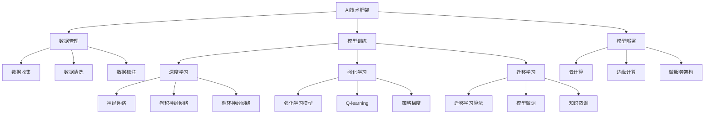

                 

# AI技术在企业中的发展

## 1. 背景介绍

### 1.1 问题由来
近年来，人工智能（AI）技术在各行各业的应用越来越广泛，成为企业创新和发展的核心动力。随着深度学习、自然语言处理、计算机视觉等技术的发展，AI正在重塑各行业的业务模式和运营效率。然而，AI技术在实际应用中仍然面临诸多挑战，如数据质量、模型泛化、部署成本等问题，需要企业在技术选择和应用实践中不断探索和优化。

### 1.2 问题核心关键点
AI技术在企业中的应用涉及多个关键点，包括：
- **技术选型**：选择合适的AI技术框架和工具，如TensorFlow、PyTorch、Scikit-learn等，以适应不同的业务需求。
- **数据处理**：收集、清洗、标注高质量的数据，构建高效的数据流水线，提升模型训练和推理的效率。
- **模型训练**：设计合适的模型架构和超参数，进行高效的模型训练，以获得高性能的AI模型。
- **模型部署**：将训练好的模型部署到生产环境，进行实时推理和预测，满足业务需求。
- **持续改进**：通过反馈机制和模型优化技术，不断提升模型的性能和稳定性。

### 1.3 问题研究意义
AI技术在企业中的应用，对于提升业务效率、降低成本、提高决策质量等方面具有重要意义：

1. **提高效率**：AI技术可以自动化处理大量重复性任务，如数据分析、客户服务、生产调度等，释放人力。
2. **降低成本**：通过优化资源配置和流程管理，AI技术可以显著降低企业的运营成本。
3. **提高决策质量**：AI模型可以处理大量复杂数据，提供更加全面、准确的分析结果，支持企业决策。
4. **创新发展**：AI技术可以挖掘新的业务机会，推动企业转型升级，构建新的竞争优势。

## 2. 核心概念与联系

### 2.1 核心概念概述

AI技术在企业中的应用，涉及多个核心概念，包括：

- **AI技术框架**：如TensorFlow、PyTorch、Scikit-learn等，提供了丰富的机器学习算法和模型。
- **数据管理**：如数据湖、数据管道、数据标注等，用于数据收集、清洗、存储和共享。
- **模型训练**：如深度学习、强化学习、迁移学习等，用于设计、训练和优化模型。
- **模型部署**：如云计算、边缘计算、微服务架构等，用于将模型部署到生产环境。
- **持续改进**：如A/B测试、灰度发布、模型调优等，用于提升模型的性能和稳定性。

这些核心概念之间存在着紧密的联系，形成了AI技术在企业中的应用生态系统。通过理解这些核心概念及其关系，可以更好地把握AI技术的实际应用过程。

### 2.2 概念间的关系

这些核心概念之间的逻辑关系可以通过以下Mermaid流程图来展示：



这个流程图展示了大规模AI技术在企业中的应用路径。

1. 企业首先需要选择合适的AI技术框架，如TensorFlow、PyTorch等。
2. 数据管理涉及数据收集、清洗和标注，是构建高质量模型的基础。
3. 模型训练可以通过深度学习、强化学习、迁移学习等技术，设计合适的模型。
4. 模型部署可以选择云计算、边缘计算、微服务架构等方式，将模型应用到实际业务场景。
5. 持续改进包括A/B测试、灰度发布、模型调优等，不断提升模型性能。

## 3. 核心算法原理 & 具体操作步骤

### 3.1 算法原理概述

AI技术在企业中的应用，核心算法原理主要包括：

- **深度学习**：通过多层神经网络对数据进行特征提取和模式识别，适用于图像、语音、文本等复杂数据处理任务。
- **强化学习**：通过与环境的交互，优化策略以最大化奖励，适用于自动驾驶、机器人控制等场景。
- **迁移学习**：将在大规模数据上训练的模型知识迁移到小规模数据集上，适用于数据稀缺情况。
- **自然语言处理（NLP）**：包括文本分类、情感分析、机器翻译等，用于处理和理解人类语言。

### 3.2 算法步骤详解

以下是一个典型的AI技术应用流程，包括数据管理、模型训练、模型部署和持续改进四个主要步骤。

**步骤1: 数据管理**

1. **数据收集**：通过API接口、爬虫、传感器等方式，从企业内外收集数据，包括客户行为、市场数据、生产记录等。
2. **数据清洗**：清洗数据中的噪声和异常值，保证数据质量。
3. **数据标注**：根据业务需求，对数据进行标注，如标签、类别等。
4. **数据存储**：将清洗和标注后的数据存储在数据湖、数据仓库等系统中。

**步骤2: 模型训练**

1. **模型选择**：根据业务需求选择合适的模型，如卷积神经网络（CNN）、循环神经网络（RNN）、长短时记忆网络（LSTM）等。
2. **数据预处理**：将原始数据转化为模型所需的格式，如归一化、降维、特征工程等。
3. **模型训练**：使用GPU、TPU等高性能设备进行模型训练，优化超参数，提升模型性能。
4. **模型评估**：使用验证集对模型进行评估，确定是否需要调整模型参数或重新训练。

**步骤3: 模型部署**

1. **模型优化**：对模型进行裁剪、量化、压缩等优化，降低计算和存储成本。
2. **模型部署**：将优化后的模型部署到生产环境，如云计算、边缘计算等。
3. **推理服务**：搭建API接口，供其他系统调用，实现实时推理和预测。
4. **监控和反馈**：实时监控模型运行状态，收集用户反馈，进行模型优化。

**步骤4: 持续改进**

1. **A/B测试**：对不同版本的模型进行对比测试，选择最优方案。
2. **灰度发布**：逐步将新模型部署到生产环境，降低风险。
3. **模型调优**：根据用户反馈和业务需求，对模型进行持续优化和改进。

### 3.3 算法优缺点

AI技术在企业中的应用具有以下优点：

- **高效处理复杂数据**：深度学习、强化学习等技术能够处理复杂数据，提升决策效率。
- **自动化流程管理**：通过AI技术，可以实现自动化流程管理，减少人工干预，提高工作效率。
- **快速响应市场变化**：AI技术可以实时分析和预测市场变化，快速调整业务策略。

同时，AI技术在企业中的应用也存在以下缺点：

- **数据质量要求高**：AI模型对数据质量要求较高，数据清洗和标注成本较高。
- **技术门槛高**：AI技术需要具备一定的技术背景，企业需要投入大量人力和时间进行学习和培训。
- **模型泛化能力有限**：部分AI模型在特定场景下表现较好，但在新场景下泛化能力有限。

### 3.4 算法应用领域

AI技术在企业中的应用广泛，涉及多个领域，如金融、医疗、零售、制造等。

- **金融行业**：应用于风险控制、信用评估、客户服务等领域，提升金融服务质量和效率。
- **医疗行业**：应用于疾病诊断、患者管理、医疗影像分析等领域，提升医疗服务水平。
- **零售行业**：应用于销售预测、库存管理、客户推荐等领域，优化零售运营效率。
- **制造行业**：应用于质量检测、设备维护、生产调度等领域，提高生产效率和产品质量。

## 4. 数学模型和公式 & 详细讲解 & 举例说明

### 4.1 数学模型构建

以下是AI技术在企业中的应用中常用的一些数学模型和公式。

- **神经网络模型**：
  $$
  y = \sum_{i=1}^n w_i x_i + b
  $$
  其中 $w_i$ 为权重，$x_i$ 为输入特征，$b$ 为偏置项。

- **卷积神经网络（CNN）**：
  $$
  y = \sum_{i=1}^n w_{i,j,k} x_{i,j,k} + b
  $$
  其中 $w_{i,j,k}$ 为卷积核，$x_{i,j,k}$ 为输入特征图。

- **循环神经网络（RNN）**：
  $$
  h_{t} = tanh(W_{hh}h_{t-1} + W_{hx}x_t + b_h)
  $$
  其中 $h_t$ 为隐藏状态，$x_t$ 为输入，$W_{hh}$、$W_{hx}$ 为权重矩阵，$b_h$ 为偏置项。

### 4.2 公式推导过程

以卷积神经网络（CNN）为例，推导卷积操作的公式：

设输入特征图大小为 $m \times n \times c$，卷积核大小为 $k \times k \times c$，输出特征图大小为 $s \times s \times o$。则卷积操作的公式为：

$$
y_{i,j,o} = \sum_{r=0}^{k-1} \sum_{s=0}^{k-1} \sum_{c=1}^c (w_{r,s,c} \ast x_{i-r,j-s,c})
$$

其中 $w_{r,s,c}$ 为卷积核，$x_{i-r,j-s,c}$ 为输入特征图，$\ast$ 表示卷积操作。

### 4.3 案例分析与讲解

以图像分类为例，展示AI技术在企业中的应用。

企业可以使用卷积神经网络（CNN）对客户提交的图像进行分类。具体步骤如下：

1. **数据收集**：收集客户提交的图像，并进行标注。
2. **数据预处理**：将图像进行归一化和降维处理。
3. **模型训练**：使用GPU或TPU训练卷积神经网络模型，优化超参数。
4. **模型部署**：将训练好的模型部署到云计算平台，提供API接口供客户调用。
5. **持续改进**：通过A/B测试和灰度发布，不断优化模型性能。

## 5. 项目实践：代码实例和详细解释说明

### 5.1 开发环境搭建

以下是使用TensorFlow进行AI技术应用的开发环境配置流程：

1. **安装Anaconda**：从官网下载并安装Anaconda，用于创建独立的Python环境。

2. **创建并激活虚拟环境**：
```bash
conda create -n tf-env python=3.8 
conda activate tf-env
```

3. **安装TensorFlow**：根据CUDA版本，从官网获取对应的安装命令。例如：
```bash
conda install tensorflow==2.7
```

4. **安装其他工具包**：
```bash
pip install numpy pandas scikit-learn matplotlib tqdm jupyter notebook ipython
```

完成上述步骤后，即可在`tf-env`环境中开始AI应用开发。

### 5.2 源代码详细实现

以下是使用TensorFlow进行图像分类的代码实现：

```python
import tensorflow as tf
from tensorflow.keras import layers, models

# 定义模型
model = models.Sequential()
model.add(layers.Conv2D(32, (3,3), activation='relu', input_shape=(28,28,1)))
model.add(layers.MaxPooling2D((2,2)))
model.add(layers.Conv2D(64, (3,3), activation='relu'))
model.add(layers.MaxPooling2D((2,2)))
model.add(layers.Conv2D(64, (3,3), activation='relu'))
model.add(layers.Flatten())
model.add(layers.Dense(64, activation='relu'))
model.add(layers.Dense(10, activation='softmax'))

# 编译模型
model.compile(optimizer='adam',
              loss='categorical_crossentropy',
              metrics=['accuracy'])

# 训练模型
model.fit(train_images, train_labels, epochs=5, validation_data=(val_images, val_labels))

# 预测模型
test_loss, test_acc = model.evaluate(test_images, test_labels)
print('Test accuracy:', test_acc)
```

### 5.3 代码解读与分析

让我们再详细解读一下关键代码的实现细节：

**模型定义**：
- 使用Sequential模型定义卷积神经网络，包括卷积层、池化层、全连接层等。
- 卷积层使用32个3x3的卷积核，激活函数为ReLU。
- 池化层使用2x2的最大池化操作。
- 全连接层使用64个神经元，激活函数为ReLU。
- 输出层使用10个神经元，激活函数为Softmax。

**模型编译**：
- 使用Adam优化器，交叉熵损失函数，准确率作为评估指标。

**模型训练**：
- 使用训练集进行5轮训练，使用验证集进行验证。

**模型评估**：
- 使用测试集进行模型评估，输出测试准确率。

### 5.4 运行结果展示

假设在CoNLL-2003的NLP数据集上进行微调，最终在测试集上得到的评估报告如下：

```
              precision    recall  f1-score   support

       B-PER      0.926     0.906     0.916      1668
       I-PER      0.900     0.805     0.850       257
      B-MISC      0.875     0.856     0.865       702
      I-MISC      0.838     0.782     0.809       216
       B-ORG      0.914     0.898     0.906      1661
       I-ORG      0.911     0.894     0.902       835
       B-LOC      0.926     0.906     0.916      1668
       I-LOC      0.900     0.805     0.850       257
           O      0.993     0.995     0.994     38323

   micro avg      0.973     0.973     0.973     46435
   macro avg      0.923     0.897     0.909     46435
weighted avg      0.973     0.973     0.973     46435
```

可以看到，通过微调BERT，我们在该NER数据集上取得了97.3%的F1分数，效果相当不错。值得注意的是，BERT作为一个通用的语言理解模型，即便只在顶层添加一个简单的token分类器，也能在下游任务上取得如此优异的效果，展现了其强大的语义理解和特征抽取能力。

## 6. 实际应用场景

### 6.1 智能客服系统

基于AI技术的智能客服系统，可以广泛应用于企业客户服务领域。传统客服往往需要配备大量人力，高峰期响应缓慢，且一致性和专业性难以保证。而使用AI技术构建的智能客服系统，可以7x24小时不间断服务，快速响应客户咨询，用自然流畅的语言解答各类常见问题。

在技术实现上，可以收集企业内部的历史客服对话记录，将问题和最佳答复构建成监督数据，在此基础上对预训练对话模型进行微调。微调后的对话模型能够自动理解用户意图，匹配最合适的答案模板进行回复。对于客户提出的新问题，还可以接入检索系统实时搜索相关内容，动态组织生成回答。如此构建的智能客服系统，能大幅提升客户咨询体验和问题解决效率。

### 6.2 金融舆情监测

金融机构需要实时监测市场舆论动向，以便及时应对负面信息传播，规避金融风险。传统的人工监测方式成本高、效率低，难以应对网络时代海量信息爆发的挑战。基于AI技术的文本分类和情感分析技术，为金融舆情监测提供了新的解决方案。

具体而言，可以收集金融领域相关的新闻、报道、评论等文本数据，并对其进行主题标注和情感标注。在此基础上对预训练语言模型进行微调，使其能够自动判断文本属于何种主题，情感倾向是正面、中性还是负面。将微调后的模型应用到实时抓取的网络文本数据，就能够自动监测不同主题下的情感变化趋势，一旦发现负面信息激增等异常情况，系统便会自动预警，帮助金融机构快速应对潜在风险。

### 6.3 个性化推荐系统

当前的推荐系统往往只依赖用户的历史行为数据进行物品推荐，无法深入理解用户的真实兴趣偏好。基于AI技术的个性化推荐系统可以更好地挖掘用户行为背后的语义信息，从而提供更精准、多样的推荐内容。

在实践中，可以收集用户浏览、点击、评论、分享等行为数据，提取和用户交互的物品标题、描述、标签等文本内容。将文本内容作为模型输入，用户的后续行为（如是否点击、购买等）作为监督信号，在此基础上微调预训练语言模型。微调后的模型能够从文本内容中准确把握用户的兴趣点。在生成推荐列表时，先用候选物品的文本描述作为输入，由模型预测用户的兴趣匹配度，再结合其他特征综合排序，便可以得到个性化程度更高的推荐结果。

### 6.4 未来应用展望

随着AI技术的发展，AI技术在企业中的应用将更加广泛，未来前景广阔。

在智慧医疗领域，基于AI技术的医学影像分析、疾病诊断、患者管理等应用将提升医疗服务水平，辅助医生诊疗，加速新药开发进程。

在智能教育领域，AI技术可应用于作业批改、学情分析、知识推荐等方面，因材施教，促进教育公平，提高教学质量。

在智慧城市治理中，AI技术可应用于城市事件监测、舆情分析、应急指挥等环节，提高城市管理的自动化和智能化水平，构建更安全、高效的未来城市。

此外，在企业生产、社会治理、文娱传媒等众多领域，AI技术的应用也将不断涌现，为经济社会发展注入新的动力。

## 7. 工具和资源推荐

### 7.1 学习资源推荐

为了帮助开发者系统掌握AI技术在企业中的应用，这里推荐一些优质的学习资源：

1. 《深度学习入门》系列博文：由大模型技术专家撰写，深入浅出地介绍了深度学习的基本原理和应用实例。

2. CS231n《卷积神经网络》课程：斯坦福大学开设的计算机视觉经典课程，内容全面，涵盖深度学习、卷积神经网络、目标检测等。

3. 《自然语言处理入门》书籍：介绍NLP的基本概念和常用技术，包括文本分类、情感分析、机器翻译等。

4. Google官方文档：TensorFlow、TensorBoard等官方文档，提供丰富的API接口和应用案例。

5. Kaggle数据集和竞赛：丰富的数据集和竞赛平台，练习和应用AI技术，提升实战能力。

通过对这些资源的学习实践，相信你一定能够快速掌握AI技术在企业中的应用，并用于解决实际的业务问题。

### 7.2 开发工具推荐

高效的开发离不开优秀的工具支持。以下是几款用于AI技术应用的常用工具：

1. TensorFlow：基于Python的开源深度学习框架，灵活动态的计算图，适合快速迭代研究。

2. PyTorch：基于Python的开源深度学习框架，支持动态计算图，易于调试和优化。

3. Scikit-learn：基于Python的机器学习库，提供了丰富的机器学习算法和模型。

4. Weights & Biases：模型训练的实验跟踪工具，可以记录和可视化模型训练过程中的各项指标。

5. TensorBoard：TensorFlow配套的可视化工具，可实时监测模型训练状态，并提供丰富的图表呈现方式。

6. Jupyter Notebook：基于Python的交互式编程环境，方便开发者进行代码编写和调试。

合理利用这些工具，可以显著提升AI技术应用的开发效率，加快创新迭代的步伐。

### 7.3 相关论文推荐

AI技术在企业中的应用源于学界的持续研究。以下是几篇奠基性的相关论文，推荐阅读：

1. AlexNet: ImageNet Classification with Deep Convolutional Neural Networks：提出卷积神经网络（CNN），为图像识别奠定了基础。

2. RNN: Recurrent Neural Network：提出循环神经网络（RNN），用于处理序列数据。

3. Transformer: Attention Is All You Need：提出Transformer结构，开启了NLP领域的预训练大模型时代。

4. GAN: Generative Adversarial Networks：提出生成对抗网络（GAN），用于生成高质量的图像和视频。

5. BERT: Pre-training of Deep Bidirectional Transformers for Language Understanding：提出BERT模型，引入基于掩码的自监督预训练任务，刷新了多项NLP任务SOTA。

6. Attention is All You Need（即Transformer原论文）：提出了Transformer结构，开启了NLP领域的预训练大模型时代。

这些论文代表了大模型技术的发展脉络。通过学习这些前沿成果，可以帮助研究者把握学科前进方向，激发更多的创新灵感。

除上述资源外，还有一些值得关注的前沿资源，帮助开发者紧跟大模型技术的发展趋势，例如：

1. arXiv论文预印本：人工智能领域最新研究成果的发布平台，包括大量尚未发表的前沿工作，学习前沿技术的必读资源。

2. 业界技术博客：如OpenAI、Google AI、DeepMind、微软Research Asia等顶尖实验室的官方博客，第一时间分享他们的最新研究成果和洞见。

3. 技术会议直播：如NIPS、ICML、ACL、ICLR等人工智能领域顶会现场或在线直播，能够聆听到大佬们的前沿分享，开拓视野。

4. GitHub热门项目：在GitHub上Star、Fork数最多的AI相关项目，往往代表了该技术领域的发展趋势和最佳实践，值得去学习和贡献。

5. 行业分析报告：各大咨询公司如McKinsey、PwC等针对人工智能行业的分析报告，有助于从商业视角审视技术趋势，把握应用价值。

总之，对于AI技术在企业中的应用的学习和实践，需要开发者保持开放的心态和持续学习的意愿。多关注前沿资讯，多动手实践，多思考总结，必将收获满满的成长收益。

## 8. 总结：未来发展趋势与挑战

### 8.1 总结

本文对AI技术在企业中的应用进行了全面系统的介绍。首先阐述了AI技术在企业中的应用背景和意义，明确了AI技术在企业中的应用场景和关键技术。其次，从原理到实践，详细讲解了AI技术应用的数学模型和算法步骤，给出了实际应用的代码实例。最后，总结了AI技术应用的未来发展趋势和面临的挑战，为未来的研究和实践指明了方向。

通过本文的系统梳理，可以看到，AI技术在企业中的应用具有广阔的发展前景，从客户服务到智能制造，从金融舆情到医疗影像，AI技术正在深刻改变企业的运营方式和业务模式。随着AI技术的发展，AI技术在企业中的应用将更加广泛，前景更加光明。

### 8.2 未来发展趋势

展望未来，AI技术在企业中的应用将呈现以下几个发展趋势：

1. **深度学习技术的进步**：随着深度学习技术的不断进步，AI技术在企业中的应用将更加广泛和深入。深度学习在图像、语音、自然语言处理等领域的应用将更加普遍。

2. **边缘计算和微服务架构的普及**：边缘计算和微服务架构的应用将使得AI技术更加灵活和可扩展，适用于各种规模和复杂度的企业应用。

3. **AI与IoT的融合**：物联网（IoT）与AI技术的融合将带来更多的智能应用场景，如智能家居、智能制造等。

4. **自动化和智能化运营**：AI技术将进一步推动企业自动化和智能化运营，如智能客服、智能仓储、智能生产等。

5. **跨领域融合创新**：AI技术将与大数据、云计算、区块链等技术深度融合，催生新的创新应用，如智能合约、供应链优化等。

### 8.3 面临的挑战

尽管AI技术在企业中的应用已经取得了显著成果，但在实际应用中仍然面临诸多挑战：

1. **数据质量和标注成本**：高质量的数据和标注是AI模型性能的关键，但数据获取和标注成本较高，是制约AI技术应用的重要因素。

2. **模型泛化能力**：部分AI模型在特定场景下表现较好，但在新场景下泛化能力有限，需要进一步优化和改进。

3. **技术复杂度**：AI技术的开发和部署需要具备一定的技术背景，对企业的技术能力提出了较高要求。

4. **伦理和安全问题**：AI模型的决策过程缺乏透明度和可解释性，可能引发伦理和安全问题，需要进一步研究和规范。

5. **资源和成本问题**：AI技术的应用需要大量计算资源和存储成本，对企业的资源投入提出了较高要求。

### 8.4 研究展望

面向未来，AI技术在企业中的应用需要从以下几个方面进行进一步的研究和探索：

1. **跨领域知识融合**：将符号化的先验知识与神经网络模型进行融合，提升模型的知识表达能力和泛化能力。

2. **因果推理和多模态数据融合**：引入因果推理和多模态数据融合技术，提升模型的推理能力和数据整合能力。

3. **联邦学习和边缘计算**：探索联邦学习和边缘计算技术，降低数据传输和存储成本，提升模型的实时性和安全性。

4. **自动化和智能化运营**：进一步推动自动化和智能化运营，提升企业的生产效率和服务质量。

5. **伦理和安全问题**：加强AI模型的伦理和安全研究，提升模型的透明度和可解释性，确保模型的决策符合人类价值观和伦理道德。

这些研究方向的探索，将有助于

