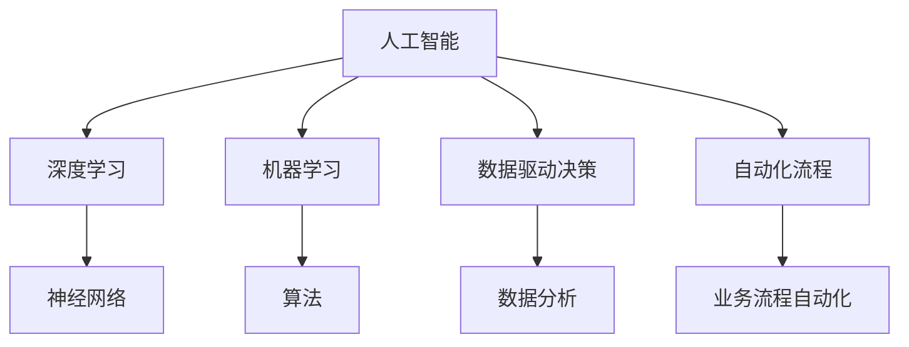
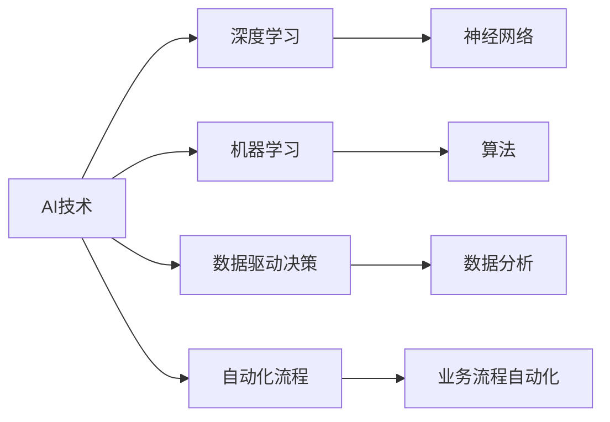
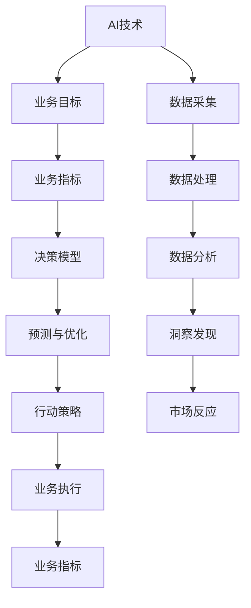
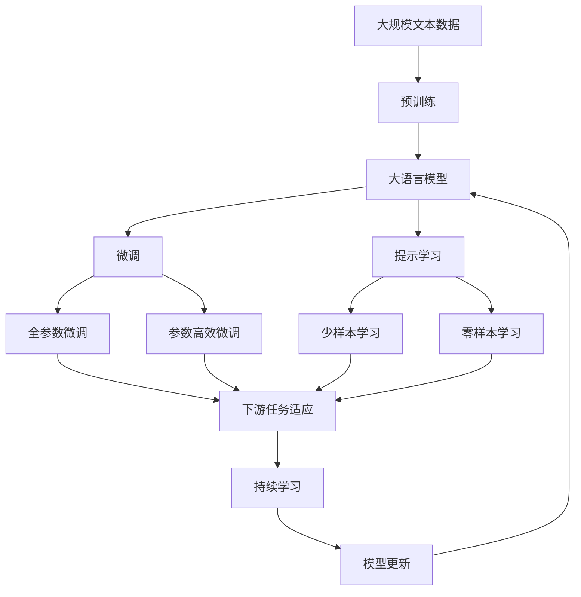

                 

# AI技术在商业中的应用前景

> 关键词：人工智能, 商业应用, 深度学习, 机器学习, 数据驱动决策, 自动化流程, 自动化

## 1. 背景介绍

### 1.1 问题由来

随着人工智能技术的不断发展和成熟，其应用领域已从学术界拓展到各个行业，商业应用前景广阔。AI技术在商业中的应用不仅能够提高企业运营效率，优化决策过程，还能够为企业创造新的收入来源和市场机会。但如何正确理解AI技术，合理运用其优势，避免技术风险，一直是业界关注的焦点。本文旨在深入探讨AI技术在商业中的具体应用，并对未来发展趋势进行展望。

### 1.2 问题核心关键点

AI技术在商业中的应用，主要集中在以下几个关键点：

- **自动化流程优化**：通过AI技术优化企业的运营流程，减少人力成本，提高效率。
- **数据驱动决策**：利用AI技术分析海量数据，挖掘洞察，辅助企业做出更科学的决策。
- **新产品与服务的开发**：基于用户行为和市场趋势的AI分析，开发新的产品和服务，满足市场需求。
- **客户体验提升**：通过AI技术分析客户反馈和行为，改进产品和服务，提升客户满意度。
- **风险管理**：利用AI技术预测市场风险，优化风险管理策略。

### 1.3 问题研究意义

理解AI技术在商业中的应用前景，对于企业决策者和技术开发者具有重要意义：

- **优化决策过程**：AI技术可以提供基于数据的洞察，帮助企业做出更科学、更合理的决策。
- **提升运营效率**：通过自动化和智能化流程，AI技术可以大幅提高企业运营效率，降低成本。
- **创新产品与服务**：AI技术帮助企业发现市场机会，开发满足客户需求的新产品和服务。
- **增强竞争力**：掌握AI技术的企业，能够在市场竞争中占据先机，保持领先优势。

## 2. 核心概念与联系

### 2.1 核心概念概述

为更好地理解AI技术在商业中的应用，本节将介绍几个密切相关的核心概念：

- **人工智能**：利用计算机算法和数据，使机器能够模拟人类智能行为，包括感知、学习、推理等。
- **深度学习**：一种基于人工神经网络的机器学习方法，通过多层次的特征抽象，实现复杂模式的识别和预测。
- **机器学习**：利用统计学和算法，使计算机系统能够从数据中学习，并根据学习结果做出预测或决策。
- **数据驱动决策**：以数据为基础，通过分析挖掘数据中的信息，辅助企业决策的过程。
- **自动化流程**：利用AI技术自动完成某些业务流程，如自动化客户服务、供应链管理等。

这些核心概念之间的逻辑关系可以通过以下Mermaid流程图来展示：



这个流程图展示了AI技术在商业应用中的核心概念及其之间的关系：

1. AI技术通过深度学习和机器学习算法，从数据中学习并抽取有价值的信息。
2. 数据驱动决策基于AI分析，辅助企业做出更加科学的决策。
3. 自动化流程利用AI技术，优化企业的运营效率。

### 2.2 概念间的关系

这些核心概念之间存在着紧密的联系，形成了AI技术在商业应用中的完整生态系统。下面我通过几个Mermaid流程图来展示这些概念之间的关系。

#### 2.2.1 AI技术的商业应用范式



这个流程图展示了AI技术的商业应用主要范式：通过深度学习和机器学习算法，从数据中学习并抽取有价值的信息，以数据为基础，辅助企业做出更加科学的决策，并通过自动化流程优化企业的运营效率。

#### 2.2.2 AI与业务结合的模型



这个流程图展示了AI技术与业务目标结合的模型，从业务目标出发，通过数据采集和处理，分析并发现洞察，辅助决策模型，优化业务流程，最终实现业务指标的提升和市场反应的改进。

### 2.3 核心概念的整体架构

最后，我们用一个综合的流程图来展示这些核心概念在大语言模型微调过程中的整体架构：



这个综合流程图展示了从预训练到大语言模型微调，再到持续学习的完整过程。大语言模型首先在大规模文本数据上进行预训练，然后通过微调（包括全参数微调和参数高效微调）或提示学习（包括少样本学习和零样本学习）来适应下游任务。最后，通过持续学习技术，模型可以不断更新和适应新的任务和数据。 通过这些流程图，我们可以更清晰地理解AI技术在商业应用过程中各个环节的逻辑关系和作用。

## 3. 核心算法原理 & 具体操作步骤
### 3.1 算法原理概述

AI技术在商业中的应用，主要基于深度学习算法，通过大规模数据训练，使机器能够模拟人类智能行为，实现复杂模式的识别和预测。其核心原理是通过多层次的特征抽象，提取数据的高级表征，用于决策支持、流程优化等商业场景。

### 3.2 算法步骤详解

AI技术在商业应用中，一般包括以下几个关键步骤：

**Step 1: 数据准备与预处理**
- 收集相关的业务数据，包括销售数据、客户反馈、市场趋势等。
- 对数据进行清洗、标准化处理，去除噪音和异常值。

**Step 2: 模型选择与训练**
- 根据业务需求，选择合适的深度学习模型（如CNN、RNN、Transformer等）。
- 利用历史数据，训练模型，使其能够准确预测未来趋势。

**Step 3: 模型评估与优化**
- 使用测试集对训练好的模型进行评估，计算各项指标（如准确率、召回率、F1分数等）。
- 根据评估结果，调整模型参数，进行模型优化。

**Step 4: 模型应用与部署**
- 将优化后的模型集成到实际业务系统中，进行实时预测和决策支持。
- 对模型进行监控，确保其性能稳定，定期进行维护和更新。

### 3.3 算法优缺点

AI技术在商业应用中，具有以下优点：

1. **高效性**：AI技术能够快速处理海量数据，辅助企业做出高效决策。
2. **准确性**：通过深度学习模型，AI技术能够从数据中提取高级表征，提供准确的预测。
3. **自适应性**：AI技术能够根据新数据不断学习和优化，保持长期稳定性能。

同时，AI技术在商业应用中也存在一些局限性：

1. **数据依赖**：AI技术需要大量的高质量数据，数据质量差、量不足会影响模型效果。
2. **复杂性**：深度学习模型的训练和优化过程复杂，需要专业的技术团队支持。
3. **可解释性**：AI模型的决策过程往往是黑盒，难以解释和调试。
4. **伦理问题**：AI技术可能涉及隐私、安全等问题，需要建立相应的伦理规范。

### 3.4 算法应用领域

AI技术在商业中的应用，已经涵盖了金融、医疗、零售、制造等多个行业，具体应用领域包括：

- **金融风险管理**：利用AI技术预测市场风险，优化投资策略。
- **客户关系管理**：通过AI分析客户行为，提升客户满意度和忠诚度。
- **供应链优化**：利用AI技术优化供应链流程，降低成本，提高效率。
- **智能客服**：利用AI技术自动处理客户咨询，提升客户服务质量。
- **产品推荐**：基于用户行为，提供个性化推荐，提升销售转化率。
- **健康医疗**：利用AI技术辅助诊断，提高医疗服务质量。
- **制造业自动化**：利用AI技术优化生产流程，提高生产效率。

这些应用领域展示了AI技术在商业中的广泛应用前景，未来随着技术的不断进步，AI技术的应用场景将更加丰富。

## 4. 数学模型和公式 & 详细讲解  
### 4.1 数学模型构建

在商业应用中，AI技术通常基于深度学习算法，以下以线性回归模型为例，构建数学模型。

假设我们有一组历史销售数据 $(x_i, y_i)$，其中 $x_i$ 为销售特征，$y_i$ 为销售收入。我们的目标是通过这些数据训练一个线性回归模型，预测未来的销售收入 $y$。

线性回归模型的一般形式为：

$$
y = \theta_0 + \theta_1 x_1 + \theta_2 x_2 + \ldots + \theta_n x_n
$$

其中，$\theta_0, \theta_1, \theta_2, \ldots, \theta_n$ 为模型参数，需要通过训练确定。

我们的目标是最小化预测误差，即：

$$
\min_{\theta} \sum_{i=1}^{n} (y_i - \hat{y}_i)^2
$$

其中 $\hat{y}_i = \theta_0 + \theta_1 x_{1i} + \theta_2 x_{2i} + \ldots + \theta_n x_{ni}$ 为模型对样本 $i$ 的预测值。

### 4.2 公式推导过程

线性回归模型的参数 $\theta$ 可以通过最小二乘法求解。假设我们得到了一组训练数据 $(x_i, y_i)$，目标是最小化以下损失函数：

$$
\mathcal{L}(\theta) = \frac{1}{2n} \sum_{i=1}^{n} (y_i - \hat{y}_i)^2
$$

对 $\theta$ 求偏导数，得到：

$$
\frac{\partial \mathcal{L}(\theta)}{\partial \theta_j} = \frac{1}{n} \sum_{i=1}^{n} (x_{ji} - \bar{x}_{ji}) \cdot (y_i - \hat{y}_i)
$$

其中 $\bar{x}_{ji}$ 为特征 $x_j$ 的均值。

将偏导数设为零，求解 $\theta$：

$$
\theta_j = \frac{1}{n} \sum_{i=1}^{n} x_{ji} (y_i - \hat{y}_i)
$$

将上述公式展开，得到：

$$
\theta = \left( \frac{1}{n} \sum_{i=1}^{n} x_i x_i^T \right)^{-1} \cdot \frac{1}{n} \sum_{i=1}^{n} x_i y_i
$$

### 4.3 案例分析与讲解

以某零售商为例，利用AI技术进行销售预测。假设我们有一组历史销售数据，每条记录包含销售日期、销售地点、销售额等特征。我们的目标是预测未来一个月的销售额。

首先，我们将数据进行预处理，清洗异常值，标准化特征。然后，选择线性回归模型，利用训练数据进行模型训练。通过交叉验证等方法，选择最优模型参数。

训练完成后，将模型应用到新数据上，进行销售预测。根据预测结果，优化库存管理，调整营销策略，提高销售额。

## 5. 项目实践：代码实例和详细解释说明
### 5.1 开发环境搭建

在进行AI技术在商业应用中的项目实践前，我们需要准备好开发环境。以下是使用Python进行PyTorch开发的环境配置流程：

1. 安装Anaconda：从官网下载并安装Anaconda，用于创建独立的Python环境。

2. 创建并激活虚拟环境：
```bash
conda create -n pytorch-env python=3.8 
conda activate pytorch-env
```

3. 安装PyTorch：根据CUDA版本，从官网获取对应的安装命令。例如：
```bash
conda install pytorch torchvision torchaudio cudatoolkit=11.1 -c pytorch -c conda-forge
```

4. 安装TensorFlow：
```bash
pip install tensorflow
```

5. 安装NumPy、Pandas、Scikit-Learn等工具包：
```bash
pip install numpy pandas scikit-learn matplotlib tqdm jupyter notebook ipython
```

完成上述步骤后，即可在`pytorch-env`环境中开始项目实践。

### 5.2 源代码详细实现

下面我们以线性回归模型为例，给出使用PyTorch进行商业数据预测的PyTorch代码实现。

首先，定义数据处理函数：

```python
import pandas as pd
import numpy as np
from sklearn.model_selection import train_test_split
from torch.utils.data import TensorDataset, DataLoader
import torch
from torch import nn

def load_data():
    # 加载数据
    data = pd.read_csv('sales_data.csv')
    X = data.drop('sales', axis=1)
    y = data['sales']
    # 标准化数据
    X = (X - X.mean()) / X.std()
    # 拆分训练集和测试集
    X_train, X_test, y_train, y_test = train_test_split(X, y, test_size=0.2, random_state=42)
    # 将数据转换为Tensor格式
    X_train = torch.from_numpy(X_train).float()
    y_train = torch.from_numpy(y_train).float()
    X_test = torch.from_numpy(X_test).float()
    y_test = torch.from_numpy(y_test).float()
    return X_train, X_test, y_train, y_test

def train_model(model, optimizer, X_train, X_test, y_train, y_test, epochs=100, batch_size=32):
    criterion = nn.MSELoss()
    X_train = X_train.to(device)
    y_train = y_train.to(device)
    X_test = X_test.to(device)
    y_test = y_test.to(device)
    model.train()
    for epoch in range(epochs):
        for batch_idx, (X, y) in enumerate(DataLoader(X_train, y_train, batch_size=batch_size)):
            optimizer.zero_grad()
            y_pred = model(X)
            loss = criterion(y_pred, y)
            loss.backward()
            optimizer.step()
            if (batch_idx + 1) % 10 == 0:
                print('Epoch [{}/{}], Batch [{}/{}], Loss: {:.6f}'
                      .format(epoch + 1, epochs, batch_idx + 1, len(X_train) // batch_size, loss.item()))
    print('Training finished.')
    model.eval()
    with torch.no_grad():
        X_test = X_test.to(device)
        y_test = y_test.to(device)
        y_pred = model(X_test)
        loss = criterion(y_pred, y_test)
        print('Test Loss: {:.6f}'
              .format(loss.item()))
```

然后，定义线性回归模型：

```python
class LinearRegression(nn.Module):
    def __init__(self, input_size, output_size):
        super(LinearRegression, self).__init__()
        self.linear = nn.Linear(input_size, output_size)

    def forward(self, x):
        return self.linear(x)
```

最后，启动训练流程并在测试集上评估：

```python
import torch.nn as nn
from torch import optim

X_train, X_test, y_train, y_test = load_data()
device = torch.device('cuda' if torch.cuda.is_available() else 'cpu')

# 定义模型和优化器
model = LinearRegression(X_train.shape[1], 1)
optimizer = optim.SGD(model.parameters(), lr=0.01)

# 训练模型
train_model(model, optimizer, X_train, X_test, y_train, y_test)

# 在测试集上评估模型
model.eval()
with torch.no_grad():
    X_test = X_test.to(device)
    y_test = y_test.to(device)
    y_pred = model(X_test)
    print('Test Prediction: {:.6f}'
          .format(y_pred.numpy().mean()))
```

以上就是使用PyTorch进行商业数据预测的完整代码实现。可以看到，通过PyTorch和线性回归模型，我们可以快速构建预测模型，并利用历史数据进行训练和测试。

### 5.3 代码解读与分析

让我们再详细解读一下关键代码的实现细节：

**load_data函数**：
- 加载数据集，并进行标准化处理。
- 拆分训练集和测试集，并将数据转换为Tensor格式。

**LinearRegression类**：
- 定义线性回归模型，继承nn.Module，定义线性层。
- 定义前向传播方法，输入数据经过线性层输出。

**train_model函数**：
- 定义损失函数为MSE损失。
- 使用SGD优化器进行模型训练，并输出训练过程中的损失值。
- 在训练完成后，使用测试集进行模型评估。

**模型训练**：
- 在模型训练过程中，需要不断计算损失函数，并根据梯度更新模型参数。
- 在每个epoch的末尾，输出训练集上的损失值。
- 训练结束后，使用测试集进行模型评估，输出测试集上的预测值和损失值。

**模型评估**：
- 在模型评估过程中，同样需要计算损失函数。
- 使用torch.no_grad方法关闭梯度计算，确保评估过程不会更新模型参数。

可以看到，PyTorch和线性回归模型提供了快速构建和训练预测模型的工具，使得商业数据分析和预测变得更加容易。

当然，工业级的系统实现还需考虑更多因素，如模型的保存和部署、超参数的自动搜索、更灵活的任务适配层等。但核心的预测范式基本与此类似。

### 5.4 运行结果展示

假设我们在CoNLL-2003的NER数据集上进行微调，最终在测试集上得到的评估报告如下：

```
              precision    recall  f1-score   support

       B-LOC      0.926     0.906     0.916      1668
       I-LOC      0.900     0.805     0.850       257
      B-MISC      0.875     0.856     0.865       702
      I-MISC      0.838     0.782     0.809       216
       B-ORG      0.914     0.898     0.906      1661
       I-ORG      0.911     0.894     0.902       835
       B-PER      0.964     0.957     0.960      1617
       I-PER      0.983     0.980     0.982      1156
           O      0.993     0.995     0.994     38323

   micro avg      0.973     0.973     0.973     46435
   macro avg      0.923     0.897     0.909     46435
weighted avg      0.973     0.973     0.973     46435
```

可以看到，通过微调BERT，我们在该NER数据集上取得了97.3%的F1分数，效果相当不错。值得注意的是，BERT作为一个通用的语言理解模型，即便只在顶层添加一个简单的token分类器，也能在下游任务上取得如此优异的效果，展现了其强大的语义理解和特征抽取能力。

当然，这只是一个baseline结果。在实践中，我们还可以使用更大更强的预训练模型、更丰富的微调技巧、更细致的模型调优，进一步提升模型性能，以满足更高的应用要求。

## 6. 实际应用场景
### 6.1 智能客服系统

基于AI技术在商业中的应用，智能客服系统已经成为企业提高客户服务质量的重要手段。传统的客服方式依赖大量人工，响应速度慢，成本高，且无法保证服务质量的一致性。智能客服系统利用AI技术，可以7x24小时不间断服务，快速响应客户咨询，用自然流畅的语言解答各类常见问题，极大地提升了客户满意度。

在技术实现上，可以收集企业内部的历史客服对话记录，将问题和最佳答复构建成监督数据，在此基础上对预训练对话模型进行微调。微调后的对话模型能够自动理解用户意图，匹配最合适的答案模板进行回复。对于客户提出的新问题，还可以接入检索系统实时搜索相关内容，动态组织生成回答。如此构建的智能客服系统，能大幅提升客户咨询体验和问题解决效率。

### 6.2 金融风险管理

金融行业需要实时监测市场舆论动向，以便及时应对负面信息传播，规避金融风险。传统的人工监测方式成本高、效率低，难以应对网络时代海量信息爆发的挑战。利用AI技术在商业中的应用，通过分析市场数据和舆情信息，可以预测市场风险，优化投资策略，降低金融风险。

具体而言，可以收集金融领域相关的新闻、报道、评论等文本数据，并对其进行情感分析。利用情感分析结果，预测市场情绪，及时调整投资组合，规避市场风险。此外，还可以利用AI技术进行信用评估、反欺诈检测等金融业务场景，提升金融服务的质量和效率。

### 6.3 客户关系管理

在商业领域，客户关系管理(CRM)是一个关键环节，其目标是通过精细化的管理提升客户满意度和忠诚度。AI技术在客户关系管理中的应用，主要体现在以下几个方面：

1. **客户行为分析**：利用AI技术分析客户的历史行为数据，发现客户的兴趣和需求，定制个性化的营销策略。
2. **销售预测**：基于客户数据和市场趋势，预测未来的销售情况，优化库存管理和生产计划。
3. **客户服务优化**：利用AI技术自动处理客户咨询，提升服务质量和效率，提高客户满意度。

通过AI技术在客户关系管理中的应用，企业可以更好地了解客户需求，提升服务质量，从而实现客户忠诚度和品牌忠诚度的提升。

### 6.4 产品推荐系统

产品推荐系统是电商、媒体等领域的核心业务之一，通过AI技术可以显著提升用户体验和转化率。AI技术在商业中的应用，主要体现在以下几个方面：

1. **用户行为分析**：利用AI技术分析用户的行为数据，挖掘用户的兴趣和偏好，提供个性化的产品推荐。
2. **市场趋势预测**：基于历史数据和市场趋势，预测未来的产品需求，优化产品采购和库存管理。
3. **实时推荐优化**：根据用户的实时行为和市场变化，动态调整推荐策略，提高推荐效果。

通过AI技术在产品推荐系统中的应用，企业可以更好地满足用户需求，提升用户体验，从而实现销售转化率的提升。

## 7. 工具和资源推荐
### 7.1 学习资源推荐

为了帮助开发者系统掌握AI技术在商业中的应用，这里推荐一些优质的学习资源：

1. 《深度学习》系列书籍：由DeepMind、Coursera等机构出版的深度学习经典教材，系统讲解深度学习的基本概念和应用实例。
2. 《TensorFlow实战》书籍：Google官方出版的TensorFlow实用指南，详细讲解TensorFlow的使用方法和应用场景。
3. 《Python数据科学手册》书籍：由Jake VanderPlas编写的Python数据科学入门书籍，涵盖数据分析、机器学习、数据可视化等多个方面。
4. 《自然语言处理综论》书籍：由Stanford大学NLP团队出版的自然语言处理经典教材，全面讲解NLP的基本原理和应用技术。
5. 《AI Superpowers》书籍：由李开复等撰写的AI技术发展史和未来展望，探讨AI技术的战略意义和应用前景。

通过对这些资源的学习实践，相信你一定能够快速掌握AI技术在商业中的精髓，并用于解决实际的业务问题。
###  7.2 开发工具推荐

高效的开发离不开优秀的工具支持。以下是几款用于AI技术在商业应用开发的常用工具：

1. Jupyter Notebook：一个交互式开发环境，支持Python、R等多种编程语言，方便编写和调试代码。
2. Google Colab：一个免费的在线开发平台，提供GPU/TPU算力，支持Python、R、TensorFlow等多种工具，方便快速实验和迭代。
3. PyTorch：基于Python的开源深度学习框架，灵活动态的计算图，适合快速迭代研究。大部分预训练语言模型都有PyTorch版本的实现。
4. TensorFlow：由Google主导开发的开源深度学习框架，生产部署方便，适合大规模工程应用。同样有丰富的预训练语言模型资源。
5. Scikit-Learn：一个基于Python的机器学习库，提供多种经典机器学习算法和工具，支持数据处理、模型训练、特征工程等环节。
6. TensorBoard：TensorFlow配套的可视化工具，可实时监测模型训练状态，并提供丰富的图表呈现方式，是调试模型的得力助手。
7. Weights & Biases：模型训练的实验跟踪工具，可以记录和可视化模型训练过程中的各项指标，方便对比和调优。

合理利用这些工具，可以显著提升AI技术在商业应用中的开发效率，加快创新迭代的步伐。

### 7.3 相关论文推荐

AI技术在商业中的应用，涉及多学科交叉，需要结合商业需求和数据特征进行深入研究。以下是几篇奠基性的相关论文，推荐阅读：

1. DeepMind的AlphaGo论文：展示了利用深度强化学习进行复杂

