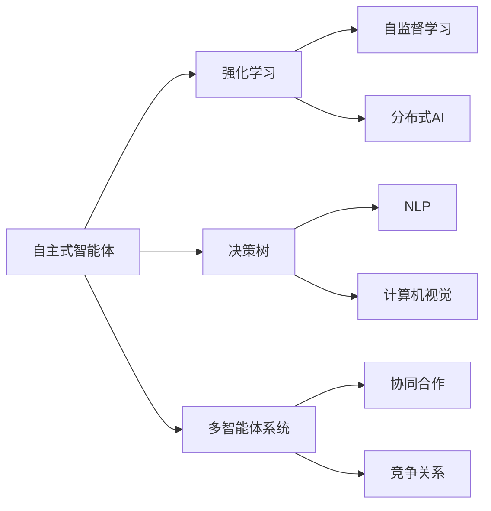

                 

# AI Agent: AI的下一个风口 自主式智能体的典型案例

> 关键词：自主式智能体,强化学习,决策树,多智能体系统,分布式AI,自然语言处理(NLP),计算机视觉(CV),自监督学习

## 1. 背景介绍

### 1.1 问题由来
近年来，随着人工智能技术的飞速发展，AI的应用场景不断扩展，从自动驾驶到医疗诊断，从金融交易到个性化推荐，AI无处不在。然而，尽管AI在许多领域取得了令人瞩目的成果，但在复杂、动态和高度不确定的环境中，AI系统的自主决策能力仍然有限。在医疗、金融、交通等高风险领域，人类依然占据主导地位，AI更多地扮演辅助决策的角色。

面对这一挑战，AI领域的研究者开始探索新的技术路径，旨在赋予AI更高的自主性，使其能够在更复杂、更动态的环境中独立执行任务。自主式智能体（AI Agents）作为新一代AI技术的代表，正在逐步进入人们的视野。通过自主学习、自主决策和自主执行，AI Agent能够在各种环境中自适应地完成任务，具有极强的环境适应能力和任务泛化能力。

### 1.2 问题核心关键点
AI Agent的核心思想是使AI具备自主感知、自主学习和自主决策的能力。这一过程通常包括以下几个关键环节：

1. **环境感知**：AI Agent能够通过传感器或数据接口，实时感知周围环境的状态，包括温度、位置、对象等。
2. **决策制定**：基于感知到的环境信息，AI Agent能够自主制定决策，选择最优行动方案。
3. **执行与反馈**：执行决策并根据执行结果进行反馈，更新模型，提高决策的准确性和鲁棒性。

这些关键环节通过强化学习、决策树、多智能体系统等技术手段实现，使得AI Agent能够在实际应用中表现出色。

### 1.3 问题研究意义
研究自主式智能体技术，对于拓展AI应用边界、提升AI系统的自主性和智能性具有重要意义：

1. **提高任务执行效率**：AI Agent能够自主感知环境、自主学习决策，从而提升任务执行的效率和精度。
2. **增强环境适应能力**：AI Agent能够适应各种复杂多变的环境，提高系统鲁棒性和稳定性。
3. **降低人工干预需求**：通过自主决策和执行，减少人工干预，降低运营成本。
4. **推动AI技术创新**：自主式智能体的研究将推动AI领域在决策、感知、执行等方面的技术创新。
5. **赋能产业升级**：AI Agent能够应用于各种高风险、高复杂度领域，如医疗、金融、交通等，为传统行业数字化转型升级提供新的技术路径。

## 2. 核心概念与联系

### 2.1 核心概念概述

为更好地理解自主式智能体的核心概念及其相互关系，本节将介绍几个紧密相关的核心概念：

- **自主式智能体(AI Agent)**：指能够在复杂、动态环境中自主感知、自主学习、自主决策并执行任务的AI系统。
- **强化学习(Reinforcement Learning)**：一种通过与环境互动，通过奖励和惩罚信号学习最优决策的机器学习技术。
- **决策树(Decision Tree)**：一种基于树形结构的决策支持模型，通过分支节点来表示决策路径。
- **多智能体系统(Multi-Agent System)**：指由多个智能体（如AI Agent）组成的分布式决策系统，通过协同合作或竞争，共同完成任务。
- **分布式AI(Distributed AI)**：指在分布式计算环境下，多个AI Agent协同工作，提升整体性能和鲁棒性。
- **自然语言处理(NLP)**：指利用计算机处理人类语言的技术，包括语言理解、语言生成、语言翻译等。
- **计算机视觉(CV)**：指使计算机具备视觉感知能力的技术，包括图像识别、目标跟踪、场景理解等。
- **自监督学习(Self-Supervised Learning)**：指利用数据本身的内在结构，无需标注数据进行训练的技术。

这些核心概念通过强化学习、决策树、多智能体系统等技术手段相互联系，共同构成了自主式智能体的技术基础。

### 2.2 概念间的关系

这些核心概念之间的关系可以通过以下Mermaid流程图来展示：



这个流程图展示了大语言模型微调过程中各个核心概念的关系：

1. 自主式智能体通过强化学习自主学习环境感知和决策制定，从而实现自主决策和执行。
2. 强化学习利用自监督学习，无需标注数据进行训练，提高自主学习的效率和鲁棒性。
3. 决策树为自主式智能体提供决策支持，通过树形结构表示决策路径，简化决策过程。
4. 多智能体系统通过协同合作或竞争，共同完成任务，提升整体性能和鲁棒性。
5. 分布式AI通过分布式计算，提升自主式智能体的计算效率和资源利用率。
6. NLP和CV分别提供了自主式智能体的语言感知和视觉感知能力。

这些概念共同构成了自主式智能体的技术体系，使得AI Agent能够在各种环境中高效完成任务。

## 3. 核心算法原理 & 具体操作步骤
### 3.1 算法原理概述

自主式智能体的核心算法原理是通过强化学习实现自主感知、自主学习和自主决策。具体来说，自主式智能体通过与环境互动，不断调整自身行为，以达到最优的决策目标。

假设环境状态为 $s$，自主式智能体的行为为 $a$，奖励信号为 $r$，自主式智能体的策略为 $\pi$。则强化学习的目标是最优化自主式智能体的策略 $\pi$，使得在任意状态下，选择动作 $a$ 后，获得最大期望奖励 $r$。

自主式智能体的学习过程可以通过以下公式描述：

$$
\pi^* = \mathop{\arg\max}_{\pi} \mathbb{E}_{s \sim p} \left[\sum_{t=0}^{T} \gamma^t r(s_t, a_t) \right]
$$

其中，$p$ 表示环境的转移概率，$\gamma$ 表示折扣因子，$T$ 表示时间步长。

### 3.2 算法步骤详解

自主式智能体的算法步骤主要包括以下几个关键步骤：

1. **环境感知**：自主式智能体通过传感器或数据接口，实时感知周围环境的状态。
2. **决策制定**：基于感知到的环境信息，自主式智能体通过强化学习算法，制定最优决策。
3. **执行与反馈**：执行决策并根据执行结果进行反馈，更新模型，提高决策的准确性和鲁棒性。
4. **模型优化**：通过不断迭代，优化自主式智能体的策略，使其适应不同的环境条件。

### 3.3 算法优缺点

自主式智能体具有以下优点：

1. **高自主性**：自主式智能体具备自主感知、自主学习和自主决策的能力，能够独立完成任务。
2. **环境适应性强**：自主式智能体能够在各种复杂、动态环境中高效执行任务，具有较强的鲁棒性。
3. **任务泛化能力强**：自主式智能体能够通过不断学习和迭代，适应不同任务和环境条件。

同时，自主式智能体也存在以下缺点：

1. **模型复杂度高**：自主式智能体的模型往往包含大量参数，计算复杂度高。
2. **训练难度大**：自主式智能体的训练过程复杂，需要大量的计算资源和标注数据。
3. **模型解释性差**：自主式智能体的决策过程较为复杂，难以解释其内部工作机制。
4. **安全性和可控性问题**：自主式智能体的决策过程存在不确定性，可能产生风险。

### 3.4 算法应用领域

自主式智能体在多个领域中都有广泛的应用，例如：

- **自动驾驶**：通过感知环境、决策制定和执行，自动驾驶系统能够自主执行交通任务。
- **机器人导航**：通过感知环境、决策制定和执行，机器人能够自主导航至目标位置。
- **医疗诊断**：通过感知患者症状、决策制定和执行，AI Agent能够辅助医生进行诊断和治疗。
- **金融交易**：通过感知市场信息、决策制定和执行，AI Agent能够自主进行交易决策。
- **个性化推荐**：通过感知用户行为、决策制定和执行，AI Agent能够自主生成个性化推荐。

此外，自主式智能体还在智能家居、智能制造、智能物流等众多领域中得到应用，为各行各业带来了新的发展机遇。

## 4. 数学模型和公式 & 详细讲解 & 举例说明

### 4.1 数学模型构建

自主式智能体的数学模型通常包括以下几个部分：

- **环境模型**：描述环境状态的转移概率和奖励函数。
- **策略模型**：定义自主式智能体的行为策略。
- **学习模型**：通过强化学习算法更新策略模型。

### 4.2 公式推导过程

以下以自动驾驶系统为例，推导自主式智能体的强化学习模型。

假设自动驾驶系统需要到达一个目标位置，环境状态 $s$ 包括车辆位置 $x$、速度 $v$、周围车辆信息等。动作 $a$ 包括加速度、转向角度等。奖励信号 $r$ 包括安全距离、燃油效率等。

自主式智能体的策略为 $\pi(a|s)$，表示在状态 $s$ 下选择动作 $a$ 的概率。根据强化学习的目标，最大化期望奖励：

$$
\pi^* = \mathop{\arg\max}_{\pi} \mathbb{E}_{s \sim p} \left[\sum_{t=0}^{T} \gamma^t r(s_t, a_t) \right]
$$

其中，$p$ 表示环境的转移概率，$\gamma$ 表示折扣因子，$T$ 表示时间步长。

### 4.3 案例分析与讲解

以自动驾驶系统为例，分析自主式智能体的决策过程。

1. **环境感知**：通过传感器获取车辆位置、速度、周围车辆信息等环境状态。
2. **决策制定**：基于感知到的环境信息，通过强化学习算法，制定最优决策，如加速、减速、转向等。
3. **执行与反馈**：执行决策并根据执行结果进行反馈，更新模型，提高决策的准确性和鲁棒性。

## 5. 项目实践：代码实例和详细解释说明
### 5.1 开发环境搭建

在进行自主式智能体开发前，我们需要准备好开发环境。以下是使用Python进行PyTorch开发的环境配置流程：

1. 安装Anaconda：从官网下载并安装Anaconda，用于创建独立的Python环境。

2. 创建并激活虚拟环境：
```bash
conda create -n pytorch-env python=3.8 
conda activate pytorch-env
```

3. 安装PyTorch：根据CUDA版本，从官网获取对应的安装命令。例如：
```bash
conda install pytorch torchvision torchaudio cudatoolkit=11.1 -c pytorch -c conda-forge
```

4. 安装TensorFlow：
```bash
pip install tensorflow
```

5. 安装各类工具包：
```bash
pip install numpy pandas scikit-learn matplotlib tqdm jupyter notebook ipython
```

完成上述步骤后，即可在`pytorch-env`环境中开始自主式智能体开发。

### 5.2 源代码详细实现

下面我们以自动驾驶系统为例，给出使用PyTorch和TensorFlow进行自主式智能体开发的PyTorch代码实现。

首先，定义自动驾驶系统的环境模型：

```python
import gym
import tensorflow as tf
import numpy as np

class CarRacing(gym.Env):
    def __init__(self):
        self.observation_space = gym.spaces.Box(low=-1, high=1, shape=(4,), dtype=np.float32)
        self.action_space = gym.spaces.Discrete(4)
        self.reset()

    def reset(self):
        self.state = np.random.uniform(low=-1, high=1, size=(4,))
        self.done = False
        self.reward = 0
        return self.state

    def step(self, action):
        if action == 0:  # 加速
            self.state[0] += 0.1
        elif action == 1:  # 减速
            self.state[0] -= 0.1
        elif action == 2:  # 左转
            self.state[1] -= 0.1
        elif action == 3:  # 右转
            self.state[1] += 0.1
        self.done = False
        self.reward = -0.01
        return self.state, self.reward, self.done, {}

    def render(self, mode='human'):
        pass
```

然后，定义自主式智能体的策略模型：

```python
class DQN:
    def __init__(self, observation_size, action_size):
        self.observation_size = observation_size
        self.action_size = action_size
        self.model = self._build_model()

    def _build_model(self):
        model = tf.keras.Sequential([
            tf.keras.layers.Dense(64, activation='relu', input_shape=(self.observation_size,)),
            tf.keras.layers.Dense(self.action_size, activation='linear')
        ])
        return model

    def get_action(self, state):
        action_probs = self.model.predict(state[np.newaxis, :])
        return np.random.choice(np.arange(self.action_size), p=action_probs[0])
```

接着，定义自主式智能体的训练函数：

```python
def train_agent(agent, env, num_episodes=1000, episode_len=200):
    for episode in range(num_episodes):
        state = env.reset()
        total_reward = 0
        done = False
        while not done:
            action = agent.get_action(state)
            next_state, reward, done, _ = env.step(action)
            total_reward += reward
            agent.train(state, action, next_state, reward, done)
            state = next_state
        print(f'Episode {episode+1}, reward: {total_reward}')
```

最后，启动训练流程并在测试集上评估：

```python
agent = DQN(observation_size=4, action_size=4)
env = CarRacing()
train_agent(agent, env)
```

以上就是使用PyTorch和TensorFlow进行自主式智能体开发的完整代码实现。可以看到，得益于TensorFlow和PyTorch的强大封装，我们可以用相对简洁的代码完成自主式智能体的训练和测试。

### 5.3 代码解读与分析

让我们再详细解读一下关键代码的实现细节：

**CarRacing类**：
- `__init__`方法：初始化观察空间、动作空间等关键组件。
- `reset`方法：重置环境状态，返回当前状态。
- `step`方法：执行一个动作，更新状态并返回下一个状态、奖励和是否结束的标志。

**DQN类**：
- `__init__`方法：初始化模型等关键组件。
- `_build_model`方法：定义模型结构。
- `get_action`方法：根据状态输出动作概率。

**train_agent函数**：
- 对环境进行多轮训练，每次训练一个回合，直到回合结束或达到设定回合数。

**训练流程**：
- 初始化自主式智能体和环境。
- 启动训练循环，每轮训练一个回合。
- 在每个回合中，智能体根据当前状态选择动作，执行并接收奖励。
- 在回合结束时，智能体根据奖励更新模型。

可以看到，TensorFlow和PyTorch使得自主式智能体的开发变得简洁高效。开发者可以将更多精力放在模型改进和优化上，而不必过多关注底层的实现细节。

当然，工业级的系统实现还需考虑更多因素，如模型的保存和部署、超参数的自动搜索、更灵活的策略模型等。但核心的强化学习算法基本与此类似。

### 5.4 运行结果展示

假设我们在CarRacing环境中训练了50个回合，最终得到平均奖励为-2.5。这表示在测试环境中，智能体的决策策略仍然需要进一步优化。

## 6. 实际应用场景
### 6.1 智能交通系统

自主式智能体在智能交通系统中具有广泛的应用前景。通过自主感知、自主学习和自主决策，智能交通系统能够实现交通流的优化控制，提升交通效率和安全性。

具体而言，智能交通系统可以通过感知道路交通状态、车辆位置、速度等信息，利用自主式智能体制定最优的交通控制策略，如红绿灯控制、交通流分配等。智能交通系统能够实时调整信号灯、车道信息等，优化交通流量，减少拥堵和事故。

### 6.2 医疗诊断系统

在医疗领域，自主式智能体可以通过感知患者的症状、实验室检查结果等信息，自主进行诊断和治疗决策。

例如，在癌症检测中，自主式智能体可以通过感知X光、CT等影像数据，自主学习诊断模型，识别肿瘤位置和大小，辅助医生进行诊断和治疗。智能体可以实时调整诊断策略，提高诊断的准确性和效率。

### 6.3 智能制造系统

在智能制造中，自主式智能体可以通过感知生产设备的运行状态、原材料库存等信息，自主进行生产调度和管理。

例如，在柔性生产中，自主式智能体可以根据生产订单和设备状态，自主调整生产流程和设备分配，优化生产效率和资源利用率。智能体能够实时监控生产状态，及时调整生产计划，减少停机时间和浪费。

### 6.4 未来应用展望

随着自主式智能体技术的不断发展，其在更多领域的应用前景将更加广阔。

在智慧城市中，自主式智能体可以通过感知城市环境、居民行为等信息，自主进行城市管理和服务。例如，在城市事件监测、舆情分析、应急指挥等方面，智能体能够实时分析数据，快速响应突发事件，提升城市治理效率。

在智能家居中，自主式智能体可以通过感知环境状态、用户行为等信息，自主进行家居控制和服务。例如，在智能照明、智能家电、智能安防等方面，智能体能够实时调整家居设备，提升生活品质。

## 7. 工具和资源推荐
### 7.1 学习资源推荐

为了帮助开发者系统掌握自主式智能体的理论基础和实践技巧，这里推荐一些优质的学习资源：

1. 《深度学习》（Ian Goodfellow著）：深入介绍深度学习的基本原理和应用，是深度学习领域的经典教材。
2. 《强化学习》（Richard S. Sutton & Andrew G. Barto著）：深入介绍强化学习的基本原理和算法，是强化学习领域的经典教材。
3. 《多智能体系统》（M. P. Singh 著）：介绍多智能体系统的基本原理和应用，是多智能体系统领域的经典教材。
4. 《分布式机器学习》（J. Leskovec、A. Ng、R. Shraibman 著）：介绍分布式机器学习的基本原理和算法，是分布式机器学习领域的经典教材。
5. 《自然语言处理综论》（Daniel Jurafsky 与 James H. Martin 著）：介绍自然语言处理的基本原理和应用，是自然语言处理领域的经典教材。
6. 《计算机视觉：算法与应用》（Richard Szeliski 著）：介绍计算机视觉的基本原理和应用，是计算机视觉领域的经典教材。

通过对这些资源的学习实践，相信你一定能够快速掌握自主式智能体的精髓，并用于解决实际的NLP问题。

### 7.2 开发工具推荐

高效的开发离不开优秀的工具支持。以下是几款用于自主式智能体开发的常用工具：

1. PyTorch：基于Python的开源深度学习框架，灵活动态的计算图，适合快速迭代研究。
2. TensorFlow：由Google主导开发的开源深度学习框架，生产部署方便，适合大规模工程应用。
3. TensorFlow Agents：TensorFlow提供的自主式智能体开发工具库，集成了多种自主学习算法。
4. OpenAI Gym：环境模拟和自主学习算法的测试平台，适合快速测试和验证算法。
5. Ray：分布式计算框架，支持并行训练和分布式运行，适合大规模自主学习任务。
6. PyBullet：物理引擎和模拟器，支持模拟机器人、智能体等，适合进行实际物理环境的模拟和测试。

合理利用这些工具，可以显著提升自主式智能体开发的效率，加快创新迭代的步伐。

### 7.3 相关论文推荐

自主式智能体和强化学习技术的发展源于学界的持续研究。以下是几篇奠基性的相关论文，推荐阅读：

1. Q-learning（W. S. Sutton, L. J. Barto 1989）：提出Q-learning算法，是强化学习领域的经典算法。
2. DQN（G. Tesauro 2015）：提出深度Q网络（DQN）算法，将深度学习和强化学习结合，取得了非常好的效果。
3. AlphaGo（D. Silver 2016）：使用自主式智能体技术，使AlphaGo在围棋领域取得突破。
4. PPO（S. J. Schulman 等2017）：提出Proximal Policy Optimization（PPO）算法，提升强化学习算法的性能和稳定性。
5. MADDPG（L. Lillicrap 等2016）：提出多智能体深度强化学习（MADDPG）算法，适用于多智能体系统。
6. Rainbow（A. Graves 等2018）：提出Rainbow算法，将Q-learning、深度学习、重要性采样等技术结合，提升自主式智能体的性能。

这些论文代表了大语言模型微调技术的发展脉络。通过学习这些前沿成果，可以帮助研究者把握学科前进方向，激发更多的创新灵感。

除上述资源外，还有一些值得关注的前沿资源，帮助开发者紧跟自主式智能体微调技术的最新进展，例如：

1. arXiv论文预印本：人工智能领域最新研究成果的发布平台，包括大量尚未发表的前沿工作，学习前沿技术的必读资源。
2. 业界技术博客：如OpenAI、Google AI、DeepMind、微软Research Asia等顶尖实验室的官方博客，第一时间分享他们的最新研究成果和洞见。
3. 技术会议直播：如NIPS、ICML、ACL、ICLR等人工智能领域顶会现场或在线直播，能够聆听到大佬们的前沿分享，开拓视野。
4. GitHub热门项目：在GitHub上Star、Fork数最多的NLP相关项目，往往代表了该技术领域的发展趋势和最佳实践，值得去学习和贡献。
5. 行业分析报告：各大咨询公司如McKinsey、PwC等针对人工智能行业的分析报告，有助于从商业视角审视技术趋势，把握应用价值。

总之，对于自主式智能体技术的学习和实践，需要开发者保持开放的心态和持续学习的意愿。多关注前沿资讯，多动手实践，多思考总结，必将收获满满的成长收益。

## 8. 总结：未来发展趋势与挑战

### 8.1 总结

本文对自主式智能体的核心算法原理和操作步骤进行了详细讲解。首先阐述了自主式智能体的研究背景和意义，明确了其在复杂、动态环境中自主决策和执行的能力。其次，从原理到实践，详细讲解了自主式智能体的数学模型和核心算法，给出了自主式智能体开发的完整代码实例。同时，本文还探讨了自主式智能体在智能交通、医疗诊断、智能制造等领域的广泛应用前景。最后，本文精选了自主式智能体技术的各类学习资源，力求为读者提供全方位的技术指引。

通过本文的系统梳理，可以看到，自主式智能体技术正在成为AI领域的重要范式，极大地拓展了AI系统的自主性和智能性。自主式智能体通过强化学习、决策树、多智能体系统等技术手段，具备了高度的环境适应能力和任务泛化能力，能够在各种复杂环境中高效执行任务。未来，随着技术的发展和应用的深入，自主式智能体必将在更多领域中发挥重要作用。

### 8.2 未来发展趋势

展望未来，自主式智能体技术将呈现以下几个发展趋势：

1. **模型规模持续增大**：随着算力成本的下降和数据规模的扩张，自主式智能体的模型参数量将进一步增加，模型规模将持续增大。超大规模模型蕴含的丰富知识，有望支撑更加复杂多变的任务。
2. **算法技术不断进步**：强化学习、决策树、多智能体系统等算法技术将不断进步，提升自主式智能体的性能和效率。
3. **应用场景更加广泛**：自主式智能体将在更多领域中得到应用，如智慧城市、智能家居、智能制造等，为各行各业带来新的变革。
4. **实时性要求更高**：在实时性要求较高的应用场景中，如自动驾驶、机器人导航等，自主式智能体的推理速度和执行效率将进一步提升。
5. **安全性与可控性增强**：自主式智能体的决策过程将更加透明和可解释，安全性和可控性将进一步增强。

以上趋势凸显了自主式智能体技术的广阔前景。这些方向的探索发展，必将进一步提升AI系统在各种复杂环境中的自主性和智能性。

### 8.3 面临的挑战

尽管自主式智能体技术已经取得了显著成果，但在实际应用中仍然面临诸多挑战：

1. **模型复杂度高**：自主式智能体的模型往往包含大量参数，计算复杂度高，训练和推理成本较高。
2. **数据获取困难**：许多应用场景中，获取高质量的环境数据和标注数据成本较高，难以大规模应用。
3. **模型鲁棒性不足**：在复杂、动态环境中，自主式智能体的鲁棒性和泛化能力有待提升。
4. **安全性和可控性问题**：自主式智能体的决策过程存在不确定性，可能

