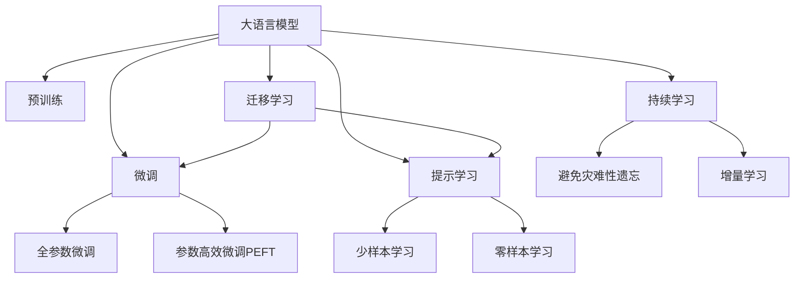

                 

# AI 大模型创业：如何利用资源优势？

在人工智能领域，大语言模型（Large Language Models, LLMs）已经成为了行业的热点话题。这些模型如GPT-3、BERT等，通过在大规模无标签文本数据上进行预训练，获得了强大的语言理解和生成能力，广泛应用于自然语言处理（Natural Language Processing, NLP）的多个领域，如文本分类、命名实体识别、问答系统等。随着技术的不断进步，大模型的应用场景和功能也在不断扩展，为创业公司提供了新的发展机遇。本文将深入探讨如何利用大模型的资源优势，实现创业成功。

## 1. 背景介绍

### 1.1 问题由来

大语言模型的兴起，使得NLP技术的应用门槛大幅降低，创业公司可以借助这些强大的模型，快速开发出具有竞争力的产品。然而，由于大模型需要庞大的算力和数据资源，创业公司往往面临着高昂的成本压力。如何有效利用这些资源，最大化大模型的商业价值，是创业公司必须解决的关键问题。

### 1.2 问题核心关键点

如何利用大模型资源，提升创业公司的产品竞争力，主要涉及以下几个关键点：

- **数据准备**：选择适合的大模型进行微调，准备高质量的标注数据。
- **模型选择**：选择合适的预训练模型，并根据具体任务进行微调。
- **优化策略**：采用高效的微调方法，提升模型性能。
- **应用场景**：挖掘大模型在特定领域的应用潜力，开发具有独特竞争力的产品。

### 1.3 问题研究意义

大模型的资源优势可以帮助创业公司快速推出具有竞争力的产品，缩短研发周期，降低成本，同时提高产品的质量和用户体验。通过深度挖掘大模型的潜力，创业公司可以在垂直领域实现创新突破，抢占市场先机。

## 2. 核心概念与联系

### 2.1 核心概念概述

在讨论如何利用大模型资源时，需要理解以下几个核心概念：

- **大语言模型（LLMs）**：如GPT、BERT等预训练模型，通过大规模无标签文本数据预训练，具备强大的语言理解能力。
- **微调（Fine-Tuning）**：在大模型的基础上，利用下游任务的数据进行有监督学习，优化模型在特定任务上的性能。
- **迁移学习（Transfer Learning）**：将一个领域学习到的知识迁移到另一个相关领域，以降低新任务的数据需求。
- **参数高效微调（PEFT）**：在微调过程中，只更新少量模型参数，以提高效率，避免过拟合。
- **提示学习（Prompt Learning）**：通过精心设计的输入文本格式，引导模型生成期望输出，实现少样本学习。
- **少样本学习（Few-shot Learning）**：在仅有少量标注样本的情况下，模型能快速适应新任务。
- **零样本学习（Zero-shot Learning）**：模型能基于任务描述生成输出，无需任何标注数据。
- **持续学习（Continual Learning）**：模型能够不断学习新知识，保持已有知识的同时更新。

这些概念构成了大语言模型资源利用的基础，帮助创业者系统地理解并应用这些技术。

### 2.2 概念间的关系

这些核心概念之间的关系可以用以下Mermaid流程图表示：



这个流程图展示了从预训练到大模型微调，再到提示学习、迁移学习、持续学习的完整流程，各个概念在此过程中相互联系，共同构成了大模型资源利用的生态系统。

## 3. 核心算法原理 & 具体操作步骤

### 3.1 算法原理概述

大模型的微调过程基于监督学习，通过将模型在新任务上的标注数据作为监督信号，优化模型参数，使其在新任务上表现良好。其核心原理如下：

1. **准备预训练模型和数据集**：选择合适的预训练模型，准备下游任务的标注数据集。
2. **添加任务适配层**：根据任务类型，在预训练模型顶层设计输出层和损失函数。
3. **设置微调超参数**：选择合适的优化算法、学习率、批大小、迭代轮数等。
4. **执行梯度训练**：使用数据集进行有监督学习，优化模型参数。
5. **测试和部署**：在测试集上评估微调后的模型性能，部署到实际应用中。

### 3.2 算法步骤详解

以下是基于监督学习的大模型微调的具体操作步骤：

1. **数据准备**：
   - 选择合适的预训练模型，如GPT、BERT等。
   - 收集下游任务的高质量标注数据，确保数据集的多样性和代表性。

2. **模型选择**：
   - 根据任务类型选择合适的模型，如使用GPT进行文本生成任务，使用BERT进行分类任务。
   - 使用预训练模型的Hugging Face或Google模型库，加载模型权重。

3. **任务适配**：
   - 根据任务需求，在模型顶层添加任务适配层，如分类头、解码器等。
   - 设计合适的损失函数，如交叉熵损失、对数似然损失等。

4. **微调超参数设置**：
   - 选择合适的优化算法（如AdamW、SGD）及其参数。
   - 设定合适的学习率、批大小、迭代轮数等超参数。

5. **梯度训练**：
   - 将标注数据按批输入模型，计算损失函数。
   - 反向传播计算梯度，使用优化算法更新模型参数。
   - 周期性在验证集上评估模型性能，避免过拟合。

6. **测试和部署**：
   - 在测试集上评估模型性能，比较微调前后的差异。
   - 部署微调后的模型到实际应用中，提供实时服务。

### 3.3 算法优缺点

基于监督学习的大模型微调方法具有以下优点：

- **简单高效**：只需少量标注数据即可快速训练出高性能模型。
- **泛化能力强**：通过微调，模型能适应特定任务，提高性能。
- **灵活性高**：可以灵活应用到各种NLP任务，如文本分类、命名实体识别、问答系统等。

同时，也存在一些局限性：

- **数据需求高**：微调需要高质量标注数据，获取标注数据的成本较高。
- **模型复杂**：大模型的参数量庞大，训练和推理成本较高。
- **过拟合风险**：微调过程中容易过拟合，特别是在数据量较少的情况下。

### 3.4 算法应用领域

大模型的微调方法广泛应用于以下领域：

- **文本分类**：如情感分析、主题分类等。
- **命名实体识别**：识别文本中的人名、地名、机构名等实体。
- **关系抽取**：从文本中抽取实体之间的语义关系。
- **问答系统**：对自然语言问题给出答案。
- **机器翻译**：将源语言文本翻译成目标语言。
- **文本摘要**：将长文本压缩成简短摘要。
- **对话系统**：使机器能够与人自然对话。

这些应用领域为大模型提供了丰富的展示机会，推动了人工智能技术在各行业的普及和应用。

## 4. 数学模型和公式 & 详细讲解 & 举例说明

### 4.1 数学模型构建

假设预训练模型为 $M_{\theta}$，下游任务 $T$ 的标注数据集为 $D=\{(x_i,y_i)\}_{i=1}^N$，其中 $x_i$ 为输入，$y_i$ 为标签。微调的目标是最小化经验风险：

$$
\mathcal{L}(\theta) = \frac{1}{N}\sum_{i=1}^N \ell(M_{\theta}(x_i),y_i)
$$

其中 $\ell$ 为损失函数，如交叉熵损失。

### 4.2 公式推导过程

以二分类任务为例，假设模型 $M_{\theta}$ 在输入 $x$ 上的输出为 $\hat{y}=M_{\theta}(x)$，表示样本属于正类的概率。真实标签 $y \in \{0,1\}$。二分类交叉熵损失函数定义为：

$$
\ell(M_{\theta}(x),y) = -[y\log \hat{y} + (1-y)\log(1-\hat{y})]
$$

将上述损失函数代入经验风险公式，得：

$$
\mathcal{L}(\theta) = -\frac{1}{N}\sum_{i=1}^N [y_i\log M_{\theta}(x_i)+(1-y_i)\log(1-M_{\theta}(x_i))]
$$

根据链式法则，损失函数对参数 $\theta_k$ 的梯度为：

$$
\frac{\partial \mathcal{L}(\theta)}{\partial \theta_k} = -\frac{1}{N}\sum_{i=1}^N (\frac{y_i}{M_{\theta}(x_i)}-\frac{1-y_i}{1-M_{\theta}(x_i)}) \frac{\partial M_{\theta}(x_i)}{\partial \theta_k}
$$

其中 $\frac{\partial M_{\theta}(x_i)}{\partial \theta_k}$ 可进一步递归展开，利用自动微分技术完成计算。

### 4.3 案例分析与讲解

以BERT模型在情感分析任务上的微调为例，具体步骤如下：

1. **数据准备**：
   - 准备标注数据集，如IMDB影评数据集。
   - 使用BERT分词器对数据集进行分词，生成输入序列。

2. **模型选择**：
   - 选择BERT-Base模型，使用Hugging Face库加载模型权重。

3. **任务适配**：
   - 在模型顶部添加一个线性分类头，输出维度为2。
   - 定义二元交叉熵损失函数。

4. **微调超参数设置**：
   - 使用AdamW优化器，学习率为1e-5。
   - 批大小为16，迭代轮数为5个epoch。

5. **梯度训练**：
   - 将数据集分批次输入模型，前向传播计算损失函数。
   - 反向传播计算梯度，使用优化器更新模型参数。
   - 周期性在验证集上评估模型性能，避免过拟合。

6. **测试和部署**：
   - 在测试集上评估模型性能，比较微调前后的精度差异。
   - 部署微调后的模型到实际应用中，进行情感分析。

## 5. 项目实践：代码实例和详细解释说明

### 5.1 开发环境搭建

进行大模型微调实践前，需要准备好开发环境：

1. 安装Anaconda：从官网下载并安装Anaconda，用于创建独立的Python环境。

2. 创建并激活虚拟环境：
```bash
conda create -n pytorch-env python=3.8 
conda activate pytorch-env
```

3. 安装PyTorch：根据CUDA版本，从官网获取对应的安装命令。例如：
```bash
conda install pytorch torchvision torchaudio cudatoolkit=11.1 -c pytorch -c conda-forge
```

4. 安装Transformers库：
```bash
pip install transformers
```

5. 安装各类工具包：
```bash
pip install numpy pandas scikit-learn matplotlib tqdm jupyter notebook ipython
```

完成上述步骤后，即可在`pytorch-env`环境中开始微调实践。

### 5.2 源代码详细实现

以下是一个使用PyTorch和Transformers库对BERT模型进行情感分析任务微调的PyTorch代码实现：

```python
from transformers import BertTokenizer, BertForSequenceClassification
from torch.utils.data import Dataset, DataLoader
from torch.nn import CrossEntropyLoss
from torch.optim import AdamW

class TextDataset(Dataset):
    def __init__(self, texts, labels):
        self.texts = texts
        self.labels = labels
        self.tokenizer = BertTokenizer.from_pretrained('bert-base-uncased')
        
    def __len__(self):
        return len(self.texts)
    
    def __getitem__(self, item):
        text = self.texts[item]
        label = self.labels[item]
        
        encoding = self.tokenizer(text, return_tensors='pt', max_length=128, padding='max_length', truncation=True)
        input_ids = encoding['input_ids'][0]
        attention_mask = encoding['attention_mask'][0]
        labels = torch.tensor([label], dtype=torch.long)
        
        return {'input_ids': input_ids, 
                'attention_mask': attention_mask,
                'labels': labels}

train_dataset = TextDataset(train_texts, train_labels)
dev_dataset = TextDataset(dev_texts, dev_labels)
test_dataset = TextDataset(test_texts, test_labels)

tokenizer = BertTokenizer.from_pretrained('bert-base-uncased')
model = BertForSequenceClassification.from_pretrained('bert-base-uncased', num_labels=2)

optimizer = AdamW(model.parameters(), lr=2e-5)

device = torch.device('cuda') if torch.cuda.is_available() else torch.device('cpu')
model.to(device)

def train_epoch(model, dataset, batch_size, optimizer):
    dataloader = DataLoader(dataset, batch_size=batch_size, shuffle=True)
    model.train()
    epoch_loss = 0
    for batch in dataloader:
        input_ids = batch['input_ids'].to(device)
        attention_mask = batch['attention_mask'].to(device)
        labels = batch['labels'].to(device)
        model.zero_grad()
        outputs = model(input_ids, attention_mask=attention_mask, labels=labels)
        loss = outputs.loss
        epoch_loss += loss.item()
        loss.backward()
        optimizer.step()
    return epoch_loss / len(dataloader)

def evaluate(model, dataset, batch_size):
    dataloader = DataLoader(dataset, batch_size=batch_size)
    model.eval()
    preds, labels = [], []
    with torch.no_grad():
        for batch in dataloader:
            input_ids = batch['input_ids'].to(device)
            attention_mask = batch['attention_mask'].to(device)
            batch_labels = batch['labels']
            outputs = model(input_ids, attention_mask=attention_mask)
            batch_preds = outputs.logits.argmax(dim=2).to('cpu').tolist()
            batch_labels = batch_labels.to('cpu').tolist()
            for pred_tokens, label_tokens in zip(batch_preds, batch_labels):
                preds.append(pred_tokens[:len(label_tokens)])
                labels.append(label_tokens)
                
    print(classification_report(labels, preds))

epochs = 5
batch_size = 16

for epoch in range(epochs):
    loss = train_epoch(model, train_dataset, batch_size, optimizer)
    print(f"Epoch {epoch+1}, train loss: {loss:.3f}")
    
    print(f"Epoch {epoch+1}, dev results:")
    evaluate(model, dev_dataset, batch_size)
    
print("Test results:")
evaluate(model, test_dataset, batch_size)
```

### 5.3 代码解读与分析

在上述代码中，我们使用了PyTorch和Transformers库对BERT模型进行情感分析任务的微调：

1. **TextDataset类**：
   - 定义数据集类，将文本和标签转换为模型所需的格式。
   - 使用BertTokenizer对文本进行分词，生成输入序列。

2. **模型选择与初始化**：
   - 选择BERT-Base模型，使用Hugging Face库加载模型权重。
   - 在模型顶部添加线性分类头，输出维度为2。

3. **微调超参数设置**：
   - 使用AdamW优化器，学习率为1e-5。
   - 批大小为16，迭代轮数为5个epoch。

4. **梯度训练**：
   - 将数据集分批次输入模型，前向传播计算损失函数。
   - 反向传播计算梯度，使用优化器更新模型参数。
   - 周期性在验证集上评估模型性能，避免过拟合。

5. **测试和部署**：
   - 在测试集上评估模型性能，比较微调前后的精度差异。
   - 部署微调后的模型到实际应用中，进行情感分析。

## 6. 实际应用场景

### 6.1 智能客服系统

基于大模型的微调技术，可以应用于智能客服系统的构建。传统客服往往需要配备大量人力，高峰期响应缓慢，且一致性和专业性难以保证。使用微调后的对话模型，可以7x24小时不间断服务，快速响应客户咨询，用自然流畅的语言解答各类常见问题。

在技术实现上，可以收集企业内部的历史客服对话记录，将问题和最佳答复构建成监督数据，在此基础上对预训练对话模型进行微调。微调后的对话模型能够自动理解用户意图，匹配最合适的答案模板进行回复。对于客户提出的新问题，还可以接入检索系统实时搜索相关内容，动态组织生成回答。如此构建的智能客服系统，能大幅提升客户咨询体验和问题解决效率。

### 6.2 金融舆情监测

金融机构需要实时监测市场舆论动向，以便及时应对负面信息传播，规避金融风险。传统的人工监测方式成本高、效率低，难以应对网络时代海量信息爆发的挑战。基于大语言模型微调的文本分类和情感分析技术，为金融舆情监测提供了新的解决方案。

具体而言，可以收集金融领域相关的新闻、报道、评论等文本数据，并对其进行主题标注和情感标注。在此基础上对预训练语言模型进行微调，使其能够自动判断文本属于何种主题，情感倾向是正面、中性还是负面。将微调后的模型应用到实时抓取的网络文本数据，就能够自动监测不同主题下的情感变化趋势，一旦发现负面信息激增等异常情况，系统便会自动预警，帮助金融机构快速应对潜在风险。

### 6.3 个性化推荐系统

当前的推荐系统往往只依赖用户的历史行为数据进行物品推荐，无法深入理解用户的真实兴趣偏好。基于大语言模型微调技术，个性化推荐系统可以更好地挖掘用户行为背后的语义信息，从而提供更精准、多样的推荐内容。

在实践中，可以收集用户浏览、点击、评论、分享等行为数据，提取和用户交互的物品标题、描述、标签等文本内容。将文本内容作为模型输入，用户的后续行为（如是否点击、购买等）作为监督信号，在此基础上微调预训练语言模型。微调后的模型能够从文本内容中准确把握用户的兴趣点。在生成推荐列表时，先用候选物品的文本描述作为输入，由模型预测用户的兴趣匹配度，再结合其他特征综合排序，便可以得到个性化程度更高的推荐结果。

### 6.4 未来应用展望

随着大语言模型和微调方法的不断发展，基于微调范式将在更多领域得到应用，为传统行业带来变革性影响。

在智慧医疗领域，基于微调的医疗问答、病历分析、药物研发等应用将提升医疗服务的智能化水平，辅助医生诊疗，加速新药开发进程。

在智能教育领域，微调技术可应用于作业批改、学情分析、知识推荐等方面，因材施教，促进教育公平，提高教学质量。

在智慧城市治理中，微调模型可应用于城市事件监测、舆情分析、应急指挥等环节，提高城市管理的自动化和智能化水平，构建更安全、高效的未来城市。

此外，在企业生产、社会治理、文娱传媒等众多领域，基于大模型微调的人工智能应用也将不断涌现，为经济社会发展注入新的动力。相信随着技术的日益成熟，微调方法将成为人工智能落地应用的重要范式，推动人工智能技术在更广阔的应用领域大放异彩。

## 7. 工具和资源推荐

### 7.1 学习资源推荐

为了帮助开发者系统掌握大语言模型微调的理论基础和实践技巧，这里推荐一些优质的学习资源：

1. 《Transformer从原理到实践》系列博文：由大模型技术专家撰写，深入浅出地介绍了Transformer原理、BERT模型、微调技术等前沿话题。

2. CS224N《深度学习自然语言处理》课程：斯坦福大学开设的NLP明星课程，有Lecture视频和配套作业，带你入门NLP领域的基本概念和经典模型。

3. 《Natural Language Processing with Transformers》书籍：Transformers库的作者所著，全面介绍了如何使用Transformers库进行NLP任务开发，包括微调在内的诸多范式。

4. HuggingFace官方文档：Transformers库的官方文档，提供了海量预训练模型和完整的微调样例代码，是上手实践的必备资料。

5. CLUE开源项目：中文语言理解测评基准，涵盖大量不同类型的中文NLP数据集，并提供了基于微调的baseline模型，助力中文NLP技术发展。

通过对这些资源的学习实践，相信你一定能够快速掌握大语言模型微调的精髓，并用于解决实际的NLP问题。

### 7.2 开发工具推荐

高效的开发离不开优秀的工具支持。以下是几款用于大语言模型微调开发的常用工具：

1. PyTorch：基于Python的开源深度学习框架，灵活动态的计算图，适合快速迭代研究。大部分预训练语言模型都有PyTorch版本的实现。

2. TensorFlow：由Google主导开发的开源深度学习框架，生产部署方便，适合大规模工程应用。同样有丰富的预训练语言模型资源。

3. Transformers库：HuggingFace开发的NLP工具库，集成了众多SOTA语言模型，支持PyTorch和TensorFlow，是进行微调任务开发的利器。

4. Weights & Biases：模型训练的实验跟踪工具，可以记录和可视化模型训练过程中的各项指标，方便对比和调优。与主流深度学习框架无缝集成。

5. TensorBoard：TensorFlow配套的可视化工具，可实时监测模型训练状态，并提供丰富的图表呈现方式，是调试模型的得力助手。

6. Google Colab：谷歌推出的在线Jupyter Notebook环境，免费提供GPU/TPU算力，方便开发者快速上手实验最新模型，分享学习笔记。

合理利用这些工具，可以显著提升大语言模型微调的开发效率，加快创新迭代的步伐。

### 7.3 相关论文推荐

大语言模型和微调技术的发展源于学界的持续研究。以下是几篇奠基性的相关论文，推荐阅读：

1. Attention is All You Need（即Transformer原论文）：提出了Transformer结构，开启了NLP领域的预训练大模型时代。

2. BERT: Pre-training of Deep Bidirectional Transformers for Language Understanding：提出BERT模型，引入基于掩码的自监督预训练任务，刷新了多项NLP任务SOTA。

3. Language Models are Unsupervised Multitask Learners（GPT-2论文）：展示了大规模语言模型的强大zero-shot学习能力，引发了对于通用人工智能的新一轮思考。

4. Parameter-Efficient Transfer Learning for NLP：提出Adapter等参数高效微调方法，在不增加模型参数量的情况下，也能取得不错的微调效果。

5. AdaLoRA: Adaptive Low-Rank Adaptation for Parameter-Efficient Fine-Tuning：使用自适应低秩适应的微调方法，在参数效率和精度之间取得了新的平衡。

6. Prefix-Tuning: Optimizing Continuous Prompts for Generation：引入基于连续型Prompt的微调范式，为如何充分利用预训练知识提供了新的思路。

这些论文代表了大语言模型微调技术的发展脉络。通过学习这些前沿成果，可以帮助研究者把握学科前进方向，激发更多的创新灵感。

除上述资源外，还有一些值得关注的前沿资源，帮助开发者紧跟大语言模型微调技术的最新进展，例如：

1. arXiv论文预印本：人工智能领域最新研究成果的发布平台，包括大量尚未发表的前沿工作，学习前沿技术的必读资源。

2. 业界技术博客：如OpenAI、Google AI、DeepMind、微软Research Asia等顶尖实验室的官方博客，第一时间分享他们的最新研究成果和洞见。

3. 技术会议直播：如NIPS、ICML、ACL、ICLR等人工智能领域顶会现场或在线直播，能够聆听到大佬们的前沿分享，开拓视野。

4. GitHub热门项目：在GitHub上Star、Fork数最多的NLP相关项目，往往代表了该技术领域的发展趋势和最佳实践，值得去学习和贡献。

5. 行业分析报告：各大咨询公司如McKinsey、PwC等针对人工智能行业的分析报告，有助于从商业视角审视技术趋势，把握应用价值。

总之，对于大语言模型微调技术的学习和实践，需要开发者保持开放的心态和持续学习的意愿。多关注前沿资讯，多动手实践，多思考总结，必将收获满满的成长收益。

## 8. 总结：未来发展趋势与挑战

### 8.1 总结

本文对大语言模型微调方法进行了全面系统的介绍。首先阐述了大语言模型和微调技术的研究背景和意义，明确了微调在拓展预训练模型应用、提升下游任务性能方面的独特价值。其次，从原理到实践，详细讲解了监督微调的数学原理和关键步骤，给出了微调任务开发的完整代码实例。同时，本文还广泛探讨了微调方法在智能客服、金融舆情、个性化推荐等多个行业领域的应用前景，展示了微调范式的巨大潜力。

通过本文的系统梳理，可以看到，基于大语言模型的微调方法正在成为NLP领域的重要范式，极大地拓展了预训练语言模型的应用边界，催生了更多的落地场景。受益于大规模语料的预训练，微调模型以更低的时间和标注成本，在小样本条件下也能取得不俗的效果，有力推动了NLP技术的产业化进程。未来，伴随预训练语言模型和微调方法的持续演进，相信NLP技术

