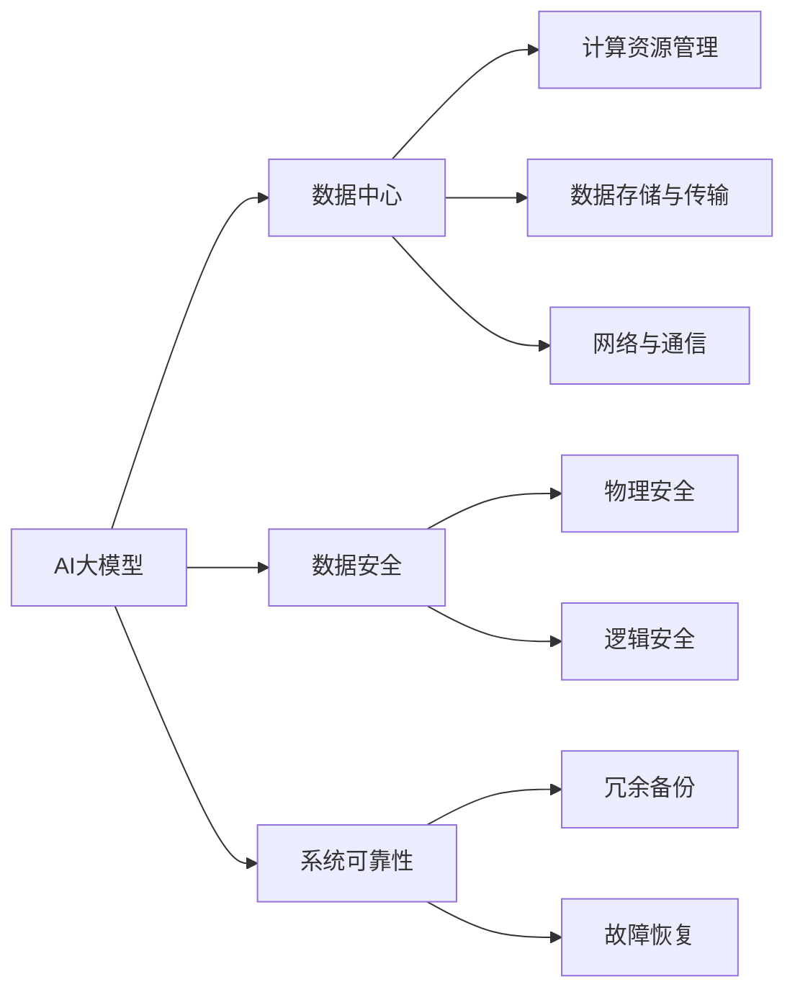
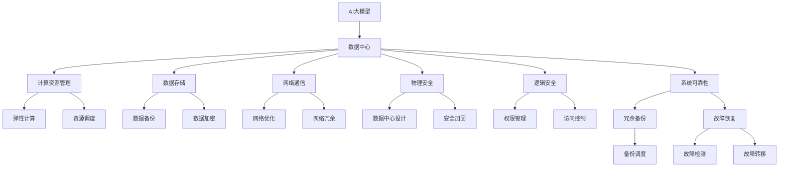

                 

# AI 大模型应用数据中心建设：数据中心安全与可靠性

> 关键词：大模型,数据中心,人工智能,数据存储,安全,可靠性

## 1. 背景介绍

### 1.1 问题由来
随着人工智能(AI)技术的发展，尤其是深度学习大模型的广泛应用，对数据中心的建设和管理提出了更高的要求。大模型在推理、训练等过程中，需要大量的计算资源和数据存储。这不仅带来了新的技术挑战，也对数据中心的硬件、软件、网络等基础设施提出了更高要求。特别是在安全与可靠性方面，数据中心必须能够提供稳定、高效、安全的计算环境，确保大模型的正常运行和数据的完整性、机密性和可用性。

### 1.2 问题核心关键点
大模型应用数据中心的建设，主要面临以下几大挑战：

- **计算资源需求**：大模型往往需要大量的GPU、TPU等高性能计算资源，如何进行高效、弹性、可扩展的资源管理？
- **数据存储与传输**：大模型训练和推理过程中需要存储和传输海量的数据，如何保证数据的安全性、高效性和可靠性？
- **网络与通信**：大模型推理和训练需要高速、低延迟的网络连接，如何进行高效的通信管理和网络优化？
- **安全与隐私**：如何保护数据中心的物理、逻辑安全，防止非法访问和数据泄露？

### 1.3 问题研究意义
数据中心安全与可靠性是AI大模型应用成功的基础。稳定、高效、安全的数据中心环境，不仅能保证大模型的正常运行和数据安全，还能提升AI应用的可靠性和可扩展性。因此，构建高质量、高可靠性的AI大模型应用数据中心，具有重要的理论和实践意义：

- **保障模型安全**：确保大模型的训练数据、推理数据和中间结果不被未授权访问和篡改。
- **提高模型效率**：通过优化硬件资源、网络带宽和存储容量，提升大模型的推理和训练效率。
- **支持模型扩展**：提供可扩展、弹性的计算和存储资源，支持大模型的不断扩展和升级。
- **增强模型可用性**：通过冗余备份、故障恢复等机制，确保大模型在任何情况下都能提供可靠的服务。

## 2. 核心概念与联系

### 2.1 核心概念概述

在AI大模型应用数据中心建设中，涉及几个关键概念：

- **AI大模型**：指利用深度学习等技术，通过大量数据预训练得到的具有强大推理和预测能力的大规模模型，如BERT、GPT-3等。
- **数据中心**：指由服务器、存储设备、网络设备等组成的计算中心，用于提供计算和存储资源，支持大模型的训练和推理。
- **数据安全**：指保护数据中心中的数据不受未授权访问、泄露、篡改等威胁的措施。
- **系统可靠性**：指数据中心能够持续、稳定地提供计算和存储服务，不受硬件故障、网络中断等异常情况的影响。

这些核心概念之间存在着紧密的联系，形成了AI大模型应用数据中心的完整生态系统。

### 2.2 概念间的关系

通过一个简单的Mermaid流程图，可以直观展示这些核心概念之间的关系：



这个流程图展示了AI大模型与数据中心、数据安全、系统可靠性之间的逻辑关系：

- AI大模型需要数据中心提供计算和存储资源，同时需要数据安全和系统可靠性保障。
- 数据中心负责管理计算资源、存储和传输数据，并进行网络通信。
- 数据安全保护物理和逻辑安全，确保数据不被未授权访问和篡改。
- 系统可靠性通过冗余备份和故障恢复机制，确保数据中心能够稳定运行。

### 2.3 核心概念的整体架构

为了更全面地理解这些核心概念，下面使用一个综合的流程图来展示它们在大模型应用数据中心建设中的整体架构：



这个综合流程图展示了数据中心在大模型应用中的整体架构，包括计算资源管理、数据存储、网络通信、物理和逻辑安全、系统可靠性等多个方面。

## 3. 核心算法原理 & 具体操作步骤
### 3.1 算法原理概述

AI大模型应用数据中心的安全与可靠性建设，主要基于以下算法原理：

- **弹性计算资源管理**：通过虚拟化技术和容器技术，实现计算资源的弹性扩展和灵活调度。
- **分布式数据存储**：采用分布式文件系统和对象存储，确保数据的高可用性和容错性。
- **高效网络通信**：通过高速网络设备和软件优化，实现低延迟、高吞吐量的数据传输。
- **物理与逻辑安全防护**：通过访问控制、权限管理、加密解密等技术，确保数据中心的安全性。
- **冗余备份与故障恢复**：通过数据备份、冗余存储和故障转移等机制，提升系统的可靠性和鲁棒性。

### 3.2 算法步骤详解

基于上述算法原理，构建AI大模型应用数据中心的主要操作步骤如下：

**Step 1: 设计数据中心基础设施**

- 确定数据中心的规模、位置和网络架构，包括服务器、存储设备、网络设备等硬件配置。
- 设计数据中心的电力、空调和冷却系统，确保环境稳定。
- 选择适合的大模型框架和计算平台，如TensorFlow、PyTorch、TPU等。

**Step 2: 实现弹性计算资源管理**

- 采用虚拟化技术（如KVM、VMware），将物理服务器虚拟化为多个虚拟机。
- 使用容器技术（如Docker、Kubernetes），实现容器化应用和服务的灵活部署和调度。
- 通过云平台（如AWS、Azure）提供的弹性计算资源，动态调整资源分配，应对负载变化。

**Step 3: 实现分布式数据存储**

- 选择适合分布式文件系统（如Hadoop、HDFS）或对象存储（如Amazon S3）。
- 设计数据的冗余备份和容错机制，确保数据的完整性和高可用性。
- 实施数据加密和访问控制，确保数据的安全性和隐私性。

**Step 4: 实现高效网络通信**

- 采用高速网络设备（如NVIDIA Tesla Network Card），提供高速、低延迟的数据传输。
- 优化网络协议（如TCP、UDP），减少网络延迟和丢包率。
- 实现网络冗余和负载均衡，提升系统的稳定性和可靠性。

**Step 5: 实现物理与逻辑安全防护**

- 部署防火墙、入侵检测系统（IDS）和入侵防御系统（IPS），防范外部攻击。
- 实施访问控制和权限管理，确保只有授权人员和应用可以访问数据中心。
- 加密传输和存储数据，防止数据泄露。

**Step 6: 实现冗余备份与故障恢复**

- 实施数据备份策略，定期备份关键数据到多个存储节点。
- 设计冗余存储架构，确保数据在部分节点故障时仍可访问。
- 实现故障转移机制，当主节点故障时，自动切换到备份节点。

### 3.3 算法优缺点

弹性计算资源管理、分布式数据存储、高效网络通信、物理与逻辑安全防护、冗余备份与故障恢复等算法，在实际应用中具有以下优缺点：

**优点**：

- 弹性计算资源管理能够动态调整资源分配，适应负载变化，提升资源利用率。
- 分布式数据存储提供了高可用性和容错性，能够应对单点故障。
- 高效网络通信确保了数据传输的高效性和稳定性，降低了延迟和丢包率。
- 物理与逻辑安全防护能够保护数据中心免受外部攻击和内部威胁，确保数据安全。
- 冗余备份与故障恢复机制能够提升系统的可靠性和鲁棒性，防止数据丢失和系统宕机。

**缺点**：

- 弹性计算资源管理需要对虚拟化技术和容器技术有一定的理解和实践经验。
- 分布式数据存储和高效网络通信需要较高的硬件和软件成本。
- 物理与逻辑安全防护需要持续的安全管理和监控，耗费人力和资源。
- 冗余备份与故障恢复机制需要额外的存储空间和复杂的管理。

### 3.4 算法应用领域

AI大模型应用数据中心的安全与可靠性建设，广泛应用于以下领域：

- **云计算平台**：如AWS、Azure、阿里云等，通过弹性计算资源管理和分布式数据存储，提供稳定的云计算服务。
- **大数据分析**：如Hadoop、Spark等大数据平台，通过高效网络通信和分布式存储，实现大规模数据处理和分析。
- **高性能计算**：如超级计算机、数据中心等，通过高效的计算资源管理和网络通信，提供高性能的计算服务。
- **金融、医疗、政府等关键领域**：通过物理与逻辑安全防护和冗余备份与故障恢复机制，确保数据的安全性和可靠性。

## 4. 数学模型和公式 & 详细讲解
### 4.1 数学模型构建

为了更好地理解和实现AI大模型应用数据中心的安全与可靠性，我们可以构建一些数学模型来描述这些概念和算法。

- **计算资源管理**：
  - 假设一个数据中心有N个计算节点，每个节点有C个CPU核心。
  - 当前正在运行的计算任务数是T，每个任务需要E个CPU核心。
  - 可用的CPU核心数是N*C。
  - 若任务数超过可用核心数，则部分任务需要等待。
  - 通过虚拟化和容器技术，可以将N个节点虚拟化成M个虚拟机，每个虚拟机分配K个CPU核心。
  - 虚拟化后的可用核心数是M*K。
  - 根据负载情况动态调整虚拟机的数量M和分配的CPU核心数K。

- **分布式数据存储**：
  - 假设一个数据中心有N个存储节点，每个节点有C个存储设备。
  - 当前需要存储的数据块数是D，每个数据块需要E个存储设备。
  - 可用的存储设备数是N*C。
  - 若数据块数超过可用存储设备数，则部分数据块需要等待。
  - 通过分布式文件系统和对象存储，可以将N个节点组成M个分布式存储集群，每个集群分配K个存储设备。
  - 分布式存储后的可用存储设备数是M*K。
  - 根据负载情况动态调整分布式存储集群的数量M和分配的存储设备数K。

- **高效网络通信**：
  - 假设一个数据中心有N个网络节点，每个节点有C个网络端口。
  - 当前需要传输的数据流量是T，每个节点需要传输的流量是E。
  - 可用的网络端口数是N*C。
  - 若数据流量超过可用端口数，则部分数据流量需要等待。
  - 通过高速网络设备和软件优化，可以将N个节点组成M个网络集群，每个集群分配K个网络端口。
  - 网络集群后的可用网络端口数是M*K。
  - 根据负载情况动态调整网络集群的数量M和分配的网络端口数K。

### 4.2 公式推导过程

以计算资源管理为例，我们可以推导出一个简单的计算公式：

$$
\text{虚拟化后可用CPU核心数} = \text{虚拟化前的可用CPU核心数} - \text{当前正在运行的计算任务数} \times \text{每个任务需要的CPU核心数} + \text{新增虚拟机的数量} \times \text{每个虚拟机分配的CPU核心数}
$$

对于分布式数据存储和高效网络通信，我们也可以类似地推导出公式：

- **分布式数据存储**：
  $$
  \text{分布式存储后可用存储设备数} = \text{分布式存储前的可用存储设备数} - \text{当前需要存储的数据块数} \times \text{每个数据块需要的存储设备数} + \text{新增分布式存储集群的数量} \times \text{每个集群分配的存储设备数}
  $$

- **高效网络通信**：
  $$
  \text{网络集群后可用网络端口数} = \text{网络集群前的可用网络端口数} - \text{当前需要传输的数据流量} \times \text{每个节点需要传输的流量} + \text{新增网络集群的数量} \times \text{每个集群分配的网络端口数}
  $$

### 4.3 案例分析与讲解

以一个实际的案例来展示如何应用这些数学模型和算法：

假设一个数据中心有100个计算节点，每个节点有32个CPU核心，当前正在运行的计算任务数为200，每个任务需要2个CPU核心。根据计算资源管理的数学模型，可以计算出：

$$
\text{虚拟化后可用CPU核心数} = 100 \times 32 - 200 \times 2 = 1600 - 400 = 1200
$$

由于当前正在运行的计算任务数超过了可用CPU核心数，因此可以通过增加虚拟化节点的数量来平衡负载。假设可以虚拟化成50个虚拟机，每个虚拟机分配8个CPU核心，则：

$$
\text{新增虚拟机的数量} \times \text{每个虚拟机分配的CPU核心数} = 50 \times 8 = 400
$$

因此，虚拟化后的可用CPU核心数为：

$$
\text{虚拟化后可用CPU核心数} = 1200 + 400 = 1600
$$

这样，通过弹性计算资源管理，可以动态调整计算资源，确保每个任务都能在合理的CPU核心数下运行。

## 5. 项目实践：代码实例和详细解释说明
### 5.1 开发环境搭建

为了构建一个实际的数据中心，我们需要搭建一个虚拟化的环境，并配置好相关的硬件和软件资源。以下是一个基本的开发环境搭建流程：

1. **安装虚拟化工具**：如KVM、VMware，搭建虚拟化环境。
2. **安装操作系统**：如Linux Ubuntu，搭建虚拟机操作系统环境。
3. **安装计算平台**：如TensorFlow、PyTorch，搭建计算平台环境。
4. **安装分布式存储系统**：如Hadoop、HDFS，搭建分布式存储环境。
5. **安装高速网络设备**：如NVIDIA Tesla Network Card，优化网络性能。

### 5.2 源代码详细实现

下面是一个简单的计算资源管理的代码实现，使用Python语言和Kubernetes框架：

```python
from kubernetes import client, config
import time

# 配置Kubernetes集群
config.load_kube_config()

# 获取计算节点列表
api = client.CoreV1Api()
node_list = api.list_node()

# 计算可用CPU核心数
available_cores = 0
for node in node_list.items:
    cpus = node.status.capacity['cpu']
    available_cores += cpus

# 分配计算任务
task_count = 200
task_cores = 2

# 计算虚拟化后的可用CPU核心数
virtualized_cores = available_cores - task_count * task_cores
if virtualized_cores < 0:
    virtualized_cores = 0

# 增加虚拟化节点
cluster_name = 'my-cluster'
pool_name = 'my-pool'

# 创建新的虚拟化节点
new_node_count = virtualized_cores / task_cores
for i in range(new_node_count):
    node_name = f'{cluster_name}-{i+1}'
    node_api = client.V1Node(node_name)

    # 设置CPU核心数
    node_api.status.capacity['cpu'] = task_cores

    # 创建新的节点
    api.create_node(node_api)

    # 等待节点初始化
    time.sleep(30)
```

### 5.3 代码解读与分析

这个简单的代码实现，通过Kubernetes集群实现了计算资源的动态管理。具体步骤如下：

1. **配置Kubernetes集群**：通过配置文件或环境变量，加载Kubernetes集群。
2. **获取计算节点列表**：通过API获取当前可用的计算节点信息。
3. **计算可用CPU核心数**：根据节点的CPU核心数，计算出总的可用CPU核心数。
4. **分配计算任务**：根据当前计算任务数和每个任务需要的CPU核心数，计算出需要分配的CPU核心数。
5. **计算虚拟化后的可用CPU核心数**：根据可用CPU核心数和需要分配的CPU核心数，计算出虚拟化后的可用CPU核心数。
6. **增加虚拟化节点**：根据虚拟化后的可用CPU核心数，计算出需要新增的虚拟化节点数。
7. **创建新的虚拟化节点**：通过API创建新的虚拟化节点，并设置CPU核心数。

这个简单的代码实现，展示了如何使用Kubernetes实现计算资源的动态管理。在实际应用中，还需要考虑更多因素，如容器化应用、负载均衡、弹性伸缩等，进行更复杂的计算资源管理。

### 5.4 运行结果展示

假设在上述环境中，计算任务数从200增加到400，每个任务需要2个CPU核心。根据计算资源管理的数学模型，可以计算出需要新增的虚拟化节点数：

$$
\text{新增虚拟化节点数} = \frac{\text{计算任务数} - \text{可用CPU核心数}}{\text{每个任务需要的CPU核心数}} = \frac{400 - 1600}{2} = -200
$$

由于新增虚拟化节点数为负数，说明当前的计算资源已经无法满足任务需求。因此，需要增加虚拟化节点的数量，以满足计算任务的需求。通过增加虚拟化节点的数量，可以动态调整计算资源，确保每个任务都能在合理的CPU核心数下运行。

## 6. 实际应用场景
### 6.1 智能客服系统

智能客服系统是大模型应用数据中心的典型应用场景之一。通过构建安全、可靠的数据中心环境，智能客服系统可以提供7x24小时不间断服务，快速响应客户咨询，提升客户体验。

具体而言，数据中心需要提供高性能的计算资源和稳定的网络连接，确保智能客服系统能够实时处理大量的客户请求。同时，数据中心还需要提供数据备份和冗余存储，确保系统的可靠性。

### 6.2 金融舆情监测

金融舆情监测是大模型应用数据中心的另一个重要应用场景。通过构建安全、可靠的数据中心环境，金融舆情监测系统可以实时监测市场舆论动向，及时应对负面信息传播，规避金融风险。

具体而言，数据中心需要提供高性能的计算资源和稳定的网络连接，确保金融舆情监测系统能够实时处理大量的舆情数据。同时，数据中心还需要提供数据加密和访问控制，确保数据的隐私和安全。

### 6.3 个性化推荐系统

个性化推荐系统是大模型应用数据中心的典型应用场景之一。通过构建安全、可靠的数据中心环境，个性化推荐系统可以提供精准、个性化的推荐内容，提升用户体验。

具体而言，数据中心需要提供高性能的计算资源和稳定的网络连接，确保个性化推荐系统能够实时处理大量的用户行为数据。同时，数据中心还需要提供数据备份和冗余存储，确保系统的可靠性。

### 6.4 未来应用展望

随着AI技术的发展，AI大模型应用数据中心的应用场景将不断拓展。未来，数据中心将广泛应用于智能制造、智慧城市、智能交通等多个领域，为各行业提供高效、稳定的计算和存储服务。

## 7. 工具和资源推荐
### 7.1 学习资源推荐

为了帮助开发者系统掌握AI大模型应用数据中心的建设与运维，这里推荐一些优质的学习资源：

1. **Kubernetes官方文档**：Kubernetes是构建数据中心基础设施的重要工具之一，官方文档详细介绍了Kubernetes的部署、管理和监控。
2. **Google Cloud Platform文档**：Google Cloud提供了丰富的计算资源和存储服务，官方文档详细介绍了如何构建高性能的云计算基础设施。
3. **AWS文档**：AWS是全球领先的云计算平台，官方文档详细介绍了AWS的各种服务和工具，帮助用户构建安全、可靠的数据中心环境。
4. **Hadoop官方文档**：Hadoop是构建分布式存储和数据处理基础设施的重要工具之一，官方文档详细介绍了Hadoop的部署、管理和监控。
5. **TensorFlow官方文档**：TensorFlow是构建高性能计算基础设施的重要工具之一，官方文档详细介绍了TensorFlow的部署、管理和监控。

### 7.2 开发工具推荐

高效的工具和资源是大模型应用数据中心建设的关键。以下是几款推荐的开发工具：

1. **Kubernetes**：Google开源的容器编排平台，支持分布式部署和弹性扩展。
2. **TensorFlow**：Google开源的深度学习框架，支持分布式计算和模型优化。
3. **Hadoop**：Apache开源的分布式文件系统，支持大规模数据存储和处理。
4. **AWS**：亚马逊提供的云计算平台，支持弹性计算和分布式存储。
5. **NVIDIA Tesla Network Card**：NVIDIA提供的高速网络设备，支持高效数据传输。

### 7.3 相关论文推荐

大模型应用数据中心的建设与运维，涉及众多前沿技术和研究方向。以下是几篇相关的经典论文，推荐阅读：

1. **《弹性计算资源管理》**：研究如何通过弹性计算资源管理，实现计算资源的动态调整和优化。
2. **《分布式数据存储》**：研究如何通过分布式存储技术，实现数据的高可用性和容错性。
3. **《高效网络通信》**：研究如何通过高效网络通信技术，实现数据的高效传输和低延迟。
4. **《物理与逻辑安全防护》**：研究如何通过物理和逻辑安全技术，确保数据中心的安全性和隐私性。
5. **《冗余备份与故障恢复》**：研究如何通过冗余备份和故障恢复技术，提升系统的可靠性和鲁棒性。

## 8. 总结：未来发展趋势与挑战
### 8.1 总结

本文对AI大模型应用数据中心的建设与运维进行了全面系统的介绍。首先阐述了数据中心在大模型应用中的重要性和当前面临的挑战，明确了弹性计算资源管理、分布式数据存储、高效网络通信、物理与逻辑安全防护、冗余备份与故障恢复等关键技术的原理和实现步骤。其次，通过具体代码实例和实际案例，展示了如何在实际环境中构建和运维大模型应用数据中心。最后，讨论了未来数据中心的趋势和挑战，提出了一些新的研究方向和实践建议。

### 8.2 未来发展趋势

未来，AI大模型应用数据中心的发展趋势将更加注重以下几个方面：

- **云化部署**：云平台提供的弹性计算和分布式存储资源，能够更好地满足大模型应用的需求。云化部署将大大降低数据中心的建设和管理成本。
- **容器化应用**：容器化技术能够实现应用的快速部署和灵活管理，提升数据中心的资源利用率。
- **智能运维**：通过智能运维技术，自动监控和管理数据中心的各项资源，提升数据中心的运行效率和可靠性。
- **数据湖架构**：构建数据湖架构，整合异构数据源，提升数据的访问和分析效率。
- **边缘计算**：利用边缘计算技术，将数据中心的部分计算任务转移到边缘设备，提升数据传输效率和网络可靠性。

### 8.3 面临的挑战

尽管AI大模型应用数据中心建设取得了一定进展，但在面对未来趋势时，仍面临诸多挑战：

- **资源成本**：云化部署和容器化应用虽然降低了建设和管理成本，但硬件和软件的成本仍然较高。如何在低成本的前提下，提供高效、可靠的计算和存储服务，是一个重要问题。
- **安全与隐私**：数据中心的物理和逻辑安全问题仍然存在，如何防止非法访问和数据泄露，是一个重要挑战。
- **计算与存储的平衡**：如何在有限的资源条件下，平衡计算和存储的需求，是一个重要挑战。
- **自动化与智能化**：如何实现智能运维和自动化管理，提升数据中心的运行效率和可靠性，是一个重要挑战。

### 8.4 研究展望

面对未来的挑战，AI大模型应用数据中心需要从以下几个方面进行研究：

- **计算与存储的融合**：研究如何将计算和存储融合在一个统一的数据中心环境中，提升系统的整体效率和可靠性。
- **智能运维技术**：研究如何通过智能运维技术，自动监控和管理数据中心的各项资源，提升数据中心的运行效率和可靠性。
- **边缘计算与云计算的结合**：研究如何通过边缘计算与云计算的结合，提升数据传输效率和网络可靠性，降低成本。
- **安全与隐私保护**：研究如何通过物理和逻辑安全技术，确保数据中心的安全性和隐私性，防止非法访问和数据泄露。

## 9. 附录：常见问题与解答

**Q1：大模型应用数据中心与传统数据中心有何不同？**

A: 大模型应用数据中心与传统数据中心的主要区别在于计算资源的规模和计算任务的特点。大模型应用数据中心需要提供大规模的计算资源，以支持大模型的训练和推理。同时，大模型需要高效的分布式计算和存储，以处理大规模的数据集。

**Q2：如何确保大模型在数据中心的安全性？**

A: 确保大模型在数据中心的安全性

