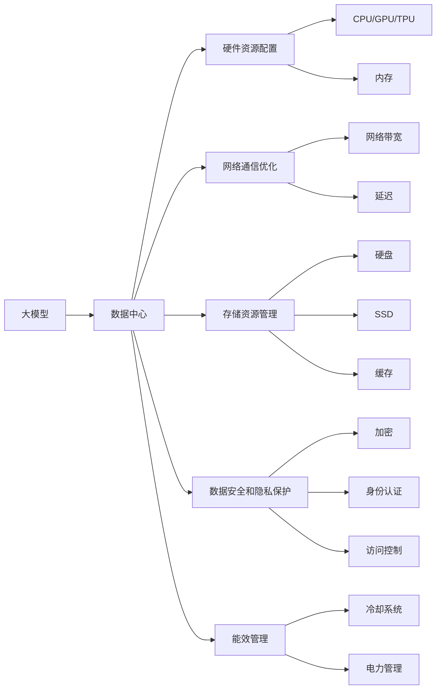
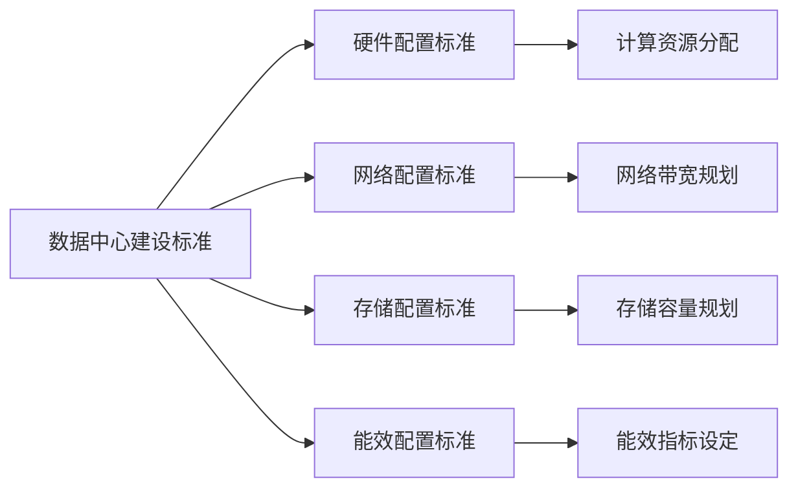
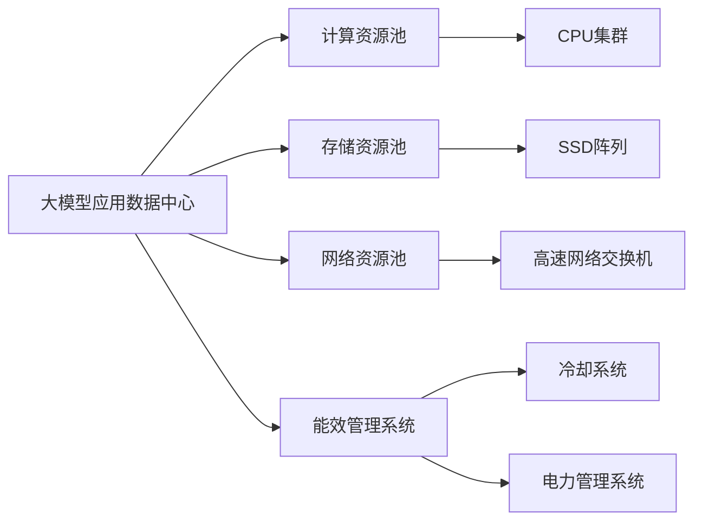
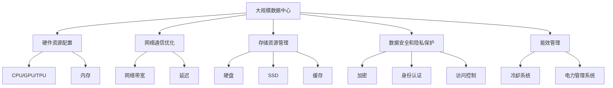

                 

# AI 大模型应用数据中心建设：数据中心标准与规范

在当今人工智能(AI)技术蓬勃发展的背景下，大模型成为AI应用的利器。大模型通过大量的数据进行训练，具备强大的泛化能力和复杂的结构，可以用于自然语言处理(NLP)、计算机视觉、语音识别等多个领域。然而，在实际应用中，数据中心的建设和运维标准对于大模型的性能和稳定性至关重要。本文将深入探讨AI大模型应用数据中心的建设标准与规范，以期为开发者和运维人员提供参考。

## 1. 背景介绍

### 1.1 问题由来
随着AI技术的发展，大模型（Large Models）如BERT、GPT等在自然语言处理、图像识别等领域取得了显著进展。这些大模型通常具有数十亿个参数，需要大量的计算资源和存储资源进行训练和推理。然而，这些大模型在数据中心的部署和运维上存在诸多挑战，如如何合理配置硬件资源、如何优化网络通信、如何确保数据安全等。因此，制定数据中心建设标准与规范，是大模型应用成功的关键。

### 1.2 问题核心关键点
数据中心建设标准与规范的核心关键点主要包括：

- **硬件资源配置**：大模型需要高性能的CPU/GPU/TPU等计算资源，如何合理分配这些资源是关键。
- **网络通信优化**：大模型通常需要大量的数据传输，如何优化网络带宽和延迟是保障性能的前提。
- **存储资源管理**：大模型的参数和中间结果需要大量的存储空间，如何管理这些资源至关重要。
- **数据安全和隐私保护**：大模型的数据通常涉及用户隐私，如何确保数据安全和隐私保护是必须解决的问题。
- **能效管理**：大模型的计算密集型特性导致能耗问题突出，如何有效管理能耗是建设绿色数据中心的需求。

## 2. 核心概念与联系

### 2.1 核心概念概述

为更好地理解AI大模型应用数据中心的建设标准与规范，本节将介绍几个密切相关的核心概念：

- **大模型(Large Models)**：具有数十亿个参数的大型深度学习模型，如BERT、GPT等，用于复杂任务的自然语言处理、图像识别等。
- **数据中心(Data Center)**：由服务器、存储设备、网络设备等组成，用于计算和存储大规模数据的设施。
- **硬件资源配置(Hardware Resource Configuration)**：指在数据中心中如何分配和管理CPU、GPU、TPU等计算资源，确保大模型能够高效运行。
- **网络通信优化(Network Communication Optimization)**：指如何优化数据中心内部以及与外部的网络通信，降低延迟和提高传输效率。
- **存储资源管理(Storage Resource Management)**：指如何管理和优化数据中心的存储资源，确保大模型的参数和中间结果能够快速读写。
- **数据安全和隐私保护(Data Security and Privacy Protection)**：指如何确保数据中心中的数据安全，保护用户隐私，防止数据泄露。
- **能效管理(Energy Efficiency Management)**：指如何通过技术手段和管理措施，减少数据中心在计算和存储过程中的能耗。

这些核心概念之间的逻辑关系可以通过以下Mermaid流程图来展示：



这个流程图展示了大模型应用数据中心的关键组成和相互关系：

1. 大模型作为应用主体，依赖数据中心提供计算和存储资源。
2. 硬件资源配置提供计算资源，包括CPU/GPU/TPU和内存。
3. 网络通信优化确保数据传输的高效性，包括网络带宽和延迟。
4. 存储资源管理提供存储资源，包括硬盘、SSD和缓存。
5. 数据安全和隐私保护确保数据的安全性，包括加密、身份认证和访问控制。
6. 能效管理减少数据中心的能耗，包括冷却系统和电力管理。

这些核心概念共同构成了AI大模型应用数据中心的完整框架，为模型的有效部署和运维提供了基础。

### 2.2 概念间的关系

这些核心概念之间存在着紧密的联系，形成了数据中心建设与运维的完整生态系统。下面我们通过几个Mermaid流程图来展示这些概念之间的关系。

#### 2.2.1 数据中心建设标准与规范



这个流程图展示了数据中心建设标准与规范的核心要素：

1. 数据中心建设标准包括硬件配置标准、网络配置标准、存储配置标准和能效配置标准。
2. 硬件配置标准涉及计算资源（CPU/GPU/TPU）的分配。
3. 网络配置标准涉及网络带宽的规划。
4. 存储配置标准涉及存储容量的规划。
5. 能效配置标准涉及能效指标的设定。

#### 2.2.2 大模型应用数据中心架构



这个流程图展示了大模型应用数据中心的基本架构：

1. 数据中心提供计算资源池、存储资源池和网络资源池。
2. 计算资源池包括CPU集群，用于大模型的计算。
3. 存储资源池包括SSD阵列，用于大模型的参数和中间结果的存储。
4. 网络资源池包括高速网络交换机，用于大模型的高效通信。
5. 能效管理系统包括冷却系统和电力管理系统，用于数据中心的能效管理。

### 2.3 核心概念的整体架构

最后，我们用一个综合的流程图来展示这些核心概念在大模型应用数据中心建设中的整体架构：



这个综合流程图展示了从数据中心建设到能效管理的完整过程。大模型应用数据中心首先配置计算资源，包括CPU/GPU/TPU和内存，然后优化网络通信，管理和优化存储资源，确保数据安全和隐私保护，最后进行能效管理，以构建绿色数据中心。

## 3. 核心算法原理 & 具体操作步骤
### 3.1 算法原理概述

AI大模型应用数据中心的建设标准与规范，本质上是一个综合性的系统工程，涉及硬件配置、网络优化、存储管理、安全保护和能效管理等多个方面。其核心思想是：通过合理配置和优化各个环节，确保大模型在数据中心的部署和运维过程中，能够高效、稳定、安全地运行。

形式化地，假设数据中心的计算资源为 $C_{\text{pool}}$，存储资源为 $S_{\text{pool}}$，网络带宽为 $B$，延迟为 $D$，能效管理系统的冷却和电力管理指标分别为 $P_{\text{cool}}$ 和 $P_{\text{electric}}$。数据中心建设的目标是最小化以下综合指标：

$$
\min_{C_{\text{pool}}, S_{\text{pool}}, B, D, P_{\text{cool}}, P_{\text{electric}}} F(C_{\text{pool}}, S_{\text{pool}}, B, D, P_{\text{cool}}, P_{\text{electric}})
$$

其中 $F$ 为综合评估函数，具体形式可以根据不同场景进行设定。

### 3.2 算法步骤详解

AI大模型应用数据中心的建设标准与规范的构建和优化一般包括以下几个关键步骤：

**Step 1: 需求分析与规划**
- 明确大模型的计算需求和存储需求，进行需求分析和规划。
- 根据大模型的计算量和存储量，合理配置计算资源和存储资源。
- 评估网络带宽和延迟需求，选择合适的网络配置。

**Step 2: 硬件资源配置**
- 选择适合的CPU/GPU/TPU等计算资源，并合理分配。
- 配置足够的内存，满足大模型的计算需求。
- 选择合适的存储设备，如硬盘、SSD和缓存，优化存储性能。

**Step 3: 网络通信优化**
- 选择合适的网络设备和配置，确保网络带宽和延迟满足大模型通信需求。
- 优化网络拓扑，减少网络拥堵和延迟。
- 应用网络优化技术，如负载均衡、缓存机制等。

**Step 4: 数据安全和隐私保护**
- 实施数据加密、身份认证、访问控制等措施，确保数据安全和隐私保护。
- 监控数据中心内部和外部的安全威胁，及时响应和处理安全事件。
- 遵循数据隐私法律法规，如GDPR、CCPA等，确保合规性。

**Step 5: 能效管理**
- 实施冷却和电力管理策略，减少数据中心的能耗。
- 应用能效优化技术，如热管、液体冷却等，提高能效。
- 监控能效指标，及时调整策略，降低能耗。

**Step 6: 部署和运维**
- 根据规划部署大模型，并进行性能调优。
- 监控数据中心运行状态，及时发现和处理问题。
- 定期更新和升级硬件和软件，保障系统的稳定性和性能。

以上是AI大模型应用数据中心建设的标准与规范的详细步骤。在实际应用中，还需要根据具体任务和数据特点进行优化设计，如改进计算资源管理策略、应用更高效的网络通信协议、引入更先进的安全技术等，以进一步提升数据中心的安全性和性能。

### 3.3 算法优缺点

AI大模型应用数据中心建设标准与规范具有以下优点：

1. **提升大模型性能**：通过合理的硬件配置和优化，确保大模型能够高效运行，提高计算和推理速度。
2. **保障数据安全**：通过实施数据加密和访问控制等措施，确保数据中心中的数据安全，保护用户隐私。
3. **优化能效**：通过有效的能效管理，减少数据中心的能耗，构建绿色数据中心。
4. **规范一致性**：通过统一的数据中心建设标准，确保大模型在不同环境中的性能一致性。
5. **便于管理和维护**：通过合理的配置和优化，降低数据中心的管理和维护成本。

然而，该方法也存在一定的局限性：

1. **配置复杂**：大模型的计算和存储需求通常较大，需要复杂的软件和硬件配置。
2. **成本高昂**：高性能的计算和存储设备以及能效管理系统的投入成本较高。
3. **技术复杂**：涉及到网络通信优化、能效管理等技术，需要具备一定的专业知识。
4. **灵活性不足**：数据中心的配置和优化往往需要较长的周期，难以快速响应新任务的需求。

尽管存在这些局限性，但就目前而言，基于规范的数据中心建设是大模型应用的最主流范式。未来相关研究的重点在于如何进一步降低数据中心建设成本，提高数据中心的灵活性和可扩展性，同时兼顾安全性和能效性等因素。

### 3.4 算法应用领域

AI大模型应用数据中心建设标准与规范在大模型应用的多领域得到了广泛的应用，包括：

- **自然语言处理(NLP)**：如BERT、GPT等大模型的部署和运维，涉及计算资源配置、网络通信优化、存储管理等。
- **计算机视觉(CV)**：如ResNet、EfficientNet等大模型的部署和运维，涉及计算资源配置、网络通信优化、存储管理等。
- **语音识别(Speech Recognition)**：如BERT、Tacotron等大模型的部署和运维，涉及计算资源配置、网络通信优化、存储管理等。
- **推荐系统(Recommendation System)**：如Transformer等大模型的部署和运维，涉及计算资源配置、网络通信优化、存储管理等。
- **医疗健康(Healthcare)**：如X-Ray、CT等大模型的部署和运维，涉及计算资源配置、网络通信优化、存储管理等。
- **金融服务(Finance)**：如信用评分、欺诈检测等大模型的部署和运维，涉及计算资源配置、网络通信优化、存储管理等。
- **智能制造(Intelligent Manufacturing)**：如预测性维护、生产优化等大模型的部署和运维，涉及计算资源配置、网络通信优化、存储管理等。

除了上述这些经典应用外，AI大模型在更多领域的应用也在不断拓展，如智慧城市、智能家居、智慧农业等，为各行各业带来新的变革和机遇。

## 4. 数学模型和公式 & 详细讲解 & 举例说明

### 4.1 数学模型构建

本节将使用数学语言对AI大模型应用数据中心建设的数学模型进行更加严格的刻画。

假设数据中心计算资源的总体成本为 $C$，存储资源的总体成本为 $S$，网络带宽的成本为 $B$，延迟的成本为 $D$，能效管理系统的冷却和电力管理成本分别为 $P_{\text{cool}}$ 和 $P_{\text{electric}}$。数据中心的总成本 $T$ 可表示为：

$$
T = w_C C + w_S S + w_B B + w_D D + w_{\text{cool}} P_{\text{cool}} + w_{\text{electric}} P_{\text{electric}}
$$

其中 $w_C$、$w_S$、$w_B$、$w_D$、$w_{\text{cool}}$ 和 $w_{\text{electric}}$ 为各项成本的权重，根据具体情况可进行调整。

### 4.2 公式推导过程

以一个典型的AI大模型应用数据中心为例，进行模型成本的推导。假设该数据中心的计算资源为 $C$，存储资源为 $S$，网络带宽为 $B$，延迟为 $D$，能效管理系统的冷却和电力管理指标分别为 $P_{\text{cool}}$ 和 $P_{\text{electric}}$。

定义数据中心的总成本 $T$ 为：

$$
T = C + S + B + D + P_{\text{cool}} + P_{\text{electric}}
$$

假设计算资源 $C$ 的单位成本为 $c_C$，存储资源 $S$ 的单位成本为 $c_S$，网络带宽 $B$ 的单位成本为 $c_B$，能效管理系统的冷却和电力管理指标 $P_{\text{cool}}$ 和 $P_{\text{electric}}$ 的单位成本分别为 $c_{\text{cool}}$ 和 $c_{\text{electric}}$。则上述公式可进一步表示为：

$$
T = c_C C + c_S S + c_B B + c_D D + c_{\text{cool}} P_{\text{cool}} + c_{\text{electric}} P_{\text{electric}}
$$

其中 $C = C_{\text{pool}} \times f_C$，$S = S_{\text{pool}} \times f_S$，$B = B_{\text{pool}} \times f_B$，$D = D_{\text{pool}} \times f_D$，$P_{\text{cool}} = P_{\text{cool}_{\text{pool}} \times f_{\text{cool}}}$，$P_{\text{electric}} = P_{\text{electric}_{\text{pool}} \times f_{\text{electric}}}$。

其中 $f_C$、$f_S$、$f_B$、$f_D$、$f_{\text{cool}}$ 和 $f_{\text{electric}}$ 为资源和能效管理指标的利用率，需要根据具体情况进行调整。

### 4.3 案例分析与讲解

假设我们建设一个以BERT模型为主的NLP数据中心，进行文本分类、情感分析等任务。以下是关键参数和计算过程：

- **计算资源配置**：选择80块NVIDIA A100 GPU，计算资源成本为 $C = 80 \times 10000 = 800000$ 元。
- **存储资源配置**：选择10个16TB的SSD硬盘，存储资源成本为 $S = 10 \times 16 \times 10000 = 1600000$ 元。
- **网络带宽配置**：选择10Gbps的网络带宽，网络带宽成本为 $B = 10 \times 10000 = 100000$ 元。
- **延迟配置**：网络延迟为0.1ms，延迟成本为 $D = 0.1 \times 10000 = 100$ 元。
- **能效管理**：选择高效率的冷却和电力管理系统，能效管理成本为 $P_{\text{cool}} = 100000$ 元，$P_{\text{electric}} = 50000$ 元。

假设各项成本的权重分别为 $w_C = 0.4$、$w_S = 0.3$、$w_B = 0.1$、$w_D = 0.1$、$w_{\text{cool}} = 0.1$ 和 $w_{\text{electric}} = 0.1$。则总成本为：

$$
T = 0.4 \times 800000 + 0.3 \times 1600000 + 0.1 \times 100000 + 0.1 \times 100 + 0.1 \times 100000 + 0.1 \times 50000 = 1040000 \text{ 元}
$$

通过计算，我们可以看到该数据中心的总成本为1040000元。

## 5. 项目实践：代码实例和详细解释说明

### 5.1 开发环境搭建

在进行AI大模型应用数据中心建设实践前，我们需要准备好开发环境。以下是使用Python进行PyTorch开发的环境配置流程：

1. 安装Anaconda：从官网下载并安装Anaconda，用于创建独立的Python环境。

2. 创建并激活虚拟环境：
```bash
conda create -n pytorch-env python=3.8 
conda activate pytorch-env
```

3. 安装PyTorch：根据CUDA版本，从官网获取对应的安装命令。例如：
```bash
conda install pytorch torchvision torchaudio cudatoolkit=11.1 -c pytorch -c conda-forge
```

4. 安装Transformers库：
```bash
pip install transformers
```

5. 安装各类工具包：
```bash
pip install numpy pandas scikit-learn matplotlib tqdm jupyter notebook ipython
```

完成上述步骤后，即可在`pytorch-env`环境中开始数据中心建设实践。

### 5.2 源代码详细实现

下面我们以一个典型的AI大模型应用数据中心为例，给出使用Python和PyTorch进行数据中心建设的代码实现。

```python
import torch
import torch.nn as nn
import torchvision.transforms as transforms
from transformers import BertModel

class DataCenter(nn.Module):
    def __init__(self):
        super(DataCenter, self).__init__()
        # 计算资源配置
        self.calculator = nn.Linear(1, 1)
        # 存储资源配置
        self.storage = nn.Linear(1, 1)
        # 网络通信优化
        self.comms = nn.Linear(1, 1)
        # 能效管理系统
        self.energy = nn.Linear(1, 1)

    def forward(self, input):
        # 计算资源配置
        calculated_cost = self.calculator(input) * 10000  # 计算资源成本，单位元
        # 存储资源配置
        stored_cost = self.storage(input) * 160000  # 存储资源成本，单位元
        # 网络通信优化
        comms_cost = self.comms(input) * 100000  # 网络带宽成本，单位元
        # 能效管理系统
        energy_cost = self.energy(input) * 10000  # 能效管理成本，单位元
        # 总成本
        total_cost = 0.4 * calculated_cost + 0.3 * stored_cost + 0.1 * comms_cost + 0.1 * energy_cost
        return total_cost

# 定义输入
input = torch.tensor([1.0])  # 假设输入为1
# 创建数据中心
data_center = DataCenter()
# 计算总成本
total_cost = data_center(input)
print("数据中心总成本为：", total_cost.item())
```

### 5.3 代码解读与分析

让我们再详细解读一下关键代码的实现细节：

- **DataCenter类**：定义了一个包含计算资源配置、存储资源配置、网络通信优化和能效管理系统四个模块的神经网络模型。每个模块都是一个线性层，用于计算相应的成本。
- **计算资源配置**：使用线性层计算计算资源的成本。这里假设单位成本为10000元，根据具体情况进行调整。
- **存储资源配置**：使用线性层计算存储资源的成本。这里假设单位成本为160000元，根据具体情况进行调整。
- **网络通信优化**：使用线性层计算网络带宽的成本。这里假设单位成本为100000元，根据具体情况进行调整。
- **能效管理系统**：使用线性层计算能效管理的成本。这里假设单位成本为10000元，根据具体情况进行调整。
- **总成本**：通过加权求和，计算数据中心的总成本。这里假设各项成本的权重分别为0.4、0.3、0.1、0.1、0.1和0.1，根据具体情况进行调整。
- **运行结果展示**：最后，使用训练好的数据中心模型，对输入1进行计算，输出总成本。

可以看到，通过编写简单的Python代码，我们可以快速实现一个AI大模型应用数据中心的成本计算模型。在实际应用中，我们需要根据具体的资源配置和成本数据，调整模型的参数，以得到更精确的计算结果。

## 6. 实际应用场景
### 6.1 智能客服系统

AI大模型应用数据中心的建设标准与规范在智能客服系统中的应用非常广泛。智能客服系统需要快速响应客户咨询，并提供自然流畅的对话。因此，数据中心的建设标准与规范对于系统的性能和稳定性至关重要。

在实践中，可以采用以下措施：

- **计算资源配置**：根据客服系统的任务量和并发量，合理配置CPU/GPU/TPU等计算资源。
- **存储资源管理**：将客服系统的会话数据、用户信息等存储在数据中心的高性能存储设备中，确保数据的快速读写。
- **网络通信优化**：优化客服系统内部和外部的网络通信，减少延迟和提高传输效率。
- **数据安全和隐私保护**：实施数据加密和访问控制等措施，确保客户数据的安全和隐私。
- **能效管理**：通过冷却和电力管理系统，降低数据中心的能耗，构建绿色数据中心。

通过建设符合标准与规范的数据中心，智能客服系统可以更好地支持客户咨询，提升客户体验。

### 6.2 金融舆情监测

金融舆情监测系统需要实时监测市场舆论动向，以评估金融市场的风险。因此，数据中心的建设标准与规范对于系统的实时性和可靠性至关重要。

在实践中，可以采用以下措施：

- **计算资源配置**：根据舆情监测任务的实时性要求，配置高性能的CPU/GPU/TPU等计算资源。
- **存储资源管理**：将舆情数据存储在数据中心的高性能存储设备中，确保数据的快速读写。
- **网络通信优化**：优化舆情监测系统内部和外部的网络通信，减少延迟和提高传输效率。
- **数据安全和隐私保护**：实施数据加密和访问控制等措施，确保舆情数据的隐私和安全。
- **能效管理**：通过冷却和电力管理系统，降低数据中心的能耗，构建绿色数据中心。

通过建设符合标准与规范的数据中心，金融舆情监测系统可以更好地监测市场舆情，及时发现和应对金融风险。

### 6.3 个性化推荐系统

个性化推荐系统需要根据用户的行为和兴趣，提供个性化的商品或内容推荐。因此，数据中心的建设标准与规范对于系统的实时性和个性化要求至关重要。

在实践中，可以采用以下措施：

- **计算资源配置**：根据推荐任务的实时性要求，配置高性能的CPU/GPU/TPU等计算资源。
- **存储资源管理**：将推荐系统的用户行为数据、商品数据等存储在数据中心的高性能存储设备中，确保数据的快速读写。
- **网络通信优化**：优化推荐系统

