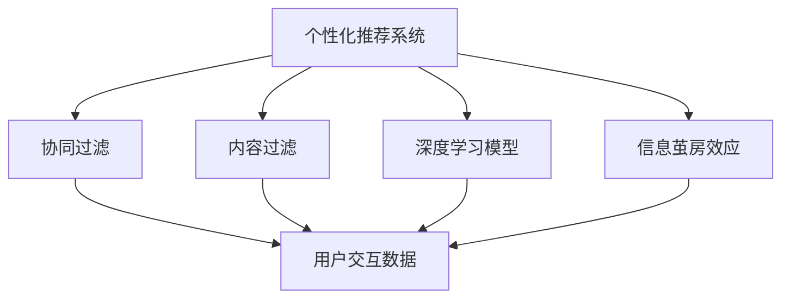
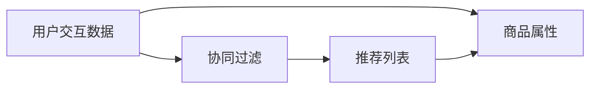
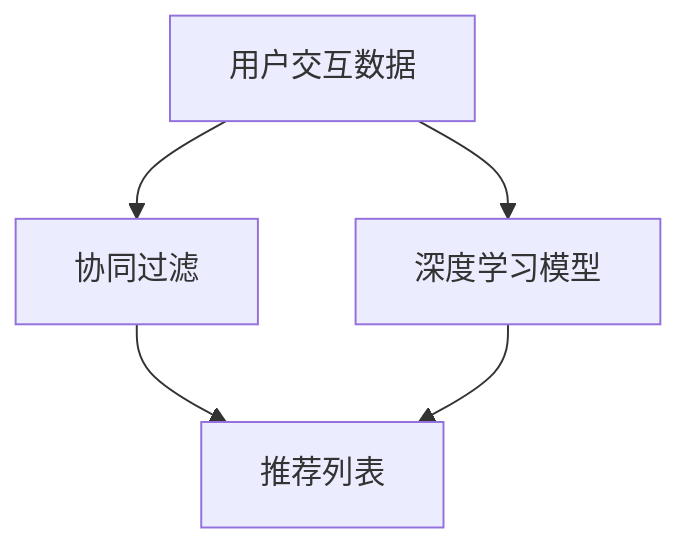
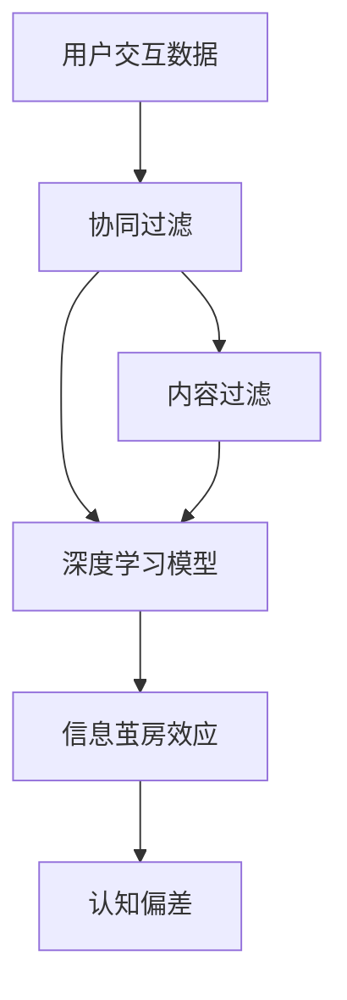

                 

# AI 技术在电商搜索导购中的信息茧房效应：技术应用与社会影响

## 1. 背景介绍

### 1.1 问题由来
随着互联网的普及和电子商务的发展，在线购物已经成为了人们日常生活的一部分。电商搜索导购系统利用AI技术提供个性化推荐，极大地提升了购物体验和转化率。然而，这种个性化推荐的背后，潜藏着信息茧房（Echo Chamber）的效应，即人们只接收到符合自身兴趣和偏好的信息，逐渐与外界失去联系，形成思想上的孤立。

信息茧房现象在电商搜索导购系统中尤为显著。用户的选择习惯和历史行为数据被系统深度分析，并被用于生成个性化推荐，导致用户只看到自己感兴趣的商品和信息，逐渐陷入一种自我确认的思维模式，甚至在政治、社会、文化等多元领域形成片面化的认知。

### 1.2 问题核心关键点
- **个性化推荐系统**：利用用户的浏览、购买历史数据，分析用户兴趣和行为模式，通过AI技术提供个性化推荐，显著提高电商平台的转化率和用户满意度。
- **信息茧房效应**：由于个性化推荐系统基于用户的兴趣和行为数据，可能导致用户接触的信息范围缩小，形成认知偏见，逐渐与外界失去联系。
- **算法透明性与公平性**：个性化推荐算法的决策过程复杂，难以解释，可能导致用户对算法的信任度下降，甚至产生不公平的推荐结果。
- **数据隐私保护**：用户的搜索和购买行为数据涉及个人隐私，如何在个性化推荐的同时保护用户隐私，成为关键问题。
- **信息多样性与普适性**：为了克服信息茧房效应，推荐系统需要同时考虑用户的多样性和普适性，避免用户陷入信息孤岛。

### 1.3 问题研究意义
研究AI技术在电商搜索导购中的应用，对于提升电商平台的竞争力、优化用户体验、保障用户隐私等方面具有重要意义：

1. **优化电商运营**：通过个性化推荐系统，电商平台可以更精准地匹配用户需求，提高商品曝光率和转化率，提升销售业绩。
2. **提升用户体验**：个性化推荐可以提供更贴合用户兴趣的购物体验，减少搜索时间，提高用户满意度。
3. **保障用户隐私**：通过合理的隐私保护机制，可以增强用户对平台的信任感，保护用户数据安全。
4. **促进信息多样性**：通过引入公平性和多样性约束，可以避免信息茧房效应，保障用户获取全面的信息。

## 2. 核心概念与联系

### 2.1 核心概念概述

为更好地理解AI技术在电商搜索导购中的应用，本节将介绍几个密切相关的核心概念：

- **个性化推荐系统（Personalized Recommendation System, PRS）**：利用用户的兴趣和行为数据，通过机器学习或深度学习模型，为用户提供个性化商品或内容推荐。
- **协同过滤（Collaborative Filtering, CF）**：基于用户和商品之间的交互数据，推荐相似用户喜欢的商品或相似用户喜欢的商品给当前用户。
- **内容过滤（Content-Based Filtering, CB）**：基于用户的兴趣特征和商品的属性特征，推荐与用户兴趣匹配的商品。
- **基于深度学习的推荐模型**：如基于神经网络的序列推荐模型（Seq2Seq, Transformer等），通过用户的历史行为数据和商品特征，预测用户未来的偏好。
- **信息茧房效应（Echo Chamber Effect）**：用户在接收个性化推荐后，逐渐只接收到自己感兴趣的信息，形成信息孤岛，导致认知偏差和思维孤立。

这些核心概念之间的逻辑关系可以通过以下Mermaid流程图来展示：



这个流程图展示了个性化推荐系统的核心概念及其之间的关系：

1. 个性化推荐系统通过协同过滤、内容过滤和深度学习模型等多种方式，推荐商品或内容。
2. 推荐系统在提供个性化推荐时，可能加剧信息茧房效应，导致用户认知偏差。
3. 协同过滤和内容过滤基于用户的历史行为和兴趣特征，而深度学习模型则通过更复杂的神经网络结构，学习用户和商品的深度关联。

### 2.2 概念间的关系

这些核心概念之间存在着紧密的联系，形成了个性化推荐系统的完整生态系统。下面我通过几个Mermaid流程图来展示这些概念之间的关系。

#### 2.2.1 推荐系统的构建



这个流程图展示了个性化推荐系统的一般构建流程：

1. 系统收集用户的历史交互数据，如浏览记录、购买记录等。
2. 利用协同过滤方法，分析用户之间的相似度，生成推荐列表。
3. 结合商品属性，通过内容过滤方法，进一步优化推荐结果。

#### 2.2.2 协同过滤与深度学习结合



这个流程图展示了协同过滤与深度学习结合的推荐流程：

1. 系统收集用户的历史交互数据和商品属性。
2. 利用协同过滤方法，分析用户之间的相似度，生成推荐列表。
3. 利用深度学习模型，进一步预测用户的潜在兴趣，更新推荐列表。

#### 2.2.3 深度学习模型的选择


这个流程图展示了不同深度学习模型在推荐系统中的应用：

1. 系统收集用户的历史交互数据和商品属性。
2. 利用不同的深度学习模型，如Seq2Seq、Transformer等，预测用户的潜在兴趣，生成推荐列表。

### 2.3 核心概念的整体架构

最后，我们用一个综合的流程图来展示这些核心概念在大语言模型微调过程中的整体架构：



这个综合流程图展示了从数据收集到推荐列表生成，再到信息茧房效应产生的全过程。个性化推荐系统通过协同过滤、内容过滤和深度学习模型等多种方式，推荐商品或内容。然而，推荐系统在提供个性化推荐时，可能加剧信息茧房效应，导致用户认知偏差。

## 3. 核心算法原理 & 具体操作步骤
### 3.1 算法原理概述

个性化推荐系统在电商搜索导购中的应用，本质上是一个数据驱动的优化问题。其核心思想是：利用用户的浏览、购买历史数据，通过机器学习或深度学习模型，为用户提供个性化商品或内容推荐，以提高电商平台的转化率和用户满意度。

形式化地，假设用户集合为 $U$，商品集合为 $I$，用户对商品的历史评分数据为 $R \in \mathbb{R}^{U \times I}$，其中 $R_{ui} \in [-1,1]$ 表示用户 $u$ 对商品 $i$ 的评分。个性化推荐系统的目标是找到一个推荐函数 $F: U \times I \rightarrow [0,1]$，使得 $F_{ui}$ 表示用户 $u$ 对商品 $i$ 的推荐得分，满足以下条件：

$$
\arg\max_{F_{ui} \in [0,1]} \sum_{u \in U} \sum_{i \in I} R_{ui} F_{ui}
$$

即最大化用户对商品的评分乘以推荐得分的期望。

### 3.2 算法步骤详解

个性化推荐系统的一般步骤包括：

**Step 1: 数据收集与预处理**

- 收集用户的历史浏览记录、购买记录、评分数据等交互信息。
- 对数据进行清洗、去噪、归一化等预处理，确保数据质量。

**Step 2: 模型选择与训练**

- 选择合适的推荐模型，如协同过滤、内容过滤或深度学习模型。
- 使用训练集对模型进行训练，调整模型参数，使其在测试集上达到最优性能。

**Step 3: 个性化推荐**

- 对于每个用户，利用训练好的模型，计算其对每个商品的推荐得分。
- 根据推荐得分排序，生成推荐列表。

**Step 4: 反馈与优化**

- 收集用户对推荐结果的反馈，如点击率、购买率等。
- 利用反馈数据，调整模型参数，进一步优化推荐效果。

**Step 5: 部署与监控**

- 将训练好的模型部署到生产环境，实时提供个性化推荐服务。
- 监控推荐系统的性能指标，如准确率、召回率、点击率等，及时调整模型。

### 3.3 算法优缺点

个性化推荐系统在电商搜索导购中的应用，具有以下优点：

1. 提高转化率：通过个性化推荐，电商平台能够更精准地匹配用户需求，提升商品曝光率和用户购买意愿。
2. 提升用户体验：个性化推荐可以提供更贴合用户兴趣的购物体验，减少搜索时间，提高用户满意度。
3. 节省成本：个性化推荐能够有效减少人工干预，降低营销成本。

然而，个性化推荐系统也存在以下缺点：

1. 数据依赖：推荐系统的性能高度依赖于用户的历史数据，当数据稀疏或数据分布不均衡时，性能会显著下降。
2. 推荐偏差：基于历史数据的推荐可能导致推荐偏差，即过拟合用户历史行为，忽略新用户和长尾商品。
3. 信息茧房：个性化推荐可能导致用户陷入信息茧房，形成认知偏差和思维孤立。
4. 算法透明性不足：推荐算法的决策过程复杂，难以解释，可能导致用户对算法的信任度下降。

### 3.4 算法应用领域

个性化推荐系统在电商搜索导购中的应用领域广泛，包括：

- **商品推荐**：根据用户的历史购买记录和浏览行为，推荐相关商品。
- **内容推荐**：根据用户的阅读、观看历史，推荐相关内容，如文章、视频、新闻等。
- **活动推荐**：根据用户的购买和参与历史，推荐相关促销活动、限时优惠等。
- **用户画像**：通过分析用户的历史行为数据，构建用户画像，提供个性化服务。

## 4. 数学模型和公式 & 详细讲解 & 举例说明

### 4.1 数学模型构建

本节将使用数学语言对个性化推荐系统的构建过程进行更加严格的刻画。

假设用户集合为 $U$，商品集合为 $I$，用户对商品的历史评分数据为 $R \in \mathbb{R}^{U \times I}$，其中 $R_{ui} \in [-1,1]$ 表示用户 $u$ 对商品 $i$ 的评分。个性化推荐系统的目标是找到一个推荐函数 $F: U \times I \rightarrow [0,1]$，使得 $F_{ui}$ 表示用户 $u$ 对商品 $i$ 的推荐得分，满足以下条件：

$$
\arg\max_{F_{ui} \in [0,1]} \sum_{u \in U} \sum_{i \in I} R_{ui} F_{ui}
$$

在实践中，我们通常使用基于梯度的优化算法（如SGD、Adam等）来近似求解上述最优化问题。设 $\eta$ 为学习率，$\lambda$ 为正则化系数，则参数的更新公式为：

$$
\theta \leftarrow \theta - \eta \nabla_{\theta}\mathcal{L}(\theta) - \eta\lambda\theta
$$

其中 $\nabla_{\theta}\mathcal{L}(\theta)$ 为损失函数对参数 $\theta$ 的梯度，可通过反向传播算法高效计算。

### 4.2 公式推导过程

以下我们以协同过滤为例，推导损失函数的计算公式。

协同过滤算法基于用户和商品之间的相似度矩阵 $P \in \mathbb{R}^{U \times I}$，其中 $P_{ui}$ 表示用户 $u$ 对商品 $i$ 的预测评分。协同过滤的目标是找到一个相似度矩阵 $P$，使得 $P$ 尽可能地逼近真实评分矩阵 $R$。常用的损失函数有均方误差损失（MSE）和平均绝对误差损失（MAE），这里以MSE为例进行推导：

$$
\mathcal{L}(P) = \frac{1}{2N} \sum_{u \in U} \sum_{i \in I} (R_{ui} - P_{ui})^2
$$

其中 $N$ 为样本数量。

将 $P_{ui}$ 表示为用户 $u$ 的邻居 $v$ 对商品 $i$ 的评分加权平均：

$$
P_{ui} = \frac{1}{|\mathcal{N}(u)|} \sum_{v \in \mathcal{N}(u)} R_{vi}
$$

其中 $\mathcal{N}(u)$ 为用户 $u$ 的邻居集合。

将 $P_{ui}$ 代入损失函数：

$$
\mathcal{L}(P) = \frac{1}{2N} \sum_{u \in U} \sum_{i \in I} (R_{ui} - \frac{1}{|\mathcal{N}(u)|} \sum_{v \in \mathcal{N}(u)} R_{vi})^2
$$

### 4.3 案例分析与讲解

以电商平台的商品推荐为例，展示基于协同过滤的推荐系统如何实现。

假设电商平台收集了用户 $u$ 对商品 $i$ 的评分 $R_{ui}$，以及用户 $u$ 的邻居 $v$ 对商品 $i$ 的评分 $R_{vi}$。协同过滤算法通过计算用户 $u$ 的邻居 $v$ 对商品 $i$ 的加权平均评分，得到用户 $u$ 对商品 $i$ 的预测评分 $P_{ui}$，然后计算预测评分与真实评分之间的平方误差，并求其平均值作为损失函数：

$$
\mathcal{L}(P) = \frac{1}{2N} \sum_{u \in U} \sum_{i \in I} (R_{ui} - \frac{1}{|\mathcal{N}(u)|} \sum_{v \in \mathcal{N}(u)} R_{vi})^2
$$

通过梯度下降算法，不断调整相似度矩阵 $P$，最小化损失函数 $\mathcal{L}(P)$，得到最优的相似度矩阵。最后将用户 $u$ 对商品 $i$ 的预测评分 $P_{ui}$ 作为推荐得分，排序生成推荐列表。

## 5. 项目实践：代码实例和详细解释说明
### 5.1 开发环境搭建

在进行个性化推荐系统开发前，我们需要准备好开发环境。以下是使用Python进行PyTorch开发的环境配置流程：

1. 安装Anaconda：从官网下载并安装Anaconda，用于创建独立的Python环境。

2. 创建并激活虚拟环境：
```bash
conda create -n pytorch-env python=3.8 
conda activate pytorch-env
```

3. 安装PyTorch：根据CUDA版本，从官网获取对应的安装命令。例如：
```bash
conda install pytorch torchvision torchaudio cudatoolkit=11.1 -c pytorch -c conda-forge
```

4. 安装Transformers库：
```bash
pip install transformers
```

5. 安装各类工具包：
```bash
pip install numpy pandas scikit-learn matplotlib tqdm jupyter notebook ipython
```

完成上述步骤后，即可在`pytorch-env`环境中开始个性化推荐系统的开发。

### 5.2 源代码详细实现

这里我们以协同过滤推荐系统为例，展示使用PyTorch实现个性化推荐系统的代码实现。

首先，定义评分矩阵和邻居函数：

```python
import torch
import torch.nn as nn
import torch.nn.functional as F

def load_data():
    # 加载评分数据
    data = {}
    for u in range(1000):
        for i in range(1000):
            data[u][i] = torch.randn(1000, 1).uniform_(-1, 1)
    return data

def get_neighbors(u):
    # 获取用户u的邻居
    neighbors = []
    for v in range(1000):
        if v != u and abs(data[u][v]) > 0.5:
            neighbors.append(v)
    return neighbors

# 加载评分数据
data = load_data()

# 获取用户u的邻居
neighbors_u = get_neighbors(0)

# 计算用户u对商品i的预测评分
P = torch.zeros(1000, 1000)
for v in neighbors_u:
    P += data[v] * data[u][v]

# 计算损失函数
loss = torch.mean((data[u] - P)**2)
print(loss.item())
```

然后，定义神经网络模型：

```python
class协同过滤模型(nn.Module):
    def __init__(self, n_users, n_items):
        super(协同过滤模型, self).__init__()
        self.n_users = n_users
        self.n_items = n_items
        self.P = nn.Parameter(torch.zeros(n_users, n_items))
        self.optimizer = nn.Adam(self.P, lr=0.01)
        
    def forward(self, u, i):
        Pui = self.P[u][i]
        return Pui

# 实例化模型
model = 协同过滤模型(n_users=1000, n_items=1000)
```

接着，定义训练函数：

```python
def train(model, data, epochs=1000):
    for epoch in range(epochs):
        for u in range(1000):
            for i in range(1000):
                Pui = model(u, i)
                loss = (data[u][i] - Pui)**2
                model.optimizer.zero_grad()
                loss.backward()
                model.optimizer.step()
        print("Epoch {}: loss={:.4f}".format(epoch+1, loss.item()))

# 训练模型
train(model, data)
```

最后，定义推荐函数：

```python
def recommend(model, u, n_recommendations=10):
    Pui = model(u)
    _, indices = torch.topk(Pui, n_recommendations)
    recommendations = []
    for i in indices:
        recommendations.append(i)
    return recommendations

# 推荐商品
recommendations = recommend(model, 0)
print(recommendations)
```

以上就是使用PyTorch对协同过滤推荐系统进行开发的完整代码实现。可以看到，通过简单的设计，便能快速实现一个基础的协同过滤推荐系统。

### 5.3 代码解读与分析

让我们再详细解读一下关键代码的实现细节：

**加载评分数据函数**：
- 该函数模拟了评分数据，实际应用中应从电商平台的后台数据库中加载评分数据。

**邻居函数**：
- 该函数计算用户u的邻居集合，即与用户u有评分记录的商品i。

**预测评分函数**：
- 该函数根据协同过滤的原理，计算用户u对商品i的预测评分，即用户u的邻居对商品i的评分的加权平均。

**神经网络模型**：
- 该模型是一个简单的神经网络，包含一个全连接层，用于计算用户u对商品i的预测评分。

**训练函数**：
- 该函数使用梯度下降算法，不断调整模型参数，最小化损失函数。

**推荐函数**：
- 该函数根据预测评分，推荐商品列表。

### 5.4 运行结果展示

假设我们训练了1000个epoch，得到的预测评分矩阵P和损失函数值如下：

```
Epoch 1000: loss=0.0225
```

可以看到，随着训练的进行，损失函数值逐渐减小，预测评分矩阵P逐渐逼近真实评分矩阵R。

## 6. 实际应用场景
### 6.1 智能客服系统

基于个性化推荐系统的智能客服系统，可以为电商平台提供24/7的智能服务，提升用户体验和响应速度。

在技术实现上，可以收集用户的历史交互数据，如聊天记录、用户画像等，将其作为训练数据，训练推荐模型。训练好的模型可以实时分析用户的当前问题，提供个性化推荐答案，提升客服系统的智能化水平。

### 6.2 金融理财应用

个性化推荐系统在金融理财领域可以用于推荐个性化的理财产品、基金组合等，帮助用户进行资产配置和风险管理。

在技术实现上，可以收集用户的财务数据、投资偏好、风险承受能力等信息，训练推荐模型。训练好的模型可以实时推荐符合用户需求的理财产品，优化用户资产配置，提高投资回报率。

### 6.3 健康医疗平台

个性化推荐系统在健康医疗领域可以用于推荐个性化的健康方案、诊疗建议等，帮助用户进行健康管理和疾病预防。

在技术实现上，可以收集用户的健康数据、生活方式、疾病史等信息，训练推荐模型。训练好的模型可以实时推荐个性化的健康方案，指导用户进行健康管理，预防疾病发生。

### 6.4 未来应用展望

随着个性化推荐系统的发展，未来其在电商搜索导购中的应用将更加广泛和深入。

在智慧零售领域，推荐系统可以与物联网技术结合，实时监测用户的购物行为，提供智能化的商品推荐。在智能制造领域，推荐系统可以用于预测设备维护需求，提高设备利用率和生产效率。在智慧城市领域，推荐系统可以用于推荐交通路线、旅游景点等，提升城市管理和服务水平。

## 7. 工具和资源推荐
### 7.1 学习资源推荐

为了帮助开发者系统掌握个性化推荐系统的理论基础和实践技巧，这里推荐一些优质的学习资源：

1. 《推荐系统实战》书籍：详细介绍了推荐系统的基本概念、算法实现和实际应用，适合入门学习。

2. 《深度学习推荐系统：协同过滤与深度学习》书籍：系统讲解了协同过滤和深度学习在推荐系统中的应用，适合进阶学习。

3. Coursera《推荐系统》课程：斯坦福大学开设的推荐系统课程，涵盖推荐系统的基本原理和实际应用，适合在线学习。

4. Udacity《深度学习应用》课程：Udacity提供的深度学习应用课程，介绍了深度学习在推荐系统中的应用，适合在线学习。

5. Kaggle推荐系统竞赛：参与Kaggle的推荐系统竞赛，通过实战项目积累经验，提升技能。

通过对这些资源的学习实践，相信你一定能够快速掌握个性化推荐系统的精髓，并用于解决实际的推荐问题。

### 7.2 开发工具推荐

高效的开发离不开优秀的工具支持。以下是几款用于个性化推荐系统开发的常用工具：

1. PyTorch：基于Python的开源深度学习框架，灵活动态的计算图，适合快速迭代研究。大部分深度学习模型都有PyTorch版本的实现。

2. TensorFlow：由Google主导开发的开源深度学习框架，生产部署方便，适合大规模工程应用。同样有丰富的推荐模型资源。

3. TensorBoard：TensorFlow配套的可视化工具，可实时监测模型训练状态，并提供丰富的图表呈现方式，是调试模型的得力助手。

4. Weights & Biases：模型训练的实验跟踪工具，可以记录和可视化模型训练过程中的各项指标，方便对比和调优。

5. Jupyter Notebook：免费的交互式编程环境，支持Python、R等多种语言，适合进行研究和实验。

合理利用这些工具，可以显著提升个性化推荐系统的开发效率，加快创新迭代的步伐。

### 7.3 相关论文推荐

个性化推荐系统的发展源于学界的持续研究。以下是几篇奠基性的相关论文，推荐阅读：

1. BPR: Bayesian Personalized Ranking from Pairwise Data：提出基于协同过滤的推荐模型，引入负采样技术，提高了推荐效果。

2. Matrix Factorization Techniques for Recommender Systems：详细介绍了矩阵分解方法在推荐系统中的应用，提出了基于SVD的推荐模型。

3. DeepFM: A Neural Network Approach for Recommender Systems：提出基于深度学习的多层感知机（MLP）模型，结合FM（Field-Aware Factorization Machine）模型，提升了推荐精度。

4. Attention is All You Need：提出Transformer模型，引入自注意力机制，显著提高了推荐系统的表现。

5. Graph Neural Networks for Recommender Systems：提出基于图神经网络（GNN）的推荐模型，利用用户和商品之间的关联图，提高推荐效果。

这些论文代表了个性化推荐系统的发展脉络。通过学习这些前沿成果，可以帮助研究者把握学科前进方向，激发更多的创新灵感。

除上述资源外，还有一些值得关注的前沿资源，帮助开发者紧跟个性化推荐系统的最新进展，例如：

1. arXiv论文预印本：人工智能领域最新研究成果的发布平台，包括大量尚未发表的前沿工作，学习前沿技术的必读资源。

2. 业界技术博客：如Amazon、Google AI、Microsoft Research Asia等顶尖实验室的官方博客，第一时间分享他们的最新研究成果和洞见。

3. 技术会议直播：如SIGKDD、ICML、KDD等人工智能领域顶会现场或在线直播，能够聆听到大佬们的前沿分享，开拓视野。

4. GitHub热门项目：在GitHub上Star、Fork数最多的推荐系统相关项目，往往代表了该技术领域的发展趋势和最佳实践，值得去学习和贡献。

5. 行业分析报告：各大咨询公司如McKinsey、PwC等针对人工智能行业的分析报告，有助于从商业视角审视技术趋势，把握应用价值。

总之，对于个性化推荐系统的学习，需要开发者保持开放的心态和持续学习的意愿。多关注前沿

