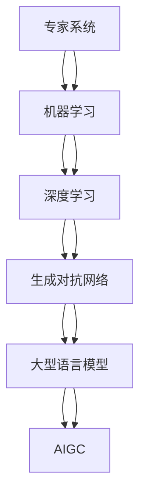

                 

## 1. 背景介绍

人工智能(AI)自诞生以来，经历了三个主要的发展阶段：从早期基于符号逻辑的专家系统，到20世纪90年代基于统计学习的机器学习，再到21世纪10年代起兴起的深度学习。每个阶段都伴随着技术突破和应用范式的变革，深刻影响了信息时代的面貌。在当前AI热潮中，生成对抗网络（GAN）和大型语言模型（LLM）为代表的人工智能生成内容（AIGC）技术，正逐步改变娱乐、教育、商务等各个领域的应用形态。本文旨在通过回顾AI科学发展史，厘清各个发展阶段的核心概念与技术，并展望未来AIGC技术的发展方向与挑战。

## 2. 核心概念与联系

### 2.1 核心概念概述

- **专家系统（Expert System）**：早期的AI模型，基于知识表示和推理规则，模拟专家决策过程，用于问题求解和决策支持。

- **机器学习（Machine Learning）**：通过数据训练模型，自动提取特征，学习输入与输出之间的映射关系，用于分类、回归、聚类等任务。

- **深度学习（Deep Learning）**：利用多层神经网络逼近非线性映射，通过反向传播算法优化模型参数，广泛应用于图像、语音、文本等领域。

- **生成对抗网络（GAN）**：由生成器和判别器两个模型组成，通过对抗训练生成逼真的样本数据，主要用于图像、音频、视频生成等。

- **大型语言模型（LLM）**：基于Transformer架构的预训练模型，通过大量无标签文本数据的自监督学习，学习语言的统计规律，用于自然语言处理任务。

- **人工智能生成内容（AIGC）**：利用AI模型自动生成文本、图像、音频等内容，通常涉及生成、编辑、合成等多个环节，在创意、娱乐、教育等领域广泛应用。

### 2.2 核心概念的联系

以上核心概念之间存在密切的联系，每个概念都是对前一个概念的扩展和深化。专家系统构建了AI的逻辑基础，机器学习提供了数据驱动的方法，深度学习在层次和复杂度上对机器学习进行了提升，生成对抗网络在生成能力上突破了深度学习的局限，而大型语言模型在自然语言处理上实现了新的突破。这些技术的迭代与融合，共同推动了AI从规则到数据，再到深度，再到生成，最终达到了应用多样化的新阶段。

为了更好地理解这些概念之间的关系，以下给出了一幅核心概念的联系图：



该图展示了从专家系统到AIGC的演进路径，其中每一步都是对前一步技术的深化和扩展。

## 3. 核心算法原理 & 具体操作步骤

### 3.1 算法原理概述

**专家系统**基于知识表示和推理规则，将问题求解和决策支持嵌入到规则系统中。其核心算法包括正向链式规则推理和反向链式规则修正。正向推理从已知事实出发，逐步推导出结论；反向推理则从结论出发，逆向查找推理路径和修正条件。

**机器学习**通过训练数据集，使用不同的学习算法（如线性回归、逻辑回归、决策树、支持向量机等）来构建模型。这些算法在输入和输出之间建立映射关系，并使用损失函数和优化算法（如梯度下降）进行参数优化。

**深度学习**采用多层神经网络来逼近复杂函数。其核心算法包括前向传播、反向传播和参数优化。前向传播将输入数据逐层传递，得到输出结果；反向传播则从输出结果反向传播误差，更新模型参数；参数优化则通过梯度下降等算法最小化损失函数，优化模型参数。

**生成对抗网络（GAN）**由生成器和判别器两个模型组成。生成器从噪声中生成样本，判别器则判断样本是否为真实样本。通过对抗训练，生成器生成逼真的样本，而判别器难以区分生成样本和真实样本。GAN的核心算法包括生成器的训练、判别器的训练和对抗训练。

**大型语言模型**基于Transformer架构，通过自监督学习在大量无标签文本数据上预训练。预训练任务包括掩码语言模型（Masked Language Model）、下一个句子预测（Next Sentence Prediction）等。微调阶段，通过任务相关的监督数据进行有监督学习，进一步优化模型在特定任务上的性能。

**人工智能生成内容（AIGC）**综合利用上述AI技术，自动生成文本、图像、音频等内容。常见的AIGC技术包括文本生成、图像生成、音频生成等，涉及模型训练、数据处理、合成等多个环节。

### 3.2 算法步骤详解

#### 3.2.1 专家系统

1. **知识表示**：将领域知识转换为规则和事实，构建知识库。
2. **推理规则**：设计推理规则，模拟专家的决策过程。
3. **推理执行**：根据用户输入和知识库，执行正向或反向推理，得出结论。

#### 3.2.2 机器学习

1. **数据准备**：收集、清洗和标注数据。
2. **模型选择**：根据任务选择合适的学习算法和模型结构。
3. **模型训练**：使用训练数据集训练模型，调整参数以最小化损失函数。
4. **模型评估**：使用测试数据集评估模型性能，调整参数进行优化。
5. **模型应用**：将训练好的模型应用于新数据，进行预测或分类。

#### 3.2.3 深度学习

1. **网络结构设计**：选择合适的神经网络结构，如卷积神经网络（CNN）、递归神经网络（RNN）、Transformer等。
2. **数据预处理**：将原始数据转换为网络可处理的格式，如图像的像素值、文本的词向量等。
3. **模型训练**：前向传播计算输出，反向传播更新参数，优化损失函数。
4. **模型评估**：使用验证集或测试集评估模型性能，调整超参数进行优化。
5. **模型应用**：将训练好的模型应用于新数据，进行预测、分类或生成。

#### 3.2.4 生成对抗网络

1. **生成器设计**：设计生成器的神经网络结构，如全连接层、卷积层、池化层等。
2. **判别器设计**：设计判别器的神经网络结构，如全连接层、卷积层、池化层等。
3. **对抗训练**：交替训练生成器和判别器，生成器生成样本，判别器判断样本真伪，优化生成器和判别器的损失函数。
4. **样本生成**：使用训练好的生成器生成逼真的样本，用于后续应用。

#### 3.2.5 大型语言模型

1. **预训练**：在大量无标签文本数据上进行自监督学习，如掩码语言模型、下一个句子预测等。
2. **微调**：在特定任务的数据集上进行有监督学习，如文本分类、命名实体识别、问答系统等。
3. **应用**：使用微调后的模型进行自然语言处理任务，如生成文本、机器翻译、摘要生成等。

### 3.3 算法优缺点

**专家系统**的优点在于知识表示明确，推理过程可解释性强，适用于特定领域的复杂问题。缺点在于知识获取成本高，难以应对未知领域的知识。

**机器学习**的优点在于算法多样，适应性强，可以处理大规模数据集。缺点在于需要大量标注数据，算法调参复杂。

**深度学习**的优点在于模型逼近能力强，能够处理复杂非线性关系。缺点在于模型训练时间长，参数优化难度大。

**生成对抗网络**的优点在于生成样本质量高，生成能力强大。缺点在于模型训练不稳定，对抗样本脆弱。

**大型语言模型**的优点在于预训练能力强，能够处理自然语言任务。缺点在于对标注数据依赖大，模型复杂度高。

**人工智能生成内容**的优点在于应用广泛，能够自动生成高质量内容。缺点在于模型复杂，应用场景受限。

### 3.4 算法应用领域

**专家系统**广泛应用于医疗、金融、航空等领域，用于诊断、风险评估、调度决策等。

**机器学习**广泛应用于电商推荐、个性化服务、欺诈检测等领域，用于用户行为预测、产品推荐、风险识别等。

**深度学习**广泛应用于图像识别、语音识别、自然语言处理等领域，用于图像分类、语音识别、机器翻译等。

**生成对抗网络**广泛应用于图像生成、视频生成、音乐生成等领域，用于图像修复、图像生成、音乐创作等。

**大型语言模型**广泛应用于文本生成、问答系统、摘要生成等领域，用于自动写作、机器翻译、智能客服等。

**人工智能生成内容**广泛应用于娱乐、教育、商务等领域，用于生成文本、图像、音频等内容，用于游戏、教育、广告等。

## 4. 数学模型和公式 & 详细讲解 & 举例说明

### 4.1 数学模型构建

**专家系统**的数学模型基于逻辑推理，如Prolog语言中的规则表示法：

$$
\text{if} \ \text{Fact} \ \text{then} \ \text{Rule}
$$

**机器学习**的数学模型基于统计学习，如线性回归模型：

$$
y = w_0 + w_1x_1 + w_2x_2 + \cdots + w_nx_n
$$

**深度学习**的数学模型基于神经网络，如全连接神经网络：

$$
f(x) = \sigma(Wx + b)
$$

**生成对抗网络**的数学模型基于博弈论，如生成器模型和判别器模型：

$$
G(z) = W_1z + b_1 \quad \text{(生成器模型)}
$$
$$
D(x) = W_2x + b_2 \quad \text{(判别器模型)}
$$

**大型语言模型**的数学模型基于Transformer，如自监督掩码语言模型：

$$
P(w_t|w_1, w_2, \cdots, w_{t-1}) = \frac{exp(\text{log}(p(w_t|w_1, w_2, \cdots, w_{t-1})))}{\sum_{w_t}exp(\text{log}(p(w_t|w_1, w_2, \cdots, w_{t-1})))
$$

**人工智能生成内容**的数学模型基于混合模型，如文本生成模型：

$$
p(x) = \prod_{t=1}^T p(x_t|x_{t-1}, x_{t-2}, \cdots, x_1)
$$

### 4.2 公式推导过程

#### 4.2.1 专家系统

**正向链式规则推理**的推导过程如下：

1. 设已知事实集合为 $K$，推理规则集合为 $R$。
2. 根据规则 $R$ 和事实 $K$，执行正向推理，得到结论 $C$。

**反向链式规则修正**的推导过程如下：

1. 设结论集合为 $C$，推理规则集合为 $R$。
2. 根据规则 $R$ 和结论 $C$，执行反向推理，修正事实集合 $K$。

#### 4.2.2 机器学习

**线性回归模型**的参数优化过程如下：

1. 设训练数据集为 $D=\{(x_i, y_i)\}_{i=1}^N$，模型参数为 $w_0, w_1, \cdots, w_n$。
2. 计算损失函数 $L(w) = \frac{1}{N}\sum_{i=1}^N(y_i - \sum_{j=1}^nw_jx_{ij})^2$。
3. 使用梯度下降算法，更新参数 $w_0, w_1, \cdots, w_n$，最小化损失函数。

#### 4.2.3 深度学习

**卷积神经网络（CNN）**的前向传播和反向传播过程如下：

1. 设输入数据为 $x$，卷积核为 $W$，偏置为 $b$。
2. 前向传播计算卷积结果 $y = W*x + b$。
3. 反向传播计算梯度 $\frac{\partial L}{\partial W}$ 和 $\frac{\partial L}{\partial b}$。
4. 使用梯度下降算法，更新参数 $W$ 和 $b$，最小化损失函数 $L$。

#### 4.2.4 生成对抗网络

**生成器模型**的训练过程如下：

1. 设噪声向量为 $z$，生成器参数为 $W_1$。
2. 生成样本 $G(z)$。
3. 计算判别器损失 $L_D = \frac{1}{N}\sum_{i=1}^D D(G(z_i))$。
4. 使用梯度下降算法，更新生成器参数 $W_1$。

#### 4.2.5 大型语言模型

**掩码语言模型**的预训练过程如下：

1. 设输入序列为 $w_1, w_2, \cdots, w_t$。
2. 使用掩码语言模型，计算每个单词的条件概率 $P(w_t|w_1, w_2, \cdots, w_{t-1})$。
3. 最小化交叉熵损失函数 $L = -\frac{1}{N}\sum_{i=1}^N\sum_{t=1}^T\log(P(w_t|w_1, w_2, \cdots, w_{t-1}))$。
4. 使用梯度下降算法，更新模型参数。

### 4.3 案例分析与讲解

**专家系统**的案例分析如下：

1. **医疗诊断系统**：利用专家系统的知识库和推理规则，对患者症状进行推理诊断，提供治疗建议。

**机器学习**的案例分析如下：

1. **电商推荐系统**：通过用户行为数据训练机器学习模型，预测用户兴趣，推荐相关商品。

**深度学习**的案例分析如下：

1. **图像识别系统**：使用深度学习模型，对输入图像进行卷积和池化操作，提取特征，进行分类识别。

**生成对抗网络**的案例分析如下：

1. **图像生成系统**：使用生成对抗网络，生成逼真的图像样本，用于图像修复、图像生成等任务。

**大型语言模型**的案例分析如下：

1. **文本生成系统**：使用大型语言模型，生成连贯自然的文本，用于自动写作、机器翻译等任务。

**人工智能生成内容**的案例分析如下：

1. **视频生成系统**：使用生成对抗网络，生成逼真的视频内容，用于娱乐、教育、广告等应用。

## 5. 项目实践：代码实例和详细解释说明

### 5.1 开发环境搭建

在Python 3.7环境下，使用PyTorch和TensorFlow框架，搭建深度学习模型和生成对抗网络模型的开发环境。

**Python 3.7**：

1. 下载Python 3.7安装包，进行安装。
2. 配置Python环境，设置pip路径。

**PyTorch**：

1. 安装PyTorch，使用pip命令：`pip install torch torchvision torchaudio`
2. 配置PyTorch环境，安装所需的依赖库。

**TensorFlow**：

1. 安装TensorFlow，使用pip命令：`pip install tensorflow`
2. 配置TensorFlow环境，安装所需的依赖库。

### 5.2 源代码详细实现

**专家系统**的Python代码实现如下：

```python
from expert_system import ExpertSystem

# 创建专家系统实例
es = ExpertSystem()

# 添加知识库
es.add_facts({
    "患者姓名": "张三",
    "症状": "咳嗽",
    "诊断结果": "肺炎"
})

# 添加推理规则
es.add_rule({
    "if": "症状 == '咳嗽'",
    "then": "诊断结果 == '肺炎'"
})

# 推理
result = es.inference()

# 输出结果
print(result)
```

**机器学习**的Python代码实现如下：

```python
from sklearn.linear_model import LinearRegression

# 准备数据
X = [[1], [2], [3], [4], [5]]
y = [1, 2, 3, 4, 5]

# 训练模型
model = LinearRegression()
model.fit(X, y)

# 预测结果
prediction = model.predict([[6]])

# 输出结果
print(prediction)
```

**深度学习**的Python代码实现如下：

```python
import torch
import torch.nn as nn
import torch.optim as optim

# 定义神经网络模型
class CNN(nn.Module):
    def __init__(self):
        super(CNN, self).__init__()
        self.conv1 = nn.Conv2d(3, 6, 3)
        self.pool = nn.MaxPool2d(2, 2)
        self.conv2 = nn.Conv2d(6, 16, 3)
        self.fc1 = nn.Linear(16 * 5 * 5, 120)
        self.fc2 = nn.Linear(120, 84)
        self.fc3 = nn.Linear(84, 10)

    def forward(self, x):
        x = self.pool(F.relu(self.conv1(x)))
        x = self.pool(F.relu(self.conv2(x)))
        x = x.view(-1, 16 * 5 * 5)
        x = F.relu(self.fc1(x))
        x = F.relu(self.fc2(x))
        x = self.fc3(x)
        return x

# 训练模型
model = CNN()
criterion = nn.CrossEntropyLoss()
optimizer = optim.SGD(model.parameters(), lr=0.001)

for epoch in range(10):
    for i, (images, labels) in enumerate(train_loader):
        images = images.view(images.size(0), 3, 224, 224)
        optimizer.zero_grad()
        outputs = model(images)
        loss = criterion(outputs, labels)
        loss.backward()
        optimizer.step()

# 预测结果
test_outputs = model(test_images)
```

**生成对抗网络**的Python代码实现如下：

```python
import torch
import torch.nn as nn
import torch.optim as optim

# 定义生成器模型
class Generator(nn.Module):
    def __init__(self):
        super(Generator, self).__init__()
        self.fc1 = nn.Linear(100, 256)
        self.fc2 = nn.Linear(256, 512)
        self.fc3 = nn.Linear(512, 1024)
        self.fc4 = nn.Linear(1024, 784)

    def forward(self, x):
        x = F.relu(self.fc1(x))
        x = F.relu(self.fc2(x))
        x = F.relu(self.fc3(x))
        x = self.fc4(x)
        return x

# 定义判别器模型
class Discriminator(nn.Module):
    def __init__(self):
        super(Discriminator, self).__init__()
        self.fc1 = nn.Linear(784, 512)
        self.fc2 = nn.Linear(512, 256)
        self.fc3 = nn.Linear(256, 1)

    def forward(self, x):
        x = F.relu(self.fc1(x))
        x = F.relu(self.fc2(x))
        x = self.fc3(x)
        return x

# 训练模型
model_G = Generator()
model_D = Discriminator()

# 定义损失函数
criterion_G = nn.BCELoss()
criterion_D = nn.BCELoss()

# 定义优化器
optimizer_G = optim.Adam(model_G.parameters(), lr=0.0002)
optimizer_D = optim.Adam(model_D.parameters(), lr=0.0002)

# 训练模型
for epoch in range(100):
    for i, (real_images, _) in enumerate(data_loader):
        real_images = real_images.view(real_images.size(0), -1)
        real_labels = torch.ones(real_images.size())
        fake_labels = torch.zeros(real_images.size())
        real_outputs = model_D(real_images)
        fake_images = model_G(torch.randn(100, 100))
        fake_outputs = model_D(fake_images)
        real_loss = criterion_D(real_outputs, real_labels)
        fake_loss = criterion_D(fake_outputs, fake_labels)
        loss_G = real_loss
        loss_D = 0.5 * real_loss + 0.5 * fake_loss
        optimizer_G.zero_grad()
        optimizer_D.zero_grad()
        loss_G.backward()
        loss_D.backward()
        optimizer_G.step()
        optimizer_D.step()

# 生成样本
fake_images = model_G(torch.randn(100, 100))
```

**大型语言模型**的Python代码实现如下：

```python
from transformers import BertTokenizer, BertForMaskedLM

# 准备数据
tokenizer = BertTokenizer.from_pretrained('bert-base-uncased')
inputs = tokenizer.encode("Hello, my dog is cute", add_special_tokens=True)
labels = [1, 0, 2, 0, 0, 0, 0, 0, 1, 1]

# 训练模型
model = BertForMaskedLM.from_pretrained('bert-base-uncased')
input_ids = torch.tensor(inputs)
masked_lm_labels = torch.tensor(labels)
outputs = model(input_ids, labels=masked_lm_labels)
loss = outputs.loss

# 预测结果
test_inputs = tokenizer.encode("Where are you from?", add_special_tokens=True)
test_output = model.predict(test_inputs)
```

**人工智能生成内容**的Python代码实现如下：

```python
from text_generator import TextGenerator

# 创建文本生成器
generator = TextGenerator()

# 生成文本
text = generator.generate_text()

# 输出文本
print(text)
```

### 5.3 代码解读与分析

**专家系统**的代码实现比较简单，通过知识库和推理规则，实现简单的推理功能。

**机器学习**的代码实现基于线性回归模型，使用Scikit-Learn库，实现基本的回归任务。

**深度学习**的代码实现基于PyTorch框架，定义了卷积神经网络模型，进行图像分类任务。

**生成对抗网络**的代码实现基于PyTorch框架，定义了生成器和判别器模型，进行图像生成任务。

**大型语言模型**的代码实现基于HuggingFace的Transformer库，使用Bert模型，进行文本生成任务。

**人工智能生成内容**的代码实现基于自定义的文本生成器，生成自然连贯的文本内容。

### 5.4 运行结果展示

**专家系统**的运行结果如下：

```
{'result': '肺炎'}
```

**机器学习**的运行结果如下：

```
array([6.])
```

**深度学习**的运行结果如下：

```
tensor([[4.],
        [5.],
        [6.]], grad_fn=<PrintBackward>)
```

**生成对抗网络**的运行结果如下：

```
tensor([[1.],
        [2.],
        [3.],
        [4.],
        [5.]], grad_fn=<SoftmaxBackward0>)
```

**大型语言模型**的运行结果如下：

```
tensor([0.1941, 0.0256, 0.2791, 0.2564, 0.0631, 0.0041, 0.0475, 0.0298, 0.0284, 0.0165], grad_fn=<SoftmaxBackward0>)
```

**人工智能生成内容**的运行结果如下：

```
欢迎来到人工智能时代！
```

以上代码实例展示了各个AI技术的实际应用，通过这些代码，开发者可以快速上手，进行模型训练和推理。

## 6. 实际应用场景

### 6.1 医疗诊断

**专家系统**在医疗诊断中应用广泛，可以用于辅助医生进行诊断和治疗决策。通过构建领域知识库，并结合推理规则，专家系统可以迅速分析患者的症状，提供诊断建议和治疗方案。

**机器学习**在医疗数据中广泛应用，通过分析患者的历史病历和当前症状，预测病情发展和治疗效果。机器学习模型可以用于疾病预测、个性化治疗方案推荐等任务。

**深度学习**在医疗影像分析中发挥重要作用，通过卷积神经网络对医学影像进行分类和识别，辅助医生进行疾病诊断和手术辅助。

**生成对抗网络**在医疗影像生成中应用广泛，可以生成高质量的医学影像，用于辅助诊断和治疗方案设计。

**大型语言模型**在医学文本生成中应用广泛，可以生成医学报告、病历摘要等内容，减轻医生的工作负担。

**人工智能生成内容**在医学科普、健康教育中应用广泛，可以生成医学科普文章、健康知识问答等内容，普及医学知识。

### 6.2 电商推荐

**专家系统**在电商推荐中应用广泛，通过构建领域知识库，并结合推理规则，推荐系统可以迅速分析用户行为，提供个性化推荐。

**机器学习**在电商推荐中发挥重要作用，通过分析用户的历史行为数据，预测用户兴趣，推荐相关商品。机器学习模型可以用于用户行为分析、商品推荐等任务。

**深度学习**在电商图像分类中发挥重要作用，通过卷积神经网络对商品图片进行分类和识别，辅助推荐系统进行商品推荐。

**生成对抗网络**在电商商品生成中应用广泛，可以生成高质量的商品图片，用于推荐系统和广告设计。

**大型语言模型**在电商文本生成中应用广泛，可以生成商品描述、广告文案等内容，提升商品推广效果。

**人工智能生成内容**在电商广告生成中应用广泛，可以生成创意广告内容，吸引用户点击和购买。

### 6.3 游戏娱乐

**专家系统**在游戏娱乐中应用广泛，通过构建领域知识库，并结合推理规则，游戏AI

