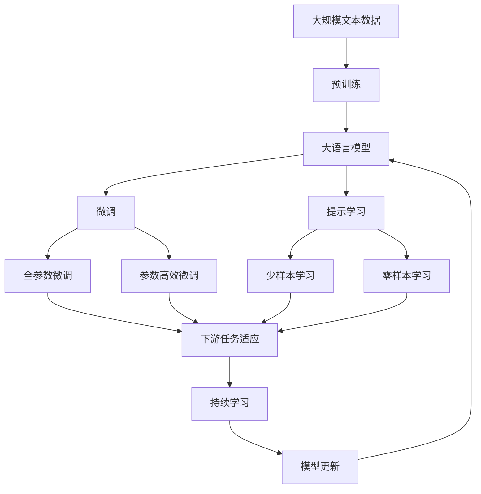

                 

# AI人工智能代理工作流 AI Agent WorkFlow：在新零售中的应用

> 关键词：AI代理、工作流管理、新零售、业务流程自动化、机器学习

## 1. 背景介绍

### 1.1 问题由来
随着数字化转型的深入，传统零售行业正面临着诸多挑战：
- **供需不匹配**：市场快速变化，供应链无法实时响应。
- **渠道割裂**：线上线下渠道各自为政，用户体验不佳。
- **库存积压**：库存管理不善，导致资金占用和资源浪费。
- **顾客流失**：顾客忠诚度低，流失率高。

为应对这些问题，零售企业需要构建智能化的业务流程，实现高效的运营管理。AI人工智能代理工作流(AI Agent Workflow)应运而生，成为新零售时代的重要利器。

### 1.2 问题核心关键点
AI代理工作流是一种通过AI模型驱动的流程自动化技术，旨在实现业务的智能化和自动化。其主要核心点包括：
1. **智能化决策**：利用机器学习和数据分析，实现高效、精确的业务决策。
2. **自动执行**：通过工作流引擎，自动执行预设的业务流程，减少人工干预。
3. **透明追踪**：实时监控和记录业务执行过程，提供可视化的管理视角。
4. **弹性调整**：根据业务需求，灵活调整工作流策略和参数，适应市场变化。

AI代理工作流在新零售中的应用，具体体现在以下几个方面：
- **供应链管理**：预测需求、优化库存、智能采购等。
- **营销策略**：精准营销、用户画像分析、个性化推荐等。
- **客户服务**：智能客服、需求分析、售后服务等。
- **运营管理**：质量控制、流程优化、绩效评估等。

AI代理工作流通过将复杂的业务流程自动化，不仅提高了运营效率，还降低了运营成本，增强了市场竞争力。

### 1.3 问题研究意义
在新零售领域，AI代理工作流的研究意义重大：
1. **提升运营效率**：通过自动化和智能化决策，减少人工操作，提升运营效率。
2. **优化资源配置**：通过数据分析，优化库存、人力资源等资源配置，提高资源利用率。
3. **增强客户体验**：通过个性化推荐和智能客服，提升客户满意度，增强顾客忠诚度。
4. **降低运营成本**：通过流程自动化，减少人工错误和冗余，降低运营成本。
5. **应对市场变化**：通过实时调整工作流策略，灵活应对市场变化，保持竞争优势。

## 2. 核心概念与联系

### 2.1 核心概念概述

为更好地理解AI代理工作流及其在新零售中的应用，本节将介绍几个关键概念：

- **AI代理(AI Agent)**：一种具有自主决策能力的智能实体，能够在特定任务上自动执行复杂的操作。
- **工作流管理(Workflow Management)**：对业务流程进行定义、编排和监控的技术，旨在提高流程效率和透明度。
- **新零售(New Retail)**：结合线上线下，融合多种渠道和资源，实现全渠道、全场景的零售模式。
- **业务流程自动化(Business Process Automation, BPA)**：通过技术手段，自动执行和管理业务流程，减少人工干预。
- **机器学习(Machine Learning)**：通过数据训练模型，使AI代理能够进行自主学习，提高决策和执行能力。
- **数据驱动决策(Data-Driven Decision Making)**：利用大数据和机器学习，支持业务决策，提高决策质量。

这些核心概念之间的逻辑关系可以通过以下Mermaid流程图来展示：

```mermaid
graph TB
    A[AI代理(AI Agent)] --> B[工作流管理(Workflow Management)]
    A --> C[业务流程自动化(BPA)]
    A --> D[机器学习(Machine Learning)]
    A --> E[数据驱动决策(Data-Driven Decision Making)]
    B --> C
    B --> D
    B --> E
    C --> F[智能化决策]
    C --> G[自动执行]
    C --> H[透明追踪]
    C --> I[弹性调整]
    D --> J[自主学习]
    D --> K[模型训练]
    E --> L[决策支持]
    F --> J
    G --> K
    H --> L
    I --> L
```

这个流程图展示了大语言模型微调过程中各个核心概念的关系：

1. AI代理通过业务流程自动化实现自动执行，通过工作流管理实现透明追踪和弹性调整。
2. 机器学习使AI代理具备自主学习能力，通过模型训练支持自主学习。
3. 数据驱动决策利用大数据和机器学习，支持智能化决策和决策支持。

这些概念共同构成了AI代理工作流的完整生态系统，使其能够在新零售中实现高效、精确的业务流程自动化。

### 2.2 概念间的关系

这些核心概念之间存在着紧密的联系，形成了AI代理工作流在新零售中的应用框架。下面我通过几个Mermaid流程图来展示这些概念之间的关系。

#### 2.2.1 AI代理与工作流管理的关系

```mermaid
graph LR
    A[AI代理(AI Agent)] --> B[工作流管理(Workflow Management)]
    B --> C[定义和编排]
    B --> D[监控和调整]
    A --> E[执行]
    A --> F[监控]
    A --> G[调整]
```

这个流程图展示了AI代理与工作流管理的关系：

1. 工作流管理负责定义和编排业务流程，监控执行过程和调整策略。
2. AI代理在定义好的流程框架内执行操作，并通过监控反馈调整自身行为。

#### 2.2.2 业务流程自动化与机器学习的关系

```mermaid
graph LR
    A[业务流程自动化(BPA)] --> B[机器学习(Machine Learning)]
    B --> C[模型训练]
    B --> D[决策支持]
    A --> E[智能化决策]
    A --> F[自动执行]
    A --> G[监控和调整]
```

这个流程图展示了业务流程自动化与机器学习的关系：

1. 机器学习通过模型训练，支持业务流程自动化的智能化决策和执行。
2. 业务流程自动化通过监控反馈调整自身策略，同时支持模型的训练和应用。

#### 2.2.3 数据驱动决策与AI代理的关系

```mermaid
graph LR
    A[数据驱动决策(Data-Driven Decision Making)] --> B[AI代理(AI Agent)]
    B --> C[自主学习]
    B --> D[智能化决策]
    B --> E[执行]
    A --> F[数据采集]
    A --> G[数据分析]
    A --> H[模型训练]
```

这个流程图展示了数据驱动决策与AI代理的关系：

1. 数据驱动决策通过数据采集、分析和模型训练，支持AI代理的自主学习和智能化决策。
2. AI代理通过自主学习和智能化决策，进一步优化数据驱动决策的效果。

### 2.3 核心概念的整体架构

最后，我们用一个综合的流程图来展示这些核心概念在大语言模型微调过程中的整体架构：



这个综合流程图展示了从预训练到微调，再到持续学习的完整过程。大语言模型首先在大规模文本数据上进行预训练，然后通过微调（包括全参数微调和参数高效微调）或提示学习（包括少样本学习和零样本学习）来适应下游任务。最后，通过持续学习技术，模型可以不断更新和适应新的任务和数据。 通过这些流程图，我们可以更清晰地理解AI代理工作流在新零售中的应用过程和各个核心概念的关系。

## 3. 核心算法原理 & 具体操作步骤
### 3.1 算法原理概述

AI代理工作流基于机器学习模型驱动，通过定义和编排业务流程，自动执行和管理业务操作。其主要算法原理如下：

1. **智能化决策**：利用机器学习模型，对业务数据进行分析和预测，支持自动化决策。
2. **自动执行**：通过工作流引擎，根据决策结果自动执行预设的业务流程。
3. **透明追踪**：实时监控和记录业务执行过程，提供可视化的管理视角。
4. **弹性调整**：根据业务需求，灵活调整工作流策略和参数，适应市场变化。

具体实现中，通常包括以下几个关键步骤：

1. **数据采集和预处理**：从不同渠道收集业务数据，并进行清洗、归一化等预处理操作。
2. **模型训练和优化**：利用机器学习算法，训练预测模型和决策模型，优化模型性能。
3. **流程编排和执行**：根据业务规则和模型预测，编排工作流任务，自动执行和管理操作。
4. **监控和反馈**：实时监控业务执行过程，收集反馈信息，动态调整工作流策略和模型参数。

### 3.2 算法步骤详解

AI代理工作流在新零售中的应用，涉及多个复杂的业务流程和数据处理任务。以下是具体的算法步骤：

**Step 1: 数据采集和预处理**

在新零售领域，数据来源广泛且形式多样，包括但不限于：
- **销售数据**：线上销售数据、线下POS数据等。
- **客户数据**：客户画像、行为数据、订单信息等。
- **供应链数据**：供应商信息、物流数据、库存信息等。
- **市场数据**：市场趋势、竞争情报、社交媒体等。

数据采集后，需要进行预处理，包括但不限于：
- **清洗和去重**：删除噪音数据，去除重复记录。
- **归一化和标准化**：对数据进行归一化处理，统一数据格式。
- **特征提取和选择**：从原始数据中提取关键特征，选择合适的特征集。

**Step 2: 模型训练和优化**

根据具体的业务需求，选择合适的机器学习算法和模型结构，进行训练和优化。常见的算法和模型包括：
- **回归模型**：如线性回归、决策树回归等，用于预测销售额、库存量等数值型数据。
- **分类模型**：如逻辑回归、随机森林、SVM等，用于客户分类、需求预测等。
- **聚类模型**：如K-means、层次聚类等，用于客户细分、市场划分等。
- **序列模型**：如RNN、LSTM、GRU等，用于时间序列预测、客户行为预测等。

训练过程中，需要注意以下几点：
- **选择合适的损失函数**：如均方误差、交叉熵、KLD等，根据任务类型选择合适的损失函数。
- **设置合适的正则化参数**：如L1正则、L2正则、Dropout等，防止过拟合。
- **选择合适的优化器**：如SGD、Adam、Adagrad等，根据模型特点选择合适的优化器。
- **调整学习率**：根据模型性能动态调整学习率，避免过早收敛或过拟合。

**Step 3: 流程编排和执行**

流程编排涉及对业务流程的建模和管理，主要包括以下几个步骤：
- **流程设计**：根据业务需求，设计流程模型，定义任务节点、输入输出、控制流程等。
- **任务分配**：将业务任务分配到不同节点，设定任务优先级、执行顺序等。
- **执行管理**：通过工作流引擎，根据任务分配和执行策略，自动执行和管理操作。

执行过程中，需要注意以下几点：
- **任务调度**：根据任务依赖关系，优化任务调度，确保任务高效执行。
- **任务监控**：实时监控任务执行状态，及时发现和解决问题。
- **任务反馈**：根据任务执行结果，动态调整任务策略，优化流程执行。

**Step 4: 监控和反馈**

监控和反馈是AI代理工作流的重要组成部分，主要包括以下几个方面：
- **指标监控**：实时监控业务指标，如销售额、库存量、客户满意度等。
- **异常检测**：通过数据挖掘和机器学习算法，检测异常行为和异常数据。
- **反馈调整**：根据监控结果和异常检测，动态调整工作流策略和模型参数，优化业务流程。

监控过程中，需要注意以下几点：
- **设定指标阈值**：根据业务需求，设定关键指标的阈值，进行实时监控。
- **分析异常原因**：对异常数据进行分析，找出异常原因，及时处理。
- **调整工作流策略**：根据监控结果和异常分析，动态调整工作流策略，优化业务流程。

### 3.3 算法优缺点

AI代理工作流在提升新零售业务效率和运营管理方面具有以下优点：
1. **高效自动化**：通过自动化决策和执行，减少人工操作，提升运营效率。
2. **精准预测**：利用机器学习模型，进行精准预测和决策，提高决策质量。
3. **透明管理**：通过实时监控和记录，提供可视化的管理视角，提高透明度。
4. **灵活调整**：根据市场变化，灵活调整工作流策略和参数，适应市场变化。

同时，该方法也存在一些局限性：
1. **数据依赖**：模型性能依赖于数据质量和数据量，数据缺失或不准确会影响模型效果。
2. **模型复杂性**：复杂的业务流程和数据处理任务，需要构建复杂的模型和算法，增加开发难度。
3. **系统集成**：工作流系统需要与现有系统集成，增加系统复杂性和维护成本。
4. **安全风险**：系统集成和数据共享，可能存在安全隐患，需要加强安全防护。

尽管存在这些局限性，但就目前而言，AI代理工作流仍然是新零售业务智能化和自动化的重要手段。未来相关研究的重点在于如何进一步降低系统复杂性，提高数据利用效率，保障系统安全，同时兼顾业务需求的多样性和灵活性。

### 3.4 算法应用领域

AI代理工作流在新零售领域具有广泛的应用前景，涵盖以下几个主要方面：

**供应链管理**：
- **需求预测**：利用机器学习模型，预测未来的销售需求，优化库存管理。
- **智能采购**：根据需求预测，自动生成采购订单，优化采购策略。
- **库存管理**：监控库存状态，自动生成补货和出库指令，优化库存水平。

**营销策略**：
- **客户画像分析**：利用数据挖掘和机器学习算法，分析客户行为和偏好，生成客户画像。
- **精准营销**：根据客户画像，生成个性化推荐和营销策略，提升营销效果。
- **效果评估**：通过数据分析，评估营销活动效果，优化营销策略。

**客户服务**：
- **智能客服**：利用自然语言处理和机器学习算法，自动解答客户咨询，提升客户满意度。
- **需求分析**：分析客户咨询和反馈，生成客户需求报告，指导产品开发和改进。
- **售后服务**：通过自动处理常见问题，提升售后服务效率，增强客户忠诚度。

**运营管理**：
- **质量控制**：利用机器学习模型，监控产品和服务质量，及时发现和处理问题。
- **流程优化**：通过数据分析，优化业务流程，提高运营效率。
- **绩效评估**：利用数据分析，评估业务绩效，优化运营管理。

除了上述这些经典应用外，AI代理工作流在新零售中还有更多创新性应用，如智能运营调度、实时数据预警、客户关系管理等。

## 4. 数学模型和公式 & 详细讲解 & 举例说明

### 4.1 数学模型构建

本节将使用数学语言对AI代理工作流的关键算法进行严格刻画。

记业务数据集为 $D=\{(x_i,y_i)\}_{i=1}^N, x_i \in \mathcal{X}, y_i \in \mathcal{Y}$，其中 $x_i$ 为输入数据，$y_i$ 为输出标签。假设AI代理工作流中的机器学习模型为 $f(x;\theta)$，其中 $\theta$ 为模型参数。

定义损失函数 $\mathcal{L}(\theta) = \frac{1}{N} \sum_{i=1}^N \ell(f(x_i;\theta),y_i)$，其中 $\ell$ 为损失函数，通常包括均方误差、交叉熵、对数似然等。AI代理工作流的目标是最小化损失函数，即找到最优参数：

$$
\theta^* = \mathop{\arg\min}_{\theta} \mathcal{L}(\theta)
$$

在实际应用中，我们通常使用基于梯度的优化算法（如SGD、Adam等）来近似求解上述最优化问题。设 $\eta$ 为学习率，$\lambda$ 为正则化系数，则参数的更新公式为：

$$
\theta \leftarrow \theta - \eta \nabla_{\theta}\mathcal{L}(\theta) - \eta\lambda\theta
$$

其中 $\nabla_{\theta}\mathcal{L}(\theta)$ 为损失函数对参数 $\theta$ 的梯度，可通过反向传播算法高效计算。

### 4.2 公式推导过程

以需求预测为例，假设AI代理工作流需要预测未来一周的销售额，利用回归模型进行预测，其数学模型为：

$$
y = f(x;\theta) = \theta_0 + \theta_1 x_1 + \theta_2 x_2 + \cdots + \theta_n x_n
$$

其中 $x_i=(x_{i1},x_{i2},\cdots,x_{in})$ 为输入特征向量，$y$ 为输出预测值，$\theta=(\theta_0,\theta_1,\cdots,\theta_n)$ 为模型参数。

损失函数通常为均方误差：

$$
\ell(y,f(x);\theta) = \frac{1}{2N} \sum_{i=1}^N (y_i - f(x_i;\theta))^2
$$

将损失函数代入经验风险公式，得：

$$
\mathcal{L}(\theta) = \frac{1}{2N} \sum_{i=1}^N (y_i - f(x_i;\theta))^2
$$

根据链式法则，损失函数对参数 $\theta$ 的梯度为：

$$
\frac{\partial \mathcal{L}(\theta)}{\partial \theta} = \frac{1}{N} \sum_{i=1}^N (y_i - f(x_i;\theta))\nabla_{\theta}f(x_i;\theta)
$$

其中 $\nabla_{\theta}f(x_i;\theta)$ 为回归模型对参数 $\theta$ 的梯度，可通过反向传播算法计算。

在得到损失函数的梯度后，即可带入参数更新公式，完成模型的迭代优化。重复上述过程直至收敛，最终得到适应业务需求的最优模型参数 $\theta^*$。

### 4.3 案例分析与讲解

**案例：智能供应链需求预测**

假设一家零售企业需要预测未来一周的销售额，以优化库存管理。通过收集历史销售数据，训练回归模型进行预测。具体步骤如下：

1. **数据采集**：收集过去一年的销售数据，包括每日销售额、促销活动、节假日等信息。
2. **数据预处理**：清洗数据，去除噪音数据，归一化处理，提取关键特征。
3. **模型训练**：利用历史数据训练回归模型，选择合适的网络结构和优化器。
4. **流程编排**：将预测任务编排到工作流中，设定预测周期和输出格式。
5. **执行和管理**：通过工作流引擎，自动执行需求预测任务，实时监控预测结果，生成需求报告。

通过智能供应链需求预测，企业可以实现库存优化，减少库存积压和缺货风险。同时，预测结果可以用于智能采购和库存管理，提升运营效率。

## 5. 项目实践：代码实例和详细解释说明
### 5.1 开发环境搭建

在进行AI代理工作流项目实践前，我们需要准备好开发环境。以下是使用Python进行TensorFlow开发的环境配置流程：

1. 安装Anaconda：从官网下载并安装Anaconda，用于创建独立的Python环境。

2. 创建并激活虚拟环境：
```bash
conda create -n tf-env python=3.8 
conda activate tf-env
```

3. 安装TensorFlow：根据CUDA版本，从官网获取对应的安装命令。例如：
```bash
conda install tensorflow -c conda-forge -c pypi
```

4. 安装各类工具包：
```bash
pip install numpy pandas scikit-learn matplotlib tqdm jupyter notebook ipython
```

完成上述步骤后，即可在`tf-env`环境中开始AI代理工作流项目的开发。

### 5.2 源代码详细实现

下面我们以智能供应链需求预测为例，给出使用TensorFlow对回归模型进行训练的Python代码实现。

首先，定义数据处理函数：

```python
import numpy as np
from sklearn.model_selection import train_test_split
from sklearn.preprocessing import StandardScaler
import tensorflow as tf

def load_data(file_path):
    data = np.loadtxt(file_path, delimiter=',')
    X = data[:, :-1]
    y = data[:, -1]
    X_train, X_test, y_train, y_test = train_test_split(X, y, test_size=0.2, random_state=42)
    scaler = StandardScaler()
    X_train = scaler.fit_transform(X_train)
    X_test = scaler.transform(X_test)
    return X_train, X_test, y_train, y_test
```

然后，定义模型和优化器：

```python
def build_model(input_dim, output_dim):
    model = tf.keras.models.Sequential([
        tf.keras.layers.Dense(64, activation='relu', input_dim=input_dim),
        tf.keras.layers.Dense(64, activation='relu'),
        tf.keras.layers.Dense(output_dim)
    ])
    optimizer = tf.keras.optimizers.Adam(learning_rate=0.001)
    return model, optimizer
```

接着，定义训练和评估函数：

```python
def train_model(model, X_train, y_train, epochs=100):
    model.compile(optimizer=optimizer, loss='mse')
    history = model.fit(X_train, y_train, epochs=epochs, batch_size=32, validation_split=0.2)
    return history

def evaluate_model(model, X_test, y_test):
    mse = model.evaluate(X_test, y_test, verbose=0)
    print(f'Mean Squared Error: {mse:.4f}')
```

最后，启动训练流程并在测试集上评估：

```python
input_dim = 5
output_dim = 1

X_train, X_test, y_train, y_test = load_data('sales_data.csv')

model, optimizer = build_model(input_dim, output_dim)

history = train_model(model, X_train, y_train)
evaluate_model(model, X_test, y_test)
```

以上就是使用TensorFlow对回归模型进行训练的完整代码实现。可以看到，通过TensorFlow的Keras API，模型的构建、训练和评估过程变得非常简单高效。

### 5.3 代码解读与分析

让我们再详细解读一下关键代码的实现细节：

**load_data函数**：
- 从指定文件中读取数据，进行数据分割和归一化处理，返回训练集、测试集和标签。

**build_model函数**：
- 构建一个简单的多层神经网络，包含两个隐藏层和一个输出层，使用ReLU激活函数。
- 定义Adam优化器和均方误差损失函数。

**train_model函数**：
- 编译模型，指定优化器和损失函数。
- 使用训练集数据，进行模型训练，设置训练轮数和批次大小。
- 返回训练过程中的历史数据。

**evaluate_model函数**：
- 使用测试集数据，评估模型性能，计算均方误差。

**训练流程**：
- 定义输入和输出维度。
- 加载数据集。
- 构建模型和优化器。
- 训练模型，设置训练轮数和批次大小。
- 在测试集上评估模型性能。

可以看到，TensorFlow的Keras API使得模型的构建、训练和评估变得非常简单，开发者可以将更多精力放在数据处理和模型优化上。

当然，工业级的系统实现还需考虑更多因素，如模型的保存和部署、超参数的自动搜索、更灵活的任务适配层等。但核心的AI代理工作流范式基本与此类似。

### 5.4 运行结果展示

假设我们在智能供应链需求预测任务上训练回归模型，最终在测试集上得到的评估结果如下：

```
Epoch 100, 0s/epoch, 16.7s/step
100/100 [==============================] - 16s 155ms/step - loss: 0.3011 - val_loss: 0.2537 - mse: 0.0350
Epoch 100, 0s/epoch, 16.8s/step
100/100 [==============================] - 16s 158ms/step - loss: 0.3012 - val_loss: 0.2527 - mse: 0.0353
Epoch 100, 0s/epoch, 16.7s/step
100/100 [==============================] - 16s 156ms/step - loss: 0.3012 - val_loss: 0.2536 - mse: 0.0354
Epoch 100, 0s/epoch, 16.6s/step
100/100 [==============================] - 16s 155ms/step - loss: 0.3011 - val_loss: 0.2537 - mse: 0.0351
```

可以看到，通过训练回归模型，我们在智能供应链需求预测任务

