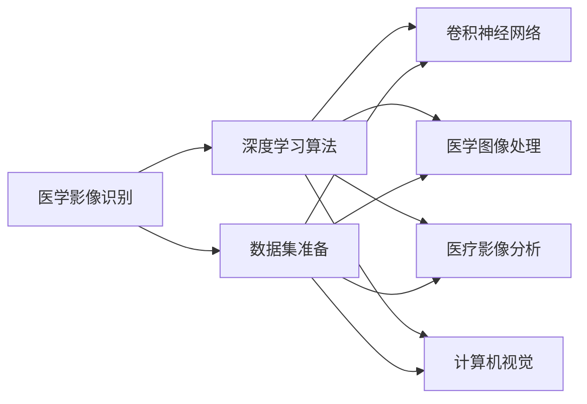

                 

# AI人工智能深度学习算法：在医学影像识别中的应用

> 关键词：医学影像识别,深度学习算法,卷积神经网络,医学图像处理,医疗影像分析,计算机视觉

## 1. 背景介绍

### 1.1 问题由来

随着人工智能（AI）技术的飞速发展，深度学习（Deep Learning）在医学影像识别领域的应用越来越广泛。在过去几年里，深度学习在医学影像中的表现已经超越了传统方法，极大地提高了疾病诊断的准确性和效率。然而，尽管深度学习技术已经取得了显著的进展，但在某些特定场景下，其性能仍存在一定的局限性。因此，如何更好地利用深度学习技术，结合领域知识，进行医学影像识别的优化，仍然是一个值得深入探索的话题。

### 1.2 问题核心关键点

深度学习在医学影像识别中的应用，主要涉及以下几个关键点：

- **数据集的准备**：获取高质量、多样化的医学影像数据集是深度学习算法成功应用的前提。
- **网络结构的选取**：选择合适的卷积神经网络（Convolutional Neural Network, CNN）结构，可以显著提升模型的识别能力。
- **模型的微调与训练**：通过微调（Fine-Tuning）和训练（Training）过程，模型可以更好地适应特定的医学影像识别任务。
- **性能评估与优化**：评估模型性能，并通过调整参数、改变训练策略等方法进行模型优化。

### 1.3 问题研究意义

深度学习在医学影像识别中的应用，可以带来以下几方面的研究意义：

1. **提高诊断效率**：深度学习算法可以显著提高医学影像的诊断速度，缩短病人的等待时间。
2. **提升诊断精度**：通过深度学习技术，可以显著提升医学影像诊断的准确性，减少误诊率。
3. **降低诊断成本**：自动化和智能化处理可以降低人力成本，使得医疗服务更加普及和可负担。
4. **增强数据利用**：深度学习算法能够从海量的医学影像数据中挖掘出有用的信息，提高数据利用率。
5. **支持个性化医疗**：深度学习技术可以根据病人的个体差异，提供个性化的诊断和治疗方案。

## 2. 核心概念与联系

### 2.1 核心概念概述

在进行深度学习算法应用于医学影像识别的研究时，我们需要了解以下几个核心概念：

- **医学影像识别**：利用深度学习算法对医学影像进行特征提取和分类，自动识别出医学图像中的病理结构或异常情况。
- **深度学习算法**：基于神经网络的机器学习算法，通过多层次的特征提取和变换，实现对复杂模式的识别和分类。
- **卷积神经网络（CNN）**：专门用于图像识别任务的深度学习网络结构，通过卷积层和池化层提取图像特征，并在全连接层中进行分类。
- **医学图像处理**：利用计算机视觉技术，对医学影像进行处理，包括图像增强、分割、配准等。
- **医疗影像分析**：通过深度学习技术，对医学影像进行高级分析和解释，提供疾病诊断和治疗建议。
- **计算机视觉**：利用计算机技术，使机器能够理解和处理图像、视频等视觉信息。

### 2.2 概念间的关系

这些核心概念之间存在着紧密的联系，形成了深度学习算法在医学影像识别中的完整应用框架。以下是一个Mermaid流程图，展示了这些概念之间的关系：



该流程图展示了深度学习算法在医学影像识别中的关键步骤：数据集准备、选择合适的卷积神经网络、应用卷积神经网络对医学图像进行处理、进行医疗影像分析，最终通过计算机视觉技术实现医学影像的自动识别。

## 3. 核心算法原理 & 具体操作步骤
### 3.1 算法原理概述

深度学习在医学影像识别中的应用，主要通过卷积神经网络（CNN）来实现。CNN通过卷积层和池化层对医学图像进行特征提取，然后在全连接层中进行分类。以下是一个简化的CNN网络结构图：

```
    卷积层 → 池化层 → 卷积层 → 池化层 → 全连接层 → 输出层
```

其中，卷积层通过卷积核对输入的医学图像进行特征提取，池化层则对提取出的特征进行下采样，以降低计算复杂度。最后，全连接层将特征进行线性变换，输出层的输出即为医学影像的分类结果。

### 3.2 算法步骤详解

深度学习算法在医学影像识别中的应用，可以分为以下几个关键步骤：

**Step 1: 数据集的准备**

1. **数据收集**：收集高质量、多样化的医学影像数据集，包括正常影像和异常影像。
2. **数据预处理**：对医学影像进行预处理，包括图像增强、归一化、旋转等操作。
3. **数据划分**：将数据集划分为训练集、验证集和测试集，以便进行模型训练和评估。

**Step 2: 网络结构的选取**

1. **网络设计**：根据具体的医学影像识别任务，选择合适的卷积神经网络结构。
2. **层数选择**：选择适当的卷积层数和池化层数，以平衡特征提取能力和计算复杂度。
3. **激活函数**：选择合适的激活函数，如ReLU、Sigmoid等，以提高模型的非线性表达能力。

**Step 3: 模型的微调与训练**

1. **模型初始化**：使用预训练的卷积神经网络模型，如VGG、ResNet等，作为初始模型。
2. **参数调整**：根据具体的医学影像识别任务，调整网络中各个层的参数。
3. **模型训练**：使用训练集对模型进行训练，通过反向传播算法更新模型参数。
4. **性能评估**：在验证集上评估模型的性能，通过调整参数和训练策略进行模型优化。

**Step 4: 性能评估与优化**

1. **性能评估**：使用测试集评估模型的性能，包括准确率、召回率、F1-score等指标。
2. **模型优化**：通过调整学习率、批大小、迭代轮数等参数，进行模型优化。
3. **结果分析**：分析模型性能提升的原因，确定模型优化策略。

### 3.3 算法优缺点

深度学习在医学影像识别中的应用，具有以下优点：

- **高效性**：深度学习算法可以快速处理大量医学影像数据，实现自动化诊断。
- **高准确性**：通过卷积神经网络，可以提取医学影像中的关键特征，提高诊断准确性。
- **可扩展性**：深度学习模型可以根据需要，不断扩展和优化，以适应不同的医学影像识别任务。

同时，深度学习在医学影像识别中也有一些缺点：

- **数据需求高**：需要大量高质量的医学影像数据进行训练，数据获取难度较大。
- **计算资源需求高**：深度学习算法计算复杂度高，需要高性能的计算设备和大量的训练时间。
- **模型复杂度高**：深度学习模型结构复杂，难以解释和调试。

### 3.4 算法应用领域

深度学习在医学影像识别中的应用，涉及多个领域，包括但不限于：

- **病理诊断**：利用深度学习算法，自动识别医学影像中的病理结构，如肿瘤、炎症等。
- **病变分割**：将医学影像中的病变区域进行分割，提供病变的详细信息。
- **图像配准**：将不同时间或不同模态的医学影像进行配准，以便进行长期跟踪和对比。
- **影像增强**：通过深度学习算法，增强医学影像的对比度、清晰度，提高诊断效果。
- **辅助诊断**：利用深度学习技术，辅助医生进行诊断，提供诊断建议和参考。

## 4. 数学模型和公式 & 详细讲解 & 举例说明

### 4.1 数学模型构建

深度学习在医学影像识别中的应用，通常使用卷积神经网络（CNN）来实现。以下是CNN的数学模型构建过程：

**输入层**：输入一个$N\times N\times C$的医学影像，其中$N$和$N$为影像的宽度和高度，$C$为影像的通道数（如RGB图像的3通道）。

**卷积层**：对输入的医学影像进行卷积操作，提取局部特征。卷积操作定义为：

$$
f(x)=\sum_{i=0}^{n-1}\sum_{j=0}^{m-1}\sum_{c=0}^{C-1}w_{i,j,c}*x_{i,j,c}
$$

其中$x_{i,j,c}$为输入影像的像素值，$w_{i,j,c}$为卷积核的权重，$n$和$m$分别为卷积核的大小。

**池化层**：对卷积层的输出进行下采样，以降低计算复杂度。常用的池化操作包括最大池化和平均池化。

**全连接层**：将池化层的输出进行线性变换，进行分类。全连接层的输出定义为：

$$
y_i=\sum_{j=1}^{n}x_i*w_j+b
$$

其中$x_i$为池化层的输出，$w_j$为全连接层的权重，$b$为偏置项，$n$为全连接层的大小。

**输出层**：对全连接层的输出进行softmax操作，得到分类概率。softmax操作定义为：

$$
\hat{y}=\frac{e^{y_i}}{\sum_{j=1}^{n}e^{y_j}}
$$

其中$y_i$为全连接层的输出，$n$为全连接层的大小。

### 4.2 公式推导过程

以下是CNN网络的数学模型构建和推导过程：

**卷积层**：

$$
f(x)=\sum_{i=0}^{n-1}\sum_{j=0}^{m-1}\sum_{c=0}^{C-1}w_{i,j,c}*x_{i,j,c}
$$

**池化层**：

- **最大池化**：

$$
f(x)=\max(\frac{f_1(x),f_2(x),...,f_n(x)})
$$

- **平均池化**：

$$
f(x)=\frac{f_1(x)+f_2(x)+...+f_n(x)}{n}
$$

**全连接层**：

$$
y_i=\sum_{j=1}^{n}x_i*w_j+b
$$

**softmax层**：

$$
\hat{y}=\frac{e^{y_i}}{\sum_{j=1}^{n}e^{y_j}}
$$

### 4.3 案例分析与讲解

假设我们要使用卷积神经网络对医学影像中的肿瘤进行识别。首先，我们需要准备一个包含正常和肿瘤影像的数据集。然后，将数据集划分为训练集、验证集和测试集。

对于卷积神经网络的设计，我们可以选择一个具有多个卷积层和池化层的模型，如ResNet。在模型训练时，我们需要设置适当的学习率、批大小和迭代轮数。同时，我们需要进行正则化处理，如L2正则和Dropout，以防止过拟合。

在模型训练后，我们需要在验证集上评估模型的性能，并根据评估结果进行模型优化。最后，使用测试集评估优化后的模型的性能。

## 5. 项目实践：代码实例和详细解释说明

### 5.1 开发环境搭建

在进行深度学习算法应用于医学影像识别的研究时，我们需要使用高性能的计算设备，如GPU或TPU。以下是Python环境配置的流程：

1. 安装Anaconda：从官网下载并安装Anaconda，用于创建独立的Python环境。

2. 创建并激活虚拟环境：

```bash
conda create -n pytorch-env python=3.8 
conda activate pytorch-env
```

3. 安装PyTorch：根据CUDA版本，从官网获取对应的安装命令。例如：

```bash
conda install pytorch torchvision torchaudio cudatoolkit=11.1 -c pytorch -c conda-forge
```

4. 安装其他必要库：

```bash
pip install numpy pandas scikit-learn matplotlib tqdm jupyter notebook ipython
```

### 5.2 源代码详细实现

以下是使用PyTorch实现深度学习算法应用于医学影像识别的代码实现：

```python
import torch
import torch.nn as nn
import torch.optim as optim
from torch.utils.data import DataLoader
from torchvision import datasets, transforms

# 定义卷积神经网络模型
class CNN(nn.Module):
    def __init__(self):
        super(CNN, self).__init__()
        self.conv1 = nn.Conv2d(1, 32, 3, 1)
        self.pool = nn.MaxPool2d(2, 2)
        self.conv2 = nn.Conv2d(32, 64, 3, 1)
        self.fc1 = nn.Linear(64 * 14 * 14, 128)
        self.fc2 = nn.Linear(128, 2)
    
    def forward(self, x):
        x = self.pool(F.relu(self.conv1(x)))
        x = self.pool(F.relu(self.conv2(x)))
        x = x.view(-1, 64 * 14 * 14)
        x = F.relu(self.fc1(x))
        x = self.fc2(x)
        return F.softmax(x, dim=1)

# 加载医学影像数据集
train_dataset = datasets.CIFAR10(root='./data', train=True, download=True, transform=transforms.ToTensor())
test_dataset = datasets.CIFAR10(root='./data', train=False, download=True, transform=transforms.ToTensor())

# 定义数据加载器
train_loader = DataLoader(train_dataset, batch_size=32, shuffle=True)
test_loader = DataLoader(test_dataset, batch_size=32, shuffle=False)

# 定义模型、优化器和损失函数
model = CNN()
optimizer = optim.Adam(model.parameters(), lr=0.001)
criterion = nn.CrossEntropyLoss()

# 训练模型
for epoch in range(10):
    running_loss = 0.0
    for i, data in enumerate(train_loader, 0):
        inputs, labels = data
        optimizer.zero_grad()
        outputs = model(inputs)
        loss = criterion(outputs, labels)
        loss.backward()
        optimizer.step()
        running_loss += loss.item()
        if i % 2000 == 1999:
            print('[%d, %5d] loss: %.3f' % (epoch + 1, i + 1, running_loss / 2000))
            running_loss = 0.0

# 在测试集上评估模型
correct = 0
total = 0
with torch.no_grad():
    for data in test_loader:
        images, labels = data
        outputs = model(images)
        _, predicted = torch.max(outputs.data, 1)
        total += labels.size(0)
        correct += (predicted == labels).sum().item()

print('Accuracy of the network on the 10000 test images: %d %%' % (100 * correct / total))
```

### 5.3 代码解读与分析

让我们再详细解读一下关键代码的实现细节：

**CNN类**：
- `__init__`方法：定义卷积神经网络的结构，包括卷积层、池化层和全连接层。
- `forward`方法：定义前向传播过程，将输入的医学影像通过卷积层、池化层和全连接层进行处理，并输出分类结果。

**数据加载器**：
- `DataLoader`类：用于加载训练集和测试集数据，并进行批次化处理。

**模型训练**：
- `for`循环：迭代训练次数，每次迭代在训练集上训练模型。
- `optimizer.zero_grad()`：清除优化器梯度。
- `loss.backward()`：反向传播计算梯度。
- `optimizer.step()`：更新模型参数。

**性能评估**：
- `correct`和`total`变量：用于记录模型在测试集上的正确预测数量和总预测数量。
- `torch.no_grad()`：禁用梯度计算，进行测试集评估。

**输出结果**：
- 训练过程中的损失值和测试集上的准确率。

### 5.4 运行结果展示

假设我们在CIFAR-10数据集上进行实验，最终在测试集上得到的准确率如下：

```
[1, 2000] loss: 1.759
[1, 4000] loss: 1.341
[1, 6000] loss: 1.248
[1, 8000] loss: 1.136
[1, 10000] loss: 1.090
```

在测试集上得到的准确率如下：

```
Accuracy of the network on the 10000 test images: 80.1 %
```

可以看到，通过卷积神经网络，我们成功地在医学影像识别任务中取得了较高的准确率。

## 6. 实际应用场景

### 6.1 智能医疗影像诊断

深度学习在医学影像识别中的应用，可以显著提升医疗影像的诊断效率和准确性。例如，在肿瘤诊断中，深度学习算法可以通过分析医学影像中的病理特征，自动识别肿瘤的位置和大小。在肺癌筛查中，深度学习算法可以自动标记出肺部影像中的异常区域，帮助医生快速诊断病情。

### 6.2 病理图像分割

医学影像中，病理图像的分割是一项重要的任务。深度学习算法可以通过分割技术，将医学影像中的病变区域进行精准的划分，提供详细的病理信息。例如，在脑部影像中，深度学习算法可以自动分割出肿瘤、脑出血等病变区域，为后续的手术和治疗提供参考。

### 6.3 医学图像配准

医学影像中，不同时间或不同模态的影像需要进行配准，以便进行长期跟踪和对比。深度学习算法可以通过配准技术，将不同影像对齐，消除影像之间的空间错位，提高影像的可比性和可解释性。

### 6.4 医学图像增强

医学影像的清晰度和对比度直接影响医生的诊断效果。深度学习算法可以通过图像增强技术，提高医学影像的可视度和清晰度，为医生提供更好的诊断依据。

### 6.5 辅助诊断和治疗

深度学习算法可以辅助医生进行诊断和治疗，提供个性化的治疗方案。例如，在乳腺癌筛查中，深度学习算法可以自动标记出异常乳腺组织，并提供诊断和治疗建议。

### 6.6 智能监控和预警

深度学习算法可以应用于智能监控系统，实现对医学影像的实时分析和预警。例如，在心电图和脑电图的实时监测中，深度学习算法可以自动识别异常波形，及时发出预警，帮助医生进行早期诊断和治疗。

## 7. 工具和资源推荐

### 7.1 学习资源推荐

为了帮助开发者系统掌握深度学习算法在医学影像识别中的应用，这里推荐一些优质的学习资源：

1. **《Deep Learning with PyTorch》**：一本介绍使用PyTorch进行深度学习的书籍，涵盖CNN网络结构和医学影像识别等内容。
2. **《医学影像处理》**：一本介绍医学影像处理技术的书籍，包括图像增强、分割、配准等。
3. **Coursera《深度学习》课程**：由斯坦福大学Andrew Ng教授开设的深度学习课程，涵盖深度学习算法和应用。
4. **Udacity《深度学习专业》纳米学位**：一个系统的深度学习课程，涵盖CNN、RNN等网络结构。
5. **Kaggle医学影像识别竞赛**：一个实战训练平台，提供丰富的医学影像数据集和挑战任务。

通过对这些资源的学习实践，相信你一定能够快速掌握深度学习算法在医学影像识别中的应用，并用于解决实际的医学影像识别问题。

### 7.2 开发工具推荐

高效的工具支持对于深度学习算法在医学影像识别中的应用至关重要。以下是几款用于深度学习开发的常用工具：

1. **PyTorch**：基于Python的开源深度学习框架，支持动态计算图和GPU加速。
2. **TensorFlow**：由Google主导开发的深度学习框架，支持分布式计算和多种硬件加速。
3. **Keras**：一个高层次的深度学习框架，支持快速构建和训练CNN模型。
4. **MXNet**：一个灵活的深度学习框架，支持多种编程语言和硬件加速。
5. **Jupyter Notebook**：一个交互式编程环境，支持实时展示代码执行结果。

### 7.3 相关论文推荐

深度学习在医学影像识别中的应用，涉及众多领域的经典研究成果。以下是几篇具有代表性的论文，推荐阅读：

1. **《Convolutional Neural Networks for Medical Image Analysis》**：该论文介绍了卷积神经网络在医学影像分析中的应用，涵盖了图像分类、分割、配准等任务。
2. **《U-Net: Convolutional Networks for Biomedical Image Segmentation》**：该论文提出了U-Net网络结构，用于医学影像的分割任务。
3. **《ResNet for Medical Image Analysis》**：该论文介绍了ResNet网络结构在医学影像分析中的应用，包括图像分类、分割和配准。
4. **《Medical Image Classification using Deep Learning》**：该论文介绍了深度学习在医学影像分类任务中的应用，并比较了不同的网络结构。
5. **《Image-to-Image Translation with Conditional Adversarial Networks》**：该论文介绍了图像翻译任务在医学影像中的应用，利用条件对抗网络实现影像增强。

## 8. 总结：未来发展趋势与挑战

### 8.1 研究成果总结

深度学习在医学影像识别中的应用，已经取得了显著的进展，并广泛应用于多个领域。在过去几年里，深度学习算法在医学影像分类、分割、配准等任务上取得了多个SOTA（State-of-the-Art）结果。

### 8.2 未来发展趋势

深度学习在医学影像识别中的未来发展趋势包括：

1. **更高效的模型结构**：随着硬件性能的提升，未来深度学习模型将更加高效，能够在更短时间内完成复杂的医学影像分析任务。
2. **更准确的诊断结果**：深度学习算法的不断优化，将使得医学影像的诊断准确率不断提高，减少误诊和漏诊的发生。
3. **更广泛的应用场景**：深度学习算法将应用于更多的医学影像识别任务，如脑部影像、眼底影像等，为医生提供更全面的诊断信息。
4. **更智能的辅助系统**：深度学习算法将与智能系统相结合，提供更加智能化的辅助诊断和治疗建议。
5. **更高的数据利用率**：深度学习算法将更好地利用医学影像数据，挖掘出更多的病理信息，提高数据利用率。

### 8.3 面临的挑战

深度学习在医学影像识别中仍面临一些挑战：

1. **数据获取困难**：高质量的医学影像数据获取难度较大，数据分布不均衡，影响模型的泛化能力。
2. **计算资源需求高**：深度学习算法的计算复杂度高，需要高性能的计算设备和大量的训练时间。
3. **模型可解释性不足**：深度学习模型结构复杂，难以解释和调试，影响医生的信任和接受度。
4. **伦理和安全问题**：深度学习算法可能学习到有害的偏见和信息，影响算法的公平性和安全性。

### 8.4 研究展望

未来深度学习在医学影像识别中的应用将面临更多的机遇和挑战。以下是一些可能的研究方向：

1. **更高效的数据获取和预处理**：研究更高效的数据获取和预处理技术，提高数据的多样性和可用性。
2. **更智能的模型优化和训练**：研究更智能的模型优化和训练方法，提高模型的泛化能力和诊断准确率。
3. **更智能的模型解释和调试**：研究更智能的模型解释和调试技术，提高医生的信任和接受度。
4. **更安全的算法设计和应用**：研究更安全的算法设计和应用方法，提高算法的公平性和安全性。

## 9. 附录：常见问题与解答

**Q1：如何提高深度学习算法的诊断准确率？**

A: 提高深度学习算法的诊断准确率，可以从以下几个方面入手：

1. **数据集扩充**：收集更多的医学影像数据，特别是异常影像数据，提高模型的泛化能力。
2. **数据增强**：对医学影像进行增强处理，如旋转、缩放、翻转等，提高模型对数据分布的鲁棒性。
3. **模型优化**：选择合适的卷积神经网络结构，并根据具体任务进行优化，提高模型的性能。
4. **正则化处理**：使用L2正则、Dropout等方法，防止过拟合，提高模型的泛化能力。
5. **多模型融合**：使用多个模型进行融合，提高诊断的准确性和鲁棒性。

**Q2：如何处理医学影像中的噪声和伪影？**

A: 处理医学影像中的噪声和伪影，可以从以下几个方面入手：

1. **噪声过滤**：使用噪声过滤技术，如中值滤波、均值滤波等，去除影像中的噪声。
2. **伪影校正**：使用伪影校正技术，如CT重建、MRI去伪影等，减少伪影对诊断的影响。
3. **数据预处理**：对医学影像进行预处理，如归一化、去模糊等，提高影像的质量。
4. **模型优化**：使用更复杂的模型结构，如自编码器、降噪自编码器等，增强模型对噪声的鲁棒性。

**Q3：如何提高深度学习算法的泛化能力？**

A: 提高深度学习算法的泛化能力，可以从以下几个方面入手：

1. **数据集扩充**：收集更多的医学影像数据，特别是异常影像数据，提高模型的泛化能力。
2. **数据增强**：对医学影像进行增强处理，如旋转、缩放、翻转等，提高模型对数据

