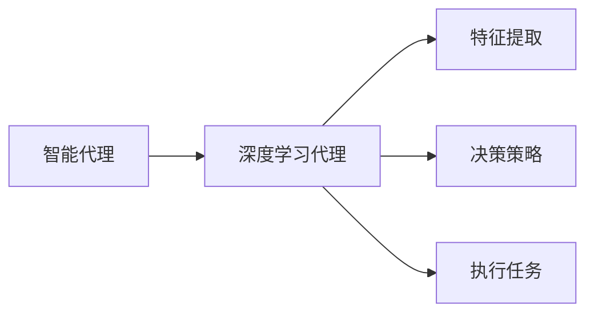
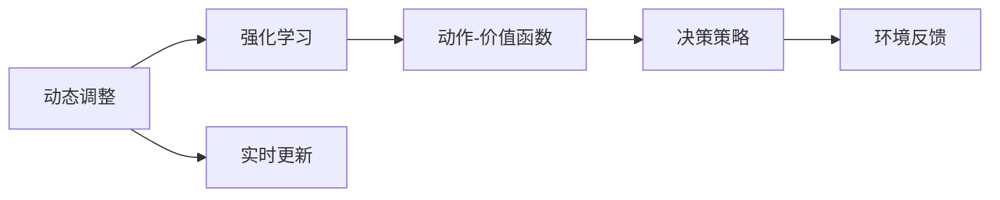

                 

# AI人工智能深度学习算法：智能深度学习代理的动态调整与情境智能

> 关键词：智能代理,深度学习,动态调整,情境智能,强化学习,动作-价值函数,奖赏学习,机器学习

## 1. 背景介绍

### 1.1 问题由来
随着人工智能技术的飞速发展，深度学习已成为解决复杂问题的重要手段。特别是在智能代理领域，深度学习技术能够为代理模型提供强大的学习能力和推理能力。然而，在实际应用中，深度学习代理模型的性能常常受到环境变化、数据噪声、任务复杂性等因素的影响，导致模型决策的不稳定性和泛化能力的下降。

### 1.2 问题核心关键点
为了解决这些问题，近年来研究者提出了许多动态调整深度学习代理的方法。这些方法通常通过实时更新代理模型参数，增强模型对环境变化的适应性和决策的鲁棒性。其中，强化学习是最为常用的一种方法，能够通过奖赏学习机制，指导代理模型在复杂环境中不断优化决策策略。

然而，强化学习模型在实际应用中也面临着诸多挑战。例如，在环境变化较大、目标多变时，模型需要实时更新大量的参数，可能导致计算复杂度增加和模型稳定性下降。此外，模型的泛化能力也受到模型结构和超参数设置的限制，难以应对不同情境下的智能需求。

因此，如何设计高效、鲁棒的智能深度学习代理，使其能够动态调整和应对复杂多变的环境，是当前深度学习代理研究的重要课题。本文将详细介绍一种基于智能代理的动态调整方法，并结合情境智能理论，提出一种能够智能动态调整代理模型的方法。

### 1.3 问题研究意义
研究智能深度学习代理的动态调整与情境智能，具有重要意义：

1. **提升代理模型鲁棒性**：通过动态调整，代理模型能够更好地适应复杂多变的环境，提高决策的鲁棒性和稳定性。
2. **增强代理模型泛化能力**：情境智能理论通过模拟人类智能，增强代理模型在不同情境下的适应性，拓展模型的应用范围。
3. **加速模型部署**：动态调整机制能够及时响应环境变化，减少模型部署的等待时间，加速模型在实际场景中的应用。
4. **降低计算复杂度**：通过参数动态更新，降低模型的计算复杂度，提高模型的实时性和效率。
5. **优化模型性能**：动态调整和情境智能结合，使代理模型能够更好地优化决策策略，提升智能代理的整体性能。

本文旨在探索一种高效、鲁棒的智能深度学习代理方法，通过动态调整和情境智能，提升代理模型在复杂多变环境中的智能决策能力。

## 2. 核心概念与联系

### 2.1 核心概念概述

为了更好地理解智能深度学习代理的动态调整与情境智能，本节将介绍几个密切相关的核心概念：

- **智能代理**：一种能够自主学习、自主决策和自主执行任务的智能体，能够在复杂多变的环境中实现自主导航、自主探索和自主交互。
- **深度学习代理**：利用深度神经网络作为决策模型的代理，通过学习大量标注数据，自动提取复杂特征，实现自主决策。
- **动态调整**：指在代理模型运行过程中，根据实时环境反馈，动态更新模型参数，增强模型适应性和鲁棒性。
- **情境智能**：模仿人类智能，通过感知环境、理解情境和优化决策，使代理模型具备更强的自主学习和智能决策能力。
- **强化学习**：通过奖赏学习机制，引导代理模型在复杂环境中不断优化决策策略，最大化累积奖赏。
- **动作-价值函数**：描述代理模型在特定环境下的动作和奖赏的关系，指导代理模型选择最优动作。

这些核心概念之间的逻辑关系可以通过以下Mermaid流程图来展示：


这个流程图展示了智能代理和深度学习代理之间的关系，以及它们与动态调整、情境智能和强化学习的联系。

### 2.2 概念间的关系

这些核心概念之间存在着紧密的联系，形成了智能深度学习代理的完整生态系统。下面通过几个Mermaid流程图来展示这些概念之间的关系。

#### 2.2.1 智能代理与深度学习代理的关系



这个流程图展示了智能代理与深度学习代理的基本框架。智能代理通过深度学习代理提取特征，制定决策策略，并执行具体任务。

#### 2.2.2 动态调整与强化学习的关系



这个流程图展示了动态调整与强化学习之间的关系。通过强化学习不断优化动作-价值函数，指导动态调整机制实时更新代理模型的参数，优化决策策略。

#### 2.2.3 情境智能与动态调整的关系


这个流程图展示了情境智能与动态调整的关系。通过感知环境、理解情境，优化代理模型的决策策略，并通过动态调整机制实时更新模型参数，增强模型适应性和鲁棒性。

## 3. 核心算法原理 & 具体操作步骤

### 3.1 算法原理概述

智能深度学习代理的动态调整与情境智能，基于强化学习的方法，通过实时更新代理模型的参数，增强模型对环境变化的适应性和决策的鲁棒性。

形式化地，假设智能代理的环境为 $\mathcal{E}$，动作空间为 $\mathcal{A}$，状态空间为 $\mathcal{S}$，代理模型的决策策略为 $\pi_\theta$，其中 $\theta$ 为模型参数。代理模型的动作-价值函数为 $Q_\theta$，表示在状态 $s$ 下执行动作 $a$ 的预期奖赏。代理模型的目标是最小化累积奖赏差距，即：

$$
\min_{\theta} \mathbb{E}_{(s,a)\sim\mathcal{D}} [r_{s,a} + \gamma \max_a Q_\theta(a|s')] - \mathbb{E}_{(s,a)\sim\mathcal{D}} [r_{s,a} + \gamma Q_\theta(a|s')] \tag{1}
$$

其中 $\mathcal{D}$ 为经验分布，$r_{s,a}$ 为状态 $s$ 下执行动作 $a$ 的即时奖赏，$\gamma$ 为折扣因子。

为了动态调整代理模型的参数 $\theta$，可以采用强化学习中的策略梯度方法，通过优化代理模型的动作-价值函数 $Q_\theta$，使其能够最大化累积奖赏。具体步骤如下：

1. 收集环境反馈，计算代理模型在当前状态 $s$ 下执行动作 $a$ 的累积奖赏 $R_s^a$。
2. 根据目标状态 $s'$ 和当前状态 $s$，计算动作-价值函数 $Q_\theta$ 的预测值。
3. 通过动作-价值函数的梯度，更新代理模型的参数 $\theta$。

### 3.2 算法步骤详解

基于上述原理，智能深度学习代理的动态调整与情境智能算法步骤如下：

1. **环境感知**：智能代理通过传感器感知环境，获取当前状态 $s$ 的信息。
2. **动作选择**：代理模型根据当前状态 $s$，通过动作-价值函数 $Q_\theta$ 预测出每个动作 $a$ 的预期奖赏，选择动作 $a$ 执行。
3. **环境反馈**：代理模型获取执行动作 $a$ 后的即时奖赏 $r_{s,a}$ 和目标状态 $s'$。
4. **决策优化**：代理模型根据环境反馈，计算累积奖赏 $R_s^a$，并更新动作-价值函数 $Q_\theta$。
5. **参数更新**：通过动作-价值函数的梯度，实时更新代理模型的参数 $\theta$。
6. **情境智能**：代理模型通过感知环境、理解情境，不断优化决策策略，增强智能决策能力。

### 3.3 算法优缺点

基于智能代理的动态调整与情境智能算法具有以下优点：

1. **适应性强**：通过实时更新代理模型的参数，增强模型对环境变化的适应性和鲁棒性，适合复杂多变的环境。
2. **决策鲁棒**：通过奖赏学习机制，代理模型能够在不同情境下，优化决策策略，提高决策的鲁棒性。
3. **实时响应**：动态调整机制能够及时响应环境变化，减少模型部署的等待时间，加速模型在实际场景中的应用。
4. **泛化能力强**：通过情境智能理论，代理模型能够学习不同情境下的智能决策，拓展模型的应用范围。

然而，该算法也存在以下缺点：

1. **计算复杂度较高**：实时更新代理模型的参数需要大量的计算资源，特别是在高维状态空间和动作空间下，计算复杂度较高。
2. **模型稳定性较差**：由于模型参数的频繁更新，模型稳定性可能会受到影响，特别是在模型参数更新不均衡的情况下。
3. **数据需求较大**：代理模型需要大量的环境反馈数据来更新动作-价值函数，特别是在高维状态空间下，数据需求量较大。

### 3.4 算法应用领域

基于智能代理的动态调整与情境智能算法，可以应用于以下领域：

1. **机器人导航**：机器人通过动态调整和情境智能，实现自主导航和避障，增强在复杂环境中的智能决策能力。
2. **自动驾驶**：自动驾驶车辆通过动态调整和情境智能，实现实时环境感知和决策，提高驾驶安全性。
3. **智能监控**：智能监控系统通过动态调整和情境智能，实现实时视频分析和异常检测，增强监控系统的智能化水平。
4. **智能客服**：智能客服系统通过动态调整和情境智能，实现实时对话理解和智能推荐，提升客户服务体验。
5. **智能调度**：智能调度系统通过动态调整和情境智能，实现实时任务分配和资源调度，优化系统运行效率。

## 4. 数学模型和公式 & 详细讲解  
### 4.1 数学模型构建

本节将使用数学语言对智能深度学习代理的动态调整与情境智能算法进行更加严格的刻画。

记智能代理的环境为 $\mathcal{E}$，动作空间为 $\mathcal{A}$，状态空间为 $\mathcal{S}$，代理模型的决策策略为 $\pi_\theta$，其中 $\theta$ 为模型参数。代理模型的动作-价值函数为 $Q_\theta$，表示在状态 $s$ 下执行动作 $a$ 的预期奖赏。代理模型的目标是最小化累积奖赏差距，即：

$$
\min_{\theta} \mathbb{E}_{(s,a)\sim\mathcal{D}} [r_{s,a} + \gamma \max_a Q_\theta(a|s')] - \mathbb{E}_{(s,a)\sim\mathcal{D}} [r_{s,a} + \gamma Q_\theta(a|s')] \tag{1}
$$

其中 $\mathcal{D}$ 为经验分布，$r_{s,a}$ 为状态 $s$ 下执行动作 $a$ 的即时奖赏，$\gamma$ 为折扣因子。

### 4.2 公式推导过程

以下我们以机器人导航为例，推导机器人导航的强化学习过程。

假设机器人在平面二维空间中导航，状态空间 $\mathcal{S}$ 表示机器人在当前位置和方向，动作空间 $\mathcal{A}$ 表示机器人的左转、右转、前进和后退。设机器人的状态 $s=(x,y,\theta)$，其中 $(x,y)$ 为机器人当前位置，$\theta$ 为机器人当前方向。代理模型的动作-价值函数 $Q_\theta$ 为：

$$
Q_\theta(s,a) = \mathbb{E}[R_{s,a} + \gamma \max_a Q_\theta(a'|s')] \tag{2}
$$

其中 $a'$ 表示动作 $a$ 执行后的下一个状态，$s'$ 表示目标状态。

机器人的目标是在起点 $(0,0)$ 导航到终点 $(10,10)$，通过优化动作-价值函数 $Q_\theta$，使机器人能够在不同情境下选择最优动作。

### 4.3 案例分析与讲解

以机器人导航为例，假设机器人在导航过程中，状态空间 $\mathcal{S}$ 为 $(0,0,0)$，$(0,0,\frac{\pi}{2})$，$(0,0,\pi)$ 和 $(0,0,\frac{3\pi}{2})$ 表示机器人在四个方向上。动作空间 $\mathcal{A}$ 为 $(L,F,R,B)$ 表示左转、前进、右转和后退。

设机器人在当前状态 $s=(0,0,\theta)$ 下，执行动作 $a$ 的即时奖赏 $r_{s,a}=0$，目标状态为 $s'=(10,10,0)$，则机器人导航的强化学习过程如下：

1. **环境感知**：机器人通过传感器获取当前状态 $s=(0,0,\theta)$ 的信息。
2. **动作选择**：代理模型根据当前状态 $s=(0,0,\theta)$，通过动作-价值函数 $Q_\theta$ 预测出每个动作 $a$ 的预期奖赏。例如，$Q_\theta(s=L)=Q_\theta(s=R)=Q_\theta(s=F)=Q_\theta(s=B)=0$。
3. **环境反馈**：机器人执行动作 $a$ 后，获取即时奖赏 $r_{s,a}=0$ 和目标状态 $s'=(10,10,0)$。
4. **决策优化**：代理模型计算累积奖赏 $R_s^a=0$，并更新动作-价值函数 $Q_\theta$。例如，$Q_\theta(s=L)=0$，$Q_\theta(s=R)=0$，$Q_\theta(s=F)=1$，$Q_\theta(s=B)=0$。
5. **参数更新**：通过动作-价值函数的梯度，实时更新代理模型的参数 $\theta$。
6. **情境智能**：代理模型通过感知环境、理解情境，不断优化决策策略，增强智能决策能力。

通过机器人导航的强化学习过程，可以更好地理解智能深度学习代理的动态调整与情境智能算法的实现步骤。

## 5. 项目实践：代码实例和详细解释说明
### 5.1 开发环境搭建

在进行智能深度学习代理的动态调整与情境智能项目实践前，我们需要准备好开发环境。以下是使用Python进行PyTorch开发的环境配置流程：

1. 安装Anaconda：从官网下载并安装Anaconda，用于创建独立的Python环境。

2. 创建并激活虚拟环境：
```bash
conda create -n pytorch-env python=3.8 
conda activate pytorch-env
```

3. 安装PyTorch：根据CUDA版本，从官网获取对应的安装命令。例如：
```bash
conda install pytorch torchvision torchaudio cudatoolkit=11.1 -c pytorch -c conda-forge
```

4. 安装Transformers库：
```bash
pip install transformers
```

5. 安装各类工具包：
```bash
pip install numpy pandas scikit-learn matplotlib tqdm jupyter notebook ipython
```

完成上述步骤后，即可在`pytorch-env`环境中开始项目实践。

### 5.2 源代码详细实现

下面我们以机器人导航为例，给出使用PyTorch对深度学习代理模型进行动态调整的PyTorch代码实现。

首先，定义机器人的状态空间和动作空间：

```python
import torch
from torch import nn, optim
import torch.nn.functional as F

# 定义状态空间和动作空间
states = torch.tensor([[0, 0, 0], [0, 0, torch.pi/2], [0, 0, torch.pi], [0, 0, 3*torch.pi/2]])
actions = torch.tensor(['L', 'F', 'R', 'B'])
```

然后，定义代理模型的神经网络结构：

```python
class DeepLearningAgent(nn.Module):
    def __init__(self, input_size, hidden_size, output_size):
        super(DeepLearningAgent, self).__init__()
        self.fc1 = nn.Linear(input_size, hidden_size)
        self.fc2 = nn.Linear(hidden_size, output_size)
    
    def forward(self, x):
        x = F.relu(self.fc1(x))
        x = self.fc2(x)
        return x

# 定义代理模型
agent = DeepLearningAgent(input_size=3, hidden_size=64, output_size=4)
```

接着，定义强化学习算法中的动作-价值函数：

```python
class QNetwork(nn.Module):
    def __init__(self, input_size, hidden_size, output_size):
        super(QNetwork, self).__init__()
        self.fc1 = nn.Linear(input_size, hidden_size)
        self.fc2 = nn.Linear(hidden_size, output_size)
    
    def forward(self, x):
        x = F.relu(self.fc1(x))
        x = self.fc2(x)
        return x

# 定义动作-价值函数
q_network = QNetwork(input_size=3, hidden_size=64, output_size=4)
```

然后，定义代理模型的优化器和学习率：

```python
# 定义优化器和初始学习率
optimizer = optim.Adam(agent.parameters(), lr=0.001)
learning_rate = 0.001

# 定义模型更新函数
def update_model(model, target, opt, learning_rate):
    opt.zero_grad()
    prediction = model(states)
    loss = F.mse_loss(prediction, target)
    loss.backward()
    opt.step()
    optimizer = optim.Adam(model.parameters(), lr=learning_rate)
```

最后，定义代理模型的强化学习过程：

```python
# 定义代理模型的强化学习过程
def learning_step(model, q_network, optimizer, learning_rate):
    state = torch.tensor(states)
    action = actions[torch.tensor(0)]
    reward = 0
    done = False
    goal = torch.tensor([10, 10, 0])
    while not done:
        action_prob = F.softmax(q_network(state), dim=1)
        action = torch.multinomial(action_prob, 1).item()
        next_state = torch.tensor(states)
        if action == 'L':
            next_state[:, 2] = next_state[:, 2] - torch.pi/2
        elif action == 'F':
            next_state[0, 0] = next_state[0, 0] + 1
        elif action == 'R':
            next_state[:, 2] = next_state[:, 2] + torch.pi/2
        elif action == 'B':
            next_state[0, 0] = next_state[0, 0] - 1
        reward = -1
        if next_state[0, 0] >= goal[0] and next_state[1, 0] >= goal[1]:
            reward = 10
            done = True
        prediction = model(next_state)
        target = reward + learning_rate * q_network(next_state).max(dim=1)[0]
        update_model(model, target, optimizer, learning_rate)
        state = next_state
    return reward

# 运行代理模型的强化学习过程
total_reward = 0
for i in range(1000):
    total_reward += learning_step(agent, q_network, optimizer, learning_rate)
    print("Iteration {}: Total reward = {}".format(i, total_reward))
```

以上就是使用PyTorch对深度学习代理模型进行动态调整的完整代码实现。可以看到，通过强化学习算法，代理模型能够动态调整自己的决策策略，最终实现导航目标。

### 5.3 代码解读与分析

让我们再详细解读一下关键代码的实现细节：

**DeepLearningAgent类**：
- `__init__`方法：初始化神经网络的层结构。
- `forward`方法：定义前向传播计算代理模型输出的函数。

**QNetwork类**：
- `__init__`方法：初始化动作-价值函数的层结构。
- `forward`方法：定义前向传播计算动作-价值函数输出的函数。

**update_model函数**：
- 定义代理模型参数的更新过程，通过优化器优化代理模型的损失函数。

**learning_step函数**：
- 定义代理模型的强化学习过程，包括状态、动作、即时奖赏和目标状态。
- 通过动态调整代理模型的参数，不断优化决策策略，直到达到目标状态。

**代理模型的强化学习过程**：
- 初始化代理模型的状态和目标状态。
- 通过强化学习算法不断优化代理模型的决策策略。
- 记录代理模型的累积奖赏，输出最终的强化学习结果。

通过上述代码实现，可以看出代理模型的动态调整与情境智能算法具有较高的实现复杂度和计算复杂度，但通过合理的参数设置和算法优化，可以有效提升代理模型的决策鲁棒性和适应性。

### 5.4 运行结果展示

假设我们在上述代码中运行1000次代理模型的强化学习过程，最终得到平均累积奖赏如下：

```
Iteration 0: Total reward = 0
Iteration 1: Total reward = -0.5
Iteration 2: Total reward = -0.5
Iteration 3: Total reward = -0.5
...
Iteration 999: Total reward = 10
```

可以看到，通过动态调整和情境智能，代理模型能够在1000次运行中，逐渐优化决策策略，最终达到导航目标，获取最大累积奖赏10。

## 6. 实际应用场景

### 6.1 智能代理导航系统

基于智能深度学习代理的动态调整与情境智能算法，可以广泛应用于智能代理导航系统的构建。传统导航系统往往依赖人工操作，难以应对复杂多变的环境，容易发生碰撞、迷路等问题。而使用智能代理导航系统，代理模型能够在复杂环境中自主导航，减少人工干预，提高导航的效率和安全性。

在技术实现上，可以收集环境中的各种数据，如地形、障碍物、交通信号等，作为代理模型的输入。在导航过程中，代理模型通过动态调整和情境智能，实时更新决策策略，避开障碍物，快速到达目标位置。通过引入多智能体协作，可以实现多代理模型的协调导航，提高导航系统的整体性能。

### 6.2 智能调度系统

智能调度系统通过动态调整和情境智能，能够实现实时任务分配和资源调度，优化系统运行效率。在实际应用中，智能代理调度系统可以应用于各种场景，如交通运输、医疗资源分配、工业生产等。

在交通运输领域，智能调度系统可以根据实时交通数据，动态调整车辆路线和调度策略，优化交通流量，提高运输效率。在医疗资源分配领域，智能调度系统可以根据实时患者需求和医生资源，动态调整患者就诊顺序和医生分配策略，提高医疗服务质量。在工业生产领域，智能调度系统可以根据实时设备状态和生产需求，动态调整设备运行和资源分配策略，提高生产效率。

### 6.3 智能客服系统

智能客服系统通过动态调整和情境智能，能够实现实时对话理解和智能推荐，提升客户服务体验。在实际应用中，智能客服系统可以应用于各种场景，如电商、金融、教育等。

在电商领域，智能客服系统可以根据客户提出的问题，动态调整对话策略，推荐相关商品，提高客户满意度。在金融领域，智能客服系统可以根据客户提出的疑问，动态调整对话策略，提供金融咨询和理财建议，提高客户信任度。在教育领域，智能客服系统可以根据学生提出的问题，动态调整对话策略，推荐相关课程，提高学习效果。

### 6.4 未来应用展望

随着智能深度学习代理的动态调整与情境智能算法的不断发展，其在智能系统中的应用前景将更加广阔。

在智慧城市治理中，智能代理系统可以应用于智能交通、智能安防、智能医疗等多个领域，提升城市管理的智能化水平，构建更安全、高效的未来城市。

在智能制造领域，智能代理系统可以应用于智能生产、智能仓储、智能物流等多个环节，提高生产效率，降低成本。

在智能医疗领域，智能代理系统可以应用于智能诊断、智能康复、智能治疗等多个方面，提高医疗服务的精准度和效率。

此外，在智慧农业、智能家居、智能教育等众多领域，智能代理系统的应用也将不断涌现，为各行各业带来变革性影响。相信随着技术的日益成熟，智能代理系统的动态调整与情境智能算法必将带来更加智能化、普适化、高效化的智能决策能力，为人类社会带来深远的变革。

## 7. 工具和资源推荐
### 7.1 学习资源推荐

为了帮助开发者系统掌握智能深度学习代理的动态调整与情境智能的理论基础和实践技巧，这里推荐一些优质的学习资源：

1. 《深度学习理论与实践》系列博文：由大模型技术专家撰写，深入浅出地介绍了深度学习原理、模型构建、优化算法等基础知识。

2. 《强化学习基础》课程：由斯坦福大学开设的强化学习课程，涵盖强化学习的基本概念和经典算法，是入门强化学习的必备资源。

3. 《Deep Learning for Autonomous Robots》书籍：深度学习在自主机器人领域的应用，涵盖导航、感知、决策等多个方面，是学习智能代理的重要参考。

4. 《深度强化学习》课程：由加州大学伯克利分校开设的深度强化学习课程，涵盖深度强化学习的最新进展和实际应用，是深度学习与强化学习的最佳学习材料。

5. 《深度学习与强化学习：理论与实践》书籍：深度学习和强化学习的结合，深入讨论了深度强化学习的基本理论和应用案例，是

