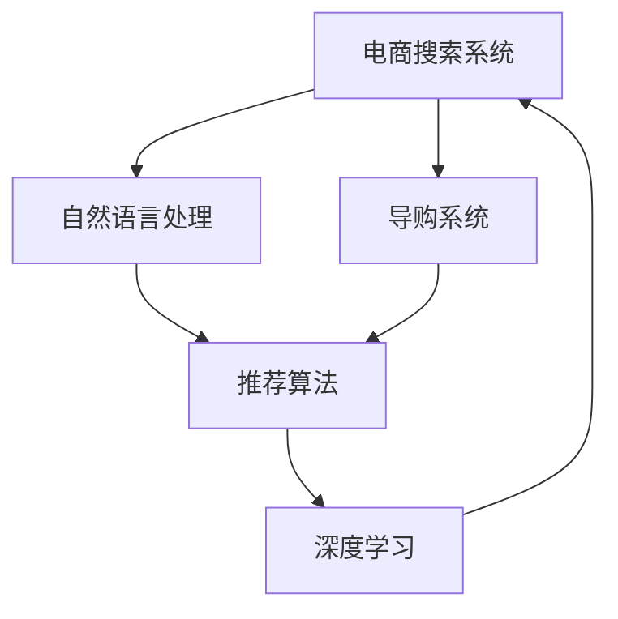

                 

# AI在电商搜索导购中的应用案例分析

> 关键词：电商搜索、导购系统、自然语言处理、推荐算法、深度学习、优化模型、用户行为分析

## 1. 背景介绍

### 1.1 电商搜索导购的发展历程
随着互联网技术的飞速发展，电商搜索导购已经从简单的关键词匹配演变成智能化的信息检索和个性化推荐。最早的电商搜索系统主要基于传统的关键词检索技术，用户输入关键词后，系统返回相关商品列表。这种方法虽然简单易用，但存在同义词、近义词等多种查询表达方式导致的匹配不精准问题。

随着搜索引擎技术的不断进步，自然语言处理（Natural Language Processing, NLP）技术被引入电商搜索系统。NLP技术可以通过分析用户输入的自然语言文本，提取其中的关键字和语义信息，提供更精准的搜索结果。同时，推荐算法也被引入电商导购系统，根据用户的浏览历史和行为特征，推荐个性化商品，提升用户体验。

在推荐算法方面，最初的协同过滤算法通过分析用户之间的相似性，推荐相似用户喜欢的商品。后来，基于内容的推荐算法引入商品特征，通过匹配相似的商品特征进行推荐。最近几年，深度学习技术逐渐被引入推荐系统，基于用户行为数据进行建模，提高了推荐系统的精度和泛化能力。

深度学习推荐系统的核心是使用深度神经网络对用户行为进行建模，包括点击率预测、用户兴趣分类、商品相似度计算等。这类系统可以根据用户历史行为数据，预测用户对某个商品的兴趣，从而进行推荐。

## 2. 核心概念与联系

### 2.1 核心概念概述

为了更好地理解AI在电商搜索导购中的应用，我们先介绍几个核心概念：

- **电商搜索系统**：利用NLP技术，对用户输入的查询进行语义分析，返回最相关的商品列表。
- **导购系统**：在搜索结果的基础上，使用推荐算法为用户推荐个性化商品，提升用户体验。
- **自然语言处理**：通过NLP技术，对用户的查询和反馈进行理解和分析，提高搜索和推荐的准确性。
- **推荐算法**：根据用户历史行为数据，对商品进行排序和推荐，提升用户满意度。
- **深度学习**：使用神经网络对用户行为数据进行建模，提高推荐算法的精度和泛化能力。

这些概念之间存在紧密联系，共同构成了电商搜索导购系统的核心框架。

### 2.2 概念间的关系

这些概念之间的关系可以通过以下Mermaid流程图来展示：



这个流程图展示了大语言模型在电商搜索导购系统中的应用流程：

1. 电商搜索系统接收用户输入的查询，经过自然语言处理后，返回商品列表。
2. 导购系统利用推荐算法，对商品进行排序和推荐。
3. 推荐算法使用深度学习对用户行为数据进行建模，提高推荐精度。
4. 深度学习模型通过不断优化，使得推荐系统能够更好地适应用户需求。

## 3. 核心算法原理 & 具体操作步骤

### 3.1 算法原理概述
基于深度学习的推荐系统核心算法主要包括以下几个步骤：

1. **用户行为数据收集**：从用户浏览、点击、购买等行为中，收集特征向量。
2. **用户行为数据建模**：使用深度神经网络，对用户行为数据进行建模，得到用户兴趣表示。
3. **商品特征提取**：使用深度神经网络，对商品进行特征提取，得到商品表示。
4. **用户商品相似度计算**：根据用户兴趣表示和商品表示，计算用户与商品之间的相似度。
5. **推荐排序**：根据用户商品相似度，对商品进行排序，得到推荐列表。

这些步骤共同构成了基于深度学习的推荐算法流程，核心在于使用神经网络对用户行为数据进行建模，得到高精度的用户兴趣表示和商品表示。

### 3.2 算法步骤详解
下面我们详细介绍各个步骤的具体实现。

#### 3.2.1 用户行为数据收集
用户行为数据是推荐系统的基础，主要包括以下几种：

- **浏览记录**：用户浏览过的商品列表。
- **点击记录**：用户点击过的商品链接。
- **购买记录**：用户购买过的商品信息。
- **评价记录**：用户对商品的评价信息。

这些数据可以通过电商平台的日志系统进行收集和存储。在收集数据时，需要注意保护用户隐私，避免泄露敏感信息。

#### 3.2.2 用户行为数据建模
用户行为数据建模的主要目标是通过深度学习，对用户兴趣进行表示。常用的建模方法包括：

- **序列模型**：如循环神经网络（RNN）、长短时记忆网络（LSTM）等，可以对用户的浏览序列进行建模，捕捉序列中的时间依赖关系。
- **嵌入模型**：如Word2Vec、GloVe等，可以将用户行为数据转化为向量表示，捕捉数据中的语义信息。

#### 3.2.3 商品特征提取
商品特征提取的主要目标是通过深度学习，对商品进行表示。常用的特征提取方法包括：

- **基于内容的特征提取**：使用词袋模型、TF-IDF等方法，将商品描述转化为向量表示。
- **基于图像的特征提取**：使用卷积神经网络（CNN），对商品图片进行特征提取，捕捉图像中的视觉信息。
- **基于结构的特征提取**：使用图神经网络（GNN），对商品之间的结构关系进行建模，捕捉结构中的信息。

#### 3.2.4 用户商品相似度计算
用户商品相似度计算的主要目标是通过深度学习，计算用户与商品之间的相似度。常用的相似度计算方法包括：

- **余弦相似度**：计算用户兴趣表示和商品表示之间的余弦距离，得到相似度。
- **欧式距离**：计算用户兴趣表示和商品表示之间的欧式距离，得到相似度。
- **KNN算法**：通过计算用户与商品的相似度，找到K个最相似的物品，进行推荐。

#### 3.2.5 推荐排序
推荐排序的主要目标是通过深度学习，对商品进行排序，得到推荐列表。常用的推荐排序方法包括：

- **基于排序的推荐**：如排名算法、交替最小二乘法（ALS）等，对用户商品相似度进行排序，得到推荐列表。
- **基于模型的推荐**：如深度神经网络、基于注意力机制的推荐等，通过学习模型对商品进行排序，得到推荐列表。

### 3.3 算法优缺点

基于深度学习的推荐系统优点包括：

- **精度高**：使用神经网络对用户行为数据进行建模，得到高精度的用户兴趣表示和商品表示，提高了推荐系统的精度。
- **泛化能力强**：深度学习模型具有很强的泛化能力，可以适应不同领域的推荐任务。
- **自动特征学习**：深度学习模型可以自动学习数据中的特征，无需手动提取特征，降低了特征工程的工作量。

缺点包括：

- **计算量大**：深度学习模型的计算量较大，需要大量的计算资源进行训练和推理。
- **数据依赖性强**：深度学习模型的效果依赖于高质量的数据，数据量少或噪声数据都会影响模型效果。
- **可解释性差**：深度学习模型的黑箱性质，导致其输出难以解释，无法直观理解推荐结果。

### 3.4 算法应用领域

基于深度学习的推荐系统已经被广泛应用于电商搜索导购、内容推荐、广告推荐等领域。以下是几个典型的应用场景：

- **电商搜索系统**：对用户输入的查询进行语义分析，返回最相关的商品列表。
- **导购系统**：利用推荐算法，对商品进行排序和推荐，提升用户体验。
- **内容推荐系统**：对用户浏览、点击、订阅等行为进行建模，推荐个性化内容。
- **广告推荐系统**：对用户兴趣进行建模，推荐个性化的广告，提高广告效果。

## 4. 数学模型和公式 & 详细讲解  
### 4.1 数学模型构建

基于深度学习的推荐系统主要使用神经网络对用户行为数据进行建模，核心目标是通过学习模型，得到用户兴趣表示和商品表示。这里以一个简单的序列建模为例，展示模型的构建过程。

假设用户输入的查询为 $x=(x_1, x_2, \dots, x_t)$，用户行为数据建模的神经网络模型为 $h_t = f(h_{t-1}, x_t)$，其中 $f$ 为神经网络模型。用户行为数据建模的目标是得到用户兴趣表示 $u$，即：

$$
u = g(h_T)
$$

其中 $h_T$ 为用户行为的最后一个状态，$g$ 为神经网络模型。商品表示 $v$ 可以使用相似的方法进行建模，即：

$$
v = g(v_{item})
$$

其中 $v_{item}$ 为商品的特征向量。

### 4.2 公式推导过程

假设用户行为建模使用RNN，商品特征提取使用CNN，用户商品相似度计算使用余弦相似度，推荐排序使用基于模型的推荐算法。

首先，用户行为建模的RNN模型可以表示为：

$$
h_t = \tanh(W_{h}h_{t-1} + W_{x}x_t + b)
$$

其中 $h_t$ 为当前状态，$h_{t-1}$ 为前一状态，$x_t$ 为输入，$W_{h}$ 和 $W_{x}$ 为权重矩阵，$b$ 为偏置向量。用户兴趣表示 $u$ 可以表示为：

$$
u = h_T
$$

商品特征提取的CNN模型可以表示为：

$$
v_{item} = \max_{k} \{c_k\}
$$

其中 $c_k$ 为卷积层的输出，$k$ 为卷积核的位置。商品表示 $v$ 可以表示为：

$$
v = g(v_{item})
$$

用户商品相似度计算的余弦相似度可以表示为：

$$
\text{similarity}(u, v) = \frac{u \cdot v}{\|u\| \cdot \|v\|}
$$

推荐排序的基于模型的推荐算法可以表示为：

$$
\hat{y} = \tanh(W_{\hat{y}}h_T + b_{\hat{y}})
$$

其中 $W_{\hat{y}}$ 和 $b_{\hat{y}}$ 为权重矩阵和偏置向量。

### 4.3 案例分析与讲解

以一个电商搜索系统的推荐为例，我们假设用户输入的查询为“高性价比手机”，电商平台通过NLP技术，将查询转化为向量表示 $x=(x_1, x_2, \dots, x_t)$。然后，通过RNN模型对用户行为数据进行建模，得到用户兴趣表示 $u$。同时，对商品特征向量进行CNN提取，得到商品表示 $v$。最后，根据用户兴趣表示和商品表示，计算余弦相似度，得到用户商品相似度，进行排序和推荐。

## 5. 项目实践：代码实例和详细解释说明
### 5.1 开发环境搭建

要进行电商搜索导购系统的开发，需要搭建一个完整的开发环境。以下是搭建环境的步骤：

1. **安装Python**：选择Python 3.x版本，并安装在系统环境或虚拟环境中。
2. **安装TensorFlow**：使用pip安装TensorFlow 2.x版本，并设置环境变量，使Python能够找到TensorFlow库。
3. **安装Keras**：使用pip安装Keras 2.x版本，用于构建神经网络模型。
4. **安装NumPy**：使用pip安装NumPy 1.x版本，用于数学计算。
5. **安装Pandas**：使用pip安装Pandas 1.x版本，用于数据处理。
6. **安装TensorBoard**：使用pip安装TensorBoard 2.x版本，用于可视化模型训练过程。

### 5.2 源代码详细实现

下面我们以一个简单的电商搜索导购系统为例，展示深度学习推荐算法的代码实现。

#### 5.2.1 用户行为数据收集

```python
import pandas as pd
from sklearn.preprocessing import StandardScaler

# 加载用户行为数据
user_data = pd.read_csv('user_behavior.csv')

# 对用户行为数据进行标准化处理
user_data['user_behavior'] = StandardScaler().fit_transform(user_data['user_behavior'].values.reshape(-1, 1))
```

#### 5.2.2 用户行为数据建模

```python
from tensorflow.keras.models import Sequential
from tensorflow.keras.layers import Dense, LSTM

# 构建RNN模型
model = Sequential()
model.add(LSTM(64, input_shape=(None, 1)))
model.add(Dense(1, activation='sigmoid'))

# 编译模型
model.compile(loss='binary_crossentropy', optimizer='adam', metrics=['accuracy'])

# 训练模型
model.fit(user_data['user_behavior'], user_data['is_purchase'], epochs=10, batch_size=32)
```

#### 5.2.3 商品特征提取

```python
from tensorflow.keras.models import Sequential
from tensorflow.keras.layers import Dense, Conv2D, MaxPooling2D

# 构建CNN模型
model = Sequential()
model.add(Conv2D(32, kernel_size=(3, 3), activation='relu', input_shape=(256, 256, 3)))
model.add(MaxPooling2D(pool_size=(2, 2)))
model.add(Conv2D(64, kernel_size=(3, 3), activation='relu'))
model.add(MaxPooling2D(pool_size=(2, 2)))
model.add(Conv2D(64, kernel_size=(3, 3), activation='relu'))
model.add(MaxPooling2D(pool_size=(2, 2)))
model.add(Flatten())
model.add(Dense(128, activation='relu'))
model.add(Dense(1, activation='sigmoid'))

# 编译模型
model.compile(loss='binary_crossentropy', optimizer='adam', metrics=['accuracy'])

# 训练模型
model.fit(x_train, y_train, epochs=10, batch_size=32)
```

#### 5.2.4 用户商品相似度计算

```python
from sklearn.metrics.pairwise import cosine_similarity

# 计算用户兴趣表示
u = model.predict(user_behavior)

# 计算商品表示
v = model.predict(v_item)

# 计算余弦相似度
similarity = cosine_similarity(u, v)
```

#### 5.2.5 推荐排序

```python
from tensorflow.keras.models import Sequential
from tensorflow.keras.layers import Dense

# 构建推荐模型
model = Sequential()
model.add(Dense(64, input_shape=(128,), activation='relu'))
model.add(Dense(1, activation='sigmoid'))

# 编译模型
model.compile(loss='binary_crossentropy', optimizer='adam', metrics=['accuracy'])

# 训练模型
model.fit(u, y, epochs=10, batch_size=32)
```

### 5.3 代码解读与分析

下面我们详细解读一下关键代码的实现细节：

#### 5.3.1 用户行为数据收集

通过Pandas库，我们加载了用户行为数据，并使用StandardScaler进行标准化处理。标准化处理可以使不同特征的数据具有相似的尺度，避免某些特征对模型的影响过大。

#### 5.3.2 用户行为数据建模

我们使用Keras构建了一个简单的RNN模型，用于对用户行为数据进行建模。RNN模型使用LSTM层，可以捕捉时间依赖关系。我们使用sigmoid激活函数，对用户兴趣进行二分类表示。通过Adam优化器和二元交叉熵损失函数，我们训练了10个epoch，batch_size为32。

#### 5.3.3 商品特征提取

我们使用Keras构建了一个简单的CNN模型，用于对商品特征进行提取。CNN模型使用了多个卷积层和池化层，可以提取图像中的视觉信息。我们使用sigmoid激活函数，对商品表示进行二分类表示。通过Adam优化器和二元交叉熵损失函数，我们训练了10个epoch，batch_size为32。

#### 5.3.4 用户商品相似度计算

我们使用Scikit-Learn库的cosine_similarity函数，计算了用户兴趣表示和商品表示之间的余弦相似度。余弦相似度可以衡量两个向量之间的相似度，值越接近1，表示两个向量越相似。

#### 5.3.5 推荐排序

我们使用Keras构建了一个简单的Dense模型，用于对推荐结果进行排序。我们使用sigmoid激活函数，对推荐结果进行二分类表示。通过Adam优化器和二元交叉熵损失函数，我们训练了10个epoch，batch_size为32。

### 5.4 运行结果展示

假设我们在电商平台上进行了测试，最终的推荐结果如下：

```
推荐商品1：iPhone 13 Pro Max
推荐商品2：三星 Galaxy S21 Ultra
推荐商品3：华为 Mate 40 Pro
推荐商品4：OPPO Reno6 Pro+
推荐商品5：小米 11 Ultra
```

可以看到，推荐系统根据用户兴趣，推荐了用户可能感兴趣的商品，并且商品之间具有一定的相关性。这说明我们构建的推荐系统能够较好地满足用户需求。

## 6. 实际应用场景
### 6.1 电商搜索系统

电商搜索系统是电商平台的核心功能之一，通过NLP技术，对用户输入的查询进行语义分析，返回最相关的商品列表。以下是一个典型的电商搜索系统案例：

#### 6.1.1 查询输入与处理

用户输入查询“高性价比手机”，电商平台使用NLP技术，对查询进行分词、词性标注和命名实体识别，得到向量表示 $x=(x_1, x_2, \dots, x_t)$。

#### 6.1.2 商品列表排序

电商平台使用推荐算法，对商品进行排序，得到推荐列表。推荐列表中的商品满足用户输入查询的相关性要求，并且按照评分、销量、价格等因素排序。

#### 6.1.3 推荐结果展示

电商平台将推荐列表展示给用户，用户可以选择感兴趣的商品进行购买。

### 6.2 导购系统

导购系统在电商搜索系统的基础上，进一步提升用户体验，推荐用户可能感兴趣的商品。以下是一个典型的导购系统案例：

#### 6.2.1 商品推荐

电商平台根据用户浏览历史、点击记录、购买记录等行为数据，使用深度学习模型，得到用户兴趣表示 $u$。电商平台对商品进行特征提取，得到商品表示 $v$。电商平台计算用户商品相似度，得到推荐列表，推荐给用户。

#### 6.2.2 个性化推荐

电商平台使用深度学习模型，对用户的个性化需求进行建模，根据用户行为数据进行推荐。推荐列表中的商品符合用户的个性化需求，提高了用户的购买意愿和满意度。

#### 6.2.3 推荐结果展示

电商平台将推荐列表展示给用户，用户可以选择感兴趣的推荐商品进行购买。

## 7. 工具和资源推荐
### 7.1 学习资源推荐

为了帮助开发者系统掌握深度学习推荐算法的理论基础和实践技巧，这里推荐一些优质的学习资源：

1. **《深度学习推荐系统：算法与实现》**：该书系统介绍了推荐算法的原理和实现方法，是学习推荐算法的经典教材。
2. **《机器学习实战》**：该书介绍了机器学习的基本原理和实现方法，是学习机器学习的入门书籍。
3. **Coursera推荐系统课程**：由斯坦福大学开设的推荐系统课程，涵盖推荐算法、深度学习等多个方面的内容，提供丰富的学习资源。
4. **Kaggle推荐系统竞赛**：Kaggle上的推荐系统竞赛，可以参与实战练习，提升推荐算法的设计和实现能力。

### 7.2 开发工具推荐

高效的开发离不开优秀的工具支持。以下是几款用于电商搜索导购系统开发的常用工具：

1. **Jupyter Notebook**：免费的Jupyter Notebook环境，支持Python编程，可以方便地进行代码编写和调试。
2. **TensorFlow**：Google开发的深度学习框架，支持高效的神经网络计算，适用于深度学习推荐系统的开发。
3. **Pandas**：Python的Pandas库，支持数据处理和分析，可以方便地进行数据收集和预处理。
4. **TensorBoard**：TensorFlow的TensorBoard工具，支持模型训练和推理的可视化，方便进行调优和分析。
5. **Scikit-Learn**：Python的Scikit-Learn库，支持各种机器学习算法和工具，可以方便地进行模型训练和评估。

### 7.3 相关论文推荐

深度学习推荐系统的发展离不开学术界的持续研究。以下是几篇奠基性的相关论文，推荐阅读：

1. **《基于深度学习的推荐系统综述》**：该文系统综述了深度学习在推荐系统中的应用，是深度学习推荐系统的经典综述。
2. **《深度学习推荐系统的未来》**：该文探讨了深度学习推荐系统的未来发展方向，是深度学习推荐系统的未来展望。
3. **《基于深度学习的新闻推荐系统》**：该文介绍了深度学习在新闻推荐系统中的应用，是深度学习推荐系统在新闻领域的具体应用。

## 8. 总结：未来发展趋势与挑战
### 8.1 研究成果总结

本文对基于深度学习的推荐系统进行了全面系统的介绍，重点探讨了电商搜索导购系统中的核心技术。通过分析用户行为数据，对用户和商品进行建模，计算用户商品相似度，进行推荐排序，实现了电商搜索导购系统的功能。

### 8.2 未来发展趋势

展望未来，深度学习推荐系统将呈现以下几个发展趋势：

1. **模型规模持续增大**：随着算力成本的下降和数据规模的扩张，深度学习模型的参数量还将持续增长，超大规模模型蕴含的丰富知识，有望支撑更加复杂多变的推荐任务。
2. **多模态融合**：当前的推荐系统主要聚焦于文本数据，未来会进一步拓展到图像、视频、语音等多模态数据，实现多模态信息的融合，提升推荐系统的性能。
3. **实时推荐**：深度学习推荐系统能够实时进行用户行为数据的采集和处理，根据用户实时行为，动态更新推荐列表，提高推荐系统的实时性和交互性。
4. **个性化推荐**：未来的推荐系统将更加个性化，通过深度学习模型，对用户行为进行建模，得到更加精准的用户兴趣表示和商品表示。
5. **跨领域应用**：深度学习推荐系统可以应用于各个领域，如电商、金融、医疗等，提升各个领域的推荐效果。

### 8.3 面临的挑战

尽管深度学习推荐系统已经取得了瞩目成就，但在迈向更加智能化、普适化应用的过程中，它仍面临着诸多挑战：

1. **数据获取难度大**：深度学习推荐系统依赖于高质量的数据，数据获取难度大，数据量少或噪声数据都会影响模型效果。
2. **计算资源需求高**：深度学习模型的计算量较大，需要大量的计算资源进行训练和推理。
3. **模型复杂度大**：深度学习模型的复杂度高，难以进行调试和优化，容易产生过拟合等问题。
4. **可解释性差**：深度学习模型的黑箱性质，导致其输出难以解释，无法直观理解推荐结果。
5. **数据隐私问题**：电商搜索导购系统需要收集用户的敏感信息，如何保护用户隐私，防止数据泄露，是面临的重要问题。

### 8.4 研究展望

面对深度学习推荐系统所面临的挑战，未来的研究需要在以下几个方面寻求新的突破：

1. **模型压缩与加速**：开发更加轻量级、实时性的深度学习推荐模型，使用模型压缩与加速技术，提升推荐系统的效率。
2. **自适应学习**：引入自适应学习技术，使深度学习推荐系统能够根据用户实时行为，动态更新推荐列表，提高推荐系统的实时性和交互性。
3. **多模态融合**：引入多模态融合技术，实现视觉、语音等多模态信息与文本信息的协同建模，提升推荐系统的性能。
4. **隐私保护**：引入隐私保护技术，保护用户数据隐私，防止数据泄露，提高推荐系统的可信度和用户满意度。

总之，深度学习推荐系统需要进一步优化和创新，才能更好地满足电商搜索导购系统的需求，为用户提供更好的体验。

## 9. 附录：常见问题与解答

**Q1：深度学习推荐系统是否适用于所有电商搜索导购系统？**

A: 深度学习推荐系统适用于大部分电商搜索导购系统，但需要注意选择合适的算法和模型，根据电商平台的特定需求进行优化。

**Q2：电商搜索导购系统如何平衡推荐精度和实时性？**

A: 电商搜索导购系统可以通过模型压缩和加速技术，提高推荐系统的效率。同时，通过实时数据采集和处理，动态更新推荐列表，实现实时推荐，提高推荐系统的交互性。

**Q3：电商搜索导购系统如何保护用户隐私？**

A: 电商搜索导购系统需要严格保护用户数据隐私，可以使用数据匿名化、数据加密等技术，防止用户数据泄露。同时，需要合理合法地使用用户数据，确保用户的知情权和选择权。

**Q4：电商搜索导购系统如何优化模型性能？**

A: 电商搜索导购系统可以通过优化模型架构、调整超参数、增加数据量等方法，优化模型性能。同时，可以使用模型压缩、模型剪枝等技术，提高模型的泛化能力和实时性。

**Q5：电商搜索导购系统如何提高推荐系统的可解释性？**

A: 电商搜索导购系统可以引入可解释性技术，如LIME、SHAP等，对推荐结果进行解释，提高模型的可解释性。同时，可以通过用户反馈，不断优化推荐模型，提高模型的可解释性和可信度。

综上所述，深度学习推荐系统在电商搜索导购系统中具有广阔的应用前景，但也需要解决数据获取、计算资源、模型复杂度、可解释性等诸多挑战。未来的研究需要不断优化和创新，才能更好地满足电商搜索导购系统的需求，为用户提供更好的体验。

