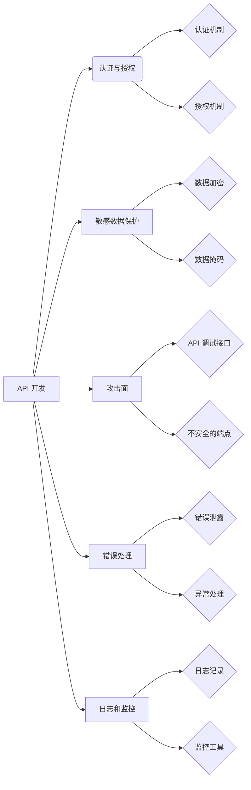

# 定期检查 OWASP API 安全风险清单

> 关键词：OWASP API 安全，安全风险清单，API 安全性评估，漏洞扫描，安全最佳实践，API 设计，安全漏洞，预防措施

## 1. 背景介绍

随着互联网和移动应用的普及，API（应用程序编程接口）已成为现代软件开发和集成的重要组成部分。API允许不同的系统和服务之间进行交互，提供了灵活性和可扩展性。然而，随着API数量的增加，安全问题也日益突出。OWASP（开放 Web 应用安全项目）是一个国际性的非营利组织，致力于提高软件的安全性。OWASP API 安全风险清单提供了针对API安全的关键风险和防御措施。

## 2. 核心概念与联系

### 2.1 API 安全概述

API安全是指在API的设计、开发和部署过程中，确保API免受各种攻击和漏洞的影响。这包括保护API免受未经授权的访问、数据泄露、服务拒绝和其他恶意攻击。

### 2.2 OWASP API 安全风险清单

OWASP API 安全风险清单是一套标准化的安全评估工具，旨在帮助开发者识别和缓解API安全风险。该清单涵盖了以下核心概念：

- **认证与授权**：确保只有授权用户才能访问API。
- **敏感数据保护**：保护API传输和存储的敏感数据。
- **攻击面**：识别API的潜在攻击点。
- **错误处理**：防止通过错误消息泄露敏感信息。
- **日志和监控**：记录API活动和异常，以便进行审计和响应。

### 2.3 Mermaid 流程图



## 3. 核心算法原理 & 具体操作步骤

### 3.1 算法原理概述

API安全评估通常涉及以下步骤：

1. **风险评估**：确定API的关键功能和安全要求。
2. **漏洞扫描**：使用自动化工具扫描API以识别已知漏洞。
3. **渗透测试**：模拟攻击者的行为，手动测试API的安全性。
4. **代码审查**：审查API的源代码，查找潜在的安全问题。
5. **安全最佳实践**：实施OWASP API安全风险清单中的建议。

### 3.2 算法步骤详解

#### 3.2.1 风险评估

- **确定API功能**：明确API提供的服务和功能。
- **识别安全要求**：根据业务需求和安全政策，确定API的安全要求。

#### 3.2.2 漏洞扫描

- **选择漏洞扫描工具**：使用OWASP ZAP、Burp Suite等工具进行扫描。
- **执行扫描**：对API进行自动化扫描，识别已知漏洞。

#### 3.2.3 渗透测试

- **编写测试用例**：根据风险评估结果，编写测试用例。
- **执行测试**：模拟攻击者的行为，测试API的安全性。

#### 3.2.4 代码审查

- **审查源代码**：检查API的源代码，查找潜在的安全问题。
- **审查配置文件**：检查API的配置文件，确保安全设置正确。

#### 3.2.5 安全最佳实践

- **实施认证与授权**：使用OAuth 2.0、JWT等认证机制。
- **保护敏感数据**：使用TLS/SSL加密通信，对敏感数据进行加密存储。
- **减少攻击面**：避免不必要的API端点，限制API的使用权限。
- **处理错误**：防止错误信息泄露敏感信息，提供统一的错误处理机制。
- **记录和监控**：记录API活动，使用监控工具跟踪异常行为。

### 3.3 算法优缺点

#### 3.3.1 优点

- **全面性**：OWASP API安全风险清单涵盖了API安全的各个方面。
- **实用性**：提供具体的建议和最佳实践。
- **社区支持**：由全球安全专家共同维护。

#### 3.3.2 缺点

- **需要专业知识**：执行API安全评估需要一定的专业知识。
- **成本**：漏洞扫描和渗透测试可能需要投入较大的成本。

### 3.4 算法应用领域

API安全评估适用于所有使用API的应用，包括Web应用、移动应用、物联网设备等。

## 4. 数学模型和公式 & 详细讲解 & 举例说明

### 4.1 数学模型构建

API安全评估的数学模型可以表示为：

$$
\text{API 安全评估} = \text{风险评估} + \text{漏洞扫描} + \text{渗透测试} + \text{代码审查} + \text{安全最佳实践}
$$

### 4.2 公式推导过程

该公式通过对API安全评估的各个步骤进行组合，构建了一个全面的评估模型。

### 4.3 案例分析与讲解

#### 4.3.1 案例一：社交网络API

一个社交网络API可能面临以下安全风险：

- **认证与授权**：未经授权的访问可能导致隐私泄露。
- **敏感数据保护**：用户信息可能被窃取或篡改。
- **攻击面**：API端点可能被滥用。

#### 4.3.2 案例分析

通过OWASP API安全风险清单，我们可以识别出以下潜在漏洞：

- **SQL注入**：攻击者可能通过API输入恶意SQL语句，导致数据库泄露。
- **跨站脚本（XSS）**：攻击者可能在用户界面上注入恶意脚本，劫持用户会话。

## 5. 项目实践：代码实例和详细解释说明

### 5.1 开发环境搭建

1. 安装Python和pip。
2. 安装OWASP ZAP或Burp Suite。

### 5.2 源代码详细实现

#### 5.2.1 使用OWASP ZAP扫描API

```python
# 使用OWASP ZAP进行API扫描的Python代码示例
import zapv2 as zap

# 初始化ZAP实例
zap_api = zap.ZapApi(api_host='localhost', api_port=2222)

# 设置扫描选项
zap_api.scan.set_option('scanxml', 'true')

# 开始扫描
zap_api.scan.start_scan()

# 等待扫描完成
while not zap_api.core.is_scan_finished():
    time.sleep(1)

# 获取扫描结果
results = zap_api.core.get_scan_results()

# 输出结果
for result in results:
    print(f"Vulnerability: {result.name}, Description: {result.description}")
```

### 5.3 代码解读与分析

该代码示例展示了如何使用OWASP ZAP API进行API扫描。首先，初始化ZAP实例并设置扫描选项，然后开始扫描并等待扫描完成。最后，获取扫描结果并输出。

### 5.4 运行结果展示

运行上述代码后，OWASP ZAP将开始扫描API，并将扫描结果输出到控制台。

## 6. 实际应用场景

### 6.1 社交网络API

社交网络API需要确保用户隐私和数据安全，防止未经授权的访问和恶意攻击。

### 6.2 电子商务API

电子商务API需要确保交易安全，防止用户信息和支付信息泄露。

### 6.3 物联网API

物联网API需要确保设备安全，防止恶意攻击导致设备损坏或数据泄露。

## 7. 工具和资源推荐

### 7.1 学习资源推荐

- OWASP API安全风险清单
- 《API Security: Designing APIs That Survive Attacks and Failures》
- 《OWASP API Security Project》

### 7.2 开发工具推荐

- OWASP ZAP
- Burp Suite
- Postman

### 7.3 相关论文推荐

- "API Security: Threats and Defenses" by S. Bapat, et al.
- "API Security Best Practices" by OWASP
- "Security in APIs: An Overview" by M. K. Agarwal, et al.

## 8. 总结：未来发展趋势与挑战

### 8.1 研究成果总结

本文介绍了OWASP API安全风险清单，并详细讲解了API安全评估的原理、方法和应用。通过定期检查API安全风险清单，可以有效地提高API的安全性。

### 8.2 未来发展趋势

- **自动化和智能化**：API安全评估将更加自动化和智能化，减少人工干预。
- **持续集成/持续部署（CI/CD）**：将API安全评估集成到CI/CD流程中，实现自动化测试和部署。
- **安全态势感知**：通过实时监控API活动，及时发现和响应安全事件。

### 8.3 面临的挑战

- **不断变化的攻击手段**：攻击者不断开发新的攻击手段，安全评估需要不断更新。
- **API数量的增加**：随着API数量的增加，安全评估的成本和难度也随之增加。
- **安全意识的提高**：需要提高开发者和运维人员的安全意识，确保API的安全。

### 8.4 研究展望

未来，API安全评估将更加注重自动化、智能化和实时性。同时，需要加强安全意识培训，提高开发者和运维人员的安全素养。

## 9. 附录：常见问题与解答

**Q1：OWASP API安全风险清单包含哪些内容？**

A1：OWASP API安全风险清单包含了认证与授权、敏感数据保护、攻击面、错误处理和日志监控等五个核心概念。

**Q2：如何进行API安全评估？**

A2：进行API安全评估可以通过风险评估、漏洞扫描、渗透测试、代码审查和安全最佳实践等步骤。

**Q3：OWASP API安全风险清单适用于所有API吗？**

A3：OWASP API安全风险清单适用于所有使用API的应用，包括Web应用、移动应用和物联网设备等。

**Q4：如何提高API的安全性？**

A4：提高API的安全性可以通过实施认证与授权、保护敏感数据、减少攻击面、处理错误和记录监控等措施。

作者：禅与计算机程序设计艺术 / Zen and the Art of Computer Programming