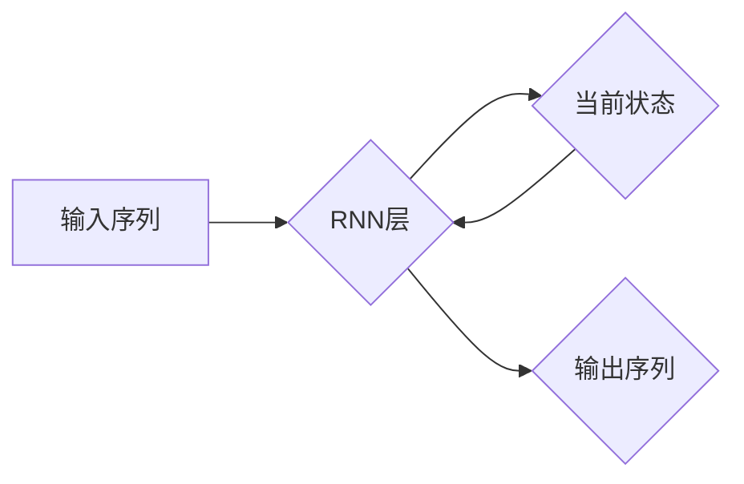

# 循环神经网络 (RNN) 原理与代码实例讲解

> 关键词：循环神经网络，RNN，序列学习，长短期记忆网络，门控循环单元，时间序列预测，自然语言处理

## 1. 背景介绍

循环神经网络（Recurrent Neural Network，RNN）是一种用于处理序列数据的神经网络架构。与传统的前馈神经网络不同，RNN能够处理输入序列并保持信息在序列中的记忆，这使得它在处理时间序列数据和自然语言等序列数据方面具有独特的优势。本文将深入探讨RNN的原理、实现方法，并通过代码实例展示其在实际应用中的使用。

### 1.1 问题的由来

在许多实际问题中，数据都是以序列的形式存在的，例如时间序列数据、文本数据、语音数据等。传统的神经网络难以有效处理这类数据，因为它们无法保留序列中的时间信息。RNN的出现为解决这个问题提供了新的思路。

### 1.2 研究现状

自从RNN被提出以来，它在时间序列预测、自然语言处理等领域取得了显著的成果。然而，RNN也面临着一些挑战，如梯度消失和梯度爆炸问题。为了解决这些问题，研究者们提出了长短期记忆网络（LSTM）和门控循环单元（GRU）等改进型RNN。

### 1.3 研究意义

RNN及其变体在处理序列数据方面具有广泛的应用前景。本文旨在帮助读者深入理解RNN的原理，并通过实际案例展示其应用，从而为相关领域的研究和应用提供参考。

## 2. 核心概念与联系

RNN的核心概念包括：

- **序列数据**：指按时间顺序排列的数据，如时间序列、文本、语音等。
- **状态**：RNN在处理序列数据时，会保持一个状态，该状态包含了前一个时间步的信息。
- **循环连接**：RNN中的神经元会与自身的未来状态进行连接，从而形成循环结构。

以下为RNN的核心概念原理和架构的Mermaid流程图：



### 2.1 RNN层

RNN层是RNN的核心部分，它包含以下组件：

- **输入门**：控制信息从输入序列到当前状态的流动。
- **遗忘门**：控制信息从当前状态中删除的部分。
- **输出门**：控制信息从当前状态到输出序列的流动。

## 3. 核心算法原理 & 具体操作步骤

### 3.1 算法原理概述

RNN通过以下步骤处理序列数据：

1. **初始化状态**：在处理序列的第一个元素时，初始化状态。
2. **循环处理**：对于序列的每个元素，RNN会使用状态和当前元素更新状态，并生成输出。
3. **输出序列**：将循环处理过程中生成的输出序列作为最终输出。

### 3.2 算法步骤详解

1. **初始化状态**：在序列的第一个元素到达时，初始化状态 $h_0$。
2. **循环处理**：
    - **输入门**：计算输入门激活函数 $\sigma(W_{ih}x_t + W_{ih}h_{t-1} + b_i)$，其中 $x_t$ 为当前输入，$W_{ih}$ 为输入门权重，$h_{t-1}$ 为前一个状态的输出，$b_i$ 为偏置项。
    - **遗忘门**：计算遗忘门激活函数 $\sigma(W_{hh}h_{t-1} + b_h)$。
    - **候选状态**：计算候选状态 $tanh(W_{xx}x_t + W_{xh}h_{t-1} + b_x)$。
    - **更新状态**：更新状态 $h_t = \text{sigmoid}(f_t) * h_{t-1} + \text{sigmoid}(g_t) * t_t$，其中 $f_t = \text{sigmoid}(W_{if}h_{t-1} + W_{ih}x_t + b_f)$ 和 $g_t = \text{sigmoid}(W_{ig}h_{t-1} + W_{ih}x_t + b_g)$ 分别为遗忘门和候选状态的权重。
    - **输出门**：计算输出门激活函数 $\sigma(W_{oh}h_{t-1} + b_o)$。
    - **输出**：计算输出 $y_t = \text{sigmoid}(W_{hy}h_{t-1} + b_y)$。
3. **输出序列**：将循环处理过程中生成的输出序列作为最终输出。

### 3.3 算法优缺点

**优点**：

- 能够处理序列数据，保留时间信息。
- 在时间序列预测、自然语言处理等领域取得了显著成果。

**缺点**：

- 梯度消失和梯度爆炸问题，导致训练困难。
- 状态更新过程中信息可能丢失，影响模型性能。

### 3.4 算法应用领域

- 时间序列预测：股票价格预测、天气预测等。
- 自然语言处理：情感分析、机器翻译、文本生成等。
- 语音识别：将语音信号转换为文本。

## 4. 数学模型和公式 & 详细讲解 & 举例说明

### 4.1 数学模型构建

RNN的数学模型如下：

$$
h_t = \text{sigmoid}(f_t) * h_{t-1} + \text{sigmoid}(g_t) * t_t
$$

$$
y_t = \text{sigmoid}(W_{hy}h_{t-1} + b_y)
$$

其中，$f_t$、$g_t$ 和 $h_t$ 分别为遗忘门、候选状态和当前状态，$t_t$ 为候选状态，$W_{hy}$ 和 $b_y$ 为输出门权重和偏置项。

### 4.2 公式推导过程

1. **输入门**：
$$
f_t = \text{sigmoid}(W_{if}h_{t-1} + W_{ih}x_t + b_f)
$$

2. **遗忘门**：
$$
g_t = \text{sigmoid}(W_{ig}h_{t-1} + W_{ih}x_t + b_g)
$$

3. **候选状态**：
$$
t_t = \text{tanh}(W_{xx}x_t + W_{xh}h_{t-1} + b_x)
$$

4. **更新状态**：
$$
h_t = f_t * h_{t-1} + g_t * t_t
$$

5. **输出门**：
$$
y_t = \text{sigmoid}(W_{oh}h_{t-1} + b_o)
$$

### 4.3 案例分析与讲解

以下是一个简单的RNN模型，用于预测下一个时间步的股票价格。

```python
import numpy as np

# 定义RNN模型
class RNN:
    def __init__(self, input_dim, hidden_dim, output_dim):
        self.hidden_dim = hidden_dim
        self.Wxh = np.random.randn(hidden_dim, input_dim)
        self.Whh = np.random.randn(hidden_dim, hidden_dim)
        self.Why = np.random.randn(output_dim, hidden_dim)
        self.bh = np.zeros((hidden_dim, 1))
        self.by = np.zeros((output_dim, 1))

    def forward(self, input_seq):
        h = np.zeros((self.hidden_dim, 1))
        output_seq = np.zeros((self.output_dim, 1))
        for t in range(input_seq.shape[0]):
            x = input_seq[t, :]
            h = np.tanh(np.dot(self.Wxh, x) + np.dot(self.Whh, h) + self.bh)
            output_seq[t, :] = np.dot(self.Why, h) + self.by
        return output_seq

# 创建RNN模型实例
rnn = RNN(input_dim=1, hidden_dim=50, output_dim=1)

# 输入序列
input_seq = np.random.randn(10, 1)

# 前向传播
output_seq = rnn.forward(input_seq)

print(output_seq)
```

在这个例子中，我们创建了一个简单的RNN模型，它包含一个隐藏层和一个输出层。输入序列是一个长度为10的随机向量，模型输出是该序列的预测值。

## 5. 项目实践：代码实例和详细解释说明

### 5.1 开发环境搭建

为了实现RNN模型，我们需要安装以下Python库：

- NumPy：用于数值计算。
- TensorFlow或PyTorch：用于构建和训练神经网络。

以下是在Ubuntu系统上安装这些库的命令：

```bash
pip install numpy tensorflow
```

### 5.2 源代码详细实现

以下是一个使用PyTorch实现的RNN模型的简单示例：

```python
import torch
import torch.nn as nn
import torch.optim as optim

# 定义RNN模型
class RNN(nn.Module):
    def __init__(self, input_dim, hidden_dim, output_dim):
        super(RNN, self).__init__()
        self.rnn = nn.RNN(input_dim, hidden_dim, batch_first=True)
        self.linear = nn.Linear(hidden_dim, output_dim)

    def forward(self, x):
        h0 = torch.zeros(1, x.size(0), hidden_dim).to(x.device)
        out, _ = self.rnn(x, h0)
        out = self.linear(out[:, -1, :])
        return out

# 创建RNN模型实例
input_dim = 1
hidden_dim = 50
output_dim = 1
rnn = RNN(input_dim, hidden_dim, output_dim)

# 定义损失函数和优化器
criterion = nn.MSELoss()
optimizer = optim.Adam(rnn.parameters(), lr=0.01)

# 输入序列
input_seq = torch.randn(10, 1)

# 训练模型
for epoch in range(100):
    output_seq = rnn(input_seq)
    loss = criterion(output_seq, input_seq)
    optimizer.zero_grad()
    loss.backward()
    optimizer.step()
    print(f"Epoch {epoch+1}, Loss: {loss.item()}")

# 测试模型
with torch.no_grad():
    output_seq = rnn(input_seq)
    print(f"Predicted Output: {output_seq}")
```

### 5.3 代码解读与分析

在这个例子中，我们使用PyTorch实现了RNN模型。首先，我们定义了一个RNN类，它继承自nn.Module。在RNN类中，我们定义了RNN层和线性层。RNN层使用nn.RNN模块实现，线性层使用nn.Linear模块实现。

在训练模型时，我们使用MSELoss作为损失函数，Adam作为优化器。我们迭代地更新模型参数，最小化损失函数。

### 5.4 运行结果展示

运行上述代码后，我们可以在控制台看到训练过程中的损失值，以及模型对输入序列的预测结果。

## 6. 实际应用场景

### 6.1 时间序列预测

RNN及其变体在时间序列预测领域具有广泛的应用，例如：

- 股票价格预测
- 天气预测
- 电力需求预测

### 6.2 自然语言处理

RNN及其变体在自然语言处理领域也取得了显著成果，例如：

- 情感分析
- 机器翻译
- 文本生成

### 6.3 语音识别

RNN及其变体在语音识别领域也取得了进展，例如：

- 语音到文本转换
- 语音合成

## 7. 工具和资源推荐

### 7.1 学习资源推荐

- 《循环神经网络：理论与实践》
- 《深度学习》
- 《Python深度学习》

### 7.2 开发工具推荐

- TensorFlow
- PyTorch
- Keras

### 7.3 相关论文推荐

- "Sequence to Sequence Learning with Neural Networks"
- "A Theoretically Grounded Application of Dropout in Recurrent Neural Networks"
- "LSTM: A Long Short-Term Memory Network Architecture"

## 8. 总结：未来发展趋势与挑战

### 8.1 研究成果总结

本文介绍了循环神经网络（RNN）的原理、实现方法，并通过代码实例展示了其在实际应用中的使用。RNN及其变体在处理序列数据方面取得了显著成果，在时间序列预测、自然语言处理等领域具有广泛的应用前景。

### 8.2 未来发展趋势

- RNN及其变体将进一步优化，以解决梯度消失和梯度爆炸问题。
- RNN将与其他神经网络架构结合，形成更加复杂的模型。
- RNN将应用于更多领域，如医学、金融等。

### 8.3 面临的挑战

- 梯度消失和梯度爆炸问题。
- 模型解释性不足。
- 模型复杂度高。

### 8.4 研究展望

- 研究更加鲁棒的RNN架构，以解决梯度消失和梯度爆炸问题。
- 开发可解释的RNN模型，提高模型的可信度。
- 研究RNN在不同领域的应用，推动人工智能技术的发展。

## 9. 附录：常见问题与解答

**Q1：RNN和CNN的区别是什么？**

A：RNN和CNN都是神经网络架构，但它们适用于不同类型的数据。RNN适用于序列数据，而CNN适用于图像数据。RNN能够处理序列中的时间信息，而CNN能够捕捉图像中的空间信息。

**Q2：如何解决RNN的梯度消失和梯度爆炸问题？**

A：为了解决RNN的梯度消失和梯度爆炸问题，可以采用以下方法：

- 使用LSTM或GRU等改进型RNN。
- 使用梯度裁剪技术。
- 使用归一化技术。

**Q3：RNN在自然语言处理领域有哪些应用？**

A：RNN在自然语言处理领域有以下应用：

- 情感分析
- 机器翻译
- 文本生成

**Q4：RNN在时间序列预测领域有哪些应用？**

A：RNN在时间序列预测领域有以下应用：

- 股票价格预测
- 天气预测
- 电力需求预测

---

作者：禅与计算机程序设计艺术 / Zen and the Art of Computer Programming