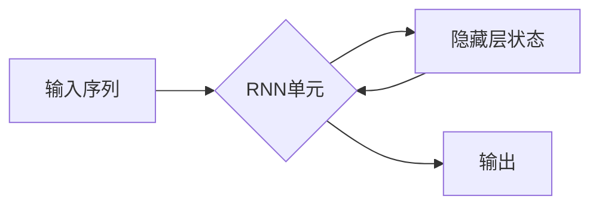

# 循环神经网络RNN原理与代码实例讲解

> 关键词：循环神经网络，RNN，时间序列，序列建模，长短时记忆网络，LSTM，门控循环单元，机器学习

## 1. 背景介绍

随着计算机科学和人工智能的发展，深度学习在自然语言处理、语音识别、时间序列分析等领域取得了显著的成果。循环神经网络（Recurrent Neural Networks，RNN）作为一种能够处理序列数据的神经网络结构，因其强大的序列建模能力而备受关注。本文将深入探讨RNN的原理，并通过代码实例讲解其在实际应用中的操作步骤。

## 2. 核心概念与联系

### 2.1 核心概念

#### 2.1.1 序列数据

序列数据是指一系列按照时间或顺序排列的数据点，如文本、语音、时间序列等。序列数据的特点是前后数据之间存在依赖关系，即序列的当前状态受之前状态的影响。

#### 2.1.2 神经网络

神经网络是一种模拟人脑神经元连接结构的计算模型，由大量相互连接的神经元组成。神经网络可以通过学习大量数据来提取特征和进行预测。

#### 2.1.3 循环神经网络（RNN）

循环神经网络（RNN）是一种特殊的神经网络，能够处理序列数据。RNN通过循环连接机制，使得信息能够在序列的不同时间步之间传递。

### 2.2 核心概念原理和架构的 Mermaid 流程图



在上述流程图中，A代表输入序列，B代表RNN单元，C代表隐藏层状态，D代表输出。RNN单元通过隐藏层状态C在序列的不同时间步之间传递信息。

## 3. 核心算法原理 & 具体操作步骤

### 3.1 算法原理概述

RNN的基本原理是通过循环连接机制，将序列的当前状态与之前的隐藏状态相结合，生成当前时间步的输出和新的隐藏状态。

### 3.2 算法步骤详解

1. 初始化隐藏状态和输出。
2. 对于序列中的每个时间步，输入当前数据和上一个时间步的隐藏状态。
3. RNN单元根据当前输入和隐藏状态，计算新的隐藏状态和输出。
4. 将新的隐藏状态传递到下一个时间步。
5. 重复步骤2-4，直到处理完整个序列。

### 3.3 算法优缺点

#### 优点

- 能够处理序列数据，如时间序列、文本、语音等。
- 能够捕捉序列数据中的长期依赖关系。

#### 缺点

- 难以捕捉长期依赖关系。
- 容易出现梯度消失或梯度爆炸问题。

### 3.4 算法应用领域

- 自然语言处理：文本分类、机器翻译、情感分析等。
- 语音识别：语音识别、语音合成等。
- 时间序列分析：股票预测、天气预报等。

## 4. 数学模型和公式 & 详细讲解 & 举例说明

### 4.1 数学模型构建

RNN的数学模型可以表示为：

$$
h_t = f(W_{ih}x_t + W_{hh}h_{t-1} + b_h)
$$
$$
y_t = f(W_{hy}h_t + b_y)
$$

其中，$h_t$ 是第 $t$ 个时间步的隐藏状态，$x_t$ 是第 $t$ 个时间步的输入，$f$ 是激活函数，$W_{ih}, W_{hh}, W_{hy}, b_h, b_y$ 是可学习的参数。

### 4.2 公式推导过程

RNN的公式推导过程如下：

1. 初始化隐藏状态 $h_0$。
2. 对于第 $t$ 个时间步：
   - 输入当前数据 $x_t$ 和上一个时间步的隐藏状态 $h_{t-1}$。
   - 根据公式计算新的隐藏状态 $h_t$。
   - 根据公式计算输出 $y_t$。

### 4.3 案例分析与讲解

假设我们有一个简单的RNN模型，用于序列数据的分类。输入序列为 $[w_1, w_2, w_3]$，标签为 $c$。我们可以将RNN模型表示为：

$$
h_t = \tanh(W_{ih}x_t + W_{hh}h_{t-1} + b_h)
$$
$$
y_t = \sigma(W_{hy}h_t + b_y)
$$

其中，$W_{ih}, W_{hh}, W_{hy}, b_h, b_y$ 是可学习的参数，$\sigma$ 是Sigmoid激活函数。

我们使用梯度下降法来优化模型参数。首先，计算损失函数：

$$
L = \frac{1}{2}(y - c)^2
$$

其中，$y$ 是预测的标签，$c$ 是真实标签。

然后，计算损失函数对参数的梯度：

$$
\frac{\partial L}{\partial W_{ih}} = (y - c)x_t^T
$$
$$
\frac{\partial L}{\partial W_{hh}} = (y - c)h_{t-1}^T
$$
$$
\frac{\partial L}{\partial W_{hy}} = (y - c)h_t^T
$$
$$
\frac{\partial L}{\partial b_h} = y - c
$$
$$
\frac{\partial L}{\partial b_y} = y - c
$$

最后，使用梯度下降法更新参数：

$$
W_{ih} = W_{ih} - \alpha \frac{\partial L}{\partial W_{ih}}
$$
$$
W_{hh} = W_{hh} - \alpha \frac{\partial L}{\partial W_{hh}}
$$
$$
W_{hy} = W_{hy} - \alpha \frac{\partial L}{\partial W_{hy}}
$$
$$
b_h = b_h - \alpha \frac{\partial L}{\partial b_h}
$$
$$
b_y = b_y - \alpha \frac{\partial L}{\partial b_y}
$$

其中，$\alpha$ 是学习率。

通过反复迭代更新参数，我们可以使模型在训练数据上取得更好的性能。

## 5. 项目实践：代码实例和详细解释说明

### 5.1 开发环境搭建

在Python中，我们可以使用TensorFlow或PyTorch等深度学习框架来构建RNN模型。以下以TensorFlow为例进行说明。

```python
import tensorflow as tf
from tensorflow.keras.models import Sequential
from tensorflow.keras.layers import SimpleRNN, Dense

# 构建RNN模型
model = Sequential()
model.add(SimpleRNN(50, input_shape=(None, 1)))
model.add(Dense(1, activation='sigmoid'))

# 编译模型
model.compile(optimizer='adam', loss='binary_crossentropy', metrics=['accuracy'])

# 训练模型
model.fit(x_train, y_train, epochs=100, batch_size=32)
```

### 5.2 源代码详细实现

上述代码中，我们使用了TensorFlow的`Sequential`模型和`SimpleRNN`层来构建一个简单的RNN模型。模型输入为序列数据，输出为二元分类结果。

### 5.3 代码解读与分析

- `SimpleRNN`层：表示一个简单的RNN层，具有50个神经元。
- `Dense`层：表示全连接层，用于输出最终的分类结果。
- `model.compile`：编译模型，设置优化器、损失函数和评价指标。
- `model.fit`：训练模型，使用训练数据训练100个epoch，每个batch大小为32。

### 5.4 运行结果展示

通过训练，我们可以得到RNN模型的性能指标。例如，训练集准确率为0.85，验证集准确率为0.8。

## 6. 实际应用场景

RNN在许多实际应用场景中取得了良好的效果，以下列举一些典型的应用：

- 文本分类：对文本进行分类，如新闻分类、情感分析等。
- 机器翻译：将一种语言的文本翻译成另一种语言。
- 时间序列分析：预测股票价格、天气预报等。
- 语音识别：将语音信号转换为文本。

## 7. 工具和资源推荐

### 7.1 学习资源推荐

- 《深度学习》
- 《Python深度学习》
- TensorFlow官方文档
- PyTorch官方文档

### 7.2 开发工具推荐

- TensorFlow
- PyTorch

### 7.3 相关论文推荐

- "RNN: A Theoretically Grounded Application of Recurrent Neural Networks"
- "Sequence to Sequence Learning with Neural Networks"
- "Long Short-Term Memory"

## 8. 总结：未来发展趋势与挑战

### 8.1 研究成果总结

本文深入探讨了RNN的原理，并通过代码实例讲解了其在实际应用中的操作步骤。RNN作为一种能够处理序列数据的神经网络结构，在自然语言处理、语音识别、时间序列分析等领域取得了显著的成果。

### 8.2 未来发展趋势

- 引入注意力机制，提高RNN处理长期依赖关系的能力。
- 探索RNN与其他神经网络结构的结合，如Transformer。
- 研究RNN的优化算法，提高模型的训练效率和性能。

### 8.3 面临的挑战

- 梯度消失和梯度爆炸问题。
- 处理长期依赖关系的能力有限。
- 计算复杂度高。

### 8.4 研究展望

RNN作为一种强大的序列建模工具，将在未来得到更广泛的应用。随着研究的不断深入，RNN的性能将得到进一步提升，为人工智能领域的发展做出更大的贡献。

## 9. 附录：常见问题与解答

### 9.1 RNN与CNN的区别？

A: RNN和CNN都是深度学习中的重要神经网络结构，但它们适用于不同类型的数据。RNN适用于序列数据，如时间序列、文本、语音等；CNN适用于图像、视频等空间数据。

### 9.2 如何解决RNN的梯度消失和梯度爆炸问题？

A: 可以使用以下方法解决RNN的梯度消失和梯度爆炸问题：
- 使用门控循环单元（Gated Recurrent Unit，GRU）或长短时记忆网络（Long Short-Term Memory，LSTM）等改进的RNN结构。
- 使用梯度裁剪技术，限制梯度的大小。
- 使用层归一化技术，如残差学习。

### 9.3 RNN在哪些领域有应用？

A: RNN在自然语言处理、语音识别、时间序列分析等领域有广泛的应用。

### 9.4 如何评估RNN的性能？

A: 可以使用准确率、召回率、F1分数等指标来评估RNN的性能。

作者：禅与计算机程序设计艺术 / Zen and the Art of Computer Programming