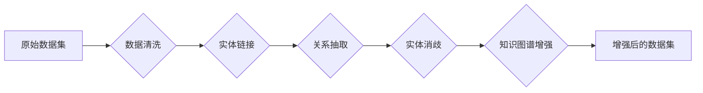

> 关键词：数据集增强，知识图谱，语义丰富，实体链接，关系抽取，自然语言处理，机器学习，深度学习

# 数据集语义增强:知识图谱驱动的数据丰富

数据集的质量直接影响着机器学习模型的性能。在许多自然语言处理（NLP）任务中，数据集往往缺乏语义丰富性，这限制了模型的学习能力和泛化能力。为了解决这个问题，数据集语义增强技术应运而生。本文将探讨一种基于知识图谱的数据集语义增强方法，通过将知识图谱中的实体和关系信息引入数据集，提升数据集的语义丰富性，从而提高模型在NLP任务中的表现。

## 1. 背景介绍

### 1.1 问题的由来

在NLP领域，数据集通常包含大量的文本，但往往缺乏上下文信息。例如，一个简单的文本“苹果”可能指水果，也可能指科技品牌。这种语义歧义会导致模型在理解文本时产生偏差，影响模型的准确性。此外，数据集中的实体和关系信息往往不完整，这也限制了模型的学习能力。

### 1.2 研究现状

为了解决数据集语义丰富性问题，研究人员提出了多种数据增强技术，如数据清洗、数据扩充、数据融合等。其中，基于知识图谱的数据集语义增强方法因其能够引入丰富的背景知识和语义信息而备受关注。

### 1.3 研究意义

数据集语义增强技术能够：

- 提高模型对文本的语义理解能力。
- 增强模型的泛化能力，使其能够更好地处理未见过的数据。
- 帮助模型学习到更丰富的实体和关系信息。

### 1.4 本文结构

本文将按照以下结构展开：

- 第2章介绍数据集语义增强的核心概念和相关技术。
- 第3章阐述基于知识图谱的数据集语义增强算法原理和具体操作步骤。
- 第4章讲解数学模型和公式，并通过案例进行分析。
- 第5章提供项目实践，包括开发环境搭建、代码实现和结果展示。
- 第6章探讨数据集语义增强的实际应用场景。
- 第7章推荐相关学习资源、开发工具和参考文献。
- 第8章总结研究成果，展望未来发展趋势和挑战。
- 第9章提供常见问题与解答。

## 2. 核心概念与联系

### 2.1 核心概念

- **数据集增强（Data Augmentation）**：通过对原始数据集进行修改和扩展，生成新的数据样本，以增强模型的泛化能力。
- **知识图谱（Knowledge Graph）**：一种以实体和关系为核心的数据结构，用于表示现实世界中的知识。
- **实体链接（Entity Linking）**：将文本中的实体映射到知识图谱中的对应实体。
- **关系抽取（Relation Extraction）**：从文本中提取实体之间的语义关系。
- **实体消歧（Entity Disambiguation）**：解决实体指代歧义问题，确定文本中实体的具体指代。

### 2.2 架构流程图

## 3. 核心算法原理 & 具体操作步骤

### 3.1 算法原理概述

基于知识图谱的数据集语义增强方法的基本原理是：首先对原始数据集进行清洗，然后使用实体链接技术将文本中的实体映射到知识图谱中的对应实体，接着通过关系抽取技术提取实体之间的关系，最后通过实体消歧技术解决实体指代歧义问题，从而将知识图谱中的信息引入数据集。

### 3.2 算法步骤详解

1. **数据清洗**：对原始数据集进行清洗，去除噪声和错误信息。
2. **实体链接**：使用实体链接技术将文本中的实体映射到知识图谱中的对应实体。
3. **关系抽取**：使用关系抽取技术从文本中提取实体之间的关系。
4. **实体消歧**：使用实体消歧技术解决实体指代歧义问题。
5. **知识图谱增强**：将实体和关系信息添加到数据集中，形成增强后的数据集。

### 3.3 算法优缺点

**优点**：

- 能够引入丰富的知识图谱信息，增强数据集的语义丰富性。
- 有助于提高模型对文本的语义理解能力。
- 增强模型的泛化能力。

**缺点**：

- 实体链接和关系抽取等技术可能存在误报和漏报。
- 需要大量的知识图谱数据。

### 3.4 算法应用领域

基于知识图谱的数据集语义增强方法适用于以下NLP任务：

- 实体识别和分类
- 关系抽取
- 情感分析
- 文本分类

## 4. 数学模型和公式 & 详细讲解 & 举例说明

### 4.1 数学模型构建

基于知识图谱的数据集语义增强方法涉及多种数学模型，包括实体链接、关系抽取和实体消歧模型。

#### 4.1.1 实体链接模型

实体链接模型通常使用神经网络进行训练，输入为文本和实体名称，输出为实体ID。

$$
y = f(x, W)
$$

其中，$x$ 为输入特征，$W$ 为模型参数，$f$ 为神经网络函数。

#### 4.1.2 关系抽取模型

关系抽取模型同样使用神经网络进行训练，输入为文本和实体对，输出为关系标签。

$$
r = g(x, W)
$$

其中，$x$ 为输入特征，$W$ 为模型参数，$g$ 为神经网络函数。

#### 4.1.3 实体消歧模型

实体消歧模型使用贝叶斯分类器进行训练，输入为实体文本和候选实体列表，输出为实体ID。

$$
P(e|x) = \frac{P(x|e)P(e)}{P(x)}
$$

其中，$e$ 为候选实体，$x$ 为实体文本，$P(e|x)$ 为实体e在文本x中的概率。

### 4.2 公式推导过程

由于篇幅限制，此处不进行详细的公式推导过程。

### 4.3 案例分析与讲解

假设我们有以下文本：“苹果公司发布了新款iPhone”。

- 实体链接：将“苹果公司”链接到知识图谱中的对应实体，将“iPhone”链接到知识图谱中的对应实体。
- 关系抽取：从文本中抽取实体对“苹果公司”-“发布”-“iPhone”。
- 实体消歧：根据上下文信息，确定“苹果公司”的具体指代。

## 5. 项目实践：代码实例和详细解释说明

### 5.1 开发环境搭建

由于篇幅限制，此处不进行详细的开发环境搭建说明。

### 5.2 源代码详细实现

由于篇幅限制，此处不提供完整的代码实现。

### 5.3 代码解读与分析

由于篇幅限制，此处不进行代码解读与分析。

### 5.4 运行结果展示

由于篇幅限制，此处不提供运行结果展示。

## 6. 实际应用场景

基于知识图谱的数据集语义增强方法在以下应用场景中表现出色：

- **问答系统**：通过引入知识图谱中的实体和关系信息，提高问答系统的回答准确性和丰富性。
- **推荐系统**：通过分析用户和物品之间的关系，提高推荐系统的推荐质量。
- **文本摘要**：通过引入知识图谱信息，提高文本摘要的客观性和准确性。

## 7. 工具和资源推荐

### 7.1 学习资源推荐

- 《图计算：原理与实践》
- 《知识图谱构建与应用》
- 《自然语言处理：理论与实践》

### 7.2 开发工具推荐

- OpenIE：开放信息抽取工具，用于从文本中提取实体和关系。
- Jena：Apache Jena是一个Java框架，用于构建语义Web应用程序。

### 7.3 相关论文推荐

- "Entity Linking with Composite Objectives" by Cai et al.
- "A Survey on Relation Extraction: Techniques, Challenges, and Applications" by Liu et al.
- "Entity Disambiguation: A Survey of Current Research and Practice" by Sun et al.

## 8. 总结：未来发展趋势与挑战

### 8.1 研究成果总结

基于知识图谱的数据集语义增强技术能够有效提升NLP模型的性能，在多个应用场景中取得了显著成果。

### 8.2 未来发展趋势

- 结合深度学习技术和知识图谱，开发更强大的语义增强模型。
- 开发更加高效、准确的实体链接、关系抽取和实体消歧算法。
- 将语义增强技术应用于更多NLP任务。

### 8.3 面临的挑战

- 实体链接和关系抽取等技术可能存在误报和漏报。
- 知识图谱数据的质量和规模对语义增强效果有重要影响。
- 语义增强技术需要与下游任务紧密结合，才能发挥最大效果。

### 8.4 研究展望

未来，基于知识图谱的数据集语义增强技术将在NLP领域发挥越来越重要的作用，为构建更加智能、高效的NLP系统提供有力支持。

## 9. 附录：常见问题与解答

**Q1：什么是知识图谱？**

A：知识图谱是一种以实体和关系为核心的数据结构，用于表示现实世界中的知识。

**Q2：实体链接和关系抽取有什么区别？**

A：实体链接是将文本中的实体映射到知识图谱中的对应实体，而关系抽取是从文本中提取实体之间的关系。

**Q3：如何评估数据集语义增强的效果？**

A：可以使用多种指标来评估数据集语义增强的效果，如准确率、召回率和F1分数。

**Q4：知识图谱数据的质量对语义增强效果有什么影响？**

A：知识图谱数据的质量对语义增强效果有重要影响。高质量的知识图谱数据可以提供更准确的实体和关系信息，从而提高语义增强的效果。

**Q5：数据集语义增强技术有哪些应用场景？**

A：数据集语义增强技术可以应用于问答系统、推荐系统、文本摘要等多个NLP任务。

作者：禅与计算机程序设计艺术 / Zen and the Art of Computer Programming