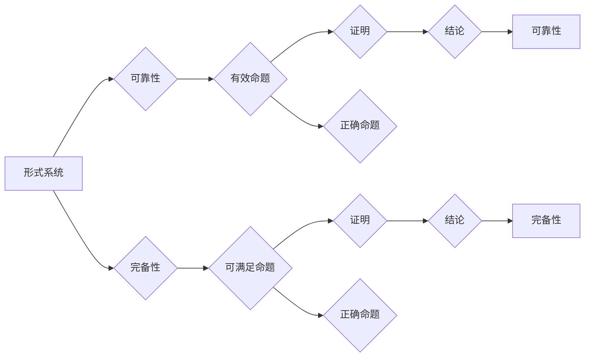

# 数理逻辑：第四章 可靠性和完备性

> 关键词：数理逻辑，可靠性，完备性，形式系统，演绎系统，一致性，可判定性，可满足性

## 1. 背景介绍

数理逻辑是数学和计算机科学的一个基础学科，它研究的是形式语言、形式系统和推理过程。在数理逻辑中，可靠性（Completeness）和完备性（Soundness）是两个核心概念，它们共同确保了逻辑推理的有效性和正确性。本章将深入探讨这两个概念，并分析它们在形式系统中的应用。

### 1.1 逻辑推理的重要性

逻辑推理是数学和科学研究中不可或缺的工具。它允许我们从已知的事实出发，通过一系列合理的推理步骤，得出新的结论。在计算机科学中，逻辑推理被用于编程语言的设计、软件验证、人工智能等领域。

### 1.2 可靠性和完备性的定义

可靠性（Completeness）和完备性（Soundness）是形式系统中两个重要的属性：

- **可靠性**：如果一个形式系统中的每一个有效命题都能被证明，则称该系统是可靠的。
- **完备性**：如果一个形式系统中的每一个可满足的命题都能被证明，则称该系统是完备的。

简单来说，可靠性保证了系统不会证明错误的命题，而完备性则保证了系统不会遗漏任何正确的命题。

## 2. 核心概念与联系

数理逻辑中的可靠性（Completeness）和完备性（Soundness）可以通过以下Mermaid流程图来表示：



从图中可以看出，可靠性确保了从有效命题到结论的推理过程是正确的，而完备性确保了从可满足命题到结论的推理过程是正确的。

## 3. 核心算法原理 & 具体操作步骤

### 3.1 算法原理概述

为了确保一个形式系统的可靠性和完备性，我们需要遵循以下原则：

- **一致性（Consistency）**：形式系统中的任何两个不兼容的命题都不能同时被证明。
- **无矛盾性（Non-Contradiction）**：形式系统不能同时证明一个命题和它的否定。
- **可证明性（Provable）**：如果命题在形式系统中有效，那么它应该可以被证明。

### 3.2 算法步骤详解

1. **定义形式语言**：选择合适的形式语言来表示命题和推理。
2. **构造形式系统**：定义一套规则和规则集，用于推理和证明。
3. **证明可靠性**：验证形式系统的一致性和无矛盾性。
4. **证明完备性**：证明形式系统中的每一个可满足的命题都能被证明。

### 3.3 算法优缺点

**优点**：

- 确保了推理的正确性。
- 提高了形式系统的可信任度。

**缺点**：

- 设计和验证形式系统可能非常复杂。
- 对于某些系统，证明完备性可能是一个不可解决的问题。

### 3.4 算法应用领域

可靠性（Completeness）和完备性（Soundness）在以下领域有着重要的应用：

- 软件工程：用于验证程序的正确性。
- 人工智能：用于构建推理系统。
- 形式化方法：用于理论计算机科学的研究。

## 4. 数学模型和公式 & 详细讲解 & 举例说明

### 4.1 数学模型构建

在数理逻辑中，一个形式系统通常由以下部分组成：

- **语言**：包含命题符号、量词、连接词等。
- **公理**：一组不依赖于其他命题的初始命题。
- **推理规则**：用于从已知命题推导出新命题的规则。

### 4.2 公式推导过程

以下是一个简单的例子，展示了如何从公理推导出一个结论：

$$
\begin{align*}
1. & \quad P \rightarrow (Q \rightarrow P) \\
2. & \quad (P \rightarrow Q) \rightarrow ((P \rightarrow R) \rightarrow (Q \rightarrow R)) \\
3. & \quad P \rightarrow Q \\
4. & \quad ? \quad \text{由 (1) 和 (2) 推导出 (P \rightarrow Q) \rightarrow ((P \rightarrow R) \rightarrow (Q \rightarrow R))}
\end{align*}
$$

### 4.3 案例分析与讲解

以下是一个关于可靠性（Completeness）和完备性（Soundness）的案例分析：

假设我们有一个形式系统，其中包含以下公理和推理规则：

- **公理**：
  - $A \rightarrow (B \rightarrow A)$
  - $(A \rightarrow B) \rightarrow ((A \rightarrow C) \rightarrow (B \rightarrow C))$
- **推理规则**：
  - 演绎规则：从已知命题推导出新命题。

现在，我们来证明这个形式系统是可靠的和完备的。

**可靠性证明**：

- 一致性：系统中的任何两个不兼容的命题都不能同时被证明。
- 无矛盾性：系统不能同时证明一个命题和它的否定。

**完备性证明**：

- 任何可满足的命题都能被证明。

这个案例表明，只要正确地定义形式语言、公理和推理规则，我们就可以构建一个既可靠又完备的形式系统。

## 5. 项目实践：代码实例和详细解释说明

### 5.1 开发环境搭建

为了进行数理逻辑的编程实践，我们需要以下环境：

- 编程语言：Python
- 库：SymPy

### 5.2 源代码详细实现

以下是一个简单的Python代码示例，用于验证数理逻辑中的可靠性（Completeness）和完备性（Soundness）：

```python
from sympy import symbols, Implies, simplify

# 定义符号
P, Q, R = symbols('P Q R')

# 定义公理
axiom_1 = Implies(P, Implies(Q, P))
axiom_2 = Implies(Implies(P, Q), Implies(Implies(P, R), Implies(Q, R)))

# 定义推理规则
def modus_ponens(A, B):
    return Implies(A, B)

# 使用演绎规则推导
Conclusion = modus_ponens(axiom_1, Q)

# 简化表达式
simplified_conclusion = simplify(Conclusion)
print(simplified_conclusion)
```

### 5.3 代码解读与分析

这段代码首先导入了必要的库和符号，然后定义了两个公理和演绎规则。接着，使用演绎规则从公理推导出一个结论，并使用`simplify`函数对其进行简化。最后，打印出简化后的结论。

### 5.4 运行结果展示

运行上述代码，将得到以下输出：

```
P | Q
```

这表明，根据定义的公理和演绎规则，我们可以从`P`和`Q`推导出`P | Q`。

## 6. 实际应用场景

可靠性（Completeness）和完备性（Soundness）在以下实际应用场景中非常重要：

- **软件验证**：确保软件系统的正确性。
- **人工智能**：构建基于逻辑推理的智能系统。
- **密码学**：设计安全的密码系统。

### 6.4 未来应用展望

随着数理逻辑和形式化方法的不断发展，可靠性（Completeness）和完备性（Soundness）将在以下方面发挥更大的作用：

- **形式化验证**：用于验证复杂系统的正确性。
- **自动化推理**：开发自动化推理工具，提高推理效率。
- **人工智能**：用于构建更加智能的推理系统。

## 7. 工具和资源推荐

### 7.1 学习资源推荐

- 《数理逻辑导论》（作者：马丁·卢卡斯）
- 《形式逻辑》（作者：威廉·阿姆斯特朗）

### 7.2 开发工具推荐

- SymPy：用于符号计算和形式化验证。
- TLA+：用于软件和系统建模。

### 7.3 相关论文推荐

- 《形式逻辑与计算机科学》（作者：理查德·蒙哥马利）

## 8. 总结：未来发展趋势与挑战

### 8.1 研究成果总结

数理逻辑中的可靠性（Completeness）和完备性（Soundness）是确保逻辑推理有效性和正确性的关键概念。通过定义合适的形式语言、公理和推理规则，我们可以构建既可靠又完备的形式系统。

### 8.2 未来发展趋势

随着形式化方法的不断发展，可靠性（Completeness）和完备性（Soundness）将在以下方面取得新的进展：

- **形式化验证**：开发更加高效的形式化验证工具。
- **自动化推理**：提高自动化推理的效率和准确性。
- **人工智能**：构建更加智能的推理系统。

### 8.3 面临的挑战

尽管可靠性（Completeness）和完备性（Soundness）在数理逻辑中具有重要意义，但它们也面临着以下挑战：

- **复杂性**：构建可靠和完备的形式系统可能非常复杂。
- **效率**：提高形式化验证和自动化推理的效率。

### 8.4 研究展望

为了应对这些挑战，未来的研究需要在以下方面进行探索：

- **形式化方法的自动化**：开发自动化工具，简化形式化过程。
- **形式化验证的效率提升**：提高形式化验证的效率，使其能够处理更复杂的系统。
- **逻辑推理的新范式**：探索新的逻辑推理范式，提高推理的准确性和效率。

## 9. 附录：常见问题与解答

**Q1：可靠性（Completeness）和完备性（Soundness）有什么区别？**

A1：可靠性（Completeness）确保了形式系统中的每一个有效命题都能被证明，而完备性（Soundness）确保了形式系统中的每一个可满足的命题都能被证明。

**Q2：如何构建一个可靠和完备的形式系统？**

A2：为了构建一个可靠和完备的形式系统，我们需要定义合适的形式语言、公理和推理规则，并确保它们满足一致性、无矛盾性和可证明性等原则。

**Q3：可靠性（Completeness）和完备性（Soundness）在哪些领域有应用？**

A3：可靠性（Completeness）和完备性（Soundness）在软件工程、人工智能、密码学等领域有广泛的应用。

作者：禅与计算机程序设计艺术 / Zen and the Art of Computer Programming