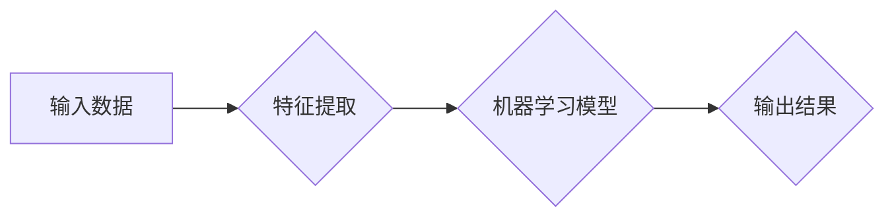

> 机器学习, 监督学习, 无监督学习, 强化学习, 深度学习, 神经网络, 算法原理, 代码实例, 应用实践

# 机器学习 原理与代码实例讲解

## 1. 背景介绍

机器学习（Machine Learning，ML）作为人工智能领域的重要分支，近年来取得了飞速发展。它通过计算机程序从数据中学习，并在各种应用场景中展现出强大的预测和决策能力。本文将深入浅出地讲解机器学习的原理，并通过代码实例展示如何实现和应用机器学习算法。

### 1.1 问题的由来

在现实世界中，我们面临着大量复杂的问题，如语音识别、图像识别、推荐系统等。这些问题往往无法通过传统的编程方法直接解决，需要借助机器学习技术来寻找数据背后的规律和模式。

### 1.2 研究现状

机器学习的研究主要集中在以下几个方向：

- **监督学习（Supervised Learning）**：通过已标注的数据学习输入和输出之间的映射关系。
- **无监督学习（Unsupervised Learning）**：通过未标注的数据学习数据的内在结构。
- **强化学习（Reinforcement Learning）**：通过与环境交互来学习最优策略。

随着深度学习（Deep Learning）的兴起，机器学习在图像、语音、自然语言处理等领域取得了突破性的成果。

### 1.3 研究意义

机器学习技术具有以下意义：

- **提高效率**：自动化处理大量数据，提高工作效率。
- **降低成本**：减少人工干预，降低人力成本。
- **创造价值**：发现数据中的潜在价值，创造新的商业机会。

### 1.4 本文结构

本文将按照以下结构展开：

- 介绍机器学习的核心概念和联系。
- 阐述机器学习的核心算法原理和操作步骤。
- 通过代码实例讲解机器学习算法的实现。
- 探讨机器学习在实际应用场景中的应用。
- 展望机器学习的未来发展趋势与挑战。

## 2. 核心概念与联系

### 2.1 核心概念原理和架构的 Mermaid 流程图



### 2.2 核心概念

- **输入数据（Input Data）**：用于训练和测试的原始数据。
- **特征提取（Feature Extraction）**：将原始数据转换为模型可处理的特征向量。
- **机器学习模型（Machine Learning Model）**：根据特征向量进行学习和预测的模型。
- **输出结果（Output Result）**：模型预测的结果。

## 3. 核心算法原理 & 具体操作步骤

### 3.1 算法原理概述

机器学习算法分为以下几类：

- **监督学习**：通过已标注的数据学习输入和输出之间的映射关系。
- **无监督学习**：通过未标注的数据学习数据的内在结构。
- **强化学习**：通过与环境交互来学习最优策略。

### 3.2 算法步骤详解

- **数据预处理**：对输入数据进行清洗、归一化等操作。
- **特征提取**：将预处理后的数据转换为模型可处理的特征向量。
- **模型选择**：选择合适的机器学习模型。
- **模型训练**：使用训练数据训练模型。
- **模型评估**：使用测试数据评估模型性能。
- **模型优化**：根据评估结果调整模型参数。
- **模型应用**：将训练好的模型应用到实际问题中。

### 3.3 算法优缺点

- **监督学习**：优点是准确度高，缺点是需要大量标注数据。
- **无监督学习**：优点是不需要标注数据，缺点是难以评估模型性能。
- **强化学习**：优点是能够学习到复杂的决策策略，缺点是训练时间长，计算复杂度高。

### 3.4 算法应用领域

机器学习算法在以下领域得到广泛应用：

- **图像识别**：如人脸识别、物体识别等。
- **语音识别**：如语音助手、语音翻译等。
- **自然语言处理**：如文本分类、机器翻译等。
- **推荐系统**：如电影推荐、商品推荐等。
- **医疗诊断**：如疾病预测、药物推荐等。

## 4. 数学模型和公式 & 详细讲解 & 举例说明

### 4.1 数学模型构建

机器学习算法通常基于以下数学模型：

- **线性回归**：$y = \beta_0 + \beta_1 x_1 + \beta_2 x_2 + \cdots + \beta_n x_n$

- **逻辑回归**：$P(y=1) = \frac{1}{1 + e^{-(\beta_0 + \beta_1 x_1 + \beta_2 x_2 + \cdots + \beta_n x_n)}$

- **支持向量机**：$f(x) = \sum_{i=1}^n \alpha_i y_i k(x, x_i) + b$

### 4.2 公式推导过程

以线性回归为例，推导最小二乘法的求解过程：

$$
\beta = (\mathbf{X}^T \mathbf{X})^{-1} \mathbf{X}^T \mathbf{y}
$$

### 4.3 案例分析与讲解

以下使用Python实现线性回归算法：

```python
import numpy as np

def linear_regression(X, y):
    # 添加一列常数项
    X = np.hstack((np.ones((X.shape[0], 1)), X))
    # 求解最小二乘法
    theta = np.linalg.inv(X.T @ X) @ X.T @ y
    return theta

# 示例数据
X = np.array([[1, 2], [2, 3], [3, 4], [4, 5]])
y = np.array([5, 7, 9, 11])

# 训练模型
theta = linear_regression(X, y)

# 预测
x_test = np.array([5, 6])
x_test = np.hstack((np.ones((x_test.shape[0], 1)), x_test))
y_pred = X_test @ theta

print(f"预测值：{y_pred}")
```

## 5. 项目实践：代码实例和详细解释说明

### 5.1 开发环境搭建

- 安装Python和NumPy库。

### 5.2 源代码详细实现

以下使用Python实现逻辑回归算法：

```python
def sigmoid(z):
    return 1 / (1 + np.exp(-z))

def logistic_regression(X, y, theta, alpha=0.01, max_iter=1000):
    m = X.shape[0]
    X = np.hstack((np.ones((m, 1)), X))
    for i in range(max_iter):
        gradients = (X @ theta * (sigmoid(X @ theta) - y)).T / m
        theta = theta - alpha * gradients
    return theta

# 示例数据
X = np.array([[1, 2], [2, 3], [3, 4], [4, 5]])
y = np.array([0, 0, 1, 1])

# 训练模型
theta = logistic_regression(X, y, np.zeros(X.shape[1]))

# 预测
x_test = np.array([5, 6])
x_test = np.hstack((np.ones((x_test.shape[0], 1)), x_test))
y_pred = sigmoid(x_test @ theta)

print(f"预测概率：{y_pred}")
```

### 5.3 代码解读与分析

- `sigmoid`函数：将输入值映射到[0, 1]区间，用于计算逻辑回归的概率。
- `logistic_regression`函数：实现逻辑回归算法。
- `X`：输入数据，包含一个常数项列。
- `y`：真实标签。
- `theta`：模型参数。
- `alpha`：学习率。
- `max_iter`：最大迭代次数。

## 6. 实际应用场景

### 6.1 智能问答系统

智能问答系统可以自动回答用户提出的问题，如“今天天气如何？”、“最近有什么电影推荐？”等。通过机器学习技术，可以训练一个问答系统，使其能够理解用户的问题并给出合适的答案。

### 6.2 智能推荐系统

智能推荐系统可以根据用户的兴趣和喜好，为其推荐相关的内容，如电影、音乐、新闻等。通过机器学习技术，可以训练一个推荐系统，使其能够分析用户的浏览历史和购买记录，并推荐用户可能感兴趣的内容。

### 6.3 智能医疗诊断

智能医疗诊断可以辅助医生进行疾病的诊断和治疗。通过机器学习技术，可以训练一个智能诊断系统，使其能够分析医学影像和病史，并给出初步的诊断结果。

## 7. 工具和资源推荐

### 7.1 学习资源推荐

- 《机器学习》—— 周志华
- 《统计学习方法》—— 李航
- 《深度学习》—— Ian Goodfellow

### 7.2 开发工具推荐

- TensorFlow
- PyTorch
- scikit-learn

### 7.3 相关论文推荐

- "A Few Useful Things to Know about Machine Learning" —— Pedro Domingos
- "The Unsupervised Learning Landscape" —— Dimirza and Bengio
- "Deep Learning" —— Goodfellow, Bengio, Courville

## 8. 总结：未来发展趋势与挑战

### 8.1 研究成果总结

机器学习技术在近年来取得了巨大的进步，为各行各业带来了前所未有的机遇和挑战。

### 8.2 未来发展趋势

- **深度学习**：深度学习将继续发展，并在更多领域得到应用。
- **迁移学习**：迁移学习将得到进一步发展，减少对标注数据的依赖。
- **联邦学习**：联邦学习将保护用户隐私，实现数据本地化处理。

### 8.3 面临的挑战

- **数据隐私**：如何保护用户隐私是一个重要挑战。
- **模型可解释性**：如何提高模型的可解释性是一个重要挑战。
- **算法偏见**：如何消除算法偏见是一个重要挑战。

### 8.4 研究展望

未来，机器学习技术将继续发展，为人类社会带来更多福祉。

## 9. 附录：常见问题与解答

**Q1：什么是机器学习？**

A：机器学习是一种使计算机能够从数据中学习并做出决策的技术。

**Q2：机器学习有哪些应用？**

A：机器学习在图像识别、语音识别、自然语言处理、推荐系统、医疗诊断等领域得到广泛应用。

**Q3：如何选择合适的机器学习算法？**

A：选择合适的机器学习算法需要根据具体问题、数据和资源进行综合考虑。

**Q4：如何提高机器学习模型的性能？**

A：提高机器学习模型性能的方法包括数据预处理、特征工程、模型选择、模型优化等。

**Q5：机器学习技术有哪些挑战？**

A：机器学习技术面临的挑战包括数据隐私、模型可解释性、算法偏见等。

作者：禅与计算机程序设计艺术 / Zen and the Art of Computer Programming