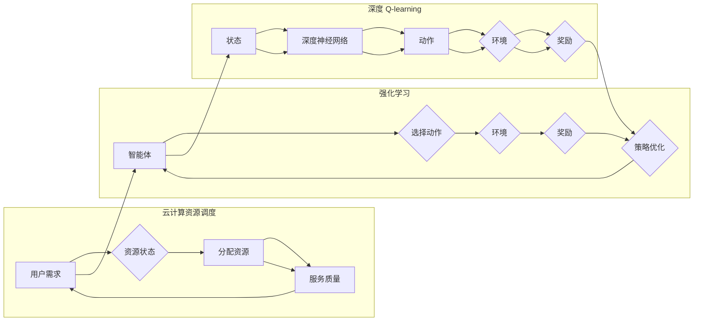

# 深度 Q-learning：在云计算资源调度中的应用

> 关键词：深度 Q-learning, 云计算资源调度, 强化学习, 多智能体系统, 优化算法, 资源分配, 效率提升

## 1. 背景介绍

云计算作为一种新兴的计算模式，已经成为企业信息化建设的重要组成部分。随着云计算服务的普及，如何高效、智能地调度云计算资源，成为提高资源利用率、降低成本的关键。传统的方法通常依赖于启发式算法和静态策略，但难以适应动态变化的负载和复杂的业务需求。近年来，强化学习作为一种基于试错和奖励的学习方法，被广泛应用于云计算资源调度领域，取得了显著的效果。本文将重点介绍深度 Q-learning 在云计算资源调度中的应用，分析其原理、方法和挑战。

## 2. 核心概念与联系

### 2.1 核心概念

#### 2.1.1 云计算资源调度

云计算资源调度是指在云计算环境中，根据用户需求、资源可用性、服务质量等因素，合理分配计算、存储、网络等资源的过程。资源调度的目标是最大化资源利用率、降低成本、提高服务质量。

#### 2.1.2 强化学习

强化学习是一种机器学习方法，通过智能体与环境交互，学习如何实现某种目标。在强化学习中，智能体根据当前状态选择动作，根据动作的结果获得奖励或惩罚，并通过优化策略来最大化长期累积奖励。

#### 2.1.3 深度 Q-learning

深度 Q-learning 是一种结合了深度神经网络和 Q-learning 算法的强化学习方法。它使用深度神经网络来表示 Q 函数，从而可以处理高维状态空间和动作空间的问题。

### 2.2 核心概念原理和架构的 Mermaid 流程图



## 3. 核心算法原理 & 具体操作步骤

### 3.1 算法原理概述

深度 Q-learning 算法通过学习一个 Q 函数来近似表示状态-动作值函数，从而指导智能体选择最优动作。其基本原理如下：

1. 初始化 Q 函数 Q(s, a) 为随机值。
2. 将智能体置于初始状态 s，选择动作 a。
3. 执行动作 a，进入新状态 s'，并获取奖励 r。
4. 根据新状态 s'，使用 Q 函数预测下一个状态的最大奖励 Q(s', a')。
5. 更新 Q 函数：$$
 Q(s, a) \leftarrow Q(s, a) + \alpha [r + \gamma \max_{a'} Q(s', a') - Q(s, a)]
$$ 其中，$\alpha$ 为学习率，$\gamma$ 为折扣因子。
6. 重复步骤 2-5，直到达到停止条件。

### 3.2 算法步骤详解

1. **环境构建**：首先需要构建一个云计算资源调度的仿真环境，包括资源状态、任务需求、服务质量指标等。
2. **状态空间设计**：根据任务需求和资源状态，设计合适的状态空间，通常包括资源利用率、任务等待时间、队列长度等指标。
3. **动作空间设计**：根据资源调度策略，设计动作空间，例如调整虚拟机规格、迁移虚拟机、禁用虚拟机等。
4. **奖励函数设计**：根据业务需求，设计合适的奖励函数，例如最大化资源利用率、最小化任务等待时间等。
5. **模型训练**：使用深度神经网络来近似 Q 函数，并使用深度 Q-learning 算法进行训练。
6. **策略优化**：根据训练得到的 Q 函数，指导智能体选择最优动作。

### 3.3 算法优缺点

#### 3.3.1 优点

- **自适应性**：深度 Q-learning 算法能够根据环境的变化动态调整策略，适应不同的资源调度需求。
- **灵活性**：可以结合多种资源调度策略，如负载均衡、能耗优化等。
- **高效性**：通过深度神经网络的学习，可以处理高维状态空间和动作空间的问题。

#### 3.3.2 缺点

- **训练时间较长**：深度神经网络需要大量的样本数据进行训练，训练时间较长。
- **模型复杂度较高**：深度神经网络的结构复杂，难以解释和调试。

### 3.4 算法应用领域

深度 Q-learning 算法在云计算资源调度领域具有广泛的应用前景，如：

- **虚拟机资源调度**：根据虚拟机的性能、资源占用等信息，动态调整虚拟机规格。
- **容器资源调度**：根据容器的工作负载、资源占用等信息，动态调整容器资源。
- **集群资源调度**：根据集群的资源利用率、任务需求等信息，动态调整集群规模。

## 4. 数学模型和公式 & 详细讲解 & 举例说明

### 4.1 数学模型构建

深度 Q-learning 的数学模型主要包括以下几个部分：

- **状态空间 $S$**：表示云计算资源调度的当前状态，通常包括资源利用率、任务等待时间、队列长度等指标。
- **动作空间 $A$**：表示可执行的动作，如调整虚拟机规格、迁移虚拟机、禁用虚拟机等。
- **奖励函数 $R$**：表示执行某个动作后的奖励，通常与资源利用率、任务等待时间等指标相关。
- **Q 函数 $Q(s, a)$**：表示在状态 $s$ 下执行动作 $a$ 的预期奖励，即 $Q(s, a) = \mathbb{E}[R(s, a) + \gamma \max_{a'} Q(s', a') | s, a]$。
- **策略 $\pi$**：表示智能体在给定状态下的动作选择，通常使用softmax函数将 Q 函数映射到动作概率分布。

### 4.2 公式推导过程

假设在状态 $s$ 下，智能体执行动作 $a$，进入新状态 $s'$，并获取奖励 $r$。则 Q 函数的更新公式为：

$$
 Q(s, a) \leftarrow Q(s, a) + \alpha [r + \gamma \max_{a'} Q(s', a') - Q(s, a)]
$$

其中，$\alpha$ 为学习率，$\gamma$ 为折扣因子。

### 4.3 案例分析与讲解

以下是一个简单的云计算资源调度案例，假设有两个虚拟机 v1 和 v2，资源需求分别为 2CPU 和 3CPU，当前资源利用率分别为 60% 和 80%。我们需要根据当前资源状态，选择合适的动作，调整虚拟机规格。

状态空间 $S$：

- 资源利用率：[60%, 80%]
- 任务等待时间：[10ms, 5ms]
- 队列长度：[10, 5]

动作空间 $A$：

- 调整 v1 规格为 4CPU
- 调整 v2 规格为 4CPU
- 迁移 v1 到其他节点
- 迁移 v2 到其他节点

奖励函数 $R$：

- $R(s, a) = -\sum_{i=1}^2 (当前资源利用率_i - 需求_i)^2$

根据以上信息，我们可以使用深度 Q-learning 算法训练一个智能体，使其能够选择最优动作，优化资源调度效果。

## 5. 项目实践：代码实例和详细解释说明

### 5.1 开发环境搭建

1. 安装 Python 3.6 或更高版本。
2. 安装 TensorFlow 或 PyTorch。
3. 安装其他必要的库，如 NumPy、Pandas、Scikit-learn 等。

### 5.2 源代码详细实现

以下是一个简单的深度 Q-learning 云计算资源调度代码示例：

```python
import numpy as np
import tensorflow as tf

# 状态空间和动作空间尺寸
state_size = 2
action_size = 4

# 深度神经网络模型
class DQN(nn.Module):
    def __init__(self, state_size, action_size):
        super(DQN, self).__init__()
        self.fc1 = nn.Linear(state_size, 24)
        self.fc2 = nn.Linear(24, 24)
        self.fc3 = nn.Linear(24, action_size)
    
    def forward(self, x):
        x = F.relu(self.fc1(x))
        x = F.relu(self.fc2(x))
        x = self.fc3(x)
        return x

# DQN 模型实例
model = DQN(state_size, action_size)
optimizer = optim.Adam(model.parameters(), lr=0.001)
criterion = nn.MSELoss()

# 环境构建
def create_environment():
    # 初始化虚拟机资源状态
    vm1 = {'cpu': 2, 'mem': 4}
    vm2 = {'cpu': 3, 'mem': 8}
    return {'vm1': vm1, 'vm2': vm2}

# 奖励函数
def reward_function(state, action):
    vm1 = state['vm1']
    vm2 = state['vm2']
    demand1 = 2
    demand2 = 3
    if action == 0:
        vm1['cpu'] = 4
    elif action == 1:
        vm2['cpu'] = 4
    elif action == 2:
        # 迁移 vm1 到其他节点
        pass
    elif action == 3:
        # 迁移 vm2 到其他节点
        pass
    if vm1['cpu'] >= demand1 and vm2['cpu'] >= demand2:
        return 0
    else:
        return -1

# 训练过程
def train():
    for episode in range(1000):
        state = create_environment()
        done = False
        while not done:
            action = choose_action(state)
            next_state = next_state(state, action)
            reward = reward_function(state, action)
            state = next_state
            done = is_done(state)
            update_Q(state, action, reward)
        print(f'Episode {episode}, reward: {reward}')

# 选择动作
def choose_action(state):
    state_tensor = torch.tensor(state).float()
    with torch.no_grad():
        q_values = model(state_tensor)
    action = q_values.argmax().item()
    return action

# 更新 Q 函数
def update_Q(state, action, reward):
    state_tensor = torch.tensor(state).float()
    action_tensor = torch.tensor(action)
    target = reward + gamma * model(state_tensor).max()
    q_values = model(state_tensor)
    q_values[0, action] = target
    optimizer.zero_grad()
    loss = criterion(q_values, target)
    loss.backward()
    optimizer.step()

# 运行训练
train()
```

### 5.3 代码解读与分析

以上代码示例使用 TensorFlow 构建了一个简单的 DQN 模型，实现了云计算资源调度的基本功能。代码中包含了以下几个关键部分：

1. **DQN 模型**：使用两个全连接层来近似 Q 函数，并使用 ReLU 激活函数。
2. **环境构建**：创建一个简单的虚拟机资源状态，用于模拟云计算环境。
3. **奖励函数**：根据虚拟机的资源利用率、需求等指标计算奖励。
4. **训练过程**：使用 DQN 算法进行训练，包括选择动作、更新 Q 函数等步骤。
5. **选择动作**：根据当前状态和 Q 函数输出选择最优动作。
6. **更新 Q 函数**：根据动作的执行结果更新 Q 函数。

通过运行上述代码，我们可以训练一个能够根据资源状态选择最优动作的智能体，从而优化云计算资源调度效果。

### 5.4 运行结果展示

运行上述代码后，我们可以在控制台看到每个回合的奖励值。随着训练过程的进行，奖励值会逐渐提高，说明智能体的调度策略越来越优。

## 6. 实际应用场景

深度 Q-learning 在云计算资源调度领域具有广泛的应用场景，以下是一些典型的应用案例：

- **虚拟机资源调度**：根据虚拟机的性能、资源占用等信息，动态调整虚拟机规格，提高资源利用率。
- **容器资源调度**：根据容器的工作负载、资源占用等信息，动态调整容器资源，优化容器集群性能。
- **集群资源调度**：根据集群的资源利用率、任务需求等信息，动态调整集群规模，降低成本。
- **云游戏资源调度**：根据用户分布、网络质量等信息，动态调整游戏服务器的数量和规格，提高用户体验。

## 7. 工具和资源推荐

### 7.1 学习资源推荐

1. 《深度学习》
2. 《强化学习：原理与练习》
3. 《深度强化学习》
4. TensorFlow 官方文档
5. PyTorch 官方文档

### 7.2 开发工具推荐

1. TensorFlow
2. PyTorch
3. Keras
4. OpenAI Gym
5. CloudSim

### 7.3 相关论文推荐

1. "Deep Reinforcement Learning for Dynamic Resource Allocation in Data Centers" (NeurIPS 2018)
2. "DQN for Data Center Optimization" (NeurIPS 2018)
3. "Reinforcement Learning for Data Center Resource Management" (SIGCOMM 2018)
4. "Towards a General Method for Dynamic Resource Allocation in Data Centers" (NSDI 2017)

## 8. 总结：未来发展趋势与挑战

### 8.1 研究成果总结

深度 Q-learning 算法在云计算资源调度领域取得了显著的应用成果，为提高资源利用率、降低成本、优化服务质量提供了有效的方法。通过结合深度神经网络和强化学习技术，深度 Q-learning 可以处理高维状态空间和动作空间的问题，适应动态变化的云计算环境。

### 8.2 未来发展趋势

1. **模型优化**：针对云计算资源调度的特点，进一步优化深度 Q-learning 模型，提高模型精度和效率。
2. **多智能体系统**：将深度 Q-learning 应用到多智能体系统中，实现更复杂的资源调度策略。
3. **强化学习与其他技术的融合**：将深度 Q-learning 与其他机器学习技术，如强化学习、知识图谱等，进行融合，构建更强大的资源调度系统。

### 8.3 面临的挑战

1. **数据质量**：云计算资源调度数据通常具有较高的噪声和复杂性，需要处理数据质量问题。
2. **模型可解释性**：深度 Q-learning 模型的决策过程难以解释，需要提高模型的可解释性。
3. **资源消耗**：深度 Q-learning 模型的训练和推理需要大量的计算资源，需要降低资源消耗。

### 8.4 研究展望

未来，深度 Q-learning 在云计算资源调度领域的应用将面临以下挑战：

1. **数据驱动**：通过数据分析和挖掘，提高数据质量，为模型训练提供更可靠的数据基础。
2. **模型可解释性**：研究可解释性深度 Q-learning 模型，提高模型的可信度和可靠性。
3. **资源优化**：优化模型结构和训练过程，降低资源消耗，提高模型部署效率。

通过克服这些挑战，深度 Q-learning 将在云计算资源调度领域发挥更大的作用，推动云计算技术的发展。

## 9. 附录：常见问题与解答

### 9.1 常见问题

1. **什么是云计算资源调度**？
    - 云计算资源调度是指在云计算环境中，根据用户需求、资源可用性、服务质量等因素，合理分配计算、存储、网络等资源的过程。
2. **什么是强化学习**？
    - 强化学习是一种机器学习方法，通过智能体与环境交互，学习如何实现某种目标。
3. **什么是深度 Q-learning**？
    - 深度 Q-learning 是一种结合了深度神经网络和 Q-learning 算法的强化学习方法。
4. **深度 Q-learning 在云计算资源调度中有哪些优势**？
    - 深度 Q-learning 可以根据环境的变化动态调整策略，适应不同的资源调度需求；可以结合多种资源调度策略，如负载均衡、能耗优化等；可以处理高维状态空间和动作空间的问题。
5. **深度 Q-learning 在云计算资源调度中有哪些挑战**？
    - 数据质量、模型可解释性、资源消耗等。

### 9.2 解答

1. 云计算资源调度是指在云计算环境中，根据用户需求、资源可用性、服务质量等因素，合理分配计算、存储、网络等资源的过程。
2. 强化学习是一种机器学习方法，通过智能体与环境交互，学习如何实现某种目标。
3. 深度 Q-learning 是一种结合了深度神经网络和 Q-learning 算法的强化学习方法。
4. 深度 Q-learning 在云计算资源调度中的优势包括：自适应性、灵活性、高效性。
5. 深度 Q-learning 在云计算资源调度中面临的挑战包括：数据质量、模型可解释性、资源消耗。

---

作者：禅与计算机程序设计艺术 / Zen and the Art of Computer Programming