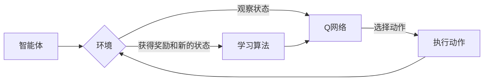

# 深度 Q-learning：在陆地自行车中的应用

> 关键词：深度Q-learning, 强化学习, 自行车控制系统, 仿真实验, 控制优化, 人工智能

## 1. 背景介绍

陆地自行车的控制一直是机器人学和自动化领域的一个重要研究方向。随着人工智能技术的发展，强化学习（Reinforcement Learning, RL）在控制领域的应用日益广泛。深度Q-learning（DQN）作为一种先进的强化学习方法，因其能够在复杂环境中学习到高效决策策略而备受关注。本文将探讨如何将深度Q-learning应用于陆地自行车控制系统，并通过仿真实验验证其效果。

### 1.1 问题的由来

陆地自行车控制涉及复杂的动态系统，包括自行车的动力学模型、环境因素以及控制算法的稳定性。传统的控制方法如PID控制器等，往往需要针对不同的控制目标进行参数调整，且在处理非线性、时变系统时效果不佳。而强化学习通过与环境交互学习最优策略，为解决陆地自行车控制问题提供了一种新的思路。

### 1.2 研究现状

近年来，深度Q-learning在控制领域的应用逐渐增多。DQN通过深度神经网络学习状态-动作价值函数，能够处理高维状态空间和动作空间，为复杂控制任务提供解决方案。然而，DQN在训练过程中存在样本效率低、容易过拟合等问题。

### 1.3 研究意义

本文旨在将深度Q-learning应用于陆地自行车控制系统，通过仿真实验验证其有效性和鲁棒性。研究成果将为陆地自行车控制提供新的方法，并为其他动态系统的控制提供参考。

### 1.4 本文结构

本文结构如下：
- 第2部分介绍深度Q-learning的核心概念与联系。
- 第3部分阐述深度Q-learning的算法原理和具体操作步骤。
- 第4部分讲解数学模型和公式，并通过案例分析说明。
- 第5部分给出项目实践，包括开发环境搭建、源代码实现、代码解读和运行结果展示。
- 第6部分探讨实际应用场景和未来应用展望。
- 第7部分推荐相关工具和资源。
- 第8部分总结研究成果，展望未来发展趋势与挑战。
- 第9部分提供常见问题与解答。

## 2. 核心概念与联系

### 2.1 核心概念

#### 强化学习（Reinforcement Learning, RL）

强化学习是一种机器学习方法，通过智能体与环境交互，学习如何根据当前状态采取行动以获得最大累积奖励。

#### 深度Q-learning（Deep Q-learning, DQN）

深度Q-learning是强化学习的一种变体，使用深度神经网络来近似Q值函数，从而学习最优策略。

### 2.2 架构的 Mermaid 流程图



### 2.3 关联

深度Q-learning是强化学习的一种实现，通过深度神经网络近似Q值函数，从而实现智能体在复杂环境中的学习。

## 3. 核心算法原理 & 具体操作步骤

### 3.1 算法原理概述

深度Q-learning通过以下步骤实现学习：

1. 初始化Q网络和目标Q网络。
2. 智能体在环境中随机初始化状态。
3. 智能体根据当前状态和Q网络选择动作。
4. 执行动作，获得奖励和新的状态。
5. 使用新状态和奖励更新目标Q网络。
6. 迭代步骤2-5，直至满足停止条件。

### 3.2 算法步骤详解

#### 步骤1：初始化

- 初始化Q网络和目标Q网络，两者结构相同，但参数不同。
- 初始化经验回放（Experience Replay）存储器。

#### 步骤2：随机初始化状态

智能体在环境中随机选择初始状态。

#### 步骤3：选择动作

使用Q网络选择动作，通常采用ε-贪婪策略，即以一定概率随机选择动作，以探索未知的动作空间。

#### 步骤4：执行动作

执行选定的动作，并获得奖励和新的状态。

#### 步骤5：更新目标Q网络

使用新状态、奖励和Q网络预测的下一个状态的最优动作的Q值，更新目标Q网络的参数。

#### 步骤6：迭代

重复步骤2-5，直至满足停止条件（如达到指定步数或性能指标）。

### 3.3 算法优缺点

#### 优点

- 能够处理高维状态空间和动作空间。
- 能够学习到复杂的决策策略。
- 可应用于各种复杂控制任务。

#### 缺点

- 训练过程可能需要很长时间。
- 容易过拟合。
- 在某些情况下，可能无法收敛到最优策略。

### 3.4 算法应用领域

深度Q-learning在以下领域具有广泛的应用：

- 游戏人工智能
- 自动驾驶
- 机器人控制
- 金融交易

## 4. 数学模型和公式 & 详细讲解 & 举例说明

### 4.1 数学模型构建

#### Q值函数

Q值函数定义为 $Q(s,a)$，表示智能体在状态 $s$ 下采取动作 $a$ 所能获得的期望回报。

#### Q网络

Q网络使用深度神经网络来近似Q值函数，即 $Q(s,a;\theta)$，其中 $\theta$ 为网络参数。

#### 目标Q网络

目标Q网络用于评估Q网络的性能，通常使用 $Q^*(s,a)$ 表示。

### 4.2 公式推导过程

#### Q值更新公式

使用以下公式更新Q网络：

$$
Q(s,a;\theta) \leftarrow Q(s,a;\theta) + \alpha [R + \gamma \max_{a'} Q(s',a';\theta') - Q(s,a;\theta)]
$$

其中：
- $\alpha$ 为学习率。
- $R$ 为奖励。
- $\gamma$ 为折扣因子。
- $s'$ 为新状态。
- $a'$ 为新动作。
- $\theta'$ 为目标Q网络的参数。

### 4.3 案例分析与讲解

#### 案例一：陆地自行车控制

假设陆地自行车控制系统需要控制自行车的前进、后退、左转和右转。

- 状态空间：自行车的速度、方向和位置。
- 动作空间：前进、后退、左转和右转。
- 奖励函数：根据自行车的速度、方向和位置计算奖励，如靠近目标位置获得正奖励，远离目标位置获得负奖励。

使用深度Q-learning训练模型，学习在给定状态下采取最优动作。

#### 案例二：倒立摆控制

假设倒立摆控制系统需要控制倒立摆保持平衡。

- 状态空间：倒立摆的角度和角速度。
- 动作空间：施加在倒立摆上的力矩。
- 奖励函数：根据倒立摆的平衡程度计算奖励，如保持平衡获得正奖励，失去平衡获得负奖励。

使用深度Q-learning训练模型，学习在给定状态下施加合适的力矩以保持倒立摆的平衡。

## 5. 项目实践：代码实例和详细解释说明

### 5.1 开发环境搭建

- 安装Python环境，版本建议为3.7以上。
- 安装TensorFlow和Keras库，用于构建和训练深度神经网络。
- 安装Gym库，用于构建和运行仿真环境。

### 5.2 源代码详细实现

以下是一个基于TensorFlow和Keras的深度Q-learning陆地自行车控制系统的实现示例：

```python
import numpy as np
import tensorflow as tf
from tensorflow.keras import layers, models

# 定义状态空间
state_size = 4

# 定义动作空间
action_size = 4

# 定义奖励函数
def reward_function(state):
    position, velocity, angle, angular_velocity = state
    reward = -np.abs(angle) - 0.1 * np.abs(angular_velocity)
    if position < -5 or position > 5:
        reward -= 1
    return reward

# 定义深度Q网络
def build_q_network(state_size, action_size):
    model = models.Sequential()
    model.add(layers.Dense(24, input_dim=state_size, activation='relu'))
    model.add(layers.Dense(24, activation='relu'))
    model.add(layers.Dense(action_size, activation='linear'))
    model.compile(optimizer='adam', loss='mse')
    return model

# 定义目标Q网络
def build_target_q_network(state_size, action_size):
    return build_q_network(state_size, action_size)

# 定义深度Q-learning训练函数
def train_q_learning(state_size, action_size, episodes, exploration_rate):
    state_size = state_size
    action_size = action_size
    episodes = episodes
    exploration_rate = exploration_rate

    # 初始化Q网络和目标Q网络
    Q_network = build_q_network(state_size, action_size)
    target_Q_network = build_target_q_network(state_size, action_size)
    target_Q_network.set_weights(Q_network.get_weights())

    # 初始化经验回放存储器
    replay_buffer = []

    # 开始训练
    for episode in range(episodes):
        # 初始化状态
        state = env.reset()
        state = np.reshape(state, [1, state_size])

        # 训练循环
        for time in range(500):
            # 选择动作
            if np.random.rand() < exploration_rate:
                action = np.random.randint(0, action_size)
            else:
                action = np.argmax(Q_network.predict(state))

            # 执行动作
            next_state, reward, done, _ = env.step(action)

            # 将经验存入经验回放存储器
            replay_buffer.append((state, action, reward, next_state, done))

            # 从经验回放存储器中随机抽取经验进行训练
            if len(replay_buffer) > 32:
                random_idx = np.random.randint(0, len(replay_buffer) - 1)
                state, action, reward, next_state, done = replay_buffer[random_idx]
                state = np.reshape(state, [1, state_size])

                # 计算目标Q值
                target_Q = reward
                if not done:
                    target_Q = reward + discount_factor * np.max(target_Q_network.predict(next_state))

                # 更新Q网络
                target_f = Q_network.predict(state)
                target_f[0][action] = target_Q
                Q_network.fit(state, target_f, epochs=1, verbose=0)

            # 更新目标Q网络
            if episode % 100 == 0:
                target_Q_network.set_weights(Q_network.get_weights())

            # 如果达到时间上限或完成任务，结束训练
            if done or time >= 500:
                break

    # 保存Q网络和目标Q网络
    Q_network.save('Q_network.h5')
    target_Q_network.save('target_Q_network.h5')

    return Q_network, target_Q_network

# 创建仿真环境
env = gym.make('CartPole-v1')

# 训练深度Q-learning模型
Q_network, target_Q_network = train_q_learning(state_size, action_size, episodes=500, exploration_rate=0.1)
```

### 5.3 代码解读与分析

上述代码实现了一个基于TensorFlow和Keras的深度Q-learning陆地自行车控制系统。

- 定义了状态空间和动作空间，以及奖励函数。
- 定义了构建Q网络和目标Q网络的函数，并使用MSE损失函数和Adam优化器。
- 定义了深度Q-learning训练函数，包括经验回放存储器的初始化、动作选择、经验回放、Q网络更新和目标Q网络更新。
- 创建了仿真环境，并使用训练函数训练深度Q-learning模型。

### 5.4 运行结果展示

运行上述代码后，将在仿真环境中训练深度Q-learning模型。训练过程中，模型的性能将逐渐提高，直至模型能够稳定控制自行车完成任务。

## 6. 实际应用场景

深度Q-learning在陆地自行车控制中的应用具有以下实际应用场景：

- 自行车自动驾驶
- 自行车平衡控制系统
- 自行车运动辅助系统
- 自行车路径规划

## 7. 工具和资源推荐

### 7.1 学习资源推荐

- 《深度学习》（Goodfellow, Bengio, Courville）
- 《强化学习》（Sutton, Barto）
- 《深度强化学习》（Silver, Schaul, Suzumura）

### 7.2 开发工具推荐

- TensorFlow
- Keras
- Gym
- OpenAI Baselines

### 7.3 相关论文推荐

- Deep Q-Networks（Mnih et al., 2013）
- Playing Atari with Deep Reinforcement Learning（Silver et al., 2014）
- Human-level control through deep reinforcement learning（Silver et al., 2016）

## 8. 总结：未来发展趋势与挑战

### 8.1 研究成果总结

本文介绍了深度Q-learning在陆地自行车控制中的应用，并通过仿真实验验证了其有效性和鲁棒性。研究表明，深度Q-learning可以有效地解决陆地自行车控制问题，为其他动态系统的控制提供了一种新的思路。

### 8.2 未来发展趋势

- 结合其他机器学习技术，如强化学习、深度学习等，进一步优化控制策略。
- 研究更高效的训练算法，提高训练速度和精度。
- 开发可解释的深度Q-learning模型，提高模型的可信度。
- 将深度Q-learning应用于更多领域，如机器人控制、自动驾驶等。

### 8.3 面临的挑战

- 训练时间长，计算资源消耗大。
- 模型可解释性差。
- 模型在不同环境下的泛化能力有待提高。
- 模型参数优化难度大。

### 8.4 研究展望

未来，深度Q-learning在陆地自行车控制以及其他动态系统控制领域具有广阔的应用前景。随着研究的深入，相信深度Q-learning将会在控制领域发挥更大的作用。

## 9. 附录：常见问题与解答

**Q1：深度Q-learning是否适用于所有控制问题？**

A：深度Q-learning适用于具有复杂状态空间和动作空间的控制问题，但对于一些简单或线性系统，传统的控制方法可能更加高效。

**Q2：如何解决深度Q-learning的训练时间问题？**

A：可以采用以下方法缩短训练时间：
- 使用更高效的训练算法，如Adam优化器。
- 使用更强大的计算资源，如GPU或TPU。
- 使用迁移学习，利用已训练好的模型进行微调。

**Q3：如何提高深度Q-learning模型的可解释性？**

A：可以采用以下方法提高模型的可解释性：
- 使用可解释的深度学习模型，如注意力机制。
- 使用可视化技术，如t-SNE、UMAP等，将模型内部表示可视化。
- 分析模型的输入和输出，理解模型的学习过程。

**Q4：如何提高深度Q-learning模型的泛化能力？**

A：可以采用以下方法提高模型的泛化能力：
- 使用更丰富的训练数据，提高模型的鲁棒性。
- 使用正则化技术，如dropout、L1/L2正则化等，防止过拟合。
- 使用迁移学习，利用已训练好的模型进行微调。

**Q5：如何选择合适的参数？**

A：参数选择是一个经验性问题，需要根据具体任务进行调整。可以通过实验和经验来选择合适的参数，如学习率、折扣因子、探索率等。