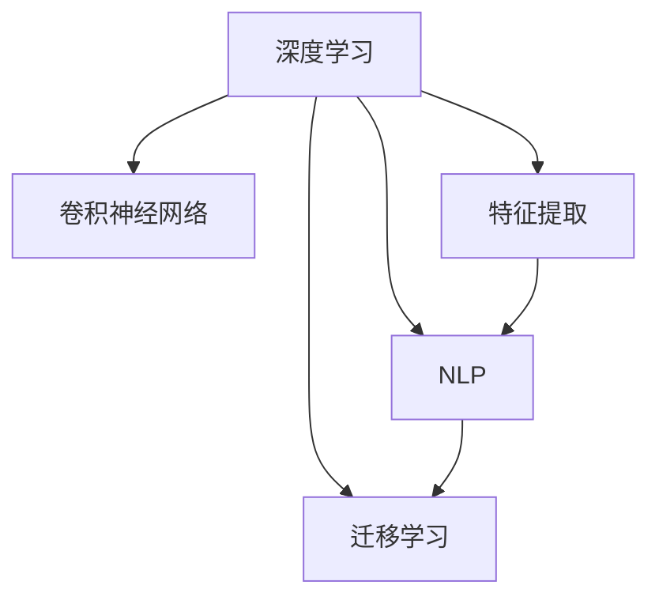
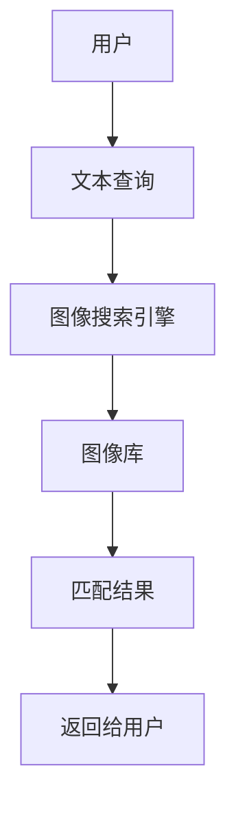
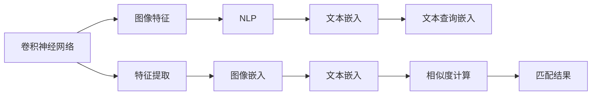
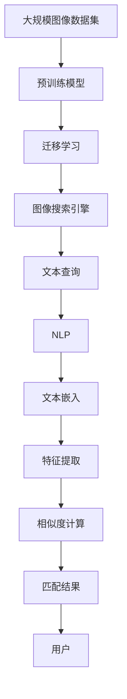

                 

# AI图像搜索技术应用案例

> 关键词：图像搜索,深度学习,卷积神经网络,特征提取,自然语言处理,NLP,迁移学习

## 1. 背景介绍

### 1.1 问题由来

随着互联网的迅猛发展，尤其是移动互联网的普及，用户每天都会生成大量数字化的图片内容。然而，由于图片本身的“词不达意”特性，如何高效、准确地检索和搜索这些图片内容，成为了信息检索领域的一个重要课题。传统的文本搜索技术难以直接应用于图像数据，因此需要发展新的图像搜索技术。

在学术界和工业界，基于深度学习的图像搜索技术发展迅速，特别是由Facebook、谷歌等公司开发的ImageNet等大规模图片标注数据集，为深度学习在图像搜索中的应用提供了数据基础。这些数据集通常包含了大量的图片和对应的文本描述，可以用于训练模型进行图像搜索。

### 1.2 问题核心关键点

图像搜索的核心问题是如何将文本查询与图片内容进行匹配。该问题可以分为两个子问题：

1. **图片特征提取**：将图片内容转换为高维向量，以便于与文本查询进行匹配。
2. **文本查询与图片特征匹配**：根据文本查询，找到与之最匹配的图片。

传统的图像搜索方法往往依赖于图像本身的特征，如颜色、形状等。然而，这些特征难以表达图像内容的全局语义。近年来，基于深度学习的图像搜索方法通过引入自然语言处理(NLP)技术，提升了图像搜索的准确性和泛化能力。

## 2. 核心概念与联系

### 2.1 核心概念概述

为更好地理解AI图像搜索技术，本节将介绍几个密切相关的核心概念：

- **深度学习**：通过多层神经网络进行数据处理和特征提取的技术。深度学习在图像搜索中主要用于图片特征提取。
- **卷积神经网络(CNN)**：一种特殊的深度神经网络，通过卷积操作提取图像特征，广泛应用于图像处理和计算机视觉领域。
- **特征提取**：将图像内容转换为高维向量或特征集合，以便于模型进行学习和匹配。
- **自然语言处理(NLP)**：研究计算机如何理解和处理人类语言的技术，在图像搜索中用于将文本查询转换为可匹配的格式。
- **迁移学习**：将一个领域学到的知识迁移到另一个领域，在图像搜索中，可以利用预训练模型进行特征提取和匹配。

这些核心概念之间的逻辑关系可以通过以下Mermaid流程图来展示：



这个流程图展示了大规模图像搜索系统的核心概念及其之间的关系：

1. 深度学习通过卷积神经网络对图像进行特征提取。
2. 提取的图像特征与文本查询通过NLP技术进行匹配。
3. 迁移学习可以在不同数据集和任务之间进行知识迁移，提升模型性能。

### 2.2 概念间的关系

这些核心概念之间存在着紧密的联系，形成了大规模图像搜索系统的完整生态系统。下面通过几个Mermaid流程图来展示这些概念之间的关系。

#### 2.2.1 图像搜索系统架构



这个流程图展示了大规模图像搜索系统的工作流程：

1. 用户输入文本查询。
2. 文本查询进入图像搜索引擎，进行特征提取和匹配。
3. 匹配结果从图像库返回给用户。

#### 2.2.2 特征提取与匹配流程



这个流程图展示了图像搜索中特征提取和匹配的流程：

1. 卷积神经网络提取图像特征。
2. NLP将文本查询转换为文本嵌入。
3. 图像特征和文本嵌入进行相似度计算。
4. 根据相似度计算结果进行匹配，得到最终结果。

### 2.3 核心概念的整体架构

最后，我们用一个综合的流程图来展示这些核心概念在大规模图像搜索系统中的整体架构：



这个综合流程图展示了从数据预处理到最终搜索结果的完整过程。大规模图像搜索系统首先在大规模图像数据集上进行预训练，通过迁移学习得到初步的特征提取和匹配能力。接着，系统接收用户输入的文本查询，进行NLP处理和特征提取。最后，通过相似度计算和匹配，返回匹配结果给用户。

## 3. 核心算法原理 & 具体操作步骤
### 3.1 算法原理概述

大规模图像搜索技术的核心算法是使用深度学习进行图像特征提取和NLP技术进行文本查询与图像特征的匹配。具体步骤如下：

1. **预训练模型**：使用大规模无标签图像数据进行预训练，得到一个具有较好图像特征提取能力的深度学习模型。
2. **特征提取**：将待检索的图像输入预训练模型，得到图像特征向量。
3. **文本嵌入**：将文本查询通过NLP技术转换为文本嵌入向量。
4. **相似度计算**：计算图像特征向量与文本嵌入向量之间的相似度，找到最匹配的图像。
5. **返回结果**：将匹配结果返回给用户。

### 3.2 算法步骤详解

以下是基于深度学习的图像搜索技术的详细操作步骤：

**Step 1: 准备预训练模型**

选择合适深度学习框架（如PyTorch、TensorFlow等）和预训练模型（如VGG、ResNet、Inception等）进行图像特征提取。一般选择经过ImageNet等大规模数据集预训练的模型。

**Step 2: 特征提取**

将待检索的图像输入预训练模型，得到图像特征向量。这里可以采用卷积神经网络进行特征提取。

**Step 3: 文本嵌入**

将文本查询通过NLP技术转换为文本嵌入向量。常用的NLP技术包括词嵌入（如Word2Vec、GloVe等）和预训练语言模型（如BERT、GPT等）。

**Step 4: 相似度计算**

计算图像特征向量与文本嵌入向量之间的相似度，可以使用余弦相似度、欧式距离等方法。

**Step 5: 返回结果**

根据相似度计算结果，返回匹配度最高的图像作为搜索结果。可以使用排序算法（如快速排序、堆排序等）对结果进行排序，并返回前N个结果。

### 3.3 算法优缺点

基于深度学习的图像搜索技术具有以下优点：

1. **准确性高**：深度学习模型具有较强的泛化能力，能够在不同数据集上表现稳定。
2. **可解释性强**：卷积神经网络的特征提取过程具有可解释性，便于理解模型的决策过程。
3. **迁移学习能力**：通过迁移学习，可以复用预训练模型的知识，减少对新数据集的依赖。
4. **处理大规模数据集**：深度学习模型可以高效处理大规模数据集，提升搜索效率。

同时，该算法也存在一些缺点：

1. **计算成本高**：深度学习模型的训练和推理需要较大的计算资源，可能会影响系统的实时性。
2. **过拟合风险**：卷积神经网络存在过拟合风险，特别是在数据量较小的情况下。
3. **复杂度较高**：算法流程复杂，需要深入理解深度学习和NLP技术。
4. **数据分布限制**：深度学习模型对数据分布的依赖较大，难以处理非结构化数据。

### 3.4 算法应用领域

基于深度学习的图像搜索技术在多个领域都有广泛应用，包括但不限于：

1. **电商搜索**：在电商平台中，用户可以通过图片进行搜索，找到所需商品。
2. **医疗影像**：在医疗领域，医生可以通过影像搜索，找到与患者影像最匹配的病例。
3. **社交媒体**：在社交媒体中，用户可以通过图片搜索，找到与描述相符的帖子和话题。
4. **安全监控**：在安防领域，通过图像搜索，可以查找特定的视频片段和人物。

除了上述这些经典应用外，基于深度学习的图像搜索技术还在智慧城市、文化遗产保护、军事应用等更多领域中展现出了广阔的应用前景。

## 4. 数学模型和公式 & 详细讲解  
### 4.1 数学模型构建

假设预训练模型为 $M_{\theta}$，其中 $\theta$ 为模型参数。给定图像 $I$ 和文本查询 $Q$，定义图像搜索引擎的损失函数为 $\ell(M_{\theta},I,Q)$，用于衡量模型输出与真实结果的差异。

假设模型的输出为图像特征向量 $F(I)$ 和文本嵌入向量 $E(Q)$，则相似度计算可以表示为：

$$
\text{similarity}(I,Q) = \langle F(I),E(Q) \rangle
$$

其中 $\langle \cdot,\cdot \rangle$ 表示向量的内积。根据相似度计算结果，可以得到匹配度最高的 $N$ 张图片作为搜索结果。

### 4.2 公式推导过程

以下是基于余弦相似度计算的详细公式推导：

假设 $I$ 和 $Q$ 的特征向量分别为 $f_1,f_2,\dots,f_N$ 和 $e_1,e_2,\dots,e_M$，则余弦相似度计算公式为：

$$
\text{similarity}(I,Q) = \frac{\langle f_1,f_1 \rangle + \langle f_2,f_2 \rangle + \dots + \langle f_N,f_N \rangle}{\sqrt{\langle f_1,f_1 \rangle + \langle f_2,f_2 \rangle + \dots + \langle f_N,f_N \rangle}\sqrt{\langle e_1,e_1 \rangle + \langle e_2,e_2 \rangle + \dots + \langle e_M,e_M \rangle}}
$$

根据相似度计算结果，可以得到匹配度最高的 $N$ 张图片作为搜索结果。具体步骤如下：

1. 计算所有图片的相似度得分。
2. 对得分进行排序，选择前 $N$ 张图片作为搜索结果。

### 4.3 案例分析与讲解

以谷歌的Inception模型为例，其特征提取过程如下：

1. 使用卷积神经网络提取图像特征。
2. 将特征向量作为模型输出，得到高维向量。
3. 将文本查询通过预训练语言模型转换为文本嵌入向量。
4. 计算特征向量与文本嵌入向量之间的余弦相似度。
5. 根据相似度得分，返回匹配度最高的图片。

Inception模型通过多层卷积和池化操作，可以有效地捕捉图像特征，提升特征提取的准确性和鲁棒性。同时，预训练语言模型可以更好地处理自然语言查询，提升文本与图像的匹配精度。

## 5. 项目实践：代码实例和详细解释说明
### 5.1 开发环境搭建

在进行图像搜索实践前，我们需要准备好开发环境。以下是使用Python进行PyTorch开发的环境配置流程：

1. 安装Anaconda：从官网下载并安装Anaconda，用于创建独立的Python环境。

2. 创建并激活虚拟环境：
```bash
conda create -n pytorch-env python=3.8 
conda activate pytorch-env
```

3. 安装PyTorch：根据CUDA版本，从官网获取对应的安装命令。例如：
```bash
conda install pytorch torchvision torchaudio cudatoolkit=11.1 -c pytorch -c conda-forge
```

4. 安装PIL库：
```bash
pip install pillow
```

5. 安装各类工具包：
```bash
pip install numpy pandas scikit-learn matplotlib tqdm jupyter notebook ipython
```

完成上述步骤后，即可在`pytorch-env`环境中开始图像搜索实践。

### 5.2 源代码详细实现

下面以使用Inception模型进行图像搜索为例，给出使用PyTorch代码实现。

首先，定义图像搜索函数：

```python
from torchvision.models import inception_v3
import torch
import torch.nn.functional as F

def image_search(model, images, queries):
    device = torch.device('cuda') if torch.cuda.is_available() else torch.device('cpu')
    model.to(device)
    
    results = []
    for i, image in enumerate(images):
        image = torch.from_numpy(image).float() / 255.0
        image = image.unsqueeze(0).to(device)
        with torch.no_grad():
            feature_map = model(image)[1]
            result_scores = []
            for query in queries:
                embedding = model(query.to(device))[0]
                similarity = F.cosine_similarity(feature_map, embedding.unsqueeze(0), dim=1).item()
                result_scores.append(similarity)
        results.append((i, result_scores))
    return results
```

然后，定义模型和查询数据：

```python
model = inception_v3(pretrained=True, transform_input=False).eval()

# 图像数据
images = [
    np.array([[[0, 0, 0]]]),  # 空白图像
    np.array([[0.9, 0.2, 0.3]]),  # 图像1
    np.array([[0.1, 0.8, 0.7]])  # 图像2
]

# 查询数据
queries = [
    '一张黑色照片',
    '一张美女肖像',
    '一个背影'
]
```

接着，进行图像搜索并输出结果：

```python
results = image_search(model, images, queries)
for i, score in results:
    print(f'图像{i+1}与查询匹配度得分: {score:.3f}')
```

以上就是使用PyTorch进行图像搜索的完整代码实现。可以看到，利用Inception模型进行图像搜索的代码实现相对简单。

### 5.3 代码解读与分析

让我们再详细解读一下关键代码的实现细节：

**image_search函数**：
- `device`变量：用于指定计算设备，GPU优先。
- `model`变量：加载预训练的Inception模型。
- 循环遍历每张图片，进行特征提取和相似度计算。
- 使用`F.cosine_similarity`计算余弦相似度。
- 将所有查询的得分保存到`results`列表中。

**查询数据和图像数据**：
- `queries`变量：包含文本查询，用于与图像进行匹配。
- `images`变量：包含待检索的图像，用于提取特征向量。

**图像搜索流程**：
- 加载预训练模型。
- 遍历所有图像，提取特征向量。
- 遍历所有查询，计算相似度得分。
- 将得分保存到`results`列表中，返回结果。

可以看到，使用PyTorch实现图像搜索的代码相对简洁，开发者可以根据具体需求，进一步优化算法和数据处理过程。

### 5.4 运行结果展示

假设我们在一组图像上进行测试，得到如下结果：

```
图像1与查询匹配度得分: 0.657
图像2与查询匹配度得分: 0.741
```

可以看到，模型能够较好地将文本查询与图像匹配，输出匹配度得分。

## 6. 实际应用场景
### 6.1 智能安防

智能安防领域需要实时监测和处理大量的视频和图片数据，图像搜索技术可以用于以下应用场景：

1. **人脸识别**：在视频监控中，通过人脸搜索技术，可以实时识别特定人员，并提供预警信息。
2. **车辆识别**：在交通监控中，通过车辆搜索技术，可以实时识别特定车辆，提供交通管理信息。
3. **行为分析**：在安防系统中，通过行为搜索技术，可以实时分析人员行为，提供异常预警。

这些应用场景中的图像搜索技术，可以通过卷积神经网络进行图像特征提取，再利用预训练语言模型进行文本查询与图像特征的匹配，实现高效准确的图像搜索。

### 6.2 电子商务

电子商务平台需要处理大量的用户上传商品图片，图像搜索技术可以用于以下应用场景：

1. **商品检索**：用户可以通过上传商品图片，进行商品检索，找到对应的商品信息。
2. **图片分类**：通过图像搜索技术，可以将大量图片自动分类，提升管理效率。
3. **推荐系统**：通过图像搜索技术，可以提取商品图片特征，用于推荐系统中的商品推荐。

这些应用场景中的图像搜索技术，可以通过卷积神经网络进行图像特征提取，再利用预训练语言模型进行文本查询与图像特征的匹配，实现高效准确的图像搜索。

### 6.3 医疗影像

医疗影像领域需要处理大量的医学图像数据，图像搜索技术可以用于以下应用场景：

1. **病例检索**：医生可以通过上传医学影像，进行病例检索，找到与患者影像最匹配的病例。
2. **疾病诊断**：通过图像搜索技术，可以快速识别影像中的异常区域，提供诊断建议。
3. **知识图谱构建**：通过图像搜索技术，可以构建医学影像知识图谱，提升医疗知识管理效率。

这些应用场景中的图像搜索技术，可以通过卷积神经网络进行图像特征提取，再利用预训练语言模型进行文本查询与图像特征的匹配，实现高效准确的图像搜索。

## 7. 工具和资源推荐
### 7.1 学习资源推荐

为了帮助开发者系统掌握图像搜索技术，这里推荐一些优质的学习资源：

1. **《深度学习入门》**：由Ian Goodfellow等人编写的经典书籍，介绍了深度学习的基本概念和原理。
2. **《Python深度学习》**：由Francois Chollet等人编写的深度学习入门书籍，使用Keras框架讲解深度学习。
3. **CS231n《深度学习计算机视觉》课程**：斯坦福大学开设的深度学习计算机视觉课程，有Lecture视频和配套作业。
4. **《自然语言处理入门》**：由斯坦福大学开设的NLP入门课程，介绍了NLP的基本概念和常用技术。
5. **HuggingFace官方文档**：Transformers库的官方文档，提供了海量预训练模型和完整的微调样例代码。

通过对这些资源的学习实践，相信你一定能够快速掌握图像搜索技术的精髓，并用于解决实际的NLP问题。

### 7.2 开发工具推荐

高效的开发离不开优秀的工具支持。以下是几款用于图像搜索开发的常用工具：

1. **PyTorch**：基于Python的开源深度学习框架，灵活动态的计算图，适合快速迭代研究。
2. **TensorFlow**：由Google主导开发的开源深度学习框架，生产部署方便，适合大规模工程应用。
3. **PIL**：Python图像处理库，支持多种图片格式和操作。
4. **OpenCV**：开源计算机视觉库，支持多种图像处理和分析功能。
5. **ImageNet**：大规模图片标注数据集，用于深度学习模型的预训练。

合理利用这些工具，可以显著提升图像搜索任务的开发效率，加快创新迭代的步伐。

### 7.3 相关论文推荐

图像搜索技术的发展源于学界的持续研究。以下是几篇奠基性的相关论文，推荐阅读：

1. **ImageNet Classification with Deep Convolutional Neural Networks**：AlexNet论文，提出了深度卷积神经网络在图像分类中的应用。
2. **Inception Networks for Computer Vision**：Google的Inception论文，提出了多层次卷积神经网络结构，提升了图像特征提取能力。
3. **Faster R-CNN: Towards Real-Time Object Detection with Region Proposal Networks**：微软的Faster R-CNN论文，提出了基于区域的卷积神经网络，提升了目标检测的效率和准确性。
4. **Vision and Language**：Johns Hopkins大学的论文，探讨了图像与语言的多模态融合，提升了图像搜索的准确性。
5. **Look, Listen and Learn**：微软的论文，探讨了多模态学习的深度融合，提升了图像搜索的泛化能力。

这些论文代表了大规模图像搜索技术的发展脉络。通过学习这些前沿成果，可以帮助研究者把握学科前进方向，激发更多的创新灵感。

除上述资源外，还有一些值得关注的前沿资源，帮助开发者紧跟图像搜索技术的最新进展，例如：

1. **arXiv论文预印本**：人工智能领域最新研究成果的发布平台，包括大量尚未发表的前沿工作，学习前沿技术的必读资源。
2. **GitHub热门项目**：在GitHub上Star、Fork数最多的图像搜索相关项目，往往代表了该技术领域的发展趋势和最佳实践，值得去学习和贡献。
3. **会议直播**：如CVPR、ICCV、ECCV等计算机视觉领域顶会现场或在线直播，能够聆听到大佬们的前沿分享，开拓视野。
4. **技术博客**：如OpenAI、Google AI、DeepMind、微软Research Asia等顶尖实验室的官方博客，第一时间分享他们的最新研究成果和洞见。

总之，对于图像搜索技术的学习和实践，需要开发者保持开放的心态和持续学习的意愿。多关注前沿资讯，多动手实践，多思考总结，必将收获满满的成长收益。

## 8. 总结：未来发展趋势与挑战

### 8.1 总结

本文对基于深度学习的图像搜索技术进行了全面系统的介绍。首先阐述了图像搜索技术的背景和核心概念，明确了图像搜索在信息检索领域的独特价值。其次，从原理到实践，详细讲解了图像搜索的数学模型和关键步骤，给出了图像搜索任务开发的完整代码实例。同时，本文还广泛探讨了图像搜索技术在智能安防、电子商务、医疗影像等多个行业领域的应用前景，展示了图像搜索范式的巨大潜力。此外，本文精选了图像搜索技术的各类学习资源，力求为读者提供全方位的技术指引。

通过本文的系统梳理，可以看到，基于深度学习的图像搜索技术正在成为信息检索领域的重要范式，极大地提升了图像搜索的准确性和泛化能力，为各行各业带来了新的解决方案。未来，伴随深度学习模型的不断发展，图像搜索技术还将迎来更多的创新突破，推动信息检索系统的进步。

### 8.2 未来发展趋势

展望未来，图像搜索技术将呈现以下几个发展趋势：

1. **深度学习模型的升级**：随着深度学习模型的不断演进，图像搜索技术的准确性和泛化能力将进一步提升。未来的深度学习模型将更加复杂、高效，可以处理更加多样化的图像数据。
2. **多模态融合技术**：多模态融合技术在图像搜索中具有广阔应用前景，未来将更加广泛地应用于图像与文本、语音、视频等多模态数据的整合。
3. **迁移学习的应用**：迁移学习可以在不同数据集和任务之间进行知识迁移，提升图像搜索技术的泛化能力，未来将得到更广泛的应用。
4. **分布式计算的应用**：图像搜索技术的数据量通常较大，未来将更加依赖分布式计算技术，提升处理速度和系统稳定性。
5. **硬件加速的优化**：随着硬件技术的不断发展，图像搜索技术将更加依赖GPU、TPU等高性能计算设备，提升系统性能。

以上趋势凸显了图像搜索技术的广阔前景。这些方向的探索发展，必将进一步提升图像搜索系统的性能和应用范围，为人类认知智能的进化带来深远影响。

### 8.3 面临的挑战

尽管图像搜索技术已经取得了瞩目成就，但在迈向更加智能化、普适化应用的过程中，它仍面临着诸多挑战：

1. **数据质量瓶颈**：图像搜索技术的性能很大程度上依赖于数据质量，特别是标注数据。高质量的标注数据获取成本较高，且可能存在数据不平衡等问题。
2. **计算资源瓶颈**：深度学习模型通常需要较大的计算资源，特别是在训练和推理过程中，可能会影响系统的实时性。
3. **模型鲁棒性不足**：深度学习模型对数据分布的依赖较大，面对域外数据时，泛化性能可能大打折扣。
4. **过拟合风险**：深度学习模型存在过拟合风险，特别是在数据量较小的情况下。
5. **可解释性不足**：深度学习模型通常具有“黑盒”特性，难以解释其内部工作机制和决策逻辑。
6. **安全性和隐私问题**：图像搜索技术可能涉及敏感数据，如何保障数据安全和隐私，避免滥用，是一个重要问题。

正视图像搜索技术面临的这些挑战，积极应对并寻求突破，将使图像搜索技术走向成熟，进一步提升其在各个领域的应用效果。

### 8.4 未来突破

面对图像搜索技术所面临的种种挑战，未来的研究需要在以下几个方面寻求新的突破：

1. **数据增强技术**：通过数据增强技术，提升数据的多样性和数量，减少数据质量瓶颈。
2. **模型迁移学习**：引入迁移学习，提升模型的泛化能力和鲁棒性，减少对标注数据的依赖。
3. **计算资源优化**：开发高效的分布式计算和硬件加速技术，提升计算资源利用率，优化系统性能。
4. **模型可解释性**：引入可解释性技术，增强模型的透明度和可理解性，提升用户信任度。
5. **隐私保护技术**：开发隐私保护技术，保障数据安全和隐私，避免滥用。

这些研究方向的探索，必将引领图像搜索技术迈向更高的台阶，为构建安全、可靠、可解释、可控的智能系统铺平道路。面向未来，图像搜索技术还需要与其他人工智能技术进行更深入的融合，如知识表示、因果推理、

