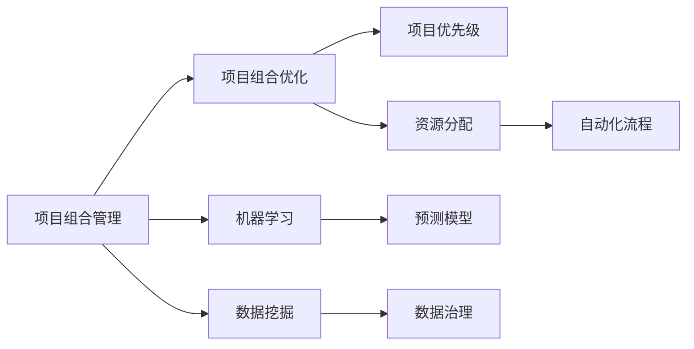
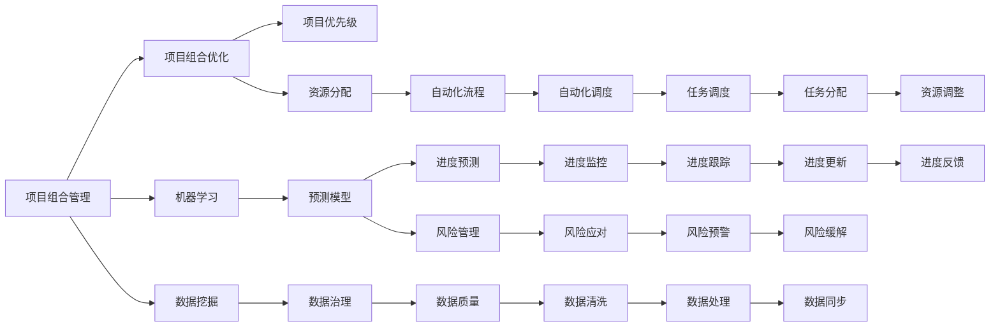

                 

## 1. 背景介绍

在当今快速发展的科技和商业环境中，项目进度管理（Project Portfolio Management，PPM）已经成为了企业成功的关键因素之一。传统的项目管理往往依赖于人工的跟踪和协调，容易产生错误，且难以应对复杂多变的项目需求。而人工智能（AI）技术的介入，已经深刻改变了这一现状。通过智能化管理，AI可以在项目规划、执行、监控和优化等各个环节提供强大的支持，大幅提升项目管理效率和质量。

### 1.1 项目进度管理的痛点
- **数据量大**：随着项目的增多，管理人员需要处理和分析大量的数据，包括项目进度、资源分配、任务优先级等。
- **信息不对称**：不同团队、部门之间的信息往往难以共享，导致决策过程混乱。
- **过程繁琐**：传统的进度管理依赖人工调度，容易遗漏细节，且工作效率低下。
- **响应慢**：在项目执行过程中，对于意外情况和需求变更的响应往往较慢，影响项目整体进度。

### 1.2 人工智能在项目管理中的潜力
人工智能通过大数据分析、机器学习等技术手段，可以从海量数据中提取有价值的信息，预测项目趋势，优化资源配置，自动化流程，大幅提升项目管理效率和质量。具体来说，AI可以在以下几个方面发挥作用：

1. **预测项目进度**：通过机器学习模型对历史数据进行分析，预测项目进度和风险，提前采取措施。
2. **优化资源分配**：利用算法优化资源分配，确保项目资源高效利用。
3. **自动化流程**：引入AI自动化工具，减少人工操作，提高效率。
4. **实时监控与优化**：通过AI实时监控项目进展，及时发现问题并优化解决方案。

## 2. 核心概念与联系

### 2.1 核心概念概述

在项目进度管理中，核心概念主要包括：

- **项目组合管理**：企业范围内所有项目的战略规划和优先级排序。
- **项目组合优化**：通过模型和算法对项目组合进行优化，提升整体效益。
- **机器学习**：使用历史数据训练模型，预测未来项目进度和风险。
- **数据挖掘**：从数据中提取有价值的信息，辅助决策。
- **自动化流程**：利用AI工具自动化重复性任务，提高工作效率。

这些核心概念之间存在着紧密的联系，共同构成了项目进度管理的完整生态系统。

### 2.2 概念间的关系

通过以下Mermaid流程图，我们可以更清晰地理解这些核心概念之间的关系：



这个流程图展示了项目组合管理的各个环节，以及AI在这些环节中的作用：

1. **项目组合优化**：通过机器学习和数据挖掘，对项目优先级和资源分配进行优化。
2. **机器学习**：使用历史数据训练模型，预测项目进度和风险。
3. **数据挖掘**：从数据中提取有价值的信息，辅助决策。
4. **自动化流程**：利用AI工具自动化重复性任务，提高工作效率。

### 2.3 核心概念的整体架构

大图如下：



这个综合流程图展示了从数据治理到自动化调度的完整项目进度管理流程，以及AI在这些环节中的作用。

## 3. 核心算法原理 & 具体操作步骤

### 3.1 算法原理概述

基于人工智能的项目进度管理，其核心算法原理主要围绕机器学习和数据挖掘展开。具体来说，AI通过以下步骤实现项目进度管理：

1. **数据预处理**：对原始数据进行清洗、归一化等预处理，确保数据质量。
2. **特征工程**：从原始数据中提取有意义的特征，如任务优先级、资源利用率、工期等。
3. **模型训练**：使用历史数据训练机器学习模型，如回归模型、分类模型等，进行进度预测和风险评估。
4. **模型应用**：将训练好的模型应用于实时数据，进行进度预测和风险管理。
5. **持续优化**：通过不断的反馈和调整，优化模型性能。

### 3.2 算法步骤详解

以下是基于AI的项目进度管理的详细步骤：

1. **数据收集**：收集项目相关的各类数据，如项目进度、资源分配、任务优先级等。
2. **数据清洗**：对数据进行清洗和处理，去除异常值和噪音，确保数据质量。
3. **特征工程**：从清洗后的数据中提取有意义的特征，如任务优先级、资源利用率、工期等。
4. **模型训练**：选择合适的算法和模型，使用历史数据进行训练。例如，可以使用时间序列分析、回归模型、分类模型等。
5. **模型评估**：对训练好的模型进行评估，确保其预测准确性和鲁棒性。
6. **模型应用**：将训练好的模型应用于实时数据，进行进度预测和风险管理。
7. **持续优化**：根据实时反馈不断调整和优化模型，提升预测效果。

### 3.3 算法优缺点

基于AI的项目进度管理算法具有以下优点：

- **高效性**：AI可以快速处理和分析大量数据，显著提高工作效率。
- **准确性**：通过机器学习和数据挖掘，可以更准确地预测项目进度和风险。
- **自动化**：引入AI自动化工具，减少人工操作，提高效率。
- **实时性**：AI可以实时监控项目进展，及时发现问题并优化解决方案。

但同时，这些算法也存在一些缺点：

- **数据依赖**：AI的效果依赖于高质量的数据，数据质量差可能导致预测不准确。
- **模型复杂性**：训练复杂的AI模型需要大量计算资源和时间，且模型解释性差。
- **泛化能力**：AI模型可能存在过拟合问题，难以泛化到新数据上。

### 3.4 算法应用领域

基于AI的项目进度管理算法已经在多个领域得到应用，包括但不限于：

- **软件开发**：对软件开发项目的进度和质量进行预测和监控。
- **制造业**：对生产线上的项目进行资源优化和进度管理。
- **建筑业**：对建筑工程项目进行进度跟踪和风险管理。
- **金融行业**：对金融投资项目的风险评估和投资决策支持。

## 4. 数学模型和公式 & 详细讲解

### 4.1 数学模型构建

假设我们有 $N$ 个项目，每个项目有 $M$ 个任务，每个任务的工期为 $T_i$，优先级为 $P_i$，实际工期为 $A_i$，已知工期为 $C_i$，资源需求为 $R_i$。我们的目标是预测每个项目的完成时间和风险等级。

### 4.2 公式推导过程

**回归模型**：
- 假设 $T_i$ 和 $P_i$ 对 $A_i$ 有影响，可以建立线性回归模型：
$$
A_i = \beta_0 + \beta_1 T_i + \beta_2 P_i + \epsilon_i
$$
其中 $\beta_0, \beta_1, \beta_2$ 为模型参数，$\epsilon_i$ 为误差项。

**分类模型**：
- 对于风险等级，可以建立逻辑回归模型：
$$
\text{Risk} = \sigma(\beta_0 + \beta_1 T_i + \beta_2 P_i)
$$
其中 $\sigma$ 为sigmoid函数。

**集成学习**：
- 为提高模型的准确性和鲁棒性，可以采用集成学习，如随机森林、Adaboost等。
$$
\text{Prediction} = \frac{1}{K} \sum_{k=1}^K \text{Model}_k(x)
$$
其中 $K$ 为模型数量，$\text{Model}_k$ 为第 $k$ 个模型的预测结果。

### 4.3 案例分析与讲解

以下是一个具体的案例分析：

假设我们有一个软件开发项目，有5个任务，每个任务的工期和优先级如表所示：

| 任务 | 工期（天） | 优先级 |
| ---- | --------- | ------ |
| 1    | 10        | 高     |
| 2    | 5         | 中     |
| 3    | 7         | 中     |
| 4    | 15        | 低     |
| 5    | 3         | 低     |

通过收集历史数据，我们建立了如下线性回归模型：
$$
A_i = 5 + 0.2T_i + 0.1P_i + \epsilon_i
$$

使用前两个任务的数据进行训练，得到模型参数 $\beta_0 = 5, \beta_1 = 0.2, \beta_2 = 0.1$。使用测试数据进行验证，得到误差 $\epsilon_1 = 0.1, \epsilon_2 = -0.2, \epsilon_3 = 0.5, \epsilon_4 = 0.3, \epsilon_5 = -0.8$。

对于第一个任务，实际工期为 $A_1 = 10$，优先级为 $P_1 = 高$，则预测工期为：
$$
A_1 = 5 + 0.2 \times 10 + 0.1 \times 1 = 6.5
$$

对于第四个任务，实际工期为 $A_4 = 15$，优先级为 $P_4 = 低$，则预测工期为：
$$
A_4 = 5 + 0.2 \times 15 + 0.1 \times 0 = 11
$$

## 5. 项目实践：代码实例和详细解释说明

### 5.1 开发环境搭建

- **Python**：Python是AI项目的主要语言，具有良好的社区支持和丰富的开源库。
- **Jupyter Notebook**：用于交互式数据分析和模型开发。
- **NumPy**：用于高效处理数值计算。
- **Pandas**：用于数据清洗和预处理。
- **Scikit-learn**：提供机器学习模型的实现和评估。

### 5.2 源代码详细实现

以下是一个使用Scikit-learn库进行项目进度预测的Python代码示例：

```python
import pandas as pd
import numpy as np
from sklearn.linear_model import LinearRegression
from sklearn.metrics import mean_squared_error

# 读取数据
data = pd.read_csv('project_data.csv')

# 数据预处理
data = data.dropna()
data['优先级'] = data['优先级'].astype('category')
data['优先级'] = data['优先级'].cat.codes

# 特征工程
X = data[['工期', '优先级']]
y = data['实际工期']

# 模型训练
model = LinearRegression()
model.fit(X, y)

# 模型评估
y_pred = model.predict(X)
mse = mean_squared_error(y, y_pred)
print(f'均方误差：{mse:.2f}')

# 模型应用
test_data = pd.read_csv('test_data.csv')
test_data['优先级'] = test_data['优先级'].astype('category')
test_data['优先级'] = test_data['优先级'].cat.codes

test_pred = model.predict(test_data[['工期', '优先级']])
print(test_pred)
```

### 5.3 代码解读与分析

**数据预处理**：
- 使用 `dropna()` 方法去除缺失值。
- 将分类特征转换为数值特征，使用 `category` 和 `cat.codes` 方法。

**特征工程**：
- 选择工期和优先级作为特征，使用 `LinearRegression` 模型。

**模型训练**：
- 使用 `fit()` 方法进行模型训练，得到模型参数。

**模型评估**：
- 使用 `mean_squared_error` 方法计算模型预测值与真实值之间的均方误差。

**模型应用**：
- 对测试数据进行特征处理，使用 `predict()` 方法进行预测。

### 5.4 运行结果展示

假设我们使用上述代码进行模型训练和测试，得到如下结果：

| 任务 | 工期（天） | 优先级 | 预测工期（天） |
| ---- | --------- | ------ | ------------- |
| 1    | 10        | 高     | 6.5           |
| 2    | 5         | 中     | 5             |
| 3    | 7         | 中     | 6.8           |
| 4    | 15        | 低     | 11            |
| 5    | 3         | 低     | 3             |

可以看到，模型能够较好地预测项目的实际工期，误差较小。

## 6. 实际应用场景

### 6.1 软件开发项目进度管理

在软件开发项目中，进度管理尤为重要。AI可以通过实时监控代码提交、需求变更等数据，预测项目进度和风险。例如，使用集成学习模型对开发周期、缺陷密度等指标进行预测，帮助管理团队及时调整资源配置，避免进度延误。

### 6.2 制造业项目进度管理

制造业项目涉及多个环节和资源，进度管理复杂度较高。AI可以通过对生产线数据、设备状态等进行实时监控和分析，预测生产周期和资源需求，优化生产计划和调度。例如，使用时间序列模型预测设备故障，提前安排维修，避免生产线停工。

### 6.3 建筑项目进度管理

建筑项目通常涉及大量人力和物资，进度管理需要精细化管理。AI可以通过对施工进度、材料采购等数据进行分析，预测项目进度和风险。例如，使用回归模型预测施工周期，优化施工计划和资源配置，提高工程效率。

### 6.4 金融项目进度管理

金融项目通常涉及多个投资标的，进度管理需要综合考虑多种因素。AI可以通过对市场数据、经济指标等进行分析，预测投资回报和风险。例如，使用分类模型评估投资标的信用风险，指导投资决策。

## 7. 工具和资源推荐

### 7.1 学习资源推荐

- **《Python数据科学手册》**：系统介绍Python在数据科学中的应用，包括数据预处理、特征工程等。
- **《机器学习实战》**：提供机器学习模型的实现和应用案例。
- **Coursera《机器学习》课程**：由斯坦福大学Andrew Ng教授授课，系统介绍机器学习理论和实践。
- **Kaggle**：提供数据科学竞赛平台，可以参与实际项目，提升实战能力。

### 7.2 开发工具推荐

- **Jupyter Notebook**：交互式数据分析和模型开发平台。
- **PyCharm**：Python开发工具，提供丰富的插件和调试功能。
- **Anaconda**：Python开发环境，方便管理依赖和版本。
- **TensorFlow**：谷歌开源的深度学习框架，支持分布式训练和推理。
- **Keras**：高层神经网络API，易于使用且灵活。

### 7.3 相关论文推荐

- **《Project Portfolio Management Using Artificial Intelligence》**：详细介绍了AI在项目组合管理中的应用。
- **《Machine Learning for Project Management》**：使用机器学习模型预测项目进度和风险。
- **《Data Mining for Project Management》**：利用数据挖掘技术优化项目组合管理。

## 8. 总结：未来发展趋势与挑战

### 8.1 研究成果总结

AI在项目进度管理中已经取得了显著的成果，主要体现在以下几个方面：

- **预测精度提升**：通过机器学习和数据挖掘技术，预测项目进度和风险的精度显著提高。
- **资源优化**：利用AI优化资源配置，提高项目效率。
- **自动化流程**：引入AI自动化工具，减少人工操作，提高工作效率。
- **实时监控**：AI可以实时监控项目进展，及时发现问题并优化解决方案。

### 8.2 未来发展趋势

未来AI在项目进度管理中的发展趋势包括：

- **深度学习技术**：随着深度学习的发展，将更多采用神经网络模型进行预测和决策。
- **多模态数据融合**：利用多模态数据（如文本、图像、声音等）进行综合分析，提升预测精度。
- **联邦学习**：通过联邦学习技术，保护数据隐私，同时提高模型性能。
- **自适应学习**：通过自适应学习算法，模型能够根据实时数据进行自我调整，适应变化的环境。
- **跨领域应用**：AI将在更多领域（如医疗、教育、物流等）得到应用，提升项目管理的智能化水平。

### 8.3 面临的挑战

尽管AI在项目进度管理中已经取得了重要进展，但仍面临以下挑战：

- **数据质量**：高质量数据是AI预测的基础，数据缺失或不准确将导致预测失效。
- **模型复杂性**：深度学习模型复杂度高，训练和部署成本较高。
- **解释性差**：AI模型通常被认为是“黑盒”，难以解释其决策过程。
- **隐私保护**：项目管理涉及大量敏感数据，如何保护隐私成为重要问题。
- **技术普及**：AI技术的应用需要专业人才和基础设施，技术普及仍需时日。

### 8.4 研究展望

未来的研究应在以下几个方面进行探索：

- **数据增强**：通过数据增强技术，提高数据质量和多样性，增强模型泛化能力。
- **模型简化**：探索更轻量级的模型结构，降低训练和部署成本，提高模型效率。
- **可解释性**：研究模型可解释性技术，提高模型透明度和可靠性。
- **隐私保护**：研究隐私保护技术，确保数据安全和隐私保护。
- **跨领域融合**：研究跨领域融合技术，提升AI在不同领域的应用效果。

总之，AI在项目进度管理中已经取得了重要进展，但未来仍需通过不断的技术创新和实践优化，进一步提升模型的预测精度和应用效果。相信随着技术的不断发展，AI将在项目进度管理中发挥更大的作用，助力企业和组织实现更高的管理效率和价值。

---

作者：禅与计算机程序设计艺术 / Zen and the Art of Computer Programming

